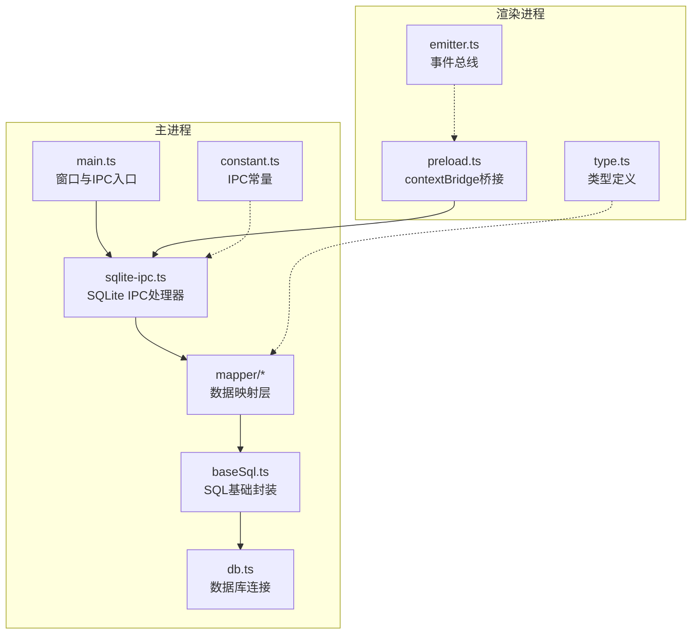
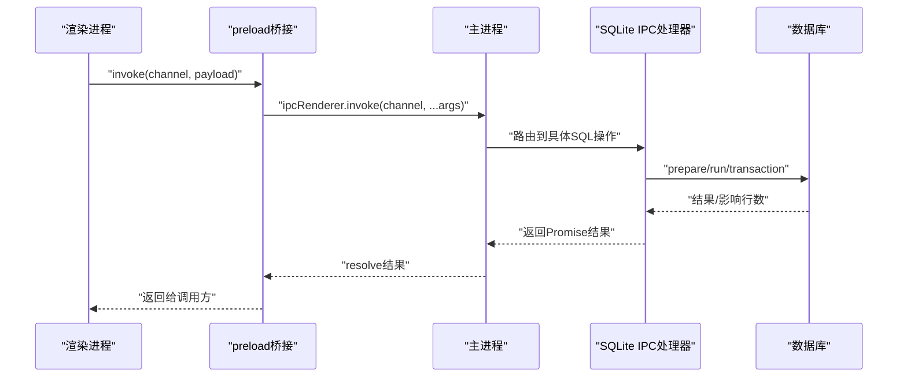
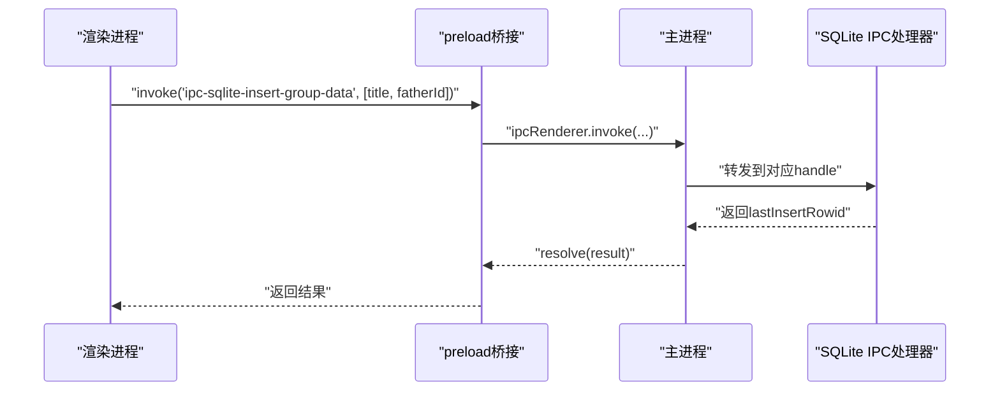
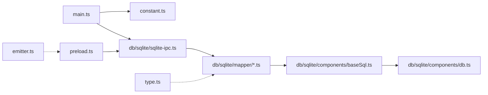

# API参考手册

<cite>
**本文档引用的文件**
- [electron/main.ts](file://electron/main.ts)
- [electron/preload.ts](file://electron/preload.ts)
- [electron/constant.ts](file://electron/constant.ts)
- [electron/db/sqlite/sqlite-ipc.ts](file://electron/db/sqlite/sqlite-ipc.ts)
- [electron/db/sqlite/components/db.ts](file://electron/db/sqlite/components/db.ts)
- [electron/db/sqlite/components/baseSql.ts](file://electron/db/sqlite/components/baseSql.ts)
- [electron/db/sqlite/mapper/config.ts](file://electron/db/sqlite/mapper/config.ts)
- [electron/db/sqlite/mapper/group.ts](file://electron/db/sqlite/mapper/group.ts)
- [electron/db/sqlite/mapper/pwdInfo.ts](file://electron/db/sqlite/mapper/pwdInfo.ts)
- [electron/db/sqlite/mapper/shortcutKey.ts](file://electron/db/sqlite/mapper/shortcutKey.ts)
- [electron/db/sqlite/mapper/version.ts](file://electron/db/sqlite/mapper/version.ts)
- [electron/db/sqlite/mapper/oss.ts](file://electron/db/sqlite/mapper/oss.ts)
- [src/utils/emitter.ts](file://src/utils/emitter.ts)
- [src/components/type.ts](file://src/components/type.ts)
- [package.json](file://package.json)
</cite>

## 目录
1. [简介](#简介)
2. [项目结构](#项目结构)
3. [核心组件](#核心组件)
4. [架构总览](#架构总览)
5. [详细组件分析](#详细组件分析)
6. [依赖关系分析](#依赖关系分析)
7. [性能考量](#性能考量)
8. [故障排除指南](#故障排除指南)
9. [结论](#结论)
10. [附录](#附录)

## 简介
本手册面向密码管理器的开发者与集成者，系统性梳理应用的IPC通信接口、数据库API以及前端事件总线。内容涵盖：
- Electron主进程与渲染进程之间的IPC消息通道与调用约定
- SQLite数据库访问层的SQL接口、参数与返回值规范
- 前端事件总线的使用方式与典型场景
- 错误处理策略、安全注意事项、版本信息与发布配置

## 项目结构
应用采用Electron + Vue 3 + TypeScript的架构，核心API分布在以下层次：
- 主进程入口与窗口生命周期管理：electron/main.ts
- 渲染进程桥接与更新模块：electron/preload.ts
- IPC常量与窗口配置：electron/constant.ts
- SQLite数据库访问与事务封装：electron/db/sqlite/components/*
- 数据映射层（Mapper）：electron/db/sqlite/mapper/*
- 前端事件总线：src/utils/emitter.ts
- 类型定义：src/components/type.ts
- 版本与发布配置：package.json

**图表来源**
- [electron/main.ts:1-240](file://electron/main.ts#L1-L240)
- [electron/constant.ts:1-63](file://electron/constant.ts#L1-L63)
- [electron/db/sqlite/sqlite-ipc.ts:1-220](file://electron/db/sqlite/sqlite-ipc.ts#L1-L220)
- [electron/db/sqlite/components/db.ts:1-30](file://electron/db/sqlite/components/db.ts#L1-L30)
- [electron/db/sqlite/components/baseSql.ts:1-87](file://electron/db/sqlite/components/baseSql.ts#L1-L87)
- [electron/db/sqlite/mapper/config.ts:1-27](file://electron/db/sqlite/mapper/config.ts#L1-L27)
- [electron/preload.ts:1-39](file://electron/preload.ts#L1-L39)
- [src/utils/emitter.ts:1-16](file://src/utils/emitter.ts#L1-L16)
- [src/components/type.ts:1-88](file://src/components/type.ts#L1-L88)

**章节来源**
- [electron/main.ts:1-240](file://electron/main.ts#L1-L240)
- [electron/constant.ts:1-63](file://electron/constant.ts#L1-L63)

## 核心组件
- 主进程IPC入口与窗口控制：负责注册窗口事件、全局快捷键、自动启动、打开外部浏览器、检查/下载/安装更新等。
- SQLite IPC处理器：集中处理数据库相关IPC请求，按功能域拆分为config、group、pwdInfo、shortcutKey、version、oss等子域。
- 数据库连接与SQL封装：统一数据库连接、事务封装、增删改查基础方法。
- 渲染进程桥接：通过contextBridge向渲染进程暴露安全的IPC调用与更新模块。
- 事件总线：基于mitt的轻量事件分发，用于组件间解耦通信。

**章节来源**
- [electron/main.ts:149-227](file://electron/main.ts#L149-L227)
- [electron/db/sqlite/sqlite-ipc.ts:58-219](file://electron/db/sqlite/sqlite-ipc.ts#L58-L219)
- [electron/db/sqlite/components/db.ts:16-30](file://electron/db/sqlite/components/db.ts#L16-L30)
- [electron/db/sqlite/components/baseSql.ts:9-87](file://electron/db/sqlite/components/baseSql.ts#L9-L87)
- [electron/preload.ts:4-38](file://electron/preload.ts#L4-L38)
- [src/utils/emitter.ts:1-16](file://src/utils/emitter.ts#L1-L16)

## 架构总览
下图展示了主进程、渲染进程与数据库层的交互关系，以及IPC通道的命名规范与职责划分。

**图表来源**
- [electron/preload.ts:17-20](file://electron/preload.ts#L17-L20)
- [electron/main.ts:149-227](file://electron/main.ts#L149-L227)
- [electron/db/sqlite/sqlite-ipc.ts:58-219](file://electron/db/sqlite/sqlite-ipc.ts#L58-L219)
- [electron/db/sqlite/components/baseSql.ts:9-87](file://electron/db/sqlite/components/baseSql.ts#L9-L87)

## 详细组件分析

### IPC通信接口规范
- 通道命名规范：以“ipc-sqlite-”开头的功能域通道，辅以动作后缀；其他系统级通道如“ipc-minimize”、“ipc-maximize”等。
- 调用方式：渲染进程通过preload桥接的invoke发送请求，主进程在sqlite-ipc中注册handle处理函数。
- 返回值：所有数据库操作均返回Promise；成功时返回受影响行数、插入ID或查询结果，失败时返回null或0并记录错误日志。

**图表来源**
- [electron/constant.ts:22-45](file://electron/constant.ts#L22-L45)
- [electron/db/sqlite/sqlite-ipc.ts:100-103](file://electron/db/sqlite/sqlite-ipc.ts#L100-L103)
- [electron/db/sqlite/components/baseSql.ts:35-49](file://electron/db/sqlite/components/baseSql.ts#L35-L49)

**章节来源**
- [electron/constant.ts:12-63](file://electron/constant.ts#L12-L63)
- [electron/db/sqlite/sqlite-ipc.ts:58-219](file://electron/db/sqlite/sqlite-ipc.ts#L58-L219)
- [electron/preload.ts:17-20](file://electron/preload.ts#L17-L20)

### 数据库API（SQLite）

#### 连接与事务
- 连接管理：通过单例模式获取数据库实例，路径位于用户数据目录下的本地数据库文件。
- 事务支持：提供批量插入/更新的事务封装示例，建议在导入或批量操作时使用以提升性能与一致性。

**章节来源**
- [electron/db/sqlite/components/db.ts:16-30](file://electron/db/sqlite/components/db.ts#L16-L30)
- [electron/db/sqlite/components/baseSql.ts:52-65](file://electron/db/sqlite/components/baseSql.ts#L52-L65)

#### SQL基础封装
- 查询列表：baseListSql(sql, ...params) → 返回数组或null
- 查询单条：baseGetSql(sql, ...params) → 返回对象或null
- 插入：baseInsertSql(sql, ...params) → 返回lastInsertRowid或0
- 更新：baseUpdateSql(sql, ...params) → 成功返回1，失败返回0

**章节来源**
- [electron/db/sqlite/components/baseSql.ts:9-87](file://electron/db/sqlite/components/baseSql.ts#L9-L87)

#### 功能域接口

##### 配置表（config）
- 更新：updateConfig(value, code)
- 查询：getConfig(code) → Promise<Config>

**章节来源**
- [electron/db/sqlite/mapper/config.ts:8-20](file://electron/db/sqlite/mapper/config.ts#L8-L20)
- [src/components/type.ts:31-38](file://src/components/type.ts#L31-L38)

##### 分组（group）
- 新增：insertGroup(title, fatherId) → lastInsertRowid
- 新增（带ID）：insertGroupByOss(id, title, fatherId)
- 删除：delGroup(id)
- 删除全部：delAllGroup()
- 更新：updateGroup(title, id)
- 列表：listGroup() → Promise<object[]>
- 按标题取ID：getIdByTitle(title) → Promise<number>

**章节来源**
- [electron/db/sqlite/mapper/group.ts:7-48](file://electron/db/sqlite/mapper/group.ts#L7-L48)
- [electron/db/sqlite/components/baseSql.ts:35-49](file://electron/db/sqlite/components/baseSql.ts#L35-L49)

##### 密码信息（pwd_info）
- 新增：insertPwdInfo(groupId, groupTitle)
- 导入新增：insertPwdInfoByImport(...) → 支持多字段
- 删除：delPwdInfo(id)
- 按分组删除：delPwdInfoByGroupId(groupId)
- 删除全部：delAllPwdInfo()
- 更新：updatePwdInfo(...)
- 列表：listPwdInfo(groupId?)
- 搜索：listPwdInfoBySearch(searchValue)
- 按ID集合查询：listPwdInfoByIds(ids[])
- 计数：countPwdInfo(groupId) → number
- 获取单条：getPwdInfo(id)

**章节来源**
- [electron/db/sqlite/mapper/pwdInfo.ts:6-99](file://electron/db/sqlite/mapper/pwdInfo.ts#L6-L99)
- [electron/db/sqlite/components/baseSql.ts:9-32](file://electron/db/sqlite/components/baseSql.ts#L9-L32)

##### 快捷键（shortcut_key）
- 更新：updateShortcutKey(desc, actionName)
- 查询单个：getShortcutKey(actionName) → Promise<ShortCutKeyComb>
- 列表：listShortcutKey() → Promise<ShortCutKeyComb[]>

**章节来源**
- [electron/db/sqlite/mapper/shortcutKey.ts:8-25](file://electron/db/sqlite/mapper/shortcutKey.ts#L8-L25)
- [src/components/type.ts:19-29](file://src/components/type.ts#L19-L29)

##### 更新版本（update_version）
- 查询跳过版本：getSkipVersion() → Promise<UpdateVersion>
- 更新跳过版本：updateSkipVersion(skip_version)
- 查询自动检查开关：getAutoCheckUpateSwitch() → Promise<UpdateVersion>
- 更新自动检查开关：updateAutoCheckSwitch(auto_check_switch)

**章节来源**
- [electron/db/sqlite/mapper/version.ts:9-31](file://electron/db/sqlite/mapper/version.ts#L9-L31)
- [src/components/type.ts:39-47](file://src/components/type.ts#L39-L47)

##### 对象存储（oss）
- 更新：updateOss(region, keyId, key_secret, bucket, type)
- 查询：getOss(type) → Promise<OssForm>

**章节来源**
- [electron/db/sqlite/mapper/oss.ts:8-23](file://electron/db/sqlite/mapper/oss.ts#L8-L23)
- [src/components/type.ts:9-17](file://src/components/type.ts#L9-L17)

### 前端事件总线（mitt）
- 使用mitt创建全局事件发射器，组件可通过on/off/onAny等订阅事件。
- 典型用途：跨组件通知、状态变更广播、轻量数据共享。

**章节来源**
- [src/utils/emitter.ts:1-16](file://src/utils/emitter.ts#L1-L16)

### 主进程系统级IPC
- 窗口控制：最小化、最大化/还原、关闭（隐藏至托盘）
- 自动启动：setAutoStart(flag)
- 打开浏览器：shell.openExternal(url)
- 开发工具：打开/关闭开发者工具
- 首次登录：设置开机自启动
- 全局快捷键：注册/保存快捷键

**章节来源**
- [electron/main.ts:149-200](file://electron/main.ts#L149-L200)
- [electron/main.ts:203-227](file://electron/main.ts#L203-L227)

### 渲染进程桥接与更新模块
- 暴露安全API：on/off/send/invoke及update系列便捷方法
- 更新模块：checkForUpdates、downloadUpdate、installUpdate、getCurrentVersion、下载进度监听

**章节来源**
- [electron/preload.ts:4-38](file://electron/preload.ts#L4-L38)

## 依赖关系分析

**图表来源**
- [electron/main.ts:1-30](file://electron/main.ts#L1-L30)
- [electron/constant.ts:1-63](file://electron/constant.ts#L1-L63)
- [electron/db/sqlite/sqlite-ipc.ts:1-50](file://electron/db/sqlite/sqlite-ipc.ts#L1-L50)
- [electron/db/sqlite/components/baseSql.ts:1-20](file://electron/db/sqlite/components/baseSql.ts#L1-L20)
- [electron/db/sqlite/components/db.ts:1-15](file://electron/db/sqlite/components/db.ts#L1-L15)
- [electron/preload.ts:1-10](file://electron/preload.ts#L1-L10)
- [src/utils/emitter.ts:1-5](file://src/utils/emitter.ts#L1-L5)
- [src/components/type.ts:1-10](file://src/components/type.ts#L1-L10)

**章节来源**
- [electron/main.ts:1-30](file://electron/main.ts#L1-L30)
- [electron/db/sqlite/sqlite-ipc.ts:1-50](file://electron/db/sqlite/sqlite-ipc.ts#L1-L50)

## 性能考量
- 批量操作：优先使用事务封装进行批量插入/更新，减少提交次数。
- 参数化查询：所有SQL均使用参数绑定，避免字符串拼接带来的性能与安全问题。
- 结果集过滤：搜索与按ID查询前先做参数校验与空值过滤，减少无效查询。
- 日志与调试：开发阶段可开启数据库verbose输出，生产环境建议关闭以降低开销。

[本节为通用指导，无需特定文件来源]

## 故障排除指南
- 数据库连接失败：确认数据库文件路径与权限，检查连接单例初始化逻辑。
- 查询为空：核对SQL与参数绑定，确认查询条件与表结构一致。
- IPC调用无响应：检查通道名称是否匹配，确认主进程已注册对应handle。
- 更新模块异常：检查更新服务地址与网络连通性，关注下载进度事件回调。

**章节来源**
- [electron/db/sqlite/components/db.ts:16-30](file://electron/db/sqlite/components/db.ts#L16-L30)
- [electron/db/sqlite/components/baseSql.ts:12-19](file://electron/db/sqlite/components/baseSql.ts#L12-L19)
- [electron/main.ts:203-227](file://electron/main.ts#L203-L227)

## 结论
本手册系统性地整理了密码管理器的IPC通信、数据库访问与前端事件机制。通过明确的通道命名、参数规范与返回值约定，开发者可快速集成与扩展功能；同时结合事务与参数化查询的最佳实践，可在保证安全性的同时获得良好的性能表现。

[本节为总结性内容，无需特定文件来源]

## 附录

### 版本信息与发布配置
- 当前版本：2.3.4
- 发布目标：Electron主进程入口指向dist-electron/main.js
- 发布仓库：generic provider，URL指向指定服务器

**章节来源**
- [package.json:4,49:4-49](file://package.json#L4-L49)

### 常见用例与最佳实践
- 新增分组并获取ID：使用insertGroup后读取返回的lastInsertRowid，随后通过getIdByTitle进行二次确认。
- 密码导入：使用insertPwdInfoByImport一次性插入多字段，确保数据完整性。
- 搜索与筛选：listPwdInfoBySearch支持模糊匹配标题与用户名；listPwdInfoByIds支持批量ID查询。
- 更新配置：updateConfig配合getConfig实现键值对式配置管理。
- 快捷键管理：updateShortcutKey与listShortcutKey用于动态配置与读取快捷键组合。

**章节来源**
- [electron/db/sqlite/mapper/group.ts:7-48](file://electron/db/sqlite/mapper/group.ts#L7-L48)
- [electron/db/sqlite/mapper/pwdInfo.ts:6-99](file://electron/db/sqlite/mapper/pwdInfo.ts#L6-L99)
- [electron/db/sqlite/mapper/config.ts:8-20](file://electron/db/sqlite/mapper/config.ts#L8-L20)
- [electron/db/sqlite/mapper/shortcutKey.ts:8-25](file://electron/db/sqlite/mapper/shortcutKey.ts#L8-L25)