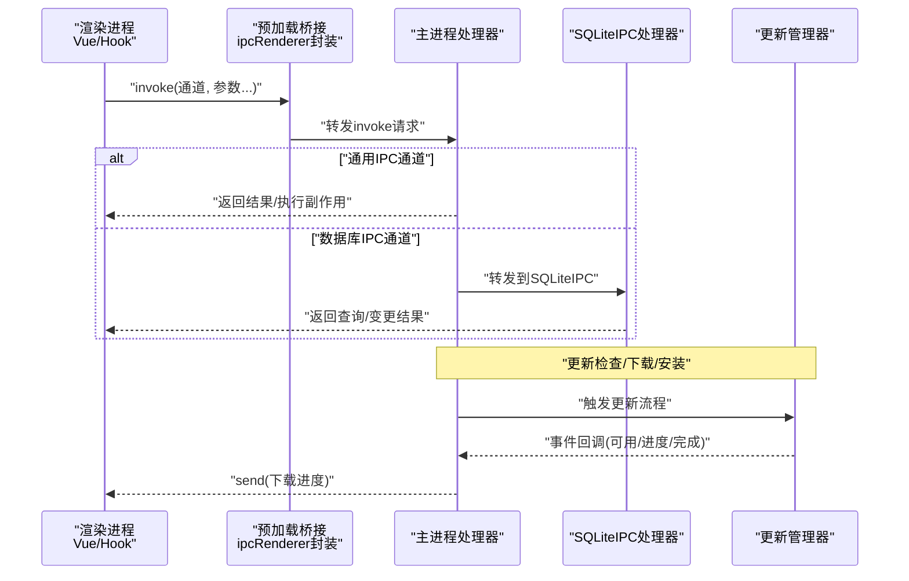
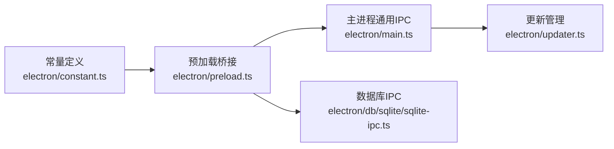

# IPC通信API

<cite>
**本文引用的文件**
- [electron/main.ts](file://electron/main.ts)
- [electron/preload.ts](file://electron/preload.ts)
- [electron/constant.ts](file://electron/constant.ts)
- [electron/db/sqlite/sqlite-ipc.ts](file://electron/db/sqlite/sqlite-ipc.ts)
- [electron/common.ts](file://electron/common.ts)
- [electron/updater.ts](file://electron/updater.ts)
- [src/hooks/useDBConfig.ts](file://src/hooks/useDBConfig.ts)
- [src/hooks/useDBGroup.ts](file://src/hooks/useDBGroup.ts)
- [src/hooks/useDBPwdInfo.ts](file://src/hooks/useDBPwdInfo.ts)
- [src/hooks/useBrowser.ts](file://src/hooks/useBrowser.ts)
</cite>

## 目录
1. [简介](#简介)
2. [项目结构](#项目结构)
3. [核心组件](#核心组件)
4. [架构总览](#架构总览)
5. [详细组件分析](#详细组件分析)
6. [依赖关系分析](#依赖关系分析)
7. [性能考虑](#性能考虑)
8. [故障排查指南](#故障排查指南)
9. [结论](#结论)
10. [附录](#附录)

## 简介
本文件系统性梳理密码管理器的IPC（进程间通信）API，覆盖主进程与渲染进程之间的消息传递机制、消息格式、数据流与同步协议。文档重点说明IPC通道命名规范、消息类型定义、参数传递格式，并提供渲染进程与主进程侧的调用与处理示例路径，涵盖异步通信模式、错误处理策略与性能优化建议。

## 项目结构
本项目采用Electron架构，通过预加载脚本暴露安全的IPC接口到渲染进程，主进程集中注册ipcMain.handle处理器，数据库操作通过独立的SQLite IPC模块统一接入。

```mermaid
graph TB
subgraph "渲染进程"
RUI["Vue 组件/Hook"]
PR["preload 暴露的 ipcRenderer 封装"]
end
subgraph "主进程"
MMAIN["main.ts 注册通用IPC处理"]
SIPC["sqlite-ipc.ts 注册数据库IPC处理"]
UPG["updater.ts 更新管理器"]
end
RUI --> PR
PR <- --> |"invoke/send"| MMAIN
PR <- --> |"invoke"| SIPC
MMAIN --> UPG
```

图表来源
- [electron/main.ts:149-227](file://electron/main.ts#L149-L227)
- [electron/db/sqlite/sqlite-ipc.ts:58-219](file://electron/db/sqlite/sqlite-ipc.ts#L58-L219)
- [electron/preload.ts:4-38](file://electron/preload.ts#L4-L38)
- [electron/updater.ts:7-204](file://electron/updater.ts#L7-L204)

章节来源
- [electron/main.ts:1-240](file://electron/main.ts#L1-L240)
- [electron/preload.ts:1-39](file://electron/preload.ts#L1-L39)
- [electron/db/sqlite/sqlite-ipc.ts:1-220](file://electron/db/sqlite/sqlite-ipc.ts#L1-L220)
- [electron/constant.ts:1-63](file://electron/constant.ts#L1-L63)
- [electron/updater.ts:1-204](file://electron/updater.ts#L1-L204)

## 核心组件
- 预加载桥接层：通过contextBridge在渲染进程暴露受控的ipcRenderer封装，统一on/off/send/invoke与更新相关便捷方法。
- 主进程通用IPC：集中处理窗口控制、系统集成（全局快捷键、开机自启）、开发者工具、首次登录等。
- 数据库IPC：按功能域划分，统一由SQLiteIPC注册各通道，实现配置、分组、密码信息、快捷键、版本等数据操作。
- 更新管理：基于electron-updater的更新流程，包含检查、下载、安装与进度事件广播。

章节来源
- [electron/preload.ts:4-38](file://electron/preload.ts#L4-L38)
- [electron/main.ts:149-227](file://electron/main.ts#L149-L227)
- [electron/db/sqlite/sqlite-ipc.ts:58-219](file://electron/db/sqlite/sqlite-ipc.ts#L58-L219)
- [electron/updater.ts:7-204](file://electron/updater.ts#L7-L204)

## 架构总览
下图展示IPC调用链路：渲染进程通过preload封装的invoke/send向主进程发起请求；主进程根据通道名分发至对应处理器；数据库类请求交由SQLiteIPC处理；更新类请求由UpdateManager统一管理并通过主进程广播进度事件。



图表来源
- [electron/preload.ts:17-20](file://electron/preload.ts#L17-L20)
- [electron/main.ts:149-227](file://electron/main.ts#L149-L227)
- [electron/db/sqlite/sqlite-ipc.ts:58-219](file://electron/db/sqlite/sqlite-ipc.ts#L58-L219)
- [electron/updater.ts:38-97](file://electron/updater.ts#L38-L97)

## 详细组件分析

### 通道命名规范与消息类型
- 通用IPC通道前缀：ipc-xxx（如最小化、最大化、关闭、打开浏览器、开发者工具、开机自启、首次登录、保存快捷键）。
- 数据库IPC通道前缀：ipc-sqlite-xxx-xxx（按功能域细分，如config/group/pwdInfo/shortcutKey/oss等）。
- 更新IPC通道：auto-check-update-switch-select/auto-update-switch-update/check-update及check-for-updates/download-update/install-update/get-current-version等。
- 事件通道：download-progress（主进程向渲染进程推送下载进度）。

章节来源
- [electron/constant.ts:14-62](file://electron/constant.ts#L14-L62)

### 渲染进程调用示例（路径）
- 配置读取与更新
  - [src/hooks/useDBConfig.ts:8](file://src/hooks/useDBConfig.ts#L8)
  - [src/hooks/useDBConfig.ts:17](file://src/hooks/useDBConfig.ts#L17)
- 分组增删改查
  - [src/hooks/useDBGroup.ts:17](file://src/hooks/useDBGroup.ts#L17)
  - [src/hooks/useDBGroup.ts:22](file://src/hooks/useDBGroup.ts#L22)
  - [src/hooks/useDBGroup.ts:27](file://src/hooks/useDBGroup.ts#L27)
  - [src/hooks/useDBGroup.ts:32](file://src/hooks/useDBGroup.ts#L32)
  - [src/hooks/useDBGroup.ts:37](file://src/hooks/useDBGroup.ts#L37)
  - [src/hooks/useDBGroup.ts:42](file://src/hooks/useDBGroup.ts#L42)
  - [src/hooks/useDBGroup.ts:47](file://src/hooks/useDBGroup.ts#L47)
- 密码信息增删改查与导入
  - [src/hooks/useDBPwdInfo.ts:23](file://src/hooks/useDBPwdInfo.ts#L23)
  - [src/hooks/useDBPwdInfo.ts:30](file://src/hooks/useDBPwdInfo.ts#L30)
  - [src/hooks/useDBPwdInfo.ts:37](file://src/hooks/useDBPwdInfo.ts#L37)
  - [src/hooks/useDBPwdInfo.ts:44](file://src/hooks/useDBPwdInfo.ts#L44)
  - [src/hooks/useDBPwdInfo.ts:50](file://src/hooks/useDBPwdInfo.ts#L50)
  - [src/hooks/useDBPwdInfo.ts:60](file://src/hooks/useDBPwdInfo.ts#L60)
  - [src/hooks/useDBPwdInfo.ts:67](file://src/hooks/useDBPwdInfo.ts#L67)
  - [src/hooks/useDBPwdInfo.ts:74](file://src/hooks/useDBPwdInfo.ts#L74)
  - [src/hooks/useDBPwdInfo.ts:80](file://src/hooks/useDBPwdInfo.ts#L80)
  - [src/hooks/useDBPwdInfo.ts:86](file://src/hooks/useDBPwdInfo.ts#L86)
- 打开外部链接
  - [src/hooks/useBrowser.ts:9](file://src/hooks/useBrowser.ts#L9)
- 首次登录与开机自启
  - [electron/main.ts:153-156](file://electron/main.ts#L153-L156)
  - [electron/main.ts:158-161](file://electron/main.ts#L158-L161)
- 窗口控制
  - [electron/main.ts:176-194](file://electron/main.ts#L176-L194)
- 开发者工具
  - [electron/main.ts:167-171](file://electron/main.ts#L167-L171)

### 主进程处理示例（路径）
- 通用IPC处理
  - [electron/main.ts:149-161](file://electron/main.ts#L149-L161)
  - [electron/main.ts:162-171](file://electron/main.ts#L162-L171)
  - [electron/main.ts:176-194](file://electron/main.ts#L176-L194)
  - [electron/main.ts:197-200](file://electron/main.ts#L197-L200)
  - [electron/main.ts:205-226](file://electron/main.ts#L205-L226)
- 数据库IPC处理
  - [electron/db/sqlite/sqlite-ipc.ts:58-219](file://electron/db/sqlite/sqlite-ipc.ts#L58-L219)
- 更新事件监听与广播
  - [electron/main.ts:230-240](file://electron/main.ts#L230-L240)
  - [electron/updater.ts:38-97](file://electron/updater.ts#L38-L97)

### 数据库IPC通道与参数格式
- OSS配置
  - 选择：参数为类型标识；返回对象
  - 更新：参数为区域、密钥ID、密钥密钥、存储桶、类型
- 配置
  - 选择：参数为配置编码；返回对象
  - 更新：参数为值、配置编码
- 分组
  - 插入：参数为标题、父ID；返回新增ID
  - 插入OSS映射：参数为ID、标题、父ID；返回新增ID
  - 删除：参数为分组ID；返回删除结果
  - 全量删除：无参；返回删除结果
  - 更新：参数为标题、ID；返回更新结果
  - 查询列表：无参；返回分组数组
  - 按标题取ID：参数为标题；返回对象{id}
- 密码信息
  - 插入：参数为分组ID、分组标题；返回新增ID
  - 导入插入：参数为分组ID、分组标题、标题、用户名、加密密码、链接、备注；返回新增ID
  - 删除：参数为ID；返回删除结果
  - 全量删除：无参；返回删除结果
  - 按分组ID全删：参数为分组ID；返回删除结果
  - 更新：参数为分组ID、分组标题、标题、用户名、密码（可选）、链接、备注、ID；返回更新结果
  - 列表：参数为分组ID；返回列表
  - 获取：参数为ID；返回对象
  - 搜索：参数为搜索值；返回列表
  - 按ID列表：参数为ID数组；返回列表
  - 计数：参数为分组ID；返回计数对象{count}
- 快捷键
  - 更新：参数为快捷键描述；返回更新结果
  - 查询：无参；返回列表
- 版本与自动更新开关
  - 读取开关：无参；返回开关对象
  - 更新开关：参数为开关值；返回更新结果

章节来源
- [electron/db/sqlite/sqlite-ipc.ts:73-217](file://electron/db/sqlite/sqlite-ipc.ts#L73-L217)
- [electron/constant.ts:14-62](file://electron/constant.ts#L14-L62)

### 异步通信模式与同步协议
- 调用模型
  - 渲染进程使用invoke进行请求-响应式调用，主进程通过ipcMain.handle处理并返回Promise结果。
  - 对于无需响应的事件，使用send进行单向通知（如下载进度）。
- 同步要点
  - 通用IPC：主进程直接执行副作用或返回简单值。
  - 数据库IPC：主进程转发到SQLiteIPC，由具体mapper执行SQL并返回结果。
  - 更新IPC：主进程触发UpdateManager，事件通过主进程广播到渲染进程。

章节来源
- [electron/preload.ts:17-20](file://electron/preload.ts#L17-L20)
- [electron/main.ts:149-227](file://electron/main.ts#L149-L227)
- [electron/db/sqlite/sqlite-ipc.ts:58-219](file://electron/db/sqlite/sqlite-ipc.ts#L58-L219)
- [electron/updater.ts:78-88](file://electron/updater.ts#L78-L88)

### 错误处理策略
- 渲染进程侧
  - 使用try/catch捕获invoke异常，结合用户提示或重试逻辑。
- 主进程侧
  - 更新检查异常通过事件向外抛出，由调用方处理。
  - 数据库操作异常需在mapper层捕获并向上抛出，确保渲染进程能感知。
- 预加载桥接
  - 提供统一的invoke封装，便于在桥接层做统一错误拦截与转换。

章节来源
- [electron/updater.ts:40-43](file://electron/updater.ts#L40-L43)
- [electron/main.ts:205-211](file://electron/main.ts#L205-L211)

### 性能优化技巧
- 减少不必要的数据库往返：合并批量操作，避免频繁invoke。
- 缓存与去抖：对高频查询（如分组列表、搜索）引入缓存与去抖策略。
- 事件聚合：将多次下载进度事件合并为更少的渲染通知。
- 预加载桥接复用：统一在preload中封装常用通道，减少重复样板代码。
- 大数据传输：对大列表采用分页或增量拉取，避免一次性传输过多数据。

## 依赖关系分析
- 预加载桥接依赖主进程常量定义的通道名，保证两端一致。
- 主进程通用IPC依赖公共工具（全局快捷键、开机自启、开发者工具）。
- 数据库IPC依赖SQLite模块与各mapper。
- 更新IPC依赖UpdateManager，后者通过主进程广播事件。



图表来源
- [electron/constant.ts:14-62](file://electron/constant.ts#L14-L62)
- [electron/preload.ts:4-38](file://electron/preload.ts#L4-L38)
- [electron/main.ts:149-227](file://electron/main.ts#L149-L227)
- [electron/db/sqlite/sqlite-ipc.ts:58-219](file://electron/db/sqlite/sqlite-ipc.ts#L58-L219)
- [electron/updater.ts:7-204](file://electron/updater.ts#L7-L204)

章节来源
- [electron/constant.ts:14-62](file://electron/constant.ts#L14-L62)
- [electron/preload.ts:4-38](file://electron/preload.ts#L4-L38)
- [electron/main.ts:149-227](file://electron/main.ts#L149-L227)
- [electron/db/sqlite/sqlite-ipc.ts:58-219](file://electron/db/sqlite/sqlite-ipc.ts#L58-L219)
- [electron/updater.ts:7-204](file://electron/updater.ts#L7-L204)

## 性能考虑
- 通道复用与命名一致性：通过常量集中管理通道名，避免字符串散落导致的不一致与拼写错误。
- 批处理与缓存：对频繁读取的数据建立本地缓存，必要时使用批量查询减少IPC次数。
- 事件节流：下载进度等高频事件应进行节流或合并，降低渲染进程压力。
- 大对象传输：尽量避免在IPC中传输超大数据，优先传输ID或分段传输。
- 错误快速失败：对不可恢复的错误尽早返回，避免无效等待。

## 故障排查指南
- 通道名不匹配
  - 症状：渲染进程invoke无响应或报通道不存在。
  - 排查：核对常量定义与两端通道名是否一致。
- 权限与上下文问题
  - 症状：ipcRenderer在某些环境下不可用。
  - 排查：确认预加载桥接已正确注入，且在DOM ready后再发起调用。
- 数据库操作异常
  - 症状：查询/更新失败或返回空。
  - 排查：检查mapper参数顺序与类型，确认数据库初始化完成。
- 更新流程异常
  - 症状：无法检查更新或下载失败。
  - 排查：查看更新事件日志与错误回调，确认网络与feed地址配置。

章节来源
- [electron/preload.ts:4-38](file://electron/preload.ts#L4-L38)
- [electron/db/sqlite/sqlite-ipc.ts:58-219](file://electron/db/sqlite/sqlite-ipc.ts#L58-L219)
- [electron/updater.ts:38-97](file://electron/updater.ts#L38-L97)

## 结论
本IPC体系以预加载桥接为核心，统一了渲染进程与主进程的通信入口；通用IPC与数据库IPC分离，职责清晰；更新流程通过事件驱动实现解耦。遵循命名规范与参数约定，配合错误处理与性能优化策略，可在保证安全性的同时获得良好的开发体验与运行效率。

## 附录

### 通道一览与参数速查
- 通用IPC
  - ipc-first-login：首次登录设置开机自启
  - ipc-dev-tools：打开开发者工具
  - ipc-save-shortcuts：保存全局快捷键
  - ipc-auto-start：设置开机自启
  - ipc-open-browser：打开外部链接
  - ipc-minimize/ipc-maximize/ipc-close-win：窗口控制
  - check-for-updates/download-update/install-update/get-current-version：更新相关
- 数据库IPC
  - oss：选择/更新
  - config：选择/更新
  - group：插入/插入OSS/删除/全删/更新/列表/按标题取ID
  - pwdInfo：插入/导入插入/删除/全删/按分组ID全删/更新/列表/获取/搜索/按ID列表/计数
  - shortcutKey：更新/查询
  - 版本：读取开关/更新开关

章节来源
- [electron/constant.ts:14-62](file://electron/constant.ts#L14-L62)
- [electron/db/sqlite/sqlite-ipc.ts:73-217](file://electron/db/sqlite/sqlite-ipc.ts#L73-L217)