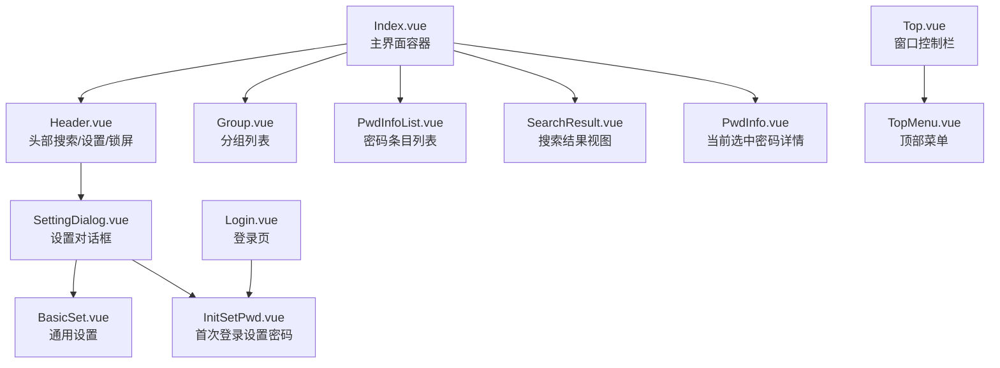
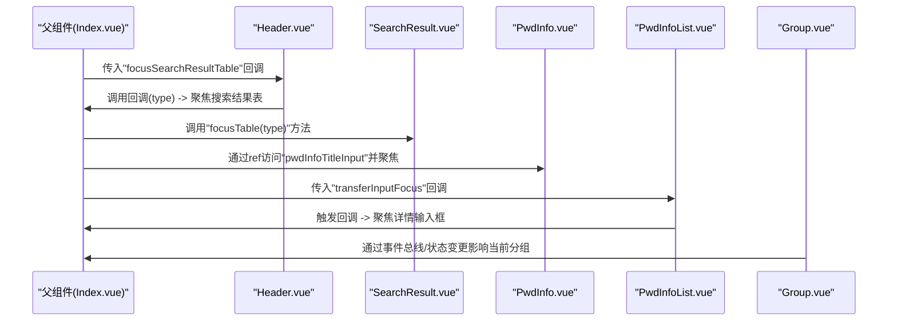
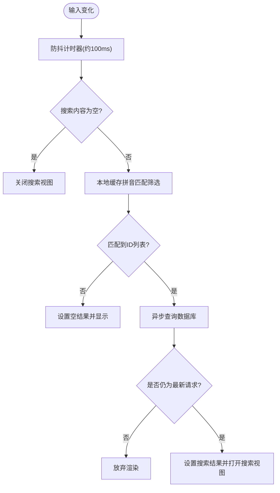
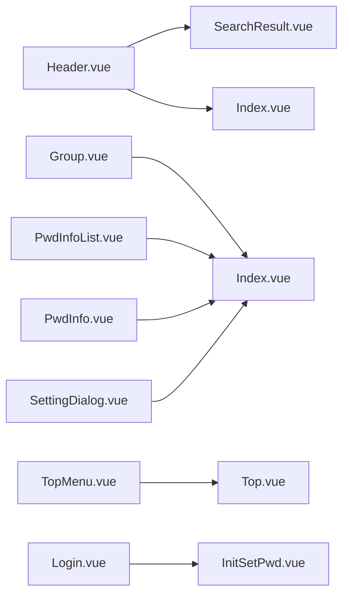

# UI组件API

<cite>
**本文引用的文件**
- [src/components/Index.vue](file://src/components/Index.vue)
- [src/components/Login.vue](file://src/components/Login.vue)
- [src/components/SettingDialog.vue](file://src/components/SettingDialog.vue)
- [src/components/type.ts](file://src/components/type.ts)
- [src/components/indexview/Header.vue](file://src/components/indexview/Header.vue)
- [src/components/indexview/Top.vue](file://src/components/indexview/Top.vue)
- [src/components/indexview/TopMenu.vue](file://src/components/indexview/TopMenu.vue)
- [src/components/indexview/Group.vue](file://src/components/indexview/Group.vue)
- [src/components/indexview/PwdInfo.vue](file://src/components/indexview/PwdInfo.vue)
- [src/components/indexview/PwdInfoList.vue](file://src/components/indexview/PwdInfoList.vue)
- [src/components/indexview/SearchResult.vue](file://src/components/indexview/SearchResult.vue)
- [src/components/setview/BasicSet.vue](file://src/components/setview/BasicSet.vue)
- [src/components/setview/InitSetPwd.vue](file://src/components/setview/InitSetPwd.vue)
- [src/components/topMenu/Import.vue](file://src/components/topMenu/Import.vue)
- [src/components/topMenu/About.vue](file://src/components/topMenu/About.vue)
- [src/components/topMenu/Support.vue](file://src/components/topMenu/Support.vue)
</cite>

## 目录
1. [简介](#简介)
2. [项目结构](#项目结构)
3. [核心组件](#核心组件)
4. [架构总览](#架构总览)
5. [详细组件分析](#详细组件分析)
6. [依赖分析](#依赖分析)
7. [性能考虑](#性能考虑)
8. [故障排查指南](#故障排查指南)
9. [结论](#结论)
10. [附录](#附录)

## 简介
本文件为密码管理器的Vue组件API文档，覆盖所有前端UI组件的接口规范，包括组件属性（props）、事件（events）、插槽（slots）与方法（methods）。文档同时提供父组件使用示例、生命周期与状态管理说明，并给出性能优化建议，帮助开发者快速理解与正确使用各组件。

## 项目结构
项目采用按功能域分层的组织方式：主界面由入口组件组合多个视图组件；设置相关功能拆分为独立设置面板；顶部菜单与导入/关于/支持等对话框作为独立弹窗组件存在。组件间通过Pinia状态、事件总线与暴露方法进行协作。

图表来源
- [src/components/Index.vue:46-61](file://src/components/Index.vue#L46-L61)
- [src/components/indexview/Header.vue:177-230](file://src/components/indexview/Header.vue#L177-L230)
- [src/components/indexview/Group.vue:215-277](file://src/components/indexview/Group.vue#L215-L277)
- [src/components/indexview/PwdInfoList.vue:157-195](file://src/components/indexview/PwdInfoList.vue#L157-L195)
- [src/components/indexview/SearchResult.vue:145-167](file://src/components/indexview/SearchResult.vue#L145-L167)
- [src/components/indexview/PwdInfo.vue:86-209](file://src/components/indexview/PwdInfo.vue#L86-L209)
- [src/components/SettingDialog.vue:20-46](file://src/components/SettingDialog.vue#L20-L46)
- [src/components/indexview/Top.vue:32-67](file://src/components/indexview/Top.vue#L32-L67)
- [src/components/indexview/TopMenu.vue:34-120](file://src/components/indexview/TopMenu.vue#L34-L120)
- [src/components/Login.vue:57-88](file://src/components/Login.vue#L57-L88)

章节来源
- [src/components/Index.vue:1-81](file://src/components/Index.vue#L1-L81)
- [src/components/indexview/Header.vue:1-257](file://src/components/indexview/Header.vue#L1-L257)
- [src/components/indexview/Group.vue:1-333](file://src/components/indexview/Group.vue#L1-L333)
- [src/components/indexview/PwdInfoList.vue:1-260](file://src/components/indexview/PwdInfoList.vue#L1-L260)
- [src/components/indexview/SearchResult.vue:1-186](file://src/components/indexview/SearchResult.vue#L1-L186)
- [src/components/indexview/PwdInfo.vue:1-257](file://src/components/indexview/PwdInfo.vue#L1-L257)
- [src/components/SettingDialog.vue:1-60](file://src/components/SettingDialog.vue#L1-L60)
- [src/components/indexview/Top.vue:1-108](file://src/components/indexview/Top.vue#L1-L108)
- [src/components/indexview/TopMenu.vue:1-130](file://src/components/indexview/TopMenu.vue#L1-L130)
- [src/components/Login.vue:1-129](file://src/components/Login.vue#L1-L129)
- [src/components/setview/BasicSet.vue:1-143](file://src/components/setview/BasicSet.vue#L1-L143)
- [src/components/setview/InitSetPwd.vue:1-46](file://src/components/setview/InitSetPwd.vue#L1-L46)
- [src/components/topMenu/Import.vue:1-73](file://src/components/topMenu/Import.vue#L1-L73)
- [src/components/topMenu/About.vue:1-62](file://src/components/topMenu/About.vue#L1-L62)
- [src/components/topMenu/Support.vue:1-98](file://src/components/topMenu/Support.vue#L1-L98)

## 核心组件
本项目的核心组件围绕“主界面容器”展开，负责协调头部、分组、列表、详情与搜索视图的显示与交互。主要职责如下：
- 主界面容器：集中渲染头部、分组、列表、详情与搜索视图，并根据Pinia状态切换视图显示。
- 登录页：处理首次登录设置密码与常规登录流程。
- 设置对话框：封装通用设置、快捷键、修改密码与数据同步等设置项。
- 顶部控制与菜单：提供窗口控制、帮助文档、导入导出、关于与支持等功能。

章节来源
- [src/components/Index.vue:11-28](file://src/components/Index.vue#L11-L28)
- [src/components/Login.vue:13-53](file://src/components/Login.vue#L13-L53)
- [src/components/SettingDialog.vue:8-17](file://src/components/SettingDialog.vue#L8-L17)

## 架构总览
组件间通过以下机制协同工作：
- Pinia状态：用户信息、搜索结果、分组与列表索引、快捷键配置等。
- 事件总线：跨组件通信，如新增分组、刷新分组数据、拖拽分组、更新密码标题等。
- 暴露方法：子组件通过defineExpose向父组件暴露方法，实现跨层级调用（如焦点转移、打开设置对话框）。
- Electron IPC：窗口控制、首次登录提示等系统级交互。

图表来源
- [src/components/Index.vue:34-41](file://src/components/Index.vue#L34-L41)
- [src/components/indexview/Header.vue:170-173](file://src/components/indexview/Header.vue#L170-L173)
- [src/components/indexview/SearchResult.vue:84-118](file://src/components/indexview/SearchResult.vue#L84-L118)
- [src/components/indexview/PwdInfo.vue:16-27](file://src/components/indexview/PwdInfo.vue#L16-L27)
- [src/components/indexview/PwdInfoList.vue:24](file://src/components/indexview/PwdInfoList.vue#L24)

## 详细组件分析

### 组件：Index.vue（主界面容器）
- 作用：承载头部、分组、列表、详情与搜索视图，根据Pinia状态切换视图显示。
- 暴露方法：无（通过子组件ref与事件总线协作）。
- 插槽：无。
- 生命周期：mounted时初始化快捷键与缓存；watch监听搜索视图开关以决定渲染哪些子视图。
- 使用要点：
  - 通过Header的回调将焦点转移到搜索结果表。
  - 通过PwdInfoView的ref访问标题输入框并聚焦。
  - 通过PwdInfoList的回调将焦点转移到详情输入框。

章节来源
- [src/components/Index.vue:11-28](file://src/components/Index.vue#L11-L28)
- [src/components/Index.vue:34-41](file://src/components/Index.vue#L34-L41)
- [src/components/Index.vue:46-61](file://src/components/Index.vue#L46-L61)

### 组件：Header.vue（头部）
- 属性（props）：focusSearchResultTable(type: number) → 父组件传入的回调，用于键盘导航时聚焦搜索结果表。
- 事件：无（内部通过事件总线与Pinia交互）。
- 插槽：无。
- 方法：无（通过事件总线与Pinia交互）。
- 生命周期：mounted时切换焦点、读取主题配置；watch监听路由变化以切换焦点；onUnmounted解绑事件与清理定时器。
- 行为：
  - 搜索输入：防抖（约100ms）+ 缓存拼音匹配 + 异步数据库查询 + 最新请求优先显示。
  - 主题切换：持久化到配置并切换暗色模式。
  - 快捷键：读取Pinia中的快捷键组合用于UI提示。
  - 打开设置：调用SettingDialog的openSettingDialog方法。
  - 锁屏：触发登出逻辑。
- 性能：搜索防抖与请求序号对比避免过期结果渲染。

图表来源
- [src/components/indexview/Header.vue:98-157](file://src/components/indexview/Header.vue#L98-L157)

章节来源
- [src/components/indexview/Header.vue:41](file://src/components/indexview/Header.vue#L41)
- [src/components/indexview/Header.vue:62-82](file://src/components/indexview/Header.vue#L62-L82)
- [src/components/indexview/Header.vue:98-157](file://src/components/indexview/Header.vue#L98-L157)
- [src/components/indexview/Header.vue:160-168](file://src/components/indexview/Header.vue#L160-L168)

### 组件：Group.vue（分组）
- 属性（props）：无。
- 事件：无（内部通过事件总线与Pinia交互）。
- 插槽：无。
- 方法：无（通过事件总线与Pinia交互）。
- 生命周期：mounted初始化数据；watch监听导入标志位；onUnmounted解绑事件。
- 行为：
  - 新增分组：触发插入后清空输入并同步到OSS。
  - 修改分组：进入编辑态后失焦或变更保存，同步到OSS。
  - 删除分组：若分组下有密码条目，二次确认后先删除条目再删除分组。
  - 拖拽：支持将密码条目拖拽到其他分组，更新条目分组并同步到OSS。
  - 快捷键：读取Pinia中的快捷键组合用于UI提示。
- 性能：列表渲染使用虚拟滚动（Element Plus Scrollbar）；拖拽高亮仅在目标分组生效。

章节来源
- [src/components/indexview/Group.vue:35-80](file://src/components/indexview/Group.vue#L35-L80)
- [src/components/indexview/Group.vue:99-158](file://src/components/indexview/Group.vue#L99-L158)
- [src/components/indexview/Group.vue:160-212](file://src/components/indexview/Group.vue#L160-L212)

### 组件：PwdInfoList.vue（密码条目列表）
- 属性（props）：transferInputFocus() → 父组件传入的回调，用于新增条目后将焦点转移到详情输入框。
- 事件：无（内部通过事件总线与Pinia交互）。
- 插槽：无。
- 方法：无（通过事件总线与Pinia交互）。
- 生命周期：mounted查询并初始化当前选中条目；watch监听当前分组与变更标志位；onUnmounted解绑事件。
- 行为：
  - 新增条目：触发回调聚焦详情输入框，插入后刷新列表并设置当前条目。
  - 删除条目：二次确认后删除并刷新列表。
  - 拖拽：支持将条目拖拽到其他分组（通过事件总线触发刷新）。
  - 快捷键：读取Pinia中的快捷键组合用于UI提示。
- 性能：列表渲染使用虚拟滚动；拖拽时设置dataTransfer数据，避免重复查询。

章节来源
- [src/components/indexview/PwdInfoList.vue:24](file://src/components/indexview/PwdInfoList.vue#L24)
- [src/components/indexview/PwdInfoList.vue:60-85](file://src/components/indexview/PwdInfoList.vue#L60-L85)
- [src/components/indexview/PwdInfoList.vue:87-139](file://src/components/indexview/PwdInfoList.vue#L87-L139)
- [src/components/indexview/PwdInfoList.vue:141-154](file://src/components/indexview/PwdInfoList.vue#L141-L154)

### 组件：PwdInfo.vue（当前选中密码详情）
- 属性（props）：无。
- 事件：无。
- 插槽：无。
- 方法：keydown(e: KeyboardEvent) → Ctrl+P复制密码，Ctrl+U复制用户名；暴露pwdInfoTitleInput供父组件聚焦。
- 生命周期：无特殊生命周期钩子。
- 行为：
  - 输入变更：新增或更新条目后同步到OSS；更新搜索结果中的标题。
  - 显示/隐藏密码：切换类型。
  - 生成随机密码：通过RandomPwdGenerate对话框触发。
  - 快捷键：读取Pinia中的快捷键组合用于UI提示。
- 性能：输入变更触发一次数据库更新与OSS同步；复制操作使用Clipboard API。

章节来源
- [src/components/indexview/PwdInfo.vue:16-31](file://src/components/indexview/PwdInfo.vue#L16-L31)
- [src/components/indexview/PwdInfo.vue:32-53](file://src/components/indexview/PwdInfo.vue#L32-L53)
- [src/components/indexview/PwdInfo.vue:56-78](file://src/components/indexview/PwdInfo.vue#L56-L78)
- [src/components/indexview/PwdInfo.vue:80-84](file://src/components/indexview/PwdInfo.vue#L80-L84)

### 组件：SearchResult.vue（搜索结果）
- 属性（props）：无。
- 事件：无。
- 插槽：无。
- 方法：focusTable(type: number) → 按上下方向键在结果表中循环聚焦；暴露给父组件调用。
- 生命周期：监听搜索结果数据事件；onUnmounted解绑事件。
- 行为：
  - 表格渲染：按分组、标题、用户名展示；提供删除按钮。
  - 行点击：设置当前选中条目并同步到详情。
  - 删除：二次确认后删除对应行并同步到数据库。
- 性能：使用Element Plus Table，聚焦通过DOM选择器动态添加CSS类实现高亮。

章节来源
- [src/components/indexview/SearchResult.vue:12-30](file://src/components/indexview/SearchResult.vue#L12-L30)
- [src/components/indexview/SearchResult.vue:32-44](file://src/components/indexview/SearchResult.vue#L32-L44)
- [src/components/indexview/SearchResult.vue:84-118](file://src/components/indexview/SearchResult.vue#L84-L118)
- [src/components/indexview/SearchResult.vue:119-138](file://src/components/indexview/SearchResult.vue#L119-L138)
- [src/components/indexview/SearchResult.vue:140](file://src/components/indexview/SearchResult.vue#L140)

### 组件：SettingDialog.vue（设置对话框）
- 属性（props）：无。
- 事件：无。
- 插槽：无。
- 方法：openSettingDialog() → 暴露给父组件打开设置对话框。
- 生命周期：无。
- 行为：内部包含标签页，分别承载通用设置、快捷键、修改密码与数据同步。

章节来源
- [src/components/SettingDialog.vue:8-17](file://src/components/SettingDialog.vue#L8-L17)
- [src/components/SettingDialog.vue:20-46](file://src/components/SettingDialog.vue#L20-L46)

### 组件：BasicSet.vue（通用设置）
- 属性（props）：无。
- 事件：无。
- 插槽：无。
- 方法：无。
- 生命周期：无。
- 行为：提供开机自启动、自动退出登录时间、数据同步开关及自动上传/下载开关；通过hooks统一处理变更。

章节来源
- [src/components/setview/BasicSet.vue:5-12](file://src/components/setview/BasicSet.vue#L5-L12)

### 组件：InitSetPwd.vue（首次登录设置密码）
- 属性（props）：无。
- 事件：无。
- 插槽：无。
- 方法：pwdDialogVisible → 暴露给父组件控制对话框显示。
- 生命周期：无。
- 行为：表单校验与提交，回车触发提交。

章节来源
- [src/components/setview/InitSetPwd.vue:4-8](file://src/components/setview/InitSetPwd.vue#L4-L8)
- [src/components/setview/InitSetPwd.vue:12-41](file://src/components/setview/InitSetPwd.vue#L12-L41)

### 组件：Top.vue（窗口控制栏）
- 属性（props）：无。
- 事件：无。
- 插槽：无。
- 方法：无。
- 生命周期：无。
- 行为：最小化、最大化/还原、关闭窗口；关闭时触发登出；顶部菜单仅在登录状态下显示。

章节来源
- [src/components/indexview/Top.vue:14-27](file://src/components/indexview/Top.vue#L14-L27)
- [src/components/indexview/Top.vue:32-67](file://src/components/indexview/Top.vue#L32-L67)

### 组件：TopMenu.vue（顶部菜单）
- 属性（props）：无。
- 事件：无。
- 插槽：无。
- 方法：无。
- 生命周期：无。
- 行为：帮助文档、导入数据、导出数据、支持/捐赠、关于软件、开发调试、本地版本重置等。

章节来源
- [src/components/indexview/TopMenu.vue:24-30](file://src/components/indexview/TopMenu.vue#L24-L30)
- [src/components/indexview/TopMenu.vue:34-120](file://src/components/indexview/TopMenu.vue#L34-L120)

### 组件：Login.vue（登录页）
- 属性（props）：无。
- 事件：无。
- 插槽：无。
- 方法：无。
- 生命周期：mounted时切换焦点、判断首次登录并打开设置密码对话框；watch监听路由变化以切换焦点。
- 行为：密码输入、回车登录、Caps Lock提示、ESC快捷键登出；首次登录通过IPC与后端交互。

章节来源
- [src/components/Login.vue:27-31](file://src/components/Login.vue#L27-L31)
- [src/components/Login.vue:40-53](file://src/components/Login.vue#L40-L53)
- [src/components/Login.vue:57-88](file://src/components/Login.vue#L57-L88)

### 组件：Import.vue（导入数据）
- 属性（props）：无。
- 事件：无。
- 插槽：无。
- 方法：importDialogVisible → 暴露给父组件控制对话框显示。
- 生命周期：无。
- 行为：限制文件大小与类型，支持拖拽上传与模板下载。

章节来源
- [src/components/topMenu/Import.vue:11](file://src/components/topMenu/Import.vue#L11)
- [src/components/topMenu/Import.vue:35-65](file://src/components/topMenu/Import.vue#L35-L65)

### 组件：About.vue（关于）
- 属性（props）：无。
- 事件：无。
- 插槽：无。
- 方法：aboutDialogVisible → 暴露给父组件控制对话框显示。
- 生命周期：mounted初始化自动检查更新开关。
- 行为：版本信息、更新检查与开关控制、跳转到源码仓库。

章节来源
- [src/components/topMenu/About.vue:11](file://src/components/topMenu/About.vue#L11)
- [src/components/topMenu/About.vue:24-53](file://src/components/topMenu/About.vue#L24-L53)

### 组件：Support.vue（支持/捐赠）
- 属性（props）：无。
- 事件：无。
- 插槽：无。
- 方法：supportDialogVisible → 暴露给父组件控制对话框显示。
- 生命周期：无。
- 行为：支持渠道与捐赠说明，包含微信/支付宝二维码与说明弹窗。

章节来源
- [src/components/topMenu/Support.vue:9](file://src/components/topMenu/Support.vue#L9)
- [src/components/topMenu/Support.vue:15-58](file://src/components/topMenu/Support.vue#L15-L58)

## 依赖分析
- 状态管理：Pinia stores（用户信息、搜索结果、分组与列表索引、快捷键、缓存）贯穿多组件。
- 事件总线：组件间通过事件总线传递消息（新增分组、刷新分组、拖拽分组、更新标题等）。
- 外部库：Element Plus UI组件、PinyinMatch拼音匹配、Electron IPC。
- 类型定义：type.ts提供PwdInfo、PwdGroup、ShortcutKey等接口，确保组件间数据一致性。

图表来源
- [src/components/indexview/Header.vue:160-168](file://src/components/indexview/Header.vue#L160-L168)
- [src/components/indexview/SearchResult.vue:12-30](file://src/components/indexview/SearchResult.vue#L12-L30)
- [src/components/indexview/Group.vue:16](file://src/components/indexview/Group.vue#L16)
- [src/components/indexview/PwdInfoList.vue:60-85](file://src/components/indexview/PwdInfoList.vue#L60-L85)
- [src/components/indexview/PwdInfo.vue:16-31](file://src/components/indexview/PwdInfo.vue#L16-L31)
- [src/components/SettingDialog.vue:8-17](file://src/components/SettingDialog.vue#L8-L17)
- [src/components/indexview/TopMenu.vue:34-120](file://src/components/indexview/TopMenu.vue#L34-L120)
- [src/components/indexview/Top.vue:32-67](file://src/components/indexview/Top.vue#L32-L67)
- [src/components/Login.vue:40-53](file://src/components/Login.vue#L40-L53)
- [src/components/setview/InitSetPwd.vue:4-8](file://src/components/setview/InitSetPwd.vue#L4-L8)

章节来源
- [src/components/type.ts:1-88](file://src/components/type.ts#L1-L88)

## 性能考虑
- 搜索防抖与请求去重：Header对输入进行防抖并在异步查询前对比请求序号，避免过期结果渲染。
- 列表虚拟滚动：分组与列表均使用Element Plus Scrollbar，减少DOM节点数量。
- 拖拽优化：仅在目标分组高亮，避免全量重绘；拖拽时传递JSON字符串，减少额外查询。
- 焦点管理：通过父组件ref与暴露方法精准控制焦点，避免全局查找。
- 数据同步：仅在必要场景（新增/更新/删除/拖拽）触发OSS同步，降低网络开销。

## 故障排查指南
- 搜索结果未更新：确认Header的搜索防抖与请求序号逻辑是否被正确执行；检查Pinia中的searchResultList是否更新。
- 分组/条目删除异常：确认二次确认逻辑与数据库删除顺序；检查事件总线是否正确触发刷新。
- 对话框无法打开：确认父组件是否正确调用defineExpose暴露的方法（如openSettingDialog、pwdDialogVisible）。
- 焦点未正确转移：检查父组件是否正确传入回调并调用（如focusSearchResultTable、transferInputFocus）。
- Electron相关问题：确认IPC通道名称与后端实现一致（如首次登录、窗口控制）。

章节来源
- [src/components/indexview/Header.vue:74-82](file://src/components/indexview/Header.vue#L74-L82)
- [src/components/indexview/Group.vue:139-158](file://src/components/indexview/Group.vue#L139-L158)
- [src/components/SettingDialog.vue:14-17](file://src/components/SettingDialog.vue#L14-L17)
- [src/components/Login.vue:40-53](file://src/components/Login.vue#L40-L53)

## 结论
本项目UI组件通过清晰的职责划分与Pinia状态管理、事件总线与暴露方法实现了松耦合的协作。Header、Group、PwdInfoList、PwdInfo与SearchResult构成完整的密码管理视图体系；SettingDialog与TopMenu提供丰富的设置与辅助功能。遵循本文档的接口规范与使用示例，可在父组件中正确集成并扩展各子组件。

## 附录
- 接口与类型参考：type.ts中定义了PwdInfo、PwdGroup、ShortcutKey等接口，便于在父组件中进行类型约束与IDE提示。
- 快捷键：各组件通过Pinia读取快捷键组合用于UI提示，具体组合定义在store中。
- 样式定制：组件内使用scoped样式，可通过父组件的深度选择器或全局CSS变量进行定制（如深色主题变量）。

章节来源
- [src/components/type.ts:51-88](file://src/components/type.ts#L51-L88)