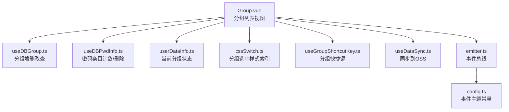
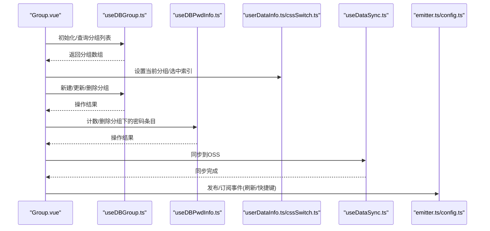
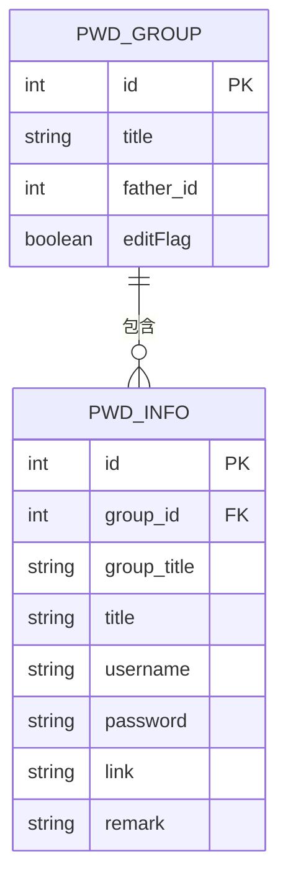
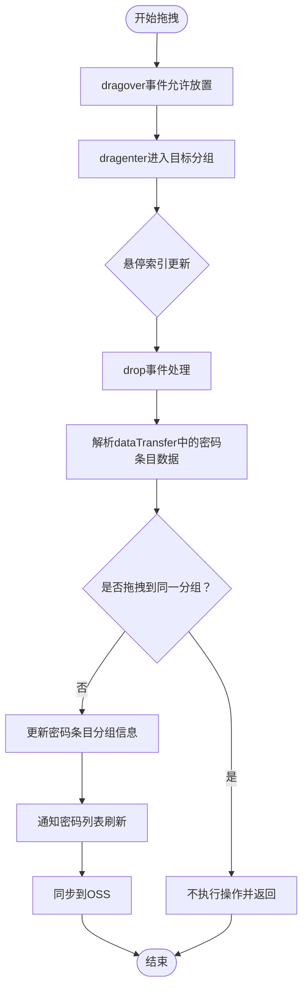
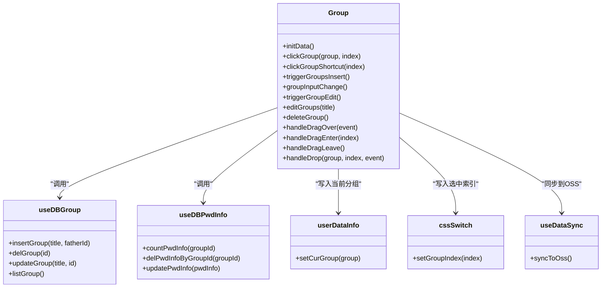

# 分组组件API

<cite>
**本文档引用的文件**
- [Group.vue](file://src/components/indexview/Group.vue)
- [useDBGroup.ts](file://src/hooks/useDBGroup.ts)
- [useDBPwdInfo.ts](file://src/hooks/useDBPwdInfo.ts)
- [useGroupShortcutKey.ts](file://src/hooks/useGroupShortcutKey.ts)
- [userDataInfo.ts](file://src/store/userDataInfo.ts)
- [cssSwitch.ts](file://src/store/cssSwitch.ts)
- [type.ts](file://src/components/type.ts)
- [config.ts](file://src/config/config.ts)
- [emitter.ts](file://src/utils/emitter.ts)
- [useDataSync.ts](file://src/hooks/useDataSync.ts)
</cite>

## 目录
1. [简介](#简介)
2. [项目结构](#项目结构)
3. [核心组件](#核心组件)
4. [架构总览](#架构总览)
5. [详细组件分析](#详细组件分析)
6. [依赖分析](#依赖分析)
7. [性能考虑](#性能考虑)
8. [故障排除指南](#故障排除指南)
9. [结论](#结论)
10. [附录](#附录)

## 简介
本文件为分组组件（Group）的详细API文档，涵盖组件的属性、事件、插槽、方法接口；分组树形结构的数据模型与层级关系；拖拽排序功能实现；交互行为（展开/折叠、新建、重命名、删除等）；以及在父组件中的使用示例、节点选择、权限控制与性能优化策略。该组件基于Vue 3 Composition API与Pinia状态管理，结合Electron IPC与OSS同步能力，实现本地与云端的分组数据管理。

## 项目结构
分组组件位于视图层的indexview目录，配合数据库Hook、状态管理、事件总线与数据同步模块协同工作：
- 视图层：Group.vue
- 数据访问：useDBGroup.ts、useDBPwdInfo.ts
- 状态管理：userDataInfo.ts、cssSwitch.ts
- 事件系统：emitter.ts、config.ts中的主题常量
- 键盘快捷键：useGroupShortcutKey.ts
- 数据同步：useDataSync.ts

图表来源
- [Group.vue:1-333](file://src/components/indexview/Group.vue#L1-L333)
- [useDBGroup.ts:1-53](file://src/hooks/useDBGroup.ts#L1-L53)
- [useDBPwdInfo.ts:1-103](file://src/hooks/useDBPwdInfo.ts#L1-L103)
- [userDataInfo.ts:1-76](file://src/store/userDataInfo.ts#L1-L76)
- [cssSwitch.ts:1-17](file://src/store/cssSwitch.ts#L1-L17)
- [useGroupShortcutKey.ts:1-57](file://src/hooks/useGroupShortcutKey.ts#L1-L57)
- [useDataSync.ts:1-324](file://src/hooks/useDataSync.ts#L1-L324)
- [emitter.ts:1-16](file://src/utils/emitter.ts#L1-L16)
- [config.ts:1-143](file://src/config/config.ts#L1-L143)

章节来源
- [Group.vue:1-333](file://src/components/indexview/Group.vue#L1-L333)
- [useDBGroup.ts:1-53](file://src/hooks/useDBGroup.ts#L1-L53)
- [useDBPwdInfo.ts:1-103](file://src/hooks/useDBPwdInfo.ts#L1-L103)
- [userDataInfo.ts:1-76](file://src/store/userDataInfo.ts#L1-L76)
- [cssSwitch.ts:1-17](file://src/store/cssSwitch.ts#L1-L17)
- [useGroupShortcutKey.ts:1-57](file://src/hooks/useGroupShortcutKey.ts#L1-L57)
- [useDataSync.ts:1-324](file://src/hooks/useDataSync.ts#L1-L324)
- [emitter.ts:1-16](file://src/utils/emitter.ts#L1-L16)
- [config.ts:1-143](file://src/config/config.ts#L1-L143)

## 核心组件
- 组件名称：Group
- 文件路径：src/components/indexview/Group.vue
- 组件职责：
  - 展示分组列表，支持点击切换当前分组
  - 新建分组、重命名分组、删除分组
  - 拖拽密码条目到不同分组
  - 响应快捷键与全局事件，刷新数据
  - 与Pinia状态管理联动，维护当前分组与选中样式索引
  - 与useDataSync集成，实现本地变更同步到OSS

章节来源
- [Group.vue:1-333](file://src/components/indexview/Group.vue#L1-L333)

## 架构总览
组件采用“视图层-数据访问层-状态管理层-事件系统-同步模块”的分层架构，确保关注点分离与可维护性。

图表来源
- [Group.vue:35-80](file://src/components/indexview/Group.vue#L35-L80)
- [useDBGroup.ts:40-49](file://src/hooks/useDBGroup.ts#L40-L49)
- [useDBPwdInfo.ts:48-53](file://src/hooks/useDBPwdInfo.ts#L48-L53)
- [userDataInfo.ts:19-27](file://src/store/userDataInfo.ts#L19-L27)
- [cssSwitch.ts:8-14](file://src/store/cssSwitch.ts#L8-L14)
- [useDataSync.ts:133-153](file://src/hooks/useDataSync.ts#L133-L153)
- [emitter.ts:1-16](file://src/utils/emitter.ts#L1-L16)
- [config.ts:5-12](file://src/config/config.ts#L5-L12)

## 详细组件分析

### 数据模型与层级关系
- 分组实体（PwdGroup）
  - 字段：id、title、father_id、pwdList、editFlag
  - 关系：father_id表示父子层级；pwdList用于承载该分组下的密码条目集合
- 密码条目实体（PwdInfo）
  - 字段：id、group_id、group_title、title、username、password、link、remark
  - 关系：group_id指向所属分组；group_title用于显示与同步

图表来源
- [type.ts:76-88](file://src/components/type.ts#L76-L88)
- [type.ts:51-67](file://src/components/type.ts#L51-L67)

章节来源
- [type.ts:51-88](file://src/components/type.ts#L51-L88)

### 组件属性（Props）
- 无外部传入props
- 组件内部通过Pinia状态管理维护当前分组与选中索引

章节来源
- [Group.vue:28-32](file://src/components/indexview/Group.vue#L28-L32)
- [userDataInfo.ts:58-72](file://src/store/userDataInfo.ts#L58-L72)
- [cssSwitch.ts:5-14](file://src/store/cssSwitch.ts#L5-L14)

### 组件事件（Events）
- 事件发布
  - 刷新分组数据：emitterRefreshGroupData
  - 密码条目拖拽至分组：emitterPwdInfoDragToGroup
  - 分组快捷键：emitterGroupShortcutKeyTopic
  - 新增分组：emitterInsertGroupTopic
- 事件订阅
  - 监听刷新分组数据、分组快捷键、新增分组事件
  - 在组件卸载时解绑事件

章节来源
- [config.ts:5-12](file://src/config/config.ts#L5-L12)
- [Group.vue:41-59](file://src/components/indexview/Group.vue#L41-L59)
- [emitter.ts:1-16](file://src/utils/emitter.ts#L1-L16)

### 组件插槽（Slots）
- 未定义具名插槽
- 使用默认插槽渲染分组列表项与输入框

章节来源
- [Group.vue:215-277](file://src/components/indexview/Group.vue#L215-L277)

### 组件方法（Methods）
- 初始化与数据加载
  - initData：首次加载分组列表，设置当前分组与选中索引
- 交互行为
  - clickGroup：点击分组切换当前分组并更新选中样式索引
  - clickGroupShortcut：根据快捷键索引定位并点击对应分组
  - triggerGroupsInsert：显示新建分组输入框并聚焦
  - groupInputChange：提交新建分组，刷新列表并同步到OSS
  - triggerGroupEdit：进入编辑模式
  - editGroups：提交重命名，同步到OSS
  - deleteGroup：删除分组前检查密码条目数量，二次确认后删除并刷新
- 拖拽排序
  - handleDragOver：允许放置
  - handleDragEnter/handleDragLeave：跟踪拖拽悬停状态
  - handleDrop：从dataTransfer读取密码条目数据，更新其分组信息，通知列表刷新并同步到OSS

章节来源
- [Group.vue:71-212](file://src/components/indexview/Group.vue#L71-L212)

### 键盘快捷键与全局事件
- 快捷键监听
  - 监听keydown/keyup组合，识别“Ctrl + 数字键”序列
  - 将索引映射到分组列表位置，通过事件总线发布分组快捷键事件
- 全局事件
  - 订阅新增分组、刷新分组数据、分组快捷键事件
  - 在事件触发时执行相应逻辑

章节来源
- [useGroupShortcutKey.ts:18-53](file://src/hooks/useGroupShortcutKey.ts#L18-L53)
- [Group.vue:41-59](file://src/components/indexview/Group.vue#L41-L59)

### 样式与主题
- 选中态样式：根据当前分组索引与主题（明暗）动态切换
- 悬停效果：鼠标悬停时应用悬停样式
- 拖拽目标高亮：拖拽进入目标分组时高亮显示

章节来源
- [Group.vue:224-230](file://src/components/indexview/Group.vue#L224-L230)
- [Group.vue:325-331](file://src/components/indexview/Group.vue#L325-L331)

### 拖拽排序流程

图表来源
- [Group.vue:161-212](file://src/components/indexview/Group.vue#L161-L212)

## 依赖分析
- 组件对Hook的依赖
  - useDBGroup：提供分组的增删改查与列表查询
  - useDBPwdInfo：提供密码条目计数与按分组删除
  - useDataSync：提供同步到OSS的能力
- 组件对状态管理的依赖
  - userDataInfo：维护当前分组对象
  - cssSwitch：维护当前分组选中索引
- 组件对事件系统的依赖
  - emitter：发布/订阅事件，实现跨组件通信
  - config：集中管理事件主题常量

图表来源
- [Group.vue:29-32](file://src/components/indexview/Group.vue#L29-L32)
- [useDBGroup.ts:15-49](file://src/hooks/useDBGroup.ts#L15-L49)
- [useDBPwdInfo.ts:48-62](file://src/hooks/useDBPwdInfo.ts#L48-L62)
- [userDataInfo.ts:19-27](file://src/store/userDataInfo.ts#L19-L27)
- [cssSwitch.ts:8-14](file://src/store/cssSwitch.ts#L8-L14)
- [useDataSync.ts:133-153](file://src/hooks/useDataSync.ts#L133-L153)

章节来源
- [Group.vue:29-32](file://src/components/indexview/Group.vue#L29-L32)
- [useDBGroup.ts:15-49](file://src/hooks/useDBGroup.ts#L15-L49)
- [useDBPwdInfo.ts:48-62](file://src/hooks/useDBPwdInfo.ts#L48-L62)
- [userDataInfo.ts:19-27](file://src/store/userDataInfo.ts#L19-L27)
- [cssSwitch.ts:8-14](file://src/store/cssSwitch.ts#L8-L14)
- [useDataSync.ts:133-153](file://src/hooks/useDataSync.ts#L133-L153)

## 性能考虑
- 列表渲染
  - 使用v-for渲染分组列表，key为索引，避免重复DOM重建
- 事件绑定
  - 组件挂载时绑定键盘事件，卸载时解绑，防止内存泄漏
- 数据同步
  - 仅在关键操作（新增/更新/删除分组、拖拽移动）后触发同步，减少OSS请求频率
- 缓存与刷新
  - 通过usePwdListCacheStore缓存密码列表，减少频繁查询
- 拖拽性能
  - 仅在drop事件中解析dataTransfer数据并执行更新，避免在dragover中做重计算

章节来源
- [Group.vue:222-246](file://src/components/indexview/Group.vue#L222-L246)
- [useGroupShortcutKey.ts:7-16](file://src/hooks/useGroupShortcutKey.ts#L7-L16)
- [useDataSync.ts:133-153](file://src/hooks/useDataSync.ts#L133-L153)
- [pwdListCache.ts:15-36](file://src/store/pwdListCache.ts#L15-L36)

## 故障排除指南
- 新增分组无效
  - 检查输入值是否为空；确认listGroup刷新后当前分组是否正确设置
- 删除分组失败或提示二次确认
  - 若分组下存在密码条目，需二次确认；确认删除后会同时清理该分组下的密码条目
- 拖拽无效
  - 确认dataTransfer中包含正确的密码条目数据；避免拖拽到同一分组
- 快捷键不生效
  - 确认键盘事件监听已挂载；检查组合键是否为“Ctrl + 数字键”
- 同步异常
  - 检查OSS配置是否完整；确认同步开关开启且本地版本号递增

章节来源
- [Group.vue:105-124](file://src/components/indexview/Group.vue#L105-L124)
- [Group.vue:139-158](file://src/components/indexview/Group.vue#L139-L158)
- [Group.vue:178-212](file://src/components/indexview/Group.vue#L178-L212)
- [useGroupShortcutKey.ts:18-53](file://src/hooks/useGroupShortcutKey.ts#L18-L53)
- [useDataSync.ts:133-153](file://src/hooks/useDataSync.ts#L133-L153)

## 结论
分组组件通过清晰的分层设计与完善的事件机制，实现了分组的增删改查、拖拽排序、快捷键交互与数据同步。组件在保持简洁的同时，具备良好的扩展性与可维护性，适合在复杂的密码管理场景中使用。

## 附录

### 使用示例（父组件）
- 数据绑定
  - 通过userDataInfoStore.setCurGroup设置当前分组
  - 通过cssSwitchStore.setGroupIndex设置选中样式索引
- 事件监听
  - 订阅emitterRefreshGroupData以刷新分组列表
  - 订阅emitterGroupShortcutKeyTopic以响应分组快捷键
  - 订阅emitterInsertGroupTopic以触发新建分组
- 自定义样式
  - 通过选中态与悬停样式类名覆盖默认样式
  - 通过拖拽目标高亮类名定制拖拽反馈

章节来源
- [Group.vue:18-28](file://src/components/indexview/Group.vue#L18-L28)
- [Group.vue:41-59](file://src/components/indexview/Group.vue#L41-L59)
- [Group.vue:224-230](file://src/components/indexview/Group.vue#L224-L230)
- [Group.vue:325-331](file://src/components/indexview/Group.vue#L325-L331)