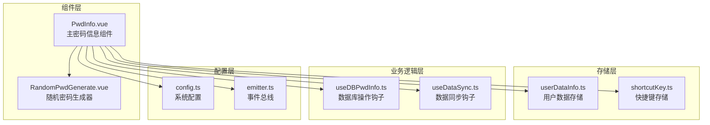
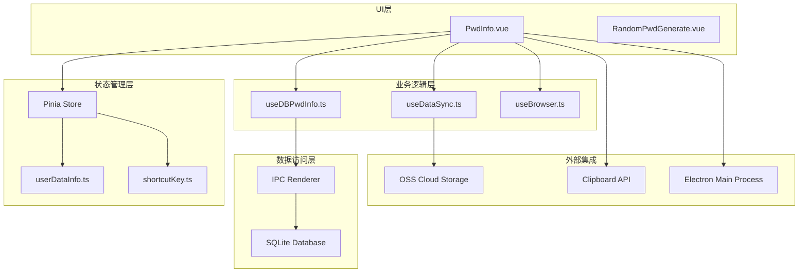
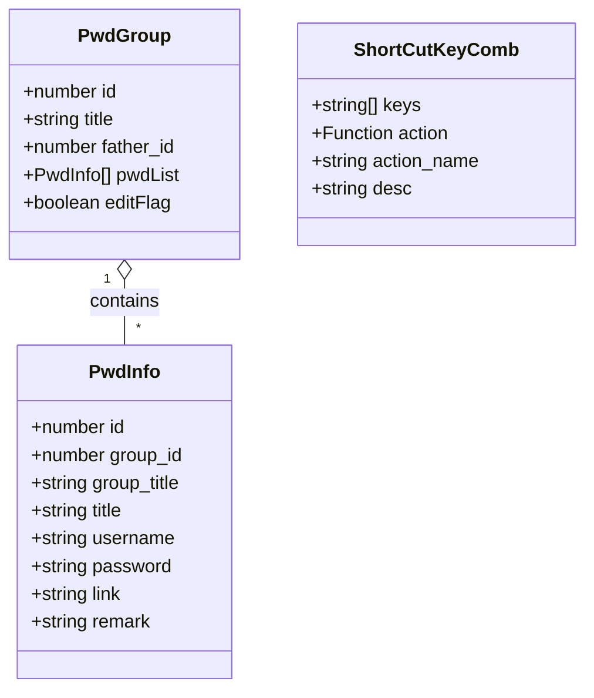
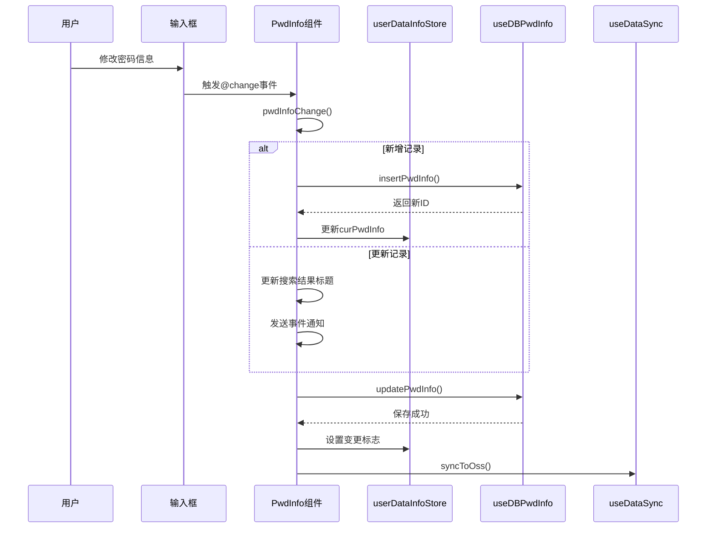
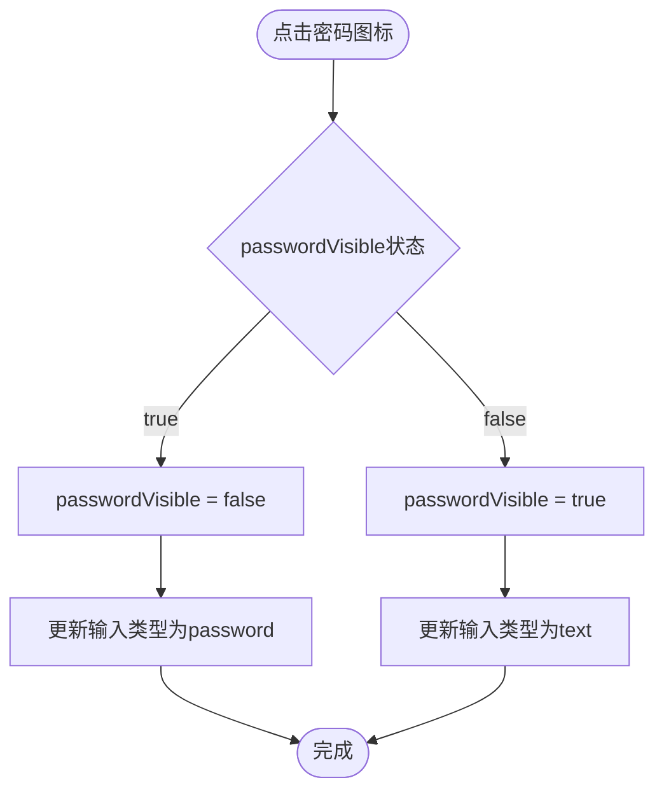
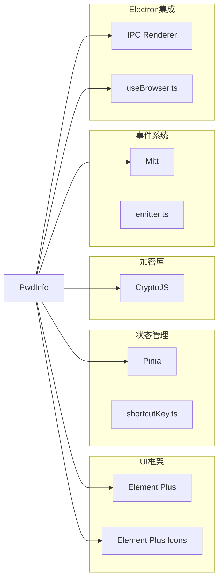
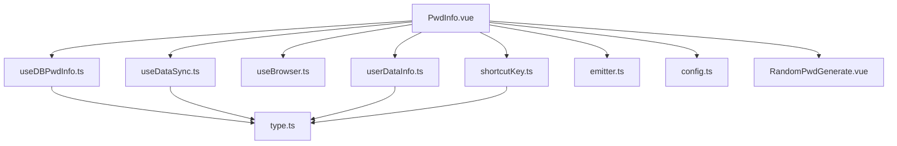

# 密码信息组件API

<cite>
**本文档引用的文件**
- [PwdInfo.vue](file://src/components/indexview/PwdInfo.vue)
- [RandomPwdGenerate.vue](file://src/components/indexview/RandomPwdGenerate.vue)
- [type.ts](file://src/components/type.ts)
- [userDataInfo.ts](file://src/store/userDataInfo.ts)
- [useDBPwdInfo.ts](file://src/hooks/useDBPwdInfo.ts)
- [useDataSync.ts](file://src/hooks/useDataSync.ts)
- [config.ts](file://src/config/config.ts)
- [shortcutKey.ts](file://src/store/shortcutKey.ts)
- [emitter.ts](file://src/utils/emitter.ts)
</cite>

## 目录
1. [简介](#简介)
2. [项目结构](#项目结构)
3. [核心组件](#核心组件)
4. [架构概览](#架构概览)
5. [详细组件分析](#详细组件分析)
6. [依赖关系分析](#依赖关系分析)
7. [性能考虑](#性能考虑)
8. [故障排除指南](#故障排除指南)
9. [结论](#结论)

## 简介

密码信息组件(PwdInfo)是密码管理器应用中的核心组件，负责展示和编辑单个密码条目信息。该组件提供了完整的密码信息管理功能，包括标题、用户名、密码、链接和说明等字段的输入和编辑，以及密码可见性切换、复制操作、随机密码生成等实用功能。

## 项目结构

PwdInfo组件位于应用的索引视图模块中，与相关的工具组件和存储模块协同工作：

**图表来源**
- [PwdInfo.vue:1-257](file://src/components/indexview/PwdInfo.vue#L1-L257)
- [RandomPwdGenerate.vue:1-144](file://src/components/indexview/RandomPwdGenerate.vue#L1-L144)
- [userDataInfo.ts:1-76](file://src/store/userDataInfo.ts#L1-L76)

## 核心组件

### 组件概述

PwdInfo组件是一个基于Vue 3 Composition API的响应式组件，采用TypeScript编写，集成了Element Plus UI库。组件通过Pinia状态管理实现数据持久化，并通过IPC通信与Electron主进程交互。

### 主要特性

- **实时数据绑定**: 使用v-model双向绑定所有密码信息字段
- **自动保存机制**: 字段变更时自动触发数据保存
- **密码可见性控制**: 支持明文/密文模式切换
- **快捷键支持**: 支持Ctrl+P复制密码、Ctrl+U复制用户名等快捷键
- **随机密码生成**: 集成密码强度配置和生成算法
- **数据同步**: 自动同步到云端存储

**章节来源**
- [PwdInfo.vue:16-31](file://src/components/indexview/PwdInfo.vue#L16-L31)
- [PwdInfo.vue:86-209](file://src/components/indexview/PwdInfo.vue#L86-L209)

## 架构概览

组件采用分层架构设计，各层职责明确：

**图表来源**
- [PwdInfo.vue:1-15](file://src/components/indexview/PwdInfo.vue#L1-L15)
- [useDBPwdInfo.ts:1-17](file://src/hooks/useDBPwdInfo.ts#L1-L17)
- [useDataSync.ts:1-17](file://src/hooks/useDataSync.ts#L1-L17)

## 详细组件分析

### 组件属性定义

PwdInfo组件通过defineProps接收父组件传递的配置参数：

| 属性名 | 类型 | 必需 | 默认值 | 描述 |
|--------|------|------|--------|------|
| transferInputFocus | boolean | 否 | false | 控制输入焦点转移的布尔标志 |

**章节来源**
- [PwdInfoList.vue:24](file://src/components/indexview/PwdInfoList.vue#L24)

### 数据模型

组件使用PwdInfo接口定义密码信息的数据结构：

**图表来源**
- [type.ts:51-88](file://src/components/type.ts#L51-L88)

**章节来源**
- [type.ts:51-67](file://src/components/type.ts#L51-L67)

### 输入字段绑定

组件为每个密码信息字段提供了完整的双向数据绑定：

#### 标题字段
- **绑定方式**: `v-model="curPwdInfo.title"`
- **验证规则**: 无特定验证规则
- **事件处理**: `@change="pwdInfoChange()"`

#### 用户名字段
- **绑定方式**: `v-model="curPwdInfo.username"`
- **验证规则**: 无特定验证规则
- **事件处理**: `@change="pwdInfoChange()"`

#### 密码字段
- **绑定方式**: `v-model="curPwdInfo.password"`
- **类型控制**: 根据`passwordVisible`状态切换明文/密文
- **验证规则**: 无特定验证规则
- **事件处理**: `@change="pwdInfoChange()"`

#### 链接字段
- **绑定方式**: `v-model="curPwdInfo.link"`
- **验证规则**: 无特定验证规则
- **事件处理**: `@change="pwdInfoChange()"`

#### 说明字段
- **绑定方式**: `v-model="curPwdInfo.remark"`
- **类型**: textarea
- **验证规则**: 无特定验证规则
- **事件处理**: `@change="pwdInfoChange()"`

**章节来源**
- [PwdInfo.vue:89-204](file://src/components/indexview/PwdInfo.vue#L89-L204)

### 事件处理机制

组件实现了多种事件处理机制：

#### 数据变更事件

**图表来源**
- [PwdInfo.vue:32-53](file://src/components/indexview/PwdInfo.vue#L32-L53)
- [useDBPwdInfo.ts:55-63](file://src/hooks/useDBPwdInfo.ts#L55-L63)
- [useDataSync.ts:133-153](file://src/hooks/useDataSync.ts#L133-L153)

#### 复制操作事件
组件支持多种复制操作：

| 操作类型 | 快捷键 | 触发方式 | 功能描述 |
|----------|--------|----------|----------|
| 复制密码 | Ctrl+P | 点击图标或快捷键 | 将当前密码复制到剪贴板 |
| 复制用户名 | Ctrl+U | 点击图标或快捷键 | 将当前用户名复制到剪贴板 |
| 复制链接 | Ctrl+L | 点击图标或快捷键 | 将当前链接复制到剪贴板 |

**章节来源**
- [PwdInfo.vue:56-78](file://src/components/indexview/PwdInfo.vue#L56-L78)
- [config.ts:27-30](file://src/config/config.ts#L27-L30)

#### 密码可见性切换

**图表来源**
- [PwdInfo.vue:80-83](file://src/components/indexview/PwdInfo.vue#L80-L83)

### 插槽和扩展点

组件提供了多个插槽位置供父组件扩展：

#### 后缀插槽
每个输入框都支持后缀插槽，用于添加额外的功能图标：
- **用户名**: 复制用户名图标
- **密码**: 明文/密文切换、随机密码生成、复制密码图标
- **链接**: 在浏览器中打开、复制链接图标

#### 自定义插槽
父组件可以通过作用域插槽自定义输入框的外观和行为。

**章节来源**
- [PwdInfo.vue:103-118](file://src/components/indexview/PwdInfo.vue#L103-L118)
- [PwdInfo.vue:160-194](file://src/components/indexview/PwdInfo.vue#L160-L194)

### 暴露的方法

组件通过`defineExpose`暴露了以下公共方法：

#### keydown方法
- **功能**: 处理键盘快捷键事件
- **参数**: `KeyboardEvent e`
- **快捷键支持**:
  - `Ctrl+P`: 复制密码
  - `Ctrl+U`: 复制用户名

#### pwdInfoTitleInput引用
- **类型**: `Ref<HTMLInputElement>`
- **用途**: 访问标题输入框的DOM元素
- **应用场景**: 焦点管理、输入验证等

**章节来源**
- [PwdInfo.vue:27](file://src/components/indexview/PwdInfo.vue#L27)
- [PwdInfo.vue:56-63](file://src/components/indexview/PwdInfo.vue#L56-L63)

### 验证规则

组件采用响应式数据绑定，未实现特定的字段验证规则。数据验证主要通过以下方式实现：

1. **基础数据绑定**: 使用Vue的v-model实现双向绑定
2. **业务逻辑验证**: 在数据保存时通过useDBPwdInfo钩子进行数据处理
3. **加密处理**: 密码字段在保存前通过加密函数处理

**章节来源**
- [PwdInfo.vue:32-53](file://src/components/indexview/PwdInfo.vue#L32-L53)

## 依赖关系分析

### 外部依赖

组件依赖于多个外部库和模块：

**图表来源**
- [PwdInfo.vue:7](file://src/components/indexview/PwdInfo.vue#L7)
- [PwdInfo.vue:13](file://src/components/indexview/PwdInfo.vue#L13)

### 内部依赖关系

**图表来源**
- [PwdInfo.vue:1-15](file://src/components/indexview/PwdInfo.vue#L1-L15)
- [useDBPwdInfo.ts:13](file://src/hooks/useDBPwdInfo.ts#L13)

**章节来源**
- [PwdInfo.vue:1-15](file://src/components/indexview/PwdInfo.vue#L1-L15)

## 性能考虑

### 渲染优化

1. **响应式更新**: 使用Vue 3的Composition API实现细粒度的状态管理
2. **条件渲染**: 密码可见性切换仅影响单个输入框的类型属性
3. **懒加载**: 随机密码生成器采用对话框形式，按需加载

### 数据同步策略

1. **增量更新**: 仅在数据变更时触发保存操作
2. **防抖处理**: 避免频繁的数据库写入操作
3. **缓存机制**: 通过Pinia store实现状态缓存

### 内存管理

1. **引用清理**: 组件卸载时自动清理事件监听器
2. **资源释放**: IPC通信结束后释放相关资源

## 故障排除指南

### 常见问题及解决方案

#### 数据保存失败
**症状**: 修改密码信息后无法保存
**可能原因**:
- 数据库连接异常
- IPC通信失败
- 权限不足

**解决步骤**:
1. 检查数据库连接状态
2. 验证IPC通道是否正常
3. 确认应用程序权限

#### 快捷键无效
**症状**: Ctrl+P、Ctrl+U等快捷键无法使用
**可能原因**:
- 快捷键配置错误
- 浏览器兼容性问题
- 系统级快捷键冲突

**解决步骤**:
1. 检查快捷键配置
2. 尝试重新注册快捷键
3. 更换快捷键组合

#### 密码复制失败
**症状**: 点击复制图标无法复制到剪贴板
**可能原因**:
- 浏览器安全策略限制
- 权限不足
- 网络环境限制

**解决步骤**:
1. 检查浏览器权限设置
2. 确认HTTPS环境
3. 尝试手动选择复制

**章节来源**
- [PwdInfo.vue:65-78](file://src/components/indexview/PwdInfo.vue#L65-L78)

## 结论

PwdInfo组件是一个功能完整、架构清晰的密码信息管理组件。它通过合理的分层设计、完善的事件处理机制和灵活的扩展点，为用户提供了优秀的密码管理体验。

### 主要优势

1. **用户体验优秀**: 提供直观的界面和便捷的操作方式
2. **功能完整**: 涵盖密码管理的核心需求
3. **扩展性强**: 通过插槽和事件机制支持个性化定制
4. **性能优化**: 采用响应式设计和缓存机制提升性能

### 改进建议

1. **增强验证**: 添加更严格的字段验证规则
2. **国际化支持**: 扩展多语言支持
3. **主题定制**: 提供更多的视觉定制选项
4. **移动端适配**: 优化移动设备上的使用体验

该组件为密码管理器应用提供了坚实的基础，是构建复杂密码管理功能的理想起点。