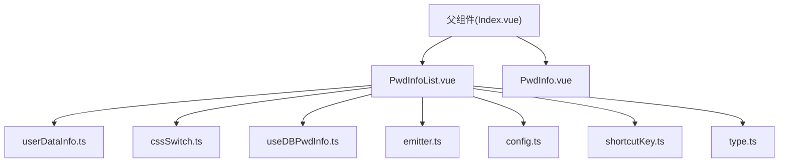
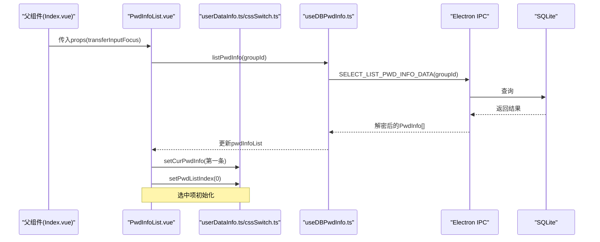
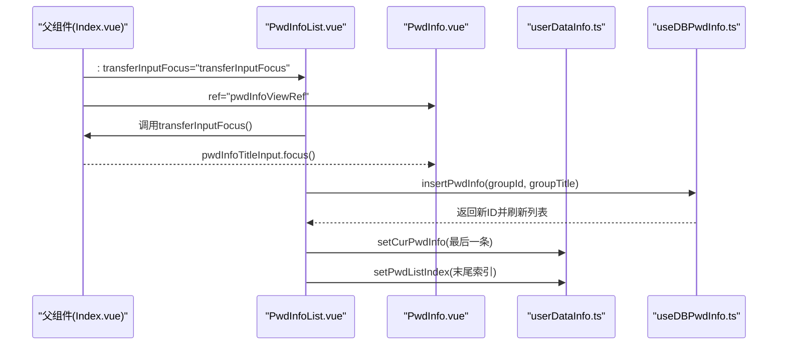
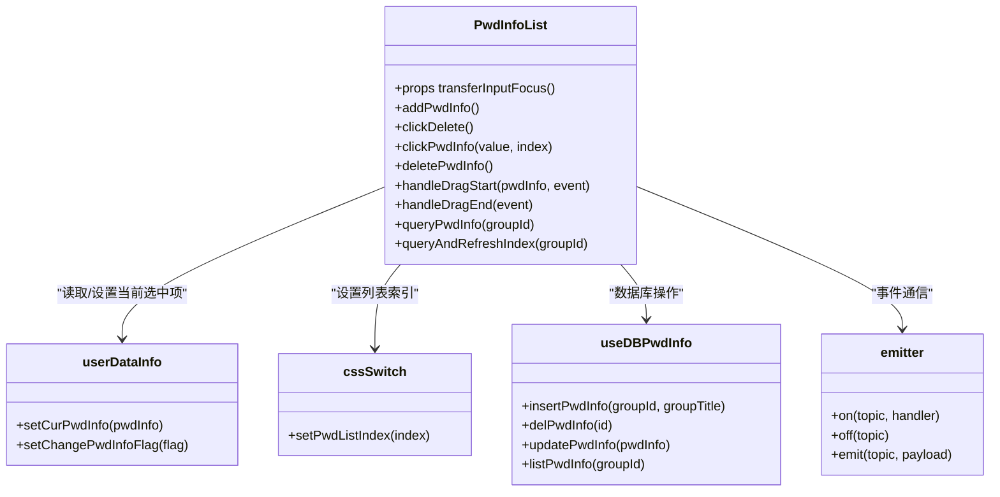

# 密码列表组件API

<cite>
**本文档引用的文件**
- [PwdInfoList.vue](file://src/components/indexview/PwdInfoList.vue)
- [PwdInfo.vue](file://src/components/indexview/PwdInfo.vue)
- [type.ts](file://src/components/type.ts)
- [config.ts](file://src/config/config.ts)
- [useDBPwdInfo.ts](file://src/hooks/useDBPwdInfo.ts)
- [userDataInfo.ts](file://src/store/userDataInfo.ts)
- [cssSwitch.ts](file://src/store/cssSwitch.ts)
- [emitter.ts](file://src/utils/emitter.ts)
- [Index.vue](file://src/components/Index.vue)
- [pwdListCache.ts](file://src/store/pwdListCache.ts)
- [searchResult.ts](file://src/store/searchResult.ts)
- [shortcutKey.ts](file://src/store/shortcutKey.ts)
</cite>

## 目录
1. [简介](#简介)
2. [项目结构](#项目结构)
3. [核心组件](#核心组件)
4. [架构总览](#架构总览)
5. [详细组件分析](#详细组件分析)
6. [依赖关系分析](#依赖关系分析)
7. [性能考虑](#性能考虑)
8. [故障排除指南](#故障排除指南)
9. [结论](#结论)
10. [附录](#附录)

## 简介
本文件为密码列表组件(PwdInfoList)的详细API文档，涵盖组件的props属性、事件、插槽与方法接口；密码列表的数据结构、排序规则与过滤机制；组件的交互行为（选中项管理、右键菜单、双击编辑等）；以及在父组件中的使用示例（数据源绑定、事件处理与样式定制）。同时记录组件的虚拟滚动、性能优化与响应式布局实现。

## 项目结构
PwdInfoList位于indexview目录下，作为主界面的一个视图组件，负责展示分组下的密码条目列表，并提供新增、删除、拖拽等交互能力。其与Pinia状态管理、数据库Hook、事件总线、快捷键配置等模块协同工作。

图表来源
- [Index.vue:44-61](file://src/components/Index.vue#L44-L61)
- [PwdInfoList.vue:1-260](file://src/components/indexview/PwdInfoList.vue#L1-L260)

章节来源
- [Index.vue:1-81](file://src/components/Index.vue#L1-L81)
- [PwdInfoList.vue:1-260](file://src/components/indexview/PwdInfoList.vue#L1-L260)

## 核心组件
- 组件名称：PwdInfoList
- 文件路径：src/components/indexview/PwdInfoList.vue
- 组件职责：
  - 展示当前分组下的密码条目列表
  - 提供新增、删除、拖拽等交互
  - 管理选中项与索引状态
  - 响应外部事件（新增、标题更新、拖拽至分组）

章节来源
- [PwdInfoList.vue:1-260](file://src/components/indexview/PwdInfoList.vue#L1-L260)

## 架构总览
PwdInfoList通过Pinia状态管理维护当前选中项与索引，通过useDBPwdInfo Hook与Electron IPC进行数据库读写，通过事件总线与其它组件通信，并结合Element Plus的滚动容器实现列表渲染。

图表来源
- [PwdInfoList.vue:37-58](file://src/components/indexview/PwdInfoList.vue#L37-L58)
- [useDBPwdInfo.ts:65-70](file://src/hooks/useDBPwdInfo.ts#L65-L70)
- [userDataInfo.ts:29-37](file://src/store/userDataInfo.ts#L29-L37)
- [cssSwitch.ts:12-14](file://src/store/cssSwitch.ts#L12-L14)

## 详细组件分析

### Props属性
- transferInputFocus: Function
  - 类型：() => void
  - 作用：将焦点从父组件切换到密码编辑器的标题输入框，便于新增条目后直接编辑标题
  - 使用场景：新增密码条目后调用，确保输入焦点正确转移
  - 来源：父组件通过ref将PwdInfoView的标题输入框引用传递给PwdInfoList

章节来源
- [PwdInfoList.vue:24](file://src/components/indexview/PwdInfoList.vue#L24)
- [Index.vue:34-37](file://src/components/Index.vue#L34-L37)

### 事件
- 外部事件
  - insertPwdInfoTopic: 触发后调用新增逻辑
  - updatePwdInfoTitle: 接收标题更新事件，同步更新列表中对应条目的title
  - pwdInfoDragToGroup: 拖拽完成事件，触发列表刷新
- 内部事件
  - clickPwdInfo: 点击列表项，更新当前选中项与索引
  - clickDelete: 删除当前选中项，弹出确认对话框
  - dragstart/dragend: 拖拽开始与结束，传递条目数据

章节来源
- [PwdInfoList.vue:61-78](file://src/components/indexview/PwdInfoList.vue#L61-L78)
- [PwdInfoList.vue:129-154](file://src/components/indexview/PwdInfoList.vue#L129-L154)
- [config.ts:5-12](file://src/config/config.ts#L5-L12)

### 插槽
- 无具名或命名插槽
- 组件内部通过模板渲染列表项与工具栏，未对外暴露插槽接口

章节来源
- [PwdInfoList.vue:157-195](file://src/components/indexview/PwdInfoList.vue#L157-L195)

### 方法接口
- 公开方法（通过defineExpose）
  - 无公开方法导出
- 内部方法
  - addPwdInfo(): 新增密码条目，刷新列表并设置当前选中项
  - clickDelete(): 删除当前选中项，弹出确认对话框
  - clickPwdInfo(value, index): 设置当前选中项与列表索引
  - deletePwdInfo(): 执行删除并刷新
  - handleDragStart(pwdInfo, event): 设置拖拽数据
  - handleDragEnd(event): 拖拽结束回调
  - queryPwdInfo(groupId): 异步查询指定分组的密码列表
  - queryAndRefreshIndex(groupId): 查询并初始化选中项与索引

章节来源
- [PwdInfoList.vue:87-154](file://src/components/indexview/PwdInfoList.vue#L87-L154)

### 数据结构
- PwdInfo
  - 字段：id, group_id, group_title, title, username, password, link, remark
  - 用途：表示单个密码条目，用于列表渲染与编辑
- PwdCache
  - 字段：id, title, username
  - 用途：缓存列表的关键字段，减少渲染与传输开销
- PwdGroup
  - 字段：id, title, father_id, pwdList, editFlag
  - 用途：分组信息，包含密码条目集合

章节来源
- [type.ts:51-88](file://src/components/type.ts#L51-L88)

### 排序规则
- 列表按数据库查询返回顺序展示，未见显式排序逻辑
- 若需自定义排序，可在父组件或Hook层对listPwdInfo返回值进行二次排序

章节来源
- [useDBPwdInfo.ts:65-70](file://src/hooks/useDBPwdInfo.ts#L65-L70)

### 过滤机制
- 组件本身未内置过滤功能
- 可通过父组件传递筛选后的PwdInfo数组，或在Hook层实现按条件查询
- 搜索结果视图由独立的SearchResult组件管理，与PwdInfoList解耦

章节来源
- [searchResult.ts:23-32](file://src/store/searchResult.ts#L23-L32)

### 交互行为
- 选中项管理
  - 点击列表项：更新userDataInfo中的curPwdInfo与cssSwitch中的curPwdListIndex
  - 初始化：首次加载时默认选中第一条
- 右键菜单
  - 组件未实现右键菜单
- 双击编辑
  - 组件未实现双击编辑
- 工具栏
  - 新增：触发新增流程并刷新列表
  - 删除：禁用条件为当前无选中项

章节来源
- [PwdInfoList.vue:129-139](file://src/components/indexview/PwdInfoList.vue#L129-L139)
- [PwdInfoList.vue:182-193](file://src/components/indexview/PwdInfoList.vue#L182-L193)

### 使用示例
- 在父组件中引入PwdInfoList并传入transferInputFocus
- 将PwdInfoView的标题输入框ref传递给PwdInfoList，以便新增后聚焦
- 监听外部事件（如新增、标题更新、拖拽完成），确保列表及时刷新

图表来源
- [Index.vue:34-37](file://src/components/Index.vue#L34-L37)
- [PwdInfoList.vue:89](file://src/components/indexview/PwdInfoList.vue#L89)
- [useDBPwdInfo.ts:21-26](file://src/hooks/useDBPwdInfo.ts#L21-L26)

章节来源
- [Index.vue:34-37](file://src/components/Index.vue#L34-L37)
- [PwdInfoList.vue:87-103](file://src/components/indexview/PwdInfoList.vue#L87-L103)

### 虚拟滚动与性能优化
- 列表渲染采用原生ul/li与Element Plus滚动容器，未使用虚拟滚动库
- 性能优化策略
  - 使用Pinia缓存store（pwdListCache）仅缓存关键字段，降低渲染与传输成本
  - 事件总线监听外部变更，避免重复查询
  - 选中项与索引状态集中管理，减少重复计算
- 建议
  - 当列表规模较大时，可引入虚拟滚动方案（如vue-virtual-scroller）以提升渲染性能

章节来源
- [pwdListCache.ts:6-37](file://src/store/pwdListCache.ts#L6-L37)
- [PwdInfoList.vue:160-180](file://src/components/indexview/PwdInfoList.vue#L160-L180)

### 响应式布局
- 列表区域宽度为父容器的35%，编辑区为40%
- 采用flex布局与固定边框，适配窗口尺寸变化
- 滚动容器支持垂直滚动，避免内容溢出

章节来源
- [PwdInfoList.vue:198-206](file://src/components/indexview/PwdInfoList.vue#L198-L206)
- [PwdInfo.vue:211-216](file://src/components/indexview/PwdInfo.vue#L211-L216)

## 依赖关系分析
- 组件依赖
  - Pinia状态：userDataInfo（当前选中项）、cssSwitch（当前索引）
  - 数据访问：useDBPwdInfo（增删改查）
  - 事件通信：emitter（跨组件事件）
  - 快捷键：shortcutKey（显示提示）
  - 类型定义：type.ts
- 外部依赖
  - Element Plus（滚动容器、图标、消息框）
  - Electron IPC（数据库操作）

图表来源
- [PwdInfoList.vue:14-21](file://src/components/indexview/PwdInfoList.vue#L14-L21)
- [userDataInfo.ts:29-37](file://src/store/userDataInfo.ts#L29-L37)
- [cssSwitch.ts:12-14](file://src/store/cssSwitch.ts#L12-L14)
- [useDBPwdInfo.ts:91-103](file://src/hooks/useDBPwdInfo.ts#L91-L103)
- [emitter.ts:1-16](file://src/utils/emitter.ts#L1-L16)

## 性能考虑
- 渲染性能
  - 列表项较少时，原生渲染已足够；当数量增长时，建议引入虚拟滚动
- 状态管理
  - 将关键字段放入缓存store，减少不必要的深拷贝与渲染
- 事件处理
  - 仅在必要时刷新列表，避免频繁查询
- 数据加密
  - 数据库读写前进行加解密，注意在UI层尽量延迟解密与渲染

## 故障排除指南
- 新增后未选中最新条目
  - 检查addPwdInfo是否正确调用setCurPwdInfo与setPwdListIndex
- 删除后列表未刷新
  - 确认deletePwdInfo是否调用queryAndRefreshIndex
- 无法接收外部事件
  - 检查emitter.on订阅与emitter.off解绑时机
- 焦点未正确转移
  - 确认父组件是否正确传递transferInputFocus并调用ref方法

章节来源
- [PwdInfoList.vue:97-102](file://src/components/indexview/PwdInfoList.vue#L97-L102)
- [PwdInfoList.vue:138-139](file://src/components/indexview/PwdInfoList.vue#L138-L139)
- [Index.vue:34-37](file://src/components/Index.vue#L34-L37)

## 结论
PwdInfoList提供了简洁高效的密码列表展示与基础交互能力，通过Pinia与事件总线实现松耦合的状态与通信。对于大规模数据，建议引入虚拟滚动与更细粒度的缓存策略以进一步提升性能。父组件可通过props与ref实现焦点与交互的无缝衔接。

## 附录

### API参考速查
- Props
  - transferInputFocus: Function
- 事件
  - 外部：insertPwdInfoTopic, updatePwdInfoTitle, pwdInfoDragToGroup
  - 内部：clickPwdInfo, clickDelete, dragstart, dragend
- 方法
  - addPwdInfo(), clickDelete(), clickPwdInfo(), deletePwdInfo(), handleDragStart(), handleDragEnd(), queryPwdInfo(), queryAndRefreshIndex()

章节来源
- [PwdInfoList.vue:24](file://src/components/indexview/PwdInfoList.vue#L24)
- [PwdInfoList.vue:61-78](file://src/components/indexview/PwdInfoList.vue#L61-L78)
- [PwdInfoList.vue:87-154](file://src/components/indexview/PwdInfoList.vue#L87-L154)