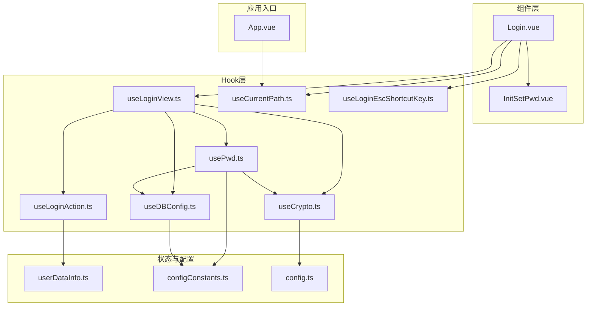
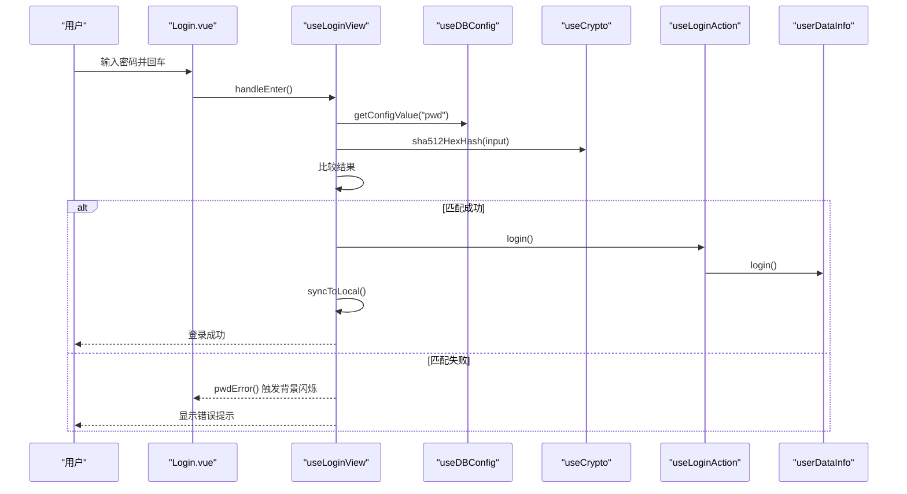
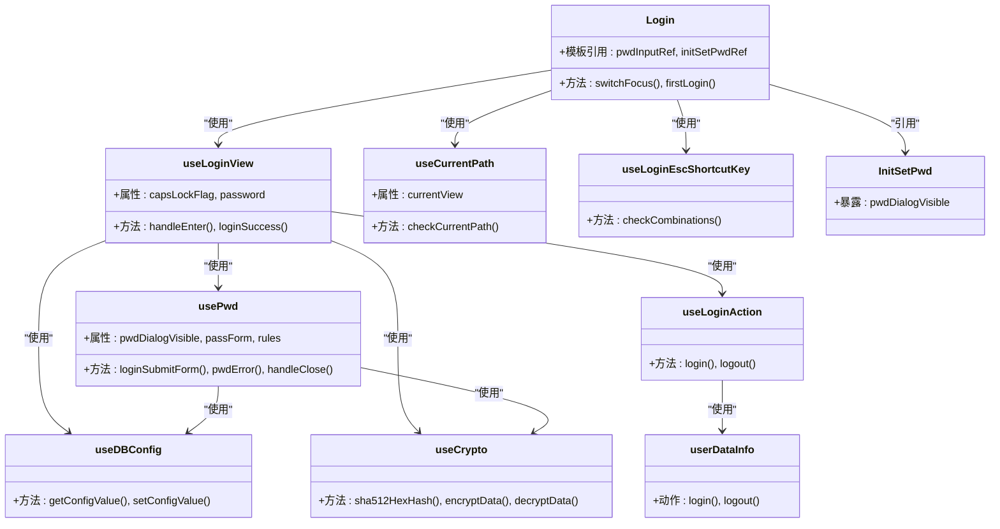

# 登录组件API

<cite>
**本文引用的文件**
- [Login.vue](file://src/components/Login.vue)
- [useLoginView.ts](file://src/hooks/useLoginView.ts)
- [usePwd.ts](file://src/hooks/usePwd.ts)
- [useDBConfig.ts](file://src/hooks/useDBConfig.ts)
- [useCrypto.ts](file://src/hooks/useCrypto.ts)
- [useLoginAction.ts](file://src/hooks/useLoginAction.ts)
- [useCurrentPath.ts](file://src/hooks/useCurrentPath.ts)
- [useLoginEscShortcutKey.ts](file://src/hooks/useLoginEscShortcutKey.ts)
- [InitSetPwd.vue](file://src/components/setview/InitSetPwd.vue)
- [userDataInfo.ts](file://src/store/userDataInfo.ts)
- [configConstants.ts](file://electron/db/sqlite/components/configConstants.ts)
- [config.ts](file://src/config/config.ts)
- [App.vue](file://src/App.vue)
</cite>

## 目录
1. [简介](#简介)
2. [项目结构](#项目结构)
3. [核心组件](#核心组件)
4. [架构总览](#架构总览)
5. [详细组件分析](#详细组件分析)
6. [依赖关系分析](#依赖关系分析)
7. [性能考虑](#性能考虑)
8. [故障排查指南](#故障排查指南)
9. [结论](#结论)
10. [附录](#附录)

## 简介
本文件为登录组件（Login）的详细API文档，覆盖组件的属性、事件、插槽与方法接口；阐述登录表单的数据模型、验证规则与错误处理机制；记录组件的交互行为（密码输入、登录按钮、回车登录、大小写提示等）；提供父组件使用示例（表单验证、事件处理、样式定制）；并总结组件的安全机制、用户体验优化与响应式设计实现。

## 项目结构
登录组件位于前端组件目录，配合多个Hook与Pinia Store完成登录流程、密码校验、首次登录引导、快捷键监听与视图切换。

图表来源
- [Login.vue:1-129](file://src/components/Login.vue#L1-L129)
- [useLoginView.ts:1-54](file://src/hooks/useLoginView.ts#L1-L54)
- [usePwd.ts:1-166](file://src/hooks/usePwd.ts#L1-L166)
- [useDBConfig.ts:1-21](file://src/hooks/useDBConfig.ts#L1-L21)
- [useCrypto.ts:1-77](file://src/hooks/useCrypto.ts#L1-L77)
- [useLoginAction.ts:1-19](file://src/hooks/useLoginAction.ts#L1-L19)
- [useCurrentPath.ts:1-44](file://src/hooks/useCurrentPath.ts#L1-L44)
- [useLoginEscShortcutKey.ts:1-47](file://src/hooks/useLoginEscShortcutKey.ts#L1-L47)
- [InitSetPwd.vue:1-46](file://src/components/setview/InitSetPwd.vue#L1-L46)
- [userDataInfo.ts:1-76](file://src/store/userDataInfo.ts#L1-L76)
- [configConstants.ts:1-29](file://electron/db/sqlite/components/configConstants.ts#L1-L29)
- [config.ts:1-143](file://src/config/config.ts#L1-L143)
- [App.vue:1-19](file://src/App.vue#L1-L19)

章节来源
- [Login.vue:1-129](file://src/components/Login.vue#L1-L129)
- [App.vue:1-19](file://src/App.vue#L1-L19)

## 核心组件
- 登录组件（Login）
  - 角色：接收用户输入的登录密码，触发登录校验，处理首次登录引导与键盘大小写提示。
  - 关键特性：首次登录弹窗引导、回车登录、Caps Lock提示、焦点管理、ESC最小化窗口。
- Hook与工具
  - useLoginView：封装登录逻辑、密码校验、Caps Lock检测、登录成功后的跳转与数据同步。
  - usePwd：封装密码设置/修改对话框、表单校验、错误提示与背景闪烁反馈。
  - useDBConfig：封装配置项读写（密码、首次登录标记等）。
  - useCrypto：封装加密算法（SHA-512加盐、AES等）。
  - useLoginAction：封装登录/登出后的页面跳转与状态变更。
  - useCurrentPath：封装路由哈希监听与当前视图计算。
  - useLoginEscShortcutKey：封装ESC最小化窗口快捷键。
- 状态与配置
  - userDataInfo：Pinia用户态状态（登录标志、锁屏时间等）。
  - configConstants：配置项常量（密码键、首次登录标记、版本字段等）。
  - config：全局配置（盐值、默认密码、AES密钥与偏移量等）。

章节来源
- [Login.vue:1-129](file://src/components/Login.vue#L1-L129)
- [useLoginView.ts:1-54](file://src/hooks/useLoginView.ts#L1-L54)
- [usePwd.ts:1-166](file://src/hooks/usePwd.ts#L1-L166)
- [useDBConfig.ts:1-21](file://src/hooks/useDBConfig.ts#L1-L21)
- [useCrypto.ts:1-77](file://src/hooks/useCrypto.ts#L1-L77)
- [useLoginAction.ts:1-19](file://src/hooks/useLoginAction.ts#L1-L19)
- [useCurrentPath.ts:1-44](file://src/hooks/useCurrentPath.ts#L1-L44)
- [useLoginEscShortcutKey.ts:1-47](file://src/hooks/useLoginEscShortcutKey.ts#L1-L47)
- [userDataInfo.ts:1-76](file://src/store/userDataInfo.ts#L1-L76)
- [configConstants.ts:1-29](file://electron/db/sqlite/components/configConstants.ts#L1-L29)
- [config.ts:1-143](file://src/config/config.ts#L1-L143)

## 架构总览
登录组件采用“组件+Hook+Store+配置”的分层架构，登录流程通过Hook解耦业务逻辑，Store统一管理用户态，配置通过Electron IPC与SQLite交互。

图表来源
- [Login.vue:45-50](file://src/components/Login.vue#L45-L50)
- [useLoginView.ts:45-50](file://src/hooks/useLoginView.ts#L45-L50)
- [useDBConfig.ts:6-18](file://src/hooks/useDBConfig.ts#L6-L18)
- [useCrypto.ts:24-29](file://src/hooks/useCrypto.ts#L24-L29)
- [useLoginAction.ts:7-10](file://src/hooks/useLoginAction.ts#L7-L10)
- [userDataInfo.ts:41-46](file://src/store/userDataInfo.ts#L41-L46)

## 详细组件分析

### 组件：Login
- 组件职责
  - 渲染密码输入框与登录图标，绑定回车事件。
  - 首次登录时弹出“设置登录密码”对话框。
  - 监听路由变化，自动聚焦密码输入框。
  - 监听Caps Lock状态，显示提示。
  - ESC按键最小化窗口。
- 属性（Props）
  - 无对外公开props（内部通过ref与Hook通信）。
- 事件（Events）
  - 无对外公开事件。
- 插槽（Slots）
  - 无具名插槽；使用默认插槽承载密码输入与后缀图标。
- 方法（Methods）
  - 无对外公开方法；通过模板ref与Hook交互。
- 数据模型与验证
  - 登录密码直接通过Hook useLoginView管理，未在组件内定义独立表单模型。
  - 首次登录密码设置由子组件 InitSetPwd 管理表单模型与校验。
- 错误处理
  - 密码错误时，组件元素背景闪烁提示。
  - 首次登录时，若用户取消设置，会提示初始密码并写入配置标记。
- 交互行为
  - 回车登录：绑定 @keyup.enter 到 handleEnter。
  - 登录图标点击：绑定 @click 到 handleEnter。
  - Caps Lock提示：根据 capsLockFlag 控制可见性。
  - 首次登录：读取配置标记，弹出设置密码对话框。
  - 路由变化：监听hash变化，自动聚焦输入框。
  - ESC最小化：监听Escape键，调用IPC关闭窗口。

章节来源
- [Login.vue:1-129](file://src/components/Login.vue#L1-L129)
- [InitSetPwd.vue:1-46](file://src/components/setview/InitSetPwd.vue#L1-L46)
- [useLoginView.ts:1-54](file://src/hooks/useLoginView.ts#L1-L54)
- [usePwd.ts:101-116](file://src/hooks/usePwd.ts#L101-L116)
- [useCurrentPath.ts:13-23](file://src/hooks/useCurrentPath.ts#L13-L23)
- [useLoginEscShortcutKey.ts:34-43](file://src/hooks/useLoginEscShortcutKey.ts#L34-L43)

### Hook：useLoginView
- 功能
  - 管理密码输入与回车登录。
  - 监听Caps Lock状态，维护 capsLockFlag。
  - 与数据库配置交互，读取真实密码并进行SHA-512校验。
  - 登录成功后执行登录动作与本地数据同步。
- 返回值
  - handleEnter：登录校验与登录动作。
  - password：登录密码双向绑定。
  - capsLockFlag：Caps Lock状态。
- 复杂度
  - 单次登录校验为O(1)，包含一次IPC读取与一次哈希计算。

章节来源
- [useLoginView.ts:1-54](file://src/hooks/useLoginView.ts#L1-L54)
- [useDBConfig.ts:6-18](file://src/hooks/useDBConfig.ts#L6-L18)
- [useCrypto.ts:24-29](file://src/hooks/useCrypto.ts#L24-L29)
- [useLoginAction.ts:7-10](file://src/hooks/useLoginAction.ts#L7-L10)

### Hook：usePwd（首次登录与密码设置）
- 功能
  - 首次登录密码设置对话框与校验。
  - 密码修改对话框与校验。
  - 密码错误时的背景闪烁反馈。
  - 对话框关闭前的二次确认。
- 返回值
  - pwdDialogVisible：设置密码对话框显隐。
  - passForm：表单数据对象（新密码、确认密码等）。
  - rules：表单校验规则。
  - loginSubmitForm：提交设置密码。
  - pwdError：错误背景闪烁。
  - handleClose：对话框关闭回调。
- 校验规则
  - 新密码：必填、长度≥6。
  - 确认密码：必填、长度≥6、与新密码一致。
- 错误处理
  - 密码长度不足或不一致时提示。
  - 修改旧密码时若不匹配则提示错误。

章节来源
- [usePwd.ts:1-166](file://src/hooks/usePwd.ts#L1-L166)
- [InitSetPwd.vue:1-46](file://src/components/setview/InitSetPwd.vue#L1-L46)

### Hook：useDBConfig
- 功能
  - 通过IPC读取/写入配置项（如密码、首次登录标记、版本号等）。
- 返回值
  - getConfigValue：异步获取配置值。
  - setConfigValue：异步设置配置值。

章节来源
- [useDBConfig.ts:1-21](file://src/hooks/useDBConfig.ts#L1-L21)
- [configConstants.ts:5-8](file://electron/db/sqlite/components/configConstants.ts#L5-L8)

### Hook：useCrypto
- 功能
  - SHA-512加盐哈希（用于登录密码校验）。
  - AES加解密（用于数据存储安全，登录组件主要使用哈希）。
- 返回值
  - sha512HexHash：密码哈希。
  - encryptData/decryptData：数据加解密。
- 安全要点
  - 使用固定盐值与密钥/偏移量，确保一致性与安全性。

章节来源
- [useCrypto.ts:1-77](file://src/hooks/useCrypto.ts#L1-L77)
- [config.ts:14-22](file://src/config/config.ts#L14-L22)

### Hook：useLoginAction
- 功能
  - 登录成功后跳转至首页并设置登录态。
  - 登出时跳转至登录页并清理搜索视图。
- 返回值
  - login/logout：动作函数。

章节来源
- [useLoginAction.ts:1-19](file://src/hooks/useLoginAction.ts#L1-L19)
- [userDataInfo.ts:41-46](file://src/store/userDataInfo.ts#L41-L46)

### Hook：useCurrentPath
- 功能
  - 监听hash变化，计算当前视图组件。
  - 提供 checkCurrentPath 判断当前是否在登录页。
- 返回值
  - currentView：当前视图组件。
  - checkCurrentPath：判断当前路径是否为登录页。

章节来源
- [useCurrentPath.ts:1-44](file://src/hooks/useCurrentPath.ts#L1-L44)
- [App.vue:12-15](file://src/App.vue#L12-L15)

### Hook：useLoginEscShortcutKey
- 功能
  - 监听键盘组合，ESC触发最小化窗口。
- 返回值
  - 无返回值（副作用：IPC调用）。

章节来源
- [useLoginEscShortcutKey.ts:1-47](file://src/hooks/useLoginEscShortcutKey.ts#L1-L47)

### 子组件：InitSetPwd
- 功能
  - 首次登录设置密码对话框。
  - 暴露 pwdDialogVisible 给父组件控制显隐。
- 插槽
  - 无具名插槽。
- 方法
  - 通过 defineExpose 暴露 pwdDialogVisible。

章节来源
- [InitSetPwd.vue:1-46](file://src/components/setview/InitSetPwd.vue#L1-L46)

### 状态：userDataInfo
- 功能
  - 维护登录态、锁屏时间、当前分组与密码条目等。
- 关键动作
  - login/logout：切换登录态。

章节来源
- [userDataInfo.ts:1-76](file://src/store/userDataInfo.ts#L1-L76)

## 依赖关系分析
- 组件与Hook
  - Login 依赖 useLoginView、useCurrentPath、useLoginEscShortcutKey、InitSetPwd。
  - useLoginView 依赖 usePwd、useDBConfig、useCrypto、useLoginAction。
  - usePwd 依赖 useDBConfig、useCrypto。
- 配置与常量
  - useDBConfig 依赖 configConstants 常量。
  - useCrypto 依赖 config 中的盐值与密钥。
- 应用入口
  - App 通过 useCurrentPath 动态渲染当前视图。

图表来源
- [Login.vue:1-129](file://src/components/Login.vue#L1-L129)
- [useLoginView.ts:1-54](file://src/hooks/useLoginView.ts#L1-L54)
- [usePwd.ts:1-166](file://src/hooks/usePwd.ts#L1-L166)
- [useDBConfig.ts:1-21](file://src/hooks/useDBConfig.ts#L1-L21)
- [useCrypto.ts:1-77](file://src/hooks/useCrypto.ts#L1-L77)
- [useLoginAction.ts:1-19](file://src/hooks/useLoginAction.ts#L1-L19)
- [useCurrentPath.ts:1-44](file://src/hooks/useCurrentPath.ts#L1-L44)
- [useLoginEscShortcutKey.ts:1-47](file://src/hooks/useLoginEscShortcutKey.ts#L1-L47)
- [InitSetPwd.vue:1-46](file://src/components/setview/InitSetPwd.vue#L1-L46)
- [userDataInfo.ts:1-76](file://src/store/userDataInfo.ts#L1-L76)

## 性能考虑
- 登录校验为O(1)，包含一次IPC读取与一次哈希计算，开销极低。
- 首次登录仅在特定条件下触发，避免重复弹窗。
- 背景闪烁动画时长短（约1秒），不影响交互流畅性。
- 建议
  - 避免在高频场景重复读取配置，可在上层缓存最近一次的密码哈希。
  - 将哈希计算与IPC调用分离，减少阻塞。

## 故障排查指南
- 登录失败
  - 现象：输入密码后背景闪烁。
  - 排查：确认密码是否正确；检查配置项“pwd”是否被正确写入；确认哈希算法与盐值一致。
  - 参考
    - [useLoginView.ts:45-50](file://src/hooks/useLoginView.ts#L45-L50)
    - [usePwd.ts:101-116](file://src/hooks/usePwd.ts#L101-L116)
- 首次登录未弹窗
  - 现象：启动后未出现设置密码对话框。
  - 排查：确认配置项“first_login_flag”是否为“1”；检查IPC调用是否成功。
  - 参考
    - [Login.vue:40-53](file://src/components/Login.vue#L40-L53)
    - [configConstants.ts:7](file://electron/db/sqlite/components/configConstants.ts#L7)
- ESC无效
  - 现象：按ESC无反应。
  - 排查：确认键盘事件监听是否生效；检查IPC通道是否可用。
  - 参考
    - [useLoginEscShortcutKey.ts:34-43](file://src/hooks/useLoginEscShortcutKey.ts#L34-L43)
- 路由切换后焦点未聚焦
  - 现象：进入登录页后无法自动聚焦。
  - 排查：确认hash变化监听是否正常；检查DOM是否存在。
  - 参考
    - [useCurrentPath.ts:33-41](file://src/hooks/useCurrentPath.ts#L33-L41)
    - [Login.vue:32-37](file://src/components/Login.vue#L32-L37)

章节来源
- [useLoginView.ts:45-50](file://src/hooks/useLoginView.ts#L45-L50)
- [usePwd.ts:101-116](file://src/hooks/usePwd.ts#L101-L116)
- [Login.vue:40-53](file://src/components/Login.vue#L40-L53)
- [configConstants.ts:7](file://electron/db/sqlite/components/configConstants.ts#L7)
- [useLoginEscShortcutKey.ts:34-43](file://src/hooks/useLoginEscShortcutKey.ts#L34-L43)
- [useCurrentPath.ts:33-41](file://src/hooks/useCurrentPath.ts#L33-L41)
- [Login.vue:32-37](file://src/components/Login.vue#L32-L37)

## 结论
登录组件通过清晰的Hook分层实现了密码输入、校验、首次登录引导、快捷键与视图联动等能力。其安全机制基于SHA-512加盐哈希与Electron IPC配置存储，错误处理与用户体验（Caps提示、背景闪烁、对话框确认）完善。建议在父组件中通过模板引用与Hook协作，结合Pinia状态管理实现完整的登录流程。

## 附录

### 使用示例（父组件集成）
- 在父组件中引入并使用登录组件
  - 引入组件与Hook：在父组件中导入 Login.vue 与相关Hook。
  - 监听路由：使用 useCurrentPath 管理视图切换。
  - 处理登录：通过 useLoginView.handleEnter 实现登录校验与跳转。
  - 样式定制：通过作用域样式覆盖组件内样式变量（如输入框圆角、尺寸等）。
- 示例参考
  - [App.vue:12-15](file://src/App.vue#L12-L15)
  - [useCurrentPath.ts:33-41](file://src/hooks/useCurrentPath.ts#L33-L41)
  - [Login.vue:57-88](file://src/components/Login.vue#L57-L88)

章节来源
- [App.vue:12-15](file://src/App.vue#L12-L15)
- [useCurrentPath.ts:33-41](file://src/hooks/useCurrentPath.ts#L33-L41)
- [Login.vue:57-88](file://src/components/Login.vue#L57-L88)

### 安全机制
- 密码存储
  - 登录密码以SHA-512加盐哈希形式存储于配置表，不存储明文。
- 数据传输
  - 配置读写通过IPC与SQLite交互，避免前端直接暴露底层细节。
- 加密扩展
  - AES加解密用于数据内容存储，登录组件主要使用哈希校验。
- 参考
  - [useCrypto.ts:24-29](file://src/hooks/useCrypto.ts#L24-L29)
  - [config.ts:14-22](file://src/config/config.ts#L14-L22)

章节来源
- [useCrypto.ts:24-29](file://src/hooks/useCrypto.ts#L24-L29)
- [config.ts:14-22](file://src/config/config.ts#L14-L22)

### 用户体验与响应式设计
- 交互优化
  - 回车登录与点击图标登录。
  - Caps Lock提示，避免误输入。
  - 登录失败背景闪烁，快速反馈。
- 响应式布局
  - 使用flex布局在视口中心居中，宽度100vw、高度95vh，适配不同屏幕尺寸。
- 参考
  - [Login.vue:58-88](file://src/components/Login.vue#L58-L88)
  - [Login.vue:90-128](file://src/components/Login.vue#L90-L128)

章节来源
- [Login.vue:58-88](file://src/components/Login.vue#L58-L88)
- [Login.vue:90-128](file://src/components/Login.vue#L90-L128)