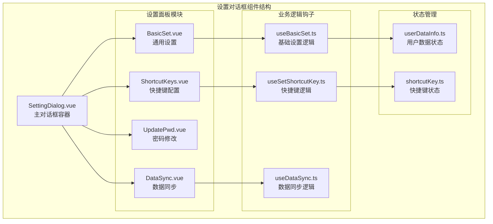
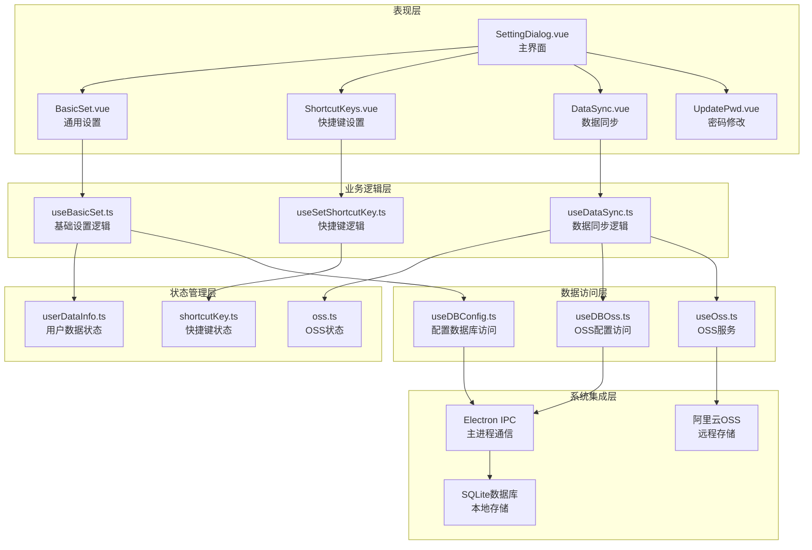
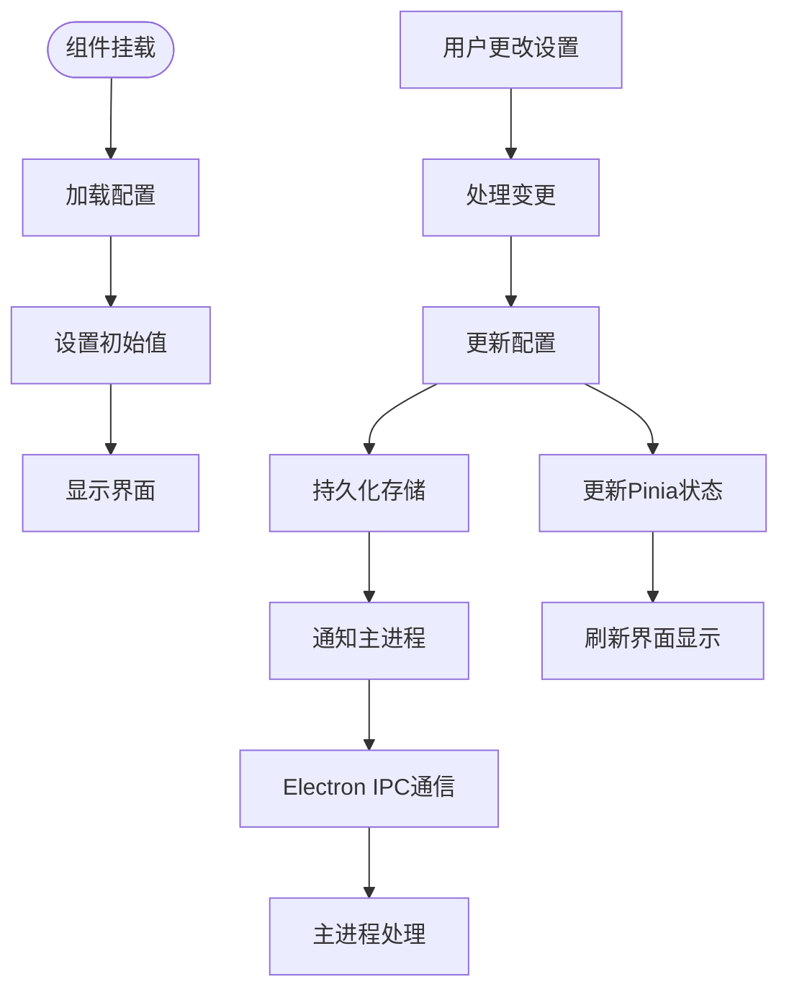
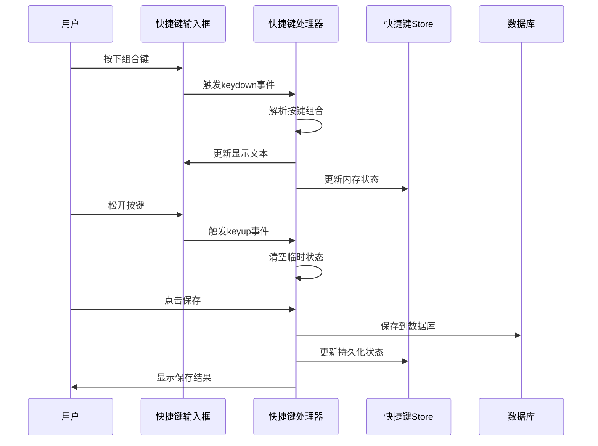
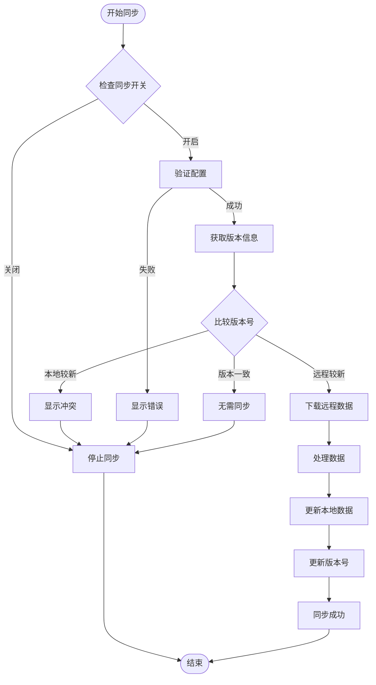
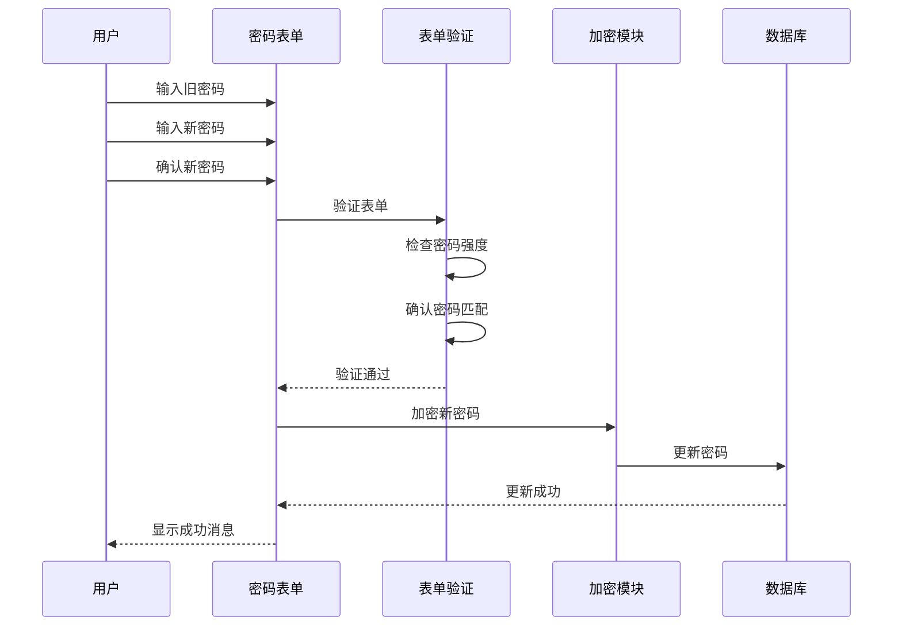
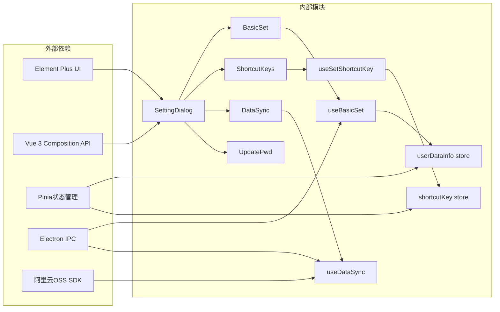

# 设置对话框组件API

<cite>
**本文档引用的文件**
- [SettingDialog.vue](file://src/components/SettingDialog.vue)
- [BasicSet.vue](file://src/components/setview/BasicSet.vue)
- [ShortcutKeys.vue](file://src/components/setview/ShortcutKeys.vue)
- [DataSync.vue](file://src/components/setview/DataSync.vue)
- [UpdatePwd.vue](file://src/components/setview/UpdatePwd.vue)
- [useBasicSet.ts](file://src/hooks/useBasicSet.ts)
- [useSetShortcutKey.ts](file://src/hooks/useSetShortcutKey.ts)
- [useDataSync.ts](file://src/hooks/useDataSync.ts)
- [config.ts](file://src/config/config.ts)
- [userDataInfo.ts](file://src/store/userDataInfo.ts)
- [shortcutKey.ts](file://src/store/shortcutKey.ts)
- [type.ts](file://src/components/type.ts)
- [configConstants.ts](file://electron/db/sqlite/components/configConstants.ts)
- [useDBConfig.ts](file://src/hooks/useDBConfig.ts)
- [useDBOss.ts](file://src/hooks/useDBOss.ts)
- [useOss.ts](file://src/hooks/useOss.ts)
</cite>

## 目录
1. [简介](#简介)
2. [项目结构](#项目结构)
3. [核心组件](#核心组件)
4. [架构概览](#架构概览)
5. [详细组件分析](#详细组件分析)
6. [依赖关系分析](#依赖关系分析)
7. [性能考虑](#性能考虑)
8. [故障排除指南](#故障排除指南)
9. [结论](#结论)
10. [附录](#附录)

## 简介
设置对话框组件(SettingDialog)是密码管理器应用中的核心配置界面，提供统一的设置入口。该组件采用标签页布局，集成了四大功能模块：通用设置、快捷键配置、密码修改和远程数据同步。组件通过暴露的开放方法供父组件调用，并通过Pinia状态管理和Electron IPC实现配置持久化。

## 项目结构
设置对话框组件位于src/components目录下，采用模块化设计，每个设置面板都是独立的Vue组件：



**图表来源**
- [SettingDialog.vue:1-60](file://src/components/SettingDialog.vue#L1-L60)
- [BasicSet.vue:1-143](file://src/components/setview/BasicSet.vue#L1-L143)
- [ShortcutKeys.vue:1-225](file://src/components/setview/ShortcutKeys.vue#L1-L225)

**章节来源**
- [SettingDialog.vue:1-60](file://src/components/SettingDialog.vue#L1-L60)
- [BasicSet.vue:1-143](file://src/components/setview/BasicSet.vue#L1-L143)
- [ShortcutKeys.vue:1-225](file://src/components/setview/ShortcutKeys.vue#L1-L225)

## 核心组件

### SettingDialog 组件API

#### Props属性
设置对话框组件本身不接收外部props属性，但通过内部状态管理实现配置功能。

#### 暴露方法
组件通过defineExpose暴露以下方法给父组件：

| 方法名 | 参数 | 返回值 | 描述 |
|--------|------|--------|------|
| openSettingDialog | 无 | void | 打开设置对话框 |

#### 事件
组件未定义自定义事件，主要通过内部状态变化和外部调用来实现交互。

#### 插槽
组件未提供插槽接口。

#### 交互行为
- 对话框默认隐藏，通过openSettingDialog方法显示
- 使用Element Plus的el-dialog组件实现模态对话框
- 采用el-tabs实现四个功能标签页的切换

**章节来源**
- [SettingDialog.vue:8-17](file://src/components/SettingDialog.vue#L8-L17)

## 架构概览

设置对话框采用分层架构设计，实现了关注点分离：



**图表来源**
- [SettingDialog.vue:1-60](file://src/components/SettingDialog.vue#L1-L60)
- [useBasicSet.ts:1-104](file://src/hooks/useBasicSet.ts#L1-L104)
- [useSetShortcutKey.ts:1-481](file://src/hooks/useSetShortcutKey.ts#L1-L481)
- [useDataSync.ts:1-324](file://src/hooks/useDataSync.ts#L1-L324)

## 详细组件分析

### 通用设置模块 (BasicSet)

#### 配置选项
通用设置模块提供以下配置功能：

| 配置项 | 控件类型 | 默认值 | 描述 |
|--------|----------|--------|------|
| 开机启动 | Switch | false | 控制应用是否随系统启动 |
| 自动退出登录时间 | InputNumber + Select | 60秒 | 设置无操作自动锁定时间 |
| 数据同步开关 | Switch | false | 启用/禁用阿里云OSS数据同步 |
| 自动上传 | Switch | true | 启用/禁用修改后自动上传 |
| 自动拉取 | Switch | true | 启用/禁用启动时自动下载 |

#### 数据流图


**图表来源**
- [BasicSet.vue:23-128](file://src/components/setview/BasicSet.vue#L23-L128)
- [useBasicSet.ts:24-86](file://src/hooks/useBasicSet.ts#L24-L86)

#### 状态管理
- 使用Pinia的userDataInfo store管理锁屏时间等用户数据
- 通过useDBConfig hook实现配置的读写
- 支持实时预览和即时生效的配置变更

**章节来源**
- [BasicSet.vue:1-143](file://src/components/setview/BasicSet.vue#L1-L143)
- [useBasicSet.ts:1-104](file://src/hooks/useBasicSet.ts#L1-L104)

### 快捷键配置模块 (ShortcutKeys)

#### 快捷键功能列表
快捷键配置模块支持以下功能的自定义快捷键：

| 功能 | 默认快捷键 | 快捷键类型 |
|------|------------|------------|
| 打开主面板 | Ctrl + Alt + E | 主要功能 |
| 退出登录 | Escape | 系统功能 |
| 复制账号 | Ctrl + U | 剪贴板操作 |
| 复制密码 | Ctrl + P | 剪贴板操作 |
| 复制链接 | Ctrl + L | 剪贴板操作 |
| 新增分组 | Ctrl + G | 编辑操作 |
| 新增密码 | Ctrl + N | 编辑操作 |
| 本地同步至远程 | Ctrl + Shift + K | 同步操作 |
| 远程同步至本地 | F5 | 同步操作 |

#### 快捷键输入流程


**图表来源**
- [ShortcutKeys.vue:55-203](file://src/components/setview/ShortcutKeys.vue#L55-L203)
- [useSetShortcutKey.ts:76-109](file://src/hooks/useSetShortcutKey.ts#L76-L109)

#### 快捷键处理机制
- 支持组合键输入检测
- 实时按键组合显示
- 删除键清除当前输入
- 批量保存和重置功能

**章节来源**
- [ShortcutKeys.vue:1-225](file://src/components/setview/ShortcutKeys.vue#L1-L225)
- [useSetShortcutKey.ts:1-481](file://src/hooks/useSetShortcutKey.ts#L1-L481)

### 数据同步模块 (DataSync)

#### 阿里云OSS配置
数据同步模块提供完整的阿里云OSS配置功能：

| 配置项 | 字段名 | 必填 | 描述 |
|--------|--------|------|------|
| Region | region | 是 | OSS区域标识 |
| AccessKey ID | keyId | 是 | 访问密钥ID |
| AccessKey Secret | key_secret | 是 | 访问密钥Secret |
| Bucket | bucket | 是 | 存储空间名称 |

#### 同步流程


**图表来源**
- [DataSync.vue:12-42](file://src/components/setview/DataSync.vue#L12-L42)
- [useDataSync.ts:79-131](file://src/hooks/useDataSync.ts#L79-L131)

#### 同步策略
- **自动同步**: 基于配置的自动上传和下载
- **手动同步**: 用户主动触发的数据同步
- **版本控制**: 通过版本号确保数据一致性
- **错误处理**: 完善的异常捕获和用户提示

**章节来源**
- [DataSync.vue:1-69](file://src/components/setview/DataSync.vue#L1-L69)
- [useDataSync.ts:1-324](file://src/hooks/useDataSync.ts#L1-L324)

### 密码修改模块 (UpdatePwd)

#### 密码修改流程
密码修改模块提供安全的密码变更功能：



**图表来源**
- [UpdatePwd.vue:11-47](file://src/components/setview/UpdatePwd.vue#L11-L47)

#### 安全特性
- 密码输入框支持隐藏显示
- 双重密码确认机制
- 前端加密处理
- 表单验证和错误提示

**章节来源**
- [UpdatePwd.vue:1-66](file://src/components/setview/UpdatePwd.vue#L1-L66)

## 依赖关系分析

### 组件依赖图


**图表来源**
- [SettingDialog.vue:1-60](file://src/components/SettingDialog.vue#L1-L60)
- [useBasicSet.ts:1-104](file://src/hooks/useBasicSet.ts#L1-L104)
- [useSetShortcutKey.ts:1-481](file://src/hooks/useSetShortcutKey.ts#L1-L481)
- [useDataSync.ts:1-324](file://src/hooks/useDataSync.ts#L1-L324)

### 数据持久化机制
组件通过多种方式实现配置的持久化：

1. **本地配置存储**: 使用SQLite数据库存储用户设置
2. **状态管理**: 通过Pinia store管理内存中的配置状态
3. **Electron IPC**: 与主进程通信实现跨进程配置同步
4. **系统集成**: 通过主进程实现开机启动等系统级功能

**章节来源**
- [useDBConfig.ts:1-21](file://src/hooks/useDBConfig.ts#L1-L21)
- [configConstants.ts:1-29](file://electron/db/sqlite/components/configConstants.ts#L1-L29)

## 性能考虑

### 优化策略
1. **懒加载**: 设置面板按需加载，减少初始渲染负担
2. **状态缓存**: 使用Pinia进行状态缓存，避免重复计算
3. **异步处理**: 所有网络操作采用异步处理，避免阻塞UI
4. **资源复用**: 通过组件复用减少内存占用

### 性能监控
- 日志输出用于调试和性能分析
- 异步操作提供进度反馈
- 错误处理确保系统稳定性

## 故障排除指南

### 常见问题及解决方案

#### 快捷键设置问题
**问题**: 快捷键无法保存或生效
**解决方案**:
1. 检查快捷键格式是否正确
2. 确认没有与其他快捷键冲突
3. 重启应用使设置生效

#### 数据同步问题
**问题**: 阿里云OSS连接失败
**解决方案**:
1. 验证AccessKey配置正确性
2. 检查Bucket权限设置
3. 确认网络连接正常
4. 查看错误日志获取具体原因

#### 密码修改失败
**问题**: 新密码无法保存
**解决方案**:
1. 检查新密码强度要求
2. 确认两次输入一致
3. 验证旧密码正确性

**章节来源**
- [useDataSync.ts:300-320](file://src/hooks/useDataSync.ts#L300-L320)
- [useSetShortcutKey.ts:400-417](file://src/hooks/useSetShortcutKey.ts#L400-L417)

## 结论
设置对话框组件提供了完整而直观的配置管理界面，通过模块化的架构设计实现了功能的高内聚低耦合。组件具备良好的扩展性和维护性，为用户提供了丰富的配置选项和流畅的使用体验。通过完善的错误处理和状态管理机制，确保了系统的稳定性和可靠性。

## 附录

### 使用示例

#### 基本使用模式
```typescript
// 父组件中使用设置对话框
<template>
  <SettingDialog ref="settingDialogRef" />
  <el-button @click="openSettings">打开设置</el-button>
</template>

<script setup>
const settingDialogRef = ref()

function openSettings() {
  settingDialogRef.value.openSettingDialog()
}
</script>
```

#### 高级配置场景
组件支持通过暴露的方法进行程序化控制，适用于复杂的业务场景集成。