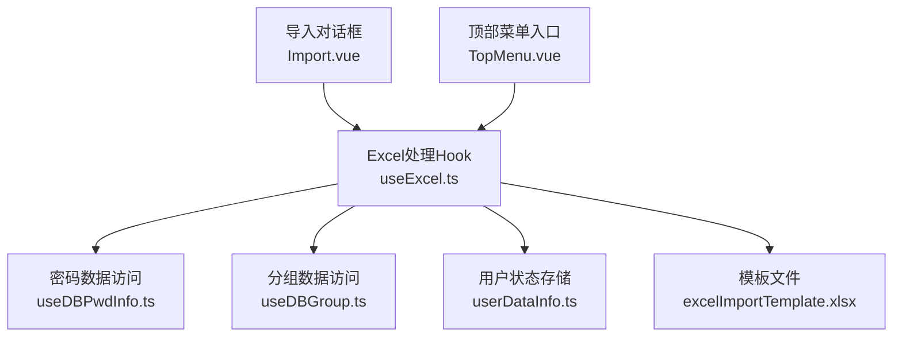
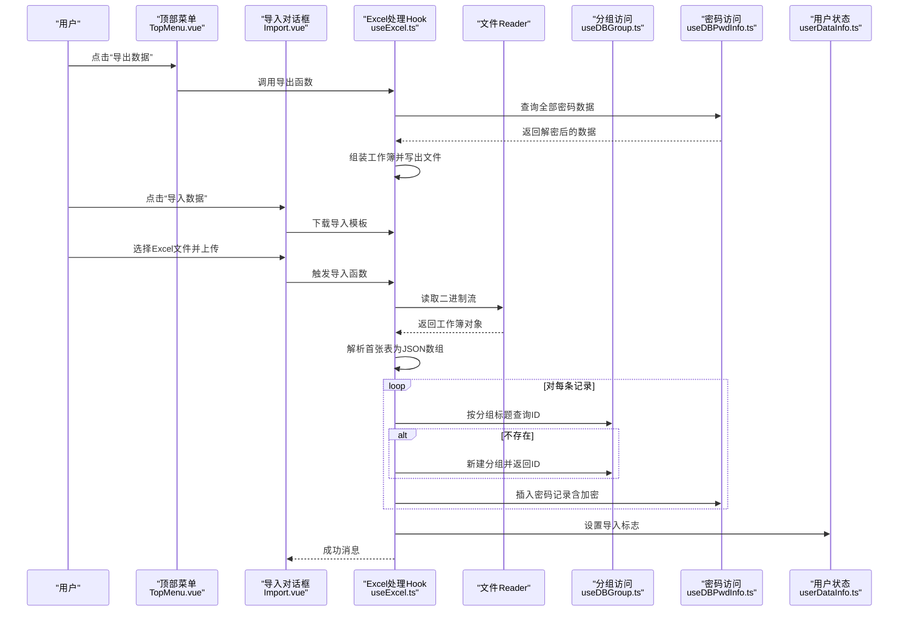
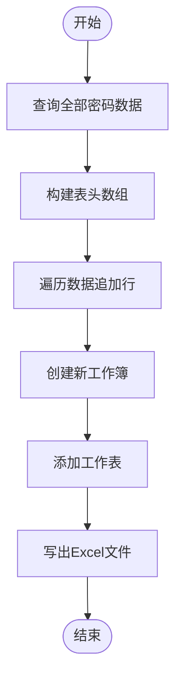
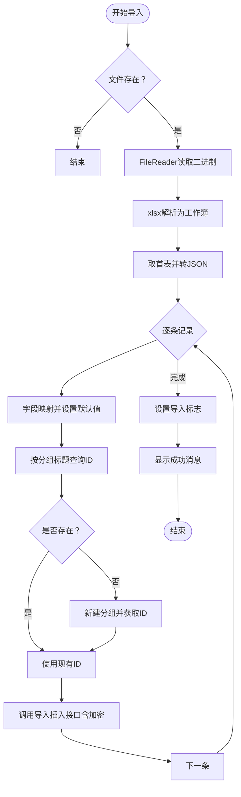
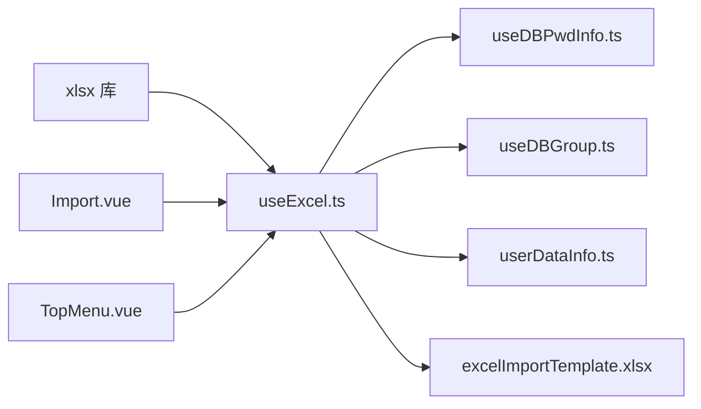

# Excel处理API

<cite>
**本文引用的文件**
- [useExcel.ts](file://src/hooks/useExcel.ts)
- [Import.vue](file://src/components/topMenu/Import.vue)
- [TopMenu.vue](file://src/components/indexview/TopMenu.vue)
- [type.ts](file://src/components/type.ts)
- [useDBPwdInfo.ts](file://src/hooks/useDBPwdInfo.ts)
- [useDBGroup.ts](file://src/hooks/useDBGroup.ts)
- [userDataInfo.ts](file://src/store/userDataInfo.ts)
- [package.json](file://package.json)
- [excelImportTemplate.xlsx](file://public/excel/template/excelImportTemplate.xlsx)
</cite>

## 目录
1. [简介](#简介)
2. [项目结构](#项目结构)
3. [核心组件](#核心组件)
4. [架构总览](#架构总览)
5. [详细组件分析](#详细组件分析)
6. [依赖关系分析](#依赖关系分析)
7. [性能考虑](#性能考虑)
8. [故障排除指南](#故障排除指南)
9. [结论](#结论)
10. [附录](#附录)

## 简介
本文件面向密码管理器中的Excel处理API，系统性说明导入与导出功能的实现方式、模板格式、数据验证与批量处理机制、接口参数规范、文件格式要求以及错误处理策略。同时提供导入导出示例代码的路径指引，帮助开发者快速集成与扩展。

## 项目结构
Excel处理API由前端Hook层、UI交互层与数据库访问层协同完成，核心文件如下：
- Hook层：负责Excel读写、模板下载、分组与密码数据的导入导出逻辑
- UI层：提供导入对话框、导出按钮入口
- 数据库层：通过IPC调用后端SQLite操作，完成数据持久化
- 类型定义：统一PwdInfo等数据模型

图表来源
- [Import.vue:1-73](file://src/components/topMenu/Import.vue#L1-L73)
- [TopMenu.vue:1-130](file://src/components/indexview/TopMenu.vue#L1-L130)
- [useExcel.ts:1-109](file://src/hooks/useExcel.ts#L1-L109)
- [useDBPwdInfo.ts:1-103](file://src/hooks/useDBPwdInfo.ts#L1-L103)
- [useDBGroup.ts:1-53](file://src/hooks/useDBGroup.ts#L1-L53)
- [userDataInfo.ts:1-76](file://src/store/userDataInfo.ts#L1-L76)
- [excelImportTemplate.xlsx](file://public/excel/template/excelImportTemplate.xlsx)

章节来源
- [useExcel.ts:1-109](file://src/hooks/useExcel.ts#L1-L109)
- [Import.vue:1-73](file://src/components/topMenu/Import.vue#L1-L73)
- [TopMenu.vue:1-130](file://src/components/indexview/TopMenu.vue#L1-L130)
- [type.ts:50-67](file://src/components/type.ts#L50-L67)
- [useDBPwdInfo.ts:17-33](file://src/hooks/useDBPwdInfo.ts#L17-L33)
- [useDBGroup.ts:13-49](file://src/hooks/useDBGroup.ts#L13-L49)
- [userDataInfo.ts:48-76](file://src/store/userDataInfo.ts#L48-L76)
- [package.json:18-28](file://package.json#L18-L28)

## 核心组件
- Excel处理Hook（useExcel.ts）
  - 提供导出函数：将当前所有密码数据导出为Excel文件
  - 提供导入函数：读取Excel文件，逐条解析并插入数据库
  - 提供模板下载函数：从public目录下载标准导入模板
- 导入对话框（Import.vue）
  - 基于Element Plus上传组件，限制文件类型与大小，支持拖拽上传
  - 提供“下载导入模板”“确定导入”按钮
- 顶部菜单入口（TopMenu.vue）
  - 提供“导入数据”“导出数据”菜单项，分别绑定导入弹窗与导出函数
- 数据访问层
  - 密码数据：useDBPwdInfo.ts封装了导入专用插入、列表查询等IPC调用
  - 分组数据：useDBGroup.ts封装了分组ID查询与新增
- 用户状态存储（userDataInfo.ts）
  - 导入完成后设置标志位，便于界面刷新或提示

章节来源
- [useExcel.ts:22-42](file://src/hooks/useExcel.ts#L22-L42)
- [useExcel.ts:44-84](file://src/hooks/useExcel.ts#L44-L84)
- [useExcel.ts:86-106](file://src/hooks/useExcel.ts#L86-L106)
- [Import.vue:14-30](file://src/components/topMenu/Import.vue#L14-L30)
- [TopMenu.vue:53-65](file://src/components/indexview/TopMenu.vue#L53-L65)
- [useDBPwdInfo.ts:28-33](file://src/hooks/useDBPwdInfo.ts#L28-L33)
- [useDBGroup.ts:45-49](file://src/hooks/useDBGroup.ts#L45-L49)
- [userDataInfo.ts:67](file://src/store/userDataInfo.ts#L67)

## 架构总览
Excel处理API采用前后端分离的前端处理模式：前端使用xlsx库进行Excel读写，通过IPC调用Electron主进程的SQLite操作，最终落库到本地数据库。

图表来源
- [TopMenu.vue:53-65](file://src/components/indexview/TopMenu.vue#L53-L65)
- [Import.vue:8-12](file://src/components/topMenu/Import.vue#L8-L12)
- [useExcel.ts:22-42](file://src/hooks/useExcel.ts#L22-L42)
- [useExcel.ts:44-84](file://src/hooks/useExcel.ts#L44-L84)
- [useDBGroup.ts:45-49](file://src/hooks/useDBGroup.ts#L45-L49)
- [useDBPwdInfo.ts:28-33](file://src/hooks/useDBPwdInfo.ts#L28-L33)
- [userDataInfo.ts:67](file://src/store/userDataInfo.ts#L67)

## 详细组件分析

### 导出功能（exportExcel）
- 数据准备
  - 读取全部密码数据，组装包含表头的二维数组
  - 表头字段：分组、标题、用户名、密码、链接、说明
- 工作簿生成
  - 使用xlsx工具创建工作簿与工作表，将二维数组转为表格
- 文件输出
  - 使用xlsx写出文件，命名为“密码管理器数据.xlsx”

图表来源
- [useExcel.ts:22-42](file://src/hooks/useExcel.ts#L22-L42)
- [useDBPwdInfo.ts:65-70](file://src/hooks/useDBPwdInfo.ts#L65-L70)

章节来源
- [useExcel.ts:22-42](file://src/hooks/useExcel.ts#L22-L42)
- [useDBPwdInfo.ts:65-70](file://src/hooks/useDBPwdInfo.ts#L65-L70)

### 导入功能（importExcel）
- 文件读取
  - 使用FileReader以二进制字符串方式读取文件
  - 使用xlsx解析为工作簿对象，取首张表并转为JSON数组
- 字段映射与默认值
  - 依据固定表头键名映射到PwdInfo字段
  - 若分组为空，默认为“默认分组”
- 分组处理
  - 先按分组标题查询ID；若不存在则新建分组并缓存ID
- 数据插入
  - 调用导入专用插入接口，密码字段在入库前进行加密
- 成功反馈
  - 显示成功消息，并设置导入标志位

图表来源
- [useExcel.ts:44-84](file://src/hooks/useExcel.ts#L44-L84)
- [useDBGroup.ts:45-49](file://src/hooks/useDBGroup.ts#L45-L49)
- [useDBPwdInfo.ts:28-33](file://src/hooks/useDBPwdInfo.ts#L28-L33)
- [userDataInfo.ts:67](file://src/store/userDataInfo.ts#L67)

章节来源
- [useExcel.ts:44-84](file://src/hooks/useExcel.ts#L44-L84)
- [useDBGroup.ts:45-49](file://src/hooks/useDBGroup.ts#L45-L49)
- [useDBPwdInfo.ts:28-33](file://src/hooks/useDBPwdInfo.ts#L28-L33)
- [userDataInfo.ts:67](file://src/store/userDataInfo.ts#L67)

### 模板下载（downloadTemplateExcel）
- 通过fetch从public目录获取模板文件
- 使用Blob与URL对象创建下载链接并触发浏览器下载
- 错误时打印日志

章节来源
- [useExcel.ts:86-106](file://src/hooks/useExcel.ts#L86-L106)
- [excelImportTemplate.xlsx](file://public/excel/template/excelImportTemplate.xlsx)

### UI交互与入口
- 导入对话框
  - 限制文件类型为.xls/.xlsx，最大50MB
  - 支持拖拽上传与数量限制
- 顶部菜单
  - “导入数据”打开导入对话框
  - “导出数据”直接触发导出

章节来源
- [Import.vue:22-30](file://src/components/topMenu/Import.vue#L22-L30)
- [Import.vue:44](file://src/components/topMenu/Import.vue#L44)
- [TopMenu.vue:53-65](file://src/components/indexview/TopMenu.vue#L53-L65)

## 依赖关系分析
- 第三方库
  - xlsx：Excel读写核心库
- 内部模块
  - useExcel.ts依赖useDBPwdInfo.ts、useDBGroup.ts、userDataInfo.ts
  - UI层依赖useExcel.ts
- 文件依赖
  - 模板文件位于public/excel/template/excelImportTemplate.xlsx

图表来源
- [package.json:28](file://package.json#L28)
- [useExcel.ts:1-109](file://src/hooks/useExcel.ts#L1-L109)
- [useDBPwdInfo.ts:1-103](file://src/hooks/useDBPwdInfo.ts#L1-L103)
- [useDBGroup.ts:1-53](file://src/hooks/useDBGroup.ts#L1-L53)
- [userDataInfo.ts:1-76](file://src/store/userDataInfo.ts#L1-L76)
- [excelImportTemplate.xlsx](file://public/excel/template/excelImportTemplate.xlsx)

章节来源
- [package.json:28](file://package.json#L28)
- [useExcel.ts:1-109](file://src/hooks/useExcel.ts#L1-L109)

## 性能考虑
- 导入批处理
  - 当前实现逐条插入，适合中小规模数据；大规模数据建议在后端实现批量插入或事务包裹，减少IPC调用次数
- 内存占用
  - 大文件读取会占用较多内存；可考虑分片读取或流式处理（需xlsx版本支持）
- 加密开销
  - 导入时对密码字段进行加密，建议在批量场景中评估CPU消耗并合理安排线程

## 故障排除指南
- 导入失败
  - 检查模板是否正确：表头必须包含“分组”“标题”“用户名”“密码”“链接”“说明”
  - 确认分组标题不为空，否则将被设为默认分组
  - 查看控制台日志定位具体记录
- 文件过大
  - 上传限制为50MB；超限将被拦截
- 模板下载失败
  - 确认模板文件存在于public/excel/template/目录
  - 检查网络请求与静态资源路径
- 导出文件异常
  - 确认已授权下载权限
  - 检查浏览器下载行为与安全策略

章节来源
- [useExcel.ts:44-84](file://src/hooks/useExcel.ts#L44-L84)
- [Import.vue:22-30](file://src/components/topMenu/Import.vue#L22-L30)
- [useExcel.ts:86-106](file://src/hooks/useExcel.ts#L86-L106)

## 结论
该Excel处理API通过简洁的Hook封装，实现了从模板下载、文件读取、字段映射、分组处理到数据插入的完整流程。结合Element Plus的上传组件与Pinia状态管理，提供了良好的用户体验。后续可在导入批处理、大文件优化与错误恢复方面进一步增强。

## 附录

### 接口与参数规范
- 导出接口
  - 函数：exportExcel()
  - 输入：无
  - 输出：浏览器触发下载“密码管理器数据.xlsx”
- 导入接口
  - 函数：importExcel(file: UploadUserFile)
  - 输入：Element Plus UploadUserFile对象
  - 输出：逐条插入数据库并显示成功消息
- 模板下载接口
  - 函数：downloadTemplateExcel()
  - 输入：无
  - 输出：浏览器触发下载“密码管理器导入模板.xlsx”

章节来源
- [useExcel.ts:22-42](file://src/hooks/useExcel.ts#L22-L42)
- [useExcel.ts:44-84](file://src/hooks/useExcel.ts#L44-L84)
- [useExcel.ts:86-106](file://src/hooks/useExcel.ts#L86-L106)

### 模板格式与字段映射
- 表头字段（固定键名）
  - 分组、标题、用户名、密码、链接、说明
- 字段映射到PwdInfo
  - group_title、title、username、password、link、remark
- 默认值策略
  - 分组为空时默认“默认分组”

章节来源
- [useExcel.ts:15-21](file://src/hooks/useExcel.ts#L15-L21)
- [useExcel.ts:58-65](file://src/hooks/useExcel.ts#L58-L65)
- [type.ts:51-67](file://src/components/type.ts#L51-L67)

### 示例代码路径
- 导出示例
  - [导出函数实现:22-42](file://src/hooks/useExcel.ts#L22-L42)
  - [导出触发入口:60-65](file://src/components/indexview/TopMenu.vue#L60-L65)
- 导入示例
  - [导入函数实现:44-84](file://src/hooks/useExcel.ts#L44-L84)
  - [导入对话框配置:37-65](file://src/components/topMenu/Import.vue#L37-L65)
- 模板下载示例
  - [模板下载实现:86-106](file://src/hooks/useExcel.ts#L86-L106)
  - [模板文件位置](file://public/excel/template/excelImportTemplate.xlsx)

### 错误处理策略
- 文件校验
  - 上传前限制文件类型与大小
- 运行时错误
  - 模板下载失败时记录日志
  - 导入过程逐条处理，失败不影响其他记录
- 状态反馈
  - 成功后设置导入标志位，便于界面刷新

章节来源
- [Import.vue:22-30](file://src/components/topMenu/Import.vue#L22-L30)
- [useExcel.ts:86-106](file://src/hooks/useExcel.ts#L86-L106)
- [userDataInfo.ts:67](file://src/store/userDataInfo.ts#L67)