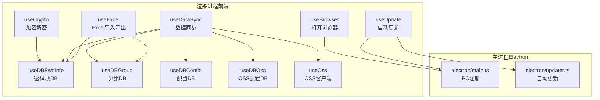
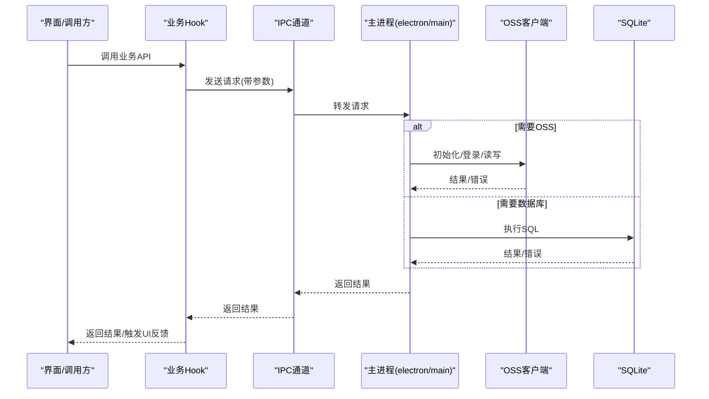
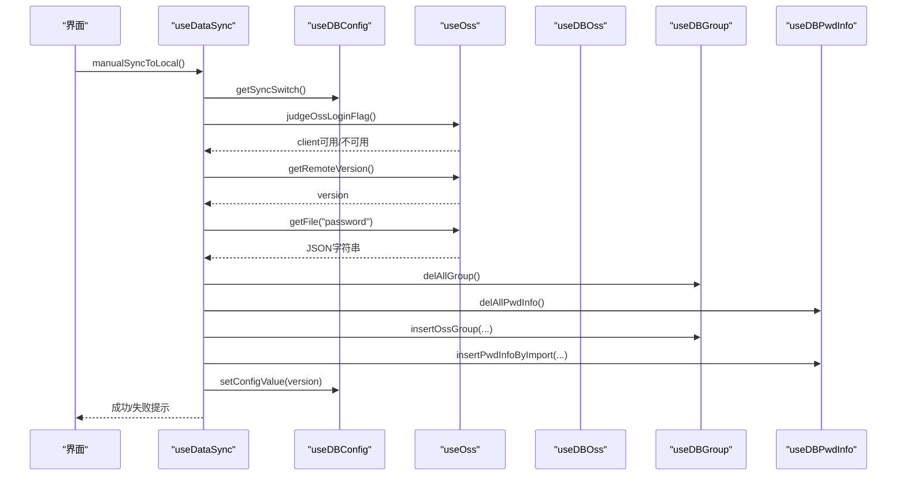
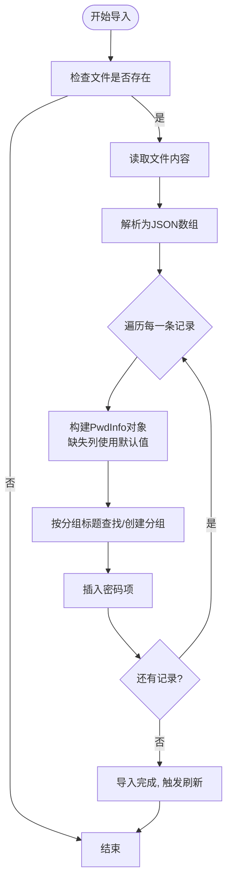
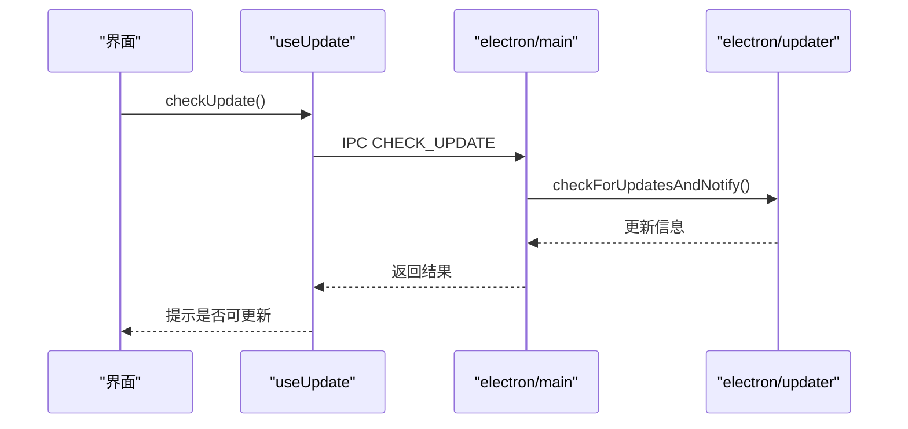
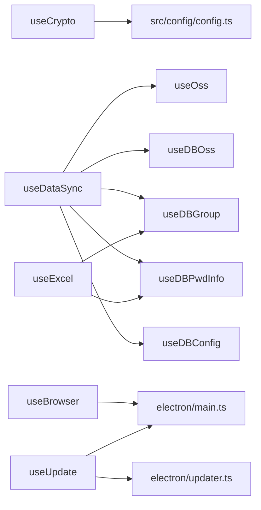

# 业务逻辑API

<cite>
**本文引用的文件**
- [src/hooks/useCrypto.ts](file://src/hooks/useCrypto.ts)
- [src/hooks/useDataSync.ts](file://src/hooks/useDataSync.ts)
- [src/hooks/useExcel.ts](file://src/hooks/useExcel.ts)
- [src/hooks/useBrowser.ts](file://src/hooks/useBrowser.ts)
- [src/hooks/useUpdate.ts](file://src/hooks/useUpdate.ts)
- [src/hooks/useOss.ts](file://src/hooks/useOss.ts)
- [src/hooks/useDBOss.ts](file://src/hooks/useDBOss.ts)
- [src/hooks/useDBPwdInfo.ts](file://src/hooks/useDBPwdInfo.ts)
- [src/hooks/useDBGroup.ts](file://src/hooks/useDBGroup.ts)
- [src/hooks/useDBConfig.ts](file://src/hooks/useDBConfig.ts)
- [src/components/type.ts](file://src/components/type.ts)
- [src/config/config.ts](file://src/config/config.ts)
- [electron/constant.ts](file://electron/constant.ts)
- [electron/main.ts](file://electron/main.ts)
- [electron/updater.ts](file://electron/updater.ts)
</cite>

## 目录
1. [简介](#简介)
2. [项目结构](#项目结构)
3. [核心组件](#核心组件)
4. [架构总览](#架构总览)
5. [详细组件分析](#详细组件分析)
6. [依赖分析](#依赖分析)
7. [性能考虑](#性能考虑)
8. [故障排查指南](#故障排查指南)
9. [结论](#结论)
10. [附录](#附录)

## 简介
本文件面向密码管理器的业务逻辑API，系统性梳理并规范以下业务能力的接口规范与实现要点：
- 加密解密服务：基于AES与哈希算法的密码字段加解密、列表批量解密
- 数据同步服务：本地与云端（OSS）之间的双向同步、版本控制与冲突处理
- Excel导入导出服务：密码数据的Excel导入模板下载、批量导入与导出
- 浏览器集成服务：通过IPC打开外部链接
- 自动更新服务：检查更新、自动检查开关、下载与安装流程

文档覆盖每个接口的输入输出、处理流程、异常与边界条件，并提供调用示例与最佳实践。

## 项目结构
前端采用Vue生态，通过Electron桥接IPC与原生能力；业务逻辑以“Hook”形式封装，统一对外暴露API。后端（主进程）负责：
- SQLite数据访问（通过IPC）
- OSS客户端封装
- 自动更新管理
- 浏览器打开外部链接

图表来源
- [src/hooks/useCrypto.ts:1-77](file://src/hooks/useCrypto.ts#L1-L77)
- [src/hooks/useDataSync.ts:1-324](file://src/hooks/useDataSync.ts#L1-L324)
- [src/hooks/useExcel.ts:1-109](file://src/hooks/useExcel.ts#L1-L109)
- [src/hooks/useBrowser.ts:1-13](file://src/hooks/useBrowser.ts#L1-L13)
- [src/hooks/useUpdate.ts:1-29](file://src/hooks/useUpdate.ts#L1-L29)
- [src/hooks/useOss.ts:1-107](file://src/hooks/useOss.ts#L1-L107)
- [src/hooks/useDBOss.ts:1-17](file://src/hooks/useDBOss.ts#L1-L17)
- [src/hooks/useDBPwdInfo.ts:1-103](file://src/hooks/useDBPwdInfo.ts#L1-L103)
- [src/hooks/useDBGroup.ts:1-53](file://src/hooks/useDBGroup.ts#L1-L53)
- [src/hooks/useDBConfig.ts:1-21](file://src/hooks/useDBConfig.ts#L1-L21)
- [electron/main.ts:1-240](file://electron/main.ts#L1-L240)
- [electron/updater.ts:1-204](file://electron/updater.ts#L1-L204)

章节来源
- [electron/constant.ts:1-63](file://electron/constant.ts#L1-L63)
- [src/config/config.ts:1-143](file://src/config/config.ts#L1-L143)

## 核心组件
- 加密解密服务：提供MD5、SHA512哈希与AES-CBC加解密，以及密码列表批量解密
- 数据同步服务：封装OSS登录、版本对比、拉取/推送、自动同步策略
- Excel导入导出服务：导出为Excel、读取Excel并导入、下载导入模板
- 浏览器集成服务：通过IPC打开外部链接
- 自动更新服务：检查更新、自动检查开关、下载与安装

章节来源
- [src/hooks/useCrypto.ts:1-77](file://src/hooks/useCrypto.ts#L1-L77)
- [src/hooks/useDataSync.ts:1-324](file://src/hooks/useDataSync.ts#L1-L324)
- [src/hooks/useExcel.ts:1-109](file://src/hooks/useExcel.ts#L1-L109)
- [src/hooks/useBrowser.ts:1-13](file://src/hooks/useBrowser.ts#L1-L13)
- [src/hooks/useUpdate.ts:1-29](file://src/hooks/useUpdate.ts#L1-L29)

## 架构总览
业务逻辑API通过Hook封装，统一通过IPC与主进程交互，主进程负责实际IO与系统能力调用。

图表来源
- [electron/main.ts:196-227](file://electron/main.ts#L196-L227)
- [electron/constant.ts:14-41](file://electron/constant.ts#L14-L41)
- [src/hooks/useOss.ts:10-107](file://src/hooks/useOss.ts#L10-L107)
- [src/hooks/useDBPwdInfo.ts:17-103](file://src/hooks/useDBPwdInfo.ts#L17-L103)

## 详细组件分析

### 加密解密服务（useCrypto）
- 职责
  - 字符串MD5与SHA512哈希
  - AES-CBC加解密（固定密钥与IV）
  - 批量解密密码列表
- 输入输出
  - md5HexHash(input: string): string
  - sha512HexHash(pwd: string): string
  - encryptData(word: string): string
  - decryptData(word: string): string
  - decryptList(pwdInfoList: PwdInfo[]): PwdInfo[]
- 处理流程
  - 参数校验（空值返回空字符串或默认值）
  - 使用固定密钥与IV进行AES加解密
  - 列表解密遍历执行
- 异常与边界
  - 输入为空时返回空字符串
  - 解密失败返回空字符串（需上层校验）
- 最佳实践
  - 密码字段入库前必须加密
  - 展示前再解密
  - 不在日志中打印明文或密钥

章节来源
- [src/hooks/useCrypto.ts:1-77](file://src/hooks/useCrypto.ts#L1-L77)
- [src/config/config.ts:14-22](file://src/config/config.ts#L14-L22)

### 数据同步服务（useDataSync）
- 职责
  - 自动/手动同步至本地与云端
  - 版本号管理与冲突处理
  - OSS登录状态校验与配置校验
- 关键API
  - syncToLocal()/manualSyncToLocal(): 拉取云端数据至本地
  - syncToOss()/manualSyncToOss(): 推送本地数据至云端
  - getSyncSwitch(): 是否启用同步
  - save()/testCli(): 保存并测试OSS配置
- 输入输出
  - syncToLocal(type: number): Promise<void>
  - manualSyncToOss(): Promise<void>
  - getRemoteVersion(): Promise<number>
  - save(): Promise<void>
  - testCli(ruleFormRef): Promise<void>
- 处理流程
  - 登录校验：若未登录则根据配置尝试登录
  - 版本对比：本地版本与远端版本比较决定是否拉取/推送
  - 拉取：从OSS读取数据，解析为同步对象，清空并重建本地分组与密码项
  - 推送：收集本地数据，写入OSS并更新版本号
- 异常与边界
  - 同步开关关闭时直接返回
  - 远端为空或版本异常时提示
  - 登录失败按错误码分类提示
- 最佳实践
  - 推送前先拉取远端最新版本，避免版本倒挂
  - 自动同步仅在满足开关与策略条件下触发
  - 失败时记录错误码便于定位

图表来源
- [src/hooks/useDataSync.ts:40-131](file://src/hooks/useDataSync.ts#L40-L131)
- [src/hooks/useOss.ts:82-99](file://src/hooks/useOss.ts#L82-L99)
- [src/hooks/useDBOss.ts:5-14](file://src/hooks/useDBOss.ts#L5-L14)
- [src/hooks/useDBGroup.ts:30-33](file://src/hooks/useDBGroup.ts#L30-L33)
- [src/hooks/useDBPwdInfo.ts:42-47](file://src/hooks/useDBPwdInfo.ts#L42-L47)

章节来源
- [src/hooks/useDataSync.ts:1-324](file://src/hooks/useDataSync.ts#L1-L324)
- [src/hooks/useOss.ts:1-107](file://src/hooks/useOss.ts#L1-L107)
- [src/hooks/useDBOss.ts:1-17](file://src/hooks/useDBOss.ts#L1-L17)
- [src/hooks/useDBGroup.ts:1-53](file://src/hooks/useDBGroup.ts#L1-L53)
- [src/hooks/useDBPwdInfo.ts:1-103](file://src/hooks/useDBPwdInfo.ts#L1-L103)
- [src/hooks/useDBConfig.ts:1-21](file://src/hooks/useDBConfig.ts#L1-L21)

### Excel导入导出服务（useExcel）
- 职责
  - 导出：将本地密码数据导出为Excel文件
  - 导入：读取Excel并批量导入，自动建组
  - 模板：提供并下载导入模板
- 关键API
  - exportExcel(): Promise<void>
  - importExcel(file: UploadUserFile): void
  - downloadTemplateExcel(): Promise<void>
- 输入输出
  - exportExcel(): 导出文件名为“密码管理器数据.xlsx”
  - importExcel(file): 解析并插入数据库
  - downloadTemplateExcel(): 下载模板文件
- 处理流程
  - 导出：查询全部密码项，写入工作簿并下载
  - 导入：读取Excel，逐条构建PwdInfo，查询/创建分组，插入密码项
  - 模板：通过静态资源URL下载
- 异常与边界
  - 文件为空直接返回
  - 缺少列时使用默认值
  - 成功后触发导入标志刷新
- 最佳实践
  - 导入前确保模板列与预期一致
  - 大量导入时注意性能与内存占用

图表来源
- [src/hooks/useExcel.ts:44-84](file://src/hooks/useExcel.ts#L44-L84)
- [src/hooks/useDBGroup.ts:45-49](file://src/hooks/useDBGroup.ts#L45-L49)
- [src/hooks/useDBPwdInfo.ts:28-33](file://src/hooks/useDBPwdInfo.ts#L28-L33)

章节来源
- [src/hooks/useExcel.ts:1-109](file://src/hooks/useExcel.ts#L1-L109)
- [src/hooks/useDBGroup.ts:1-53](file://src/hooks/useDBGroup.ts#L1-L53)
- [src/hooks/useDBPwdInfo.ts:1-103](file://src/hooks/useDBPwdInfo.ts#L1-L103)

### 浏览器集成服务（useBrowser）
- 职责
  - 通过IPC打开外部链接
- 关键API
  - openBrowser(link: string | undefined): void
- 输入输出
  - 输入：链接字符串（为空则忽略）
  - 无返回值
- 处理流程
  - 校验链接为空则直接返回
  - 调用IPC发送打开请求
- 异常与边界
  - 空链接直接返回
- 最佳实践
  - 调用前确保链接有效
  - 与安全策略结合，避免打开不受信任链接

章节来源
- [src/hooks/useBrowser.ts:1-13](file://src/hooks/useBrowser.ts#L1-L13)
- [electron/constant.ts:51](file://electron/constant.ts#L51)
- [electron/main.ts:162-165](file://electron/main.ts#L162-L165)

### 自动更新服务（useUpdate）
- 职责
  - 检查更新、设置自动检查开关、调用主进程更新流程
- 关键API
  - checkUpdate(): Promise<void>
  - getAutoCheckUpdateSwitch(): Promise<boolean>
  - setUpdateSwitch(flag: boolean): void
- 输入输出
  - checkUpdate(): 触发检查并提示结果
  - getAutoCheckUpdateSwitch(): 返回开关状态
  - setUpdateSwitch(flag: boolean): 更新开关值
- 处理流程
  - 检查：通过IPC调用主进程检查更新
  - 开关：读取/更新自动检查开关
- 异常与边界
  - 无更新时提示已是最新
- 最佳实践
  - 首次进入或手动点击时触发检查
  - 开关变更后由主进程生效

图表来源
- [src/hooks/useUpdate.ts:7-14](file://src/hooks/useUpdate.ts#L7-L14)
- [electron/main.ts:196-200](file://electron/main.ts#L196-L200)
- [electron/updater.ts:158-175](file://electron/updater.ts#L158-L175)

章节来源
- [src/hooks/useUpdate.ts:1-29](file://src/hooks/useUpdate.ts#L1-L29)
- [electron/main.ts:196-200](file://electron/main.ts#L196-L200)
- [electron/updater.ts:1-204](file://electron/updater.ts#L1-L204)

## 依赖分析
- 组件内聚与耦合
  - useCrypto独立性强，仅依赖配置常量
  - useDataSync依赖useOss、useDBOss、useDBGroup、useDBPwdInfo、useDBConfig
  - useExcel依赖useDBPwdInfo、useDBGroup、用户数据状态
  - useBrowser与useUpdate均通过IPC与主进程交互
- 外部依赖
  - OSS SDK、XLSX库、Element Plus消息提示
- IPC契约
  - SQLite相关IPC键名集中于electron/constant.ts
  - 更新相关IPC键名集中于electron/constant.ts

图表来源
- [src/hooks/useCrypto.ts:1-77](file://src/hooks/useCrypto.ts#L1-L77)
- [src/hooks/useDataSync.ts:1-324](file://src/hooks/useDataSync.ts#L1-L324)
- [src/hooks/useExcel.ts:1-109](file://src/hooks/useExcel.ts#L1-L109)
- [src/hooks/useBrowser.ts:1-13](file://src/hooks/useBrowser.ts#L1-L13)
- [src/hooks/useUpdate.ts:1-29](file://src/hooks/useUpdate.ts#L1-L29)
- [electron/main.ts:1-240](file://electron/main.ts#L1-L240)
- [electron/updater.ts:1-204](file://electron/updater.ts#L1-L204)

章节来源
- [electron/constant.ts:14-63](file://electron/constant.ts#L14-L63)

## 性能考虑
- 加密解密
  - AES加解密为CPU密集型，建议批量处理时合并调用，减少重复初始化
- 数据同步
  - 拉取/推送前进行版本对比，避免不必要的IO
  - 清空并重建本地数据时注意事务与缓存刷新
- Excel导入
  - 大文件导入建议分批处理与进度提示
  - 导入模板下载使用静态资源，避免额外网络开销
- 更新检查
  - 自动检查延迟启动，避免影响首屏体验

## 故障排查指南
- 同步失败
  - 检查OSS配置是否完整与有效
  - 查看远端版本与本地版本关系，避免版本倒挂
  - 登录失败时根据错误码定位（KeyId、Secret、权限、跨域）
- 导入失败
  - 确认Excel列与模板一致
  - 检查分组标题是否可识别
- 打开浏览器失败
  - 确认链接有效且主进程已注册IPC_OPEN_BROWSER
- 更新失败
  - 检查自动检查开关与跳过版本设置
  - 网络可达性与更新源配置

章节来源
- [src/hooks/useDataSync.ts:300-320](file://src/hooks/useDataSync.ts#L300-L320)
- [src/hooks/useExcel.ts:44-84](file://src/hooks/useExcel.ts#L44-L84)
- [src/hooks/useBrowser.ts:5-10](file://src/hooks/useBrowser.ts#L5-L10)
- [electron/main.ts:162-165](file://electron/main.ts#L162-L165)
- [electron/updater.ts:146-155](file://electron/updater.ts#L146-L155)

## 结论
本文档对密码管理器的业务逻辑API进行了系统化梳理，明确了各模块职责、接口规范、处理流程与异常处理策略。建议在实际集成中遵循参数校验、错误分类、结果反馈与缓存刷新的最佳实践，确保用户体验与数据安全。

## 附录
- 类型定义参考
  - PwdInfo、PwdGroup、OssForm、OssSyncObj、Config、UpdateVersion
- 常量与IPC键名
  - 加密密钥、盐值、默认快捷键
  - SQLite与更新相关IPC键名

章节来源
- [src/components/type.ts:4-88](file://src/components/type.ts#L4-L88)
- [src/config/config.ts:14-38](file://src/config/config.ts#L14-L38)
- [electron/constant.ts:14-63](file://electron/constant.ts#L14-L63)