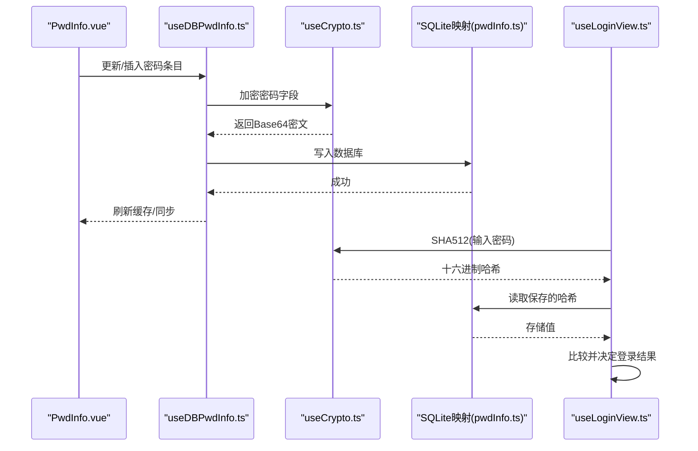
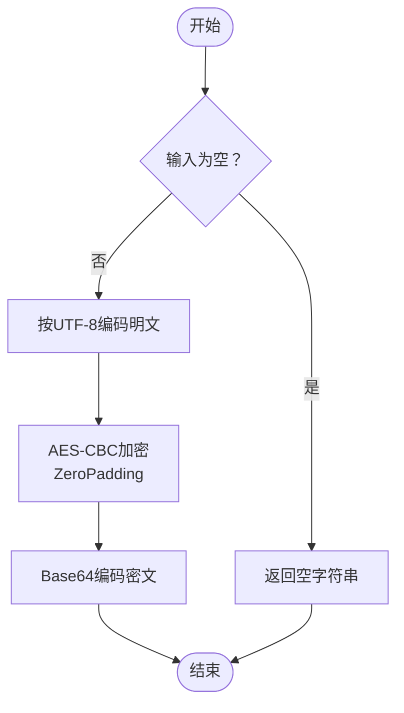
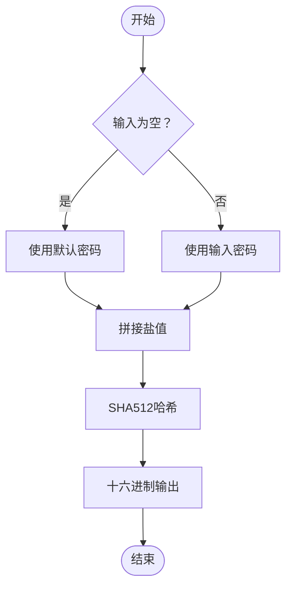
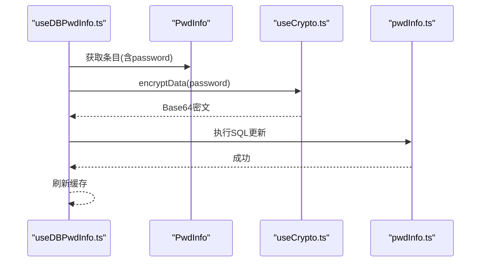
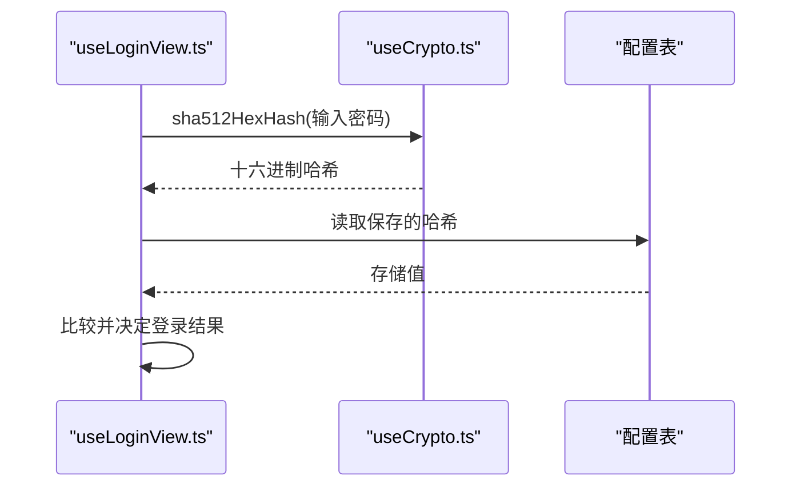
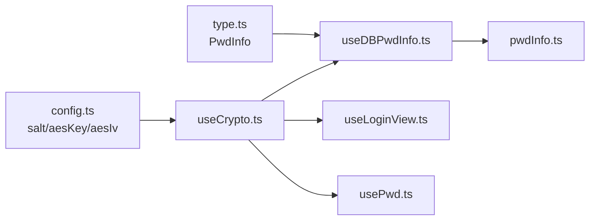

# 加密解密API

<cite>
**本文引用的文件**
- [useCrypto.ts](file://src/hooks/useCrypto.ts)
- [config.ts](file://src/config/config.ts)
- [type.ts](file://src/components/type.ts)
- [useDBPwdInfo.ts](file://src/hooks/useDBPwdInfo.ts)
- [usePwd.ts](file://src/hooks/usePwd.ts)
- [useLoginView.ts](file://src/hooks/useLoginView.ts)
- [PwdInfo.vue](file://src/components/indexview/PwdInfo.vue)
- [configConstants.ts](file://electron/db/sqlite/components/configConstants.ts)
- [pwdInfo.ts](file://electron/db/sqlite/mapper/pwdInfo.ts)
</cite>

## 目录
1. [简介](#简介)
2. [项目结构](#项目结构)
3. [核心组件](#核心组件)
4. [架构总览](#架构总览)
5. [详细组件分析](#详细组件分析)
6. [依赖关系分析](#依赖关系分析)
7. [性能考虑](#性能考虑)
8. [故障排查指南](#故障排查指南)
9. [结论](#结论)
10. [附录](#附录)

## 简介
本文件系统性梳理密码管理器中的加密解密API，覆盖以下内容：
- AES对称加密（CBC模式+ZeroPadding）
- MD5哈希与SHA512哈希
- 盐值处理策略
- 密钥与初始化向量（IV）管理
- 参数规范、返回值格式与异常处理
- 实际使用示例：密码信息加密存储与解密显示
- 安全最佳实践与性能优化建议

## 项目结构
围绕加密解密的核心文件分布如下：
- 加密工具与常量：src/hooks/useCrypto.ts、src/config/config.ts
- 数据模型：src/components/type.ts
- 数据库交互与加解密集成：src/hooks/useDBPwdInfo.ts、electron/db/sqlite/mapper/pwdInfo.ts
- 登录与密码校验：src/hooks/usePwd.ts、src/hooks/useLoginView.ts
- 前端表单与展示：src/components/indexview/PwdInfo.vue
- 配置项常量：electron/db/sqlite/components/configConstants.ts

```mermaid
graph TB
subgraph "前端应用"
UI["PwdInfo.vue<br/>密码信息编辑与展示"]
HookCrypto["useCrypto.ts<br/>加密/解密/哈希"]
HookDBPwd["useDBPwdInfo.ts<br/>数据库交互与加解密集成"]
HookPwd["usePwd.ts<br/>密码设置/修改"]
HookLogin["useLoginView.ts<br/>登录校验"]
Types["type.ts<br/>数据模型"]
Cfg["config.ts<br/>盐值/密钥/IV"]
end
subgraph "Electron后端"
Mapper["pwdInfo.ts<br/>SQLite映射"]
CfgConst["configConstants.ts<br/>配置键常量"]
end
UI --> HookDBPwd
HookDBPwd --> HookCrypto
HookDBPwd --> Mapper
HookPwd --> HookCrypto
HookLogin --> HookCrypto
HookCrypto --> Cfg
HookDBPwd --> Types
HookPwd --> CfgConst
HookLogin --> CfgConst
```

图表来源
- [useCrypto.ts:1-77](file://src/hooks/useCrypto.ts#L1-L77)
- [config.ts:14-22](file://src/config/config.ts#L14-L22)
- [type.ts:51-67](file://src/components/type.ts#L51-L67)
- [useDBPwdInfo.ts:17-80](file://src/hooks/useDBPwdInfo.ts#L17-L80)
- [usePwd.ts:11-92](file://src/hooks/usePwd.ts#L11-L92)
- [useLoginView.ts:45-50](file://src/hooks/useLoginView.ts#L45-L50)
- [pwdInfo.ts:37-48](file://electron/db/sqlite/mapper/pwdInfo.ts#L37-L48)
- [configConstants.ts:5-6](file://electron/db/sqlite/components/configConstants.ts#L5-L6)

章节来源
- [useCrypto.ts:1-77](file://src/hooks/useCrypto.ts#L1-L77)
- [config.ts:14-22](file://src/config/config.ts#L14-L22)
- [type.ts:51-67](file://src/components/type.ts#L51-L67)
- [useDBPwdInfo.ts:17-80](file://src/hooks/useDBPwdInfo.ts#L17-L80)
- [usePwd.ts:11-92](file://src/hooks/usePwd.ts#L11-L92)
- [useLoginView.ts:45-50](file://src/hooks/useLoginView.ts#L45-L50)
- [pwdInfo.ts:37-48](file://electron/db/sqlite/mapper/pwdInfo.ts#L37-L48)
- [configConstants.ts:5-6](file://electron/db/sqlite/components/configConstants.ts#L5-L6)

## 核心组件
- 加密工具钩子：提供AES对称加密/解密、MD5与SHA512哈希、盐值拼接、批量解密列表等能力
- 配置常量：集中管理盐值、AES密钥、AES IV、默认密码等
- 数据模型：PwdInfo用于承载密码条目字段
- 数据库交互：在写入/读取时自动完成加密/解密
- 登录与密码模块：使用SHA512哈希进行密码校验与变更

章节来源
- [useCrypto.ts:1-77](file://src/hooks/useCrypto.ts#L1-L77)
- [config.ts:14-22](file://src/config/config.ts#L14-L22)
- [type.ts:51-67](file://src/components/type.ts#L51-L67)
- [useDBPwdInfo.ts:17-80](file://src/hooks/useDBPwdInfo.ts#L17-L80)
- [usePwd.ts:11-92](file://src/hooks/usePwd.ts#L11-L92)
- [useLoginView.ts:45-50](file://src/hooks/useLoginView.ts#L45-L50)

## 架构总览
下图展示了从前端编辑到数据库存储的完整流程，以及登录校验路径。

图表来源
- [useDBPwdInfo.ts:56-63](file://src/hooks/useDBPwdInfo.ts#L56-L63)
- [useCrypto.ts:41-51](file://src/hooks/useCrypto.ts#L41-L51)
- [pwdInfo.ts:37-48](file://electron/db/sqlite/mapper/pwdInfo.ts#L37-L48)
- [useLoginView.ts:45-50](file://src/hooks/useLoginView.ts#L45-L50)

## 详细组件分析

### AES对称加密/解密（CBC模式+ZeroPadding）
- 功能概述
  - 加密：将明文按UTF-8编码，使用AES-CBC模式与ZeroPadding填充，输出Base64密文
  - 解密：将Base64密文解析为字节，执行AES-CBC解密，再转回UTF-8字符串
  - 批量解密：遍历密码条目列表，对每个条目的密码字段执行解密
- 参数与返回
  - encryptData(word: string): string
    - 输入：明文字符串；空串返回空串
    - 返回：Base64编码的密文字串
  - decryptData(word: string): string
    - 输入：Base64编码的密文字串；空串返回空串
    - 返回：UTF-8解密后的明文字串
  - decryptList(pwdInfoList: PwdInfo[]): PwdInfo[]
    - 输入：密码条目数组；空数组直接返回
    - 返回：原数组，其中每个条目的密码字段已解密
- 异常与边界
  - 对空输入返回空字符串，避免抛出异常
  - 解密失败或Base64非法时，CryptoJS可能产生不可预期结果；建议上层捕获并提示
- 安全要点
  - 使用固定密钥与IV，便于跨会话一致性，但需确保密钥与IV的保密性
  - ZeroPadding在CBC模式下存在语义攻击风险，建议迁移到更安全的填充方案或使用AEAD

图表来源
- [useCrypto.ts:41-51](file://src/hooks/useCrypto.ts#L41-L51)

章节来源
- [useCrypto.ts:41-77](file://src/hooks/useCrypto.ts#L41-L77)

### MD5哈希
- 功能概述
  - 将输入按MD5计算，输出十六进制字符串
- 参数与返回
  - md5HexHash(input: string): string
    - 输入：任意字符串
    - 返回：MD5十六进制小写字符串
- 应用场景
  - 当前项目未直接使用MD5进行密码存储或校验，主要用于其他用途（如日志或标识）

章节来源
- [useCrypto.ts:11-16](file://src/hooks/useCrypto.ts#L11-L16)

### SHA512哈希
- 功能概述
  - 在密码前后拼接盐值，计算SHA512，输出十六进制字符串
- 参数与返回
  - sha512HexHash(pwd: string): string
    - 输入：密码字符串；空时使用默认值
    - 返回：SHA512十六进制小写字符串
- 盐值处理
  - pwdAddSalt：将输入与全局盐值拼接后再哈希
  - 盐值定义于配置文件，用于对抗彩虹表与提升碰撞成本

图表来源
- [useCrypto.ts:18-29](file://src/hooks/useCrypto.ts#L18-L29)
- [config.ts:14](file://src/config/config.ts#L14)

章节来源
- [useCrypto.ts:18-29](file://src/hooks/useCrypto.ts#L18-L29)
- [config.ts:14](file://src/config/config.ts#L14)

### 密钥、盐值与初始化向量（IV）
- 密钥与IV
  - aesKey、aesIv来源于配置文件，作为AES-CBC的密钥与IV
- 盐值
  - salt来源于配置文件，用于SHA512哈希前缀拼接
- 管理建议
  - 密钥与IV应长期保存且保密；建议采用安全存储或硬件抽象
  - 盐值应与密文一同持久化，以便后续验证与迁移

章节来源
- [config.ts:14-22](file://src/config/config.ts#L14-L22)

### 数据模型与数据库集成
- 数据模型
  - PwdInfo：包含id、group_id、group_title、title、username、password、link、remark等字段
- 数据库写入流程
  - 写入前对password字段调用加密函数，将明文转换为Base64密文
  - 写入SQLite映射层，统一执行SQL更新
- 数据库读取流程
  - 从数据库读取后，调用批量解密函数，将Base64密文还原为明文

图表来源
- [useDBPwdInfo.ts:56-63](file://src/hooks/useDBPwdInfo.ts#L56-L63)
- [useCrypto.ts:41-51](file://src/hooks/useCrypto.ts#L41-L51)
- [pwdInfo.ts:37-48](file://electron/db/sqlite/mapper/pwdInfo.ts#L37-L48)

章节来源
- [type.ts:51-67](file://src/components/type.ts#L51-L67)
- [useDBPwdInfo.ts:56-63](file://src/hooks/useDBPwdInfo.ts#L56-L63)
- [pwdInfo.ts:37-48](file://electron/db/sqlite/mapper/pwdInfo.ts#L37-L48)

### 登录与密码管理中的哈希使用
- 登录校验
  - 读取配置表中保存的SHA512哈希值，与用户输入经相同哈希算法得到的结果比较
- 密码设置/修改
  - 新密码设置时，先进行SHA512哈希并写入配置表
  - 修改密码时，先校验旧密码哈希，再写入新哈希

图表来源
- [useLoginView.ts:45-50](file://src/hooks/useLoginView.ts#L45-L50)
- [usePwd.ts:22-35](file://src/hooks/usePwd.ts#L22-L35)
- [usePwd.ts:73-92](file://src/hooks/usePwd.ts#L73-L92)
- [configConstants.ts:5-6](file://electron/db/sqlite/components/configConstants.ts#L5-L6)

章节来源
- [useLoginView.ts:45-50](file://src/hooks/useLoginView.ts#L45-L50)
- [usePwd.ts:22-35](file://src/hooks/usePwd.ts#L22-L35)
- [usePwd.ts:73-92](file://src/hooks/usePwd.ts#L73-L92)
- [configConstants.ts:5-6](file://electron/db/sqlite/components/configConstants.ts#L5-L6)

### 前端展示与复制
- 明文切换
  - PwdInfo.vue支持点击图标切换密码可见性，便于用户核对
- 复制功能
  - 支持复制用户名、密码、链接至剪贴板
- 注意
  - 复制的是明文，应在安全环境下使用

章节来源
- [PwdInfo.vue:80-78](file://src/components/indexview/PwdInfo.vue#L80-L78)

## 依赖关系分析
- 组件耦合
  - useDBPwdInfo依赖useCrypto进行加解密
  - usePwd与useLoginView依赖useCrypto进行SHA512哈希
  - useCrypto依赖config.ts中的盐值、密钥与IV
- 外部依赖
  - 使用CryptoJS库实现AES、MD5、SHA512与Base64编解码
- 潜在问题
  - 固定密钥与IV在多实例部署或迁移场景下需谨慎处理
  - ZeroPadding在CBC模式下安全性较低，建议升级为更安全的模式或AEAD

图表来源
- [useCrypto.ts:1-77](file://src/hooks/useCrypto.ts#L1-L77)
- [config.ts:14-22](file://src/config/config.ts#L14-L22)
- [type.ts:51-67](file://src/components/type.ts#L51-L67)
- [useDBPwdInfo.ts:17-80](file://src/hooks/useDBPwdInfo.ts#L17-L80)
- [useLoginView.ts:45-50](file://src/hooks/useLoginView.ts#L45-L50)
- [usePwd.ts:11-92](file://src/hooks/usePwd.ts#L11-L92)
- [pwdInfo.ts:37-48](file://electron/db/sqlite/mapper/pwdInfo.ts#L37-L48)

章节来源
- [useCrypto.ts:1-77](file://src/hooks/useCrypto.ts#L1-L77)
- [config.ts:14-22](file://src/config/config.ts#L14-L22)
- [type.ts:51-67](file://src/components/type.ts#L51-L67)
- [useDBPwdInfo.ts:17-80](file://src/hooks/useDBPwdInfo.ts#L17-L80)
- [useLoginView.ts:45-50](file://src/hooks/useLoginView.ts#L45-L50)
- [usePwd.ts:11-92](file://src/hooks/usePwd.ts#L11-L92)
- [pwdInfo.ts:37-48](file://electron/db/sqlite/mapper/pwdInfo.ts#L37-L48)

## 性能考虑
- 加密开销
  - AES-CBC在现代CPU上开销较小，但在大量条目批量解密时仍需注意
- 批量解密
  - decryptList对数组逐项解密，时间复杂度O(n)，建议在渲染前一次性解密并缓存
- I/O与缓存
  - 结合前端缓存策略减少重复解密与数据库往返
- 建议
  - 对高频操作（如列表加载）采用分页与懒加载
  - 对大文本字段可考虑延迟解密，仅在需要时解密

## 故障排查指南
- 常见问题
  - 解密后出现乱码：检查密钥/IV是否正确、是否使用了正确的编码（UTF-8）
  - 登录失败：确认SHA512哈希是否一致，检查盐值拼接逻辑
  - 复制明文导致泄露：在非安全环境下避免复制明文
- 排查步骤
  - 核对配置常量：salt、aesKey、aesIv
  - 核对数据库字段：password是否为Base64密文
  - 核对调用链路：写入前加密、读取后解密
- 建议
  - 在开发环境开启日志，定位具体环节
  - 对异常输入（空串、非法Base64）进行边界测试

章节来源
- [useCrypto.ts:41-77](file://src/hooks/useCrypto.ts#L41-L77)
- [useDBPwdInfo.ts:56-76](file://src/hooks/useDBPwdInfo.ts#L56-L76)
- [useLoginView.ts:45-50](file://src/hooks/useLoginView.ts#L45-L50)

## 结论
- 本项目采用AES-CBC+ZeroPadding进行对称加密，结合SHA512哈希与盐值进行密码校验
- 加密/解密流程清晰，贯穿数据库写入与读取，前端展示与复制均基于明文
- 安全性方面，建议升级为更安全的加密模式或引入AEAD，并加强密钥与IV的保护与轮换策略

## 附录

### API参数与返回规范
- AES加密
  - encryptData(word: string): string
    - 输入：明文字串；空串返回空串
    - 输出：Base64密文字串
- AES解密
  - decryptData(word: string): string
    - 输入：Base64密文字串；空串返回空串
    - 输出：UTF-8明文字串
- 批量解密
  - decryptList(pwdInfoList: PwdInfo[]): PwdInfo[]
    - 输入：密码条目数组；空数组返回原数组
    - 输出：原数组，密码字段已解密
- MD5哈希
  - md5HexHash(input: string): string
    - 输入：任意字符串
    - 输出：MD5十六进制小写字符串
- SHA512哈希
  - sha512HexHash(pwd: string): string
    - 输入：密码字符串；空时使用默认值
    - 输出：SHA512十六进制小写字符串

章节来源
- [useCrypto.ts:41-77](file://src/hooks/useCrypto.ts#L41-L77)

### 使用示例（路径指引）
- 加密存储密码
  - 在更新密码条目时，调用加密函数并将结果写入数据库
  - 参考路径：[useDBPwdInfo.ts:56-63](file://src/hooks/useDBPwdInfo.ts#L56-L63)、[useCrypto.ts:41-51](file://src/hooks/useCrypto.ts#L41-L51)
- 解密显示密码
  - 从数据库读取后，调用批量解密函数，再在界面展示
  - 参考路径：[useDBPwdInfo.ts:65-76](file://src/hooks/useDBPwdInfo.ts#L65-L76)、[useCrypto.ts:68-74](file://src/hooks/useCrypto.ts#L68-L74)
- 登录校验
  - 将用户输入进行SHA512哈希并与存储值比较
  - 参考路径：[useLoginView.ts:45-50](file://src/hooks/useLoginView.ts#L45-L50)、[usePwd.ts:22-35](file://src/hooks/usePwd.ts#L22-L35)

### 安全最佳实践
- 密钥与IV管理
  - 使用安全存储或硬件抽象保存密钥与IV
  - 定期轮换密钥，迁移时保持兼容
- 加密模式选择
  - 优先使用AEAD（如AES-GCM）以获得完整性与机密性
  - 避免ZeroPadding在CBC模式下的语义攻击风险
- 盐值策略
  - SHA512哈希使用全局盐值，确保不同实例间的一致性
- 前端敏感操作
  - 明文展示与复制需在安全环境下进行，避免日志与屏幕截图泄露