# 数据同步API

<cite>
**本文档引用的文件**
- [useDataSync.ts](file://src/hooks/useDataSync.ts)
- [useOss.ts](file://src/hooks/useOss.ts)
- [oss.ts](file://src/store/oss.ts)
- [useDBOss.ts](file://src/hooks/useDBOss.ts)
- [oss.ts](file://electron/db/sqlite/mapper/oss.ts)
- [configConstants.ts](file://electron/db/sqlite/components/configConstants.ts)
- [type.ts](file://src/components/type.ts)
- [DataSync.vue](file://src/components/setview/DataSync.vue)
- [main.ts](file://electron/main.ts)
- [sqlite-ipc.ts](file://electron/db/sqlite/sqlite-ipc.ts)
- [constant.ts](file://electron/constant.ts)
- [initSql.ts](file://electron/db/sqlite/components/initSql.ts)
- [config.ts](file://src/config/config.ts)
</cite>

## 目录
1. [简介](#简介)
2. [项目结构](#项目结构)
3. [核心组件](#核心组件)
4. [架构概览](#架构概览)
5. [详细组件分析](#详细组件分析)
6. [依赖关系分析](#依赖关系分析)
7. [性能考虑](#性能考虑)
8. [故障排除指南](#故障排除指南)
9. [结论](#结论)

## 简介

密码管理器的数据同步API实现了本地SQLite数据库与阿里云OSS之间的双向数据同步机制。该系统提供了完整的同步策略、冲突解决和增量更新功能，支持初始化同步、定期同步和手动同步等多种同步模式。

## 项目结构

密码管理器采用前后端分离的架构设计，数据同步功能主要分布在以下层次：

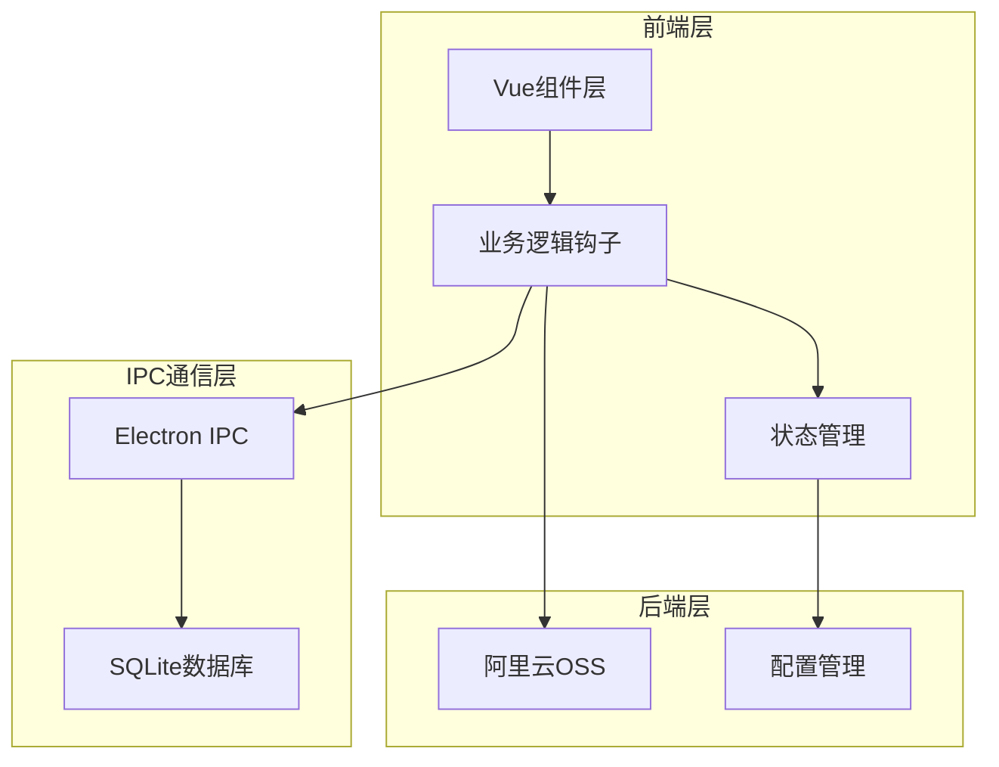

**图表来源**
- [useDataSync.ts:1-324](file://src/hooks/useDataSync.ts#L1-L324)
- [useOss.ts:1-107](file://src/hooks/useOss.ts#L1-L107)
- [oss.ts:1-59](file://src/store/oss.ts#L1-L59)

**章节来源**
- [useDataSync.ts:1-324](file://src/hooks/useDataSync.ts#L1-L324)
- [main.ts:1-240](file://electron/main.ts#L1-L240)

## 核心组件

### 数据同步核心模块

数据同步功能由多个核心组件协同工作，主要包括：

1. **useDataSync钩子** - 主要的同步逻辑处理
2. **useOss钩子** - OSS客户端封装
3. **OSS状态管理** - 同步状态跟踪
4. **数据库映射层** - SQLite数据库操作
5. **配置常量** - 同步配置参数

### 数据模型

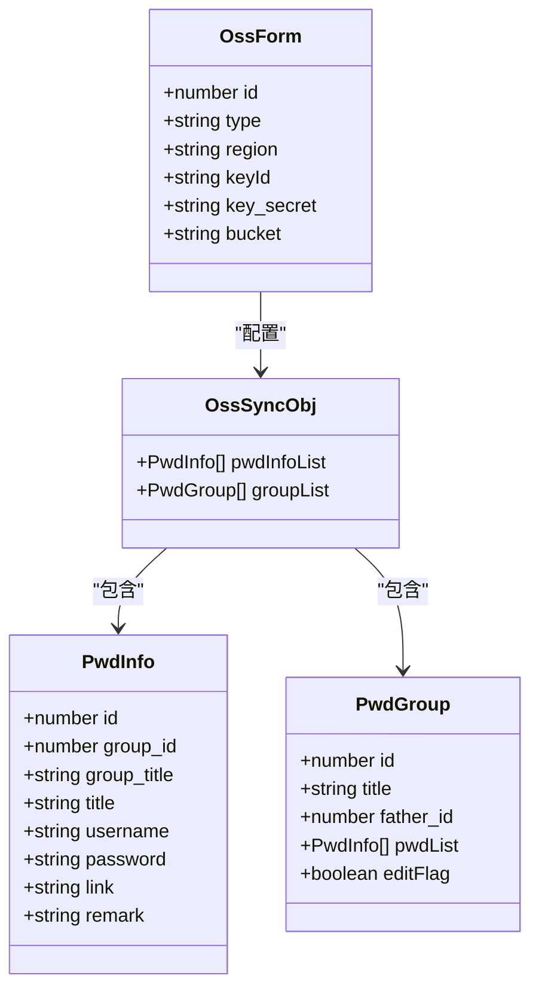

**图表来源**
- [type.ts:4-88](file://src/components/type.ts#L4-L88)

**章节来源**
- [type.ts:4-88](file://src/components/type.ts#L4-L88)

## 架构概览

数据同步系统采用分层架构设计，实现了清晰的职责分离：

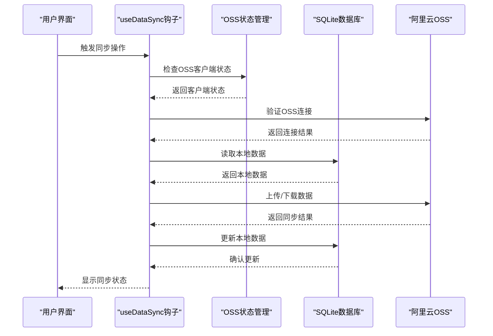

**图表来源**
- [useDataSync.ts:40-201](file://src/hooks/useDataSync.ts#L40-L201)
- [useOss.ts:10-107](file://src/hooks/useOss.ts#L10-L107)

## 详细组件分析

### 同步策略实现

#### 版本控制机制

系统采用基于版本号的冲突检测机制：

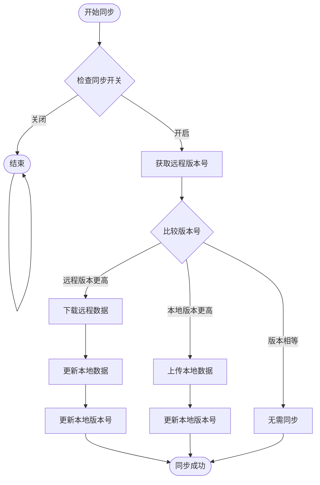

**图表来源**
- [useDataSync.ts:79-153](file://src/hooks/useDataSync.ts#L79-L153)
- [useDataSync.ts:238-251](file://src/hooks/useDataSync.ts#L238-L251)

#### 自动同步策略

系统支持多种自动同步触发条件：

1. **自动下载同步** - 当启用自动下载且有新版本时自动拉取
2. **自动上传同步** - 当启用自动上传且本地版本较旧时自动上传
3. **定时同步** - 基于时间间隔的周期性同步

**章节来源**
- [useDataSync.ts:40-49](file://src/hooks/useDataSync.ts#L40-L49)
- [useDataSync.ts:133-153](file://src/hooks/useDataSync.ts#L133-L153)

### 冲突解决机制

#### 版本冲突处理

系统通过版本号比较实现智能冲突解决：

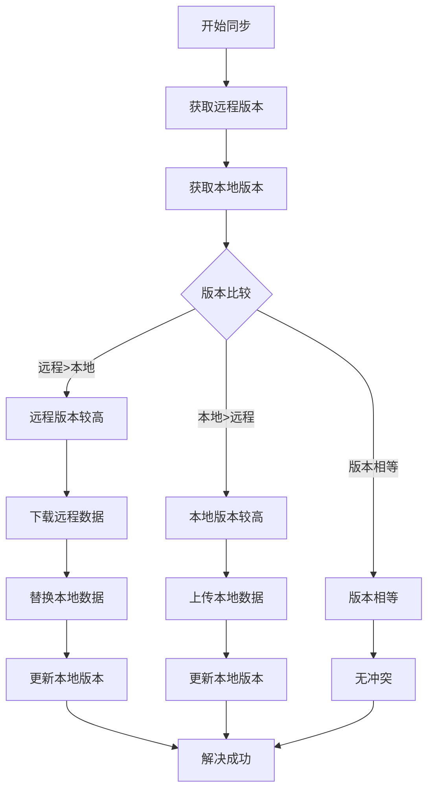

**图表来源**
- [useDataSync.ts:89-97](file://src/hooks/useDataSync.ts#L89-L97)
- [useDataSync.ts:146-151](file://src/hooks/useDataSync.ts#L146-L151)

#### 数据一致性保证

系统通过以下机制确保数据一致性：

1. **原子性操作** - 使用事务确保数据完整性
2. **版本控制** - 基于版本号的并发控制
3. **回滚机制** - 失败时自动回滚到之前状态
4. **数据验证** - 同步前后进行数据完整性检查

**章节来源**
- [useDataSync.ts:110-127](file://src/hooks/useDataSync.ts#L110-L127)

### 增量更新实现

#### 增量同步算法

系统实现了高效的增量同步机制：

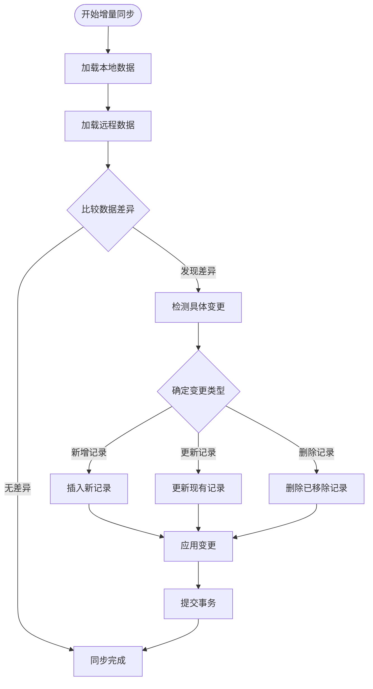

**图表来源**
- [useDataSync.ts:178-184](file://src/hooks/useDataSync.ts#L178-L184)

#### 同步状态管理

系统维护详细的同步状态信息：

| 状态字段 | 类型 | 描述 | 默认值 |
|---------|------|------|--------|
| local_version | number | 本地数据版本号 | 1 |
| oss_sync_switch | string | 同步开关 | 0 |
| oss_sync_auto_upload_switch | string | 自动上传开关 | 1 |
| oss_sync_auto_download_switch | string | 自动下载开关 | 1 |

**章节来源**
- [configConstants.ts:15-18](file://electron/db/sqlite/components/configConstants.ts#L15-L18)

### OSS配置管理

#### 配置参数详解

OSS同步需要以下关键配置参数：

| 参数名 | 类型 | 必填 | 描述 |
|-------|------|------|------|
| region | string | 是 | 阿里云区域标识 |
| keyId | string | 是 | 访问密钥ID |
| key_secret | string | 是 | 访问密钥密文 |
| bucket | string | 是 | 存储桶名称 |
| type | string | 是 | 云服务商类型 |

#### 配置验证机制

系统提供多层次的配置验证：

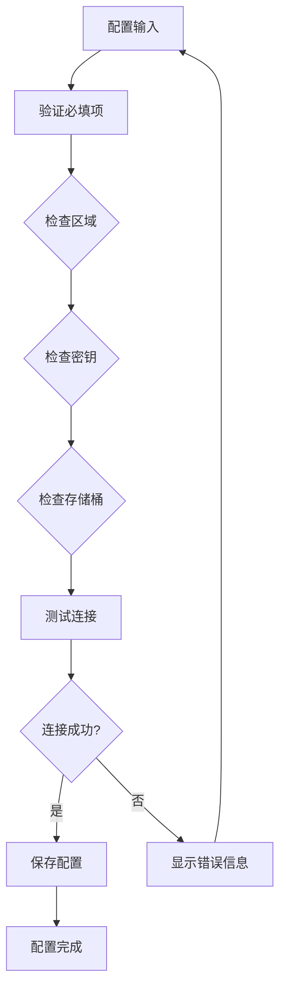

**图表来源**
- [useDataSync.ts:66-73](file://src/hooks/useDataSync.ts#L66-L73)
- [useDataSync.ts:284-298](file://src/hooks/useDataSync.ts#L284-L298)

**章节来源**
- [useDataSync.ts:66-73](file://src/hooks/useDataSync.ts#L66-L73)
- [useDataSync.ts:284-298](file://src/hooks/useDataSync.ts#L284-L298)

### 数据同步接口

#### 同步接口定义

系统提供以下核心同步接口：

| 接口名称 | 功能描述 | 参数 | 返回值 |
|---------|----------|------|--------|
| syncToLocal | 自动同步到本地 | type: number | Promise<void> |
| manualSyncToLocal | 手动同步到本地 | 无 | Promise<void> |
| syncToOss | 自动同步到OSS | 无 | Promise<void> |
| manualSyncToOss | 手动同步到OSS | 无 | Promise<void> |
| upload | 上传数据 | 无 | Promise<void> |
| downLoadOss | 下载数据 | type: number | Promise<void> |

#### 接口调用流程

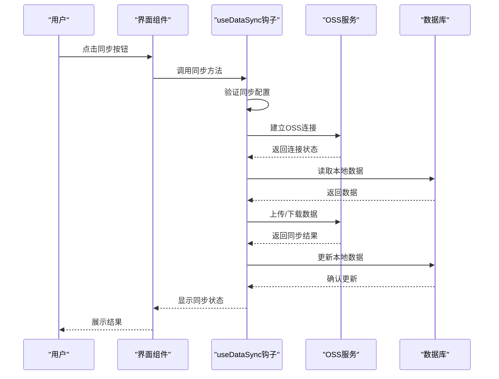

**图表来源**
- [useDataSync.ts:51-64](file://src/hooks/useDataSync.ts#L51-L64)
- [useDataSync.ts:155-171](file://src/hooks/useDataSync.ts#L155-L171)

**章节来源**
- [useDataSync.ts:51-64](file://src/hooks/useDataSync.ts#L51-L64)
- [useDataSync.ts:155-171](file://src/hooks/useDataSync.ts#L155-L171)

### 网络异常处理

#### 错误分类与处理

系统针对不同类型的网络异常提供专门的处理机制：

| 错误类型 | 错误代码 | 处理策略 | 用户提示 |
|---------|----------|----------|----------|
| 请求错误 | RequestError | 检查网络连接 | 请检查网络连接 |
| 访问密钥错误 | InvalidAccessKeyId | 检查密钥配置 | keyId错误 |
| 签名不匹配 | SignatureDoesNotMatch | 检查密钥密文 | keySecret错误 |
| 权限不足 | AccessDenied | 检查存储桶权限 | 用户没有访问权限 |
| 连接超时 | TimeoutError | 重试机制 | 网络连接超时 |

#### 异常恢复机制

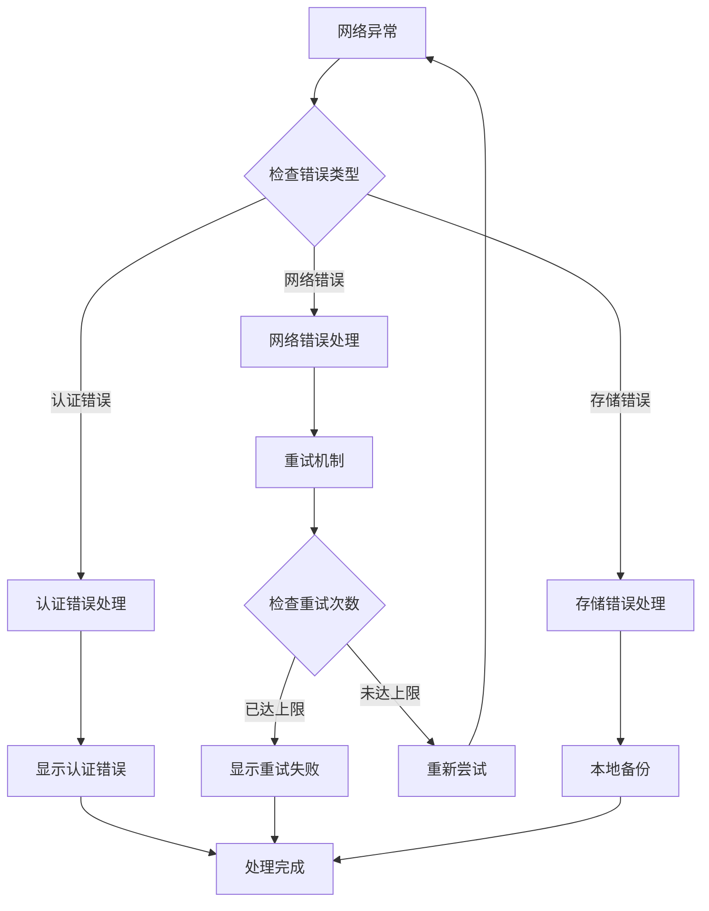

**图表来源**
- [useDataSync.ts:300-320](file://src/hooks/useDataSync.ts#L300-L320)

**章节来源**
- [useDataSync.ts:300-320](file://src/hooks/useDataSync.ts#L300-L320)

## 依赖关系分析

### 组件依赖图

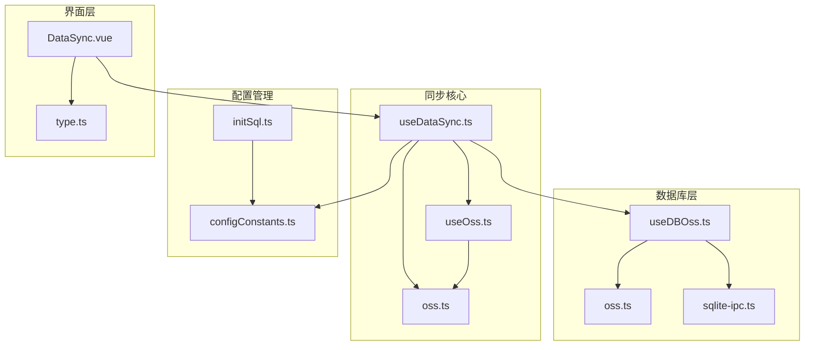

**图表来源**
- [useDataSync.ts:1-324](file://src/hooks/useDataSync.ts#L1-L324)
- [useOss.ts:1-107](file://src/hooks/useOss.ts#L1-L107)
- [oss.ts:1-59](file://src/store/oss.ts#L1-L59)

### 数据流分析

系统采用双向数据流设计，确保数据的一致性和完整性：

```mermaid
flowchart LR
subgraph "数据流向"
Local[本地数据] < --> SyncEngine[同步引擎]
SyncEngine < --> OSS[云端数据]
Config[配置数据] < --> SyncEngine
end
subgraph "同步方向"
Local --> |上传| OSS
OSS --> |下载| Local
Config --> |同步| Local
Config --> |同步| OSS
end
```

**图表来源**
- [useDataSync.ts:173-201](file://src/hooks/useDataSync.ts#L173-L201)

**章节来源**
- [useDataSync.ts:173-201](file://src/hooks/useDataSync.ts#L173-L201)

## 性能考虑

### 同步性能优化

系统在设计时充分考虑了性能优化：

1. **增量同步** - 只传输变化的数据，减少网络传输量
2. **批量操作** - 将多个操作合并为事务，提高数据库操作效率
3. **缓存机制** - 使用内存缓存减少重复计算
4. **异步处理** - 采用异步操作避免阻塞用户界面

### 内存管理

系统采用渐进式内存管理策略：

- **分批处理** - 大数据集按批次处理，避免内存溢出
- **及时释放** - 处理完的数据及时释放内存
- **垃圾回收** - 定期触发垃圾回收机制

## 故障排除指南

### 常见问题诊断

#### 同步失败排查

| 问题症状 | 可能原因 | 解决方案 |
|---------|----------|----------|
| 无法连接OSS | 网络连接问题 | 检查网络连接和防火墙设置 |
| 认证失败 | 凭据错误 | 重新配置访问密钥 |
| 权限不足 | 存储桶权限配置错误 | 检查OSS权限策略 |
| 同步冲突 | 版本号不一致 | 执行版本重置或数据合并 |

#### 日志分析

系统提供详细的日志记录功能，便于问题诊断：

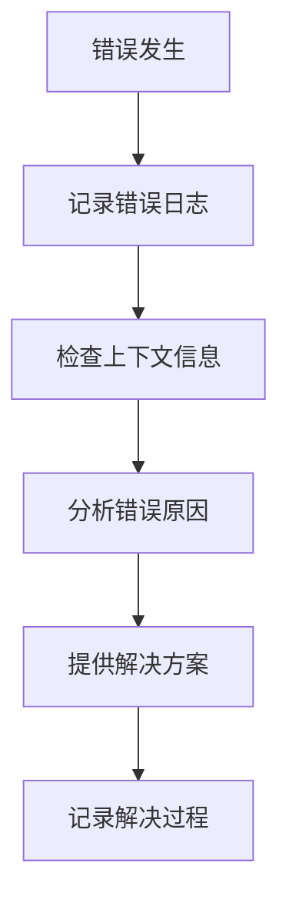

**图表来源**
- [useDataSync.ts:86-89](file://src/hooks/useDataSync.ts#L86-L89)
- [useDataSync.ts:197-200](file://src/hooks/useDataSync.ts#L197-L200)

**章节来源**
- [useDataSync.ts:86-89](file://src/hooks/useDataSync.ts#L86-L89)
- [useDataSync.ts:197-200](file://src/hooks/useDataSync.ts#L197-L200)

### 系统监控

系统提供实时监控功能：

1. **同步状态监控** - 实时显示同步进度和状态
2. **错误日志监控** - 自动记录和分析错误信息
3. **性能指标监控** - 监控同步性能和资源使用情况

## 结论

密码管理器的数据同步API实现了高效、可靠的本地与云端数据同步机制。通过版本控制、冲突解决和增量更新等关键技术，系统确保了数据的一致性和完整性。同时，完善的错误处理和监控机制为系统的稳定运行提供了保障。

该系统的设计充分考虑了用户体验，在保证数据安全的同时提供了灵活的同步策略和友好的用户界面。通过模块化的架构设计，系统具有良好的可扩展性和可维护性，为未来的功能扩展奠定了坚实的基础。