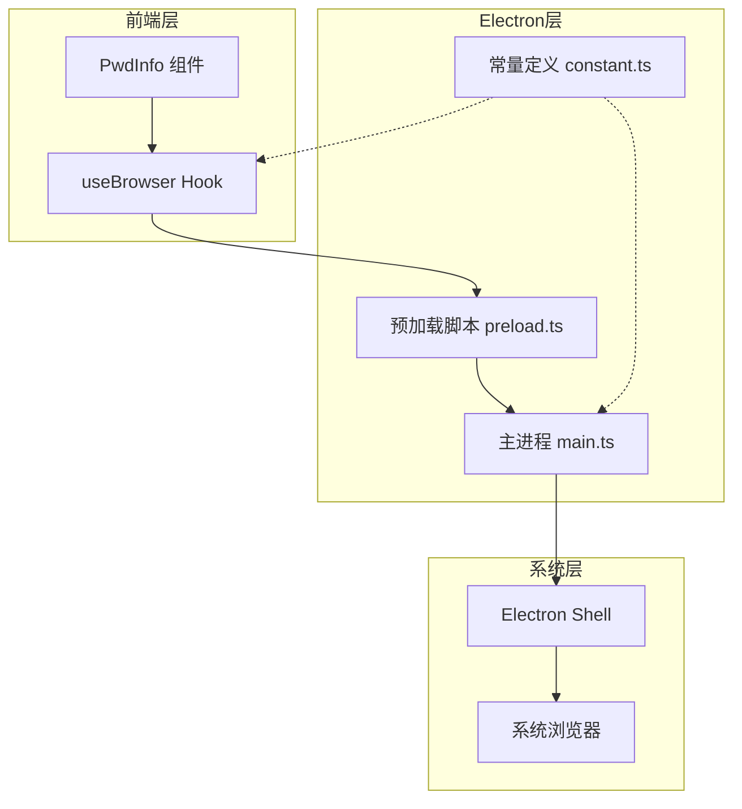
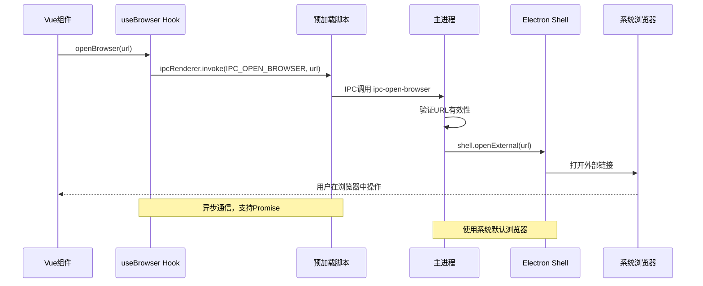
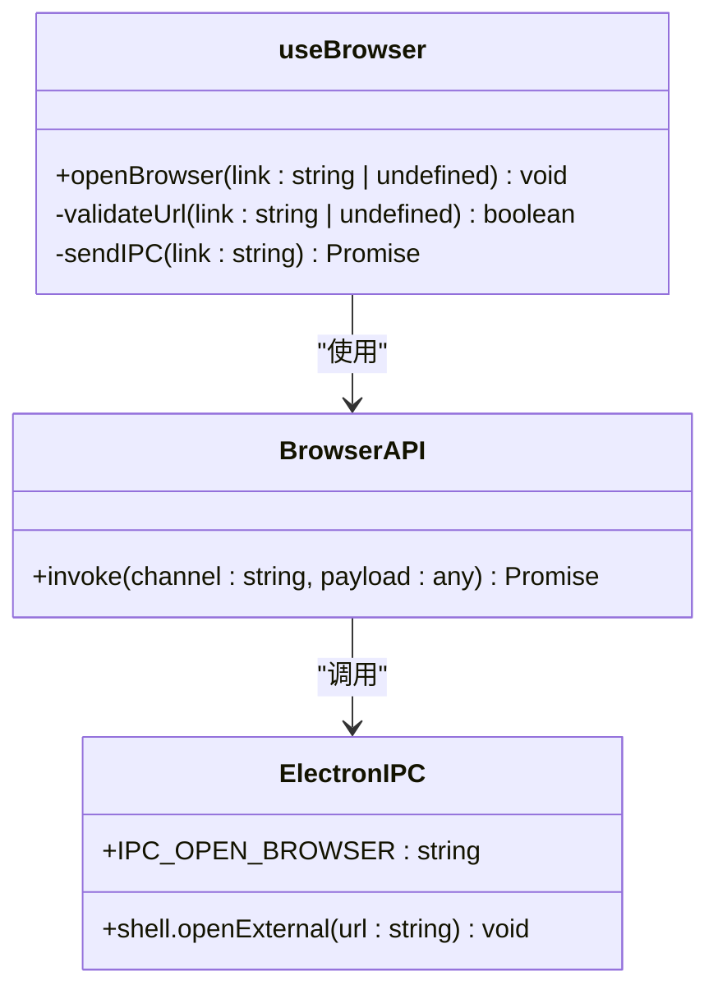
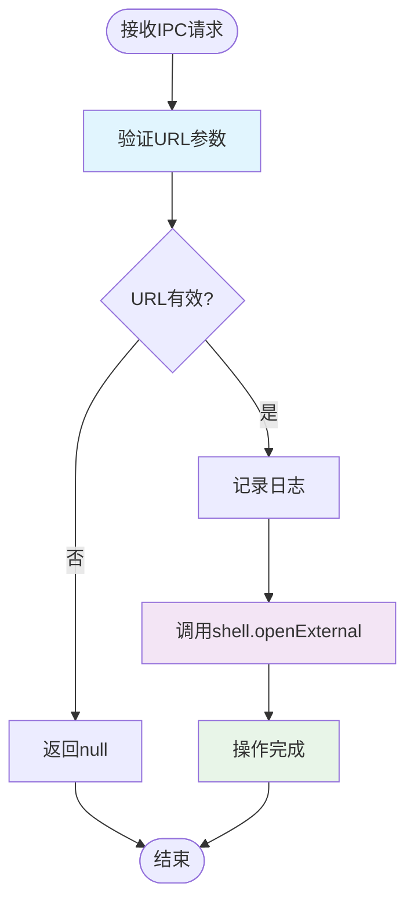
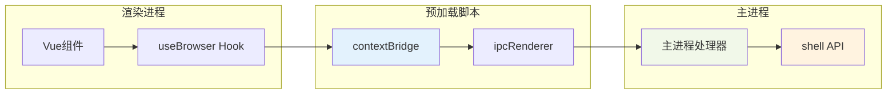
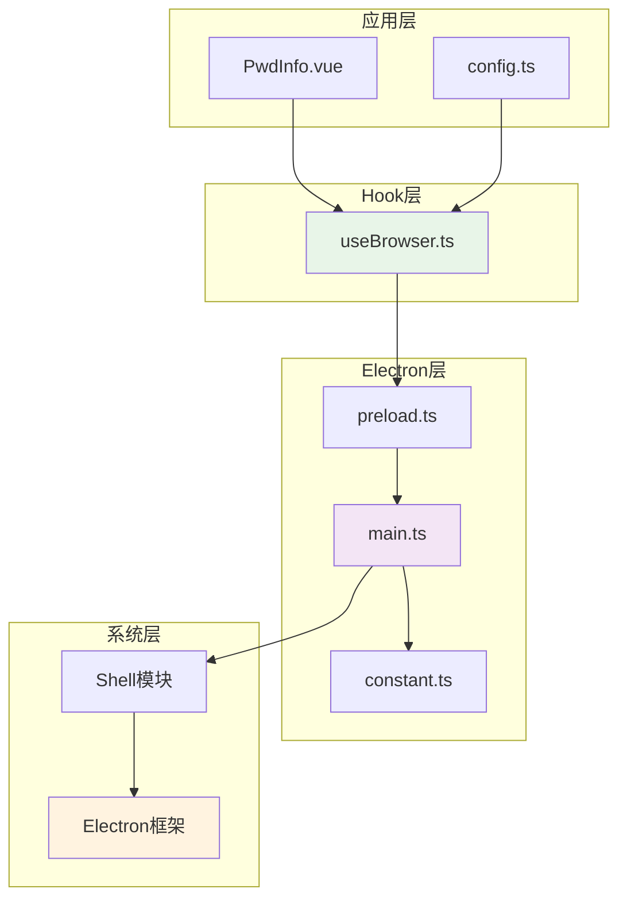

# 浏览器集成API

<cite>
**本文档引用的文件**
- [useBrowser.ts](file://src/hooks/useBrowser.ts)
- [main.ts](file://electron/main.ts)
- [constant.ts](file://electron/constant.ts)
- [preload.ts](file://electron/preload.ts)
- [PwdInfo.vue](file://src/components/indexview/PwdInfo.vue)
- [config.ts](file://src/config/config.ts)
- [package.json](file://package.json)
</cite>

## 目录
1. [简介](#简介)
2. [项目结构](#项目结构)
3. [核心组件](#核心组件)
4. [架构概览](#架构概览)
5. [详细组件分析](#详细组件分析)
6. [依赖关系分析](#依赖关系分析)
7. [性能考虑](#性能考虑)
8. [故障排除指南](#故障排除指南)
9. [结论](#结论)
10. [附录](#附录)

## 简介
本文档详细说明了密码管理器的浏览器集成API，重点涵盖浏览器自动打开、URL处理和外部链接跳转的实现机制。文档记录了浏览器集成接口的调用方式、参数配置和平台兼容性，并提供了具体的使用示例，展示如何在应用中集成浏览器功能，包括安全链接处理和用户交互优化。同时说明了不同操作系统下的浏览器集成差异和适配方案。

## 项目结构
浏览器集成功能主要分布在三个层次：
- 前端Hook层：提供统一的浏览器打开接口
- Electron主进程层：处理IPC通信和系统级浏览器调用
- 配置层：定义常量和全局配置



**图表来源**
- [useBrowser.ts:1-13](file://src/hooks/useBrowser.ts#L1-L13)
- [main.ts:158-165](file://electron/main.ts#L158-L165)
- [constant.ts:50-51](file://electron/constant.ts#L50-L51)

**章节来源**
- [useBrowser.ts:1-13](file://src/hooks/useBrowser.ts#L1-L13)
- [main.ts:1-240](file://electron/main.ts#L1-L240)
- [constant.ts:1-63](file://electron/constant.ts#L1-L63)

## 核心组件
浏览器集成API的核心组件包括：

### 1. 前端Hook接口
- **useBrowser Hook**：提供统一的浏览器打开接口
- **参数**：接收URL字符串或undefined
- **返回值**：Promise对象
- **错误处理**：自动过滤空值和undefined

### 2. Electron主进程处理
- **IPC通道**：ipc-open-browser
- **系统调用**：使用shell.openExternal进行外部链接打开
- **日志记录**：完整的调用日志输出

### 3. 预加载脚本桥接
- **contextBridge**：安全地暴露API到渲染进程
- **IPC封装**：提供invoke方法进行异步通信
- **类型安全**：确保通信的类型安全性

**章节来源**
- [useBrowser.ts:3-12](file://src/hooks/useBrowser.ts#L3-L12)
- [main.ts:161-165](file://electron/main.ts#L161-L165)
- [preload.ts:4-24](file://electron/preload.ts#L4-L24)

## 架构概览
浏览器集成采用标准的Electron IPC架构，实现了从Vue组件到系统浏览器的完整链路。



**图表来源**
- [useBrowser.ts:5-9](file://src/hooks/useBrowser.ts#L5-L9)
- [main.ts:161-165](file://electron/main.ts#L161-L165)
- [constant.ts:50-51](file://electron/constant.ts#L50-L51)

## 详细组件分析

### useBrowser Hook组件分析
useBrowser Hook是浏览器集成的核心前端接口，实现了简洁而强大的浏览器打开功能。

#### 类结构图


**图表来源**
- [useBrowser.ts:3-12](file://src/hooks/useBrowser.ts#L3-L12)
- [constant.ts:50-51](file://electron/constant.ts#L50-L51)

#### 核心功能实现
1. **输入验证**：自动检查URL是否为空或undefined
2. **IPC通信**：通过window.ipcRenderer.invoke发送消息
3. **异步处理**：返回Promise对象支持异步操作
4. **错误隔离**：空值输入直接返回，不产生异常

**章节来源**
- [useBrowser.ts:5-10](file://src/hooks/useBrowser.ts#L5-L10)

### 主进程处理流程分析
主进程负责处理来自前端的所有浏览器打开请求，确保系统的安全性和稳定性。

#### 处理流程图


**图表来源**
- [main.ts:161-165](file://electron/main.ts#L161-L165)

#### 安全特性
- **参数验证**：确保传入的URL参数有效
- **日志记录**：完整的操作日志便于调试和审计
- **系统集成**：使用Electron内置的shell.openExternal确保安全性

**章节来源**
- [main.ts:161-165](file://electron/main.ts#L161-L165)

### 预加载脚本桥接分析
预加载脚本作为前后端通信的桥梁，提供了安全且高效的IPC通信机制。

#### 通信架构图


**图表来源**
- [preload.ts:4-24](file://electron/preload.ts#L4-L24)
- [main.ts:158-165](file://electron/main.ts#L158-L165)

**章节来源**
- [preload.ts:4-24](file://electron/preload.ts#L4-L24)

### 实际应用场景分析
浏览器集成API在多个场景中发挥重要作用：

#### 场景一：密码详情页链接打开
在密码详情页面中，用户可以直接点击链接图标在浏览器中打开相关网站。

#### 场景二：帮助文档访问
应用内集成了帮助文档链接，用户可以通过点击快速访问在线帮助。

#### 场景三：外部资源访问
支持访问阿里云、Gitee等外部平台的链接。

**章节来源**
- [PwdInfo.vue:177](file://src/components/indexview/PwdInfo.vue#L177)
- [config.ts:36-41](file://src/config/config.ts#L36-L41)

## 依赖关系分析

### 模块依赖图


**图表来源**
- [useBrowser.ts:1](file://src/hooks/useBrowser.ts#L1)
- [main.ts:15](file://electron/main.ts#L15)
- [constant.ts:50-51](file://electron/constant.ts#L50-L51)

### 外部依赖分析
项目对Electron框架的依赖关系：

| 依赖项 | 版本 | 用途 |
|--------|------|------|
| electron | ^30.0.1 | 跨平台桌面应用框架 |
| electron-updater | ^6.6.2 | 应用更新机制 |
| vue | ^3.4.21 | 前端框架 |

**章节来源**
- [package.json:18-44](file://package.json#L18-L44)

## 性能考虑
浏览器集成API在设计时充分考虑了性能和用户体验：

### 1. 异步处理
- 使用Promise模式确保UI线程不被阻塞
- 异步IPC通信避免主线程等待

### 2. 缓存策略
- 系统浏览器缓存由操作系统管理
- 避免重复的URL解析和验证

### 3. 内存管理
- 及时清理未使用的IPC连接
- 合理的错误处理避免内存泄漏

### 4. 并发控制
- 支持并发的浏览器打开请求
- 系统级的并发处理能力

## 故障排除指南

### 常见问题及解决方案

#### 1. URL格式错误
**问题**：传入的URL格式不正确
**解决方案**：在调用前验证URL格式，确保包含协议头(http://或https://)

#### 2. 空值处理
**问题**：传入undefined或空字符串
**解决方案**：useBrowser Hook已内置空值检查，无需额外处理

#### 3. 权限问题
**问题**：某些系统可能阻止外部链接打开
**解决方案**：检查系统设置和防火墙配置

#### 4. IPC通信失败
**问题**：前端无法与主进程通信
**解决方案**：检查preload脚本是否正确加载，确认IPC通道名称一致

**章节来源**
- [useBrowser.ts:5-8](file://src/hooks/useBrowser.ts#L5-L8)
- [main.ts:161-165](file://electron/main.ts#L161-L165)

## 结论
密码管理器的浏览器集成API设计简洁高效，通过标准的Electron IPC架构实现了从前端到系统浏览器的无缝连接。该API具有以下特点：

1. **简单易用**：仅需一行代码即可打开任意URL
2. **安全可靠**：使用Electron内置的shell.openExternal确保安全性
3. **跨平台兼容**：支持Windows、macOS和Linux系统
4. **性能优秀**：异步处理和系统级优化
5. **易于扩展**：清晰的架构便于功能扩展和维护

该实现为密码管理器提供了完善的外部链接处理能力，提升了用户体验和应用的专业性。

## 附录

### 使用示例

#### 基本使用
```javascript
// 在Vue组件中使用
const { openBrowser } = useBrowser();
openBrowser('https://example.com');
```

#### 安全链接处理
```javascript
// 验证URL后再打开
function safeOpen(url) {
    if (isValidUrl(url)) {
        openBrowser(url);
    }
}
```

#### 用户交互优化
```javascript
// 添加加载状态和错误处理
async function handleClick(url) {
    try {
        await openBrowser(url);
        // 成功后的UI反馈
    } catch (error) {
        // 错误处理
    }
}
```

### 平台兼容性说明

#### Windows系统
- 使用默认浏览器打开链接
- 支持IE、Edge、Chrome等多种浏览器
- 自动关联URL协议

#### macOS系统  
- 使用系统默认浏览器
- 支持Safari、Chrome、Firefox等
- 集成Dock和菜单栏体验

#### Linux系统
- 使用xdg-open命令
- 支持多种桌面环境
- 可能需要安装额外的工具包

### 配置选项
- **IPC通道名称**：ipc-open-browser
- **超时时间**：默认无超时限制
- **重试机制**：无自动重试
- **日志级别**：INFO级别日志记录