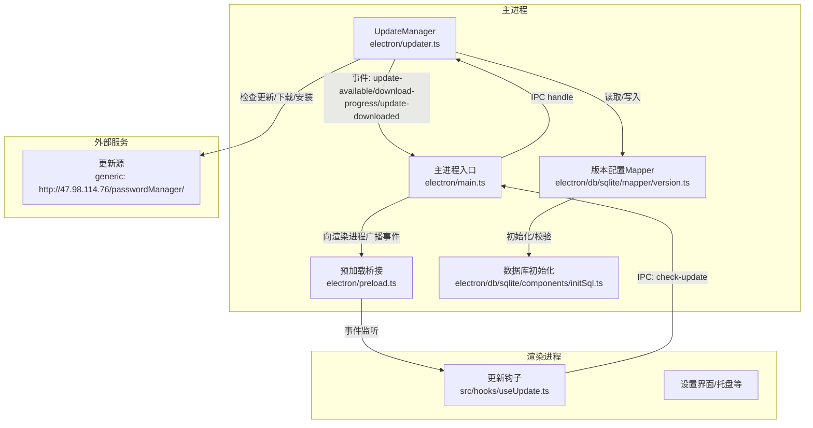
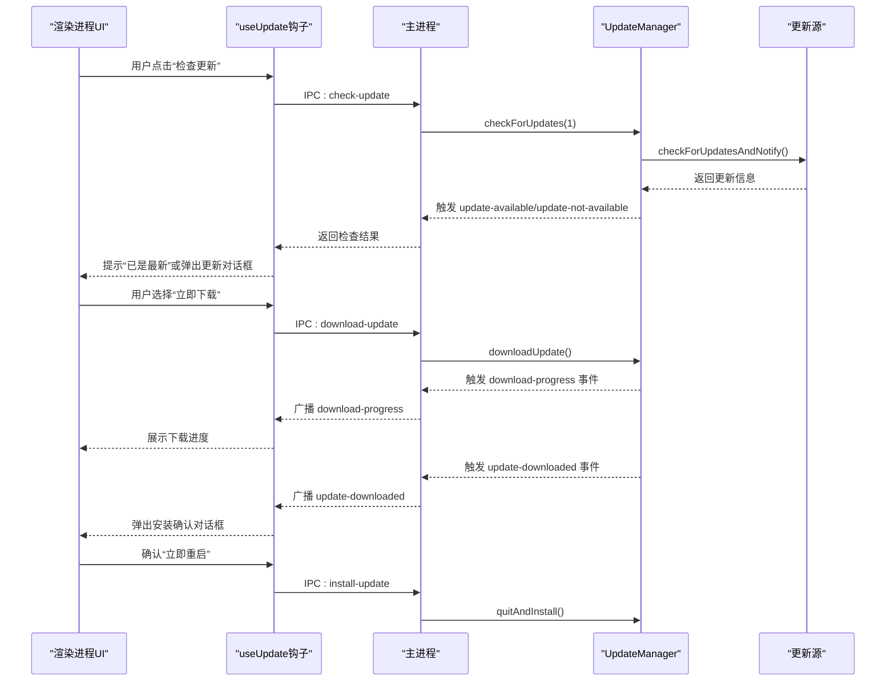
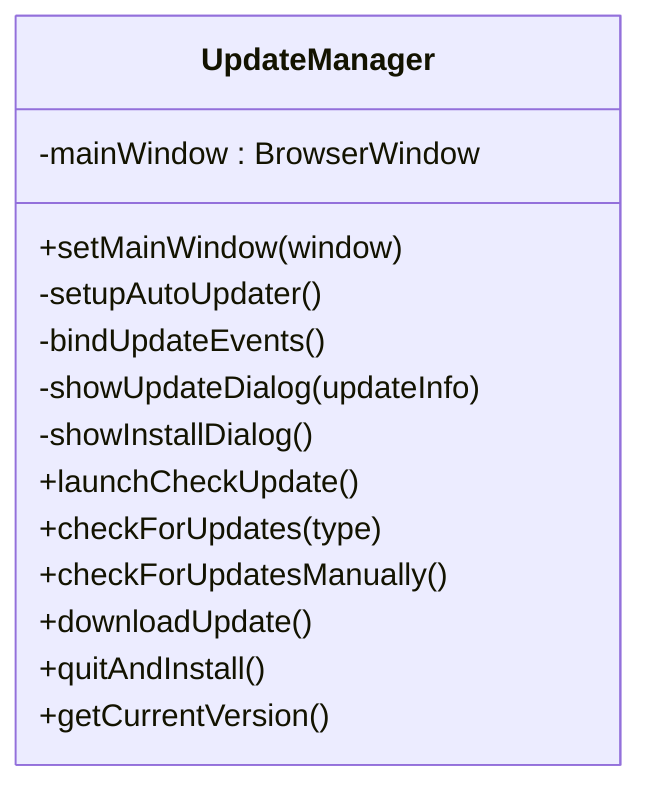
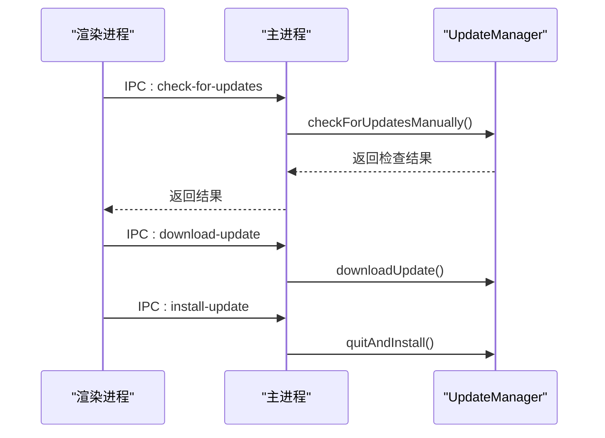
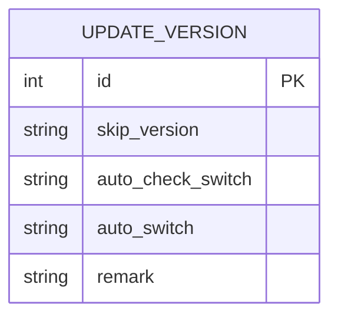
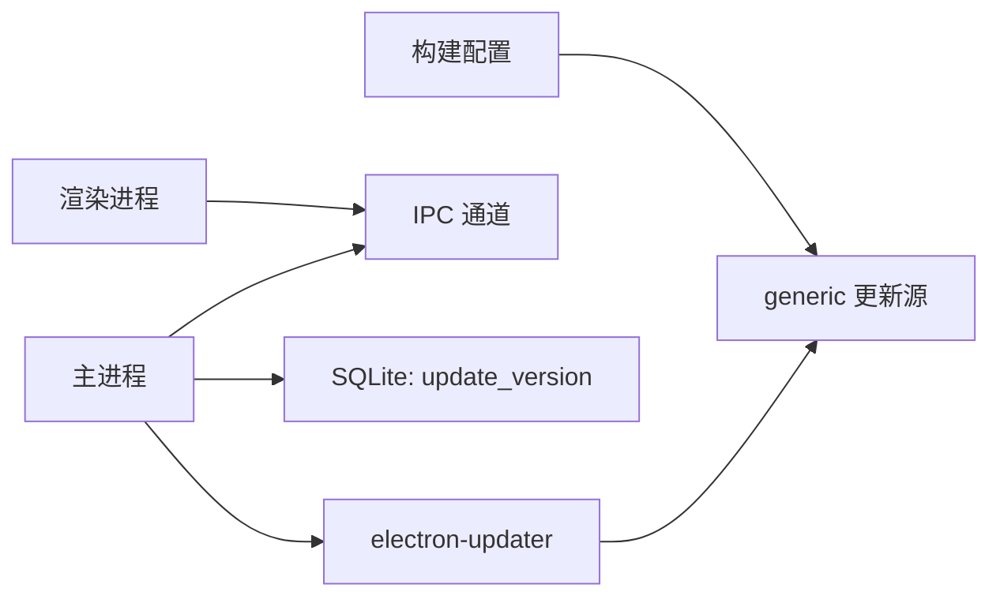

# 自动更新API

<cite>
**本文档引用的文件**
- [electron/updater.ts](file://electron/updater.ts)
- [electron/main.ts](file://electron/main.ts)
- [electron/preload.ts](file://electron/preload.ts)
- [electron/constant.ts](file://electron/constant.ts)
- [electron/db/sqlite/mapper/version.ts](file://electron/db/sqlite/mapper/version.ts)
- [electron/db/sqlite/components/initSql.ts](file://electron/db/sqlite/components/initSql.ts)
- [electron/db/sqlite/components/baseSql.ts](file://electron/db/sqlite/components/baseSql.ts)
- [src/hooks/useUpdate.ts](file://src/hooks/useUpdate.ts)
- [src/components/type.ts](file://src/components/type.ts)
- [package.json](file://package.json)
- [electron-builder.json5](file://electron-builder.json5)
</cite>

## 目录
1. [简介](#简介)
2. [项目结构](#项目结构)
3. [核心组件](#核心组件)
4. [架构总览](#架构总览)
5. [详细组件分析](#详细组件分析)
6. [依赖关系分析](#依赖关系分析)
7. [性能考虑](#性能考虑)
8. [故障排除指南](#故障排除指南)
9. [结论](#结论)
10. [附录](#附录)

## 简介
本文件详细说明密码管理器的自动更新API实现，涵盖应用版本检查、更新下载与安装机制、触发条件、更新策略、用户通知、错误处理与回滚机制，以及用户体验优化策略。文档基于Electron + electron-updater的实际代码实现，提供完整的更新流程示例与可视化图示。

## 项目结构
自动更新功能由主进程的更新管理器、IPC通信层、渲染进程钩子与SQLite配置表共同组成。核心文件分布如下：
- 主进程更新管理：electron/updater.ts
- 主进程IPC处理：electron/main.ts
- 渲染进程桥接与事件监听：electron/preload.ts
- 更新常量定义：electron/constant.ts
- 更新配置存储（SQLite）：electron/db/sqlite/mapper/version.ts
- 数据库初始化与表结构：electron/db/sqlite/components/initSql.ts
- SQLite基础操作封装：electron/db/sqlite/components/baseSql.ts
- 渲染进程更新钩子：src/hooks/useUpdate.ts
- 类型定义：src/components/type.ts
- 构建与发布配置：package.json、electron-builder.json5

**图表来源**
- [electron/updater.ts:19-36](file://electron/updater.ts#L19-L36)
- [electron/main.ts:196-227](file://electron/main.ts#L196-L227)
- [electron/preload.ts:25-37](file://electron/preload.ts#L25-L37)
- [electron/db/sqlite/mapper/version.ts:9-31](file://electron/db/sqlite/mapper/version.ts#L9-L31)
- [electron/db/sqlite/components/initSql.ts:107-129](file://electron/db/sqlite/components/initSql.ts#L107-L129)

**章节来源**
- [electron/updater.ts:1-204](file://electron/updater.ts#L1-L204)
- [electron/main.ts:1-240](file://electron/main.ts#L1-L240)
- [electron/preload.ts:1-38](file://electron/preload.ts#L1-L38)
- [electron/db/sqlite/mapper/version.ts:1-38](file://electron/db/sqlite/mapper/version.ts#L1-L38)
- [electron/db/sqlite/components/initSql.ts:1-224](file://electron/db/sqlite/components/initSql.ts#L1-L224)

## 核心组件
- UpdateManager：封装electron-updater，负责设置更新源、事件绑定、对话框交互、下载与安装控制。
- 主进程IPC：提供检查更新、下载更新、安装更新、获取当前版本等接口。
- 预加载桥接：向渲染进程暴露更新相关API与事件监听能力。
- 更新配置Mapper：通过SQLite存储跳过版本与自动检查开关。
- 渲染进程钩子：封装前端调用逻辑，处理用户提示与开关控制。

**章节来源**
- [electron/updater.ts:7-204](file://electron/updater.ts#L7-L204)
- [electron/main.ts:196-227](file://electron/main.ts#L196-L227)
- [electron/preload.ts:25-37](file://electron/preload.ts#L25-L37)
- [electron/db/sqlite/mapper/version.ts:9-31](file://electron/db/sqlite/mapper/version.ts#L9-L31)
- [src/hooks/useUpdate.ts:1-29](file://src/hooks/useUpdate.ts#L1-L29)

## 架构总览
自动更新采用“主进程驱动 + 渲染进程协调”的模式。主进程使用electron-updater连接到通用更新源，根据事件向渲染进程推送下载进度；渲染进程通过IPC发起检查与下载，用户通过对话框确认安装。

**图表来源**
- [electron/main.ts:196-227](file://electron/main.ts#L196-L227)
- [electron/updater.ts:52-96](file://electron/updater.ts#L52-L96)
- [electron/preload.ts:25-37](file://electron/preload.ts#L25-L37)
- [src/hooks/useUpdate.ts:7-14](file://src/hooks/useUpdate.ts#L7-L14)

## 详细组件分析

### UpdateManager 组件
职责与行为：
- 设置更新源为通用HTTP地址，禁用自动下载，改为手动控制。
- 绑定更新事件：错误、检查中、发现更新、无更新、下载进度、下载完成。
- 对话框交互：发现更新时询问“立即下载/稍后提醒/跳过此版本”，下载完成后询问“立即重启/稍后重启”。
- 自动检查：读取自动检查开关，延迟3秒执行一次检查。
- 版本跳过：从SQLite读取skip_version，若与当前版本一致则跳过更新。
- IPC事件：向主进程广播事件，供UI监听。

**图表来源**
- [electron/updater.ts:7-204](file://electron/updater.ts#L7-L204)

**章节来源**
- [electron/updater.ts:19-96](file://electron/updater.ts#L19-L96)
- [electron/updater.ts:143-175](file://electron/updater.ts#L143-L175)
- [electron/updater.ts:187-201](file://electron/updater.ts#L187-L201)

### 主进程IPC与事件监听
- 提供IPC句柄：check-for-updates、download-update、install-update、get-current-version。
- 监听UpdateManager事件：update-available、download-progress、update-downloaded。
- 页面触发：CHECK_UPDATE常量用于渲染进程发起检查。

**图表来源**
- [electron/main.ts:205-227](file://electron/main.ts#L205-L227)
- [electron/constant.ts:59](file://electron/constant.ts#L59)

**章节来源**
- [electron/main.ts:196-227](file://electron/main.ts#L196-L227)
- [electron/constant.ts:56-60](file://electron/constant.ts#L56-L60)

### 预加载桥接与事件订阅
- 暴露update对象：checkForUpdates、downloadUpdate、installUpdate、getCurrentVersion、onDownloadProgress、removeDownloadProgressListener。
- 将主进程广播的download-progress事件转发给渲染进程。

**章节来源**
- [electron/preload.ts:25-37](file://electron/preload.ts#L25-L37)

### 更新配置与数据库初始化
- 版本配置表update_version包含字段：skip_version、auto_check_switch、auto_switch。
- 初始化时创建该表并插入默认值。
- Mapper提供读取/更新接口，供UpdateManager使用。

**图表来源**
- [electron/db/sqlite/components/initSql.ts:117-126](file://electron/db/sqlite/components/initSql.ts#L117-L126)
- [electron/db/sqlite/mapper/version.ts:9-31](file://electron/db/sqlite/mapper/version.ts#L9-L31)

**章节来源**
- [electron/db/sqlite/components/initSql.ts:107-150](file://electron/db/sqlite/components/initSql.ts#L107-L150)
- [electron/db/sqlite/mapper/version.ts:9-31](file://electron/db/sqlite/mapper/version.ts#L9-L31)

### 渲染进程更新钩子
- 提供checkUpdate：通过IPC调用CHECK_UPDATE，若无更新则提示“已是最新”。
- 提供getAutoCheckUpdateSwitch与setUpdateSwitch：读取/设置自动检查开关。

**章节来源**
- [src/hooks/useUpdate.ts:7-29](file://src/hooks/useUpdate.ts#L7-L29)
- [electron/constant.ts:57-59](file://electron/constant.ts#L57-L59)

## 依赖关系分析
- electron-updater：负责与更新源通信、下载与安装。
- Electron IPC：主进程与渲染进程之间的通信通道。
- SQLite：持久化存储跳过版本与自动检查开关。
- 构建配置：package.json与electron-builder.json5定义发布源与产物命名。

**图表来源**
- [electron/updater.ts:27-30](file://electron/updater.ts#L27-L30)
- [package.json:45-48](file://package.json#L45-L48)
- [electron-builder.json5:47-50](file://electron-builder.json5#L47-L50)

**章节来源**
- [electron/updater.ts:27-30](file://electron/updater.ts#L27-L30)
- [package.json:18-22](file://package.json#L18-L22)
- [package.json:45-48](file://package.json#L45-L48)
- [electron-builder.json5:47-50](file://electron-builder.json5#L47-L50)

## 性能考虑
- 下载进度事件频率：主进程每收到一次download-progress事件即向渲染进程广播，建议在渲染端节流处理以降低UI刷新压力。
- 自动检查延迟：启动后延迟3秒再检查，避免阻塞主窗口显示。
- 跳过版本策略：避免重复提示同一版本，减少用户干扰。
- 构建产物大小：ASAR打包与目标平台配置影响下载体积，需平衡安装包大小与更新效率。

## 故障排除指南
常见问题与处理：
- 检查更新失败：主进程监听error事件并抛出，渲染端可捕获并提示用户重试。
- 无可用更新：即使无更新也应提示用户，保持透明度。
- 下载中断：检查网络与更新源可达性；必要时重新发起检查与下载。
- 安装失败：确保具备管理员权限与足够磁盘空间；如失败可回滚至旧版本（系统原生机制）。
- 跳过版本无效：确认SQLite中skip_version字段被正确更新与读取。

排查步骤：
1. 确认更新源URL可达且返回有效更新信息。
2. 检查自动检查开关状态。
3. 查看主进程日志中的事件输出。
4. 在渲染端监听download-progress事件，验证UI进度更新。
5. 若安装失败，尝试手动下载安装包或联系支持。

**章节来源**
- [electron/updater.ts:40-43](file://electron/updater.ts#L40-L43)
- [electron/updater.ts:67-72](file://electron/updater.ts#L67-L72)
- [electron/updater.ts:75-89](file://electron/updater.ts#L75-L89)

## 结论
本自动更新API通过主进程统一调度、IPC桥接与SQLite持久化配置，实现了可控、可感知、可回滚的更新体验。通过对话框与进度反馈提升用户参与度，结合跳过版本与自动检查开关优化用户体验。建议在后续版本中增加断点续传、增量更新与更丰富的错误恢复策略。

## 附录

### 更新流程完整示例（版本比较、下载进度、安装确认）
- 版本比较：主进程调用checkForUpdatesAndNotify，返回结果包含是否可用更新及版本信息。
- 下载进度：download-progress事件携带百分比、已传输字节、总字节数与速度，渲染端实时展示。
- 安装确认：update-downloaded事件触发安装对话框，用户确认后调用quitAndInstall完成重启安装。

**章节来源**
- [electron/updater.ts:52-96](file://electron/updater.ts#L52-L96)
- [electron/updater.ts:75-89](file://electron/updater.ts#L75-L89)
- [electron/main.ts:196-227](file://electron/main.ts#L196-L227)

### 触发条件与更新策略
- 触发条件：应用启动后延迟3秒自动检查；用户手动点击“检查更新”；托盘菜单触发检查。
- 更新策略：禁用自动下载，用户确认后才开始下载；支持跳过当前版本；支持关闭自动检查。

**章节来源**
- [electron/updater.ts:143-155](file://electron/updater.ts#L143-L155)
- [electron/updater.ts:159-175](file://electron/updater.ts#L159-L175)
- [electron/db/sqlite/mapper/version.ts:9-19](file://electron/db/sqlite/mapper/version.ts#L9-L19)

### 用户通知机制
- 对话框：发现新版本、下载完成、安装确认均使用系统消息框。
- 进度通知：通过download-progress事件向渲染进程推送进度，便于UI展示。
- 成功提示：无更新时提示“已是最新”。

**章节来源**
- [electron/updater.ts:100-125](file://electron/updater.ts#L100-L125)
- [electron/updater.ts:128-142](file://electron/updater.ts#L128-L142)
- [src/hooks/useUpdate.ts:11-13](file://src/hooks/useUpdate.ts#L11-L13)

### 错误处理与回滚机制
- 错误处理：error事件统一上报；手动检查异常向上抛出。
- 回滚机制：安装失败由系统原生机制处理，建议保留旧版本以便回退。

**章节来源**
- [electron/updater.ts:40-43](file://electron/updater.ts#L40-L43)
- [electron/updater.ts:178-185](file://electron/updater.ts#L178-L185)