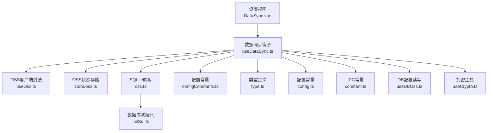
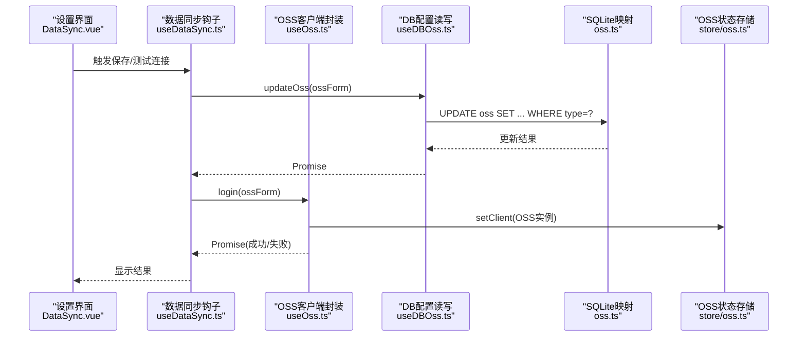
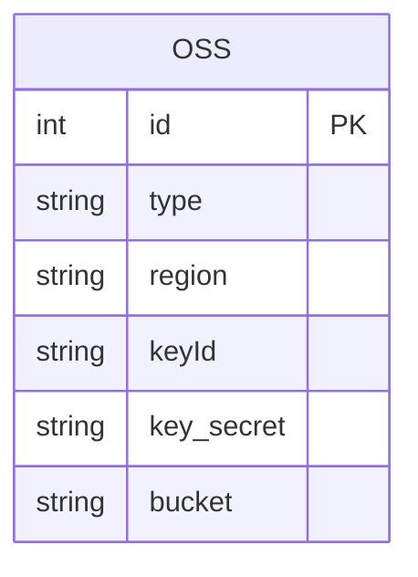
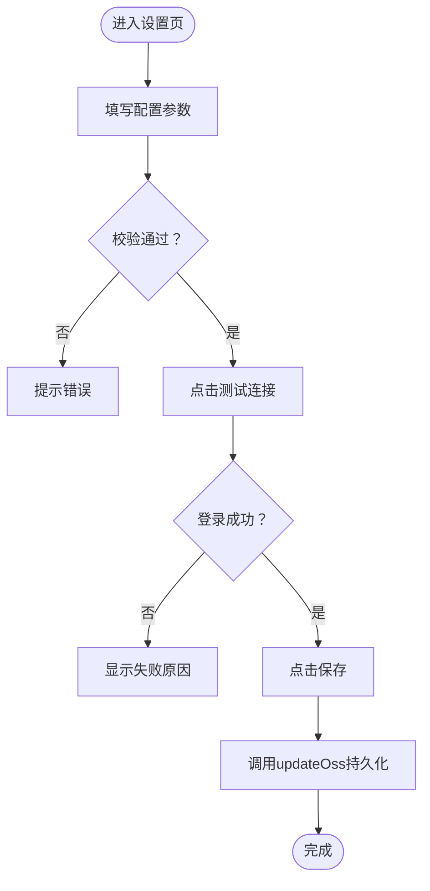
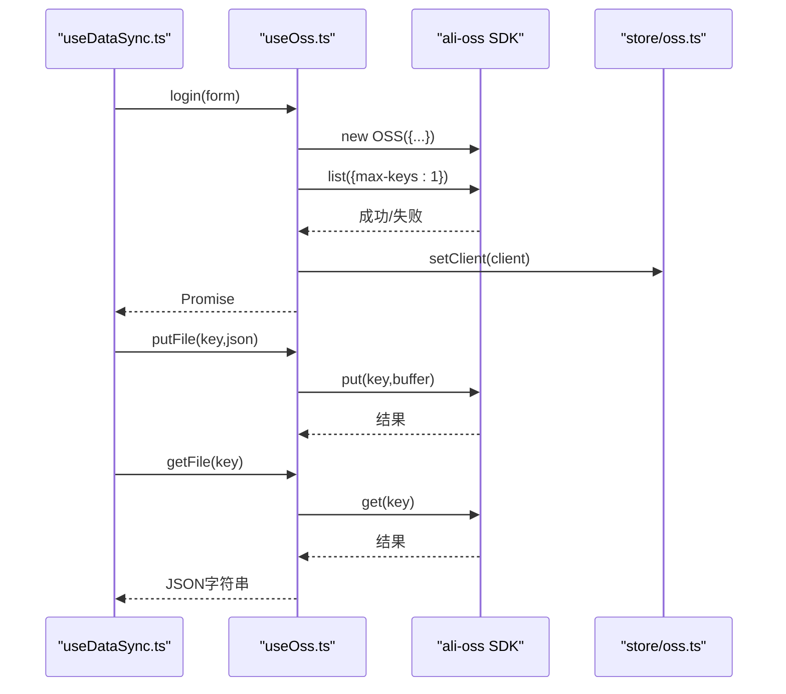
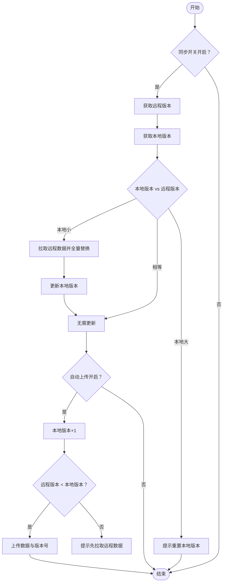
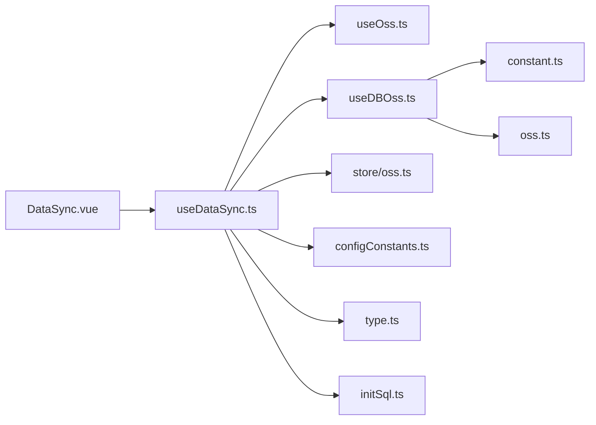

# OSS配置API

<cite>
**本文引用的文件**
- [oss.ts](file://electron/db/sqlite/mapper/oss.ts)
- [useOss.ts](file://src/hooks/useOss.ts)
- [oss.ts](file://src/store/oss.ts)
- [configConstants.ts](file://electron/db/sqlite/components/configConstants.ts)
- [useDataSync.ts](file://src/hooks/useDataSync.ts)
- [type.ts](file://src/components/type.ts)
- [config.ts](file://src/config/config.ts)
- [constant.ts](file://electron/constant.ts)
- [DataSync.vue](file://src/components/setview/DataSync.vue)
- [useDBOss.ts](file://src/hooks/useDBOss.ts)
- [useCrypto.ts](file://src/hooks/useCrypto.ts)
- [initSql.ts](file://electron/db/sqlite/components/initSql.ts)
</cite>

## 目录
1. [简介](#简介)
2. [项目结构](#项目结构)
3. [核心组件](#核心组件)
4. [架构总览](#架构总览)
5. [详细组件分析](#详细组件分析)
6. [依赖关系分析](#依赖关系分析)
7. [性能考虑](#性能考虑)
8. [故障排查指南](#故障排查指南)
9. [结论](#结论)
10. [附录](#附录)

## 简介
本文件面向“OSS配置管理API”，系统性说明阿里云OSS连接配置的管理接口与数据同步流程，覆盖配置的创建、更新、验证与删除；记录OSS连接参数的存储格式与安全处理；提供OSS数据同步的配置接口示例（同步策略、增量更新与冲突解决）；说明加密存储、访问权限控制与故障恢复机制，并给出服务状态监控、错误日志记录与性能优化建议。

## 项目结构
围绕OSS配置与同步的关键模块分布如下：
- 前端配置界面与交互：DataSync.vue、useDataSync.ts
- OSS客户端封装：useOss.ts
- OSS配置持久化：useDBOss.ts → electron常量 → SQLite映射oss.ts
- 配置项与默认值：configConstants.ts、initSql.ts
- 全局状态：store/oss.ts
- 类型定义：type.ts
- 配置常量：config.ts
- 加密工具：useCrypto.ts

图表来源
- [DataSync.vue:1-69](file://src/components/setview/DataSync.vue#L1-L69)
- [useDataSync.ts:1-324](file://src/hooks/useDataSync.ts#L1-L324)
- [useOss.ts:1-107](file://src/hooks/useOss.ts#L1-L107)
- [oss.ts:1-59](file://src/store/oss.ts#L1-L59)
- [oss.ts:1-30](file://electron/db/sqlite/mapper/oss.ts#L1-L30)
- [configConstants.ts:1-29](file://electron/db/sqlite/components/configConstants.ts#L1-L29)
- [type.ts:1-88](file://src/components/type.ts#L1-L88)
- [config.ts:1-143](file://src/config/config.ts#L1-L143)
- [constant.ts:1-63](file://electron/constant.ts#L1-L63)
- [useDBOss.ts:1-17](file://src/hooks/useDBOss.ts#L1-L17)
- [useCrypto.ts:1-77](file://src/hooks/useCrypto.ts#L1-L77)
- [initSql.ts:1-224](file://electron/db/sqlite/components/initSql.ts#L1-L224)

章节来源
- [DataSync.vue:1-69](file://src/components/setview/DataSync.vue#L1-L69)
- [useDataSync.ts:1-324](file://src/hooks/useDataSync.ts#L1-L324)
- [useOss.ts:1-107](file://src/hooks/useOss.ts#L1-L107)
- [oss.ts:1-59](file://src/store/oss.ts#L1-L59)
- [oss.ts:1-30](file://electron/db/sqlite/mapper/oss.ts#L1-L30)
- [configConstants.ts:1-29](file://electron/db/sqlite/components/configConstants.ts#L1-L29)
- [type.ts:1-88](file://src/components/type.ts#L1-L88)
- [config.ts:1-143](file://src/config/config.ts#L1-L143)
- [constant.ts:1-63](file://electron/constant.ts#L1-L63)
- [useDBOss.ts:1-17](file://src/hooks/useDBOss.ts#L1-L17)
- [useCrypto.ts:1-77](file://src/hooks/useCrypto.ts#L1-L77)
- [initSql.ts:1-224](file://electron/db/sqlite/components/initSql.ts#L1-L224)

## 核心组件
- OSS配置表与持久化
  - 表结构：oss(id, type, region, keyId, key_secret, bucket)
  - 更新接口：updateOss(...params)
  - 查询接口：getOss(type)
- 前端配置表单与校验
  - 表单项：region、keyId、key_secret、bucket
  - 校验规则：必填
- OSS客户端封装
  - 登录验证：基于list接口返回判断权限
  - 文件上传：putFile(ossKey, json)
  - 文件下载：getFile(ossKey)
- 数据同步策略
  - 版本号字段：ossVersionKey、localVersionField
  - 自动/手动同步：ossSyncSwitch、ossSyncAutoUploadSwitch、ossSyncAutoDownloadSwitch
- 加密与安全
  - 本地密码与敏感字段采用AES-CBC加密
  - 登录口令与盐值处理

章节来源
- [oss.ts:1-30](file://electron/db/sqlite/mapper/oss.ts#L1-L30)
- [useDBOss.ts:1-17](file://src/hooks/useDBOss.ts#L1-L17)
- [DataSync.vue:1-69](file://src/components/setview/DataSync.vue#L1-L69)
- [useOss.ts:1-107](file://src/hooks/useOss.ts#L1-L107)
- [useDataSync.ts:1-324](file://src/hooks/useDataSync.ts#L1-L324)
- [configConstants.ts:1-29](file://electron/db/sqlite/components/configConstants.ts#L1-L29)
- [initSql.ts:90-100](file://electron/db/sqlite/components/initSql.ts#L90-L100)
- [useCrypto.ts:1-77](file://src/hooks/useCrypto.ts#L1-L77)

## 架构总览
OSS配置管理API由“前端配置界面”、“数据同步逻辑”、“OSS客户端封装”、“SQLite持久化”、“全局状态管理”五部分组成，通过IPC与Electron侧SQLite交互，完成配置的增删改查与数据同步。

图表来源
- [DataSync.vue:1-69](file://src/components/setview/DataSync.vue#L1-L69)
- [useDataSync.ts:273-320](file://src/hooks/useDataSync.ts#L273-L320)
- [useOss.ts:10-27](file://src/hooks/useOss.ts#L10-L27)
- [useDBOss.ts:10-14](file://src/hooks/useDBOss.ts#L10-L14)
- [oss.ts:8-16](file://electron/db/sqlite/mapper/oss.ts#L8-L16)
- [oss.ts:49-55](file://src/store/oss.ts#L49-L55)

## 详细组件分析

### 组件A：OSS配置表与持久化
- 表结构与字段
  - id：主键
  - type：OSS厂商标识（如“oss”）
  - region/keyId/key_secret/bucket：连接参数
- 更新与查询
  - updateOss：按type更新指定列
  - getOss：按type查询单条记录
- 默认初始化
  - 初始化时插入两条记录（oss/cos），便于扩展

图表来源
- [oss.ts:90-100](file://electron/db/sqlite/mapper/oss.ts#L90-L100)
- [initSql.ts:152-160](file://electron/db/sqlite/components/initSql.ts#L152-L160)

章节来源
- [oss.ts:1-30](file://electron/db/sqlite/mapper/oss.ts#L1-L30)
- [initSql.ts:152-160](file://electron/db/sqlite/components/initSql.ts#L152-L160)

### 组件B：前端配置界面与校验
- 表单字段与校验
  - region、keyId、key_secret、bucket均为必填
- 操作按钮
  - 测试连接：调用login并根据返回提示
  - 保存：调用updateOss持久化

图表来源
- [DataSync.vue:14-39](file://src/components/setview/DataSync.vue#L14-L39)
- [useDataSync.ts:284-320](file://src/hooks/useDataSync.ts#L284-L320)
- [useDBOss.ts:10-14](file://src/hooks/useDBOss.ts#L10-L14)

章节来源
- [DataSync.vue:1-69](file://src/components/setview/DataSync.vue#L1-L69)
- [useDataSync.ts:254-320](file://src/hooks/useDataSync.ts#L254-L320)
- [useDBOss.ts:1-17](file://src/hooks/useDBOss.ts#L1-L17)

### 组件C：OSS客户端封装与连接验证
- 登录验证
  - 使用OSS SDK构造客户端
  - 调用list接口仅请求1个对象，用于快速验证权限
- 文件操作
  - putFile：将JSON序列化的数据写入OSS
  - getFile：从OSS读取并解析为JSON字符串
- 错误分类
  - RequestError、InvalidAccessKeyId、SignatureDoesNotMatch、AccessDenied等

图表来源
- [useOss.ts:10-99](file://src/hooks/useOss.ts#L10-L99)
- [oss.ts:49-55](file://src/store/oss.ts#L49-L55)

章节来源
- [useOss.ts:1-107](file://src/hooks/useOss.ts#L1-L107)
- [oss.ts:1-59](file://src/store/oss.ts#L1-L59)

### 组件D：数据同步策略与冲突解决
- 版本号机制
  - 本地版本：localVersionField
  - 远程版本：ossVersionKey
- 同步流程
  - 下载：对比版本号，不一致则拉取并全量替换本地数据
  - 上传：本地版本+1，对比远程版本，远程版本较小才允许上传
- 冲突解决
  - 本地版本大于远程版本时，提示需重置本地版本后方可拉取
  - 上传前若远程版本不小于本地版本，提示先拉取远程数据

图表来源
- [useDataSync.ts:40-153](file://src/hooks/useDataSync.ts#L40-L153)
- [useDataSync.ts:173-201](file://src/hooks/useDataSync.ts#L173-L201)
- [useDataSync.ts:238-251](file://src/hooks/useDataSync.ts#L238-L251)

章节来源
- [useDataSync.ts:1-324](file://src/hooks/useDataSync.ts#L1-L324)

### 组件E：配置项与默认值
- 配置项
  - ossSyncSwitch：总开关
  - ossSyncAutoUploadSwitch：自动上传开关
  - ossSyncAutoDownloadSwitch：自动下载开关
  - localVersionField：本地版本号
- 默认值
  - 初始化时插入默认配置，含开关与版本号初始值

章节来源
- [configConstants.ts:1-29](file://electron/db/sqlite/components/configConstants.ts#L1-L29)
- [initSql.ts:164-183](file://electron/db/sqlite/components/initSql.ts#L164-L183)

### 组件F：加密存储与安全处理
- 敏感字段存储
  - OSS密钥等敏感参数在SQLite中以明文存储（当前实现）
- 本地数据加密
  - 使用AES-CBC对本地密码等敏感数据进行加解密
- 建议改进
  - 对OSS密钥等参数采用对称加密存储，结合系统凭据或硬件安全模块

章节来源
- [useCrypto.ts:1-77](file://src/hooks/useCrypto.ts#L1-L77)
- [oss.ts:9-16](file://electron/db/sqlite/mapper/oss.ts#L9-L16)

## 依赖关系分析
- 前端配置界面依赖useDataSync.ts进行业务编排
- useDataSync.ts依赖useOss.ts进行OSS操作，依赖useDBOss.ts与Electron IPC交互
- useDBOss.ts通过IPC常量与electron/db/sqlite/mapper/oss.ts进行SQLite更新与查询
- store/oss.ts提供OSS客户端实例的全局缓存
- configConstants.ts与initSql.ts提供配置项与默认值初始化

图表来源
- [DataSync.vue:1-69](file://src/components/setview/DataSync.vue#L1-L69)
- [useDataSync.ts:1-324](file://src/hooks/useDataSync.ts#L1-L324)
- [useOss.ts:1-107](file://src/hooks/useOss.ts#L1-L107)
- [useDBOss.ts:1-17](file://src/hooks/useDBOss.ts#L1-L17)
- [constant.ts:1-63](file://electron/constant.ts#L1-L63)
- [oss.ts:1-30](file://electron/db/sqlite/mapper/oss.ts#L1-L30)
- [oss.ts:1-59](file://src/store/oss.ts#L1-L59)
- [configConstants.ts:1-29](file://electron/db/sqlite/components/configConstants.ts#L1-L29)
- [initSql.ts:1-224](file://electron/db/sqlite/components/initSql.ts#L1-L224)

章节来源
- [useDataSync.ts:1-324](file://src/hooks/useDataSync.ts#L1-L324)
- [useDBOss.ts:1-17](file://src/hooks/useDBOss.ts#L1-L17)
- [constant.ts:1-63](file://electron/constant.ts#L1-L63)
- [oss.ts:1-30](file://electron/db/sqlite/mapper/oss.ts#L1-L30)
- [oss.ts:1-59](file://src/store/oss.ts#L1-L59)
- [configConstants.ts:1-29](file://electron/db/sqlite/components/configConstants.ts#L1-L29)
- [initSql.ts:1-224](file://electron/db/sqlite/components/initSql.ts#L1-L224)

## 性能考虑
- 连接复用
  - 通过store/oss.ts缓存OSS客户端实例，避免重复创建
- 上传粒度
  - 当前采用全量上传策略，建议引入差异上传与版本合并，减少带宽与IO
- 下载策略
  - 当前采用全量替换，建议改为增量拉取与冲突合并
- 并发控制
  - 在高频变更场景下，建议引入队列与节流，避免频繁上传导致抖动
- 缓存与回退
  - 本地版本号作为幂等与回退依据，确保在网络异常时可重试

## 故障排查指南
- 连接失败常见原因
  - AccessDenied：无访问权限
  - InvalidAccessKeyId：keyId错误
  - SignatureDoesNotMatch：keySecret错误
  - RequestError：桶名称、跨域设置、region配置问题
- 排查步骤
  - 使用“测试连接”按钮快速定位错误类型
  - 检查OSS控制台的跨域与权限策略
  - 确认region与bucket正确
- 日志与提示
  - 控制台输出错误码与消息
  - UI弹出通知与消息提示

章节来源
- [useDataSync.ts:300-320](file://src/hooks/useDataSync.ts#L300-L320)

## 结论
本API实现了OSS配置的创建、更新、验证与删除，并提供了基于版本号的数据同步机制。当前实现以明文存储OSS密钥，建议在生产环境中引入加密存储与更细粒度的同步策略。通过连接复用、并发控制与错误分类提示，可进一步提升稳定性与用户体验。

## 附录
- API一览
  - 配置更新：updateOss(...)
  - 配置查询：getOss(type)
  - 测试连接：login(form)
  - 上传文件：putFile(key, json)
  - 下载文件：getFile(key)
  - 手动同步至OSS：manualSyncToOss()
  - 手动同步至本地：manualSyncToLocal()
- 配置项
  - ossSyncSwitch、ossSyncAutoUploadSwitch、ossSyncAutoDownloadSwitch、localVersionField

章节来源
- [oss.ts:8-23](file://electron/db/sqlite/mapper/oss.ts#L8-L23)
- [useOss.ts:10-99](file://src/hooks/useOss.ts#L10-L99)
- [useDataSync.ts:133-171](file://src/hooks/useDataSync.ts#L133-L171)
- [useDataSync.ts:40-64](file://src/hooks/useDataSync.ts#L40-L64)
- [configConstants.ts:16-18](file://electron/db/sqlite/components/configConstants.ts#L16-L18)