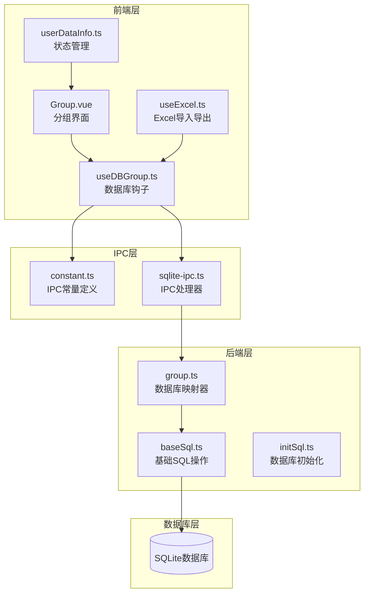
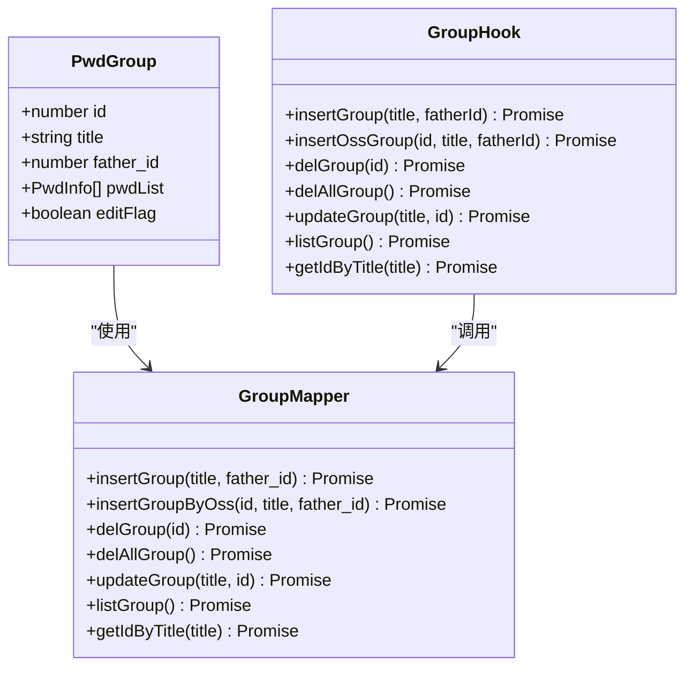
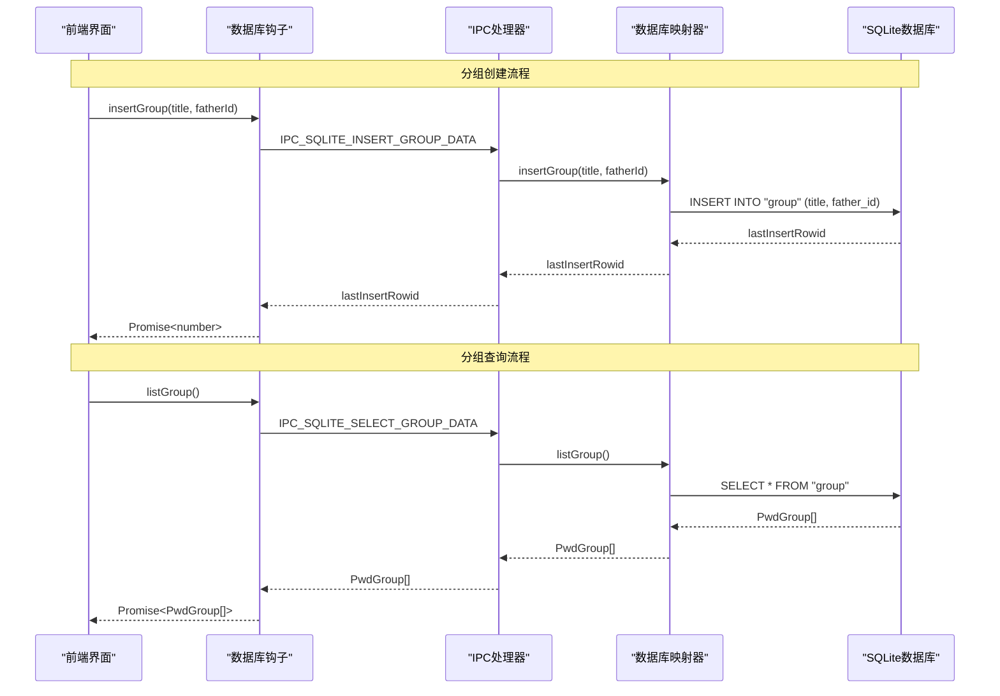
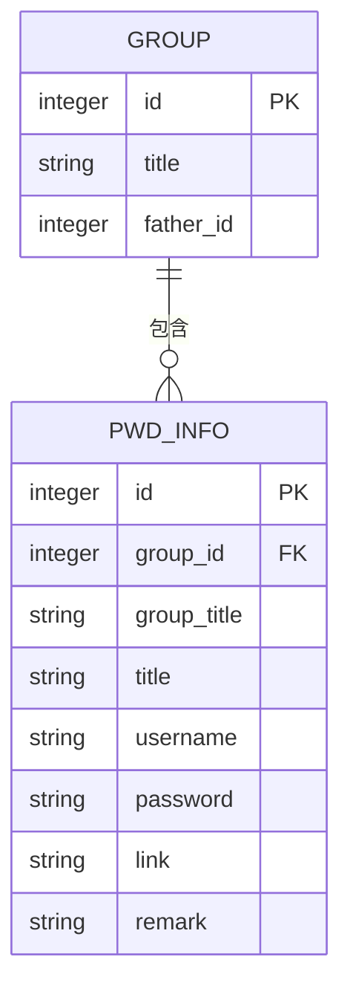
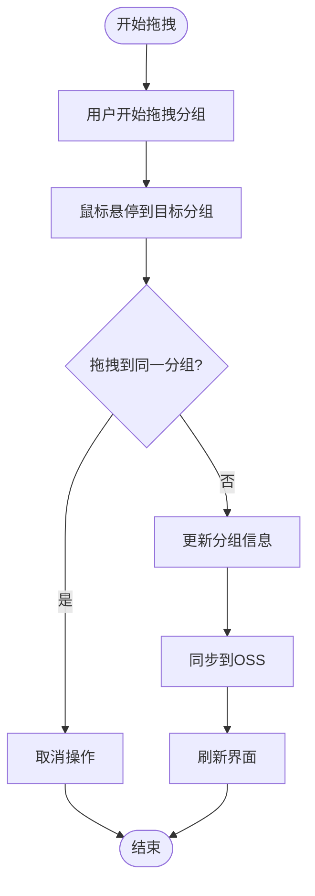
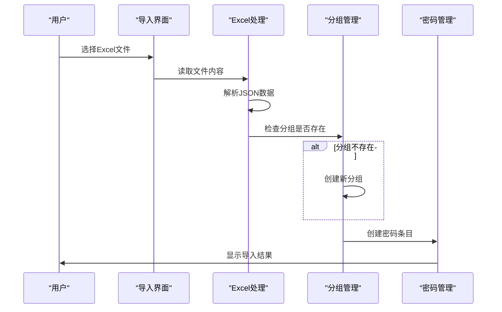
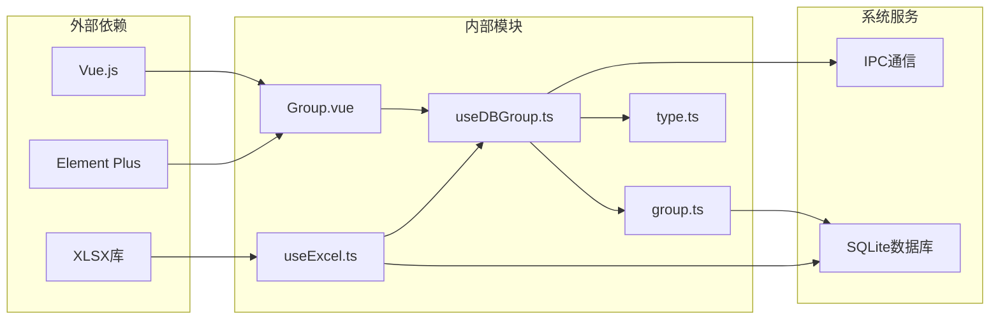

# 分组管理API

<cite>
**本文档引用的文件**
- [group.ts](file://electron/db/sqlite/mapper/group.ts)
- [useDBGroup.ts](file://src/hooks/useDBGroup.ts)
- [baseSql.ts](file://electron/db/sqlite/components/baseSql.ts)
- [Group.vue](file://src/components/indexview/Group.vue)
- [useExcel.ts](file://src/hooks/useExcel.ts)
- [type.ts](file://src/components/type.ts)
- [constant.ts](file://electron/constant.ts)
- [initSql.ts](file://electron/db/sqlite/components/initSql.ts)
- [sqlite-ipc.ts](file://electron/db/sqlite/sqlite-ipc.ts)
- [main.ts](file://electron/main.ts)
- [userDataInfo.ts](file://src/store/userDataInfo.ts)
- [Import.vue](file://src/components/topMenu/Import.vue)
</cite>

## 目录
1. [简介](#简介)
2. [项目结构](#项目结构)
3. [核心组件](#核心组件)
4. [架构概览](#架构概览)
5. [详细组件分析](#详细组件分析)
6. [依赖分析](#依赖分析)
7. [性能考虑](#性能考虑)
8. [故障排除指南](#故障排除指南)
9. [结论](#结论)

## 简介
本文档详细记录了密码管理器中的分组管理API，涵盖分组数据的所有操作接口，包括创建、读取、更新、删除和查询功能。重点说明了分组层级结构的实现方式、父子关系维护和树形数据处理。同时提供了分组排序、拖拽重排和批量操作的API使用示例，记录了分组权限控制、数据验证规则和约束条件，并包含分组导入导出、数据迁移和备份恢复的接口说明。

## 项目结构
分组管理功能采用前后端分离的架构设计，前端通过Electron的IPC机制与后端SQLite数据库进行通信。

**图表来源**
- [Group.vue:1-333](file://src/components/indexview/Group.vue#L1-L333)
- [useDBGroup.ts:1-53](file://src/hooks/useDBGroup.ts#L1-L53)
- [sqlite-ipc.ts:1-220](file://electron/db/sqlite/sqlite-ipc.ts#L1-L220)
- [group.ts:1-49](file://electron/db/sqlite/mapper/group.ts#L1-L49)

**章节来源**
- [Group.vue:1-333](file://src/components/indexview/Group.vue#L1-L333)
- [useDBGroup.ts:1-53](file://src/hooks/useDBGroup.ts#L1-L53)
- [sqlite-ipc.ts:1-220](file://electron/db/sqlite/sqlite-ipc.ts#L1-L220)

## 核心组件
分组管理API由多个核心组件协同工作，实现了完整的分组生命周期管理。

### 数据模型
分组数据模型采用简单的层级结构设计：

**图表来源**
- [type.ts:76-88](file://src/components/type.ts#L76-L88)
- [group.ts:7-48](file://electron/db/sqlite/mapper/group.ts#L7-L48)
- [useDBGroup.ts:15-49](file://src/hooks/useDBGroup.ts#L15-L49)

### IPC通信机制
前端通过预定义的IPC通道与后端通信，实现安全的数据访问控制：

| IPC通道名称 | 功能描述 | 参数类型 | 返回值类型 |
|-----------|----------|----------|------------|
| IPC_SQLITE_INSERT_GROUP_DATA | 插入新分组 | title(string), father_id(number) | lastInsertRowid(number) |
| IPC_SQLITE_INSERT_OSS_GROUP_DATA | 从OSS插入分组 | id(number), title(string), father_id(number) | lastInsertRowid(number) |
| IPC_SQLITE_DELETE_GROUP_DATA | 删除指定分组 | id(number) | 1或0 |
| IPC_SQLITE_DELETE_ALL_GROUP_DATA | 删除所有分组 | 无 | 1或0 |
| IPC_SQLITE_UPDATE_GROUP_DATA | 更新分组信息 | title(string), id(number) | 1或0 |
| IPC_SQLITE_SELECT_GROUP_DATA | 查询所有分组 | 无 | PwdGroup[] |
| IPC_SQLITE_GET_ID_GROUP_DATA | 根据标题获取ID | title(string) | {id:number} |

**章节来源**
- [constant.ts:21-28](file://electron/constant.ts#L21-L28)
- [sqlite-ipc.ts:98-138](file://electron/db/sqlite/sqlite-ipc.ts#L98-L138)
- [useDBGroup.ts:15-49](file://src/hooks/useDBGroup.ts#L15-L49)

## 架构概览
分组管理采用三层架构设计：表现层、业务逻辑层和数据持久层。

**图表来源**
- [Group.vue:105-124](file://src/components/indexview/Group.vue#L105-L124)
- [useDBGroup.ts:15-42](file://src/hooks/useDBGroup.ts#L15-L42)
- [sqlite-ipc.ts:100-132](file://electron/db/sqlite/sqlite-ipc.ts#L100-L132)
- [group.ts:7-41](file://electron/db/sqlite/mapper/group.ts#L7-L41)

## 详细组件分析

### 分组数据模型
分组采用扁平化的层级结构设计，通过`father_id`字段维护父子关系：

**图表来源**
- [initSql.ts:52-71](file://electron/db/sqlite/components/initSql.ts#L52-L71)
- [type.ts:76-88](file://src/components/type.ts#L76-L88)

### 分组操作API

#### 创建分组
支持两种创建方式：
1. 标准创建：`insertGroup(title, fatherId)`
2. OSS同步创建：`insertOssGroup(id, title, fatherId)`

创建流程包含输入验证和错误处理机制。

#### 读取分组
- `listGroup()`: 获取所有分组列表
- `getIdByTitle(title)`: 根据标题获取分组ID

#### 更新分组
- `updateGroup(title, id)`: 更新分组标题

#### 删除分组
- `delGroup(id)`: 删除指定分组（带数据完整性检查）
- `delAllGroup()`: 删除所有分组

**章节来源**
- [group.ts:7-48](file://electron/db/sqlite/mapper/group.ts#L7-L48)
- [useDBGroup.ts:15-49](file://src/hooks/useDBGroup.ts#L15-L49)

### 拖拽重排功能
分组界面实现了直观的拖拽重排功能：

**图表来源**
- [Group.vue:178-212](file://src/components/indexview/Group.vue#L178-L212)

**章节来源**
- [Group.vue:160-212](file://src/components/indexview/Group.vue#L160-L212)

### Excel导入导出功能

#### 导入流程
1. 用户选择Excel文件
2. 系统读取文件内容
3. 遍历每行数据，创建分组和密码条目
4. 自动处理重复分组

**图表来源**
- [useExcel.ts:44-84](file://src/hooks/useExcel.ts#L44-L84)

#### 导出流程
1. 获取所有密码条目数据
2. 按分组标题组织数据
3. 生成Excel文件

**章节来源**
- [useExcel.ts:22-42](file://src/hooks/useExcel.ts#L22-L42)
- [useExcel.ts:44-84](file://src/hooks/useExcel.ts#L44-L84)

### 权限控制和数据验证

#### 数据验证规则
- 分组标题不能为空
- 分组ID必须为正整数
- 父分组ID必须存在或为0

#### 权限控制机制
- 所有数据库操作通过IPC通道进行
- 前端只能通过定义好的API访问数据库
- 支持OSS同步的权限验证

**章节来源**
- [baseSql.ts:35-49](file://electron/db/sqlite/components/baseSql.ts#L35-L49)
- [sqlite-ipc.ts:98-138](file://electron/db/sqlite/sqlite-ipc.ts#L98-L138)

## 依赖分析

**图表来源**
- [Group.vue:1-333](file://src/components/indexview/Group.vue#L1-L333)
- [useDBGroup.ts:1-53](file://src/hooks/useDBGroup.ts#L1-L53)
- [group.ts:1-49](file://electron/db/sqlite/mapper/group.ts#L1-L49)
- [useExcel.ts:1-109](file://src/hooks/useExcel.ts#L1-L109)

**章节来源**
- [Group.vue:1-333](file://src/components/indexview/Group.vue#L1-L333)
- [useDBGroup.ts:1-53](file://src/hooks/useDBGroup.ts#L1-L53)
- [useExcel.ts:1-109](file://src/hooks/useExcel.ts#L1-L109)

## 性能考虑
- 使用事务处理批量操作，确保数据一致性
- 缓存常用查询结果，减少数据库访问频率
- 实现异步操作，避免阻塞UI线程
- 优化SQL查询语句，使用适当的索引

## 故障排除指南

### 常见问题及解决方案

#### 分组创建失败
- 检查分组标题是否为空
- 验证父分组ID是否存在
- 查看数据库连接状态

#### 分组删除异常
- 确认分组下是否有密码条目
- 检查外键约束是否满足
- 验证删除权限

#### Excel导入错误
- 确认Excel文件格式正确
- 检查文件大小限制（50MB）
- 验证列标题匹配度

**章节来源**
- [Group.vue:139-158](file://src/components/indexview/Group.vue#L139-L158)
- [useExcel.ts:22-30](file://src/hooks/useExcel.ts#L22-L30)

## 结论
分组管理API提供了完整、安全、高效的分组数据管理能力。通过清晰的层次结构设计、完善的权限控制机制和丰富的扩展功能，满足了密码管理器的各种使用场景。建议在生产环境中：
1. 添加更严格的输入验证
2. 实现分组锁定机制
3. 增加操作审计日志
4. 优化大数据量下的性能表现