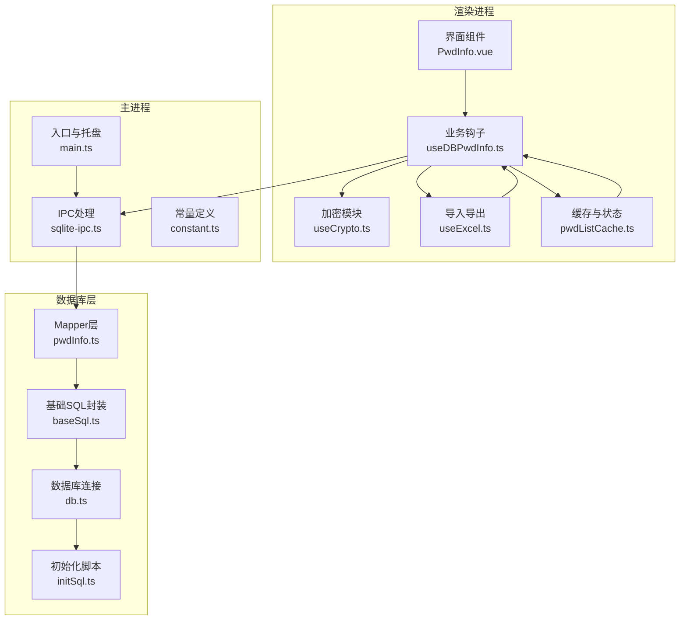
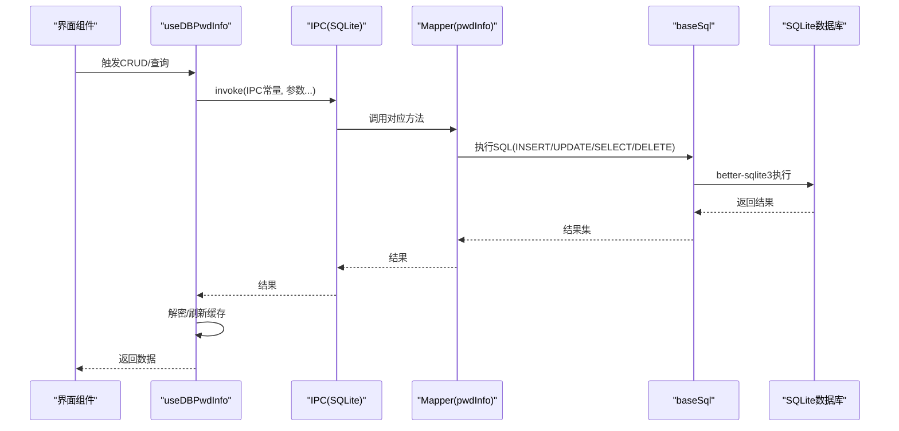
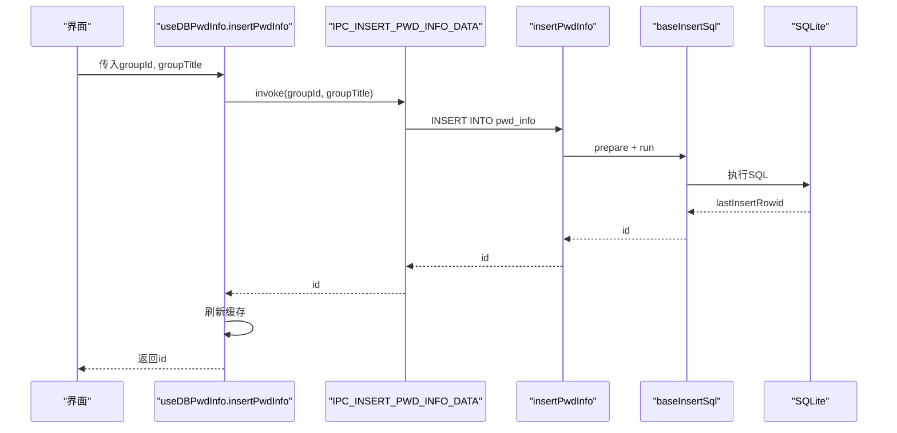
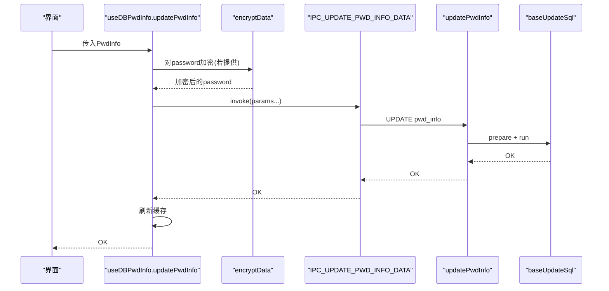
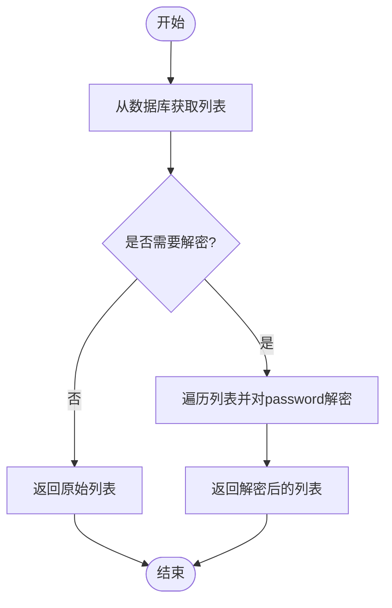
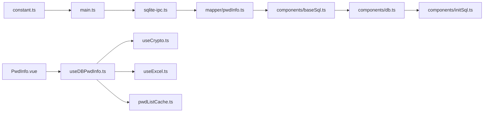

# 密码信息API

<cite>
**本文引用的文件**
- [electron/db/sqlite/mapper/pwdInfo.ts](file://electron/db/sqlite/mapper/pwdInfo.ts)
- [electron/db/sqlite/components/db.ts](file://electron/db/sqlite/components/db.ts)
- [electron/db/sqlite/components/initSql.ts](file://electron/db/sqlite/components/initSql.ts)
- [src/hooks/useDBPwdInfo.ts](file://src/hooks/useDBPwdInfo.ts)
- [electron/constant.ts](file://electron/constant.ts)
- [src/components/type.ts](file://src/components/type.ts)
- [src/hooks/useCrypto.ts](file://src/hooks/useCrypto.ts)
- [electron/main.ts](file://electron/main.ts)
- [electron/db/sqlite/sqlite-ipc.ts](file://electron/db/sqlite/sqlite-ipc.ts)
- [src/config/config.ts](file://src/config/config.ts)
- [electron/db/sqlite/components/baseSql.ts](file://electron/db/sqlite/components/baseSql.ts)
- [src/store/pwdListCache.ts](file://src/store/pwdListCache.ts)
- [src/hooks/useExcel.ts](file://src/hooks/useExcel.ts)
- [src/components/indexview/PwdInfo.vue](file://src/components/indexview/PwdInfo.vue)
- [src/components/setview/DataSync.vue](file://src/components/setview/DataSync.vue)
</cite>

## 目录
1. [简介](#简介)
2. [项目结构](#项目结构)
3. [核心组件](#核心组件)
4. [架构总览](#架构总览)
5. [详细组件分析](#详细组件分析)
6. [依赖关系分析](#依赖关系分析)
7. [性能考量](#性能考量)
8. [故障排查指南](#故障排查指南)
9. [结论](#结论)
10. [附录](#附录)

## 简介
本文件面向“密码信息管理API”的使用者与维护者，系统性梳理密码条目的CRUD接口、数据结构、加密存储机制、安全校验流程、高级查询能力（搜索、过滤、排序）、导入导出与批量操作、以及数据同步与审计相关机制。文档基于仓库现有实现进行归纳总结，确保技术细节与实际代码一致。

## 项目结构
本项目采用Electron + Vue的桌面应用架构，密码信息API位于渲染进程与主进程之间通过IPC通信实现。数据库采用SQLite，使用better-sqlite3驱动；密码字段在入库前由AES/CBC加密，解密在查询返回时由前端完成。

**图表来源**
- [src/components/indexview/PwdInfo.vue:1-257](file://src/components/indexview/PwdInfo.vue#L1-L257)
- [src/hooks/useDBPwdInfo.ts:1-103](file://src/hooks/useDBPwdInfo.ts#L1-L103)
- [src/hooks/useCrypto.ts:1-77](file://src/hooks/useCrypto.ts#L1-L77)
- [src/hooks/useExcel.ts:1-109](file://src/hooks/useExcel.ts#L1-L109)
- [src/store/pwdListCache.ts:1-37](file://src/store/pwdListCache.ts#L1-L37)
- [electron/main.ts:1-240](file://electron/main.ts#L1-L240)
- [electron/db/sqlite/sqlite-ipc.ts:1-220](file://electron/db/sqlite/sqlite-ipc.ts#L1-L220)
- [electron/constant.ts:1-63](file://electron/constant.ts#L1-L63)
- [electron/db/sqlite/components/baseSql.ts:1-87](file://electron/db/sqlite/components/baseSql.ts#L1-L87)
- [electron/db/sqlite/components/db.ts:1-30](file://electron/db/sqlite/components/db.ts#L1-L30)
- [electron/db/sqlite/components/initSql.ts:1-224](file://electron/db/sqlite/components/initSql.ts#L1-L224)
- [electron/db/sqlite/mapper/pwdInfo.ts:1-100](file://electron/db/sqlite/mapper/pwdInfo.ts#L1-L100)

**章节来源**
- [electron/main.ts:1-240](file://electron/main.ts#L1-L240)
- [electron/db/sqlite/sqlite-ipc.ts:1-220](file://electron/db/sqlite/sqlite-ipc.ts#L1-L220)
- [electron/db/sqlite/components/db.ts:1-30](file://electron/db/sqlite/components/db.ts#L1-L30)
- [electron/db/sqlite/components/initSql.ts:1-224](file://electron/db/sqlite/components/initSql.ts#L1-L224)

## 核心组件
- 数据模型与类型
  - 密码信息对象包含：id、分组id、分组标题、标题、用户名、密码（加密存储）、链接、备注。
  - 类型定义参见：[src/components/type.ts:50-67](file://src/components/type.ts#L50-L67)

- 渲染进程数据库操作钩子
  - 提供插入、删除、更新、查询、搜索、计数、按ID集合查询等方法，并在调用前后刷新缓存。
  - 参见：[src/hooks/useDBPwdInfo.ts:1-103](file://src/hooks/useDBPwdInfo.ts#L1-L103)

- 加密与解密
  - 使用AES/CBC模式与固定IV、Key进行加解密；查询返回时统一解密。
  - 参见：[src/hooks/useCrypto.ts:1-77](file://src/hooks/useCrypto.ts#L1-L77)，[src/config/config.ts:14-21](file://src/config/config.ts#L14-L21)

- IPC与数据库映射
  - 主进程注册密码信息相关IPC处理函数，转发到Mapper层；Mapper层基于baseSql封装执行SQL。
  - 参见：[electron/db/sqlite/sqlite-ipc.ts:140-204](file://electron/db/sqlite/sqlite-ipc.ts#L140-L204)，[electron/db/sqlite/mapper/pwdInfo.ts:1-100](file://electron/db/sqlite/mapper/pwdInfo.ts#L1-L100)，[electron/db/sqlite/components/baseSql.ts:1-87](file://electron/db/sqlite/components/baseSql.ts#L1-L87)

- 缓存与状态
  - Pinia缓存仅保留轻量字段，用于快速展示；真实列表查询时再解密。
  - 参见：[src/store/pwdListCache.ts:1-37](file://src/store/pwdListCache.ts#L1-L37)

**章节来源**
- [src/components/type.ts:50-67](file://src/components/type.ts#L50-L67)
- [src/hooks/useDBPwdInfo.ts:1-103](file://src/hooks/useDBPwdInfo.ts#L1-L103)
- [src/hooks/useCrypto.ts:1-77](file://src/hooks/useCrypto.ts#L1-L77)
- [src/config/config.ts:14-21](file://src/config/config.ts#L14-L21)
- [electron/db/sqlite/sqlite-ipc.ts:140-204](file://electron/db/sqlite/sqlite-ipc.ts#L140-L204)
- [electron/db/sqlite/mapper/pwdInfo.ts:1-100](file://electron/db/sqlite/mapper/pwdInfo.ts#L1-L100)
- [electron/db/sqlite/components/baseSql.ts:1-87](file://electron/db/sqlite/components/baseSql.ts#L1-L87)
- [src/store/pwdListCache.ts:1-37](file://src/store/pwdListCache.ts#L1-L37)

## 架构总览
密码信息API的调用链路如下：

**图表来源**
- [src/hooks/useDBPwdInfo.ts:1-103](file://src/hooks/useDBPwdInfo.ts#L1-L103)
- [electron/db/sqlite/sqlite-ipc.ts:140-204](file://electron/db/sqlite/sqlite-ipc.ts#L140-L204)
- [electron/db/sqlite/mapper/pwdInfo.ts:1-100](file://electron/db/sqlite/mapper/pwdInfo.ts#L1-L100)
- [electron/db/sqlite/components/baseSql.ts:1-87](file://electron/db/sqlite/components/baseSql.ts#L1-L87)
- [electron/db/sqlite/components/db.ts:1-30](file://electron/db/sqlite/components/db.ts#L1-L30)

## 详细组件分析

### 数据模型与字段
- 字段说明
  - id：自增主键
  - group_id：所属分组id
  - group_title：分组标题
  - title：条目标题
  - username：用户名
  - password：加密后的密码(Base64)
  - link：网站链接
  - remark：备注

- 数据模型定义
  - 参见：[src/components/type.ts:50-67](file://src/components/type.ts#L50-L67)

**章节来源**
- [src/components/type.ts:50-67](file://src/components/type.ts#L50-L67)

### CRUD接口与调用流程

#### 创建密码条目
- 接口路径
  - 渲染进程：[src/hooks/useDBPwdInfo.ts:21-26](file://src/hooks/useDBPwdInfo.ts#L21-L26)
  - 主进程IPC：[electron/db/sqlite/sqlite-ipc.ts:142-145](file://electron/db/sqlite/sqlite-ipc.ts#L142-L145)
  - Mapper：[electron/db/sqlite/mapper/pwdInfo.ts:6-10](file://electron/db/sqlite/mapper/pwdInfo.ts#L6-L10)
  - SQL初始化：[electron/db/sqlite/components/initSql.ts:60-71](file://electron/db/sqlite/components/initSql.ts#L60-L71)

- 流程图

**图表来源**
- [src/hooks/useDBPwdInfo.ts:21-26](file://src/hooks/useDBPwdInfo.ts#L21-L26)
- [electron/db/sqlite/sqlite-ipc.ts:142-145](file://electron/db/sqlite/sqlite-ipc.ts#L142-L145)
- [electron/db/sqlite/mapper/pwdInfo.ts:6-10](file://electron/db/sqlite/mapper/pwdInfo.ts#L6-L10)
- [electron/db/sqlite/components/baseSql.ts:35-49](file://electron/db/sqlite/components/baseSql.ts#L35-L49)
- [electron/db/sqlite/components/db.ts:16-23](file://electron/db/sqlite/components/db.ts#L16-L23)

**章节来源**
- [src/hooks/useDBPwdInfo.ts:21-26](file://src/hooks/useDBPwdInfo.ts#L21-L26)
- [electron/db/sqlite/sqlite-ipc.ts:142-145](file://electron/db/sqlite/sqlite-ipc.ts#L142-L145)
- [electron/db/sqlite/mapper/pwdInfo.ts:6-10](file://electron/db/sqlite/mapper/pwdInfo.ts#L6-L10)
- [electron/db/sqlite/components/initSql.ts:60-71](file://electron/db/sqlite/components/initSql.ts#L60-L71)

#### 更新密码条目
- 接口路径
  - 渲染进程：[src/hooks/useDBPwdInfo.ts:55-63](file://src/hooks/useDBPwdInfo.ts#L55-L63)
  - 主进程IPC：[electron/db/sqlite/sqlite-ipc.ts:171-175](file://electron/db/sqlite/sqlite-ipc.ts#L171-L175)
  - Mapper：[electron/db/sqlite/mapper/pwdInfo.ts:37-48](file://electron/db/sqlite/mapper/pwdInfo.ts#L37-L48)
  - 加密：[src/hooks/useCrypto.ts:41-52](file://src/hooks/useCrypto.ts#L41-L52)

- 流程图

**图表来源**
- [src/hooks/useDBPwdInfo.ts:55-63](file://src/hooks/useDBPwdInfo.ts#L55-L63)
- [src/hooks/useCrypto.ts:41-52](file://src/hooks/useCrypto.ts#L41-L52)
- [electron/db/sqlite/sqlite-ipc.ts:171-175](file://electron/db/sqlite/sqlite-ipc.ts#L171-L175)
- [electron/db/sqlite/mapper/pwdInfo.ts:37-48](file://electron/db/sqlite/mapper/pwdInfo.ts#L37-L48)
- [electron/db/sqlite/components/baseSql.ts:67-81](file://electron/db/sqlite/components/baseSql.ts#L67-L81)

**章节来源**
- [src/hooks/useDBPwdInfo.ts:55-63](file://src/hooks/useDBPwdInfo.ts#L55-L63)
- [src/hooks/useCrypto.ts:41-52](file://src/hooks/useCrypto.ts#L41-L52)
- [electron/db/sqlite/sqlite-ipc.ts:171-175](file://electron/db/sqlite/sqlite-ipc.ts#L171-L175)
- [electron/db/sqlite/mapper/pwdInfo.ts:37-48](file://electron/db/sqlite/mapper/pwdInfo.ts#L37-L48)

#### 删除密码条目
- 单条删除
  - 渲染进程：[src/hooks/useDBPwdInfo.ts:35-40](file://src/hooks/useDBPwdInfo.ts#L35-L40)
  - 主进程IPC：[electron/db/sqlite/sqlite-ipc.ts:152-156](file://electron/db/sqlite/sqlite-ipc.ts#L152-L156)
  - Mapper：[electron/db/sqlite/mapper/pwdInfo.ts:18-23](file://electron/db/sqlite/mapper/pwdInfo.ts#L18-L23)

- 按分组删除
  - 渲染进程：[src/hooks/useDBPwdInfo.ts:48-53](file://src/hooks/useDBPwdInfo.ts#L48-L53)
  - 主进程IPC：[electron/db/sqlite/sqlite-ipc.ts:158-162](file://electron/db/sqlite/sqlite-ipc.ts#L158-L162)
  - Mapper：[electron/db/sqlite/mapper/pwdInfo.ts:24-29](file://electron/db/sqlite/mapper/pwdInfo.ts#L24-L29)

- 全部清空
  - 渲染进程：[src/hooks/useDBPwdInfo.ts:42-47](file://src/hooks/useDBPwdInfo.ts#L42-L47)
  - 主进程IPC：[electron/db/sqlite/sqlite-ipc.ts:164-168](file://electron/db/sqlite/sqlite-ipc.ts#L164-L168)
  - Mapper：[electron/db/sqlite/mapper/pwdInfo.ts:31-35](file://electron/db/sqlite/mapper/pwdInfo.ts#L31-L35)

**章节来源**
- [src/hooks/useDBPwdInfo.ts:35-53](file://src/hooks/useDBPwdInfo.ts#L35-L53)
- [electron/db/sqlite/sqlite-ipc.ts:152-168](file://electron/db/sqlite/sqlite-ipc.ts#L152-L168)
- [electron/db/sqlite/mapper/pwdInfo.ts:18-35](file://electron/db/sqlite/mapper/pwdInfo.ts#L18-L35)

#### 查询与搜索
- 列表查询（可按分组）
  - 渲染进程：[src/hooks/useDBPwdInfo.ts:65-70](file://src/hooks/useDBPwdInfo.ts#L65-L70)
  - 主进程IPC：[electron/db/sqlite/sqlite-ipc.ts:177-181](file://electron/db/sqlite/sqlite-ipc.ts#L177-L181)
  - Mapper：[electron/db/sqlite/mapper/pwdInfo.ts:50-60](file://electron/db/sqlite/mapper/pwdInfo.ts#L50-L60)
  - 解密：[src/hooks/useCrypto.ts:68-74](file://src/hooks/useCrypto.ts#L68-L74)

- 搜索（标题/用户名模糊匹配）
  - 渲染进程：[src/hooks/useDBPwdInfo.ts:72-76](file://src/hooks/useDBPwdInfo.ts#L72-L76)
  - 主进程IPC：[electron/db/sqlite/sqlite-ipc.ts:189-193](file://electron/db/sqlite/sqlite-ipc.ts#L189-L193)
  - Mapper：[electron/db/sqlite/mapper/pwdInfo.ts:62-69](file://electron/db/sqlite/mapper/pwdInfo.ts#L62-L69)

- 按ID集合查询
  - 渲染进程：[src/hooks/useDBPwdInfo.ts:78-82](file://src/hooks/useDBPwdInfo.ts#L78-L82)
  - 主进程IPC：[electron/db/sqlite/sqlite-ipc.ts:195-198](file://electron/db/sqlite/sqlite-ipc.ts#L195-L198)
  - Mapper：[electron/db/sqlite/mapper/pwdInfo.ts:71-83](file://electron/db/sqlite/mapper/pwdInfo.ts#L71-L83)

- 计数
  - 渲染进程：[src/hooks/useDBPwdInfo.ts:84-88](file://src/hooks/useDBPwdInfo.ts#L84-L88)
  - 主进程IPC：[electron/db/sqlite/sqlite-ipc.ts:200-204](file://electron/db/sqlite/sqlite-ipc.ts#L200-L204)
  - Mapper：[electron/db/sqlite/mapper/pwdInfo.ts:85-91](file://electron/db/sqlite/mapper/pwdInfo.ts#L85-L91)

- 获取单条详情
  - 主进程IPC：[electron/db/sqlite/sqlite-ipc.ts:183-187](file://electron/db/sqlite/sqlite-ipc.ts#L183-L187)
  - Mapper：[electron/db/sqlite/mapper/pwdInfo.ts:94-100](file://electron/db/sqlite/mapper/pwdInfo.ts#L94-L100)

- 解密流程

**图表来源**
- [src/hooks/useDBPwdInfo.ts:65-82](file://src/hooks/useDBPwdInfo.ts#L65-L82)
- [src/hooks/useCrypto.ts:68-74](file://src/hooks/useCrypto.ts#L68-L74)
- [electron/db/sqlite/sqlite-ipc.ts:177-193](file://electron/db/sqlite/sqlite-ipc.ts#L177-L193)
- [electron/db/sqlite/mapper/pwdInfo.ts:50-100](file://electron/db/sqlite/mapper/pwdInfo.ts#L50-L100)

**章节来源**
- [src/hooks/useDBPwdInfo.ts:65-88](file://src/hooks/useDBPwdInfo.ts#L65-L88)
- [src/hooks/useCrypto.ts:68-74](file://src/hooks/useCrypto.ts#L68-L74)
- [electron/db/sqlite/sqlite-ipc.ts:177-193](file://electron/db/sqlite/sqlite-ipc.ts#L177-L193)
- [electron/db/sqlite/mapper/pwdInfo.ts:50-100](file://electron/db/sqlite/mapper/pwdInfo.ts#L50-L100)

### 高级查询与过滤
- 模糊搜索
  - 按标题或用户名模糊匹配，返回完整记录。
  - 参见：[electron/db/sqlite/mapper/pwdInfo.ts:62-69](file://electron/db/sqlite/mapper/pwdInfo.ts#L62-L69)

- 按ID集合过滤
  - 支持传入多个ID，构建IN查询，过滤无效ID后执行。
  - 参见：[electron/db/sqlite/mapper/pwdInfo.ts:71-83](file://electron/db/sqlite/mapper/pwdInfo.ts#L71-L83)

- 计数统计
  - 按分组统计条目数量。
  - 参见：[electron/db/sqlite/mapper/pwdInfo.ts:85-91](file://electron/db/sqlite/mapper/pwdInfo.ts#L85-L91)

**章节来源**
- [electron/db/sqlite/mapper/pwdInfo.ts:62-91](file://electron/db/sqlite/mapper/pwdInfo.ts#L62-L91)

### 导入导出与批量操作
- 导出为Excel
  - 读取全部密码条目，写入工作簿并下载文件。
  - 参见：[src/hooks/useExcel.ts:22-42](file://src/hooks/useExcel.ts#L22-L42)

- 导入Excel
  - 读取Excel首表，逐行解析为PwdInfo对象；根据group_title查找或创建分组；调用“按导入”插入接口。
  - 参见：[src/hooks/useExcel.ts:44-84](file://src/hooks/useExcel.ts#L44-L84)

- 模板下载
  - 通过静态资源下载导入模板文件。
  - 参见：[src/hooks/useExcel.ts:86-106](file://src/hooks/useExcel.ts#L86-L106)

- 批量插入
  - 导入流程中逐条调用“按导入插入”，实现批量导入。
  - 参见：[src/hooks/useDBPwdInfo.ts:28-33](file://src/hooks/useDBPwdInfo.ts#L28-L33)，[electron/db/sqlite/mapper/pwdInfo.ts:12-16](file://electron/db/sqlite/mapper/pwdInfo.ts#L12-L16)

**章节来源**
- [src/hooks/useExcel.ts:22-106](file://src/hooks/useExcel.ts#L22-L106)
- [src/hooks/useDBPwdInfo.ts:28-33](file://src/hooks/useDBPwdInfo.ts#L28-L33)
- [electron/db/sqlite/mapper/pwdInfo.ts:12-16](file://electron/db/sqlite/mapper/pwdInfo.ts#L12-L16)

### 数据同步与OSS集成
- OSS配置界面
  - 提供region、keyId、key_secret、bucket等字段，支持测试连接与保存。
  - 参见：[src/components/setview/DataSync.vue:1-69](file://src/components/setview/DataSync.vue#L1-L69)

- OSS相关IPC
  - 主进程注册OSS读写与查询IPC处理，便于后续实现本地与OSS之间的数据同步。
  - 参见：[electron/db/sqlite/sqlite-ipc.ts:73-82](file://electron/db/sqlite/sqlite-ipc.ts#L73-L82)

- 同步触发
  - 界面在编辑密码条目后可触发同步至OSS（具体实现依赖useDataSync钩子）。
  - 参见：[src/components/indexview/PwdInfo.vue:48-53](file://src/components/indexview/PwdInfo.vue#L48-L53)

**章节来源**
- [src/components/setview/DataSync.vue:1-69](file://src/components/setview/DataSync.vue#L1-L69)
- [electron/db/sqlite/sqlite-ipc.ts:73-82](file://electron/db/sqlite/sqlite-ipc.ts#L73-L82)
- [src/components/indexview/PwdInfo.vue:48-53](file://src/components/indexview/PwdInfo.vue#L48-L53)

### 安全与审计
- 加密存储
  - AES/CBC模式，固定Key与IV，Base64编码存储；查询返回时统一解密。
  - 参见：[src/hooks/useCrypto.ts:32-66](file://src/hooks/useCrypto.ts#L32-L66)，[src/config/config.ts:14-21](file://src/config/config.ts#L14-L21)

- 日志与调试
  - 渲染进程与主进程均输出大量控制台日志，便于问题定位。
  - 参见：[src/hooks/useDBPwdInfo.ts:21-33](file://src/hooks/useDBPwdInfo.ts#L21-L33)，[electron/db/sqlite/sqlite-ipc.ts:142-150](file://electron/db/sqlite/sqlite-ipc.ts#L142-L150)

- 审计建议
  - 当前实现未内置审计日志表；可在主进程日志基础上扩展数据库审计表，记录关键操作（创建、更新、删除、导入、导出）的时间、用户、IP、操作详情等。

**章节来源**
- [src/hooks/useCrypto.ts:32-66](file://src/hooks/useCrypto.ts#L32-L66)
- [src/config/config.ts:14-21](file://src/config/config.ts#L14-L21)
- [src/hooks/useDBPwdInfo.ts:21-33](file://src/hooks/useDBPwdInfo.ts#L21-L33)
- [electron/db/sqlite/sqlite-ipc.ts:142-150](file://electron/db/sqlite/sqlite-ipc.ts#L142-L150)

## 依赖关系分析

**图表来源**
- [electron/constant.ts:31-41](file://electron/constant.ts#L31-L41)
- [electron/main.ts:24-56](file://electron/main.ts#L24-L56)
- [electron/db/sqlite/sqlite-ipc.ts:1-50](file://electron/db/sqlite/sqlite-ipc.ts#L1-L50)
- [electron/db/sqlite/mapper/pwdInfo.ts:1-10](file://electron/db/sqlite/mapper/pwdInfo.ts#L1-L10)
- [electron/db/sqlite/components/baseSql.ts:1-10](file://electron/db/sqlite/components/baseSql.ts#L1-L10)
- [electron/db/sqlite/components/db.ts:1-12](file://electron/db/sqlite/components/db.ts#L1-L12)
- [electron/db/sqlite/components/initSql.ts:26-46](file://electron/db/sqlite/components/initSql.ts#L26-L46)
- [src/components/indexview/PwdInfo.vue:28-53](file://src/components/indexview/PwdInfo.vue#L28-L53)
- [src/hooks/useDBPwdInfo.ts:1-20](file://src/hooks/useDBPwdInfo.ts#L1-L20)
- [src/hooks/useCrypto.ts:1-10](file://src/hooks/useCrypto.ts#L1-L10)
- [src/hooks/useExcel.ts:1-10](file://src/hooks/useExcel.ts#L1-L10)
- [src/store/pwdListCache.ts:1-10](file://src/store/pwdListCache.ts#L1-L10)

**章节来源**
- [electron/constant.ts:31-41](file://electron/constant.ts#L31-L41)
- [electron/main.ts:24-56](file://electron/main.ts#L24-L56)
- [electron/db/sqlite/sqlite-ipc.ts:1-50](file://electron/db/sqlite/sqlite-ipc.ts#L1-L50)
- [electron/db/sqlite/mapper/pwdInfo.ts:1-10](file://electron/db/sqlite/mapper/pwdInfo.ts#L1-L10)
- [electron/db/sqlite/components/baseSql.ts:1-10](file://electron/db/sqlite/components/baseSql.ts#L1-L10)
- [electron/db/sqlite/components/db.ts:1-12](file://electron/db/sqlite/components/db.ts#L1-L12)
- [electron/db/sqlite/components/initSql.ts:26-46](file://electron/db/sqlite/components/initSql.ts#L26-L46)
- [src/components/indexview/PwdInfo.vue:28-53](file://src/components/indexview/PwdInfo.vue#L28-L53)
- [src/hooks/useDBPwdInfo.ts:1-20](file://src/hooks/useDBPwdInfo.ts#L1-L20)
- [src/hooks/useCrypto.ts:1-10](file://src/hooks/useCrypto.ts#L1-L10)
- [src/hooks/useExcel.ts:1-10](file://src/hooks/useExcel.ts#L1-L10)
- [src/store/pwdListCache.ts:1-10](file://src/store/pwdListCache.ts#L1-L10)

## 性能考量
- 数据库连接
  - 单例连接，避免频繁创建销毁；日志开启有助于诊断，生产环境可关闭verbose。
  - 参见：[electron/db/sqlite/components/db.ts:16-23](file://electron/db/sqlite/components/db.ts#L16-L23)

- 查询优化
  - 列表查询与搜索使用参数化SQL，避免注入；建议在高频字段上建立索引（如group_id、title、username）。
  - 参见：[electron/db/sqlite/mapper/pwdInfo.ts:50-69](file://electron/db/sqlite/mapper/pwdInfo.ts#L50-L69)

- 批量导入
  - 导入流程逐条插入，建议在导入前禁用UI交互并提示进度；可考虑事务封装减少磁盘写入次数。
  - 参见：[src/hooks/useExcel.ts:56-78](file://src/hooks/useExcel.ts#L56-L78)

- 缓存策略
  - Pinia缓存仅保留轻量字段，避免大字段内存占用；列表查询时再解密。
  - 参见：[src/store/pwdListCache.ts:15-27](file://src/store/pwdListCache.ts#L15-L27)

**章节来源**
- [electron/db/sqlite/components/db.ts:16-23](file://electron/db/sqlite/components/db.ts#L16-L23)
- [electron/db/sqlite/mapper/pwdInfo.ts:50-69](file://electron/db/sqlite/mapper/pwdInfo.ts#L50-L69)
- [src/hooks/useExcel.ts:56-78](file://src/hooks/useExcel.ts#L56-L78)
- [src/store/pwdListCache.ts:15-27](file://src/store/pwdListCache.ts#L15-L27)

## 故障排查指南
- 无法连接数据库
  - 检查数据库路径与权限；确认初始化脚本已执行。
  - 参见：[electron/db/sqlite/components/db.ts:10-12](file://electron/db/sqlite/components/db.ts#L10-L12)，[electron/db/sqlite/components/initSql.ts:26-46](file://electron/db/sqlite/components/initSql.ts#L26-L46)

- IPC调用无响应
  - 确认主进程已注册对应IPC处理函数；检查渲染进程invoke调用的常量是否匹配。
  - 参见：[electron/constant.ts:31-41](file://electron/constant.ts#L31-L41)，[electron/db/sqlite/sqlite-ipc.ts:140-204](file://electron/db/sqlite/sqlite-ipc.ts#L140-L204)

- 密码解密异常
  - 检查Key/IV是否正确且与加密一致；确认存储为Base64编码。
  - 参见：[src/hooks/useCrypto.ts:32-66](file://src/hooks/useCrypto.ts#L32-L66)，[src/config/config.ts:14-21](file://src/config/config.ts#L14-L21)

- 导入失败
  - 检查Excel列名与模板一致；确认分组标题可解析；查看控制台错误日志。
  - 参见：[src/hooks/useExcel.ts:44-84](file://src/hooks/useExcel.ts#L44-L84)

**章节来源**
- [electron/db/sqlite/components/db.ts:10-12](file://electron/db/sqlite/components/db.ts#L10-L12)
- [electron/db/sqlite/components/initSql.ts:26-46](file://electron/db/sqlite/components/initSql.ts#L26-L46)
- [electron/constant.ts:31-41](file://electron/constant.ts#L31-L41)
- [electron/db/sqlite/sqlite-ipc.ts:140-204](file://electron/db/sqlite/sqlite-ipc.ts#L140-L204)
- [src/hooks/useCrypto.ts:32-66](file://src/hooks/useCrypto.ts#L32-L66)
- [src/config/config.ts:14-21](file://src/config/config.ts#L14-L21)
- [src/hooks/useExcel.ts:44-84](file://src/hooks/useExcel.ts#L44-L84)

## 结论
本密码信息API围绕Electron + Vue架构设计，通过IPC桥接渲染进程与SQLite数据库，实现了完整的CRUD与高级查询能力。密码字段采用AES/CBC加密并在查询时解密，满足基本安全需求。导入导出与批量操作通过Excel工具链实现，具备良好的易用性。建议后续增强审计日志、索引优化与事务封装，进一步提升安全性与性能。

## 附录

### API一览（按功能分类）
- 创建
  - IPC常量：[electron/constant.ts](file://electron/constant.ts#L31)
  - 实现：[electron/db/sqlite/sqlite-ipc.ts:142-145](file://electron/db/sqlite/sqlite-ipc.ts#L142-L145)，[electron/db/sqlite/mapper/pwdInfo.ts:6-10](file://electron/db/sqlite/mapper/pwdInfo.ts#L6-L10)

- 更新
  - IPC常量：[electron/constant.ts](file://electron/constant.ts#L36)
  - 实现：[electron/db/sqlite/sqlite-ipc.ts:171-175](file://electron/db/sqlite/sqlite-ipc.ts#L171-L175)，[electron/db/sqlite/mapper/pwdInfo.ts:37-48](file://electron/db/sqlite/mapper/pwdInfo.ts#L37-L48)

- 删除
  - 单条：[electron/constant.ts](file://electron/constant.ts#L34)，[electron/db/sqlite/sqlite-ipc.ts:152-156](file://electron/db/sqlite/sqlite-ipc.ts#L152-L156)，[electron/db/sqlite/mapper/pwdInfo.ts:18-23](file://electron/db/sqlite/mapper/pwdInfo.ts#L18-L23)
  - 按分组：[electron/constant.ts](file://electron/constant.ts#L35)，[electron/db/sqlite/sqlite-ipc.ts:158-162](file://electron/db/sqlite/sqlite-ipc.ts#L158-L162)，[electron/db/sqlite/mapper/pwdInfo.ts:24-29](file://electron/db/sqlite/mapper/pwdInfo.ts#L24-L29)
  - 全部：[electron/constant.ts](file://electron/constant.ts#L34)，[electron/db/sqlite/sqlite-ipc.ts:164-168](file://electron/db/sqlite/sqlite-ipc.ts#L164-L168)，[electron/db/sqlite/mapper/pwdInfo.ts:31-35](file://electron/db/sqlite/mapper/pwdInfo.ts#L31-L35)

- 查询
  - 列表：[electron/constant.ts](file://electron/constant.ts#L37)，[electron/db/sqlite/sqlite-ipc.ts:177-181](file://electron/db/sqlite/sqlite-ipc.ts#L177-L181)，[electron/db/sqlite/mapper/pwdInfo.ts:50-60](file://electron/db/sqlite/mapper/pwdInfo.ts#L50-L60)
  - 搜索：[electron/constant.ts](file://electron/constant.ts#L39)，[electron/db/sqlite/sqlite-ipc.ts:189-193](file://electron/db/sqlite/sqlite-ipc.ts#L189-L193)，[electron/db/sqlite/mapper/pwdInfo.ts:62-69](file://electron/db/sqlite/mapper/pwdInfo.ts#L62-L69)
  - 按ID集合：[electron/constant.ts](file://electron/constant.ts#L40)，[electron/db/sqlite/sqlite-ipc.ts:195-198](file://electron/db/sqlite/sqlite-ipc.ts#L195-L198)，[electron/db/sqlite/mapper/pwdInfo.ts:71-83](file://electron/db/sqlite/mapper/pwdInfo.ts#L71-L83)
  - 计数：[electron/constant.ts](file://electron/constant.ts#L41)，[electron/db/sqlite/sqlite-ipc.ts:200-204](file://electron/db/sqlite/sqlite-ipc.ts#L200-L204)，[electron/db/sqlite/mapper/pwdInfo.ts:85-91](file://electron/db/sqlite/mapper/pwdInfo.ts#L85-L91)
  - 获取单条：[electron/constant.ts](file://electron/constant.ts#L38)，[electron/db/sqlite/sqlite-ipc.ts:183-187](file://electron/db/sqlite/sqlite-ipc.ts#L183-L187)，[electron/db/sqlite/mapper/pwdInfo.ts:94-100](file://electron/db/sqlite/mapper/pwdInfo.ts#L94-L100)

- 导入导出
  - 导出：[src/hooks/useExcel.ts:22-42](file://src/hooks/useExcel.ts#L22-L42)
  - 导入：[src/hooks/useExcel.ts:44-84](file://src/hooks/useExcel.ts#L44-L84)
  - 模板下载：[src/hooks/useExcel.ts:86-106](file://src/hooks/useExcel.ts#L86-L106)

- 加密与解密
  - 加密：[src/hooks/useCrypto.ts:41-52](file://src/hooks/useCrypto.ts#L41-L52)
  - 解密：[src/hooks/useCrypto.ts:54-66](file://src/hooks/useCrypto.ts#L54-L66)，[src/hooks/useCrypto.ts:68-74](file://src/hooks/useCrypto.ts#L68-L74)