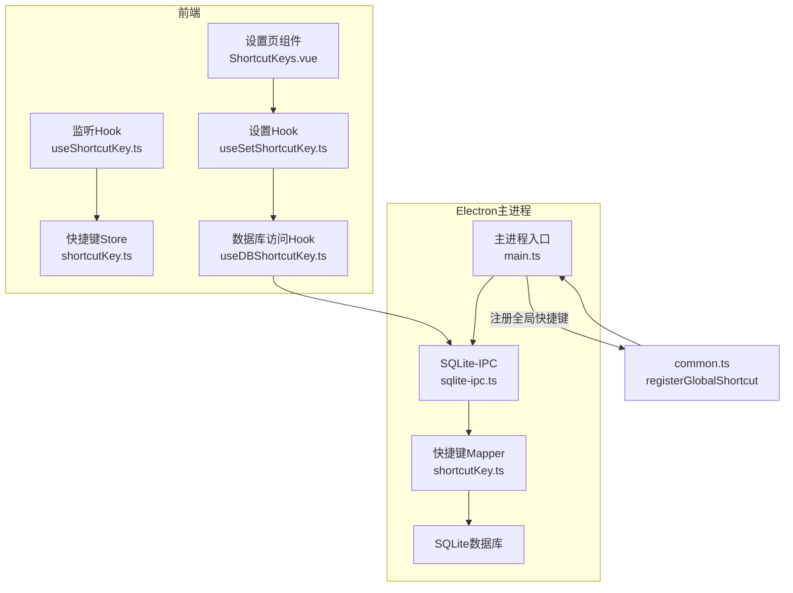
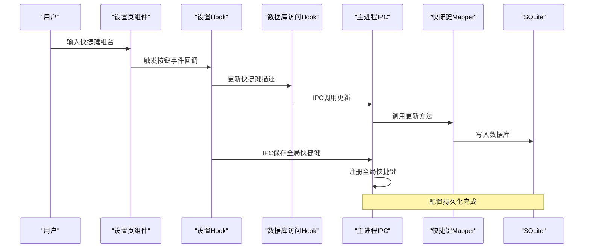
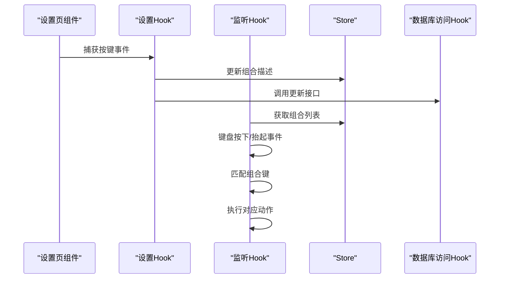
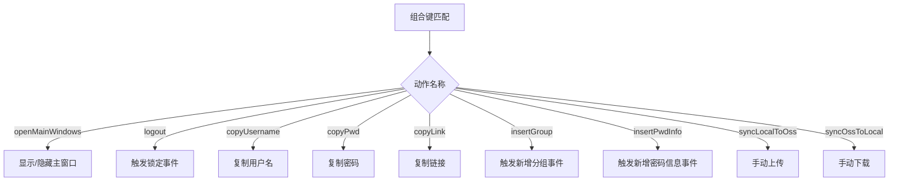
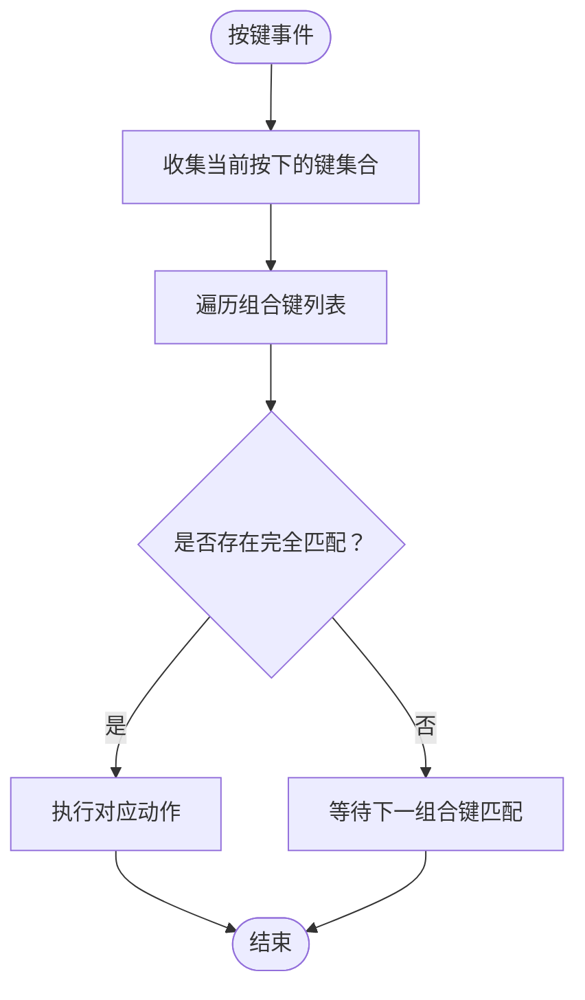
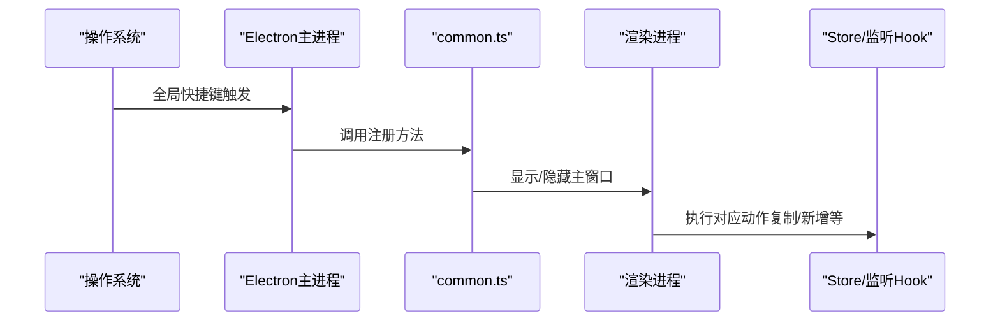
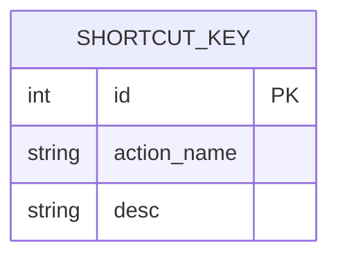
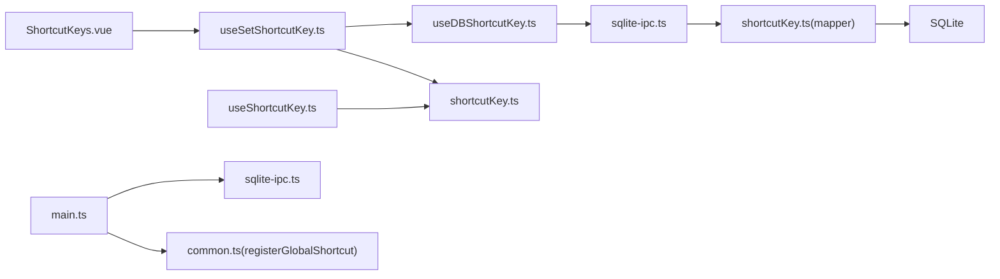

# 快捷键配置API

<cite>
**本文引用的文件**
- [useShortcutKey.ts](file://src/hooks/useShortcutKey.ts)
- [useSetShortcutKey.ts](file://src/hooks/useSetShortcutKey.ts)
- [shortcutKey.ts](file://src/store/shortcutKey.ts)
- [shortcutKey.vue](file://src/components/setview/ShortcutKeys.vue)
- [useDBShortcutKey.ts](file://src/hooks/useDBShortcutKey.ts)
- [config.ts](file://src/config/config.ts)
- [type.ts](file://src/components/type.ts)
- [shortcutKey.ts](file://electron/db/sqlite/mapper/shortcutKey.ts)
- [sqlite-ipc.ts](file://electron/db/sqlite/sqlite-ipc.ts)
- [main.ts](file://electron/main.ts)
- [constant.ts](file://electron/constant.ts)
- [common.ts](file://electron/common.ts)
- [initSql.ts](file://electron/db/sqlite/components/initSql.ts)
</cite>

## 目录
1. [简介](#简介)
2. [项目结构](#项目结构)
3. [核心组件](#核心组件)
4. [架构总览](#架构总览)
5. [详细组件分析](#详细组件分析)
6. [依赖分析](#依赖分析)
7. [性能考虑](#性能考虑)
8. [故障排查指南](#故障排查指南)
9. [结论](#结论)
10. [附录](#附录)

## 简介
本文件面向“快捷键配置管理API”的使用者与维护者，系统性阐述全局快捷键的注册、修改、禁用与删除流程；说明快捷键与功能模块的映射关系、冲突检测与优先级处理机制；提供快捷键自定义、批量导入导出与默认配置恢复的API使用示例；记录快捷键的系统集成方式、热键监听与事件分发机制；并覆盖持久化存储、跨平台兼容性与用户体验优化策略。

## 项目结构
快捷键系统由前端Vue/Hook层、Pinia状态层、Electron主进程IPC层与SQLite数据库层组成，形成“视图绑定—状态管理—事件映射—持久化—系统集成”的完整链路。

图表来源
- [ShortcutKeys.vue:1-225](file://src/components/setview/ShortcutKeys.vue#L1-L225)
- [useSetShortcutKey.ts:1-481](file://src/hooks/useSetShortcutKey.ts#L1-L481)
- [useShortcutKey.ts:1-64](file://src/hooks/useShortcutKey.ts#L1-L64)
- [shortcutKey.ts:1-99](file://src/store/shortcutKey.ts#L1-L99)
- [useDBShortcutKey.ts:1-17](file://src/hooks/useDBShortcutKey.ts#L1-L17)
- [sqlite-ipc.ts:1-220](file://electron/db/sqlite/sqlite-ipc.ts#L1-L220)
- [shortcutKey.ts:1-32](file://electron/db/sqlite/mapper/shortcutKey.ts#L1-L32)
- [main.ts:1-240](file://electron/main.ts#L1-L240)
- [common.ts:1-56](file://electron/common.ts#L1-L56)

章节来源
- [ShortcutKeys.vue:1-225](file://src/components/setview/ShortcutKeys.vue#L1-L225)
- [useSetShortcutKey.ts:1-481](file://src/hooks/useSetShortcutKey.ts#L1-L481)
- [useShortcutKey.ts:1-64](file://src/hooks/useShortcutKey.ts#L1-L64)
- [shortcutKey.ts:1-99](file://src/store/shortcutKey.ts#L1-L99)
- [useDBShortcutKey.ts:1-17](file://src/hooks/useDBShortcutKey.ts#L1-L17)
- [sqlite-ipc.ts:1-220](file://electron/db/sqlite/sqlite-ipc.ts#L1-L220)
- [shortcutKey.ts:1-32](file://electron/db/sqlite/mapper/shortcutKey.ts#L1-L32)
- [main.ts:1-240](file://electron/main.ts#L1-L240)
- [common.ts:1-56](file://electron/common.ts#L1-L56)

## 核心组件
- 视图与交互
  - 设置页组件负责展示与编辑九个快捷键项，并提供“保存”“重置”操作。
- 设置Hook
  - 负责捕获按键组合、格式化显示、调用数据库更新与IPC保存。
- 监听Hook
  - 负责在页面挂载时加载快捷键配置，监听键盘事件并触发对应动作。
- Pinia Store
  - 维护快捷键组合数组，提供初始化、更新与查询方法。
- 数据库访问Hook
  - 通过IPC调用主进程执行SQLite读写。
- 主进程IPC与Mapper
  - 提供快捷键数据的增删改查与全局快捷键注册。
- 默认配置与类型
  - 定义默认快捷键字符串与快捷键组合数据结构。

章节来源
- [ShortcutKeys.vue:1-225](file://src/components/setview/ShortcutKeys.vue#L1-L225)
- [useSetShortcutKey.ts:1-481](file://src/hooks/useSetShortcutKey.ts#L1-L481)
- [useShortcutKey.ts:1-64](file://src/hooks/useShortcutKey.ts#L1-L64)
- [shortcutKey.ts:1-99](file://src/store/shortcutKey.ts#L1-L99)
- [useDBShortcutKey.ts:1-17](file://src/hooks/useDBShortcutKey.ts#L1-L17)
- [config.ts:24-34](file://src/config/config.ts#L24-L34)
- [type.ts:19-29](file://src/components/type.ts#L19-L29)

## 架构总览
快捷键配置API遵循“前端编辑—状态管理—持久化—系统集成”的分层设计，确保可扩展与可维护性。

图表来源
- [ShortcutKeys.vue:1-225](file://src/components/setview/ShortcutKeys.vue#L1-L225)
- [useSetShortcutKey.ts:102-109](file://src/hooks/useSetShortcutKey.ts#L102-L109)
- [useDBShortcutKey.ts:11-14](file://src/hooks/useDBShortcutKey.ts#L11-L14)
- [sqlite-ipc.ts:207-211](file://electron/db/sqlite/sqlite-ipc.ts#L207-L211)
- [shortcutKey.ts:8-13](file://electron/db/sqlite/mapper/shortcutKey.ts#L8-L13)
- [main.ts:149-152](file://electron/main.ts#L149-L152)

## 详细组件分析

### 前端设置与监听流程
- 设置页组件
  - 提供九个输入框分别绑定九个快捷键项，支持按键捕获、清空与保存。
- 设置Hook
  - 将按键事件转换为统一格式，调用数据库更新与IPC保存；提供“全部保存”“重置默认”能力。
- 监听Hook
  - 页面挂载时拉取快捷键列表，解析为组合键数组；监听keydown/keyup，匹配组合键并执行对应动作。
- Store
  - 初始化与更新快捷键组合，便于监听Hook快速匹配。

图表来源
- [ShortcutKeys.vue:55-204](file://src/components/setview/ShortcutKeys.vue#L55-L204)
- [useSetShortcutKey.ts:76-109](file://src/hooks/useSetShortcutKey.ts#L76-L109)
- [useShortcutKey.ts:15-60](file://src/hooks/useShortcutKey.ts#L15-L60)
- [shortcutKey.ts:19-36](file://src/store/shortcutKey.ts#L19-L36)

章节来源
- [ShortcutKeys.vue:1-225](file://src/components/setview/ShortcutKeys.vue#L1-L225)
- [useSetShortcutKey.ts:1-481](file://src/hooks/useSetShortcutKey.ts#L1-L481)
- [useShortcutKey.ts:1-64](file://src/hooks/useShortcutKey.ts#L1-L64)
- [shortcutKey.ts:1-99](file://src/store/shortcutKey.ts#L1-L99)

### 快捷键与功能模块映射
- 映射关系
  - 动作名称与具体函数通过映射表建立关联，监听Hook在组合键匹配后调用对应函数。
- 功能清单
  - 打开主面板、退出登录、复制账号/密码/链接、新增分组/密码信息、本地同步至远程、远程同步至本地。

图表来源
- [useShortcutFunction.ts:16-39](file://src/hooks/useShortcutFunction.ts#L16-L39)
- [useShortcutFunction.ts:53-91](file://src/hooks/useShortcutFunction.ts#L53-L91)

章节来源
- [useShortcutFunction.ts:1-94](file://src/hooks/useShortcutFunction.ts#L1-L94)

### 冲突检测与优先级处理
- 冲突检测
  - 前端监听基于“组合键集合完全匹配”触发，未实现跨组合键冲突检测逻辑。
- 优先级处理
  - 未实现显式优先级排序；当前行为为遍历匹配第一个满足条件的组合键并执行。

图表来源
- [useShortcutKey.ts:48-60](file://src/hooks/useShortcutKey.ts#L48-L60)

章节来源
- [useShortcutKey.ts:1-64](file://src/hooks/useShortcutKey.ts#L1-L64)

### 快捷键自定义、批量导入导出与默认配置恢复
- 自定义
  - 设置页逐项输入组合键，保存后通过IPC更新数据库并注册全局快捷键。
- 批量导入/导出
  - 当前未提供专用的批量导入/导出接口；可通过数据库层进行批量更新（见“持久化存储”）。
- 默认配置恢复
  - 提供“重置”按钮，将各组合键恢复为默认值。

章节来源
- [ShortcutKeys.vue:194-201](file://src/components/setview/ShortcutKeys.vue#L194-L201)
- [useSetShortcutKey.ts:419-430](file://src/hooks/useSetShortcutKey.ts#L419-L430)

### 系统集成：热键监听与事件分发
- 热键监听
  - Electron主进程注册全局快捷键，根据平台替换“Ctrl”为“CommandOrControl”，并在触发时显示/隐藏主窗口。
- 事件分发
  - 复制与新增等动作通过事件总线分发，由订阅方执行业务逻辑。

图表来源
- [main.ts:54-54](file://electron/main.ts#L54-L54)
- [common.ts:17-39](file://electron/common.ts#L17-L39)
- [useShortcutFunction.ts:53-91](file://src/hooks/useShortcutFunction.ts#L53-L91)

章节来源
- [main.ts:1-240](file://electron/main.ts#L1-L240)
- [common.ts:1-56](file://electron/common.ts#L1-L56)
- [useShortcutFunction.ts:1-94](file://src/hooks/useShortcutFunction.ts#L1-L94)

### 持久化存储与跨平台兼容性
- 持久化存储
  - 使用SQLite存储快捷键配置，包含“id、动作名称、描述”三列；初始化脚本提供默认数据。
- 跨平台兼容性
  - 全局快捷键注册时将“Ctrl”替换为“CommandOrControl”，适配macOS与Windows/Linux。
- 数据一致性
  - 前端通过IPC调用主进程执行SQL更新与查询，保证数据库访问的一致性与安全性。

图表来源
- [initSql.ts:83-88](file://electron/db/sqlite/components/initSql.ts#L83-L88)
- [shortcutKey.ts:21-25](file://electron/db/sqlite/mapper/shortcutKey.ts#L21-L25)

章节来源
- [sqlite-ipc.ts:207-217](file://electron/db/sqlite/sqlite-ipc.ts#L207-L217)
- [shortcutKey.ts:1-32](file://electron/db/sqlite/mapper/shortcutKey.ts#L1-L32)
- [initSql.ts:185-207](file://electron/db/sqlite/components/initSql.ts#L185-L207)
- [common.ts:25-28](file://electron/common.ts#L25-L28)

## 依赖分析
- 组件耦合
  - 设置页依赖设置Hook；设置Hook依赖数据库访问Hook与Store；监听Hook依赖Store与数据库访问Hook。
- 外部依赖
  - Electron全局快捷键、IPC通信、SQLite数据库。
- 循环依赖
  - 未发现循环依赖迹象。

图表来源
- [ShortcutKeys.vue:1-225](file://src/components/setview/ShortcutKeys.vue#L1-L225)
- [useSetShortcutKey.ts:1-481](file://src/hooks/useSetShortcutKey.ts#L1-L481)
- [useDBShortcutKey.ts:1-17](file://src/hooks/useDBShortcutKey.ts#L1-L17)
- [shortcutKey.ts:1-99](file://src/store/shortcutKey.ts#L1-L99)
- [sqlite-ipc.ts:1-220](file://electron/db/sqlite/sqlite-ipc.ts#L1-L220)
- [shortcutKey.ts:1-32](file://electron/db/sqlite/mapper/shortcutKey.ts#L1-L32)
- [main.ts:1-240](file://electron/main.ts#L1-L240)
- [common.ts:1-56](file://electron/common.ts#L1-L56)

章节来源
- [ShortcutKeys.vue:1-225](file://src/components/setview/ShortcutKeys.vue#L1-L225)
- [useSetShortcutKey.ts:1-481](file://src/hooks/useSetShortcutKey.ts#L1-L481)
- [useDBShortcutKey.ts:1-17](file://src/hooks/useDBShortcutKey.ts#L1-L17)
- [shortcutKey.ts:1-99](file://src/store/shortcutKey.ts#L1-L99)
- [sqlite-ipc.ts:1-220](file://electron/db/sqlite/sqlite-ipc.ts#L1-L220)
- [shortcutKey.ts:1-32](file://electron/db/sqlite/mapper/shortcutKey.ts#L1-L32)
- [main.ts:1-240](file://electron/main.ts#L1-L240)
- [common.ts:1-56](file://electron/common.ts#L1-L56)

## 性能考虑
- 监听性能
  - 键盘事件监听采用Set收集当前按键，匹配时遍历组合键列表；建议保持组合键数量稳定，避免过多冗余组合影响匹配效率。
- IPC调用
  - 更新与查询均通过IPC调用主进程，避免渲染进程直接操作数据库；注意批量更新时减少IPC往返次数。
- 跨平台差异
  - 全局快捷键注册在不同平台表现略有差异，需在测试环境中验证组合键可用性。

## 故障排查指南
- 快捷键无效
  - 检查全局快捷键是否正确注册（主进程日志），确认组合键描述是否为空或非法。
- 无法保存
  - 检查IPC通道是否正常，确认数据库更新返回结果。
- 组合键冲突
  - 若多个组合键指向同一动作，当前实现可能仅触发首个匹配项；建议调整组合键避免重复。

章节来源
- [main.ts:149-152](file://electron/main.ts#L149-L152)
- [common.ts:17-39](file://electron/common.ts#L17-L39)
- [useDBShortcutKey.ts:11-14](file://src/hooks/useDBShortcutKey.ts#L11-L14)

## 结论
本快捷键配置API通过清晰的分层设计实现了从界面配置到系统集成的完整闭环。当前实现提供了完善的自定义、持久化与跨平台支持，同时具备良好的扩展空间。后续可在冲突检测、优先级管理与批量导入导出方面进一步增强。

## 附录

### API使用示例（路径引用）
- 注册/修改全局快捷键
  - 设置页保存：[useSetShortcutKey.ts:102-109](file://src/hooks/useSetShortcutKey.ts#L102-L109)
  - IPC保存（全局快捷键）：[main.ts:149-152](file://electron/main.ts#L149-L152)
  - 注册全局快捷键：[common.ts:17-39](file://electron/common.ts#L17-L39)
- 查询快捷键列表
  - 前端查询：[useDBShortcutKey.ts:6-9](file://src/hooks/useDBShortcutKey.ts#L6-L9)
  - IPC查询：[sqlite-ipc.ts:213-217](file://electron/db/sqlite/sqlite-ipc.ts#L213-L217)
  - Mapper查询：[shortcutKey.ts:21-25](file://electron/db/sqlite/mapper/shortcutKey.ts#L21-L25)
- 更新快捷键描述
  - 前端更新：[useDBShortcutKey.ts:11-14](file://src/hooks/useDBShortcutKey.ts#L11-L14)
  - IPC更新：[sqlite-ipc.ts:207-211](file://electron/db/sqlite/sqlite-ipc.ts#L207-L211)
  - Mapper更新：[shortcutKey.ts:8-13](file://electron/db/sqlite/mapper/shortcutKey.ts#L8-L13)
- 禁用快捷键
  - 将组合键描述设为空字符串并通过IPC更新即可达到禁用效果。
- 删除快捷键
  - 通过数据库层删除对应记录（需补充删除接口）。
- 默认配置恢复
  - 重置按钮：[ShortcutKeys.vue:194-201](file://src/components/setview/ShortcutKeys.vue#L194-L201)
  - 默认值常量：[config.ts:24-34](file://src/config/config.ts#L24-L34)