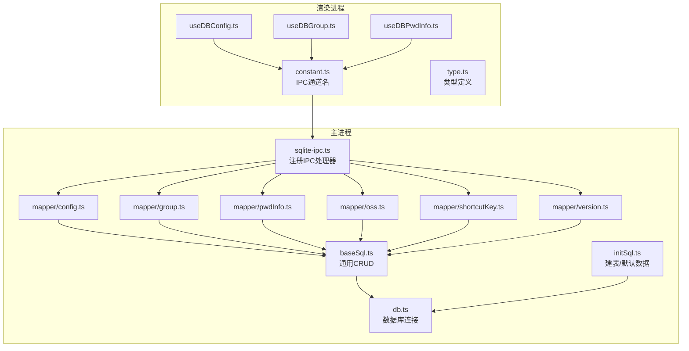
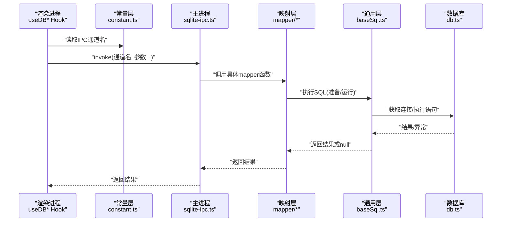
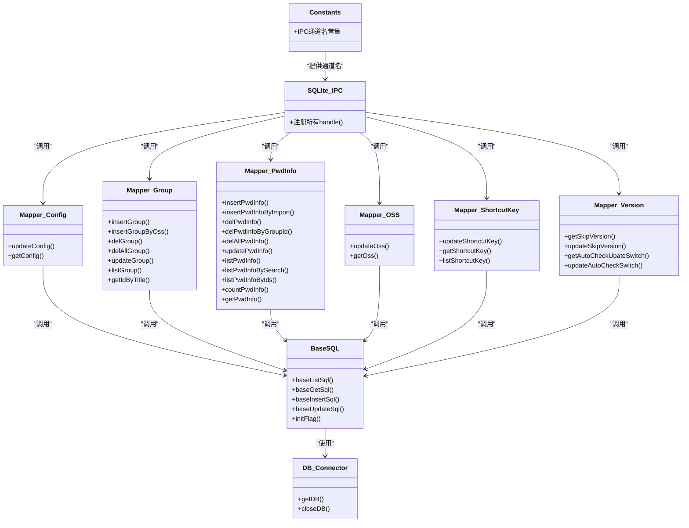

# 数据库API

<cite>
**本文引用的文件**
- [electron/db/sqlite/components/db.ts](file://electron/db/sqlite/components/db.ts)
- [electron/db/sqlite/components/baseSql.ts](file://electron/db/sqlite/components/baseSql.ts)
- [electron/db/sqlite/components/initSql.ts](file://electron/db/sqlite/components/initSql.ts)
- [electron/db/sqlite/components/configConstants.ts](file://electron/db/sqlite/components/configConstants.ts)
- [electron/db/sqlite/mapper/config.ts](file://electron/db/sqlite/mapper/config.ts)
- [electron/db/sqlite/mapper/group.ts](file://electron/db/sqlite/mapper/group.ts)
- [electron/db/sqlite/mapper/pwdInfo.ts](file://electron/db/sqlite/mapper/pwdInfo.ts)
- [electron/db/sqlite/mapper/oss.ts](file://electron/db/sqlite/mapper/oss.ts)
- [electron/db/sqlite/mapper/shortcutKey.ts](file://electron/db/sqlite/mapper/shortcutKey.ts)
- [electron/db/sqlite/mapper/version.ts](file://electron/db/sqlite/mapper/version.ts)
- [electron/db/sqlite/sqlite-ipc.ts](file://electron/db/sqlite/sqlite-ipc.ts)
- [electron/constant.ts](file://electron/constant.ts)
- [src/components/type.ts](file://src/components/type.ts)
- [src/hooks/useDBConfig.ts](file://src/hooks/useDBConfig.ts)
- [src/hooks/useDBGroup.ts](file://src/hooks/useDBGroup.ts)
- [src/hooks/useDBPwdInfo.ts](file://src/hooks/useDBPwdInfo.ts)
</cite>

## 目录
1. [简介](#简介)
2. [项目结构](#项目结构)
3. [核心组件](#核心组件)
4. [架构总览](#架构总览)
5. [详细组件分析](#详细组件分析)
6. [依赖关系分析](#依赖关系分析)
7. [性能与并发](#性能与并发)
8. [故障排查指南](#故障排查指南)
9. [结论](#结论)
10. [附录：API清单与调用示例](#附录api清单与调用示例)

## 简介
本文件系统性梳理密码管理器的数据库API，覆盖以下主题：
- 数据库初始化与表结构
- 配置信息管理API（config）
- 分组数据管理API（group）
- 密码信息管理API（pwd_info）
- OSS配置管理API（oss）
- 快捷键配置管理API（shortcut_key）
- 更新版本开关API（update_version）
- IPC接口与前端Hook调用方式
- SQL查询语句、参数规范、返回值格式、错误处理机制
- 事务处理、并发控制与性能优化策略

## 项目结构
数据库层采用Electron主进程中的SQLite（better-sqlite3）实现，通过IPC在渲染进程调用。核心目录与职责如下：
- 组件层：db.ts（连接）、baseSql.ts（通用CRUD）、initSql.ts（建表与默认数据）、configConstants.ts（配置常量）
- 映射层：mapper/*（各业务表的SQL封装）
- IPC层：sqlite-ipc.ts（注册IPC处理器）
- 常量层：constant.ts（IPC通道名）
- 类型层：src/components/type.ts（接口类型）
- 前端Hook：src/hooks/*（封装IPC调用）

图表来源
- [electron/db/sqlite/components/db.ts:1-30](file://electron/db/sqlite/components/db.ts#L1-L30)
- [electron/db/sqlite/components/baseSql.ts:1-87](file://electron/db/sqlite/components/baseSql.ts#L1-L87)
- [electron/db/sqlite/components/initSql.ts:1-224](file://electron/db/sqlite/components/initSql.ts#L1-L224)
- [electron/db/sqlite/sqlite-ipc.ts:1-220](file://electron/db/sqlite/sqlite-ipc.ts#L1-L220)
- [electron/constant.ts:1-63](file://electron/constant.ts#L1-L63)
- [src/hooks/useDBConfig.ts:1-21](file://src/hooks/useDBConfig.ts#L1-L21)
- [src/hooks/useDBGroup.ts:1-53](file://src/hooks/useDBGroup.ts#L1-L53)
- [src/hooks/useDBPwdInfo.ts:1-103](file://src/hooks/useDBPwdInfo.ts#L1-L103)
- [src/components/type.ts:1-88](file://src/components/type.ts#L1-L88)

章节来源
- [electron/db/sqlite/components/db.ts:1-30](file://electron/db/sqlite/components/db.ts#L1-L30)
- [electron/db/sqlite/components/baseSql.ts:1-87](file://electron/db/sqlite/components/baseSql.ts#L1-L87)
- [electron/db/sqlite/components/initSql.ts:1-224](file://electron/db/sqlite/components/initSql.ts#L1-L224)
- [electron/db/sqlite/sqlite-ipc.ts:1-220](file://electron/db/sqlite/sqlite-ipc.ts#L1-L220)
- [electron/constant.ts:1-63](file://electron/constant.ts#L1-L63)
- [src/hooks/useDBConfig.ts:1-21](file://src/hooks/useDBConfig.ts#L1-L21)
- [src/hooks/useDBGroup.ts:1-53](file://src/hooks/useDBGroup.ts#L1-L53)
- [src/hooks/useDBPwdInfo.ts:1-103](file://src/hooks/useDBPwdInfo.ts#L1-L103)
- [src/components/type.ts:1-88](file://src/components/type.ts#L1-L88)

## 核心组件
- 数据库连接与生命周期
  - 单例连接：db.ts提供getDB/closeDB，确保全局唯一连接；数据库路径位于用户数据目录下。
- 通用SQL封装
  - baseSql.ts提供baseListSql、baseGetSql、baseInsertSql、baseUpdateSql、initFlag等方法，统一异常处理与返回值约定。
- 初始化流程
  - initSql.ts负责建表、默认数据插入（config、shortcut_key、group、pwd_info、oss、update_version），并在首次启动时检测表存在性。

章节来源
- [electron/db/sqlite/components/db.ts:1-30](file://electron/db/sqlite/components/db.ts#L1-L30)
- [electron/db/sqlite/components/baseSql.ts:1-87](file://electron/db/sqlite/components/baseSql.ts#L1-L87)
- [electron/db/sqlite/components/initSql.ts:1-224](file://electron/db/sqlite/components/initSql.ts#L1-L224)

## 架构总览
渲染进程通过IPC通道调用主进程的SQLite接口，主进程在sqlite-ipc.ts中注册对应handle，映射到mapper层具体SQL操作。

图表来源
- [electron/db/sqlite/sqlite-ipc.ts:1-220](file://electron/db/sqlite/sqlite-ipc.ts#L1-L220)
- [electron/db/sqlite/components/baseSql.ts:1-87](file://electron/db/sqlite/components/baseSql.ts#L1-L87)
- [electron/db/sqlite/components/db.ts:1-30](file://electron/db/sqlite/components/db.ts#L1-L30)
- [electron/constant.ts:1-63](file://electron/constant.ts#L1-L63)
- [src/hooks/useDBConfig.ts:1-21](file://src/hooks/useDBConfig.ts#L1-L21)
- [src/hooks/useDBGroup.ts:1-53](file://src/hooks/useDBGroup.ts#L1-L53)
- [src/hooks/useDBPwdInfo.ts:1-103](file://src/hooks/useDBPwdInfo.ts#L1-L103)

## 详细组件分析

### 配置信息管理API（config）
- 接口职责
  - 更新配置项：根据code更新value
  - 查询配置项：按code查询value
- 参数规范
  - 更新：value（字符串）、code（字符串）
  - 查询：code（字符串）
- 返回值格式
  - 更新：无直接返回（内部返回1/0表示成功/失败）
  - 查询：Config对象（包含id、code、value）
- SQL查询语句
  - 更新：UPDATE "config" SET value=? WHERE code=?
  - 查询：SELECT value FROM "config" WHERE code=?
- 错误处理
  - 通用层捕获异常并返回null或0，上层需判空
- 典型调用
  - 渲染进程通过useDBConfig.ts的setConfigValue/getConfigValue封装IPC调用

章节来源
- [electron/db/sqlite/mapper/config.ts:1-27](file://electron/db/sqlite/mapper/config.ts#L1-L27)
- [electron/db/sqlite/components/baseSql.ts:1-87](file://electron/db/sqlite/components/baseSql.ts#L1-L87)
- [src/hooks/useDBConfig.ts:1-21](file://src/hooks/useDBConfig.ts#L1-L21)
- [src/components/type.ts:31-38](file://src/components/type.ts#L31-L38)

### 分组数据管理API（group）
- 接口职责
  - 新增分组（本地/从OSS导入）
  - 删除分组（单个/全部）
  - 更新分组名称
  - 查询分组列表
  - 根据标题获取ID
- 参数规范
  - 新增（本地）：title（字符串）、father_id（数字）
  - 新增（OSS）：id（数字）、title（字符串）、father_id（数字）
  - 删除：id（数字）
  - 更新：title（字符串）、id（数字）
  - 查询列表：无
  - 根据标题：title（字符串）
- 返回值格式
  - 新增：返回最后插入行ID（数字）
  - 删除/更新：无直接返回（内部返回1/0）
  - 查询列表：PwdGroup[]（包含id、title、father_id、editFlag等）
  - 根据标题：id（数字）
- SQL查询语句
  - 新增（本地）：INSERT INTO "group"(title,father_id) VALUES (?,?)
  - 新增（OSS）：INSERT INTO "group"(id,title,father_id) VALUES (?,?,?)
  - 删除：DELETE FROM "group" WHERE id=?
  - 删除全部：DELETE FROM "group"
  - 更新：UPDATE "group" SET title=? WHERE id=?
  - 查询列表：SELECT * FROM "group"
  - 根据标题：SELECT id FROM "group" WHERE title=?
- 错误处理
  - 通用层捕获异常并返回null或0，上层需判空
- 典型调用
  - 渲染进程通过useDBGroup.ts封装IPC调用

章节来源
- [electron/db/sqlite/mapper/group.ts:1-49](file://electron/db/sqlite/mapper/group.ts#L1-L49)
- [electron/db/sqlite/components/baseSql.ts:1-87](file://electron/db/sqlite/components/baseSql.ts#L1-L87)
- [src/hooks/useDBGroup.ts:1-53](file://src/hooks/useDBGroup.ts#L1-L53)
- [src/components/type.ts:76-88](file://src/components/type.ts#L76-L88)

### 密码信息管理API（pwd_info）
- 接口职责
  - 新增密码条目（本地/导入）
  - 删除密码条目（单个/按分组/全部）
  - 更新密码条目
  - 查询列表（按分组/全量）
  - 搜索（按标题/用户名）
  - 按ID集合查询
  - 计数（按分组）
  - 获取单条详情
- 参数规范
  - 新增（本地）：group_id（数字）、group_title（字符串）
  - 新增（导入）：group_id、group_title、title、username、password、link、remark
  - 删除：id（数字）
  - 删除（按分组）：group_id（数字）
  - 删除（全部）：无
  - 更新：group_id、group_title、title、username、password、link、remark、id
  - 查询列表：groupId（数字，可选）
  - 搜索：searchValue（字符串）
  - 按ID集合：ids（数字数组）
  - 计数：groupId（字符串）
  - 获取详情：id（数字）
- 返回值格式
  - 新增：返回最后插入行ID（数字）
  - 删除/更新：无直接返回（内部返回1/0）
  - 查询列表：PwdInfo[]（包含id、group_id、group_title、title、username、password、link、remark）
  - 搜索：PwdInfo[]
  - 按ID集合：PwdInfo[]
  - 计数：count（数字）
  - 获取详情：PwdInfo
- SQL查询语句
  - 新增（本地）：INSERT INTO "pwd_info"(group_id,group_title) VALUES (?,?)
  - 新增（导入）：INSERT INTO "pwd_info"(group_id,group_title,title,username,password,link,remark) VALUES (?,?,?,?,?,?,?)
  - 删除：DELETE FROM "pwd_info" WHERE id=?
  - 删除（按分组）：DELETE FROM "pwd_info" WHERE group_id=?
  - 删除（全部）：DELETE FROM "pwd_info"
  - 更新：UPDATE "pwd_info" SET group_id=?,group_title=?,title=?,username=?,password=?,link=?,remark=? WHERE id=?
  - 查询列表（按分组）：SELECT * FROM "pwd_info" WHERE group_id=?
  - 查询列表（全量）：SELECT * FROM "pwd_info"
  - 搜索：SELECT * FROM "pwd_info" WHERE title like '%'||?||'%'
  - 搜索（用户名）：or username like '%' || ? || '%'
  - 按ID集合：SELECT * FROM "pwd_info" WHERE id IN (...)
  - 计数：SELECT count(*) as count FROM "pwd_info" WHERE group_id=?
  - 获取详情：SELECT * FROM "pwd_info" WHERE id=?
- 错误处理
  - 通用层捕获异常并返回null或0，上层需判空
- 性能与安全
  - 搜索使用like模糊匹配，建议在大量数据时考虑索引或分页
  - 密码字段在导入/更新时进行加密处理，查询后解密
- 典型调用
  - 渲染进程通过useDBPwdInfo.ts封装IPC调用，并在导入/更新时进行加解密

章节来源
- [electron/db/sqlite/mapper/pwdInfo.ts:1-100](file://electron/db/sqlite/mapper/pwdInfo.ts#L1-L100)
- [electron/db/sqlite/components/baseSql.ts:1-87](file://electron/db/sqlite/components/baseSql.ts#L1-L87)
- [src/hooks/useDBPwdInfo.ts:1-103](file://src/hooks/useDBPwdInfo.ts#L1-L103)
- [src/components/type.ts:50-67](file://src/components/type.ts#L50-L67)

### OSS配置管理API（oss）
- 接口职责
  - 更新OSS配置（按type）
  - 查询OSS配置（按type）
- 参数规范
  - 更新：region、keyId、key_secret、bucket、type
  - 查询：type
- 返回值格式
  - 更新：无直接返回（内部返回1/0）
  - 查询：OssForm对象（包含id、type、region、keyId、key_secret、bucket）
- SQL查询语句
  - 更新：UPDATE "oss" SET region=?,keyId=?,key_secret=?,bucket=? WHERE type=?
  - 查询：SELECT * FROM "oss" WHERE type=?
- 错误处理
  - 通用层捕获异常并返回null或0，上层需判空
- 典型调用
  - 渲染进程通过useDBConfig.ts等Hook封装IPC调用

章节来源
- [electron/db/sqlite/mapper/oss.ts:1-30](file://electron/db/sqlite/mapper/oss.ts#L1-L30)
- [electron/db/sqlite/components/baseSql.ts:1-87](file://electron/db/sqlite/components/baseSql.ts#L1-L87)
- [src/components/type.ts:9-17](file://src/components/type.ts#L9-L17)

### 快捷键配置管理API（shortcut_key）
- 接口职责
  - 更新快捷键描述（按action_name）
  - 查询快捷键描述（按action_name）
  - 查询全部快捷键
- 参数规范
  - 更新：desc（字符串）、action_name（字符串）
  - 查询单个：actionName（字符串）
  - 查询全部：无
- 返回值格式
  - 更新：无直接返回（内部返回1/0）
  - 查询单个：ShortCutKeyComb对象（包含action_name、desc等）
  - 查询全部：ShortCutKeyComb[]
- SQL查询语句
  - 更新：UPDATE "shortcut_key" SET desc=? WHERE action_name=?
  - 查询单个：SELECT desc FROM "shortcut_key" WHERE action_name=?
  - 查询全部：SELECT * FROM "shortcut_key"
- 错误处理
  - 通用层捕获异常并返回null或0，上层需判空
- 典型调用
  - 渲染进程通过useDBGroup.ts等Hook封装IPC调用

章节来源
- [electron/db/sqlite/mapper/shortcutKey.ts:1-32](file://electron/db/sqlite/mapper/shortcutKey.ts#L1-L32)
- [electron/db/sqlite/components/baseSql.ts:1-87](file://electron/db/sqlite/components/baseSql.ts#L1-L87)
- [src/components/type.ts:19-29](file://src/components/type.ts#L19-L29)

### 更新版本开关API（update_version）
- 接口职责
  - 查询跳过版本
  - 更新跳过版本
  - 查询自动检查更新开关
  - 更新自动检查开关
- 参数规范
  - 更新跳过版本：skip_version（字符串）
  - 更新自动检查开关：auto_check_switch（字符串）
  - 查询：无
- 返回值格式
  - 查询：UpdateVersion对象（包含skip_version、auto_check_switch等）
  - 更新：无直接返回（内部返回1/0）
- SQL查询语句
  - 查询跳过版本：SELECT skip_version FROM "update_version"
  - 更新跳过版本：UPDATE "update_version" SET skip_version=?
  - 查询自动检查开关：SELECT auto_check_switch FROM "update_version"
  - 更新自动检查开关：UPDATE "update_version" SET auto_check_switch=?
- 错误处理
  - 通用层捕获异常并返回null或0，上层需判空

章节来源
- [electron/db/sqlite/mapper/version.ts:1-38](file://electron/db/sqlite/mapper/version.ts#L1-L38)
- [electron/db/sqlite/components/baseSql.ts:1-87](file://electron/db/sqlite/components/baseSql.ts#L1-L87)
- [src/components/type.ts:39-47](file://src/components/type.ts#L39-L47)

## 依赖关系分析

图表来源
- [electron/db/sqlite/components/db.ts:1-30](file://electron/db/sqlite/components/db.ts#L1-L30)
- [electron/db/sqlite/components/baseSql.ts:1-87](file://electron/db/sqlite/components/baseSql.ts#L1-L87)
- [electron/db/sqlite/sqlite-ipc.ts:1-220](file://electron/db/sqlite/sqlite-ipc.ts#L1-L220)
- [electron/constant.ts:1-63](file://electron/constant.ts#L1-L63)
- [electron/db/sqlite/mapper/config.ts:1-27](file://electron/db/sqlite/mapper/config.ts#L1-L27)
- [electron/db/sqlite/mapper/group.ts:1-49](file://electron/db/sqlite/mapper/group.ts#L1-L49)
- [electron/db/sqlite/mapper/pwdInfo.ts:1-100](file://electron/db/sqlite/mapper/pwdInfo.ts#L1-L100)
- [electron/db/sqlite/mapper/oss.ts:1-30](file://electron/db/sqlite/mapper/oss.ts#L1-L30)
- [electron/db/sqlite/mapper/shortcutKey.ts:1-32](file://electron/db/sqlite/mapper/shortcutKey.ts#L1-L32)
- [electron/db/sqlite/mapper/version.ts:1-38](file://electron/db/sqlite/mapper/version.ts#L1-L38)

## 性能与并发
- 连接与事务
  - 单例连接：避免频繁打开/关闭连接带来的开销
  - 事务封装：通用层提供事务使用示例（注释），可在批量插入等场景使用事务提升性能并保证一致性
- 并发控制
  - better-sqlite3为同步API，不支持多线程并发写入；建议通过IPC串行化请求，避免同时写入
- 性能优化
  - 搜索：对高频搜索字段建立索引可显著提升性能（如title、username）
  - 批量操作：使用事务包裹多次INSERT/UPDATE
  - 分页：大数据量查询建议分页加载
  - 缓存：前端使用缓存存储列表，减少重复查询

章节来源
- [electron/db/sqlite/components/baseSql.ts:52-65](file://electron/db/sqlite/components/baseSql.ts#L52-L65)
- [electron/db/sqlite/components/db.ts:16-30](file://electron/db/sqlite/components/db.ts#L16-L30)

## 故障排查指南
- 常见问题
  - 查询返回null：可能是SQL异常或未找到数据，需检查参数与表结构
  - 更新/删除返回0：表示执行异常或无影响行，需检查条件与参数
  - IPC调用无响应：确认通道名一致且主进程已注册handle
- 定位步骤
  - 查看主进程日志（通用层有SQL与参数打印）
  - 检查数据库文件是否存在与可访问
  - 确认IPC通道名与调用方一致
- 建议
  - 在渲染进程对返回值进行判空处理
  - 对关键路径增加重试与降级逻辑

章节来源
- [electron/db/sqlite/components/baseSql.ts:12-31](file://electron/db/sqlite/components/baseSql.ts#L12-L31)
- [electron/db/sqlite/components/baseSql.ts:67-81](file://electron/db/sqlite/components/baseSql.ts#L67-L81)
- [electron/db/sqlite/sqlite-ipc.ts:58-220](file://electron/db/sqlite/sqlite-ipc.ts#L58-L220)

## 结论
该数据库API以better-sqlite3为核心，通过IPC在渲染进程安全调用。通用层提供统一的CRUD封装与异常处理，映射层聚焦各业务表的SQL实现。建议在生产环境中：
- 使用事务处理批量写入
- 为高频查询字段建立索引
- 严格判空与错误处理
- 通过缓存与分页优化用户体验

## 附录：API清单与调用示例

- 配置信息管理
  - 更新配置：IPC通道名 IPC_SQLITE_UPDATE_CONFIG_DATA，参数 value, code；返回无（内部返回1/0）
  - 查询配置：IPC通道名 IPC_SQLITE_SELECT_CONFIG_DATA，参数 code；返回 Config 对象
  - 示例调用：参考 [useDBConfig.ts:1-21](file://src/hooks/useDBConfig.ts#L1-L21)

- 分组数据管理
  - 新增分组（本地）：IPC通道名 IPC_SQLITE_INSERT_GROUP_DATA，参数 title, father_id；返回 lastInsertRowid
  - 新增分组（OSS）：IPC通道名 IPC_SQLITE_INSERT_OSS_GROUP_DATA，参数 id, title, father_id；返回 lastInsertRowid
  - 删除分组：IPC通道名 IPC_SQLITE_DELETE_GROUP_DATA，参数 id；返回无（内部返回1/0）
  - 删除全部分组：IPC通道名 IPC_SQLITE_DELETE_ALL_GROUP_DATA；返回无（内部返回1/0）
  - 更新分组：IPC通道名 IPC_SQLITE_UPDATE_GROUP_DATA，参数 title, id；返回无（内部返回1/0）
  - 查询分组列表：IPC通道名 IPC_SQLITE_SELECT_GROUP_DATA；返回 PwdGroup[]
  - 根据标题获取ID：IPC通道名 IPC_SQLITE_GET_ID_GROUP_DATA，参数 title；返回 id
  - 示例调用：参考 [useDBGroup.ts:1-53](file://src/hooks/useDBGroup.ts#L1-L53)

- 密码信息管理
  - 新增密码（本地）：IPC通道名 IPC_SQLITE_INSERT_PWD_INFO_DATA，参数 group_id, group_title；返回 lastInsertRowid
  - 新增密码（导入）：IPC通道名 IPC_SQLITE_INSERT_BY_IMPORT_PWD_INFO_DATA，参数 group_id, group_title, title, username, password, link, remark；返回 lastInsertRowid
  - 删除密码（单个）：IPC通道名 IPC_SQLITE_DELETE_PWD_INFO_DATA，参数 id；返回无（内部返回1/0）
  - 删除密码（按分组）：IPC通道名 IPC_SQLITE_DELETE_ALL_PWD_INFO_BY_GROUP_ID，参数 group_id；返回无（内部返回1/0）
  - 删除全部密码：IPC通道名 IPC_SQLITE_DELETE_ALL_PWD_INFO_DATA；返回无（内部返回1/0）
  - 更新密码：IPC通道名 IPC_SQLITE_UPDATE_PWD_INFO_DATA，参数 group_id, group_title, title, username, password, link, remark, id；返回无（内部返回1/0）
  - 查询列表（按分组）：IPC通道名 IPC_SQLITE_SELECT_LIST_PWD_INFO_DATA，参数 group_id；返回 PwdInfo[]
  - 查询详情：IPC通道名 IPC_SQLITE_SELECT_GET_PWD_INFO_DATA，参数 id；返回 PwdInfo
  - 搜索（标题/用户名）：IPC通道名 IPC_SQLITE_SELECT_SEARCH_PWD_INFO_DATA，参数 searchValue；返回 PwdInfo[]
  - 按ID集合查询：IPC通道名 IPC_SQLITE_SELECT_SEARCH_PWD_INFO_DATA_IDS，参数 ids；返回 PwdInfo[]
  - 计数（按分组）：IPC通道名 IPC_SQLITE_SELECT_COUNT_PWD_INFO_DATA，参数 group_id；返回 count
  - 示例调用：参考 [useDBPwdInfo.ts:1-103](file://src/hooks/useDBPwdInfo.ts#L1-L103)

- OSS配置管理
  - 更新OSS：IPC通道名 IPC_SQLITE_UPDATE_OSS_DATA，参数 region, keyId, key_secret, bucket, type；返回无（内部返回1/0）
  - 查询OSS：IPC通道名 IPC_SQLITE_SELECT_OSS_DATA，参数 type；返回 OssForm
  - 示例调用：参考 [useDBConfig.ts:1-21](file://src/hooks/useDBConfig.ts#L1-L21)

- 快捷键配置管理
  - 更新快捷键：IPC通道名 IPC_SQLITE_UPDATE_SHORTCUT_KEY_DATA，参数 desc, action_name；返回无（内部返回1/0）
  - 查询快捷键：IPC通道名 IPC_SQLITE_SELECT_SHORTCUT_KEY_DATA；返回 ShortCutKeyComb[]
  - 示例调用：参考 [useDBGroup.ts:1-53](file://src/hooks/useDBGroup.ts#L1-L53)

- 更新版本开关
  - 查询跳过版本：IPC通道名 AUTO_CHECK_UPDATE_SWITCH_SELECT；返回 UpdateVersion
  - 更新跳过版本：IPC通道名 AUTO_UPDATE_SWITCH_UPDATE，参数 skip_version；返回无（内部返回1/0）
  - 示例调用：参考 [sqlite-ipc.ts:58-68](file://electron/db/sqlite/sqlite-ipc.ts#L58-L68)

- 数据库初始化
  - 初始化表结构：initTable → createTable → insertData → 各默认数据插入
  - 参考文件：[initSql.ts:26-143](file://electron/db/sqlite/components/initSql.ts#L26-L143)，[configConstants.ts:1-29](file://electron/db/sqlite/components/configConstants.ts#L1-L29)

- IPC通道名一览
  - 参考文件：[constant.ts:12-63](file://electron/constant.ts#L12-L63)