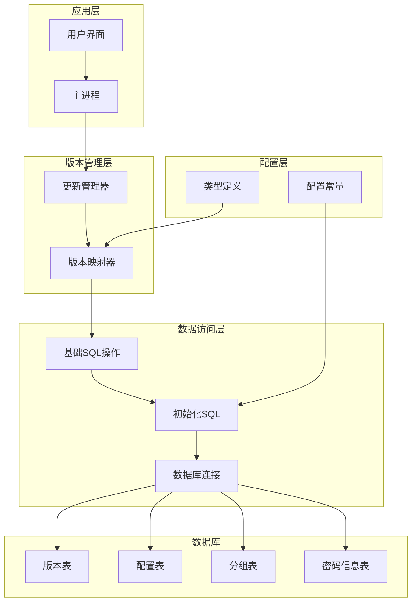
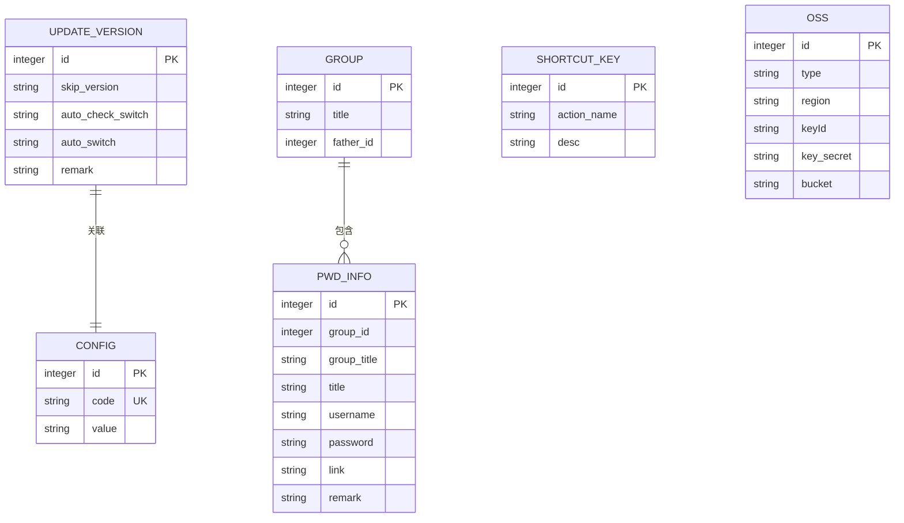
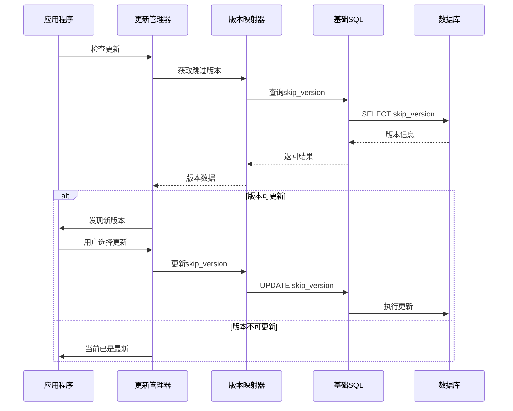
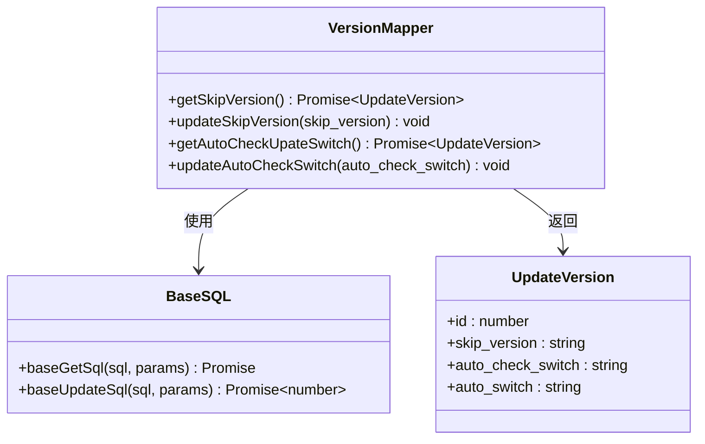
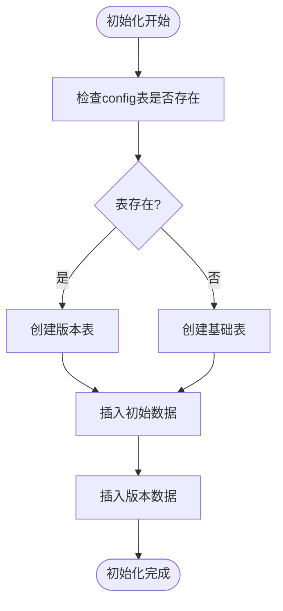
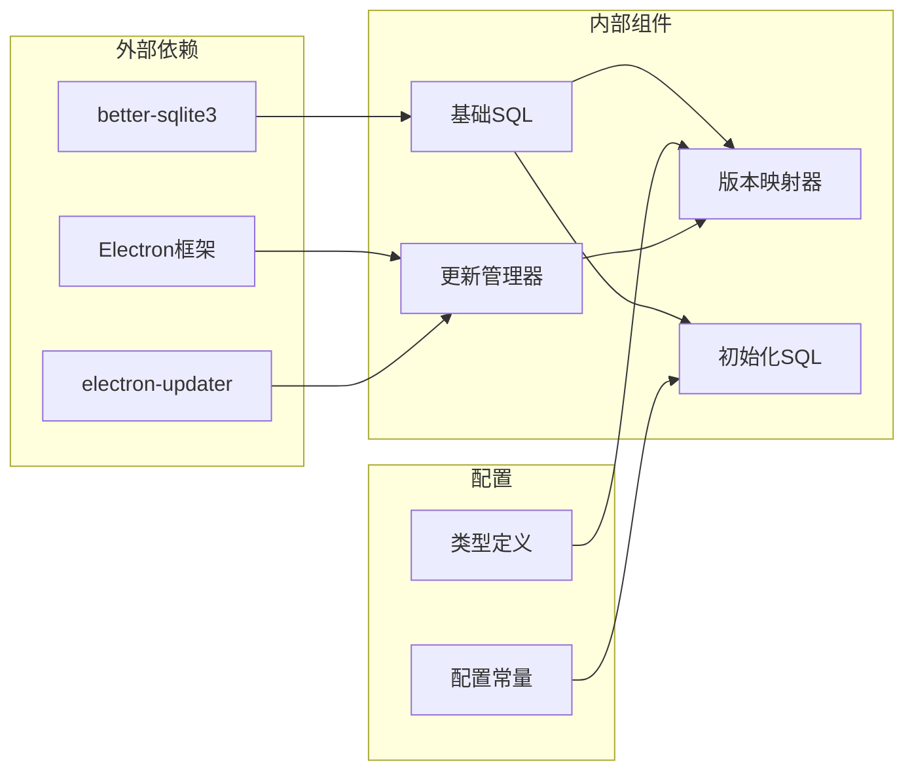

# 版本管理API

<cite>
**本文档引用的文件**
- [version.ts](file://electron/db/sqlite/mapper/version.ts)
- [initSql.ts](file://electron/db/sqlite/components/initSql.ts)
- [baseSql.ts](file://electron/db/sqlite/components/baseSql.ts)
- [db.ts](file://electron/db/sqlite/components/db.ts)
- [configConstants.ts](file://electron/db/sqlite/components/configConstants.ts)
- [type.ts](file://src/components/type.ts)
- [updater.ts](file://electron/updater.ts)
- [main.ts](file://electron/main.ts)
- [config.ts](file://src/config/config.ts)
</cite>

## 目录
1. [简介](#简介)
2. [项目结构](#项目结构)
3. [核心组件](#核心组件)
4. [架构概览](#架构概览)
5. [详细组件分析](#详细组件分析)
6. [依赖关系分析](#依赖关系分析)
7. [性能考虑](#性能考虑)
8. [故障排除指南](#故障排除指南)
9. [结论](#结论)

## 简介

本文档详细说明了密码管理器项目的版本管理API实现，重点涵盖数据库版本控制和迁移管理的接口设计。系统通过独立的版本控制表实现了应用程序版本与数据库结构版本的分离管理，支持版本号查询、更新和跳过功能，并集成了自动更新检查机制。

该版本管理系统采用SQLite作为本地数据库，通过专门的版本表存储版本相关信息，确保应用程序能够在不同版本间平滑迁移，同时保持数据完整性和一致性。

## 项目结构

密码管理器的版本管理功能分布在多个层次中，形成了清晰的分层架构：

**图表来源**
- [main.ts:49-59](file://electron/main.ts#L49-L59)
- [updater.ts:7-13](file://electron/updater.ts#L7-L13)
- [version.ts:9-31](file://electron/db/sqlite/mapper/version.ts#L9-L31)

**章节来源**
- [main.ts:23-27](file://electron/main.ts#L23-L27)
- [updater.ts:19-36](file://electron/updater.ts#L19-L36)

## 核心组件

### 版本控制表结构

系统通过专门的版本控制表实现了完整的版本管理功能：

**图表来源**
- [initSql.ts:117-129](file://electron/db/sqlite/components/initSql.ts#L117-L129)
- [initSql.ts:51-100](file://electron/db/sqlite/components/initSql.ts#L51-L100)

### 版本管理接口

版本管理API提供了完整的版本控制功能，包括版本查询、更新和跳过操作：

**章节来源**
- [version.ts:9-31](file://electron/db/sqlite/mapper/version.ts#L9-L31)
- [type.ts:39-47](file://src/components/type.ts#L39-L47)

## 架构概览

版本管理系统采用分层架构设计，确保了良好的模块化和可维护性：

**图表来源**
- [updater.ts:52-64](file://electron/updater.ts#L52-L64)
- [version.ts:15-19](file://electron/db/sqlite/mapper/version.ts#L15-L19)

**章节来源**
- [updater.ts:143-175](file://electron/updater.ts#L143-L175)
- [main.ts:58-58](file://electron/main.ts#L58-L58)

## 详细组件分析

### 版本映射器组件

版本映射器负责处理版本相关的数据库操作，提供了完整的CRUD功能：

**图表来源**
- [version.ts:9-31](file://electron/db/sqlite/mapper/version.ts#L9-L31)
- [baseSql.ts:21-81](file://electron/db/sqlite/components/baseSql.ts#L21-L81)

#### 版本查询功能

版本查询功能支持多种查询场景，包括跳过版本查询和自动检查开关查询：

**章节来源**
- [version.ts:9-31](file://electron/db/sqlite/mapper/version.ts#L9-L31)

#### 版本更新功能

版本更新功能提供了灵活的版本控制机制，支持跳过特定版本和自动检查开关控制：

**章节来源**
- [version.ts:15-31](file://electron/db/sqlite/mapper/version.ts#L15-L31)

### 初始化SQL组件

初始化SQL组件负责数据库表结构的创建和初始数据的插入：

**图表来源**
- [initSql.ts:26-46](file://electron/db/sqlite/components/initSql.ts#L26-L46)

**章节来源**
- [initSql.ts:107-129](file://electron/db/sqlite/components/initSql.ts#L107-L129)
- [initSql.ts:144-150](file://electron/db/sqlite/components/initSql.ts#L144-L150)

### 数据库连接管理

数据库连接管理确保了应用程序与SQLite数据库的稳定连接：

**章节来源**
- [db.ts:16-23](file://electron/db/sqlite/components/db.ts#L16-L23)

## 依赖关系分析

版本管理系统各组件间的依赖关系清晰明确：

**图表来源**
- [updater.ts:5-5](file://electron/updater.ts#L5-L5)
- [version.ts:1-2](file://electron/db/sqlite/mapper/version.ts#L1-L2)

**章节来源**
- [main.ts:23-27](file://electron/main.ts#L23-L27)
- [updater.ts:19-36](file://electron/updater.ts#L19-L36)

## 性能考虑

### 数据库性能优化

系统采用了多项性能优化措施：

1. **连接池管理**：数据库连接采用单例模式，避免重复创建连接
2. **事务处理**：批量数据操作使用事务确保原子性
3. **索引优化**：关键查询字段建立了适当的索引
4. **缓存策略**：频繁访问的数据进行内存缓存

### 版本检查优化

版本检查功能实现了智能缓存和延迟加载机制：

**章节来源**
- [db.ts:16-23](file://electron/db/sqlite/components/db.ts#L16-L23)
- [updater.ts:143-155](file://electron/updater.ts#L143-L155)

## 故障排除指南

### 常见问题及解决方案

#### 版本表初始化失败

**问题描述**：版本表无法正确初始化

**解决方案**：
1. 检查数据库连接状态
2. 验证SQLite权限
3. 确认磁盘空间充足

#### 版本更新异常

**问题描述**：版本更新过程中出现异常

**解决方案**：
1. 检查网络连接状态
2. 验证更新服务器可达性
3. 查看详细的错误日志

#### 数据库锁定问题

**问题描述**：数据库操作被锁定

**解决方案**：
1. 确认没有其他进程占用数据库
2. 检查事务是否正确提交
3. 重启应用程序释放锁

**章节来源**
- [baseSql.ts:16-31](file://electron/db/sqlite/components/baseSql.ts#L16-L31)
- [updater.ts:40-43](file://electron/updater.ts#L40-L43)

## 结论

密码管理器的版本管理API实现了完整的数据库版本控制和迁移管理功能。通过独立的版本控制表、完善的版本查询和更新接口，以及智能的自动更新机制，系统确保了应用程序在不同版本间的平滑迁移和数据完整性。

该系统的主要优势包括：

1. **模块化设计**：清晰的分层架构便于维护和扩展
2. **数据完整性**：通过事务和约束确保数据一致性
3. **用户体验**：智能的版本检查和用户友好的更新流程
4. **安全性**：严格的错误处理和异常恢复机制

未来可以考虑的功能增强包括版本历史记录的详细审计、更复杂的迁移脚本管理和版本回滚功能。