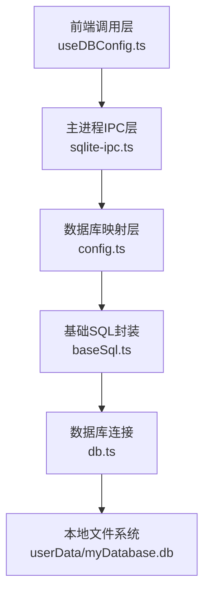
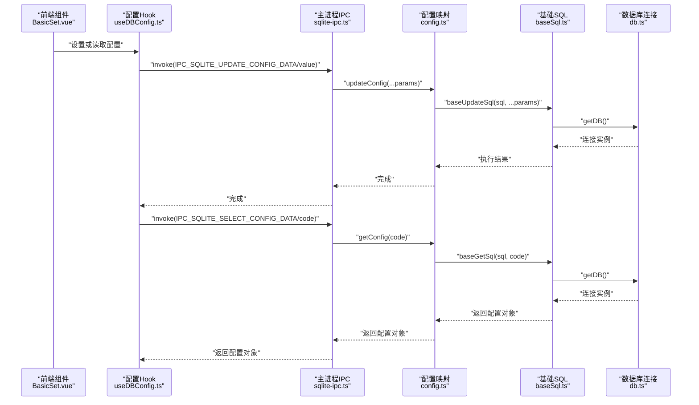
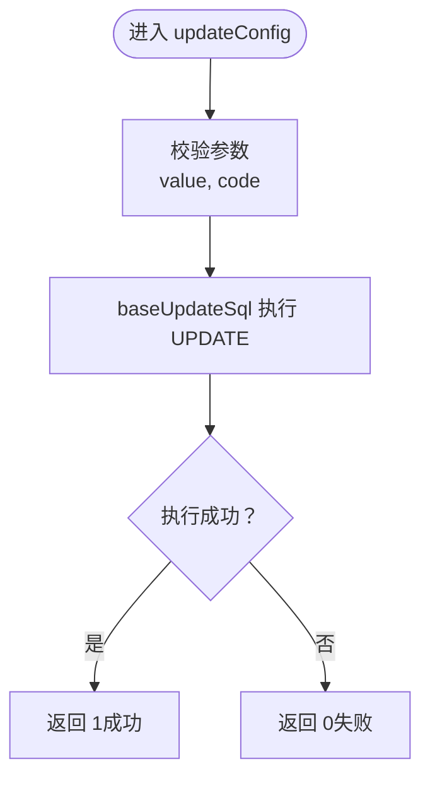
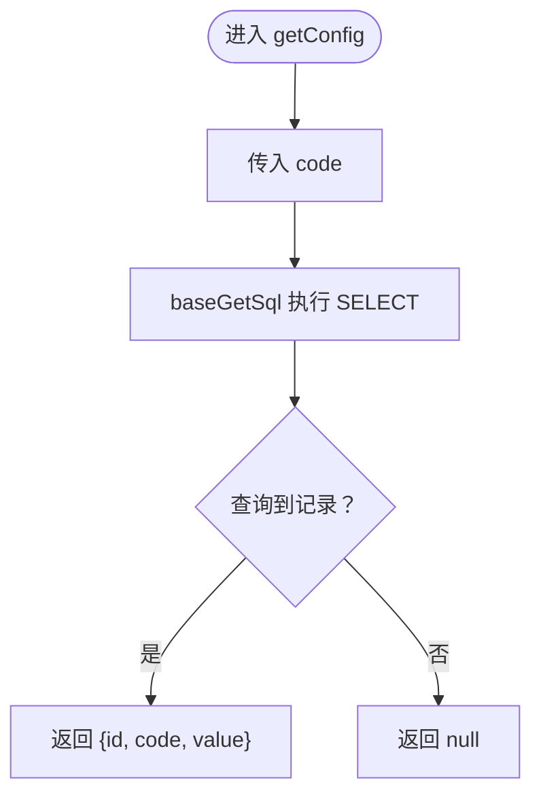
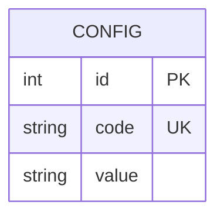
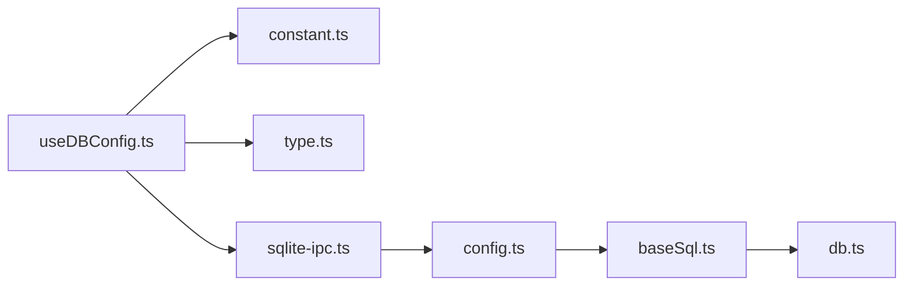

# 配置信息API

<cite>
**本文引用的文件**
- [config.ts](file://electron/db/sqlite/mapper/config.ts)
- [baseSql.ts](file://electron/db/sqlite/components/baseSql.ts)
- [db.ts](file://electron/db/sqlite/components/db.ts)
- [sqlite-ipc.ts](file://electron/db/sqlite/sqlite-ipc.ts)
- [configConstants.ts](file://electron/db/sqlite/components/configConstants.ts)
- [initSql.ts](file://electron/db/sqlite/components/initSql.ts)
- [type.ts](file://src/components/type.ts)
- [constant.ts](file://electron/constant.ts)
- [useDBConfig.ts](file://src/hooks/useDBConfig.ts)
- [BasicSet.vue](file://src/components/setview/BasicSet.vue)
</cite>

## 目录
1. [简介](#简介)
2. [项目结构](#项目结构)
3. [核心组件](#核心组件)
4. [架构总览](#架构总览)
5. [详细组件分析](#详细组件分析)
6. [依赖关系分析](#依赖关系分析)
7. [性能考虑](#性能考虑)
8. [故障排查指南](#故障排查指南)
9. [结论](#结论)
10. [附录](#附录)

## 简介
本文件面向“配置信息管理API”，聚焦于两个核心接口：updateConfig（更新配置）与getConfig（获取配置）。内容涵盖：
- 接口参数规范与返回值处理
- SQL执行逻辑与数据类型转换
- 配置项的存储格式与编码规则
- 调用示例（如何更新系统配置与获取配置）
- 配置缓存机制、并发访问控制与错误处理策略
- 配置项生命周期与版本控制机制

## 项目结构
配置子系统由三层组成：
- 前端调用层：通过 IPC 通道向主进程发起请求
- 主进程 IPC 层：注册并处理 IPC 事件，转发到数据库映射层
- 数据库映射层：封装 SQL 执行与基础事务/查询能力

图表来源
- [useDBConfig.ts:1-21](file://src/hooks/useDBConfig.ts#L1-L21)
- [sqlite-ipc.ts:84-95](file://electron/db/sqlite/sqlite-ipc.ts#L84-L95)
- [config.ts:8-20](file://electron/db/sqlite/mapper/config.ts#L8-L20)
- [baseSql.ts:9-32](file://electron/db/sqlite/components/baseSql.ts#L9-L32)
- [db.ts:16-23](file://electron/db/sqlite/components/db.ts#L16-L23)

章节来源
- [useDBConfig.ts:1-21](file://src/hooks/useDBConfig.ts#L1-L21)
- [sqlite-ipc.ts:84-95](file://electron/db/sqlite/sqlite-ipc.ts#L84-L95)
- [config.ts:8-20](file://electron/db/sqlite/mapper/config.ts#L8-L20)
- [baseSql.ts:9-32](file://electron/db/sqlite/components/baseSql.ts#L9-L32)
- [db.ts:16-23](file://electron/db/sqlite/components/db.ts#L16-L23)

## 核心组件
- updateConfig：接收可变参数，执行 UPDATE 语句按 code 更新 value
- getConfig：接收 code，执行 SELECT 查询返回配置对象
- baseGetSql/baseUpdateSql：封装查询/更新的异常捕获与返回值
- getDB：延迟初始化数据库连接，确保单例
- IPC 常量：定义 IPC 通道名，前端通过 window.ipcRenderer.invoke 调用

章节来源
- [config.ts:8-20](file://electron/db/sqlite/mapper/config.ts#L8-L20)
- [baseSql.ts:21-81](file://electron/db/sqlite/components/baseSql.ts#L21-L81)
- [db.ts:16-23](file://electron/db/sqlite/components/db.ts#L16-L23)
- [constant.ts:18-20](file://electron/constant.ts#L18-L20)

## 架构总览
下图展示了从前端到数据库的完整调用链路。

图表来源
- [useDBConfig.ts:6-18](file://src/hooks/useDBConfig.ts#L6-L18)
- [sqlite-ipc.ts:84-95](file://electron/db/sqlite/sqlite-ipc.ts#L84-L95)
- [config.ts:8-20](file://electron/db/sqlite/mapper/config.ts#L8-L20)
- [baseSql.ts:21-81](file://electron/db/sqlite/components/baseSql.ts#L21-L81)
- [db.ts:16-23](file://electron/db/sqlite/components/db.ts#L16-L23)

## 详细组件分析

### updateConfig 接口
- 参数规范
  - 可变参数：第一个为新值（字符串），第二个为配置键（字符串）
  - 对应 SQL：UPDATE "config" SET value = ? WHERE code = ?
- SQL 执行逻辑
  - 通过 baseUpdateSql 执行预编译语句
  - 返回 1 表示成功，异常时返回 0
- 返回值处理
  - 前端通常忽略返回值；若需确认，可基于异常捕获与日志判断
- 并发与错误
  - 单条 UPDATE 无显式锁；异常被捕获并记录，不影响上层流程

图表来源
- [config.ts:8-13](file://electron/db/sqlite/mapper/config.ts#L8-L13)
- [baseSql.ts:67-81](file://electron/db/sqlite/components/baseSql.ts#L67-L81)

章节来源
- [config.ts:8-13](file://electron/db/sqlite/mapper/config.ts#L8-L13)
- [baseSql.ts:67-81](file://electron/db/sqlite/components/baseSql.ts#L67-L81)

### getConfig 接口
- 参数规范
  - 必填：code（字符串）
  - 对应 SQL：SELECT value FROM "config" WHERE code = ?
- SQL 执行逻辑
  - 通过 baseGetSql 执行预编译语句，返回单行结果
- 返回值处理
  - 返回 Config 类型对象（包含 id、code、value）
  - 前端 Hook 中对空值进行兜底处理，返回空字符串
- 并发与错误
  - 单条 SELECT 无显式锁；异常被捕获并返回 null，前端再转为空字符串

图表来源
- [config.ts:15-20](file://electron/db/sqlite/mapper/config.ts#L15-L20)
- [baseSql.ts:21-32](file://electron/db/sqlite/components/baseSql.ts#L21-L32)
- [type.ts:31-38](file://src/components/type.ts#L31-L38)

章节来源
- [config.ts:15-20](file://electron/db/sqlite/mapper/config.ts#L15-L20)
- [baseSql.ts:21-32](file://electron/db/sqlite/components/baseSql.ts#L21-L32)
- [type.ts:31-38](file://src/components/type.ts#L31-L38)
- [useDBConfig.ts:6-13](file://src/hooks/useDBConfig.ts#L6-L13)

### 数据模型与存储格式
- 表结构
  - config 表：id（自增）、code（唯一）、value（文本）
- 编码规则
  - value 以 TEXT 存储，前端统一以字符串形式处理
  - 数值型配置在读取后需进行 parseInt/parseFloat 转换
- 类型转换
  - 前端 Hook 在读取主题开关等数值配置时进行整数转换
  - 建议在业务层对布尔/数值进行显式转换，避免隐式转换问题

图表来源
- [initSql.ts:74-81](file://electron/db/sqlite/components/initSql.ts#L74-L81)
- [type.ts:31-38](file://src/components/type.ts#L31-L38)

章节来源
- [initSql.ts:74-81](file://electron/db/sqlite/components/initSql.ts#L74-L81)
- [type.ts:31-38](file://src/components/type.ts#L31-L38)

### IPC 通道与调用示例
- 通道定义
  - IPC_SQLITE_UPDATE_CONFIG_DATA：更新配置
  - IPC_SQLITE_SELECT_CONFIG_DATA：获取配置
- 前端调用
  - 更新：window.ipcRenderer.invoke(IPC_SQLITE_UPDATE_CONFIG_DATA, value, code)
  - 获取：window.ipcRenderer.invoke(IPC_SQLITE_SELECT_CONFIG_DATA, code)
- 实际使用场景
  - BasicSet.vue 中的开关与输入框变更会触发 setConfigValue
  - 应用启动时读取 darkSwitch 等配置以初始化主题与自动锁屏

章节来源
- [constant.ts:18-20](file://electron/constant.ts#L18-L20)
- [useDBConfig.ts:6-18](file://src/hooks/useDBConfig.ts#L6-L18)
- [BasicSet.vue:1-143](file://src/components/setview/BasicSet.vue#L1-L143)

### 配置常量与默认值
- 常量键
  - auto_start、pwd、first_login_flag、dark_switch、auto_lock_time、auto_lock_time_unit、local_version、oss_sync_switch、oss_sync_auto_upload_switch、oss_sync_auto_download_switch、openMainWindows、logout、copyUsername、copyPwd、copyLink、insertGroup、insertPwdInfo
- 默认值
  - 通过 configConstants.ts 统一导出默认值
  - 初始化脚本在首次运行时批量插入默认配置

章节来源
- [configConstants.ts:3-28](file://electron/db/sqlite/components/configConstants.ts#L3-L28)
- [initSql.ts:164-183](file://electron/db/sqlite/components/initSql.ts#L164-L183)

### 生命周期与版本控制
- 生命周期
  - 首次运行检测 config 表是否存在，不存在则创建并插入默认值
  - update_version 表用于版本与更新开关管理
- 版本控制
  - 提供 skip_version、auto_check_switch、auto_switch 字段
  - 通过 version.ts 映射层进行读写

章节来源
- [initSql.ts:26-46](file://electron/db/sqlite/components/initSql.ts#L26-L46)
- [initSql.ts:107-129](file://electron/db/sqlite/components/initSql.ts#L107-L129)

## 依赖关系分析
- 组件耦合
  - 前端 Hook 仅依赖 IPC 常量与类型定义
  - 主进程 IPC 仅依赖映射层与常量
  - 映射层仅依赖基础 SQL 与类型定义
  - 基础 SQL 依赖数据库连接单例
- 外部依赖
  - better-sqlite3：本地嵌入式数据库驱动
  - Electron IPC：跨进程通信

图表来源
- [useDBConfig.ts:1-21](file://src/hooks/useDBConfig.ts#L1-L21)
- [constant.ts:18-20](file://electron/constant.ts#L18-L20)
- [type.ts:31-38](file://src/components/type.ts#L31-L38)
- [sqlite-ipc.ts:33-34](file://electron/db/sqlite/sqlite-ipc.ts#L33-L34)
- [config.ts:1-2](file://electron/db/sqlite/mapper/config.ts#L1-L2)
- [baseSql.ts:1](file://electron/db/sqlite/components/baseSql.ts#L1)
- [db.ts:7](file://electron/db/sqlite/components/db.ts#L7)

章节来源
- [useDBConfig.ts:1-21](file://src/hooks/useDBConfig.ts#L1-L21)
- [sqlite-ipc.ts:33-34](file://electron/db/sqlite/sqlite-ipc.ts#L33-L34)
- [config.ts:1-2](file://electron/db/sqlite/mapper/config.ts#L1-L2)
- [baseSql.ts:1](file://electron/db/sqlite/components/baseSql.ts#L1)
- [db.ts:7](file://electron/db/sqlite/components/db.ts#L7)

## 性能考虑
- 连接复用
  - getDB 采用延迟初始化与单例模式，避免重复打开数据库
- 预编译语句
  - baseGetSql/baseUpdateSql 使用 prepare/run，减少 SQL 解析开销
- I/O 优化
  - 读写均为单条记录操作，I/O 成本低
  - 建议在高频更新场景下合并更新或引入批量写入（当前未实现）

## 故障排查指南
- 常见问题
  - 获取不到配置：确认 code 是否正确；确认初始化是否已完成
  - 更新无效：确认参数顺序（value 在前，code 在后）
  - 数据库异常：查看控制台日志中的错误堆栈
- 错误处理策略
  - 查询/更新异常被捕获并记录，返回 null/0，前端进行兜底
  - 建议在上层封装统一的错误提示与重试机制

章节来源
- [baseSql.ts:12-31](file://electron/db/sqlite/components/baseSql.ts#L12-L31)
- [baseSql.ts:76-80](file://electron/db/sqlite/components/baseSql.ts#L76-L80)
- [useDBConfig.ts:6-13](file://src/hooks/useDBConfig.ts#L6-L13)

## 结论
本配置API以轻量、清晰为目标：前端通过 IPC 发起请求，主进程路由到映射层，最终由基础 SQL 封装执行。其优势在于：
- 接口简单、参数明确
- 异常可控、返回值语义清晰
- 默认值与初始化完善，首次使用体验良好
建议后续增强：
- 引入配置缓存与并发锁
- 增加批量写入与事务支持
- 明确布尔/数值转换规范，避免隐式转换

## 附录

### 调用示例（路径参考）
- 更新配置
  - 前端调用：[useDBConfig.ts:15-18](file://src/hooks/useDBConfig.ts#L15-L18)
  - IPC 注册：[sqlite-ipc.ts:86-89](file://electron/db/sqlite/sqlite-ipc.ts#L86-L89)
  - 映射实现：[config.ts:8-13](file://electron/db/sqlite/mapper/config.ts#L8-L13)
- 获取配置
  - 前端调用：[useDBConfig.ts:6-13](file://src/hooks/useDBConfig.ts#L6-L13)
  - IPC 注册：[sqlite-ipc.ts:92-95](file://electron/db/sqlite/sqlite-ipc.ts#L92-L95)
  - 映射实现：[config.ts:15-20](file://electron/db/sqlite/mapper/config.ts#L15-L20)

### 参数与返回值对照
- updateConfig
  - 输入：value（字符串）、code（字符串）
  - 输出：1（成功）、0（失败）
- getConfig
  - 输入：code（字符串）
  - 输出：Config 对象（id、code、value），异常时返回 null（前端兜底为空字符串）

章节来源
- [config.ts:8-20](file://electron/db/sqlite/mapper/config.ts#L8-L20)
- [baseSql.ts:21-81](file://electron/db/sqlite/components/baseSql.ts#L21-L81)
- [type.ts:31-38](file://src/components/type.ts#L31-L38)
- [useDBConfig.ts:6-18](file://src/hooks/useDBConfig.ts#L6-L18)