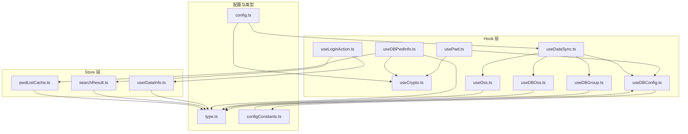
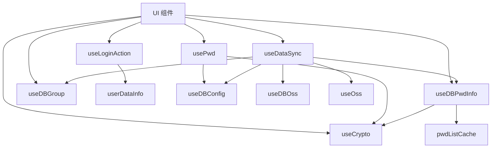
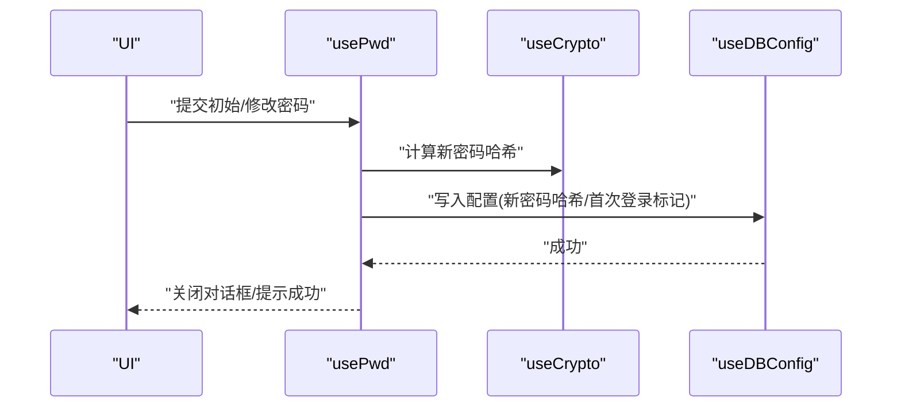
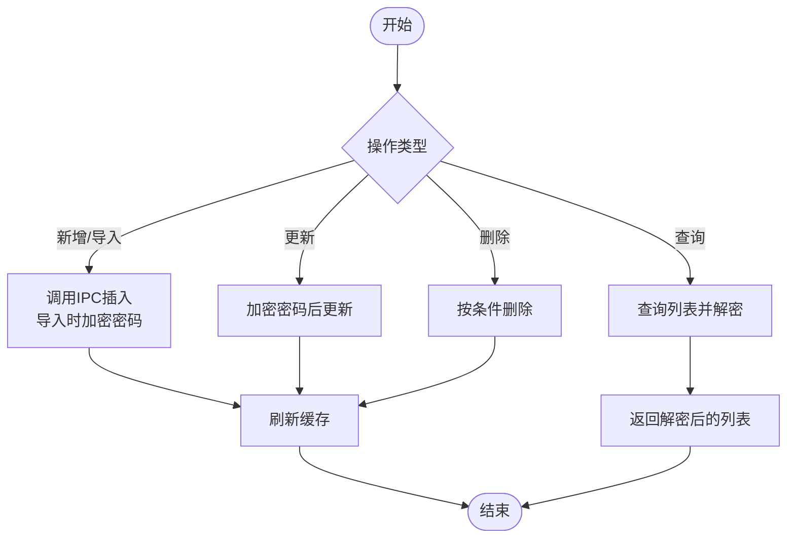
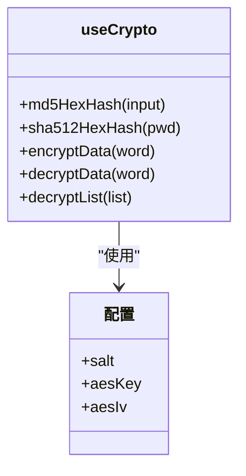
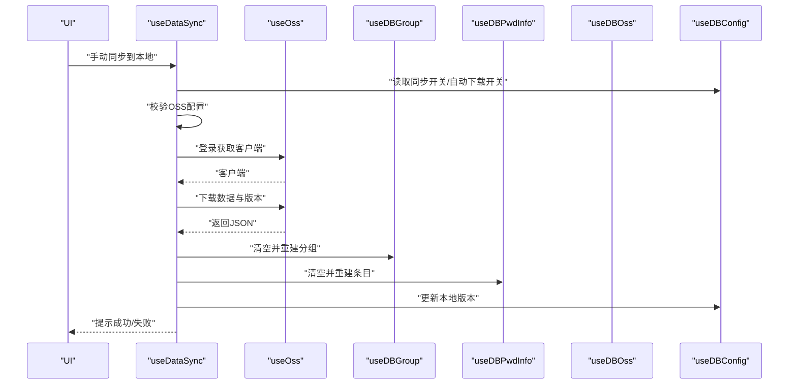
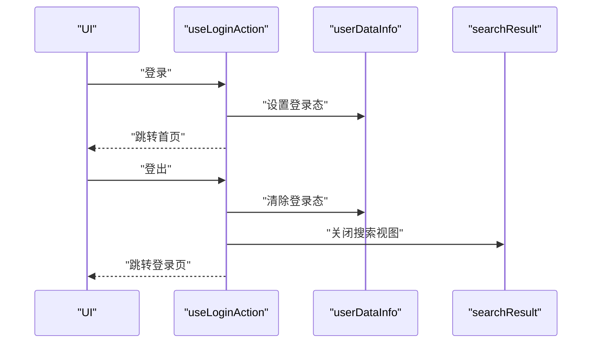
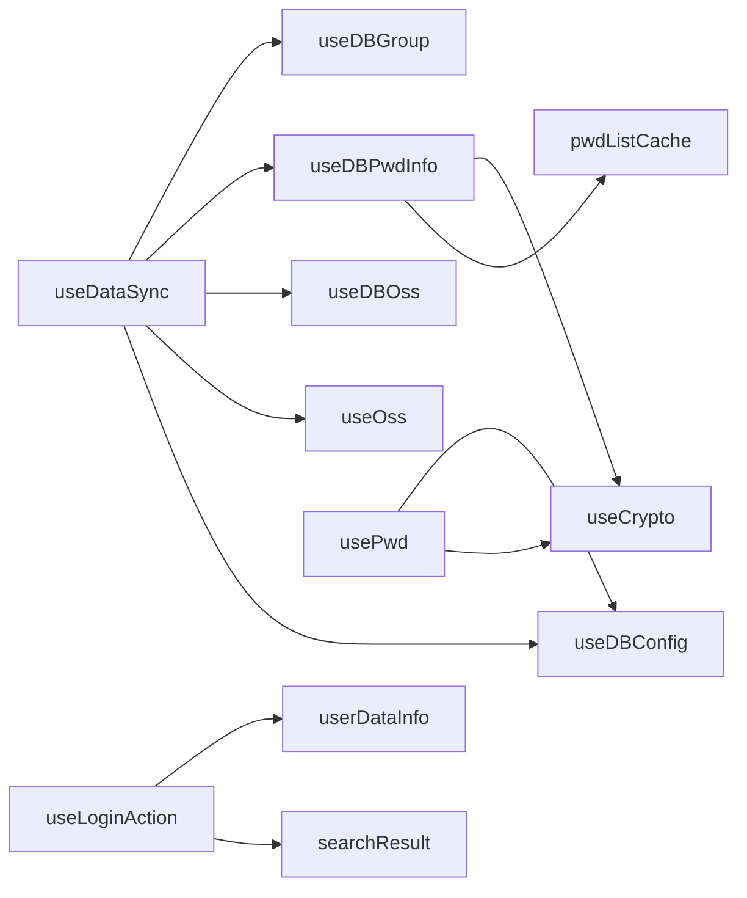

# 业务逻辑层

<cite>
**本文引用的文件**
- [src/hooks/usePwd.ts](file://src/hooks/usePwd.ts)
- [src/hooks/useDBPwdInfo.ts](file://src/hooks/useDBPwdInfo.ts)
- [src/hooks/useCrypto.ts](file://src/hooks/useCrypto.ts)
- [src/hooks/useDataSync.ts](file://src/hooks/useDataSync.ts)
- [src/hooks/useLoginAction.ts](file://src/hooks/useLoginAction.ts)
- [src/hooks/useDBConfig.ts](file://src/hooks/useDBConfig.ts)
- [src/hooks/useDBGroup.ts](file://src/hooks/useDBGroup.ts)
- [src/hooks/useDBOss.ts](file://src/hooks/useDBOss.ts)
- [src/hooks/useOss.ts](file://src/hooks/useOss.ts)
- [src/store/pwdListCache.ts](file://src/store/pwdListCache.ts)
- [src/store/userDataInfo.ts](file://src/store/userDataInfo.ts)
- [src/store/searchResult.ts](file://src/store/searchResult.ts)
- [src/config/config.ts](file://src/config/config.ts)
- [src/components/type.ts](file://src/components/type.ts)
- [electron/db/sqlite/components/configConstants.ts](file://electron/db/sqlite/components/configConstants.ts)
</cite>

## 目录
1. [引言](#引言)
2. [项目结构](#项目结构)
3. [核心组件](#核心组件)
4. [架构总览](#架构总览)
5. [详细组件分析](#详细组件分析)
6. [依赖分析](#依赖分析)
7. [性能考虑](#性能考虑)
8. [故障排查指南](#故障排查指南)
9. [结论](#结论)
10. [附录](#附录)

## 引言
本文件聚焦于密码管理器的业务逻辑层，系统性梳理业务逻辑封装、数据获取Hook、事件处理Hook与状态管理Hook的实现与协作关系。重点覆盖密码管理、用户认证、数据同步、加密安全等核心流程，明确业务规则、验证逻辑与错误处理机制，并给出与UI组件的交互模式、性能优化策略与常见问题解决方案。

## 项目结构
业务逻辑层主要由以下模块构成：
- Hook层：封装具体业务动作与数据访问，如密码管理、数据库操作、加密解密、数据同步、登录动作等。
- Store层：基于Pinia的状态管理，维护用户会话、搜索结果、缓存等状态。
- 配置与常量：集中管理加密密钥、盐值、默认快捷键、消息提示、OSS配置项等。
- 类型定义：统一的数据结构与接口，确保各模块间契约清晰。

图表来源
- [src/hooks/usePwd.ts:1-166](file://src/hooks/usePwd.ts#L1-L166)
- [src/hooks/useDBPwdInfo.ts:1-103](file://src/hooks/useDBPwdInfo.ts#L1-L103)
- [src/hooks/useCrypto.ts:1-77](file://src/hooks/useCrypto.ts#L1-L77)
- [src/hooks/useDataSync.ts:1-324](file://src/hooks/useDataSync.ts#L1-L324)
- [src/hooks/useLoginAction.ts:1-19](file://src/hooks/useLoginAction.ts#L1-L19)
- [src/hooks/useDBConfig.ts:1-21](file://src/hooks/useDBConfig.ts#L1-L21)
- [src/hooks/useDBGroup.ts:1-53](file://src/hooks/useDBGroup.ts#L1-L53)
- [src/hooks/useDBOss.ts:1-17](file://src/hooks/useDBOss.ts#L1-L17)
- [src/hooks/useOss.ts:1-107](file://src/hooks/useOss.ts#L1-L107)
- [src/store/userDataInfo.ts:1-76](file://src/store/userDataInfo.ts#L1-L76)
- [src/store/searchResult.ts:1-49](file://src/store/searchResult.ts#L1-L49)
- [src/store/pwdListCache.ts:1-37](file://src/store/pwdListCache.ts#L1-L37)
- [src/config/config.ts:1-143](file://src/config/config.ts#L1-L143)
- [src/components/type.ts:1-88](file://src/components/type.ts#L1-L88)
- [electron/db/sqlite/components/configConstants.ts:1-29](file://electron/db/sqlite/components/configConstants.ts#L1-L29)

章节来源
- [src/hooks/usePwd.ts:1-166](file://src/hooks/usePwd.ts#L1-L166)
- [src/hooks/useDBPwdInfo.ts:1-103](file://src/hooks/useDBPwdInfo.ts#L1-L103)
- [src/hooks/useCrypto.ts:1-77](file://src/hooks/useCrypto.ts#L1-L77)
- [src/hooks/useDataSync.ts:1-324](file://src/hooks/useDataSync.ts#L1-L324)
- [src/hooks/useLoginAction.ts:1-19](file://src/hooks/useLoginAction.ts#L1-L19)
- [src/hooks/useDBConfig.ts:1-21](file://src/hooks/useDBConfig.ts#L1-L21)
- [src/hooks/useDBGroup.ts:1-53](file://src/hooks/useDBGroup.ts#L1-L53)
- [src/hooks/useDBOss.ts:1-17](file://src/hooks/useDBOss.ts#L1-L17)
- [src/hooks/useOss.ts:1-107](file://src/hooks/useOss.ts#L1-L107)
- [src/store/userDataInfo.ts:1-76](file://src/store/userDataInfo.ts#L1-L76)
- [src/store/searchResult.ts:1-49](file://src/store/searchResult.ts#L1-L49)
- [src/store/pwdListCache.ts:1-37](file://src/store/pwdListCache.ts#L1-L37)
- [src/config/config.ts:1-143](file://src/config/config.ts#L1-L143)
- [src/components/type.ts:1-88](file://src/components/type.ts#L1-L88)
- [electron/db/sqlite/components/configConstants.ts:1-29](file://electron/db/sqlite/components/configConstants.ts#L1-L29)

## 核心组件
- 密码与认证相关
  - usePwd：封装初始密码设置、密码修改、表单校验、首次登录标记与错误提示。
  - useLoginAction：封装登录/登出路由切换与状态清理。
  - useDBConfig：封装SQLite配置读写，支撑密码与开关项持久化。
  - configConstants：集中定义配置键名与默认值。
- 数据访问与缓存
  - useDBGroup：封装分组增删改查与ID查询。
  - useDBPwdInfo：封装密码条目增删改查、导入、统计与加解密。
  - pwdListCache：基于Pinia的轻量缓存，仅缓存标题/用户名等检索字段。
- 加密与安全
  - useCrypto：封装MD5/SHA512哈希、AES-CBC加解密与批量解密。
- 云端同步
  - useDataSync：封装OSS开关、版本对比、自动/手动同步、错误提示与测试连接。
  - useOss：封装OSS客户端创建、文件上传/下载与客户端获取。
  - useDBOss：封装OSS配置的SQLite读写。
- 状态管理
  - userDataInfo：用户登录态、当前分组/条目、锁屏时间等。
  - searchResult：搜索结果视图状态与当前选中条目。
  - pwdListCache：密码列表缓存刷新。

章节来源
- [src/hooks/usePwd.ts:1-166](file://src/hooks/usePwd.ts#L1-L166)
- [src/hooks/useLoginAction.ts:1-19](file://src/hooks/useLoginAction.ts#L1-L19)
- [src/hooks/useDBConfig.ts:1-21](file://src/hooks/useDBConfig.ts#L1-L21)
- [electron/db/sqlite/components/configConstants.ts:1-29](file://electron/db/sqlite/components/configConstants.ts#L1-L29)
- [src/hooks/useDBGroup.ts:1-53](file://src/hooks/useDBGroup.ts#L1-L53)
- [src/hooks/useDBPwdInfo.ts:1-103](file://src/hooks/useDBPwdInfo.ts#L1-L103)
- [src/store/pwdListCache.ts:1-37](file://src/store/pwdListCache.ts#L1-L37)
- [src/hooks/useCrypto.ts:1-77](file://src/hooks/useCrypto.ts#L1-L77)
- [src/hooks/useDataSync.ts:1-324](file://src/hooks/useDataSync.ts#L1-L324)
- [src/hooks/useOss.ts:1-107](file://src/hooks/useOss.ts#L1-L107)
- [src/hooks/useDBOss.ts:1-17](file://src/hooks/useDBOss.ts#L1-L17)
- [src/store/userDataInfo.ts:1-76](file://src/store/userDataInfo.ts#L1-L76)
- [src/store/searchResult.ts:1-49](file://src/store/searchResult.ts#L1-L49)

## 架构总览
业务逻辑层采用“Hook + Store + 配置/常量”的分层设计：
- Hook层负责具体业务动作与数据访问，屏蔽UI细节，暴露简洁的函数式接口。
- Store层负责跨组件共享的状态，避免重复请求与重复渲染。
- 配置与常量集中管理，确保加密参数、快捷键、提示文案的一致性。
- 与UI交互通过事件总线或直接调用Hook/Store完成，保持低耦合。

图表来源
- [src/hooks/useLoginAction.ts:1-19](file://src/hooks/useLoginAction.ts#L1-L19)
- [src/hooks/usePwd.ts:1-166](file://src/hooks/usePwd.ts#L1-L166)
- [src/hooks/useDBPwdInfo.ts:1-103](file://src/hooks/useDBPwdInfo.ts#L1-L103)
- [src/hooks/useDBGroup.ts:1-53](file://src/hooks/useDBGroup.ts#L1-L53)
- [src/hooks/useDataSync.ts:1-324](file://src/hooks/useDataSync.ts#L1-L324)
- [src/hooks/useCrypto.ts:1-77](file://src/hooks/useCrypto.ts#L1-L77)
- [src/store/userDataInfo.ts:1-76](file://src/store/userDataInfo.ts#L1-L76)
- [src/store/pwdListCache.ts:1-37](file://src/store/pwdListCache.ts#L1-L37)
- [src/hooks/useDBOss.ts:1-17](file://src/hooks/useDBOss.ts#L1-L17)
- [src/hooks/useOss.ts:1-107](file://src/hooks/useOss.ts#L1-L107)

## 详细组件分析

### 密码与认证流程（usePwd + useDBConfig）
- 初始密码设置
  - 表单校验：新密码长度与一致性校验；提交时对新密码做哈希并写入配置，同时关闭对话框。
  - 首次登录标记：设置首次登录标志位，便于引导流程。
- 密码修改
  - 校验旧密码哈希一致性；通过后更新新密码哈希并提示成功。
- 错误处理
  - 旧密码错误提示；离开设置时可选择重置首次登录标记并提示默认密码。

图表来源
- [src/hooks/usePwd.ts:22-92](file://src/hooks/usePwd.ts#L22-L92)
- [src/hooks/useCrypto.ts:24-29](file://src/hooks/useCrypto.ts#L24-L29)
- [src/hooks/useDBConfig.ts:6-18](file://src/hooks/useDBConfig.ts#L6-L18)
- [electron/db/sqlite/components/configConstants.ts:5-8](file://electron/db/sqlite/components/configConstants.ts#L5-L8)

章节来源
- [src/hooks/usePwd.ts:1-166](file://src/hooks/usePwd.ts#L1-L166)
- [src/hooks/useDBConfig.ts:1-21](file://src/hooks/useDBConfig.ts#L1-L21)
- [src/hooks/useCrypto.ts:1-77](file://src/hooks/useCrypto.ts#L1-L77)
- [electron/db/sqlite/components/configConstants.ts:1-29](file://electron/db/sqlite/components/configConstants.ts#L1-L29)

### 数据访问与缓存（useDBPwdInfo + pwdListCache）
- 增删改查
  - 新增/导入：调用IPC插入条目；导入时对密码字段执行加密。
  - 更新：对密码字段加密后再更新。
  - 删除：支持按ID、全部、按分组批量删除。
  - 查询：支持按分组、搜索关键词、ID集合查询；查询返回列表时统一解密。
  - 统计：按分组统计数量。
- 缓存策略
  - 初始化时从数据库加载标题/用户名等字段到缓存；
  - 每次数据库变更后刷新缓存，避免重复解密与重复渲染。

图表来源
- [src/hooks/useDBPwdInfo.ts:21-88](file://src/hooks/useDBPwdInfo.ts#L21-L88)
- [src/store/pwdListCache.ts:15-33](file://src/store/pwdListCache.ts#L15-L33)
- [src/hooks/useCrypto.ts:41-74](file://src/hooks/useCrypto.ts#L41-L74)

章节来源
- [src/hooks/useDBPwdInfo.ts:1-103](file://src/hooks/useDBPwdInfo.ts#L1-L103)
- [src/store/pwdListCache.ts:1-37](file://src/store/pwdListCache.ts#L1-L37)
- [src/hooks/useCrypto.ts:1-77](file://src/hooks/useCrypto.ts#L1-L77)

### 加密与安全（useCrypto）
- 哈希
  - SHA512：对带盐的密码进行哈希，作为登录/修改密码的凭证。
  - MD5：用于其他场景的哈希需求。
- 对称加密
  - AES-CBC：使用固定密钥与IV对敏感字段进行加解密；批量解密遍历列表逐项解密。
- 安全要点
  - 密钥与IV来自配置；盐值来自配置，增强抗彩虹表能力。
  - UI侧不直接接触明文密码，仅在Hook内部进行加解密。

图表来源
- [src/hooks/useCrypto.ts:1-77](file://src/hooks/useCrypto.ts#L1-L77)
- [src/config/config.ts:14-21](file://src/config/config.ts#L14-L21)

章节来源
- [src/hooks/useCrypto.ts:1-77](file://src/hooks/useCrypto.ts#L1-L77)
- [src/config/config.ts:1-143](file://src/config/config.ts#L1-L143)

### 数据同步（useDataSync + useOss + useDBOss）
- 同步开关与版本控制
  - 本地版本号与远端版本号对比，决定是否允许上传/下载。
  - 自动/手动同步：根据开关与配置校验结果执行。
- 下载流程
  - 校验OSS登录状态与配置完整性；获取远端版本与本地版本；若不一致则下载JSON并重建本地分组与条目。
- 上传流程
  - 生成同步对象（包含分组与条目），上传数据与版本号。
- 错误处理
  - 登录失败按错误码分类提示；上传/下载异常统一捕获并提示。

图表来源
- [src/hooks/useDataSync.ts:51-131](file://src/hooks/useDataSync.ts#L51-L131)
- [src/hooks/useOss.ts:10-44](file://src/hooks/useOss.ts#L10-L44)
- [src/hooks/useDBGroup.ts:30-33](file://src/hooks/useDBGroup.ts#L30-L33)
- [src/hooks/useDBPwdInfo.ts:42-53](file://src/hooks/useDBPwdInfo.ts#L42-L53)
- [src/hooks/useDBOss.ts:5-14](file://src/hooks/useDBOss.ts#L5-L14)
- [src/hooks/useDBConfig.ts:6-18](file://src/hooks/useDBConfig.ts#L6-L18)

章节来源
- [src/hooks/useDataSync.ts:1-324](file://src/hooks/useDataSync.ts#L1-L324)
- [src/hooks/useOss.ts:1-107](file://src/hooks/useOss.ts#L1-L107)
- [src/hooks/useDBOss.ts:1-17](file://src/hooks/useDBOss.ts#L1-L17)
- [src/hooks/useDBGroup.ts:1-53](file://src/hooks/useDBGroup.ts#L1-L53)
- [src/hooks/useDBPwdInfo.ts:1-103](file://src/hooks/useDBPwdInfo.ts#L1-L103)
- [src/hooks/useDBConfig.ts:1-21](file://src/hooks/useDBConfig.ts#L1-L21)

### 登录与状态管理（useLoginAction + userDataInfo + searchResult）
- 登录
  - 切换路由至首页，设置登录态；清空搜索视图。
- 登出
  - 切换路由至登录页，清除登录态与搜索视图。
- 状态
  - userDataInfo：维护登录态、当前分组/条目、锁屏时间等。
  - searchResult：维护搜索结果列表与当前选中条目。

图表来源
- [src/hooks/useLoginAction.ts:7-16](file://src/hooks/useLoginAction.ts#L7-L16)
- [src/store/userDataInfo.ts:41-46](file://src/store/userDataInfo.ts#L41-L46)
- [src/store/searchResult.ts:17-21](file://src/store/searchResult.ts#L17-L21)

章节来源
- [src/hooks/useLoginAction.ts:1-19](file://src/hooks/useLoginAction.ts#L1-L19)
- [src/store/userDataInfo.ts:1-76](file://src/store/userDataInfo.ts#L1-L76)
- [src/store/searchResult.ts:1-49](file://src/store/searchResult.ts#L1-L49)

## 依赖分析
- 组件内聚与耦合
  - useDBPwdInfo与useCrypto高内聚，围绕“加解密+数据库”职责单一。
  - useDataSync聚合useDBGroup、useDBPwdInfo、useDBOss、useOss、useDBConfig，形成完整的同步闭环。
  - Store层仅持有状态，不直接依赖业务细节，降低UI与业务耦合。
- 外部依赖
  - 加密：crypto-js；OSS：ali-oss；IPC：Electron ipcRenderer。
- 潜在循环依赖
  - 当前未发现直接循环依赖；若未来扩展，应避免Hook之间互相调用导致的环状依赖。

图表来源
- [src/hooks/useDBPwdInfo.ts:1-103](file://src/hooks/useDBPwdInfo.ts#L1-L103)
- [src/hooks/useCrypto.ts:1-77](file://src/hooks/useCrypto.ts#L1-L77)
- [src/store/pwdListCache.ts:1-37](file://src/store/pwdListCache.ts#L1-L37)
- [src/hooks/useDataSync.ts:1-324](file://src/hooks/useDataSync.ts#L1-L324)
- [src/hooks/useDBGroup.ts:1-53](file://src/hooks/useDBGroup.ts#L1-L53)
- [src/hooks/useDBOss.ts:1-17](file://src/hooks/useDBOss.ts#L1-L17)
- [src/hooks/useOss.ts:1-107](file://src/hooks/useOss.ts#L1-L107)
- [src/hooks/useDBConfig.ts:1-21](file://src/hooks/useDBConfig.ts#L1-L21)
- [src/hooks/usePwd.ts:1-166](file://src/hooks/usePwd.ts#L1-L166)
- [src/hooks/useLoginAction.ts:1-19](file://src/hooks/useLoginAction.ts#L1-L19)
- [src/store/userDataInfo.ts:1-76](file://src/store/userDataInfo.ts#L1-L76)
- [src/store/searchResult.ts:1-49](file://src/store/searchResult.ts#L1-L49)

章节来源
- [src/hooks/useDBPwdInfo.ts:1-103](file://src/hooks/useDBPwdInfo.ts#L1-L103)
- [src/hooks/useCrypto.ts:1-77](file://src/hooks/useCrypto.ts#L1-L77)
- [src/store/pwdListCache.ts:1-37](file://src/store/pwdListCache.ts#L1-L37)
- [src/hooks/useDataSync.ts:1-324](file://src/hooks/useDataSync.ts#L1-L324)
- [src/hooks/useDBGroup.ts:1-53](file://src/hooks/useDBGroup.ts#L1-L53)
- [src/hooks/useDBOss.ts:1-17](file://src/hooks/useDBOss.ts#L1-L17)
- [src/hooks/useOss.ts:1-107](file://src/hooks/useOss.ts#L1-L107)
- [src/hooks/useDBConfig.ts:1-21](file://src/hooks/useDBConfig.ts#L1-L21)
- [src/hooks/usePwd.ts:1-166](file://src/hooks/usePwd.ts#L1-L166)
- [src/hooks/useLoginAction.ts:1-19](file://src/hooks/useLoginAction.ts#L1-L19)
- [src/store/userDataInfo.ts:1-76](file://src/store/userDataInfo.ts#L1-L76)
- [src/store/searchResult.ts:1-49](file://src/store/searchResult.ts#L1-L49)

## 性能考虑
- 列表缓存
  - pwdListCache仅缓存标题与用户名，减少渲染与内存占用；变更后统一刷新，避免脏读。
- 解密成本控制
  - 批量解密在Hook层一次性完成，避免多次解密与重复渲染。
- 同步策略
  - 使用版本号避免不必要的全量同步；自动/手动开关降低资源消耗。
- UI反馈
  - 同步过程避免无谓的全局加载动画，仅在需要时提示，提升响应感。

## 故障排查指南
- 初始密码设置失败
  - 检查密码长度与一致性校验；确认配置写入成功。
- 密码修改失败
  - 核对旧密码哈希是否匹配；查看错误提示。
- 同步失败
  - OSS配置缺失或错误：检查region/keyId/key_secret/bucket；登录失败按错误码定位。
  - 版本冲突：远端版本大于本地版本需先拉取再上传。
- 解密异常
  - 确认密钥/IV/盐值未被篡改；检查存储的加密数据格式。
- 登录/登出异常
  - 检查路由切换与Store状态是否正确更新；确保搜索视图关闭。

章节来源
- [src/hooks/usePwd.ts:101-150](file://src/hooks/usePwd.ts#L101-L150)
- [src/hooks/useDataSync.ts:300-320](file://src/hooks/useDataSync.ts#L300-L320)
- [src/hooks/useOss.ts:82-99](file://src/hooks/useOss.ts#L82-L99)
- [src/hooks/useCrypto.ts:41-74](file://src/hooks/useCrypto.ts#L41-L74)
- [src/hooks/useLoginAction.ts:7-16](file://src/hooks/useLoginAction.ts#L7-L16)

## 结论
业务逻辑层通过Hook与Store实现了清晰的职责分离：数据访问与业务动作集中在Hook，状态共享在Store，配置与常量集中管理。加密与同步流程具备完善的校验与错误处理，配合缓存与版本控制策略，兼顾了安全性与性能。建议在后续迭代中进一步完善日志埋点与可观测性，以提升问题定位效率。

## 附录
- 关键配置项
  - 加密：salt、aesKey、aesIv
  - 默认密码：defaultPwd
  - 快捷键默认值：多处默认快捷键常量
  - OSS：ossTypeAliYun、帮助链接、提示文案
- 类型定义
  - OssForm/OssSyncObj/PwdInfo/PwdGroup/PwdCache/ShortCutKeyComb/Config/UpdateVersion

章节来源
- [src/config/config.ts:1-143](file://src/config/config.ts#L1-L143)
- [src/components/type.ts:1-88](file://src/components/type.ts#L1-L88)