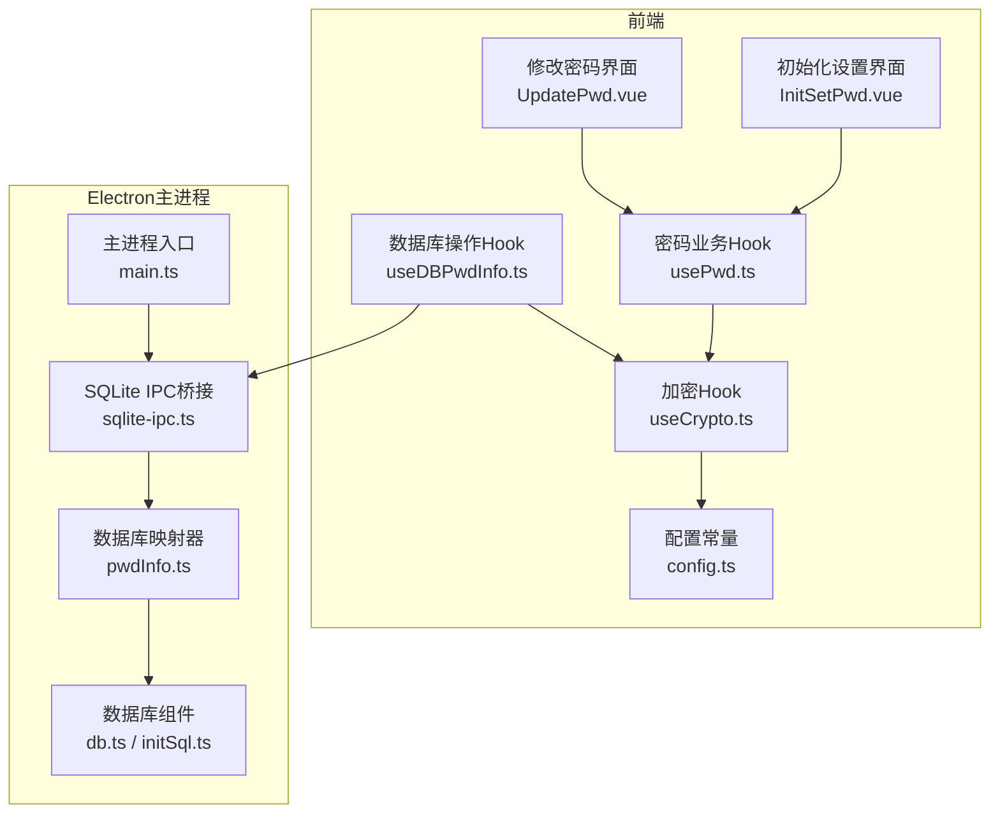
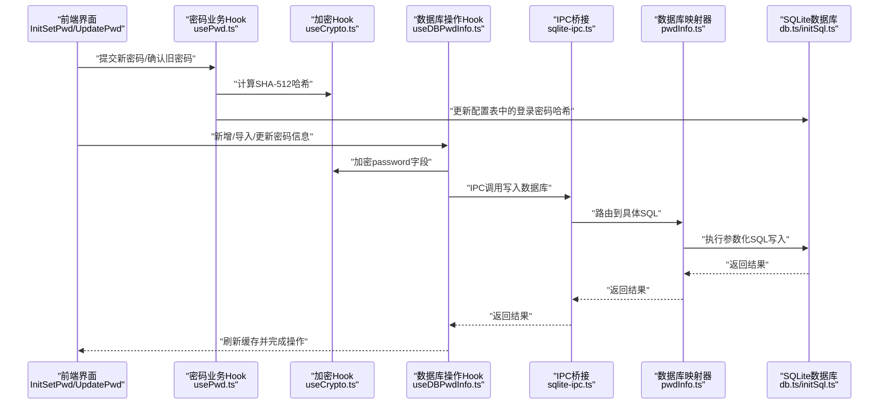
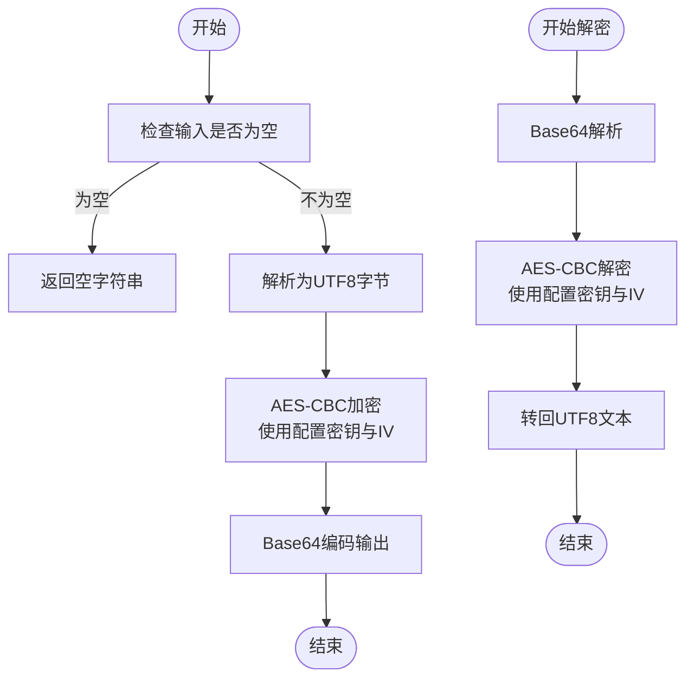
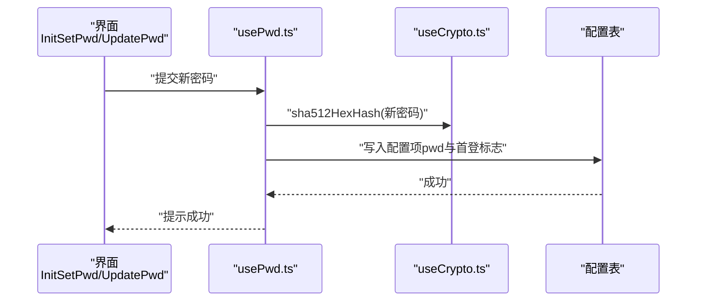
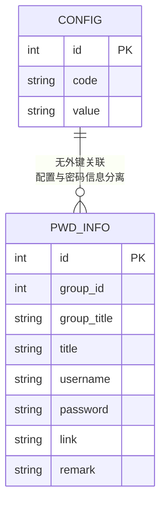
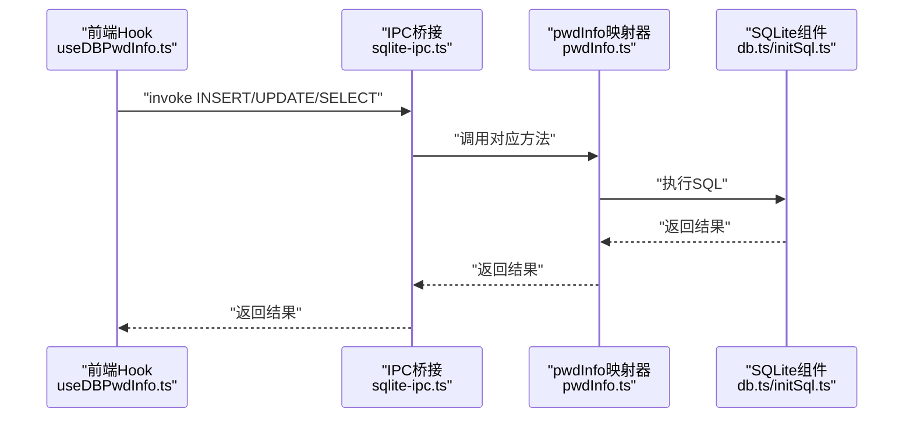
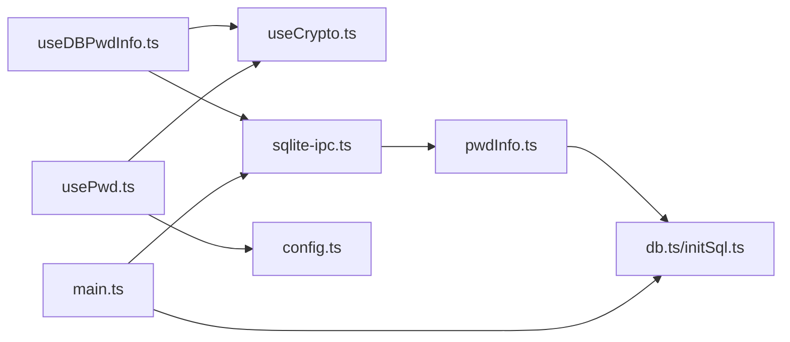

# 加密安全系统

<cite>
**本文档引用的文件**
- [useCrypto.ts](file://src/hooks/useCrypto.ts)
- [config.ts](file://src/config/config.ts)
- [usePwd.ts](file://src/hooks/usePwd.ts)
- [useDBPwdInfo.ts](file://src/hooks/useDBPwdInfo.ts)
- [pwdInfo.ts](file://electron/db/sqlite/mapper/pwdInfo.ts)
- [sqlite-ipc.ts](file://electron/db/sqlite/sqlite-ipc.ts)
- [initSql.ts](file://electron/db/sqlite/components/initSql.ts)
- [db.ts](file://electron/db/sqlite/components/db.ts)
- [main.ts](file://electron/main.ts)
- [InitSetPwd.vue](file://src/components/setview/InitSetPwd.vue)
- [UpdatePwd.vue](file://src/components/setview/UpdatePwd.vue)
</cite>

## 目录
1. [简介](#简介)
2. [项目结构](#项目结构)
3. [核心组件](#核心组件)
4. [架构总览](#架构总览)
5. [详细组件分析](#详细组件分析)
6. [依赖关系分析](#依赖关系分析)
7. [性能考量](#性能考量)
8. [故障排除指南](#故障排除指南)
9. [结论](#结论)
10. [附录](#附录)

## 简介
本文件系统性梳理密码管理器的加密安全体系，覆盖AES对称加密实现、密钥与盐值管理、登录密码哈希策略、数据在应用层与数据库层的加密存储流程，以及与Electron主进程IPC交互的集成方式。文档同时提供安全最佳实践、漏洞防护建议与合规性考虑，帮助读者全面理解并安全地使用与扩展该系统。

## 项目结构
项目采用前端Vue + Electron主进程的架构，加密逻辑主要分布在前端Hook与配置模块，数据库访问通过IPC桥接到Electron主进程，最终落库于本地SQLite。

图表来源
- [main.ts:49-58](file://electron/main.ts#L49-L58)
- [sqlite-ipc.ts:58-219](file://electron/db/sqlite/sqlite-ipc.ts#L58-L219)
- [useDBPwdInfo.ts:17-103](file://src/hooks/useDBPwdInfo.ts#L17-L103)
- [useCrypto.ts:5-77](file://src/hooks/useCrypto.ts#L5-L77)
- [config.ts:14-22](file://src/config/config.ts#L14-L22)
- [pwdInfo.ts:1-100](file://electron/db/sqlite/mapper/pwdInfo.ts#L1-L100)
- [db.ts:16-30](file://electron/db/sqlite/components/db.ts#L16-L30)
- [initSql.ts:26-105](file://electron/db/sqlite/components/initSql.ts#L26-L105)

章节来源
- [main.ts:49-58](file://electron/main.ts#L49-L58)
- [sqlite-ipc.ts:58-219](file://electron/db/sqlite/sqlite-ipc.ts#L58-L219)
- [useDBPwdInfo.ts:17-103](file://src/hooks/useDBPwdInfo.ts#L17-L103)
- [useCrypto.ts:5-77](file://src/hooks/useCrypto.ts#L5-L77)
- [config.ts:14-22](file://src/config/config.ts#L14-L22)
- [pwdInfo.ts:1-100](file://electron/db/sqlite/mapper/pwdInfo.ts#L1-L100)
- [db.ts:16-30](file://electron/db/sqlite/components/db.ts#L16-L30)
- [initSql.ts:26-105](file://electron/db/sqlite/components/initSql.ts#L26-L105)

## 核心组件
- 加密Hook（useCrypto.ts）
  - 提供MD5、SHA-512哈希、AES-CBC加解密与密码列表批量解密能力。
  - 使用配置模块中的AES密钥与IV进行解析与运算。
- 密码业务Hook（usePwd.ts）
  - 负责首次设置与修改密码的表单校验、登录密码哈希存储、首登标志维护。
- 数据库操作Hook（useDBPwdInfo.ts）
  - 封装密码信息的增删改查，统一在入库前加密、出库后解密。
- 数据库映射器（pwdInfo.ts）
  - 提供SQL语句封装与参数化查询，确保密码字段以加密形式存储。
- SQLite IPC桥接（sqlite-ipc.ts）
  - 将前端IPC调用路由至具体Mapper，实现跨进程安全通信。
- 配置常量（config.ts）
  - 定义盐值、AES密钥、IV与默认密码等全局安全参数。
- 数据库组件（db.ts、initSql.ts）
  - 初始化SQLite数据库与表结构，包含密码信息表与配置表。

章节来源
- [useCrypto.ts:5-77](file://src/hooks/useCrypto.ts#L5-L77)
- [usePwd.ts:9-166](file://src/hooks/usePwd.ts#L9-L166)
- [useDBPwdInfo.ts:17-103](file://src/hooks/useDBPwdInfo.ts#L17-L103)
- [pwdInfo.ts:1-100](file://electron/db/sqlite/mapper/pwdInfo.ts#L1-L100)
- [sqlite-ipc.ts:58-219](file://electron/db/sqlite/sqlite-ipc.ts#L58-L219)
- [config.ts:14-22](file://src/config/config.ts#L14-L22)
- [db.ts:16-30](file://electron/db/sqlite/components/db.ts#L16-L30)
- [initSql.ts:26-105](file://electron/db/sqlite/components/initSql.ts#L26-L105)

## 架构总览
下图展示了从前端UI到数据库的完整加密存储链路，强调“入库存明文敏感字段先加密，出库时再解密”的原则。

图表来源
- [InitSetPwd.vue:1-46](file://src/components/setview/InitSetPwd.vue#L1-L46)
- [UpdatePwd.vue:1-66](file://src/components/setview/UpdatePwd.vue#L1-L66)
- [usePwd.ts:22-92](file://src/hooks/usePwd.ts#L22-L92)
- [useCrypto.ts:11-29](file://src/hooks/useCrypto.ts#L11-L29)
- [useDBPwdInfo.ts:28-62](file://src/hooks/useDBPwdInfo.ts#L28-L62)
- [sqlite-ipc.ts:140-175](file://electron/db/sqlite/sqlite-ipc.ts#L140-L175)
- [pwdInfo.ts:6-48](file://electron/db/sqlite/mapper/pwdInfo.ts#L6-L48)
- [db.ts:16-30](file://electron/db/sqlite/components/db.ts#L16-L30)
- [initSql.ts:26-105](file://electron/db/sqlite/components/initSql.ts#L26-L105)

## 详细组件分析

### AES加密与密钥管理
- 加密模式与填充
  - 使用AES-CBC模式与零填充（ZeroPadding），密钥与IV来自配置常量。
- 密钥与IV来源
  - 从配置模块读取全局常量，作为CryptoJS解析后的字节序列使用。
- 哈希策略
  - 登录密码采用SHA-512加盐哈希存储；盐值同样来自配置模块。
- 加密/解密流程
  - 入库前对password字段进行AES加密；出库后对列表进行批量解密，确保UI层始终看到明文。

图表来源
- [useCrypto.ts:41-66](file://src/hooks/useCrypto.ts#L41-L66)
- [config.ts:14-22](file://src/config/config.ts#L14-L22)

章节来源
- [useCrypto.ts:33-66](file://src/hooks/useCrypto.ts#L33-L66)
- [config.ts:14-22](file://src/config/config.ts#L14-L22)

### 登录密码设置与验证
- 首次设置
  - 弹窗输入新密码，前端校验长度与一致性，计算SHA-512哈希后写入配置表，并清除首登标志。
- 修改密码
  - 输入旧密码与新密码，先验证旧密码哈希匹配，再更新为新哈希。
- UI组件
  - 初始化设置与修改密码分别由对应Vue组件承载。

图表来源
- [InitSetPwd.vue:1-46](file://src/components/setview/InitSetPwd.vue#L1-L46)
- [UpdatePwd.vue:1-66](file://src/components/setview/UpdatePwd.vue#L1-L66)
- [usePwd.ts:22-92](file://src/hooks/usePwd.ts#L22-L92)
- [useCrypto.ts:24-29](file://src/hooks/useCrypto.ts#L24-L29)
- [config.ts:14-22](file://src/config/config.ts#L14-L22)

章节来源
- [usePwd.ts:22-92](file://src/hooks/usePwd.ts#L22-L92)
- [InitSetPwd.vue:1-46](file://src/components/setview/InitSetPwd.vue#L1-L46)
- [UpdatePwd.vue:1-66](file://src/components/setview/UpdatePwd.vue#L1-L66)

### 数据库层加密存储策略
- 表结构
  - 密码信息表包含password字段，用于存储加密后的密码。
- 写入流程
  - 新增/导入/更新时，前端Hook对password进行加密后再通过IPC写入数据库。
- 读取流程
  - 查询返回后，前端Hook对列表进行批量解密，UI层仅消费明文。
- 参数化查询
  - 所有SQL均使用参数化绑定，防止注入攻击。

图表来源
- [initSql.ts:59-71](file://electron/db/sqlite/components/initSql.ts#L59-L71)
- [pwdInfo.ts:6-48](file://electron/db/sqlite/mapper/pwdInfo.ts#L6-L48)

章节来源
- [initSql.ts:26-105](file://electron/db/sqlite/components/initSql.ts#L26-L105)
- [pwdInfo.ts:1-100](file://electron/db/sqlite/mapper/pwdInfo.ts#L1-L100)
- [useDBPwdInfo.ts:28-76](file://src/hooks/useDBPwdInfo.ts#L28-L76)

### IPC与数据库交互
- IPC桥接
  - 主进程注册各类IPC处理函数，将前端请求路由到具体Mapper。
- 主进程启动
  - 应用启动时初始化数据库表结构与默认数据，注册全局快捷键与托盘菜单。

图表来源
- [sqlite-ipc.ts:140-204](file://electron/db/sqlite/sqlite-ipc.ts#L140-L204)
- [pwdInfo.ts:6-99](file://electron/db/sqlite/mapper/pwdInfo.ts#L6-L99)
- [db.ts:16-30](file://electron/db/sqlite/components/db.ts#L16-L30)
- [main.ts:49-58](file://electron/main.ts#L49-L58)

章节来源
- [sqlite-ipc.ts:58-219](file://electron/db/sqlite/sqlite-ipc.ts#L58-L219)
- [pwdInfo.ts:1-100](file://electron/db/sqlite/mapper/pwdInfo.ts#L1-L100)
- [db.ts:16-30](file://electron/db/sqlite/components/db.ts#L16-L30)
- [main.ts:49-58](file://electron/main.ts#L49-L58)

## 依赖关系分析
- 组件耦合
  - useDBPwdInfo.ts依赖useCrypto.ts进行加解密；依赖IPC桥接与数据库映射器。
  - usePwd.ts依赖useCrypto.ts进行哈希计算，并与配置表交互。
  - sqlite-ipc.ts集中管理所有数据库相关IPC处理。
- 外部依赖
  - 使用CryptoJS进行哈希与AES加解密。
  - 使用better-sqlite3进行本地数据库访问。
- 潜在风险
  - 密钥与IV硬编码在配置文件中，若源码泄露将直接影响数据机密性。
  - 登录密码采用SHA-512哈希存储，需配合强口令策略与定期轮换。

图表来源
- [useDBPwdInfo.ts:17-103](file://src/hooks/useDBPwdInfo.ts#L17-L103)
- [useCrypto.ts:5-77](file://src/hooks/useCrypto.ts#L5-L77)
- [sqlite-ipc.ts:58-219](file://electron/db/sqlite/sqlite-ipc.ts#L58-L219)
- [pwdInfo.ts:1-100](file://electron/db/sqlite/mapper/pwdInfo.ts#L1-L100)
- [db.ts:16-30](file://electron/db/sqlite/components/db.ts#L16-L30)
- [usePwd.ts:9-166](file://src/hooks/usePwd.ts#L9-L166)
- [config.ts:14-22](file://src/config/config.ts#L14-L22)
- [main.ts:49-58](file://electron/main.ts#L49-L58)

章节来源
- [useDBPwdInfo.ts:17-103](file://src/hooks/useDBPwdInfo.ts#L17-L103)
- [useCrypto.ts:5-77](file://src/hooks/useCrypto.ts#L5-L77)
- [sqlite-ipc.ts:58-219](file://electron/db/sqlite/sqlite-ipc.ts#L58-L219)
- [pwdInfo.ts:1-100](file://electron/db/sqlite/mapper/pwdInfo.ts#L1-L100)
- [db.ts:16-30](file://electron/db/sqlite/components/db.ts#L16-L30)
- [usePwd.ts:9-166](file://src/hooks/usePwd.ts#L9-L166)
- [config.ts:14-22](file://src/config/config.ts#L14-L22)
- [main.ts:49-58](file://electron/main.ts#L49-L58)

## 性能考量
- 加解密成本
  - AES-CBC在CPU密集型场景下可能影响大列表渲染性能。建议对频繁读取的数据进行内存缓存，并在UI层延迟解密。
- 数据库IO
  - 参数化SQL与事务批处理有助于减少SQL解析与IO开销。对于批量导入，优先使用映射器提供的批量接口。
- 前端渲染
  - 对超长列表采用虚拟滚动与懒加载，避免一次性解密与渲染大量节点。

## 故障排除指南
- 解密失败或乱码
  - 检查密钥与IV是否正确且与入库时一致；确认password字段确为Base64编码。
- 登录密码无法修改
  - 核对旧密码哈希是否与配置表中存储一致；确认前端校验规则未拦截。
- 数据库连接异常
  - 确认数据库路径与权限；检查应用用户目录下的数据库文件是否存在且可读写。
- IPC调用无响应
  - 检查主进程IPC注册是否完成；确认前端invoke的参数顺序与数量与后端定义一致。

章节来源
- [useCrypto.ts:54-66](file://src/hooks/useCrypto.ts#L54-L66)
- [usePwd.ts:76-92](file://src/hooks/usePwd.ts#L76-L92)
- [db.ts:16-30](file://electron/db/sqlite/components/db.ts#L16-L30)
- [sqlite-ipc.ts:140-204](file://electron/db/sqlite/sqlite-ipc.ts#L140-L204)

## 结论
本系统通过AES-CBC对敏感字段进行加密、SHA-512对登录密码进行哈希存储，并在数据库层以参数化SQL确保安全性。前端与主进程通过IPC桥接实现清晰的职责分离。为提升整体安全性，建议引入动态密钥派生、硬件安全模块或系统钥匙串、定期轮换密钥与IV，并强化口令策略与审计日志。

## 附录

### 加密配置参数一览
- 盐值（salt）
  - 用途：登录密码哈希加盐
  - 来源：配置常量
- AES密钥（aesKey）
  - 用途：AES-CBC加密密钥
  - 来源：配置常量
- AES初始化向量（aesIv）
  - 用途：AES-CBC初始化向量
  - 来源：配置常量
- 默认密码（defaultPwd）
  - 用途：系统内置默认值占位
  - 来源：配置常量

章节来源
- [config.ts:14-22](file://src/config/config.ts#L14-L22)

### 代码示例路径（不展示具体代码内容）
- AES加密流程
  - [useCrypto.ts:41-52](file://src/hooks/useCrypto.ts#L41-L52)
- AES解密流程
  - [useCrypto.ts:54-66](file://src/hooks/useCrypto.ts#L54-L66)
- SHA-512哈希（带盐）
  - [useCrypto.ts:24-29](file://src/hooks/useCrypto.ts#L24-L29)
- 登录密码设置（SHA-512写入）
  - [usePwd.ts:22-35](file://src/hooks/usePwd.ts#L22-L35)
- 登录密码修改（旧密码校验与更新）
  - [usePwd.ts:76-92](file://src/hooks/usePwd.ts#L76-L92)
- 密码信息入库（加密后写入）
  - [useDBPwdInfo.ts:28-33](file://src/hooks/useDBPwdInfo.ts#L28-L33)
- 密码信息更新（加密后更新）
  - [useDBPwdInfo.ts:55-63](file://src/hooks/useDBPwdInfo.ts#L55-L63)
- 密码列表解密（批量解密）
  - [useCrypto.ts:68-74](file://src/hooks/useCrypto.ts#L68-L74)
- 数据库表初始化（含密码表）
  - [initSql.ts:59-71](file://electron/db/sqlite/components/initSql.ts#L59-L71)
- IPC写入密码信息
  - [sqlite-ipc.ts:147-149](file://electron/db/sqlite/sqlite-ipc.ts#L147-L149)