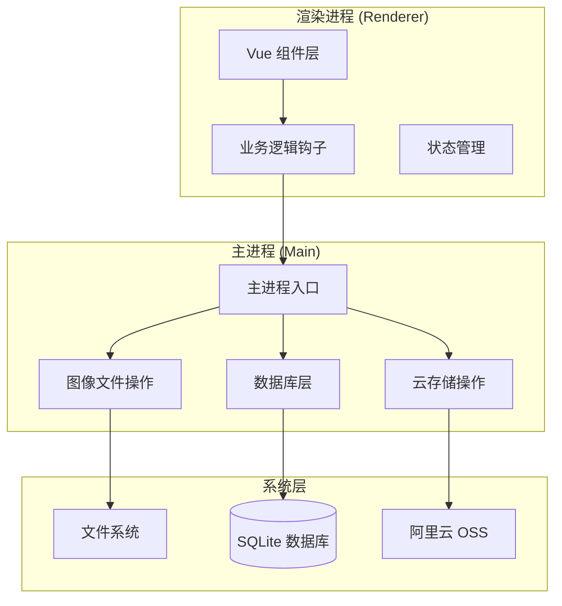
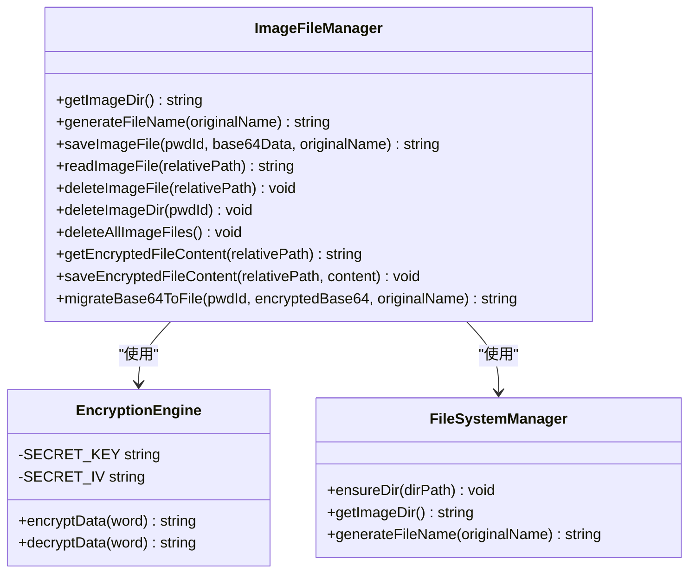
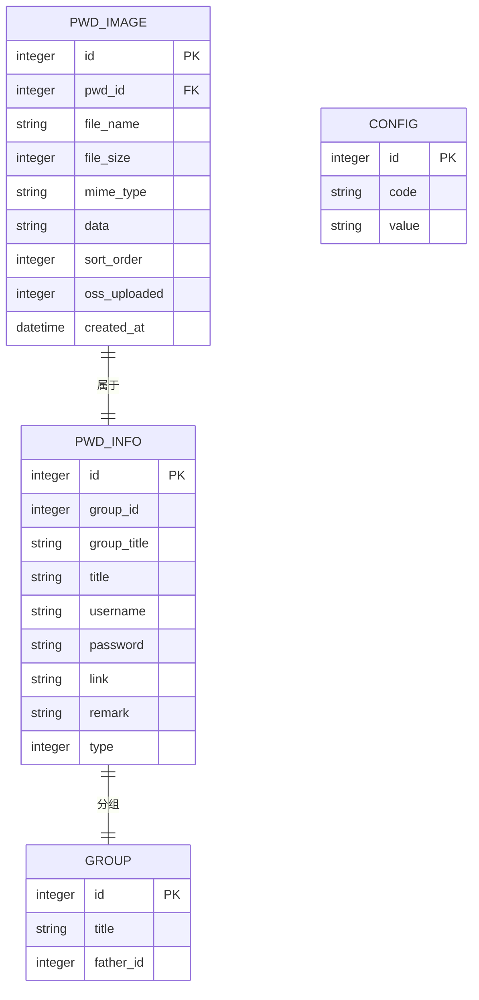
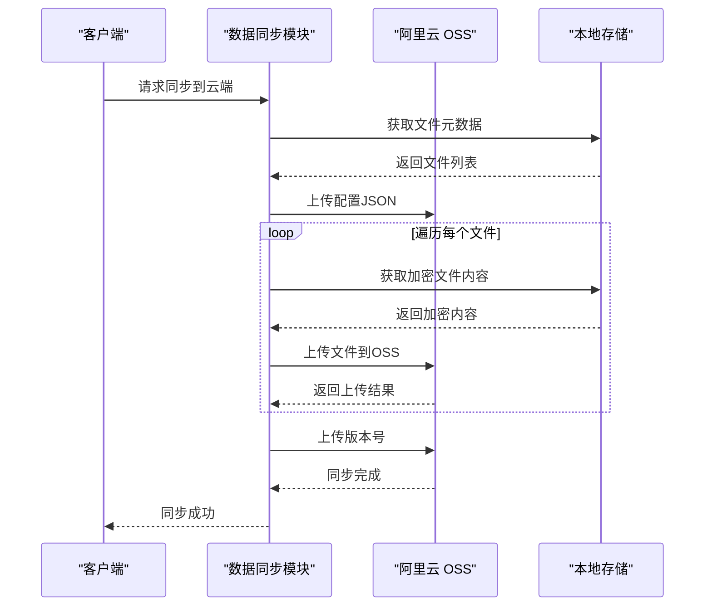
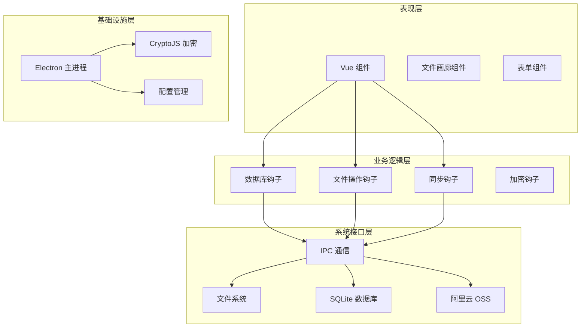
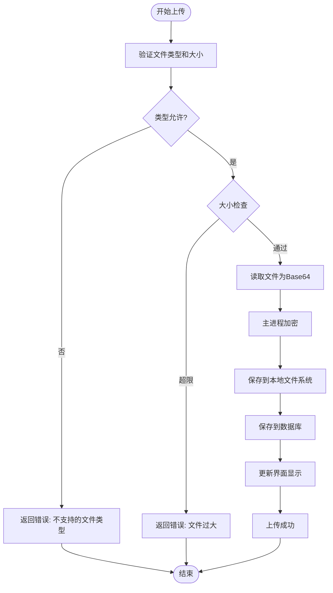
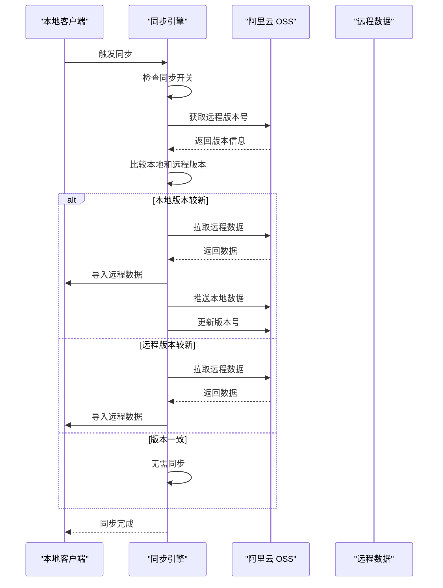
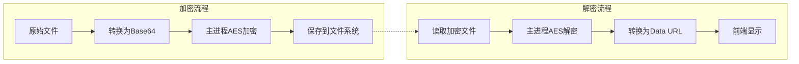
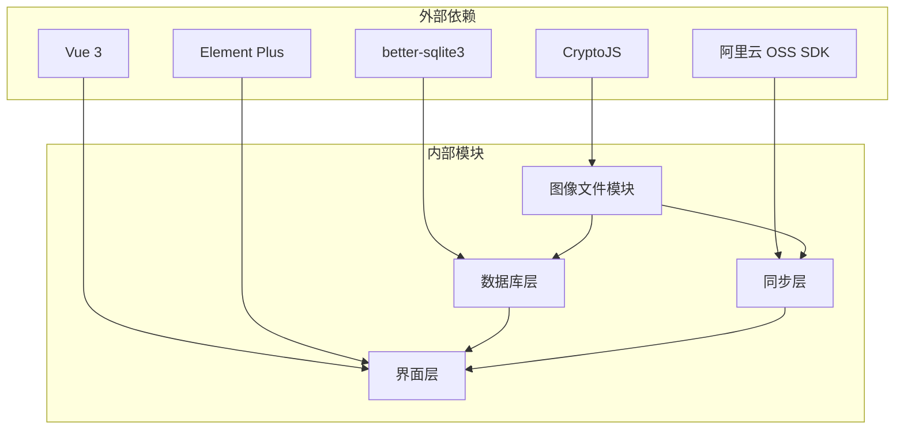

# 图像文件存储系统

<cite>
**本文档引用的文件**
- [image-file.ts](file://electron/image-file.ts)
- [main.ts](file://electron/main.ts)
- [constant.ts](file://electron/constant.ts)
- [useDBFile.ts](file://src/hooks/useDBFile.ts)
- [FileGallery.vue](file://src/components/indexview/FileGallery.vue)
- [useDataSync.ts](file://src/hooks/useDataSync.ts)
- [useOss.ts](file://src/hooks/useOss.ts)
- [oss.ts](file://src/store/oss.ts)
- [db.ts](file://electron/db/sqlite/components/db.ts)
- [baseSql.ts](file://electron/db/sqlite/components/baseSql.ts)
- [image.ts](file://electron/db/sqlite/mapper/image.ts)
- [initSql.ts](file://electron/db/sqlite/components/initSql.ts)
- [config.ts](file://src/config/config.ts)
- [preload.ts](file://electron/preload.ts)
- [package.json](file://package.json)
</cite>

## 目录
1. [简介](#简介)
2. [项目结构](#项目结构)
3. [核心组件](#核心组件)
4. [架构概览](#架构概览)
5. [详细组件分析](#详细组件分析)
6. [依赖关系分析](#依赖关系分析)
7. [性能考虑](#性能考虑)
8. [故障排除指南](#故障排除指南)
9. [结论](#结论)

## 简介

图像文件存储系统是一个基于 Electron-Vue 架构的安全文件管理系统，专门设计用于存储和管理密码条目相关的图像文件。该系统采用双重加密机制，确保文件在传输和存储过程中的安全性，同时提供了完整的本地文件管理和云端同步功能。

系统的核心特性包括：
- 基于 AES-CBC 的双重加密机制
- 本地文件系统存储与云端同步
- 支持多种文件格式（图片、文档等）
- 自动化的数据迁移和版本管理
- 完整的文件生命周期管理

## 项目结构

该项目采用典型的 Electron + Vue 3 架构，主要分为三个层次：

**图表来源**
- [main.ts:1-367](file://electron/main.ts#L1-L367)
- [image-file.ts:1-222](file://electron/image-file.ts#L1-L222)

**章节来源**
- [main.ts:1-367](file://electron/main.ts#L1-L367)
- [package.json:1-51](file://package.json#L1-L51)

## 核心组件

### 图像文件操作模块

图像文件操作模块是系统的核心组件，负责处理所有与图像文件相关的操作。该模块实现了完整的文件生命周期管理，包括加密存储、解密读取、文件删除等功能。

**图表来源**
- [image-file.ts:1-222](file://electron/image-file.ts#L1-L222)

### 数据库管理层

系统使用 SQLite 作为本地数据存储，通过精心设计的表结构和查询接口实现高效的数据管理。

**图表来源**
- [initSql.ts:118-130](file://electron/db/sqlite/components/initSql.ts#L118-L130)
- [image.ts:1-82](file://electron/db/sqlite/mapper/image.ts#L1-L82)

### 云存储集成

系统集成了阿里云 OSS 服务，提供云端备份和同步功能，确保数据的安全性和可访问性。

**图表来源**
- [useDataSync.ts:218-296](file://src/hooks/useDataSync.ts#L218-L296)
- [useOss.ts:1-204](file://src/hooks/useOss.ts#L1-L204)

**章节来源**
- [image-file.ts:1-222](file://electron/image-file.ts#L1-L222)
- [db.ts:1-30](file://electron/db/sqlite/components/db.ts#L1-L30)
- [baseSql.ts:1-87](file://electron/db/sqlite/components/baseSql.ts#L1-L87)
- [image.ts:1-82](file://electron/db/sqlite/mapper/image.ts#L1-L82)
- [useDataSync.ts:1-420](file://src/hooks/useDataSync.ts#L1-L420)

## 架构概览

系统采用分层架构设计，确保各组件之间的职责清晰分离，便于维护和扩展。

**图表来源**
- [main.ts:1-367](file://electron/main.ts#L1-L367)
- [useDBFile.ts:1-206](file://src/hooks/useDBFile.ts#L1-L206)
- [useDataSync.ts:1-420](file://src/hooks/useDataSync.ts#L1-L420)

## 详细组件分析

### 文件上传流程

文件上传是系统中最复杂的操作之一，涉及多个步骤和安全检查。

**图表来源**
- [FileGallery.vue:134-165](file://src/components/indexview/FileGallery.vue#L134-L165)
- [useDBFile.ts:28-51](file://src/hooks/useDBFile.ts#L28-L51)

### 数据同步机制

系统提供了完整的数据同步机制，支持双向同步和冲突解决。

**图表来源**
- [useDataSync.ts:50-176](file://src/hooks/useDataSync.ts#L50-L176)
- [useDataSync.ts:178-296](file://src/hooks/useDataSync.ts#L178-L296)

### 加密解密流程

系统采用双重加密机制，确保文件在传输和存储过程中的安全性。

**图表来源**
- [image-file.ts:50-74](file://electron/image-file.ts#L50-L74)
- [useCrypto.ts:41-66](file://src/hooks/useCrypto.ts#L41-L66)

**章节来源**
- [FileGallery.vue:1-611](file://src/components/indexview/FileGallery.vue#L1-L611)
- [useDBFile.ts:1-206](file://src/hooks/useDBFile.ts#L1-L206)
- [useDataSync.ts:1-420](file://src/hooks/useDataSync.ts#L1-L420)
- [useOss.ts:1-204](file://src/hooks/useOss.ts#L1-L204)

## 依赖关系分析

系统依赖关系清晰，各模块之间通过明确的接口进行通信。

**图表来源**
- [package.json:18-29](file://package.json#L18-L29)
- [image-file.ts:1-15](file://electron/image-file.ts#L1-L15)
- [useOss.ts:1-4](file://src/hooks/useOss.ts#L1-L4)

**章节来源**
- [package.json:1-51](file://package.json#L1-L51)

## 性能考虑

系统在设计时充分考虑了性能优化，采用了多种策略来提升用户体验：

### 缓存策略
- 图片文件采用按需加载机制，只在需要时才解密和显示
- 文件数据URL缓存在内存中，避免重复解密操作
- 支持图片预览功能，减少不必要的文件读取

### 并发处理
- 文件上传采用异步处理，避免阻塞用户界面
- 数据库操作使用事务处理，确保数据一致性
- 网络请求采用并发控制，避免过度占用带宽

### 存储优化
- 文件采用加密存储，减少存储空间浪费
- 支持文件压缩和优化，提升存储效率
- 提供垃圾回收机制，定期清理无效文件

## 故障排除指南

### 常见问题及解决方案

**文件上传失败**
- 检查文件类型是否在支持范围内
- 确认文件大小不超过限制（20MB）
- 验证磁盘空间是否充足
- 检查网络连接状态

**同步失败**
- 验证阿里云 OSS 配置是否正确
- 检查网络连接和防火墙设置
- 确认 OSS 权限配置正确
- 查看同步日志获取详细错误信息

**解密失败**
- 确认使用的密钥和初始化向量正确
- 检查文件是否被意外修改
- 验证加密算法版本兼容性
- 重新生成或恢复密钥

**性能问题**
- 清理缓存和临时文件
- 优化数据库索引
- 减少同时进行的操作数量
- 升级硬件配置

**章节来源**
- [image-file.ts:108-114](file://electron/image-file.ts#L108-L114)
- [useDataSync.ts:395-415](file://src/hooks/useDataSync.ts#L395-L415)

## 结论

图像文件存储系统是一个功能完整、安全可靠的文件管理解决方案。通过采用双重加密机制、完善的文件生命周期管理和灵活的同步策略，系统能够满足各种场景下的文件存储需求。

系统的主要优势包括：
- **安全性高**：采用 AES-CBC 加密算法，确保文件在传输和存储过程中的安全
- **可靠性强**：提供完整的数据备份和恢复机制
- **易用性好**：直观的用户界面和丰富的功能特性
- **扩展性强**：模块化设计便于功能扩展和维护

未来可以考虑的功能改进方向：
- 支持更多的云存储服务提供商
- 增加文件版本管理功能
- 优化大文件处理性能
- 增强数据迁移工具