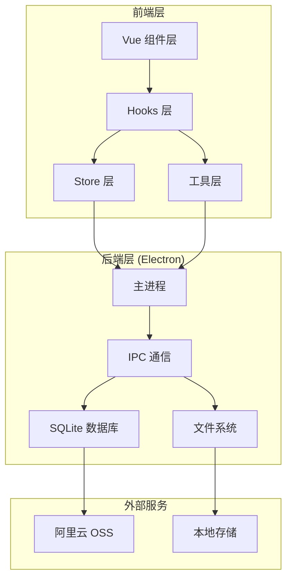
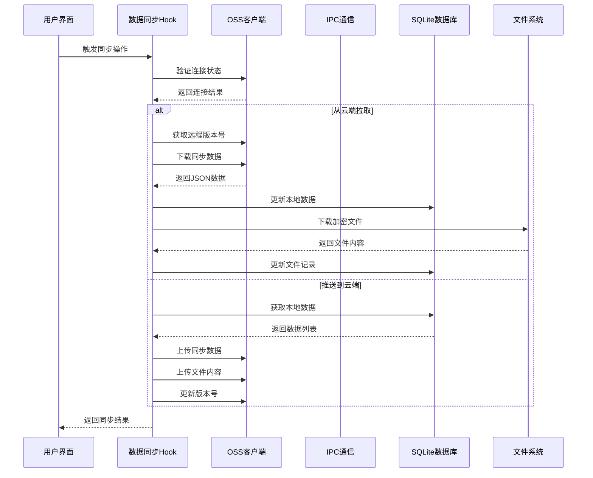
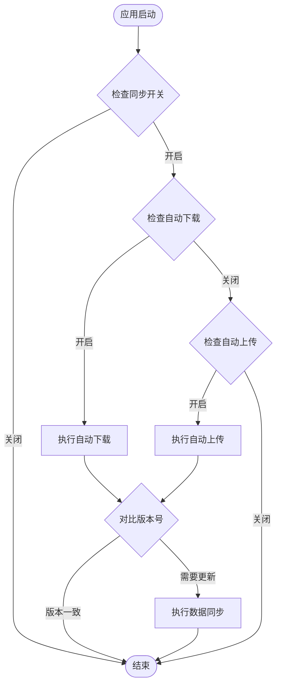
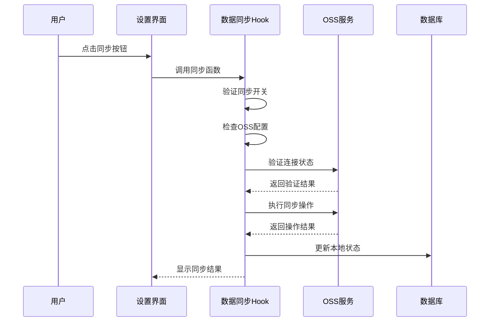
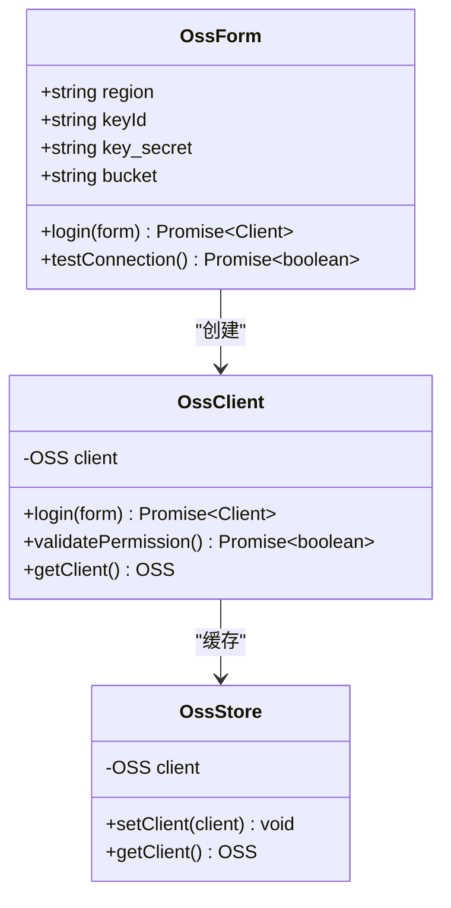
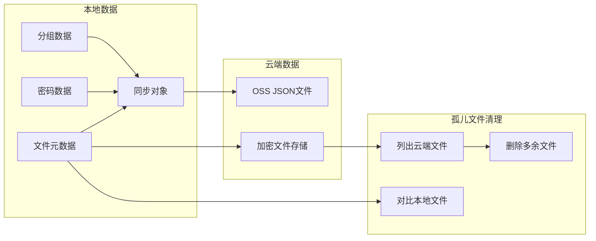
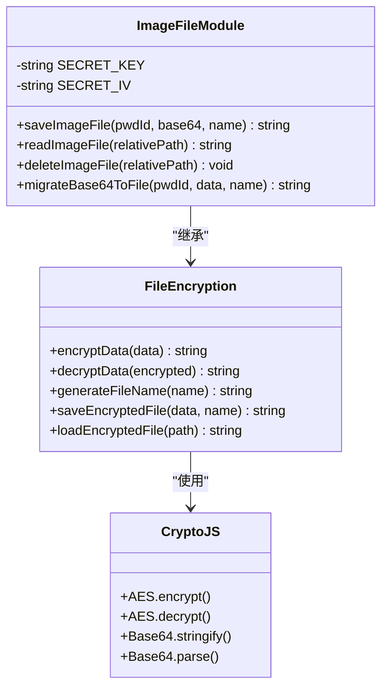
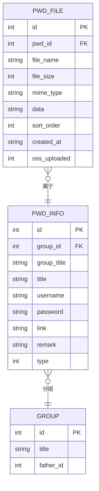
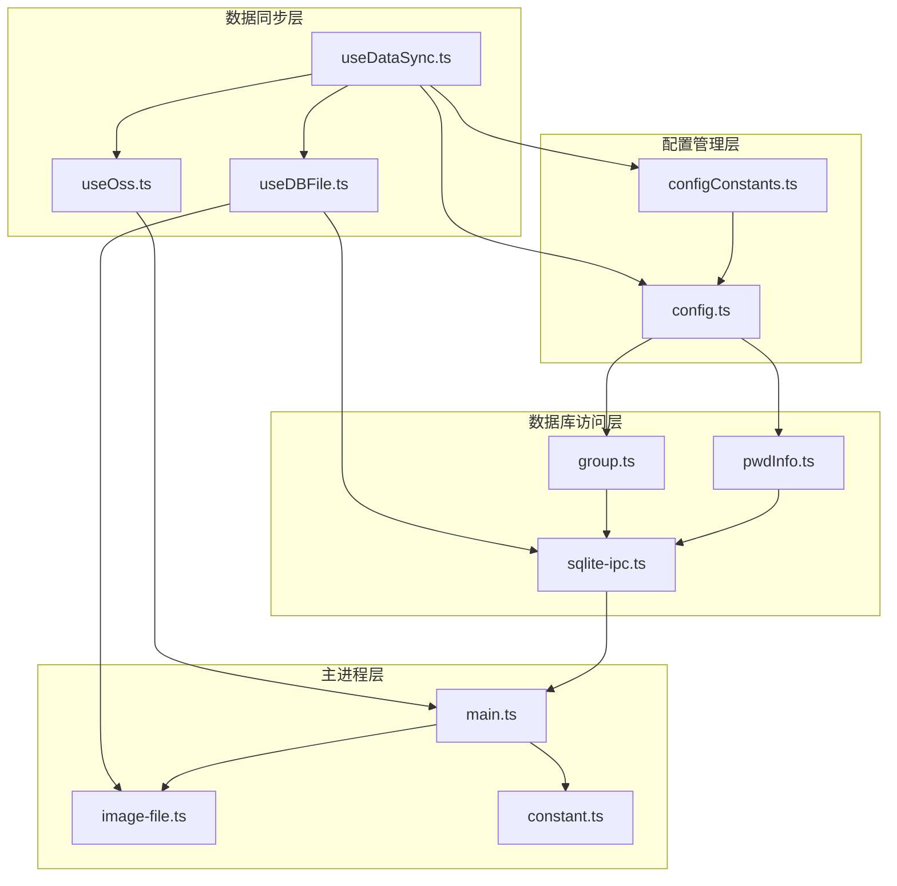
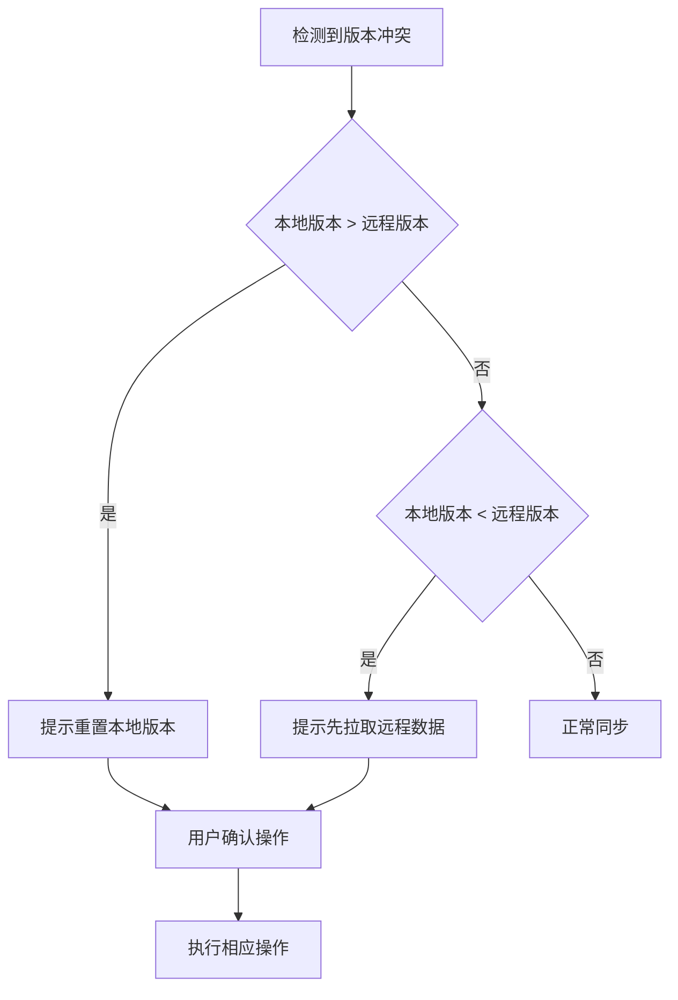

# 增强的数据同步机制

<cite>
**本文档引用的文件**
- [useDataSync.ts](file://src/hooks/useDataSync.ts)
- [DataSync.vue](file://src/components/setview/DataSync.vue)
- [useOss.ts](file://src/hooks/useOss.ts)
- [useDBFile.ts](file://src/hooks/useDBFile.ts)
- [oss.ts](file://src/store/oss.ts)
- [type.ts](file://src/components/type.ts)
- [configConstants.ts](file://electron/db/sqlite/components/configConstants.ts)
- [main.ts](file://electron/main.ts)
- [sqlite-ipc.ts](file://electron/db/sqlite/sqlite-ipc.ts)
- [constant.ts](file://electron/constant.ts)
- [image-file.ts](file://electron/image-file.ts)
- [group.ts](file://electron/db/sqlite/mapper/group.ts)
- [pwdInfo.ts](file://electron/db/sqlite/mapper/pwdInfo.ts)
- [config.ts](file://electron/db/sqlite/mapper/config.ts)
</cite>

## 目录
1. [简介](#简介)
2. [项目结构](#项目结构)
3. [核心组件](#核心组件)
4. [架构概览](#架构概览)
5. [详细组件分析](#详细组件分析)
6. [依赖关系分析](#依赖关系分析)
7. [性能考虑](#性能考虑)
8. [故障排除指南](#故障排除指南)
9. [结论](#结论)

## 简介

这是一个基于 Electron-Vue 的密码管理器应用，专注于提供安全可靠的数据同步机制。该系统实现了完整的云端同步功能，支持阿里云 OSS 存储服务，具备版本控制、增量同步、文件加密传输等特性。

系统采用前后端分离的架构设计，前端负责用户界面和业务逻辑处理，后端（Electron 主进程）负责数据持久化和文件管理。通过 IPC 通信实现前后端数据交换，确保数据传输的安全性和可靠性。

## 项目结构

该项目采用模块化的组织方式，主要分为以下几个层次：

**图表来源**
- [main.ts:1-367](file://electron/main.ts#L1-L367)
- [sqlite-ipc.ts:1-311](file://electron/db/sqlite/sqlite-ipc.ts#L1-L311)

**章节来源**
- [main.ts:1-367](file://electron/main.ts#L1-L367)
- [constant.ts:1-96](file://electron/constant.ts#L1-L96)

## 核心组件

### 数据同步核心模块

数据同步功能由 `useDataSync` Hook 提供，负责处理所有与云端同步相关的业务逻辑：

- **版本控制**: 通过本地版本号和远程版本号对比实现数据一致性
- **双向同步**: 支持从云端拉取数据和向云端推送数据
- **增量更新**: 仅同步发生变化的数据，提高效率
- **错误处理**: 完善的异常捕获和用户提示机制

### OSS 云存储集成

系统集成了阿里云 OSS 服务，提供安全可靠的云端存储解决方案：

- **认证机制**: 支持 AK/SK 认证和桶权限验证
- **文件管理**: 完整的文件上传、下载、删除功能
- **批量操作**: 支持批量文件处理和孤儿文件清理
- **签名访问**: 提供临时访问令牌机制

### 文件加密传输

为了确保数据安全，系统实现了端到端的文件加密传输：

- **AES 加密**: 使用 CryptoJS 实现对称加密算法
- **密钥管理**: 统一的密钥和初始化向量管理
- **安全存储**: 本地文件采用加密格式存储
- **传输保护**: 云端数据同样保持加密状态

**章节来源**
- [useDataSync.ts:1-420](file://src/hooks/useDataSync.ts#L1-L420)
- [useOss.ts:1-204](file://src/hooks/useOss.ts#L1-L204)
- [useDBFile.ts:1-206](file://src/hooks/useDBFile.ts#L1-L206)

## 架构概览

系统采用分层架构设计，确保各层职责清晰、耦合度低：

**图表来源**
- [useDataSync.ts:50-176](file://src/hooks/useDataSync.ts#L50-L176)
- [useOss.ts:10-98](file://src/hooks/useOss.ts#L10-L98)
- [sqlite-ipc.ts:244-272](file://electron/db/sqlite/sqlite-ipc.ts#L244-L272)

## 详细组件分析

### 数据同步流程

#### 自动同步机制

系统实现了智能的自动同步功能，根据配置决定是否执行同步操作：

**图表来源**
- [useDataSync.ts:50-59](file://src/hooks/useDataSync.ts#L50-L59)
- [useDataSync.ts:178-198](file://src/hooks/useDataSync.ts#L178-L198)

#### 手动同步流程

手动同步提供了更精细的控制选项：

**图表来源**
- [useDataSync.ts:61-71](file://src/hooks/useDataSync.ts#L61-L71)
- [useDataSync.ts:200-216](file://src/hooks/useDataSync.ts#L200-L216)

**章节来源**
- [useDataSync.ts:50-216](file://src/hooks/useDataSync.ts#L50-L216)

### OSS 云存储管理

#### 连接验证机制

系统提供了完善的连接验证功能，确保 OSS 配置的正确性：

**图表来源**
- [useOss.ts:10-27](file://src/hooks/useOss.ts#L10-L27)
- [oss.ts:49-55](file://src/store/oss.ts#L49-L55)

#### 文件同步策略

系统实现了高效的文件同步策略，支持多种同步场景：

**图表来源**
- [useDataSync.ts:218-296](file://src/hooks/useDataSync.ts#L218-L296)
- [useDataSync.ts:276-287](file://src/hooks/useDataSync.ts#L276-L287)

**章节来源**
- [useOss.ts:1-204](file://src/hooks/useOss.ts#L1-L204)
- [oss.ts:1-59](file://src/store/oss.ts#L1-L59)

### 文件加密传输机制

#### 加密存储架构

系统实现了完整的文件加密存储架构，确保数据在传输和存储过程中的安全性：

**图表来源**
- [image-file.ts:50-74](file://electron/image-file.ts#L50-L74)
- [image-file.ts:83-97](file://electron/image-file.ts#L83-L97)

#### 数据库文件映射

系统通过统一的接口管理文件数据的存储和检索：

**图表来源**
- [type.ts:95-129](file://src/components/type.ts#L95-L129)
- [pwdInfo.ts:1-101](file://electron/db/sqlite/mapper/pwdInfo.ts#L1-L101)
- [group.ts:1-49](file://electron/db/sqlite/mapper/group.ts#L1-L49)

**章节来源**
- [image-file.ts:1-222](file://electron/image-file.ts#L1-L222)
- [type.ts:1-129](file://src/components/type.ts#L1-L129)

## 依赖关系分析

系统采用了模块化的依赖设计，各组件之间的关系清晰明确：

**图表来源**
- [useDataSync.ts:1-18](file://src/hooks/useDataSync.ts#L1-L18)
- [sqlite-ipc.ts:1-43](file://electron/db/sqlite/sqlite-ipc.ts#L1-L43)
- [main.ts:1-38](file://electron/main.ts#L1-L38)

**章节来源**
- [useDataSync.ts:1-18](file://src/hooks/useDataSync.ts#L1-L18)
- [sqlite-ipc.ts:1-43](file://electron/db/sqlite/sqlite-ipc.ts#L1-L43)

## 性能考虑

### 同步性能优化

系统在设计时充分考虑了性能优化，采用了多种策略提升同步效率：

- **增量同步**: 仅同步发生变化的数据，减少网络传输量
- **并发处理**: 文件上传采用异步并发处理，提升整体速度
- **缓存机制**: OSS 客户端连接状态缓存，避免重复认证
- **内存管理**: 大文件采用流式处理，避免内存溢出

### 存储优化策略

针对不同数据类型的存储特点，系统采用了差异化的优化策略：

- **元数据压缩**: JSON 同步对象中的元数据字段进行压缩存储
- **文件分块**: 大文件采用分块上传和断点续传机制
- **索引优化**: 数据库建立必要的索引提升查询性能
- **清理策略**: 定期清理孤儿文件和无效数据

## 故障排除指南

### 常见问题诊断

#### OSS 连接问题

当遇到 OSS 连接失败时，系统提供了详细的错误信息：

| 错误类型 | 可能原因 | 解决方案 |
|---------|---------|---------|
| RequestError | 桶名称、跨域设置、region配置错误 | 检查OSS配置参数 |
| InvalidAccessKeyId | Access Key ID错误 | 重新输入正确的AK |
| SignatureDoesNotMatch | Access Key Secret错误 | 验证密钥正确性 |
| AccessDenied | 权限不足 | 检查OSS权限设置 |

#### 同步冲突处理

当检测到数据版本冲突时，系统会阻止同步操作并提示用户：

**图表来源**
- [useDataSync.ts:100-104](file://src/hooks/useDataSync.ts#L100-L104)

#### 文件同步异常

文件同步过程中可能出现的异常情况：

- **文件下载失败**: 检查网络连接和文件权限
- **文件上传超时**: 调整超时设置或分块上传
- **磁盘空间不足**: 清理磁盘空间后重试
- **加密解密错误**: 检查密钥配置和数据完整性

**章节来源**
- [useDataSync.ts:395-415](file://src/hooks/useDataSync.ts#L395-L415)
- [useDataSync.ts:285-287](file://src/hooks/useDataSync.ts#L285-L287)

## 结论

该密码管理器的数据同步机制设计合理，功能完善，具有以下优势：

### 技术优势

- **安全性**: 采用端到端加密，确保数据传输和存储安全
- **可靠性**: 完善的错误处理和重试机制
- **扩展性**: 模块化设计便于功能扩展和维护
- **用户体验**: 智能同步策略，减少用户干预

### 架构特点

- **分层清晰**: 前后端分离，职责明确
- **解耦合理**: 组件间依赖关系清晰
- **可测试性**: 模块化设计便于单元测试
- **可维护性**: 代码结构清晰，文档完善

### 改进建议

未来可以在以下方面进一步优化：

- **增量同步算法**: 实现更精确的变更检测
- **离线同步**: 支持离线环境下的数据同步
- **多云支持**: 扩展支持其他云存储服务
- **性能监控**: 添加详细的性能指标监控

该系统为密码管理提供了安全可靠的云端同步解决方案，适合在企业级环境中部署使用。