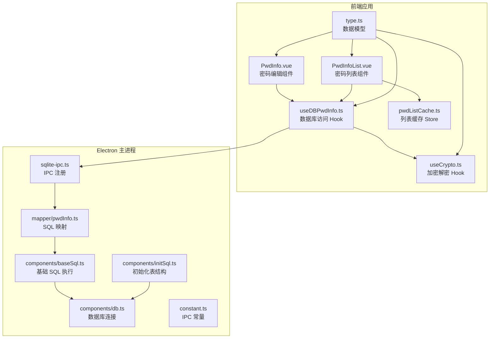
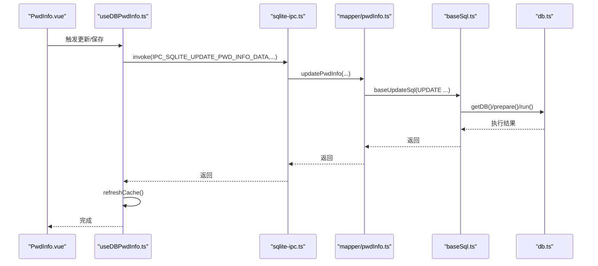
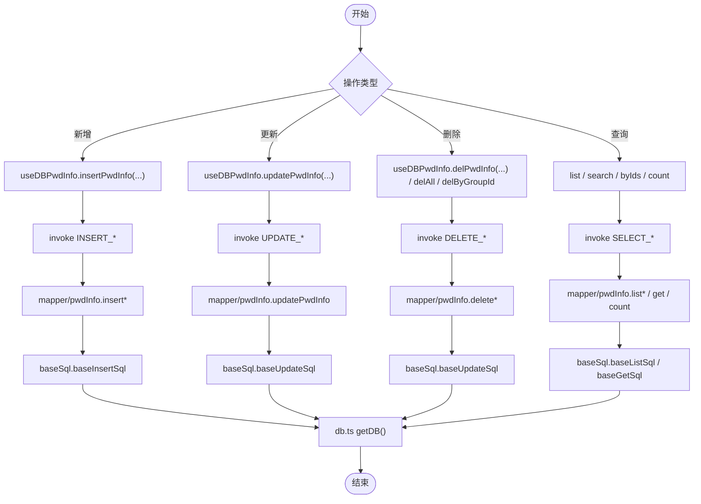
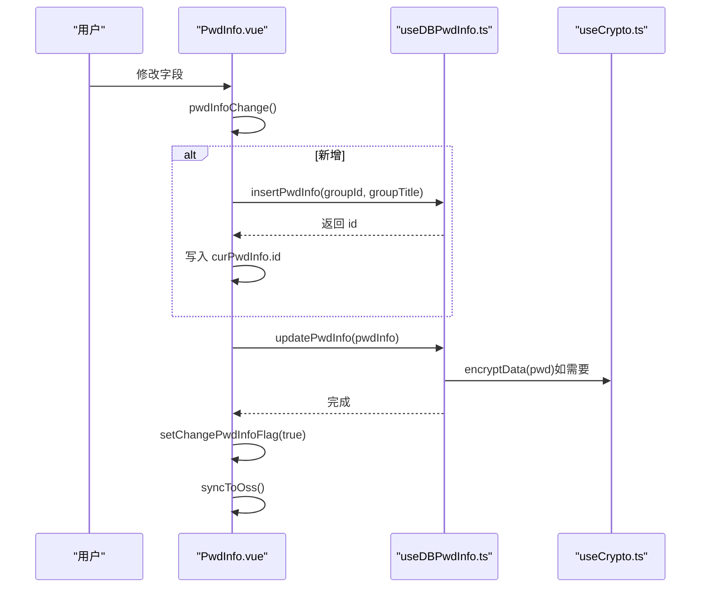
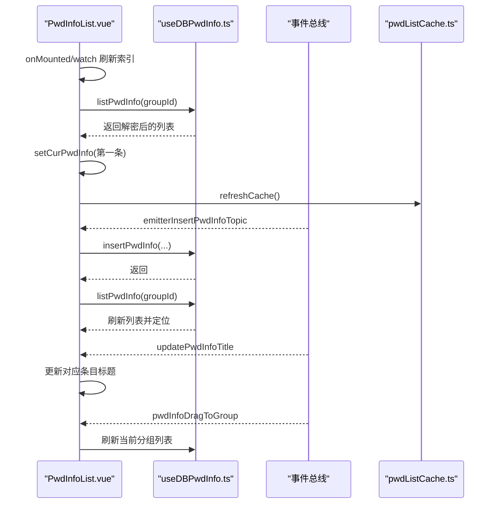
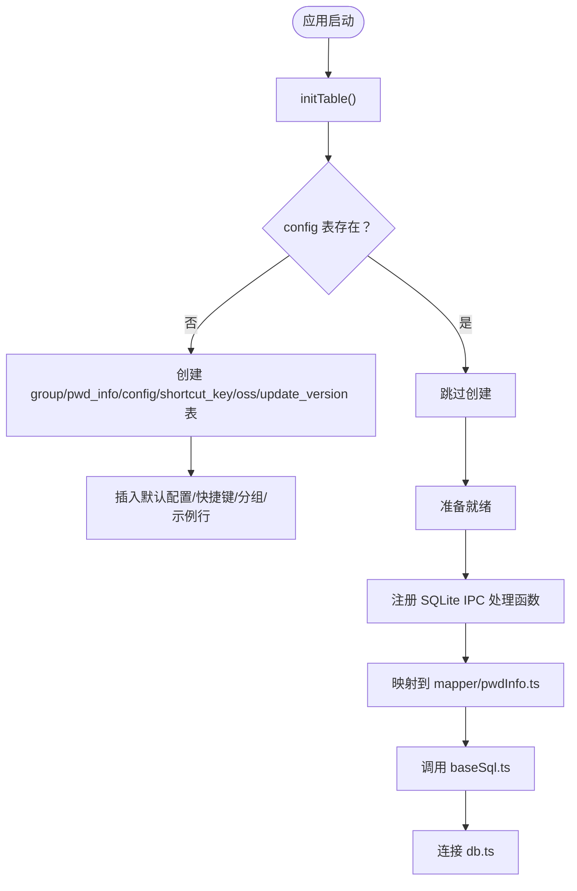
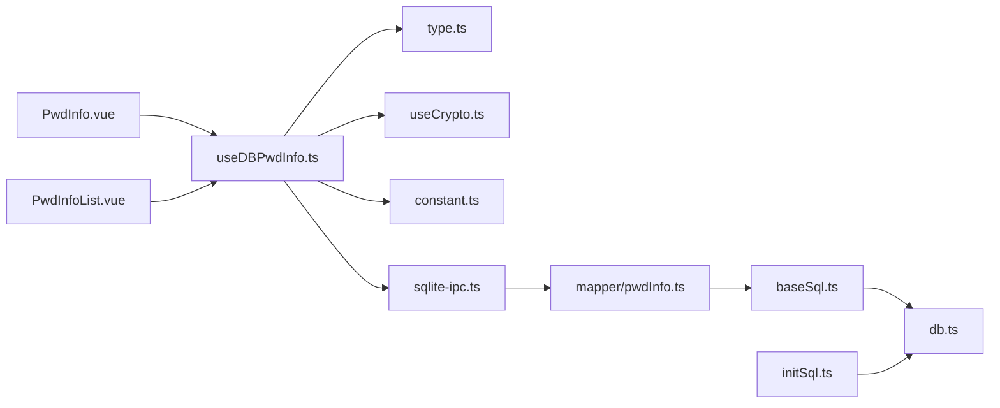

# 密码管理逻辑

<cite>
**本文引用的文件**
- [electron/db/sqlite/mapper/pwdInfo.ts](file://electron/db/sqlite/mapper/pwdInfo.ts)
- [src/hooks/useDBPwdInfo.ts](file://src/hooks/useDBPwdInfo.ts)
- [src/components/indexview/PwdInfo.vue](file://src/components/indexview/PwdInfo.vue)
- [src/components/indexview/PwdInfoList.vue](file://src/components/indexview/PwdInfoList.vue)
- [electron/db/sqlite/components/baseSql.ts](file://electron/db/sqlite/components/baseSql.ts)
- [electron/db/sqlite/components/db.ts](file://electron/db/sqlite/components/db.ts)
- [electron/db/sqlite/components/initSql.ts](file://electron/db/sqlite/components/initSql.ts)
- [electron/db/sqlite/sqlite-ipc.ts](file://electron/db/sqlite/sqlite-ipc.ts)
- [src/components/type.ts](file://src/components/type.ts)
- [src/hooks/useCrypto.ts](file://src/hooks/useCrypto.ts)
- [src/store/pwdListCache.ts](file://src/store/pwdListCache.ts)
- [src/main.ts](file://src/main.ts)
- [electron/main.ts](file://electron/main.ts)
- [electron/constant.ts](file://electron/constant.ts)
- [src/config/config.ts](file://src/config/config.ts)
</cite>

## 目录
1. [简介](#简介)
2. [项目结构](#项目结构)
3. [核心组件](#核心组件)
4. [架构总览](#架构总览)
5. [详细组件分析](#详细组件分析)
6. [依赖关系分析](#依赖关系分析)
7. [性能考量](#性能考量)
8. [故障排查指南](#故障排查指南)
9. [结论](#结论)
10. [附录](#附录)

## 简介
本文件系统性梳理密码管理模块的实现，覆盖密码信息的增删改查（CRUD）、编辑组件行为、列表展示机制、数据模型与验证约束、与数据库层的交互模式与数据同步策略，并给出安全处理与用户体验优化建议。读者无需深入技术背景即可理解整体流程。

## 项目结构
密码管理相关代码主要分布在前端 Vue 应用与 Electron 主进程两部分：
- 前端层：组件负责 UI 交互与状态管理；Hook 封装数据库访问；Store 提供缓存与全局状态；类型定义统一数据结构。
- Electron 层：封装 SQLite 数据库连接、基础 SQL 执行、IPC 接口注册与路由，以及初始化表结构与默认数据。

**图表来源**
- [src/components/indexview/PwdInfo.vue](file://src/components/indexview/PwdInfo.vue)
- [src/components/indexview/PwdInfoList.vue](file://src/components/indexview/PwdInfoList.vue)
- [src/hooks/useDBPwdInfo.ts](file://src/hooks/useDBPwdInfo.ts)
- [src/hooks/useCrypto.ts](file://src/hooks/useCrypto.ts)
- [src/store/pwdListCache.ts](file://src/store/pwdListCache.ts)
- [src/components/type.ts](file://src/components/type.ts)
- [electron/db/sqlite/sqlite-ipc.ts](file://electron/db/sqlite/sqlite-ipc.ts)
- [electron/db/sqlite/mapper/pwdInfo.ts](file://electron/db/sqlite/mapper/pwdInfo.ts)
- [electron/db/sqlite/components/baseSql.ts](file://electron/db/sqlite/components/baseSql.ts)
- [electron/db/sqlite/components/db.ts](file://electron/db/sqlite/components/db.ts)
- [electron/db/sqlite/components/initSql.ts](file://electron/db/sqlite/components/initSql.ts)
- [electron/constant.ts](file://electron/constant.ts)

**章节来源**
- [src/main.ts:1-20](file://src/main.ts#L1-L20)
- [electron/main.ts:1-240](file://electron/main.ts#L1-L240)

## 核心组件
- 密码数据模型：包含 id、分组标识与标题、标题、用户名、加密存储的密码、链接、备注等字段。
- 编辑组件：负责输入变更触发保存、复制、明文切换、随机密码生成等交互。
- 列表组件：负责渲染列表、新增、删除、拖拽、索引切换与事件联动。
- 数据访问 Hook：封装 IPC 调用，统一加密/解密与缓存刷新。
- 加密解密 Hook：基于 AES-CBC 实现密码字段的加解密。
- 列表缓存 Store：按需构建轻量缓存，减少渲染压力。

**章节来源**
- [src/components/type.ts:50-88](file://src/components/type.ts#L50-L88)
- [src/components/indexview/PwdInfo.vue:1-257](file://src/components/indexview/PwdInfo.vue#L1-L257)
- [src/components/indexview/PwdInfoList.vue:1-260](file://src/components/indexview/PwdInfoList.vue#L1-L260)
- [src/hooks/useDBPwdInfo.ts:1-103](file://src/hooks/useDBPwdInfo.ts#L1-L103)
- [src/hooks/useCrypto.ts:1-77](file://src/hooks/useCrypto.ts#L1-L77)
- [src/store/pwdListCache.ts:1-37](file://src/store/pwdListCache.ts#L1-L37)

## 架构总览
前端通过 IPC 与主进程通信，主进程注册 SQLite 的 CRUD 接口，映射到具体 SQL 执行。数据在进入/离开数据库前进行加密/解密处理，列表变更后刷新缓存，确保 UI 与数据一致。

**图表来源**
- [src/components/indexview/PwdInfo.vue:32-53](file://src/components/indexview/PwdInfo.vue#L32-L53)
- [src/hooks/useDBPwdInfo.ts:55-62](file://src/hooks/useDBPwdInfo.ts#L55-L62)
- [electron/db/sqlite/sqlite-ipc.ts:171-175](file://electron/db/sqlite/sqlite-ipc.ts#L171-L175)
- [electron/db/sqlite/mapper/pwdInfo.ts:37-48](file://electron/db/sqlite/mapper/pwdInfo.ts#L37-L48)
- [electron/db/sqlite/components/baseSql.ts:67-81](file://electron/db/sqlite/components/baseSql.ts#L67-L81)
- [electron/db/sqlite/components/db.ts:16-23](file://electron/db/sqlite/components/db.ts#L16-L23)

## 详细组件分析

### 数据模型与验证规则
- 字段定义：id、group_id、group_title、title、username、password（加密存储）、link、remark。
- 验证与约束：
  - 必填项：group_id、title。
  - 密码字段采用对称加密存储，读取时解密。
  - 查询支持按标题或用户名模糊匹配。
  - 删除支持按 id、按分组批量删除、清空全部。
  - 列表支持按分组筛选、按 id 列表批量查询、统计数量。

**章节来源**
- [src/components/type.ts:50-88](file://src/components/type.ts#L50-L88)
- [electron/db/sqlite/mapper/pwdInfo.ts:50-91](file://electron/db/sqlite/mapper/pwdInfo.ts#L50-L91)

### CRUD 实现与调用链
- 新增：前端触发新增，返回新记录 id 并刷新缓存。
- 更新：前端变更触发保存，必要时对密码字段加密后再提交。
- 删除：支持单条、按分组批量、全部删除。
- 查询：支持按分组列表、按搜索词模糊查询、按 id 列表批量查询、统计数量。

**图表来源**
- [src/hooks/useDBPwdInfo.ts:21-102](file://src/hooks/useDBPwdInfo.ts#L21-L102)
- [electron/db/sqlite/sqlite-ipc.ts:140-204](file://electron/db/sqlite/sqlite-ipc.ts#L140-L204)
- [electron/db/sqlite/mapper/pwdInfo.ts:6-99](file://electron/db/sqlite/mapper/pwdInfo.ts#L6-L99)
- [electron/db/sqlite/components/baseSql.ts:9-81](file://electron/db/sqlite/components/baseSql.ts#L9-L81)
- [electron/db/sqlite/components/db.ts:16-23](file://electron/db/sqlite/components/db.ts#L16-L23)

**章节来源**
- [src/hooks/useDBPwdInfo.ts:21-102](file://src/hooks/useDBPwdInfo.ts#L21-L102)
- [electron/db/sqlite/mapper/pwdInfo.ts:6-99](file://electron/db/sqlite/mapper/pwdInfo.ts#L6-L99)

### 密码编辑组件逻辑
- 输入变更：标题、用户名、密码、链接、备注任一变化均触发保存。
- 保存流程：若为新建则先插入并回填 id，再执行更新；更新时对密码字段加密。
- 交互增强：支持明文/密文切换、复制用户名/密码/链接、快捷键触发复制。
- 同步：保存成功后刷新缓存并尝试同步至云端。

**图表来源**
- [src/components/indexview/PwdInfo.vue:32-53](file://src/components/indexview/PwdInfo.vue#L32-L53)
- [src/hooks/useDBPwdInfo.ts:55-62](file://src/hooks/useDBPwdInfo.ts#L55-L62)
- [src/hooks/useCrypto.ts:41-52](file://src/hooks/useCrypto.ts#L41-L52)

**章节来源**
- [src/components/indexview/PwdInfo.vue:1-257](file://src/components/indexview/PwdInfo.vue#L1-L257)
- [src/hooks/useDBPwdInfo.ts:21-63](file://src/hooks/useDBPwdInfo.ts#L21-L63)
- [src/hooks/useCrypto.ts:1-77](file://src/hooks/useCrypto.ts#L1-L77)

### 密码列表展示机制
- 渲染：按当前分组加载列表，支持滚动与悬停效果。
- 选择：点击列表项更新当前选中密码条目与索引。
- 新增：触发新增后重新查询并定位到最后一条。
- 删除：弹框确认后删除并刷新列表。
- 事件联动：新增、标题更新、拖拽至其他分组等事件驱动列表刷新。
- 缓存：初始化时构建轻量缓存，后续刷新保持一致性。

**图表来源**
- [src/components/indexview/PwdInfoList.vue:27-103](file://src/components/indexview/PwdInfoList.vue#L27-L103)
- [src/store/pwdListCache.ts:15-33](file://src/store/pwdListCache.ts#L15-L33)
- [src/hooks/useDBPwdInfo.ts:65-88](file://src/hooks/useDBPwdInfo.ts#L65-L88)

**章节来源**
- [src/components/indexview/PwdInfoList.vue:1-260](file://src/components/indexview/PwdInfoList.vue#L1-L260)
- [src/store/pwdListCache.ts:1-37](file://src/store/pwdListCache.ts#L1-L37)

### 数据库层交互模式与初始化
- 数据库连接：单例连接，首次使用时创建，关闭时重置。
- 基础 SQL：提供通用的 list/get/insert/update 封装，异常捕获与返回标准化。
- 初始化：首次运行检测表存在情况，不存在则创建表结构并插入默认数据（含默认分组与默认密码条目）。
- IPC 注册：集中注册所有密码相关的 IPC 处理函数，路由到具体 mapper。

**图表来源**
- [electron/db/sqlite/components/initSql.ts:26-143](file://electron/db/sqlite/components/initSql.ts#L26-L143)
- [electron/db/sqlite/components/db.ts:16-23](file://electron/db/sqlite/components/db.ts#L16-L23)
- [electron/db/sqlite/components/baseSql.ts:9-81](file://electron/db/sqlite/components/baseSql.ts#L9-L81)
- [electron/db/sqlite/sqlite-ipc.ts:140-204](file://electron/db/sqlite/sqlite-ipc.ts#L140-L204)

**章节来源**
- [electron/db/sqlite/components/initSql.ts:1-224](file://electron/db/sqlite/components/initSql.ts#L1-L224)
- [electron/db/sqlite/components/baseSql.ts:1-87](file://electron/db/sqlite/components/baseSql.ts#L1-L87)
- [electron/db/sqlite/components/db.ts:1-30](file://electron/db/sqlite/components/db.ts#L1-L30)
- [electron/db/sqlite/sqlite-ipc.ts:1-220](file://electron/db/sqlite/sqlite-ipc.ts#L1-L220)

### 安全处理与数据同步
- 加密策略：AES-CBC 模式，固定密钥与偏移量，密码字段入库前加密，读取后解密。
- 默认密钥与盐：配置文件中定义默认密钥、IV 与盐值，用于哈希与加解密。
- 同步机制：保存成功后触发云端同步（如开启 OSS 同步），由上层逻辑决定是否执行。

**章节来源**
- [src/hooks/useCrypto.ts:1-77](file://src/hooks/useCrypto.ts#L1-L77)
- [src/config/config.ts:14-34](file://src/config/config.ts#L14-L34)
- [src/hooks/useDBPwdInfo.ts:55-62](file://src/hooks/useDBPwdInfo.ts#L55-L62)

## 依赖关系分析
- 组件依赖：PwdInfo.vue 依赖 useDBPwdInfo.ts 与 useCrypto.ts；PwdInfoList.vue 依赖 useDBPwdInfo.ts 与事件总线。
- Hook 依赖：useDBPwdInfo.ts 依赖 IPC 常量、类型定义与加密 Hook，并维护缓存刷新。
- 主进程依赖：sqlite-ipc.ts 注册所有密码相关 IPC；mapper/pwdInfo.ts 调用基础 SQL；baseSql.ts 调用 db.ts。
- 类型与常量：type.ts 提供统一数据模型；constant.ts 提供 IPC 常量；config.ts 提供加密参数与默认快捷键。

**图表来源**
- [src/components/indexview/PwdInfo.vue:1-257](file://src/components/indexview/PwdInfo.vue#L1-L257)
- [src/components/indexview/PwdInfoList.vue:1-260](file://src/components/indexview/PwdInfoList.vue#L1-L260)
- [src/hooks/useDBPwdInfo.ts:1-103](file://src/hooks/useDBPwdInfo.ts#L1-L103)
- [src/hooks/useCrypto.ts:1-77](file://src/hooks/useCrypto.ts#L1-L77)
- [src/components/type.ts:1-88](file://src/components/type.ts#L1-L88)
- [electron/constant.ts:1-63](file://electron/constant.ts#L1-L63)
- [electron/db/sqlite/sqlite-ipc.ts:1-220](file://electron/db/sqlite/sqlite-ipc.ts#L1-L220)
- [electron/db/sqlite/mapper/pwdInfo.ts:1-100](file://electron/db/sqlite/mapper/pwdInfo.ts#L1-L100)
- [electron/db/sqlite/components/baseSql.ts:1-87](file://electron/db/sqlite/components/baseSql.ts#L1-L87)
- [electron/db/sqlite/components/db.ts:1-30](file://electron/db/sqlite/components/db.ts#L1-L30)
- [electron/db/sqlite/components/initSql.ts:1-224](file://electron/db/sqlite/components/initSql.ts#L1-L224)

**章节来源**
- [src/components/type.ts:1-88](file://src/components/type.ts#L1-L88)
- [electron/constant.ts:1-63](file://electron/constant.ts#L1-L63)

## 性能考量
- 列表渲染：使用滚动容器与按需渲染，避免一次性渲染大量节点。
- 缓存策略：列表缓存仅保留必要字段，降低内存占用与渲染开销。
- 批量查询：按 id 列表查询时动态构造占位符，避免拼接 SQL。
- 数据库事务：基础封装未显式使用事务，如需批量写入可考虑事务以提升吞吐与一致性。
- 加解密成本：仅在必要时对密码字段进行加解密，避免重复计算。

[本节为通用指导，无需特定文件引用]

## 故障排查指南
- 无法连接数据库：检查 db.ts 单例连接与路径，确认 initTable 是否已执行。
- 查询为空：确认分组 id 是否有效，mapper 中按分组查询与无参查询分支。
- 更新无效：检查 IPC 常量与 sqlite-ipc.ts 注册是否一致，mapper 的 SQL 参数顺序。
- 解密异常：核对加密参数（密钥、IV、盐）与 useCrypto.ts 的实现是否一致。
- 列表不同步：确认保存后是否调用 refreshCache，以及事件总线是否正确派发。

**章节来源**
- [electron/db/sqlite/components/db.ts:16-23](file://electron/db/sqlite/components/db.ts#L16-L23)
- [electron/db/sqlite/components/initSql.ts:26-46](file://electron/db/sqlite/components/initSql.ts#L26-L46)
- [electron/db/sqlite/sqlite-ipc.ts:140-204](file://electron/db/sqlite/sqlite-ipc.ts#L140-L204)
- [electron/db/sqlite/mapper/pwdInfo.ts:50-99](file://electron/db/sqlite/mapper/pwdInfo.ts#L50-L99)
- [src/hooks/useCrypto.ts:41-76](file://src/hooks/useCrypto.ts#L41-L76)
- [src/hooks/useDBPwdInfo.ts:24, 38, 45, 61:24-24](file://src/hooks/useDBPwdInfo.ts#L24-L24)
- [src/components/indexview/PwdInfoList.vue:61-78](file://src/components/indexview/PwdInfoList.vue#L61-L78)

## 结论
该密码管理模块通过清晰的分层设计实现了完整的 CRUD 流程：前端组件负责交互与状态，Hook 统一封装 IPC 与安全处理，主进程负责数据库与 IPC 路由，初始化脚本确保表结构与默认数据就绪。结合缓存与事件机制，保证了良好的用户体验与数据一致性。建议在高并发场景下引入事务与更细粒度的错误处理，进一步提升稳定性与性能。

## 附录
- 典型操作路径参考：
  - 添加密码：[src/components/indexview/PwdInfoList.vue:87-103](file://src/components/indexview/PwdInfoList.vue#L87-L103) → [src/hooks/useDBPwdInfo.ts:21-26](file://src/hooks/useDBPwdInfo.ts#L21-L26)
  - 编辑密码：[src/components/indexview/PwdInfo.vue:32-53](file://src/components/indexview/PwdInfo.vue#L32-L53) → [src/hooks/useDBPwdInfo.ts:55-62](file://src/hooks/useDBPwdInfo.ts#L55-L62)
  - 删除密码：[src/components/indexview/PwdInfoList.vue:136-139](file://src/components/indexview/PwdInfoList.vue#L136-L139) → [src/hooks/useDBPwdInfo.ts:35-40](file://src/hooks/useDBPwdInfo.ts#L35-L40)
  - 查询密码：[src/components/indexview/PwdInfoList.vue:56-58](file://src/components/indexview/PwdInfoList.vue#L56-L58) → [src/hooks/useDBPwdInfo.ts:65-70](file://src/hooks/useDBPwdInfo.ts#L65-L70)