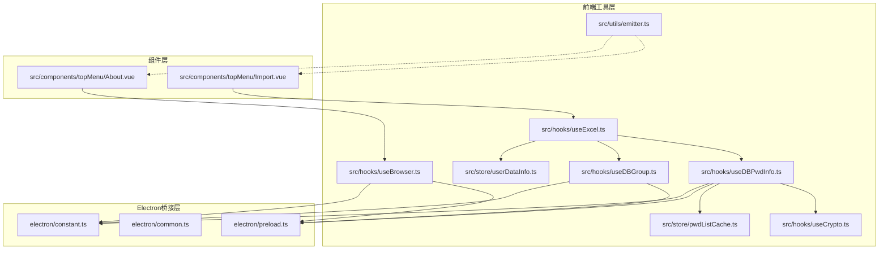
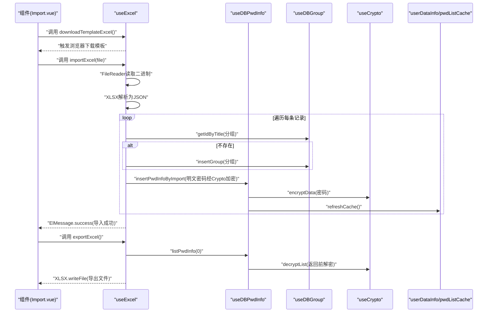
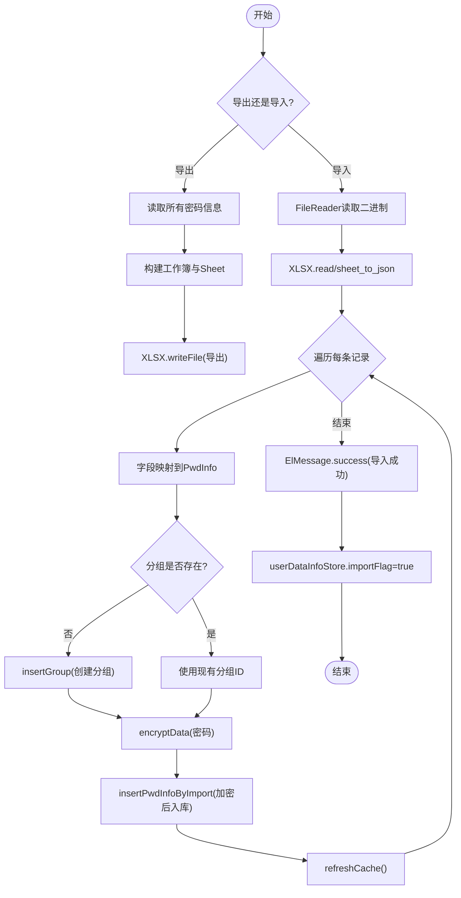
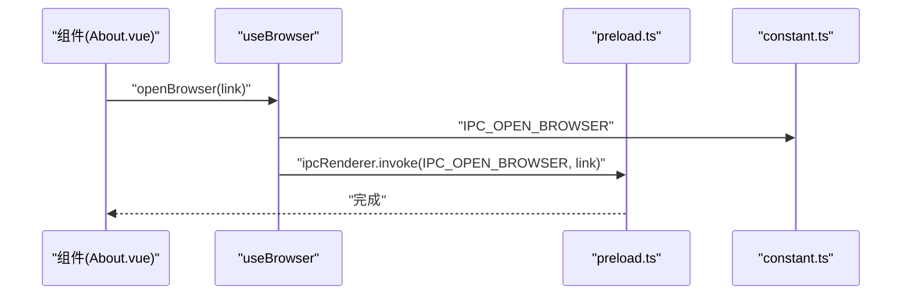
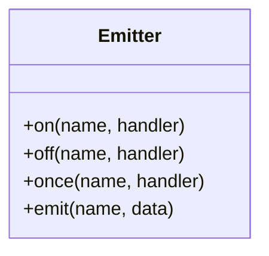
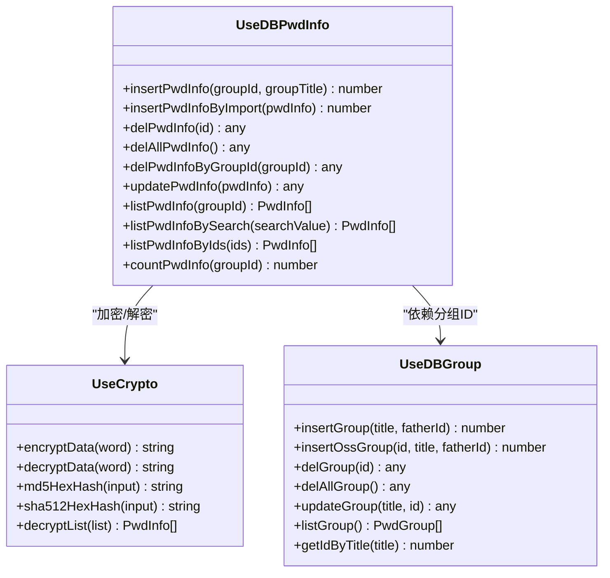
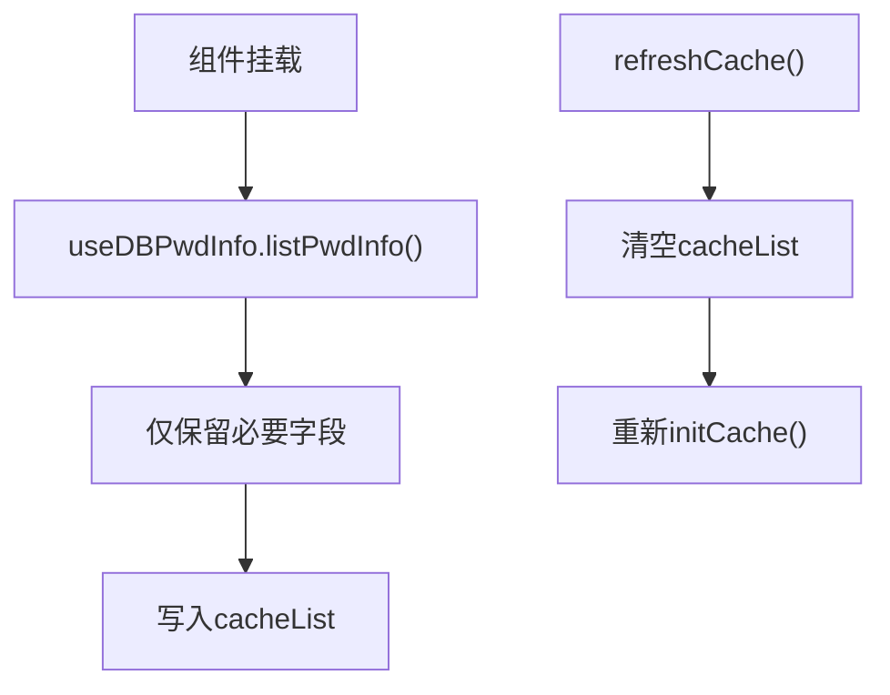
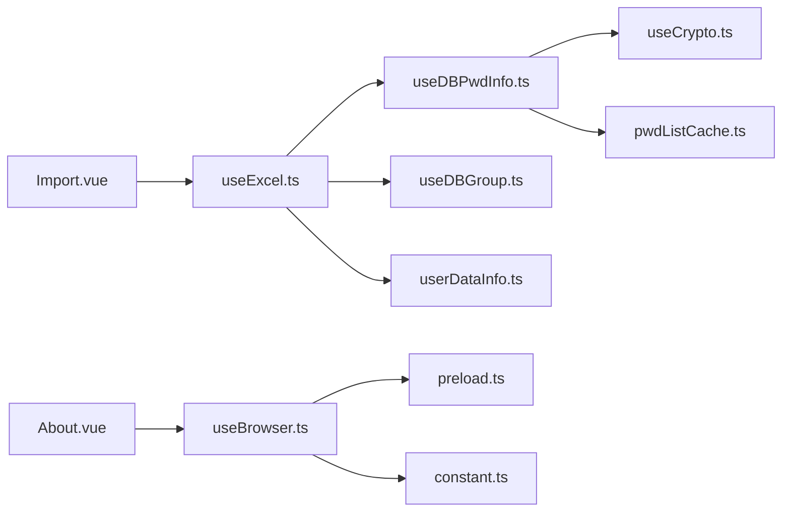

# 工具函数系统

<cite>
**本文引用的文件**
- [src/utils/emitter.ts](file://src/utils/emitter.ts)
- [src/hooks/useExcel.ts](file://src/hooks/useExcel.ts)
- [src/hooks/useBrowser.ts](file://src/hooks/useBrowser.ts)
- [src/hooks/useDBPwdInfo.ts](file://src/hooks/useDBPwdInfo.ts)
- [src/hooks/useDBGroup.ts](file://src/hooks/useDBGroup.ts)
- [src/hooks/useCrypto.ts](file://src/hooks/useCrypto.ts)
- [src/store/userDataInfo.ts](file://src/store/userDataInfo.ts)
- [src/store/pwdListCache.ts](file://src/store/pwdListCache.ts)
- [src/components/topMenu/Import.vue](file://src/components/topMenu/Import.vue)
- [src/components/topMenu/About.vue](file://src/components/topMenu/About.vue)
- [electron/common.ts](file://electron/common.ts)
- [electron/preload.ts](file://electron/preload.ts)
- [electron/constant.ts](file://electron/constant.ts)
</cite>

## 目录
1. [简介](#简介)
2. [项目结构](#项目结构)
3. [核心组件](#核心组件)
4. [架构总览](#架构总览)
5. [详细组件分析](#详细组件分析)
6. [依赖关系分析](#依赖关系分析)
7. [性能考虑](#性能考虑)
8. [故障排查指南](#故障排查指南)
9. [结论](#结论)
10. [附录](#附录)

## 简介
本文件系统性梳理工具函数体系，重点覆盖以下方面：
- Excel导入导出功能：模板下载、数据读取、字段映射、分组处理、批量写入与提示反馈
- 浏览器集成工具：通过IPC桥接打开外部链接，统一入口封装
- 事件总线机制：基于mitt的全局事件派发与订阅
- 文件操作与路径管理：模板文件定位、动态URL拼装、下载触发
- 通用事件处理：导入完成后的状态标记与缓存刷新
- 与其他模块的集成模式与扩展机制：Hook化封装、Pinia状态管理、Electron IPC通信
- 性能优化建议与常见问题解决方案

## 项目结构
工具函数系统主要分布在以下区域：
- 前端工具层：src/utils（事件总线）、src/hooks（业务工具）、src/store（状态）
- Electron桥接层：electron/preload.ts（上下文桥）、electron/common.ts（通用能力）、electron/constant.ts（IPC常量）
- 组件层：src/components/topMenu/*（UI交互与工具调用）

图表来源
- [src/utils/emitter.ts:1-16](file://src/utils/emitter.ts#L1-L16)
- [src/hooks/useExcel.ts:1-109](file://src/hooks/useExcel.ts#L1-L109)
- [src/hooks/useBrowser.ts:1-13](file://src/hooks/useBrowser.ts#L1-L13)
- [src/hooks/useDBPwdInfo.ts:1-103](file://src/hooks/useDBPwdInfo.ts#L1-L103)
- [src/hooks/useDBGroup.ts:1-53](file://src/hooks/useDBGroup.ts#L1-L53)
- [src/hooks/useCrypto.ts:1-77](file://src/hooks/useCrypto.ts#L1-L77)
- [src/store/userDataInfo.ts:1-76](file://src/store/userDataInfo.ts#L1-L76)
- [src/store/pwdListCache.ts:1-37](file://src/store/pwdListCache.ts#L1-L37)
- [src/components/topMenu/Import.vue:1-73](file://src/components/topMenu/Import.vue#L1-L73)
- [src/components/topMenu/About.vue:1-62](file://src/components/topMenu/About.vue#L1-L62)
- [electron/preload.ts:1-39](file://electron/preload.ts#L1-L39)
- [electron/common.ts:1-56](file://electron/common.ts#L1-L56)
- [electron/constant.ts:1-63](file://electron/constant.ts#L1-L63)

章节来源
- [src/utils/emitter.ts:1-16](file://src/utils/emitter.ts#L1-L16)
- [src/hooks/useExcel.ts:1-109](file://src/hooks/useExcel.ts#L1-L109)
- [src/hooks/useBrowser.ts:1-13](file://src/hooks/useBrowser.ts#L1-L13)
- [src/hooks/useDBPwdInfo.ts:1-103](file://src/hooks/useDBPwdInfo.ts#L1-L103)
- [src/hooks/useDBGroup.ts:1-53](file://src/hooks/useDBGroup.ts#L1-L53)
- [src/hooks/useCrypto.ts:1-77](file://src/hooks/useCrypto.ts#L1-L77)
- [src/store/userDataInfo.ts:1-76](file://src/store/userDataInfo.ts#L1-L76)
- [src/store/pwdListCache.ts:1-37](file://src/store/pwdListCache.ts#L1-L37)
- [src/components/topMenu/Import.vue:1-73](file://src/components/topMenu/Import.vue#L1-L73)
- [src/components/topMenu/About.vue:1-62](file://src/components/topMenu/About.vue#L1-L62)
- [electron/preload.ts:1-39](file://electron/preload.ts#L1-L39)
- [electron/common.ts:1-56](file://electron/common.ts#L1-L56)
- [electron/constant.ts:1-63](file://electron/constant.ts#L1-L63)

## 核心组件
- 事件总线：基于mitt的全局事件发射器，便于跨组件解耦通信
- Excel工具：封装导入、导出、模板下载，包含字段映射、分组查询/创建、批量插入与消息提示
- 浏览器工具：通过window.ipcRenderer.invoke调用主进程打开外部链接
- 数据库工具：封装密码信息与分组的增删改查，配合加密/解密与缓存刷新
- 加密工具：提供AES/CBC/PKCS7Padding加解密、MD5/SHA512摘要等
- 状态管理：用户导入标记、列表缓存刷新、当前选中项等

章节来源
- [src/utils/emitter.ts:1-16](file://src/utils/emitter.ts#L1-L16)
- [src/hooks/useExcel.ts:1-109](file://src/hooks/useExcel.ts#L1-L109)
- [src/hooks/useBrowser.ts:1-13](file://src/hooks/useBrowser.ts#L1-L13)
- [src/hooks/useDBPwdInfo.ts:1-103](file://src/hooks/useDBPwdInfo.ts#L1-L103)
- [src/hooks/useDBGroup.ts:1-53](file://src/hooks/useDBGroup.ts#L1-L53)
- [src/hooks/useCrypto.ts:1-77](file://src/hooks/useCrypto.ts#L1-L77)
- [src/store/userDataInfo.ts:1-76](file://src/store/userDataInfo.ts#L1-L76)
- [src/store/pwdListCache.ts:1-37](file://src/store/pwdListCache.ts#L1-L37)

## 架构总览
前端通过Hooks封装工具能力，组件直接消费；数据库访问通过Electron IPC桥接到主进程；事件总线提供跨组件通信。

图表来源
- [src/components/topMenu/Import.vue:1-73](file://src/components/topMenu/Import.vue#L1-L73)
- [src/hooks/useExcel.ts:1-109](file://src/hooks/useExcel.ts#L1-L109)
- [src/hooks/useDBPwdInfo.ts:1-103](file://src/hooks/useDBPwdInfo.ts#L1-L103)
- [src/hooks/useDBGroup.ts:1-53](file://src/hooks/useDBGroup.ts#L1-L53)
- [src/hooks/useCrypto.ts:1-77](file://src/hooks/useCrypto.ts#L1-L77)
- [src/store/userDataInfo.ts:1-76](file://src/store/userDataInfo.ts#L1-L76)
- [src/store/pwdListCache.ts:1-37](file://src/store/pwdListCache.ts#L1-L37)

## 详细组件分析

### Excel导入导出工具（useExcel）
- 导出流程
  - 读取全部密码信息（带解密），构造首行标题与数据行
  - 使用XLSX创建工作簿并写入Sheet，最终触发浏览器下载
- 导入流程
  - 读取文件二进制，解析为JSON数组
  - 字段映射到PwdInfo对象，缺失字段使用默认值
  - 分组处理：若分组不存在则创建，否则复用ID
  - 插入数据库：密码经加密后再入库，并刷新缓存
  - 成功提示与导入标记：导入完成后设置importFlag为true
- 模板下载
  - 通过fetch获取模板文件，创建临时下载链接并触发下载

图表来源
- [src/hooks/useExcel.ts:22-84](file://src/hooks/useExcel.ts#L22-L84)
- [src/hooks/useDBPwdInfo.ts:28-33](file://src/hooks/useDBPwdInfo.ts#L28-L33)
- [src/hooks/useDBGroup.ts:45-49](file://src/hooks/useDBGroup.ts#L45-L49)
- [src/hooks/useCrypto.ts:41-52](file://src/hooks/useCrypto.ts#L41-L52)
- [src/store/pwdListCache.ts:30-33](file://src/store/pwdListCache.ts#L30-L33)
- [src/store/userDataInfo.ts:56](file://src/store/userDataInfo.ts#L56)

章节来源
- [src/hooks/useExcel.ts:1-109](file://src/hooks/useExcel.ts#L1-L109)
- [src/hooks/useDBPwdInfo.ts:1-103](file://src/hooks/useDBPwdInfo.ts#L1-L103)
- [src/hooks/useDBGroup.ts:1-53](file://src/hooks/useDBGroup.ts#L1-L53)
- [src/hooks/useCrypto.ts:1-77](file://src/hooks/useCrypto.ts#L1-L77)
- [src/store/userDataInfo.ts:1-76](file://src/store/userDataInfo.ts#L1-L76)
- [src/store/pwdListCache.ts:1-37](file://src/store/pwdListCache.ts#L1-L37)

### 浏览器集成工具（useBrowser）
- 作用：封装打开外部链接的统一入口，避免在组件中直接依赖window.ipcRenderer
- 行为：当传入链接为空时直接返回；否则通过IPC通道调用主进程打开浏览器

图表来源
- [src/hooks/useBrowser.ts:1-13](file://src/hooks/useBrowser.ts#L1-L13)
- [electron/preload.ts:1-39](file://electron/preload.ts#L1-L39)
- [electron/constant.ts:51](file://electron/constant.ts#L51)

章节来源
- [src/hooks/useBrowser.ts:1-13](file://src/hooks/useBrowser.ts#L1-L13)
- [electron/preload.ts:1-39](file://electron/preload.ts#L1-L39)
- [electron/constant.ts:1-63](file://electron/constant.ts#L1-L63)

### 事件总线（mitt）
- 提供全局事件派发与订阅能力，便于跨组件解耦通信
- 使用mitt实例，支持on/off/onOnce/send/invoke等标准API

图表来源
- [src/utils/emitter.ts:1-16](file://src/utils/emitter.ts#L1-L16)

章节来源
- [src/utils/emitter.ts:1-16](file://src/utils/emitter.ts#L1-L16)

### 数据库与加密工具链
- useDBPwdInfo：封装密码信息的增删改查、搜索、计数；在写入/更新时进行加密，在读取时解密
- useDBGroup：封装分组的增删改查与ID查询
- useCrypto：提供AES/CBC/ZeroPadding加解密、MD5/SHA512摘要、列表解密

图表来源
- [src/hooks/useDBPwdInfo.ts:1-103](file://src/hooks/useDBPwdInfo.ts#L1-L103)
- [src/hooks/useDBGroup.ts:1-53](file://src/hooks/useDBGroup.ts#L1-L53)
- [src/hooks/useCrypto.ts:1-77](file://src/hooks/useCrypto.ts#L1-L77)

章节来源
- [src/hooks/useDBPwdInfo.ts:1-103](file://src/hooks/useDBPwdInfo.ts#L1-L103)
- [src/hooks/useDBGroup.ts:1-53](file://src/hooks/useDBGroup.ts#L1-L53)
- [src/hooks/useCrypto.ts:1-77](file://src/hooks/useCrypto.ts#L1-L77)

### 状态与缓存
- userDataInfo：维护导入标记、当前分组/密码项等用户态数据
- pwdListCache：初始化时拉取列表并仅保留必要字段，提供刷新接口

图表来源
- [src/store/pwdListCache.ts:15-33](file://src/store/pwdListCache.ts#L15-L33)
- [src/hooks/useDBPwdInfo.ts:65-70](file://src/hooks/useDBPwdInfo.ts#L65-L70)

章节来源
- [src/store/userDataInfo.ts:1-76](file://src/store/userDataInfo.ts#L1-L76)
- [src/store/pwdListCache.ts:1-37](file://src/store/pwdListCache.ts#L1-L37)
- [src/hooks/useDBPwdInfo.ts:1-103](file://src/hooks/useDBPwdInfo.ts#L1-L103)

## 依赖关系分析
- 组件依赖Hooks：Import.vue依赖useExcel，About.vue依赖useBrowser
- Hooks依赖Electron IPC：useBrowser、useDBPwdInfo、useDBGroup通过window.ipcRenderer.invoke与主进程通信
- 数据流：useExcel -> useDBGroup(分组) -> useDBPwdInfo(写入) -> useCrypto(加密) -> Pinia缓存/状态
- 事件总线：mitt作为可选通信手段，不直接耦合业务

图表来源
- [src/components/topMenu/Import.vue:1-73](file://src/components/topMenu/Import.vue#L1-L73)
- [src/components/topMenu/About.vue:1-62](file://src/components/topMenu/About.vue#L1-L62)
- [src/hooks/useExcel.ts:1-109](file://src/hooks/useExcel.ts#L1-L109)
- [src/hooks/useBrowser.ts:1-13](file://src/hooks/useBrowser.ts#L1-L13)
- [src/hooks/useDBPwdInfo.ts:1-103](file://src/hooks/useDBPwdInfo.ts#L1-L103)
- [src/hooks/useDBGroup.ts:1-53](file://src/hooks/useDBGroup.ts#L1-L53)
- [src/hooks/useCrypto.ts:1-77](file://src/hooks/useCrypto.ts#L1-L77)
- [src/store/userDataInfo.ts:1-76](file://src/store/userDataInfo.ts#L1-L76)
- [src/store/pwdListCache.ts:1-37](file://src/store/pwdListCache.ts#L1-L37)
- [electron/preload.ts:1-39](file://electron/preload.ts#L1-L39)
- [electron/constant.ts:1-63](file://electron/constant.ts#L1-L63)

章节来源
- [src/components/topMenu/Import.vue:1-73](file://src/components/topMenu/Import.vue#L1-L73)
- [src/components/topMenu/About.vue:1-62](file://src/components/topMenu/About.vue#L1-L62)
- [src/hooks/useExcel.ts:1-109](file://src/hooks/useExcel.ts#L1-L109)
- [src/hooks/useBrowser.ts:1-13](file://src/hooks/useBrowser.ts#L1-L13)
- [src/hooks/useDBPwdInfo.ts:1-103](file://src/hooks/useDBPwdInfo.ts#L1-L103)
- [src/hooks/useDBGroup.ts:1-53](file://src/hooks/useDBGroup.ts#L1-L53)
- [src/hooks/useCrypto.ts:1-77](file://src/hooks/useCrypto.ts#L1-L77)
- [src/store/userDataInfo.ts:1-76](file://src/store/userDataInfo.ts#L1-L76)
- [src/store/pwdListCache.ts:1-37](file://src/store/pwdListCache.ts#L1-L37)
- [electron/preload.ts:1-39](file://electron/preload.ts#L1-L39)
- [electron/constant.ts:1-63](file://electron/constant.ts#L1-L63)

## 性能考虑
- Excel导入
  - 大文件建议分批处理或后台任务，避免主线程阻塞
  - 批量插入前先进行去重与校验，减少无效写入
  - 导入完成后一次性刷新缓存，避免多次渲染
- 加密/解密
  - 解密列表在读取时执行，注意大数据量时的内存占用
  - AES加密采用CBC+ZeroPadding，确保前后端一致
- 缓存策略
  - 列表缓存仅保留必要字段，降低序列化与传输成本
  - 刷新缓存时清空再重建，保证一致性
- IPC通信
  - 合理拆分请求，避免一次传输过多数据
  - 对高频操作（如搜索）考虑本地缓存与防抖

## 故障排查指南
- Excel导入失败
  - 检查模板字段是否与代码映射一致（分组、标题、用户名、密码、链接、说明）
  - 确认分组存在或允许自动创建
  - 查看控制台错误日志与Element Plus提示
- 下载模板失败
  - 确认模板路径正确且可访问
  - 检查fetch响应与blob转换是否成功
- 打开外部链接异常
  - 确认IPC通道名称与主进程实现一致
  - 检查传入链接是否为空
- 导入后界面未刷新
  - 确认导入完成后调用了缓存刷新与状态标记
- 加密/解密异常
  - 确认密钥与IV长度与配置一致
  - 检查ZeroPadding导致的填充字符影响

章节来源
- [src/hooks/useExcel.ts:44-84](file://src/hooks/useExcel.ts#L44-L84)
- [src/hooks/useExcel.ts:88-106](file://src/hooks/useExcel.ts#L88-L106)
- [src/hooks/useBrowser.ts:5-10](file://src/hooks/useBrowser.ts#L5-L10)
- [src/hooks/useCrypto.ts:41-66](file://src/hooks/useCrypto.ts#L41-L66)
- [src/store/pwdListCache.ts:30-33](file://src/store/pwdListCache.ts#L30-L33)

## 结论
工具函数系统通过Hook化封装实现了清晰的职责分离：Excel导入导出、浏览器打开、事件总线、数据库访问与加密解密均以独立模块提供统一接口。结合Pinia状态与缓存，系统在易用性与性能之间取得平衡。后续可在大文件处理、并发写入与错误恢复等方面进一步增强。

## 附录
- 代码示例路径（不展示具体代码内容）
  - Excel导入：[src/components/topMenu/Import.vue:8](file://src/components/topMenu/Import.vue#L8)，[src/hooks/useExcel.ts:44-84](file://src/hooks/useExcel.ts#L44-L84)
  - Excel导出：[src/hooks/useExcel.ts:22-42](file://src/hooks/useExcel.ts#L22-L42)
  - 模板下载：[src/hooks/useExcel.ts:88-106](file://src/hooks/useExcel.ts#L88-L106)
  - 打开浏览器：[src/components/topMenu/About.vue:13](file://src/components/topMenu/About.vue#L13)，[src/hooks/useBrowser.ts:5-10](file://src/hooks/useBrowser.ts#L5-L10)
  - 事件总线：[src/utils/emitter.ts:1-16](file://src/utils/emitter.ts#L1-L16)
  - 数据库写入与加密：[src/hooks/useDBPwdInfo.ts:28-33](file://src/hooks/useDBPwdInfo.ts#L28-L33)，[src/hooks/useCrypto.ts:41-52](file://src/hooks/useCrypto.ts#L41-L52)
  - 缓存刷新：[src/store/pwdListCache.ts:30-33](file://src/store/pwdListCache.ts#L30-L33)
  - 导入标记：[src/store/userDataInfo.ts:56](file://src/store/userDataInfo.ts#L56)