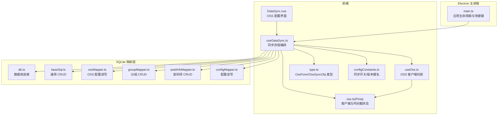
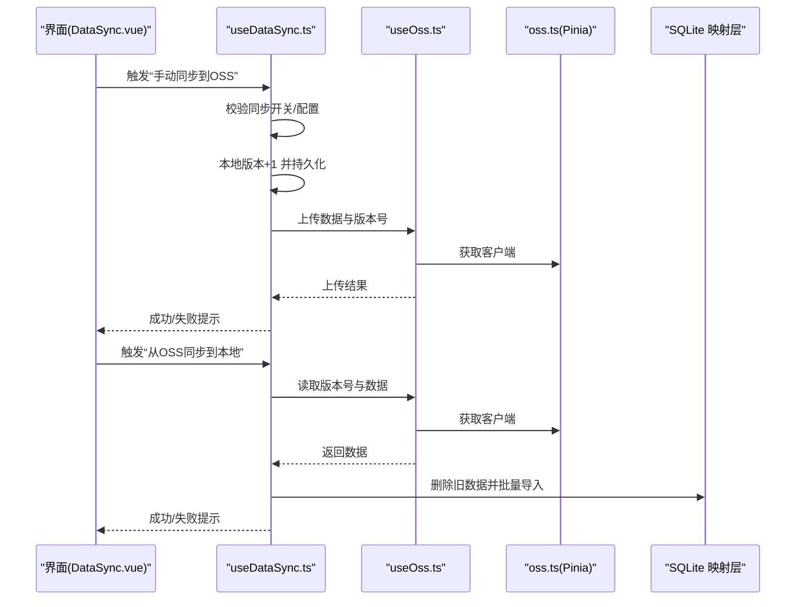
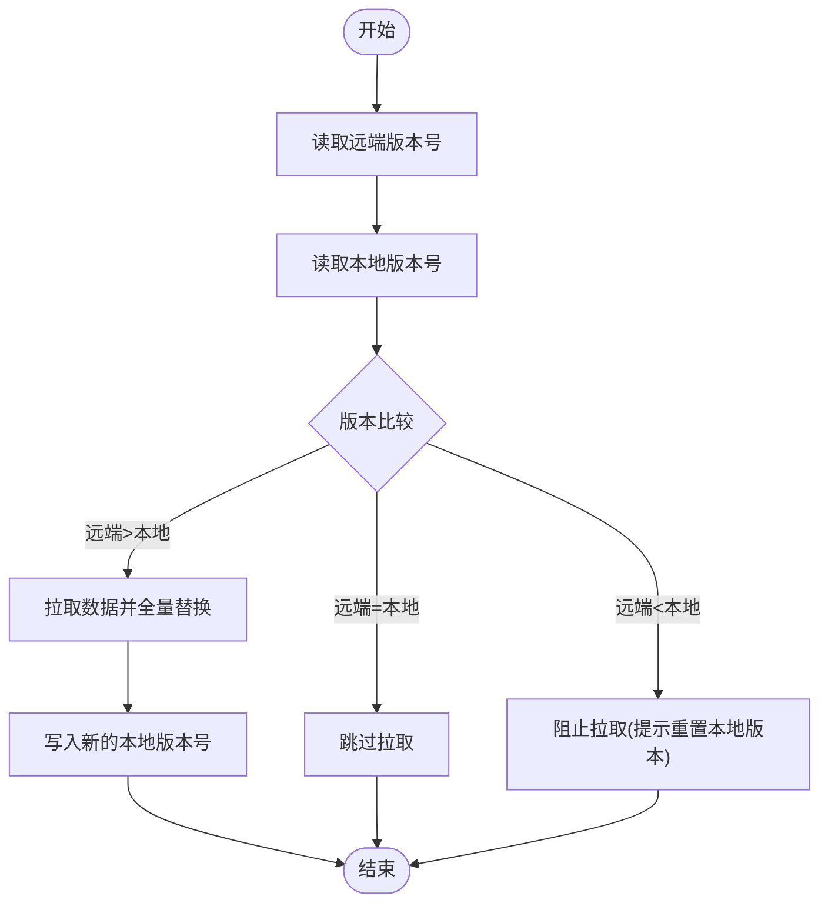
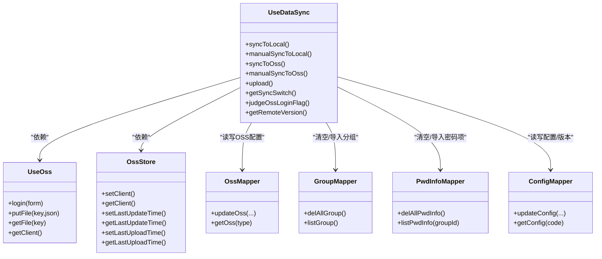

# 数据同步机制

<cite>
**本文引用的文件**
- [useDataSync.ts](file://src/hooks/useDataSync.ts)
- [useOss.ts](file://src/hooks/useOss.ts)
- [oss.ts（Pinia Store）](file://src/store/oss.ts)
- [DataSync.vue](file://src/components/setview/DataSync.vue)
- [type.ts](file://src/components/type.ts)
- [configConstants.ts](file://electron/db/sqlite/components/configConstants.ts)
- [useDBOss.ts](file://src/hooks/useDBOss.ts)
- [db.ts](file://electron/db/sqlite/components/db.ts)
- [baseSql.ts](file://electron/db/sqlite/components/baseSql.ts)
- [ossMapper.ts](file://electron/db/sqlite/mapper/oss.ts)
- [groupMapper.ts](file://electron/db/sqlite/mapper/group.ts)
- [pwdInfoMapper.ts](file://electron/db/sqlite/mapper/pwdInfo.ts)
- [configMapper.ts](file://electron/db/sqlite/mapper/config.ts)
- [main.ts](file://electron/main.ts)
- [config.ts](file://src/config/config.ts)
</cite>

## 目录
1. [简介](#简介)
2. [项目结构](#项目结构)
3. [核心组件](#核心组件)
4. [架构总览](#架构总览)
5. [详细组件分析](#详细组件分析)
6. [依赖关系分析](#依赖关系分析)
7. [性能考量](#性能考量)
8. [故障排查指南](#故障排查指南)
9. [结论](#结论)
10. [附录](#附录)

## 简介
本文件系统性阐述本地数据库与阿里云 OSS 的数据同步机制，覆盖同步策略、触发条件、冲突解决、状态管理、增量与全量同步的实现逻辑，并给出与 OSS 的集成方式、网络异常处理、性能优化与一致性保障措施。文中所有技术细节均基于仓库源码分析得出，避免臆测。

## 项目结构
围绕“数据同步”主题，相关代码主要分布在以下层次：
- 前端 Hook 层：负责同步流程编排、开关与版本控制、OSS 访问封装
- 前端 Store 层：维护 OSS 客户端与时间戳等轻量状态
- Electron 主进程与 SQLite 映射层：负责本地持久化、配置读写与 IPC 交互
- 配置与类型定义：统一 OSS 参数、同步对象结构与常量

图表来源
- [useDataSync.ts:1-324](file://src/hooks/useDataSync.ts#L1-L324)
- [useOss.ts:1-107](file://src/hooks/useOss.ts#L1-L107)
- [oss.ts（Pinia Store）:1-59](file://src/store/oss.ts#L1-L59)
- [DataSync.vue:1-69](file://src/components/setview/DataSync.vue#L1-L69)
- [type.ts:1-88](file://src/components/type.ts#L1-L88)
- [configConstants.ts:1-29](file://electron/db/sqlite/components/configConstants.ts#L1-L29)
- [main.ts:1-240](file://electron/main.ts#L1-L240)
- [db.ts:1-30](file://electron/db/sqlite/components/db.ts#L1-L30)
- [baseSql.ts:1-87](file://electron/db/sqlite/components/baseSql.ts#L1-L87)
- [ossMapper.ts:1-30](file://electron/db/sqlite/mapper/oss.ts#L1-L30)
- [groupMapper.ts:1-49](file://electron/db/sqlite/mapper/group.ts#L1-L49)
- [pwdInfoMapper.ts:1-100](file://electron/db/sqlite/mapper/pwdInfo.ts#L1-L100)
- [configMapper.ts:1-27](file://electron/db/sqlite/mapper/config.ts#L1-L27)

章节来源
- [useDataSync.ts:1-324](file://src/hooks/useDataSync.ts#L1-L324)
- [useOss.ts:1-107](file://src/hooks/useOss.ts#L1-L107)
- [oss.ts（Pinia Store）:1-59](file://src/store/oss.ts#L1-L59)
- [DataSync.vue:1-69](file://src/components/setview/DataSync.vue#L1-L69)
- [type.ts:1-88](file://src/components/type.ts#L1-L88)
- [configConstants.ts:1-29](file://electron/db/sqlite/components/configConstants.ts#L1-L29)
- [main.ts:1-240](file://electron/main.ts#L1-L240)
- [db.ts:1-30](file://electron/db/sqlite/components/db.ts#L1-L30)
- [baseSql.ts:1-87](file://electron/db/sqlite/components/baseSql.ts#L1-L87)
- [ossMapper.ts:1-30](file://electron/db/sqlite/mapper/oss.ts#L1-L30)
- [groupMapper.ts:1-49](file://electron/db/sqlite/mapper/group.ts#L1-L49)
- [pwdInfoMapper.ts:1-100](file://electron/db/sqlite/mapper/pwdInfo.ts#L1-L100)
- [configMapper.ts:1-27](file://electron/db/sqlite/mapper/config.ts#L1-L27)

## 核心组件
- useDataSync.ts：同步主控制器，负责开关判断、版本对比、全量拉取/推送、手动/自动触发、错误提示与消息通知
- useOss.ts：OSS 客户端封装，提供登录校验、文件上传/下载
- oss.ts（Pinia Store）：保存 OSS 客户端实例与最近更新/上传时间戳，用于策略扩展（定时上传）
- DataSync.vue：OSS 配置输入界面，绑定表单与测试连接
- type.ts：定义 OssForm、OssSyncObj 等数据模型
- configConstants.ts：集中管理同步开关、自动上传/下载开关、本地版本键名等常量
- SQLite 映射层：负责本地持久化，包括 OSS 配置、分组、密码项、通用配置

章节来源
- [useDataSync.ts:1-324](file://src/hooks/useDataSync.ts#L1-L324)
- [useOss.ts:1-107](file://src/hooks/useOss.ts#L1-L107)
- [oss.ts（Pinia Store）:1-59](file://src/store/oss.ts#L1-L59)
- [DataSync.vue:1-69](file://src/components/setview/DataSync.vue#L1-L69)
- [type.ts:1-88](file://src/components/type.ts#L1-L88)
- [configConstants.ts:1-29](file://electron/db/sqlite/components/configConstants.ts#L1-L29)

## 架构总览
本地应用通过 Electron 主进程与渲染进程通信，渲染进程内的 useDataSync 调用 useOss 与 SQLite 映射层，实现与阿里云 OSS 的双向同步。同步采用“版本号驱动”的全量替换策略，避免冲突；自动/手动触发由配置开关与用户操作决定。

图表来源
- [useDataSync.ts:133-201](file://src/hooks/useDataSync.ts#L133-L201)
- [useOss.ts:10-44](file://src/hooks/useOss.ts#L10-L44)
- [oss.ts（Pinia Store）:49-55](file://src/store/oss.ts#L49-L55)
- [configConstants.ts:15-18](file://electron/db/sqlite/components/configConstants.ts#L15-L18)

## 详细组件分析

### 同步策略与版本控制
- 版本号字段：本地版本号保存于本地配置表，键名为 local_version；OSS 中同时保存业务数据与一个独立的版本文件键名 ossVersion
- 版本比较：拉取前先读取 OSS 版本与本地版本，若本地版本更大或相等则拒绝拉取，避免回滚
- 推送前置：推送前本地版本+1，且仅当远端版本小于本地版本时允许推送，防止远端覆盖本地新数据
- 冲突解决：采用“全量替换”策略，即拉取时先清空本地对应表，再批量导入；未实现细粒度冲突合并

图表来源
- [useDataSync.ts:79-131](file://src/hooks/useDataSync.ts#L79-L131)
- [useDataSync.ts:238-251](file://src/hooks/useDataSync.ts#L238-L251)
- [configConstants.ts:15](file://electron/db/sqlite/components/configConstants.ts#L15)

章节来源
- [useDataSync.ts:79-131](file://src/hooks/useDataSync.ts#L79-L131)
- [useDataSync.ts:133-201](file://src/hooks/useDataSync.ts#L133-L201)
- [useDataSync.ts:238-251](file://src/hooks/useDataSync.ts#L238-L251)
- [configConstants.ts:15-18](file://electron/db/sqlite/components/configConstants.ts#L15-L18)

### 同步触发条件
- 自动触发
  - 应用挂载时尝试拉取：若开启自动下载开关，则在初始化阶段执行一次拉取
  - 推送触发：开启自动上传开关时，每次本地版本变更后尝试推送
- 手动触发
  - 用户点击界面按钮触发“同步到OSS”或“从OSS同步到本地”，包含参数校验与错误提示

章节来源
- [useDataSync.ts:34-49](file://src/hooks/useDataSync.ts#L34-L49)
- [useDataSync.ts:51-64](file://src/hooks/useDataSync.ts#L51-L64)
- [useDataSync.ts:155-171](file://src/hooks/useDataSync.ts#L155-L171)
- [configConstants.ts:17-18](file://electron/db/sqlite/components/configConstants.ts#L17-L18)

### 冲突解决机制
- 拉取前禁止回滚：若本地版本大于远端版本，提示需先重置本地版本再拉取
- 推送前禁止覆盖：若远端版本不小于本地版本，提示先拉取后再推送
- 全量替换：拉取时先清空本地对应表，再批量导入，避免并发写入导致的不一致

章节来源
- [useDataSync.ts:86-97](file://src/hooks/useDataSync.ts#L86-L97)
- [useDataSync.ts:146-151](file://src/hooks/useDataSync.ts#L146-L151)
- [useDataSync.ts:112-127](file://src/hooks/useDataSync.ts#L112-L127)

### 同步状态管理
- 本地状态
  - 本地版本号：通过配置表维护，作为同步依据
  - 同步开关与自动开关：通过配置表键值控制
- 远端状态
  - OSS 中保存业务数据与版本文件，版本文件键名固定
- 客户端状态
  - Pinia Store 中缓存 OSS 客户端实例，避免重复登录

章节来源
- [configConstants.ts:15-18](file://electron/db/sqlite/components/configConstants.ts#L15-L18)
- [useDataSync.ts:238-251](file://src/hooks/useDataSync.ts#L238-L251)
- [oss.ts（Pinia Store）:28-55](file://src/store/oss.ts#L28-L55)

### 增量同步与全量同步
- 当前实现：全量同步（拉取时清空并批量导入），未实现按记录级增量差异计算
- 优化方向：可在本地维护每条记录的变更时间戳，拉取时仅比较时间戳差异并增量导入

章节来源
- [useDataSync.ts:112-127](file://src/hooks/useDataSync.ts#L112-L127)

### 与阿里云 OSS 的集成
- 客户端初始化：根据本地 OSS 配置构造客户端，调用 list 接口进行连通性校验
- 文件读写：putFile 将 JSON 字符串写入指定键；getFile 读取指定键并解析返回
- 错误分类：针对不同错误码（如 AccessDenied、InvalidAccessKeyId 等）给出明确提示

章节来源
- [useOss.ts:10-27](file://src/hooks/useOss.ts#L10-L27)
- [useOss.ts:30-44](file://src/hooks/useOss.ts#L30-L44)
- [useOss.ts:82-99](file://src/hooks/useOss.ts#L82-L99)
- [useDataSync.ts:300-320](file://src/hooks/useDataSync.ts#L300-L320)

### 网络异常处理
- getFile/putFile 包裹在 try/catch 中，失败时返回空字符串或错误对象
- 登录失败时根据错误码映射具体原因并弹出通知
- 拉取流程中对空数据与状态码进行判空处理，避免异常分支

章节来源
- [useOss.ts:30-44](file://src/hooks/useOss.ts#L30-L44)
- [useOss.ts:82-99](file://src/hooks/useOss.ts#L82-L99)
- [useDataSync.ts:300-320](file://src/hooks/useDataSync.ts#L300-L320)

### 数据一致性保障
- 版本号驱动：通过版本号比较避免回滚与覆盖
- 全量替换：拉取时先删除再导入，确保最终状态与远端一致
- 事务支持：基础 SQL 工具提供事务注释与封装，可在批量导入时使用事务提升原子性

章节来源
- [useDataSync.ts:112-127](file://src/hooks/useDataSync.ts#L112-L127)
- [baseSql.ts:52-65](file://electron/db/sqlite/components/baseSql.ts#L52-L65)

### 错误恢复机制
- 拉取失败：提示“远程数据为空，请先推送数据再进行拉取”或“当前已是最新版本”
- 推送失败：提示“上传失败”，并记录错误日志
- 登录失败：根据错误码区分配置问题或权限问题，引导修复

章节来源
- [useDataSync.ts:86-97](file://src/hooks/useDataSync.ts#L86-L97)
- [useDataSync.ts:197-200](file://src/hooks/useDataSync.ts#L197-L200)
- [useDataSync.ts:300-320](file://src/hooks/useDataSync.ts#L300-L320)

### 数据模型与接口
- OssForm：OSS 连接参数（region、keyId、key_secret、bucket）
- OssSyncObj：同步对象，包含分组列表与密码项列表
- 配置常量：local_version、oss_sync_switch、oss_sync_auto_upload_switch、oss_sync_auto_download_switch

章节来源
- [type.ts:4-17](file://src/components/type.ts#L4-L17)
- [configConstants.ts:15-18](file://electron/db/sqlite/components/configConstants.ts#L15-L18)

## 依赖关系分析

图表来源
- [useDataSync.ts:1-324](file://src/hooks/useDataSync.ts#L1-L324)
- [useOss.ts:1-107](file://src/hooks/useOss.ts#L1-L107)
- [oss.ts（Pinia Store）:1-59](file://src/store/oss.ts#L1-L59)
- [ossMapper.ts:1-30](file://electron/db/sqlite/mapper/oss.ts#L1-L30)
- [groupMapper.ts:1-49](file://electron/db/sqlite/mapper/group.ts#L1-L49)
- [pwdInfoMapper.ts:1-100](file://electron/db/sqlite/mapper/pwdInfo.ts#L1-L100)
- [configMapper.ts:1-27](file://electron/db/sqlite/mapper/config.ts#L1-L27)

章节来源
- [useDataSync.ts:1-324](file://src/hooks/useDataSync.ts#L1-L324)
- [useOss.ts:1-107](file://src/hooks/useOss.ts#L1-L107)
- [oss.ts（Pinia Store）:1-59](file://src/store/oss.ts#L1-L59)
- [ossMapper.ts:1-30](file://electron/db/sqlite/mapper/oss.ts#L1-L30)
- [groupMapper.ts:1-49](file://electron/db/sqlite/mapper/group.ts#L1-L49)
- [pwdInfoMapper.ts:1-100](file://electron/db/sqlite/mapper/pwdInfo.ts#L1-L100)
- [configMapper.ts:1-27](file://electron/db/sqlite/mapper/config.ts#L1-L27)

## 性能考量
- 传输体积：当前以完整 JSON 文本传输，建议对大体量数据进行压缩或分片上传
- IO 次数：批量导入时建议使用事务包裹，减少磁盘刷写次数
- 网络重试：可在 putFile/getFile 外围增加指数退避重试与超时控制
- 并发控制：避免频繁触发同步，可通过 Pinia Store 维护 lastUploadTime 与 lastUpdateTime，限制短时间内的重复上传
- 缓存策略：Pinia Store 已具备客户端缓存，可进一步缓存版本号与最近变更时间

章节来源
- [oss.ts（Pinia Store）:33-47](file://src/store/oss.ts#L33-L47)
- [baseSql.ts:52-65](file://electron/db/sqlite/components/baseSql.ts#L52-L65)

## 故障排查指南
- 连接失败
  - 检查 region、bucket、accessKeyId、accessKeySecret 是否正确
  - 根据错误码定位：无效 keyId、签名不匹配、权限不足、网络请求错误等
- 拉取失败
  - 远端无数据：先推送本地数据再拉取
  - 版本不一致：若本地版本大于远端，需重置本地版本
- 推送失败
  - 远端版本不小于本地：先拉取再推送
  - 上传数据或版本号失败：查看错误日志并重试

章节来源
- [useDataSync.ts:86-97](file://src/hooks/useDataSync.ts#L86-L97)
- [useDataSync.ts:146-151](file://src/hooks/useDataSync.ts#L146-L151)
- [useDataSync.ts:197-200](file://src/hooks/useDataSync.ts#L197-L200)
- [useDataSync.ts:300-320](file://src/hooks/useDataSync.ts#L300-L320)

## 结论
本项目采用“版本号驱动 + 全量替换”的同步策略，结合本地配置与 Pinia Store 的轻量状态管理，实现了与阿里云 OSS 的稳定同步。当前未实现增量同步与细粒度冲突合并，建议在保持版本号机制的前提下，引入事务批量导入与重试机制，以进一步提升性能与可靠性。

## 附录
- OSS 配置界面：DataSync.vue 提供 region、keyId、key_secret、bucket 输入与“测试连接”“保存”按钮
- 快捷键与全局行为：主进程负责快捷键注册与窗口管理，与同步模块解耦

章节来源
- [DataSync.vue:1-69](file://src/components/setview/DataSync.vue#L1-L69)
- [main.ts:54-58](file://electron/main.ts#L54-L58)
- [config.ts:3-36](file://src/config/config.ts#L3-L36)