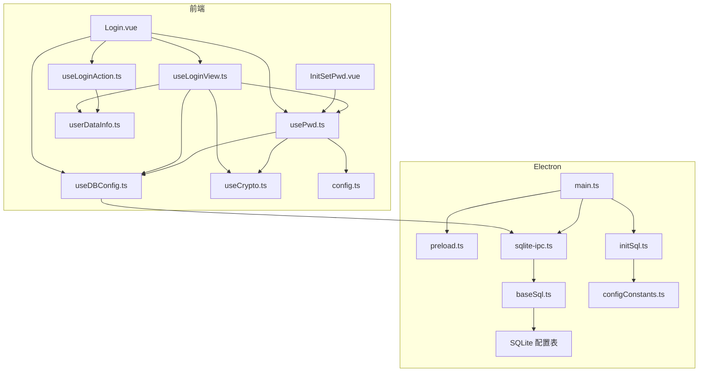
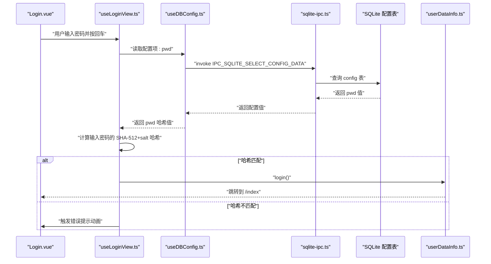
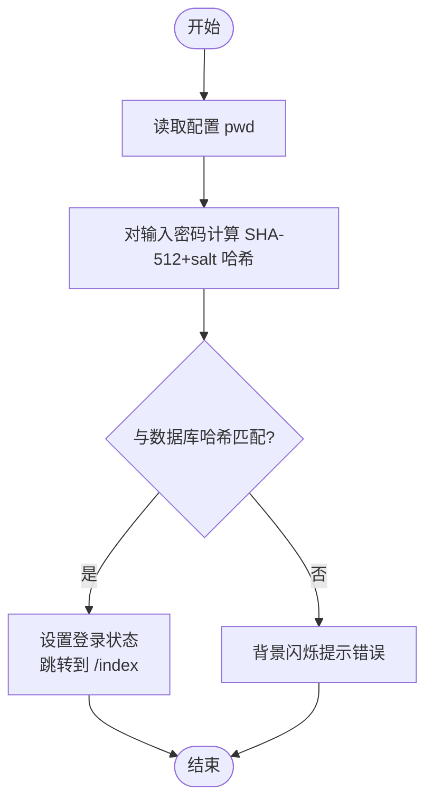
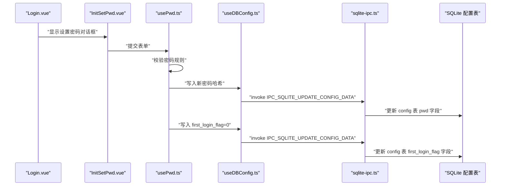
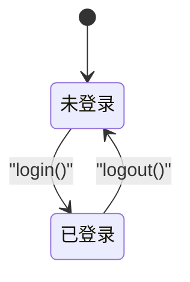
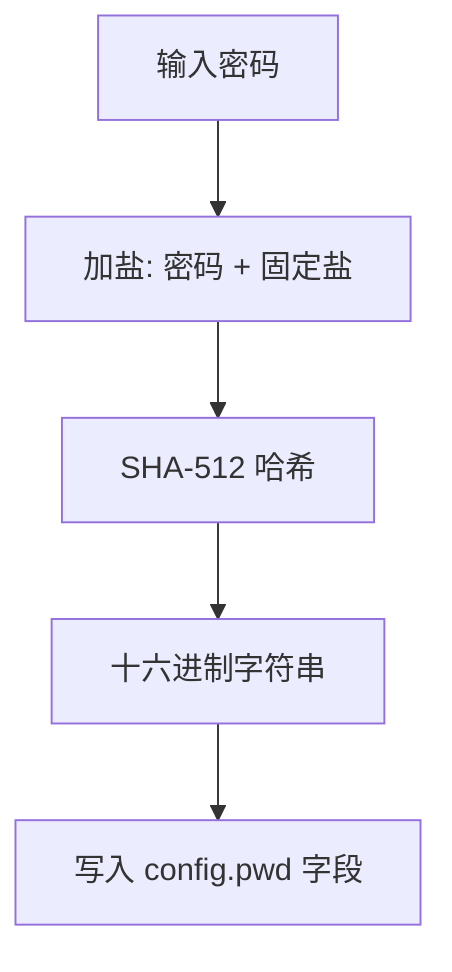
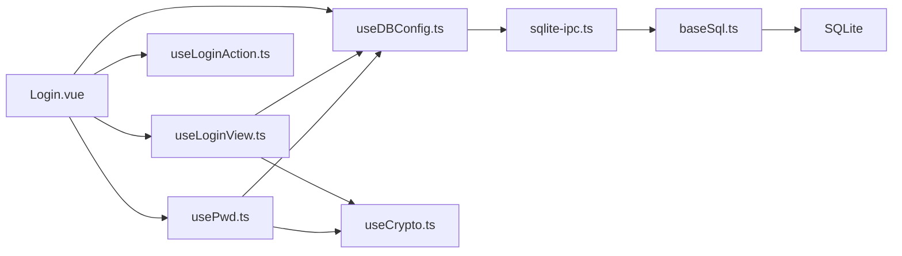

# 用户认证系统

<cite>
**本文档引用的文件**
- [Login.vue](file://src/components/Login.vue)
- [useLoginView.ts](file://src/hooks/useLoginView.ts)
- [useLoginAction.ts](file://src/hooks/useLoginAction.ts)
- [usePwd.ts](file://src/hooks/usePwd.ts)
- [useDBConfig.ts](file://src/hooks/useDBConfig.ts)
- [useCrypto.ts](file://src/hooks/useCrypto.ts)
- [userDataInfo.ts](file://src/store/userDataInfo.ts)
- [config.ts](file://src/config/config.ts)
- [configConstants.ts](file://electron/db/sqlite/components/configConstants.ts)
- [sqlite-ipc.ts](file://electron/db/sqlite/sqlite-ipc.ts)
- [baseSql.ts](file://electron/db/sqlite/components/baseSql.ts)
- [initSql.ts](file://electron/db/sqlite/components/initSql.ts)
- [main.ts](file://electron/main.ts)
- [preload.ts](file://electron/preload.ts)
- [InitSetPwd.vue](file://src/components/setview/InitSetPwd.vue)
</cite>

## 目录
1. [简介](#简介)
2. [项目结构](#项目结构)
3. [核心组件](#核心组件)
4. [架构总览](#架构总览)
5. [详细组件分析](#详细组件分析)
6. [依赖关系分析](#依赖关系分析)
7. [性能考虑](#性能考虑)
8. [故障排除指南](#故障排除指南)
9. [结论](#结论)
10. [附录](#附录)

## 简介
本文件面向密码管理器项目的用户认证系统，提供从登录验证、密码设置、会话管理到密码加密存储的完整技术文档。内容涵盖：
- 登录验证机制与状态流转
- 密码设置与修改流程
- 会话状态管理与UI交互
- 密码加密存储策略
- 与Electron IPC的集成
- 错误处理与安全最佳实践

## 项目结构
认证系统由前端Vue组件与Hook、Pinia状态管理、Electron主进程IPC以及本地SQLite配置表组成。关键模块如下：
- 前端登录界面与交互：Login.vue、InitSetPwd.vue
- 认证逻辑Hook：useLoginView.ts、useLoginAction.ts、usePwd.ts
- 配置读写Hook：useDBConfig.ts
- 加密工具：useCrypto.ts
- 应用状态：userDataInfo.ts
- Electron主进程：main.ts、sqlite-ipc.ts、preload.ts
- 数据库初始化与常量：initSql.ts、configConstants.ts、baseSql.ts
- 全局配置：config.ts

**图表来源**
- [Login.vue:1-129](file://src/components/Login.vue#L1-L129)
- [useLoginView.ts:1-54](file://src/hooks/useLoginView.ts#L1-L54)
- [useLoginAction.ts:1-19](file://src/hooks/useLoginAction.ts#L1-L19)
- [usePwd.ts:1-166](file://src/hooks/usePwd.ts#L1-L166)
- [useDBConfig.ts:1-21](file://src/hooks/useDBConfig.ts#L1-L21)
- [userDataInfo.ts:1-76](file://src/store/userDataInfo.ts#L1-L76)
- [useCrypto.ts:1-77](file://src/hooks/useCrypto.ts#L1-L77)
- [config.ts:1-143](file://src/config/config.ts#L1-L143)
- [main.ts:1-240](file://electron/main.ts#L1-L240)
- [preload.ts:1-39](file://electron/preload.ts#L1-L39)
- [sqlite-ipc.ts:1-220](file://electron/db/sqlite/sqlite-ipc.ts#L1-L220)
- [baseSql.ts:1-87](file://electron/db/sqlite/components/baseSql.ts#L1-L87)
- [initSql.ts:1-224](file://electron/db/sqlite/components/initSql.ts#L1-L224)
- [configConstants.ts:1-29](file://electron/db/sqlite/components/configConstants.ts#L1-L29)

**章节来源**
- [Login.vue:1-129](file://src/components/Login.vue#L1-L129)
- [useLoginView.ts:1-54](file://src/hooks/useLoginView.ts#L1-L54)
- [useLoginAction.ts:1-19](file://src/hooks/useLoginAction.ts#L1-L19)
- [usePwd.ts:1-166](file://src/hooks/usePwd.ts#L1-L166)
- [useDBConfig.ts:1-21](file://src/hooks/useDBConfig.ts#L1-L21)
- [userDataInfo.ts:1-76](file://src/store/userDataInfo.ts#L1-L76)
- [useCrypto.ts:1-77](file://src/hooks/useCrypto.ts#L1-L77)
- [config.ts:1-143](file://src/config/config.ts#L1-L143)
- [main.ts:1-240](file://electron/main.ts#L1-L240)
- [preload.ts:1-39](file://electron/preload.ts#L1-L39)
- [sqlite-ipc.ts:1-220](file://electron/db/sqlite/sqlite-ipc.ts#L1-L220)
- [baseSql.ts:1-87](file://electron/db/sqlite/components/baseSql.ts#L1-L87)
- [initSql.ts:1-224](file://electron/db/sqlite/components/initSql.ts#L1-L224)
- [configConstants.ts:1-29](file://electron/db/sqlite/components/configConstants.ts#L1-L29)

## 核心组件
- 登录视图与交互：负责首次登录检测、密码输入、Caps Lock提示、Enter键触发登录。
- 登录逻辑Hook：封装密码校验、登录成功/失败处理、与Pinia状态联动。
- 密码设置与修改：提供初始密码设置对话框、密码强度校验、旧密码验证与更新。
- 配置读写Hook：通过Electron IPC访问SQLite配置表，读取/写入密码与首次登录标志。
- 加密工具：提供SHA-512加盐哈希、AES对称加解密、MD5辅助等。
- 应用状态：维护登录状态、自动锁屏时间、当前分组/密码项等。
- Electron主进程：注册IPC通道、初始化数据库、暴露预加载接口。

**章节来源**
- [Login.vue:1-129](file://src/components/Login.vue#L1-L129)
- [useLoginView.ts:1-54](file://src/hooks/useLoginView.ts#L1-L54)
- [usePwd.ts:1-166](file://src/hooks/usePwd.ts#L1-L166)
- [useDBConfig.ts:1-21](file://src/hooks/useDBConfig.ts#L1-L21)
- [useCrypto.ts:1-77](file://src/hooks/useCrypto.ts#L1-L77)
- [userDataInfo.ts:1-76](file://src/store/userDataInfo.ts#L1-L76)
- [main.ts:1-240](file://electron/main.ts#L1-L240)

## 架构总览
认证系统采用“前端UI + Hook逻辑 + Pinia状态 + Electron IPC + SQLite配置表”的分层架构。登录流程的关键路径如下：

**图表来源**
- [Login.vue:45-50](file://src/components/Login.vue#L45-L50)
- [useLoginView.ts:45-50](file://src/hooks/useLoginView.ts#L45-L50)
- [useDBConfig.ts:6-13](file://src/hooks/useDBConfig.ts#L6-L13)
- [sqlite-ipc.ts:92-95](file://electron/db/sqlite/sqlite-ipc.ts#L92-L95)
- [baseSql.ts:21-32](file://electron/db/sqlite/components/baseSql.ts#L21-L32)
- [userDataInfo.ts:41-46](file://src/store/userDataInfo.ts#L41-L46)

## 详细组件分析

### 登录验证机制
- 输入监听：Login.vue监听Enter键，调用useLoginView的handleEnter。
- 配置读取：useDBConfig通过IPC调用sqlite-ipc.ts的SELECT_CONFIG_DATA，读取配置表中的pwd字段。
- 哈希比对：useLoginView使用useCrypto的sha512HexHash对输入密码进行加盐哈希，与数据库中保存的哈希进行比较。
- 成功处理：匹配则调用useLoginAction的login，切换到/index并设置登录状态；失败则触发动画提示错误。
- Caps Lock提示：useLoginView监听键盘事件，实时反馈Caps Lock状态。

**图表来源**
- [useLoginView.ts:45-50](file://src/hooks/useLoginView.ts#L45-L50)
- [useDBConfig.ts:6-13](file://src/hooks/useDBConfig.ts#L6-L13)
- [sqlite-ipc.ts:92-95](file://electron/db/sqlite/sqlite-ipc.ts#L92-L95)
- [baseSql.ts:21-32](file://electron/db/sqlite/components/baseSql.ts#L21-L32)
- [userDataInfo.ts:41-46](file://src/store/userDataInfo.ts#L41-L46)

**章节来源**
- [Login.vue:62-84](file://src/components/Login.vue#L62-L84)
- [useLoginView.ts:17-50](file://src/hooks/useLoginView.ts#L17-L50)
- [useDBConfig.ts:6-13](file://src/hooks/useDBConfig.ts#L6-L13)
- [sqlite-ipc.ts:92-95](file://electron/db/sqlite/sqlite-ipc.ts#L92-L95)
- [baseSql.ts:21-32](file://electron/db/sqlite/components/baseSql.ts#L21-L32)
- [userDataInfo.ts:41-46](file://src/store/userDataInfo.ts#L41-L46)

### 密码设置流程
- 首次登录检测：Login.vue在挂载时读取first_login_flag，若为1则弹出设置密码对话框。
- 设置对话框：InitSetPwd.vue提供密码与确认密码输入，规则由usePwd.ts定义。
- 提交处理：usePwd.ts的loginSubmitForm对输入进行校验，通过后将新密码经sha512HexHash写入数据库，并将first_login_flag置为0。
- IPC通信：useDBConfig.ts通过invoke IPC_SQLITE_UPDATE_CONFIG_DATA写入配置表。

**图表来源**
- [Login.vue:40-53](file://src/components/Login.vue#L40-L53)
- [InitSetPwd.vue:12-42](file://src/components/setview/InitSetPwd.vue#L12-L42)
- [usePwd.ts:22-35](file://src/hooks/usePwd.ts#L22-L35)
- [usePwd.ts:73-92](file://src/hooks/usePwd.ts#L73-L92)
- [useDBConfig.ts:15-18](file://src/hooks/useDBConfig.ts#L15-L18)
- [sqlite-ipc.ts:86-89](file://electron/db/sqlite/sqlite-ipc.ts#L86-L89)
- [baseSql.ts:67-81](file://electron/db/sqlite/components/baseSql.ts#L67-L81)

**章节来源**
- [Login.vue:40-53](file://src/components/Login.vue#L40-L53)
- [InitSetPwd.vue:12-42](file://src/components/setview/InitSetPwd.vue#L12-L42)
- [usePwd.ts:22-35](file://src/hooks/usePwd.ts#L22-L35)
- [usePwd.ts:73-92](file://src/hooks/usePwd.ts#L73-L92)
- [useDBConfig.ts:15-18](file://src/hooks/useDBConfig.ts#L15-L18)
- [sqlite-ipc.ts:86-89](file://electron/db/sqlite/sqlite-ipc.ts#L86-L89)

### 会话管理与状态控制
- 登录状态：userDataInfo.ts维护loginFlag，login()设为true，logout()设为false。
- 登出处理：useLoginAction.ts的logout将location.hash切换到/login并调用store.logout()，同时关闭搜索视图。
- 自动锁屏：store提供lockTime与timeUnit，用于后续自动锁屏逻辑（当前未在登录流程中直接体现）。

**图表来源**
- [userDataInfo.ts:41-46](file://src/store/userDataInfo.ts#L41-L46)
- [useLoginAction.ts:7-16](file://src/hooks/useLoginAction.ts#L7-L16)

**章节来源**
- [userDataInfo.ts:41-46](file://src/store/userDataInfo.ts#L41-L46)
- [useLoginAction.ts:7-16](file://src/hooks/useLoginAction.ts#L7-L16)

### 密码加密存储实现
- 存储策略：数据库config表的pwd字段存储的是SHA-512+salt后的十六进制哈希值，不存储明文密码。
- 加盐机制：useCrypto.ts对输入密码追加固定salt后再进行SHA-512计算，提升抗彩虹表能力。
- 默认值：initSql.ts在首次初始化时向config表写入默认密码哈希（来自config.ts的defaultPwd）。
- 配置常量：configConstants.ts定义了pwd、firstLoginFlag等配置键名。

**图表来源**
- [useCrypto.ts:24-29](file://src/hooks/useCrypto.ts#L24-L29)
- [config.ts:22](file://src/config/config.ts#L22)
- [initSql.ts:164-183](file://electron/db/sqlite/components/initSql.ts#L164-L183)
- [configConstants.ts:5](file://electron/db/sqlite/components/configConstants.ts#L5)

**章节来源**
- [useCrypto.ts:24-29](file://src/hooks/useCrypto.ts#L24-L29)
- [config.ts:22](file://src/config/config.ts#L22)
- [initSql.ts:164-183](file://electron/db/sqlite/components/initSql.ts#L164-L183)
- [configConstants.ts:5](file://electron/db/sqlite/components/configConstants.ts#L5)

### 与UI组件的交互模式
- Login.vue：负责焦点切换、首登检测、Caps Lock提示、Enter键触发。
- InitSetPwd.vue：模态对话框，绑定usePwd.ts的表单规则与提交函数。
- usePwd.ts：集中处理密码设置/修改的表单校验、错误提示、消息提示与对话框关闭逻辑。
- useLoginView.ts：封装登录入口逻辑，连接配置读取、哈希计算与状态变更。

**章节来源**
- [Login.vue:13-53](file://src/components/Login.vue#L13-L53)
- [InitSetPwd.vue:12-42](file://src/components/setview/InitSetPwd.vue#L12-L42)
- [usePwd.ts:101-116](file://src/hooks/usePwd.ts#L101-L116)
- [useLoginView.ts:17-50](file://src/hooks/useLoginView.ts#L17-L50)

### 错误处理机制
- 登录错误：usePwd.ts的pwdError通过改变容器背景色并延时恢复，形成视觉反馈。
- 首次登录退出：usePwd.ts的handleClose在用户取消设置时，将first_login_flag置为0并提示默认密码。
- IPC异常：baseSql.ts在查询/更新失败时返回null或0并记录错误日志，避免前端崩溃。

**章节来源**
- [usePwd.ts:101-116](file://src/hooks/usePwd.ts#L101-L116)
- [usePwd.ts:118-141](file://src/hooks/usePwd.ts#L118-L141)
- [baseSql.ts:16-19](file://electron/db/sqlite/components/baseSql.ts#L16-L19)
- [baseSql.ts:44-47](file://electron/db/sqlite/components/baseSql.ts#L44-L47)

## 依赖关系分析
- 组件耦合：
  - Login.vue依赖useLoginView、useDBConfig、usePwd、useLoginAction。
  - useLoginView依赖useCrypto、useDBConfig、useLoginAction。
  - usePwd依赖useDBConfig、useCrypto、config.ts。
  - useDBConfig依赖preload.ts暴露的ipcRenderer.invoke。
- 外部依赖：
  - Electron主进程通过sqlite-ipc.ts注册IPC通道，统一处理SQLite读写。
  - baseSql.ts封装基础查询/更新逻辑，initSql.ts负责首次初始化与默认数据写入。

**图表来源**
- [Login.vue:1-129](file://src/components/Login.vue#L1-L129)
- [useLoginView.ts:1-54](file://src/hooks/useLoginView.ts#L1-L54)
- [useLoginAction.ts:1-19](file://src/hooks/useLoginAction.ts#L1-L19)
- [usePwd.ts:1-166](file://src/hooks/usePwd.ts#L1-L166)
- [useDBConfig.ts:1-21](file://src/hooks/useDBConfig.ts#L1-L21)
- [sqlite-ipc.ts:1-220](file://electron/db/sqlite/sqlite-ipc.ts#L1-L220)
- [baseSql.ts:1-87](file://electron/db/sqlite/components/baseSql.ts#L1-L87)

**章节来源**
- [Login.vue:1-129](file://src/components/Login.vue#L1-L129)
- [useLoginView.ts:1-54](file://src/hooks/useLoginView.ts#L1-L54)
- [useLoginAction.ts:1-19](file://src/hooks/useLoginAction.ts#L1-L19)
- [usePwd.ts:1-166](file://src/hooks/usePwd.ts#L1-L166)
- [useDBConfig.ts:1-21](file://src/hooks/useDBConfig.ts#L1-L21)
- [sqlite-ipc.ts:1-220](file://electron/db/sqlite/sqlite-ipc.ts#L1-L220)
- [baseSql.ts:1-87](file://electron/db/sqlite/components/baseSql.ts#L1-L87)

## 性能考虑
- 哈希计算：SHA-512在现代CPU上开销较小，适合本地快速验证。
- IPC调用：配置读写通过一次IPC往返完成，避免频繁多次调用。
- 数据库初始化：initSql.ts仅在首次安装时执行，后续复用现有表结构。
- 建议：
  - 对于大量密码项的场景，可考虑在内存中缓存常用配置键值，减少IPC频率。
  - 登录失败的视觉反馈应保持简洁，避免过度动画影响响应速度。

[本节为通用指导，无需特定文件来源]

## 故障排除指南
- 无法登录
  - 检查config表pwd字段是否正确写入哈希值（参考初始化默认值）。
  - 确认useCrypto的加盐逻辑与数据库一致。
  - 查看baseSql.ts的查询/更新异常日志。
- 首次登录未弹窗
  - 确认first_login_flag是否为1，且Login.vue的首登检测逻辑正常。
  - 检查preload.ts暴露的ipcRenderer.invoke是否可用。
- 密码修改无效
  - usePwd.ts的submitForm会先校验旧密码哈希，确认旧密码输入正确。
  - 检查IPC_SQLITE_UPDATE_CONFIG_DATA是否成功写入新哈希。

**章节来源**
- [initSql.ts:164-183](file://electron/db/sqlite/components/initSql.ts#L164-L183)
- [baseSql.ts:16-19](file://electron/db/sqlite/components/baseSql.ts#L16-L19)
- [baseSql.ts:44-47](file://electron/db/sqlite/components/baseSql.ts#L44-L47)
- [usePwd.ts:73-92](file://src/hooks/usePwd.ts#L73-L92)
- [preload.ts:17-20](file://electron/preload.ts#L17-L20)

## 结论
本认证系统通过“前端Hook + Pinia状态 + Electron IPC + SQLite配置表”的组合，实现了轻量级的本地登录验证与密码管理。核心优势在于：
- 密码以SHA-512+salt哈希形式存储，具备基本抗破解能力。
- 首次登录引导与密码设置流程清晰，用户体验友好。
- 登录状态与UI交互解耦，便于扩展其他会话控制功能。

建议后续增强方向：
- 引入自动锁屏定时器与解锁流程。
- 增强错误日志与监控上报。
- 对敏感操作增加二次确认与审计日志。

[本节为总结性内容，无需特定文件来源]

## 附录
- 安全最佳实践
  - 使用强盐与足够迭代次数的哈希算法（当前为SHA-512+固定盐）。
  - 限制登录尝试次数与重试间隔，防止暴力破解。
  - 对配置表访问进行权限控制，避免被外部读取。
  - 定期轮换salt与密钥，降低长期泄露风险。
- 常见问题
  - 忘记登录密码：当前版本不提供找回，需重新初始化或联系开发者（不建议）。
  - 数据库损坏：备份config表，必要时重建默认配置。

[本节为通用指导，无需特定文件来源]