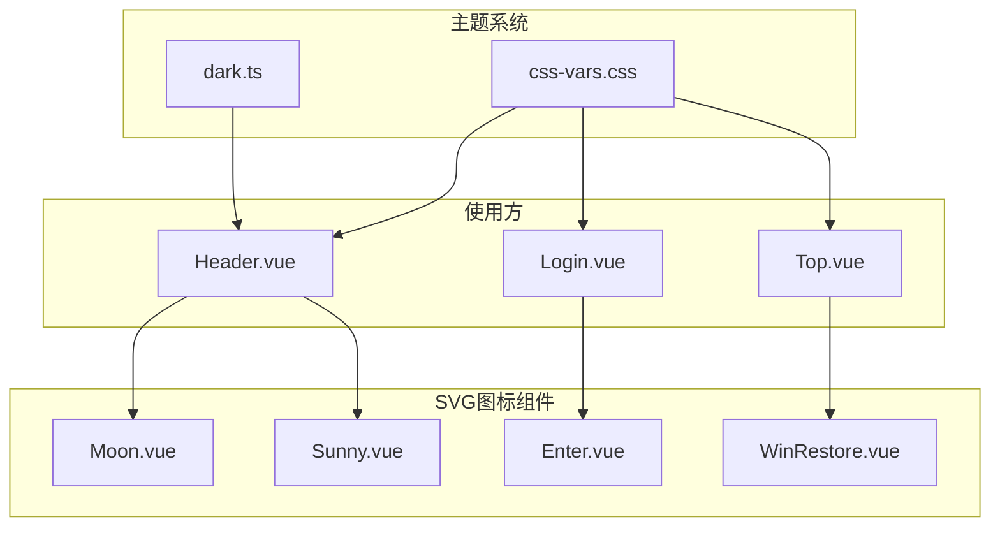
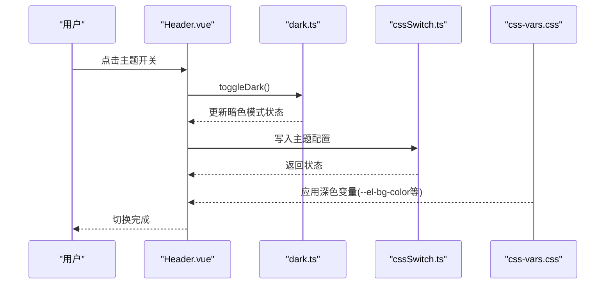
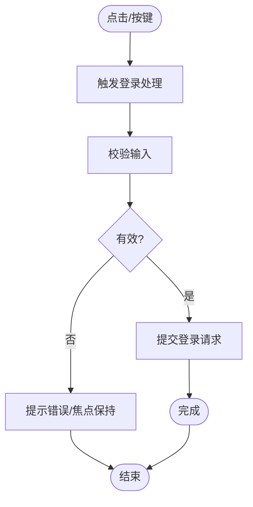
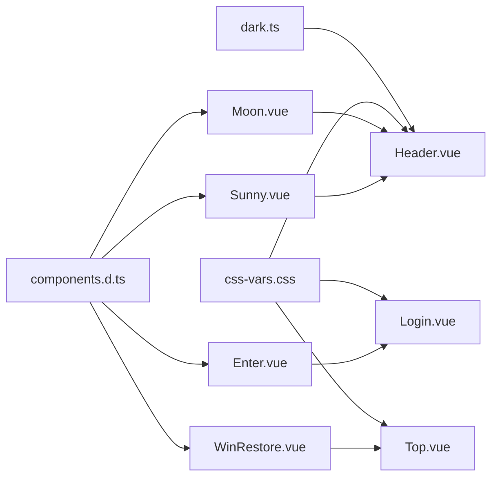

# UI辅助组件

<cite>
**本文引用的文件**
- [Enter.vue](file://src/components/svg/Enter.vue)
- [Moon.vue](file://src/components/svg/Moon.vue)
- [Sunny.vue](file://src/components/svg/Sunny.vue)
- [WinRestore.vue](file://src/components/svg/WinRestore.vue)
- [Login.vue](file://src/components/Login.vue)
- [Header.vue](file://src/components/indexview/Header.vue)
- [Top.vue](file://src/components/indexview/Top.vue)
- [dark.ts](file://src/styles/dark/dark.ts)
- [css-vars.css](file://src/styles/dark/style/css-vars.css)
- [cssSwitch.ts](file://src/store/cssSwitch.ts)
- [components.d.ts](file://components.d.ts)
</cite>

## 目录
1. [简介](#简介)
2. [项目结构](#项目结构)
3. [核心组件](#核心组件)
4. [架构总览](#架构总览)
5. [详细组件分析](#详细组件分析)
6. [依赖关系分析](#依赖关系分析)
7. [性能考量](#性能考量)
8. [故障排查指南](#故障排查指南)
9. [结论](#结论)
10. [附录](#附录)

## 简介
本文件聚焦于UI辅助组件中的SVG图标体系，系统梳理Enter回车图标、Moon月亮图标、Sunny太阳图标与WinRestore窗口还原图标的实现理念、尺寸规范、颜色适配与使用场景。文档阐述这些组件在主题切换、状态指示与用户交互中的作用，并给出技术实现要点、性能优化建议、可访问性支持、组件复用模式、样式继承与响应式适配方案，以及图标库的维护策略与扩展方法。

## 项目结构
SVG图标位于统一的组件目录下，按功能命名，便于集中管理与复用。主题切换逻辑通过VueUse的暗色模式钩子与CSS变量实现，图标在不同主题下的颜色表现由currentColor驱动，确保与全局主题一致。

图表来源
- [Enter.vue:1-26](file://src/components/svg/Enter.vue#L1-L26)
- [Moon.vue:1-24](file://src/components/svg/Moon.vue#L1-L24)
- [Sunny.vue:1-34](file://src/components/svg/Sunny.vue#L1-L34)
- [WinRestore.vue:1-33](file://src/components/svg/WinRestore.vue#L1-L33)
- [Login.vue:1-129](file://src/components/Login.vue#L1-L129)
- [Header.vue:1-257](file://src/components/indexview/Header.vue#L1-L257)
- [Top.vue:1-108](file://src/components/indexview/Top.vue#L1-L108)
- [dark.ts:1-5](file://src/styles/dark/dark.ts#L1-L5)
- [css-vars.css:1-10](file://src/styles/dark/style/css-vars.css#L1-L10)

章节来源
- [Enter.vue:1-26](file://src/components/svg/Enter.vue#L1-L26)
- [Moon.vue:1-24](file://src/components/svg/Moon.vue#L1-L24)
- [Sunny.vue:1-34](file://src/components/svg/Sunny.vue#L1-L34)
- [WinRestore.vue:1-33](file://src/components/svg/WinRestore.vue#L1-L33)
- [Login.vue:1-129](file://src/components/Login.vue#L1-L129)
- [Header.vue:1-257](file://src/components/indexview/Header.vue#L1-L257)
- [Top.vue:1-108](file://src/components/indexview/Top.vue#L1-L108)
- [dark.ts:1-5](file://src/styles/dark/dark.ts#L1-L5)
- [css-vars.css:1-10](file://src/styles/dark/style/css-vars.css#L1-L10)

## 核心组件
- Enter回车图标：用于登录输入框的后缀按钮，承载“登录”动作，尺寸固定且与输入框高度对齐，采用currentColor以适配主题色。
- Moon月亮图标：作为Element Switch的激活图标，用于深色主题切换，路径采用黑色填充，配合主题切换逻辑实现明暗对比。
- Sunny太阳图标：作为Element Switch的非激活图标，用于浅色主题切换，路径采用黑色填充，与Moon形成互补。
- WinRestore窗口还原图标：用于窗口控制按钮，在最大化状态下显示还原图标，尺寸与Element Plus图标一致，使用currentColor以保持与界面风格一致。

章节来源
- [Enter.vue:15-23](file://src/components/svg/Enter.vue#L15-L23)
- [Moon.vue:15-20](file://src/components/svg/Moon.vue#L15-L20)
- [Sunny.vue:15-30](file://src/components/svg/Sunny.vue#L15-L30)
- [WinRestore.vue:15-29](file://src/components/svg/WinRestore.vue#L15-L29)

## 架构总览
主题切换通过VueUse的暗色模式钩子与CSS变量实现，图标颜色由currentColor继承，确保在不同主题下自动适配。组件间通过Pinia状态与事件总线协同，实现跨组件的主题状态同步与交互反馈。

图表来源
- [Header.vue:84-89](file://src/components/indexview/Header.vue#L84-L89)
- [dark.ts:1-5](file://src/styles/dark/dark.ts#L1-L5)
- [cssSwitch.ts:1-17](file://src/store/cssSwitch.ts#L1-L17)
- [css-vars.css:1-10](file://src/styles/dark/style/css-vars.css#L1-L10)

章节来源
- [Header.vue:84-89](file://src/components/indexview/Header.vue#L84-L89)
- [dark.ts:1-5](file://src/styles/dark/dark.ts#L1-L5)
- [cssSwitch.ts:1-17](file://src/store/cssSwitch.ts#L1-L17)
- [css-vars.css:1-10](file://src/styles/dark/style/css-vars.css#L1-L10)

## 详细组件分析

### Enter回车图标
- 设计理念：作为输入框后缀图标，强调“提交/确认”语义，尺寸与输入框高度对齐，视觉权重适中。
- 尺寸规范：内联样式固定宽高，便于与Element UI组件的输入框高度对齐；可结合容器类名实现响应式缩放。
- 颜色适配：fill使用currentColor，随父元素文本色或主题变量变化，无需硬编码颜色。
- 使用场景：登录页密码输入框的后缀按钮，点击或按键触发登录动作。
- 交互与可访问性：通过Tooltip提供“登录”提示；可添加aria-label或role提升可访问性。
- 性能优化：SVG内联，无额外资源请求；路径简洁，渲染开销低。
- 复用模式：可作为通用“提交/确认”图标在其他表单场景复用，注意通过类名或属性传入尺寸与颜色。

图表来源
- [Login.vue:69-79](file://src/components/Login.vue#L69-L79)
- [Enter.vue:15-23](file://src/components/svg/Enter.vue#L15-L23)

章节来源
- [Login.vue:69-79](file://src/components/Login.vue#L69-L79)
- [Enter.vue:15-23](file://src/components/svg/Enter.vue#L15-L23)

### Moon月亮图标
- 设计理念：以简洁路径表达夜晚/暗色主题，强调与Sunny太阳图标的一一对应关系。
- 尺寸规范：固定viewBox为24x24，适配Element Switch的图标尺寸；可通过容器缩放实现不同视觉密度。
- 颜色适配：fill为黑色，与深色主题搭配；在浅色主题下需确保对比度满足可访问性要求。
- 使用场景：Element Switch的active-icon，表示启用深色主题。
- 交互与可访问性：通过aria-hidden隐藏，避免重复读取；焦点管理由Switch组件负责。
- 性能优化：内联SVG，无外部依赖；路径数量少，渲染高效。
- 复用模式：可在其他需要“夜间模式/深色模式”语义的场景复用，注意通过容器类名控制尺寸与颜色。

章节来源
- [Header.vue:187-194](file://src/components/indexview/Header.vue#L187-L194)
- [Moon.vue:15-20](file://src/components/svg/Moon.vue#L15-L20)

### Sunny太阳图标
- 设计理念：以太阳与光芒表达白天/浅色主题，与Moon形成互补。
- 尺寸规范：固定viewBox为24x24，与Moon保持一致的视觉比例。
- 颜色适配：fill为黑色，与Moon同样依赖主题色；在深色主题下需确保对比度。
- 使用场景：Element Switch的inactive-icon，表示启用浅色主题。
- 交互与可访问性：同Moon，通过aria-hidden隐藏；焦点管理由Switch组件负责。
- 性能优化：内联SVG，路径清晰，渲染稳定。
- 复用模式：可在需要“日间模式/浅色模式”语义的场景复用，注意通过容器类名控制尺寸与颜色。

章节来源
- [Header.vue:187-194](file://src/components/indexview/Header.vue#L187-L194)
- [Sunny.vue:15-30](file://src/components/svg/Sunny.vue#L15-L30)

### WinRestore窗口还原图标
- 设计理念：表达窗口“最大化/还原”的二态切换，路径清晰体现边框与内部网格。
- 尺寸规范：固定viewBox为1024x1024，适配Element Plus图标容器；通过容器缩放实现不同尺寸。
- 颜色适配：fill使用currentColor，随主题色变化；在不同背景下需保证可识别性。
- 使用场景：窗口控制按钮在最大化状态下的图标显示，与FullScreen图标互斥。
- 交互与可访问性：作为按钮内的图标，需确保按钮本身具备可访问性属性；图标自身aria-hidden=true。
- 性能优化：内联SVG，路径明确，渲染高效。
- 复用模式：可在需要“还原/恢复”语义的场景复用，注意通过容器类名控制尺寸与颜色。

章节来源
- [Top.vue:48-56](file://src/components/indexview/Top.vue#L48-L56)
- [WinRestore.vue:15-29](file://src/components/svg/WinRestore.vue#L15-L29)

## 依赖关系分析
- 主题系统依赖：dark.ts提供isDark与toggleDark；css-vars.css提供深色主题变量；Header.vue在切换时写入配置并调用toggleDark。
- 组件依赖：Header.vue同时依赖Moon与Sunny作为Switch图标；Top.vue依赖WinRestore与FullScreen；Login.vue依赖Enter作为输入后缀图标。
- 类型声明：components.d.ts导出各SVG组件类型，便于IDE与构建工具识别。

图表来源
- [dark.ts:1-5](file://src/styles/dark/dark.ts#L1-L5)
- [css-vars.css:1-10](file://src/styles/dark/style/css-vars.css#L1-L10)
- [Header.vue:16-17](file://src/components/indexview/Header.vue#L16-L17)
- [Header.vue:187-194](file://src/components/indexview/Header.vue#L187-L194)
- [Login.vue:9](file://src/components/Login.vue#L9)
- [Top.vue:4-5](file://src/components/indexview/Top.vue#L4-L5)
- [components.d.ts:50-62](file://components.d.ts#L50-L62)

章节来源
- [Header.vue:16-17](file://src/components/indexview/Header.vue#L16-L17)
- [Header.vue:187-194](file://src/components/indexview/Header.vue#L187-L194)
- [Login.vue:9](file://src/components/Login.vue#L9)
- [Top.vue:4-5](file://src/components/indexview/Top.vue#L4-L5)
- [components.d.ts:50-62](file://components.d.ts#L50-L62)

## 性能考量
- SVG内联：所有图标均为内联SVG，减少HTTP请求，首屏加载更快。
- 路径优化：路径描述简洁，渲染计算量小，适合频繁使用与动画场景。
- 颜色继承：使用currentColor减少样式分支，降低CSS复杂度与重绘成本。
- 主题切换：通过CSS变量与暗色模式钩子实现，避免运行时样式计算，切换流畅。
- 响应式：通过容器类名与CSS变量控制尺寸与颜色，适配不同屏幕密度与主题。

## 故障排查指南
- 图标颜色异常
  - 症状：图标颜色与主题不一致。
  - 排查：确认父容器或主题CSS是否正确应用；检查是否覆盖了currentColor。
  - 参考：Header与Login、Top均使用currentColor，需确保主题CSS生效。
- 图标不可见或显示异常
  - 症状：图标在某些主题或浏览器下不可见。
  - 排查：检查viewBox与容器尺寸比值；确认fill未被外部样式覆盖。
- 可访问性问题
  - 症状：读屏无法正确读取图标语义。
  - 排查：为承载语义的图标添加aria-label或role；避免仅依赖视觉语义。
- 主题切换无效
  - 症状：点击切换后界面未变暗/变亮。
  - 排查：确认toggleDark调用链路；检查CSS变量是否正确注入；核对配置写入逻辑。

章节来源
- [css-vars.css:1-10](file://src/styles/dark/style/css-vars.css#L1-L10)
- [Header.vue:84-89](file://src/components/indexview/Header.vue#L84-L89)
- [Login.vue:111-126](file://src/components/Login.vue#L111-L126)
- [Top.vue:48-56](file://src/components/indexview/Top.vue#L48-L56)

## 结论
SVG图标组件以简洁路径与currentColor适配为核心设计原则，配合主题系统实现跨场景一致的视觉体验。通过内联SVG与合理尺寸规范，确保在登录、主题切换与窗口控制等关键交互中提供清晰的语义与良好的性能表现。建议在扩展新图标时遵循相同的尺寸、颜色与可访问性规范，保持图标库的一致性与可维护性。

## 附录

### 组件复用模式与样式继承
- 复用模式：将图标作为纯展示组件，通过类名或属性传入尺寸与颜色；在不同容器中复用同一SVG源。
- 样式继承：优先使用currentColor，避免硬编码颜色；通过CSS变量与主题类名实现全局一致性。
- 响应式适配：通过容器类名与媒体查询控制尺寸；在高DPR屏幕下保持清晰度。

### 图标库维护策略与扩展方法
- 规范统一：统一viewBox、路径风格与颜色策略；新增图标需通过评审。
- 可访问性：为承载语义的图标提供aria-label或role；避免仅依赖视觉。
- 性能监控：关注SVG路径复杂度与渲染性能；定期评估替换为更优路径的可能性。
- 扩展流程：新增图标先在本地分支验证，再提交PR；更新components.d.ts与相关文档。