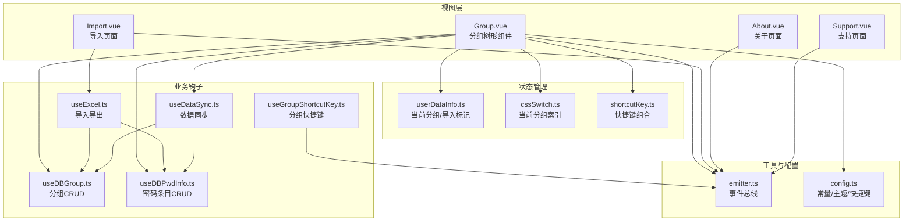
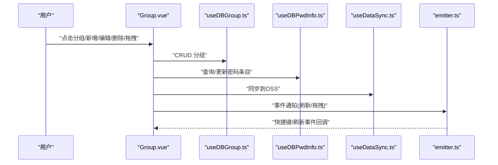
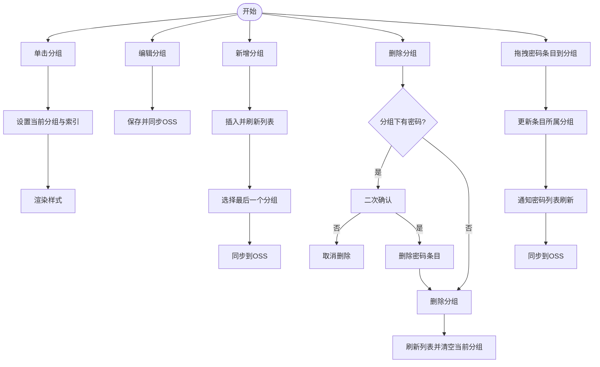
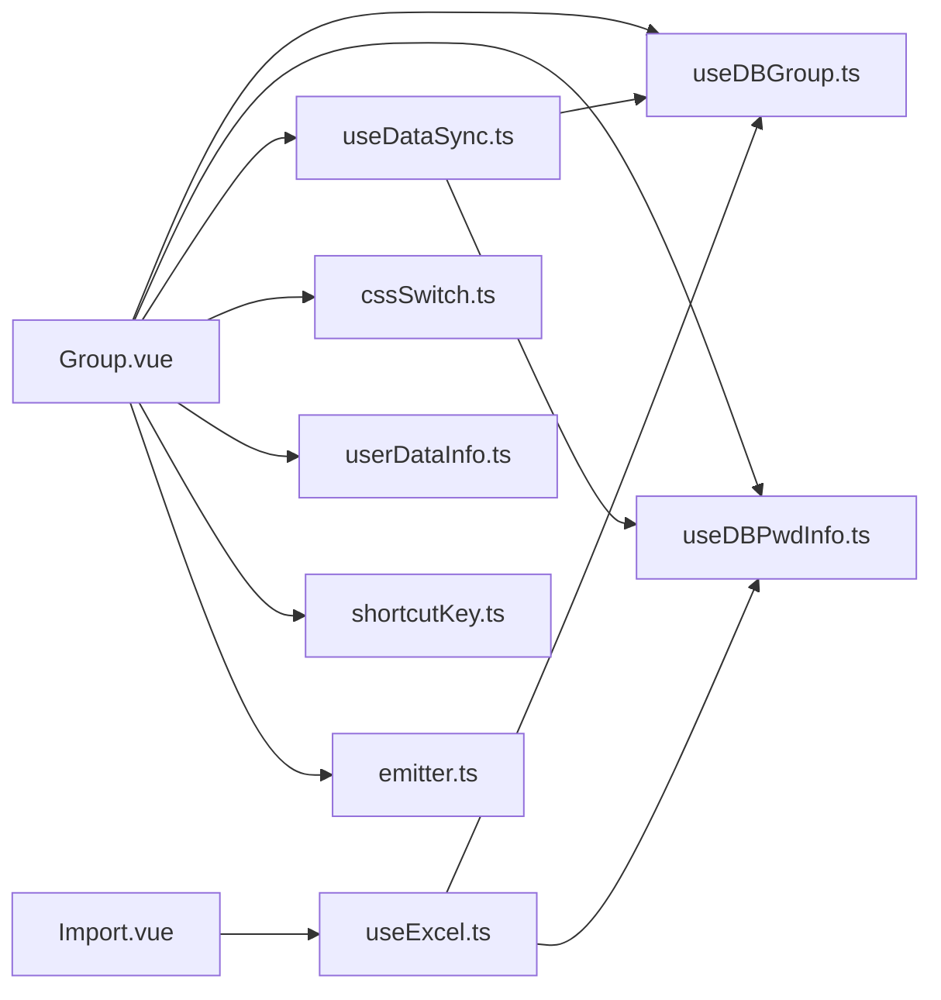

# 分组管理组件

<cite>
**本文引用的文件**
- [Group.vue](file://src/components/indexview/Group.vue)
- [About.vue](file://src/components/topMenu/About.vue)
- [Import.vue](file://src/components/topMenu/Import.vue)
- [Support.vue](file://src/components/topMenu/Support.vue)
- [type.ts](file://src/components/type.ts)
- [useDBGroup.ts](file://src/hooks/useDBGroup.ts)
- [useDBPwdInfo.ts](file://src/hooks/useDBPwdInfo.ts)
- [useDataSync.ts](file://src/hooks/useDataSync.ts)
- [useExcel.ts](file://src/hooks/useExcel.ts)
- [useGroupShortcutKey.ts](file://src/hooks/useGroupShortcutKey.ts)
- [userDataInfo.ts](file://src/store/userDataInfo.ts)
- [cssSwitch.ts](file://src/store/cssSwitch.ts)
- [shortcutKey.ts](file://src/store/shortcutKey.ts)
- [emitter.ts](file://src/utils/emitter.ts)
- [config.ts](file://src/config/config.ts)
</cite>

## 目录
1. [简介](#简介)
2. [项目结构](#项目结构)
3. [核心组件](#核心组件)
4. [架构总览](#架构总览)
5. [详细组件分析](#详细组件分析)
6. [依赖关系分析](#依赖关系分析)
7. [性能考量](#性能考量)
8. [故障排查指南](#故障排查指南)
9. [结论](#结论)
10. [附录](#附录)

## 简介
本文件聚焦于分组管理组件，围绕分组树形组件 Group.vue 的层级结构、拖拽排序与节点展开/收起交互，以及分组的增删改查、权限控制与数据同步机制进行深入说明；同时涵盖关于页面 About.vue、导入功能 Import.vue 与支持页面 Support.vue 的组件设计与交互流程。文档还提供分组数据模型、树形渲染、用户交互体验、分组导入导出与批量操作、数据迁移、组件状态管理、事件处理与错误恢复机制的系统化梳理。

## 项目结构
分组管理相关代码主要分布在以下位置：
- 视图层组件：Group.vue（分组树）、TopMenu 下 About.vue、Import.vue、Support.vue
- 类型定义：type.ts（PwdGroup、PwdInfo 等）
- 钩子函数：useDBGroup.ts（分组 CRUD）、useDBPwdInfo.ts（密码条目 CRUD）、useDataSync.ts（数据同步）、useExcel.ts（导入导出）、useGroupShortcutKey.ts（分组快捷键）
- 状态管理：userDataInfo.ts（当前分组、导入标记等）、cssSwitch.ts（当前选中分组索引）、shortcutKey.ts（快捷键组合）
- 工具与事件：emitter.ts（事件总线）、config.ts（主题、快捷键、消息提示等常量）

图表来源
- [Group.vue:1-333](file://src/components/indexview/Group.vue#L1-L333)
- [About.vue:1-62](file://src/components/topMenu/About.vue#L1-L62)
- [Import.vue:1-73](file://src/components/topMenu/Import.vue#L1-L73)
- [Support.vue:1-98](file://src/components/topMenu/Support.vue#L1-L98)
- [useDBGroup.ts:1-53](file://src/hooks/useDBGroup.ts#L1-L53)
- [useDBPwdInfo.ts:1-103](file://src/hooks/useDBPwdInfo.ts#L1-L103)
- [useDataSync.ts:1-324](file://src/hooks/useDataSync.ts#L1-L324)
- [useExcel.ts:1-109](file://src/hooks/useExcel.ts#L1-L109)
- [useGroupShortcutKey.ts:1-57](file://src/hooks/useGroupShortcutKey.ts#L1-L57)
- [userDataInfo.ts:1-76](file://src/store/userDataInfo.ts#L1-L76)
- [cssSwitch.ts:1-17](file://src/store/cssSwitch.ts#L1-L17)
- [shortcutKey.ts:1-99](file://src/store/shortcutKey.ts#L1-L99)
- [emitter.ts:1-16](file://src/utils/emitter.ts#L1-L16)
- [config.ts:1-143](file://src/config/config.ts#L1-L143)

章节来源
- [Group.vue:1-333](file://src/components/indexview/Group.vue#L1-L333)
- [type.ts:1-88](file://src/components/type.ts#L1-L88)
- [useDBGroup.ts:1-53](file://src/hooks/useDBGroup.ts#L1-L53)
- [useDBPwdInfo.ts:1-103](file://src/hooks/useDBPwdInfo.ts#L1-L103)
- [useDataSync.ts:1-324](file://src/hooks/useDataSync.ts#L1-L324)
- [useExcel.ts:1-109](file://src/hooks/useExcel.ts#L1-L109)
- [useGroupShortcutKey.ts:1-57](file://src/hooks/useGroupShortcutKey.ts#L1-L57)
- [userDataInfo.ts:1-76](file://src/store/userDataInfo.ts#L1-L76)
- [cssSwitch.ts:1-17](file://src/store/cssSwitch.ts#L1-L17)
- [shortcutKey.ts:1-99](file://src/store/shortcutKey.ts#L1-L99)
- [emitter.ts:1-16](file://src/utils/emitter.ts#L1-L16)
- [config.ts:1-143](file://src/config/config.ts#L1-L143)

## 核心组件
- 分组树形组件 Group.vue：负责分组列表渲染、单击切换当前分组、编辑/新增/删除分组、拖拽排序（从密码条目到分组）、快捷键支持、导入完成后的初始分组选择。
- 关于页面 About.vue：展示版本信息、检查更新、自动检查更新开关、跳转到开源仓库。
- 导入功能 Import.vue：提供 Excel 模板下载、文件上传限制与提示、调用导入逻辑。
- 支持页面 Support.vue：提供贡献渠道、捐赠说明、公众号入口等。

章节来源
- [Group.vue:1-333](file://src/components/indexview/Group.vue#L1-L333)
- [About.vue:1-62](file://src/components/topMenu/About.vue#L1-L62)
- [Import.vue:1-73](file://src/components/topMenu/Import.vue#L1-L73)
- [Support.vue:1-98](file://src/components/topMenu/Support.vue#L1-L98)

## 架构总览
分组管理采用“视图层组件 + 钩子函数 + 状态管理 + 工具与事件”的分层设计：
- 视图层组件通过 Pinia store 读写当前分组与索引，通过事件总线与全局快捷键联动。
- 钩子函数封装对 SQLite/IPC 与 OSS 的操作，统一返回 Promise，便于在组件中链式调用与错误处理。
- 数据同步模块负责本地与云端的双向同步，包含版本控制与自动/手动策略。
- 导入导出模块基于 Excel 工具库，支持模板下载与批量导入，自动创建缺失分组并写入密码条目。

图表来源
- [Group.vue:1-333](file://src/components/indexview/Group.vue#L1-L333)
- [useDBGroup.ts:1-53](file://src/hooks/useDBGroup.ts#L1-L53)
- [useDBPwdInfo.ts:1-103](file://src/hooks/useDBPwdInfo.ts#L1-L103)
- [useDataSync.ts:1-324](file://src/hooks/useDataSync.ts#L1-L324)
- [emitter.ts:1-16](file://src/utils/emitter.ts#L1-L16)

## 详细组件分析

### 分组树形组件 Group.vue
- 层级结构与渲染
  - 使用滚动容器渲染分组列表，支持悬停高亮与选中态切换。
  - 通过 Pinia store 中的当前分组索引与暗色模式开关控制样式。
- 节点交互
  - 单击：切换当前分组并清空密码列表索引。
  - 编辑：进入当前分组编辑态，失焦或变更后持久化。
  - 新增：弹出输入框，回车后插入新分组并滚动到最后一个。
  - 删除：若分组下存在密码条目，需二次确认；删除后刷新列表并清除当前分组。
- 拖拽排序
  - 密码条目从其他分组拖拽到本分组时，更新条目所属分组并同步到 OSS；完成后通知密码列表刷新。
  - 拖拽进入/离开/放置时更新悬停高亮状态。
- 快捷键与事件
  - 通过事件总线接收“分组快捷键”与“插入分组”事件，实现键盘快速定位与新增。
  - 监听导入完成事件，自动选择首个分组并重置导入标记。
- 数据同步
  - 所有增删改均在成功后触发同步到 OSS，并更新本地版本号。

图表来源
- [Group.vue:90-212](file://src/components/indexview/Group.vue#L90-L212)
- [useDBGroup.ts:15-49](file://src/hooks/useDBGroup.ts#L15-L49)
- [useDBPwdInfo.ts:48-63](file://src/hooks/useDBPwdInfo.ts#L48-L63)
- [useDataSync.ts:133-201](file://src/hooks/useDataSync.ts#L133-L201)

章节来源
- [Group.vue:1-333](file://src/components/indexview/Group.vue#L1-L333)
- [useDBGroup.ts:1-53](file://src/hooks/useDBGroup.ts#L1-L53)
- [useDBPwdInfo.ts:1-103](file://src/hooks/useDBPwdInfo.ts#L1-L103)
- [useDataSync.ts:1-324](file://src/hooks/useDataSync.ts#L1-L324)
- [userDataInfo.ts:1-76](file://src/store/userDataInfo.ts#L1-L76)
- [cssSwitch.ts:1-17](file://src/store/cssSwitch.ts#L1-L17)
- [useGroupShortcutKey.ts:1-57](file://src/hooks/useGroupShortcutKey.ts#L1-L57)
- [emitter.ts:1-16](file://src/utils/emitter.ts#L1-L16)
- [config.ts:1-143](file://src/config/config.ts#L1-L143)

### 关于页面 About.vue
- 功能要点
  - 展示应用图标、版本号、语言标签与开源协议信息。
  - 提供“检查更新”按钮与“自动检查更新”开关，支持读取与设置自动检查开关。
  - 提供跳转到开源仓库链接。
- 交互体验
  - 使用对话框承载内容，简洁明了；通过浏览器钩子打开外部链接。

章节来源
- [About.vue:1-62](file://src/components/topMenu/About.vue#L1-L62)
- [config.ts:40-41](file://src/config/config.ts#L40-L41)

### 导入功能 Import.vue
- 功能要点
  - 基于 Element Plus Upload 组件实现拖拽/点击上传，限制单文件、大小与类型。
  - 提供模板下载与导入执行，导入成功后通过事件总线通知刷新。
- 错误与提示
  - 文件大小超限提示；导入成功提示；模板下载异常兜底处理。

章节来源
- [Import.vue:1-73](file://src/components/topMenu/Import.vue#L1-L73)
- [useExcel.ts:88-106](file://src/hooks/useExcel.ts#L88-L106)

### 支持页面 Support.vue
- 功能要点
  - 列举多种支持方式（Star/Gitee Issue/PR/分享/捐赠等）。
  - 提供捐赠说明弹窗与微信/支付宝二维码图片。
  - 提供公众号弹窗展示。

章节来源
- [Support.vue:1-98](file://src/components/topMenu/Support.vue#L1-L98)
- [config.ts:43-83](file://src/config/config.ts#L43-L83)

### 数据模型与树形渲染
- 数据模型
  - PwdGroup：包含 id、title、father_id、pwdList、editFlag 等字段。
  - PwdInfo：包含 id、group_id、group_title、title、username、password、link、remark 等字段。
- 树形渲染
  - Group.vue 通过 v-for 渲染分组列表，结合样式类实现选中/悬停/拖拽高亮效果。
  - 当前分组与索引由 cssSwitch.ts 与 userDataInfo.ts 协同维护。

章节来源
- [type.ts:50-88](file://src/components/type.ts#L50-L88)
- [Group.vue:215-277](file://src/components/indexview/Group.vue#L215-L277)
- [cssSwitch.ts:1-17](file://src/store/cssSwitch.ts#L1-L17)
- [userDataInfo.ts:19-27](file://src/store/userDataInfo.ts#L19-L27)

### 权限控制与数据同步机制
- 权限控制
  - 分组与密码条目操作均通过 IPC 接口访问 SQLite，未见显式角色/权限判断逻辑；业务侧权限通常由登录状态与主窗口可见性约束。
- 数据同步
  - useDataSync.ts 实现本地与 OSS 的双向同步：
    - 自动/手动拉取：对比本地与远程版本，不一致时覆盖本地数据并触发分组刷新事件。
    - 自动/手动推送：生成同步对象（包含分组与密码条目），上传并更新本地版本。
  - 同步开关、自动上传/下载开关与 OSS 配置项通过配置常量与 store 管理。

章节来源
- [useDataSync.ts:40-131](file://src/hooks/useDataSync.ts#L40-L131)
- [useDataSync.ts:133-201](file://src/hooks/useDataSync.ts#L133-L201)
- [config.ts:1-143](file://src/config/config.ts#L1-L143)

### 分组导入导出、批量操作与数据迁移
- 导入
  - useExcel.ts 读取 Excel，逐条解析为 PwdInfo；根据 group_title 查询或创建分组；批量插入密码条目；导入成功后设置导入标记，触发 Group.vue 初始化。
- 导出
  - useExcel.ts 读取全部密码条目，生成工作簿并下载为 Excel 文件。
- 批量操作
  - 删除分组时可批量删除该分组下的所有密码条目；导入时可批量创建分组与密码条目。
- 数据迁移
  - 通过 useDataSync.ts 的“拉取/推送”实现本地与云端的数据迁移；版本号控制避免冲突。

章节来源
- [useExcel.ts:22-84](file://src/hooks/useExcel.ts#L22-L84)
- [useDBGroup.ts:15-49](file://src/hooks/useDBGroup.ts#L15-L49)
- [useDBPwdInfo.ts:48-63](file://src/hooks/useDBPwdInfo.ts#L48-L63)
- [useDataSync.ts:79-131](file://src/hooks/useDataSync.ts#L79-L131)
- [useDataSync.ts:173-201](file://src/hooks/useDataSync.ts#L173-L201)

### 组件状态管理、事件处理与错误恢复
- 状态管理
  - userDataInfo.ts：维护当前分组、导入标记、快捷键组合等。
  - cssSwitch.ts：维护当前分组与密码列表索引，用于样式切换。
  - shortcutKey.ts：维护快捷键组合描述与键序列，用于 Tooltip 展示与快捷键识别。
- 事件处理
  - emitter.ts 提供全局事件总线，Group.vue 监听“插入分组”“刷新分组数据”“分组快捷键”等事件。
  - useGroupShortcutKey.ts 监听键盘事件，识别 Ctrl+数字组合并派发事件。
- 错误恢复
  - useDataSync.ts 在同步失败时通过通知与消息提示反馈错误原因（如桶名/跨域/Region、Key 错误、权限不足等）。
  - 导入失败时捕获异常并记录日志，避免中断流程。

章节来源
- [userDataInfo.ts:1-76](file://src/store/userDataInfo.ts#L1-L76)
- [cssSwitch.ts:1-17](file://src/store/cssSwitch.ts#L1-L17)
- [shortcutKey.ts:1-99](file://src/store/shortcutKey.ts#L1-L99)
- [emitter.ts:1-16](file://src/utils/emitter.ts#L1-L16)
- [useGroupShortcutKey.ts:1-57](file://src/hooks/useGroupShortcutKey.ts#L1-L57)
- [useDataSync.ts:300-320](file://src/hooks/useDataSync.ts#L300-L320)

## 依赖关系分析
- 组件耦合
  - Group.vue 与 useDBGroup.ts、useDBPwdInfo.ts、useDataSync.ts 高内聚；通过事件总线与 store 低耦合。
- 外部依赖
  - Electron IPC 常量驱动 SQLite 操作；OSS SDK 与配置常量驱动云端同步。
- 循环依赖
  - 未发现直接循环依赖；事件总线与 store 作为中介降低耦合。

图表来源
- [Group.vue:1-333](file://src/components/indexview/Group.vue#L1-L333)
- [useDBGroup.ts:1-53](file://src/hooks/useDBGroup.ts#L1-L53)
- [useDBPwdInfo.ts:1-103](file://src/hooks/useDBPwdInfo.ts#L1-L103)
- [useDataSync.ts:1-324](file://src/hooks/useDataSync.ts#L1-L324)
- [useExcel.ts:1-109](file://src/hooks/useExcel.ts#L1-L109)
- [userDataInfo.ts:1-76](file://src/store/userDataInfo.ts#L1-L76)
- [cssSwitch.ts:1-17](file://src/store/cssSwitch.ts#L1-L17)
- [shortcutKey.ts:1-99](file://src/store/shortcutKey.ts#L1-L99)
- [emitter.ts:1-16](file://src/utils/emitter.ts#L1-L16)

章节来源
- [Group.vue:1-333](file://src/components/indexview/Group.vue#L1-L333)
- [useExcel.ts:1-109](file://src/hooks/useExcel.ts#L1-L109)
- [useDataSync.ts:1-324](file://src/hooks/useDataSync.ts#L1-L324)

## 性能考量
- 渲染优化
  - 使用滚动容器与 v-for 渲染分组列表，避免一次性渲染大量节点。
- 数据访问
  - CRUD 操作通过 IPC 异步执行，避免阻塞主线程。
- 同步策略
  - 自动同步仅在版本变化时触发，减少不必要的网络开销。
- 导入性能
  - 批量导入时逐条创建分组与密码条目，建议在大数据量场景下分批处理并提示进度。

## 故障排查指南
- 同步失败
  - 检查 OSS 配置是否完整；查看错误通知中的具体错误码并对应修复（桶名/跨域/Region、Key 错误、权限不足）。
- 导入失败
  - 确认 Excel 文件格式与大小限制；查看控制台日志定位问题。
- 删除分组失败
  - 若分组下仍有密码条目，需先确认删除；否则无法删除。
- 快捷键无效
  - 检查快捷键组合是否符合预期；确认事件总线监听是否正常。

章节来源
- [useDataSync.ts:300-320](file://src/hooks/useDataSync.ts#L300-L320)
- [Import.vue:22-30](file://src/components/topMenu/Import.vue#L22-L30)
- [Group.vue:139-158](file://src/components/indexview/Group.vue#L139-L158)
- [useGroupShortcutKey.ts:35-53](file://src/hooks/useGroupShortcutKey.ts#L35-L53)

## 结论
分组管理组件通过清晰的分层设计实现了稳定的分组树形渲染、便捷的增删改查与拖拽排序、完善的导入导出与数据同步能力。配合事件总线与状态管理，组件具备良好的扩展性与可维护性。建议在大规模数据场景下进一步优化批量操作与同步策略，并完善权限控制与审计日志。

## 附录
- 快捷键与主题
  - 快捷键组合与默认描述由 shortcutKey.ts 管理；主题相关常量由 config.ts 提供。
- 事件主题
  - 分组相关事件主题在 config.ts 中集中定义，便于统一管理与调试。

章节来源
- [shortcutKey.ts:1-99](file://src/store/shortcutKey.ts#L1-L99)
- [config.ts:1-143](file://src/config/config.ts#L1-L143)