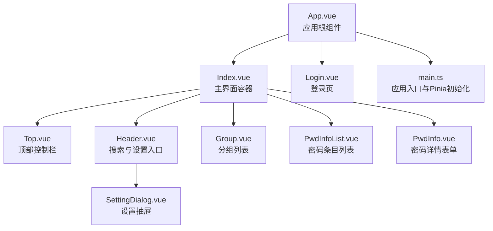
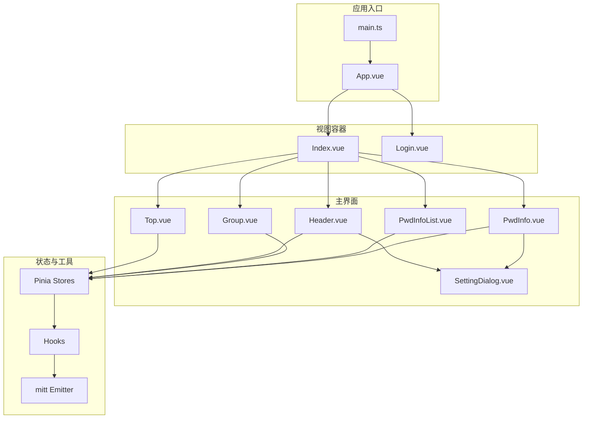
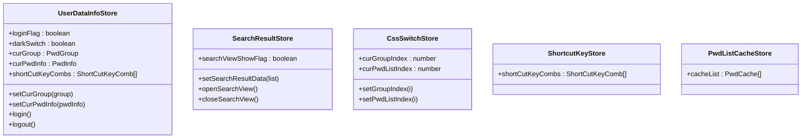
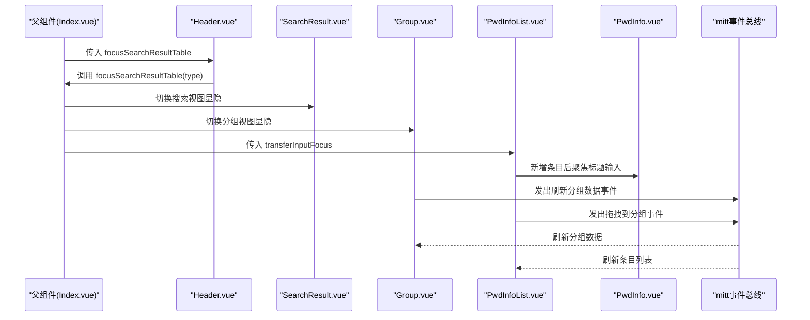
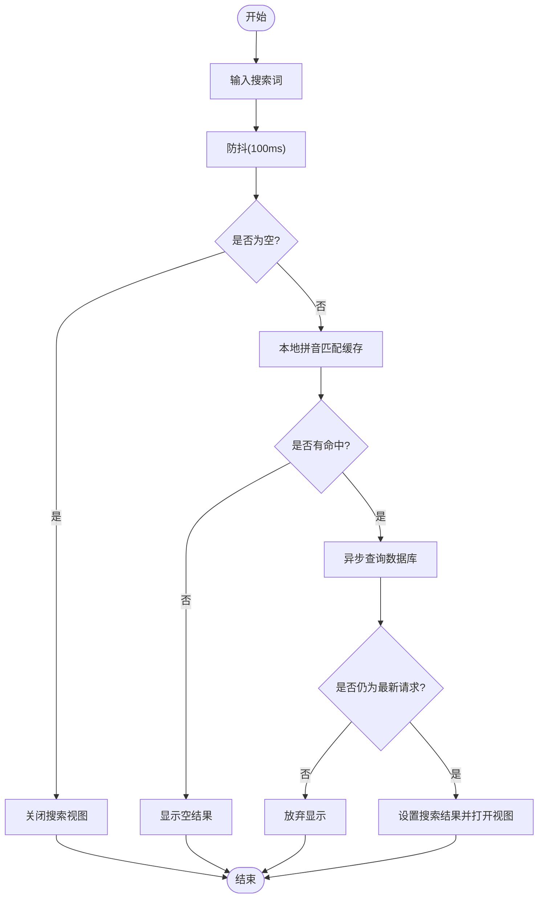
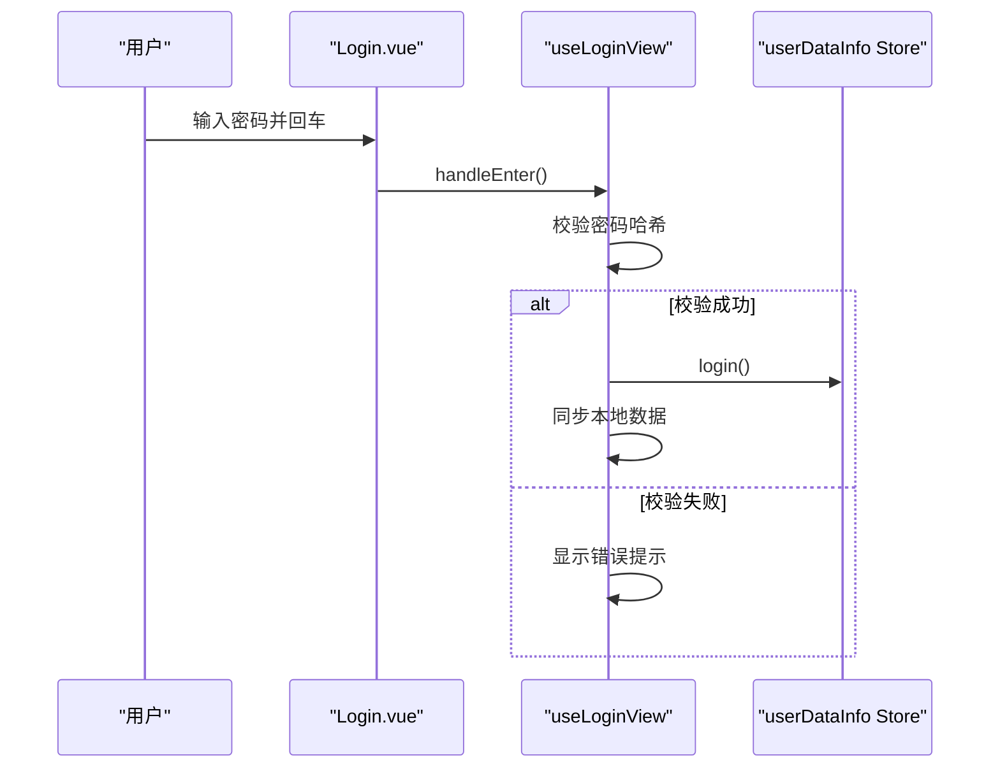
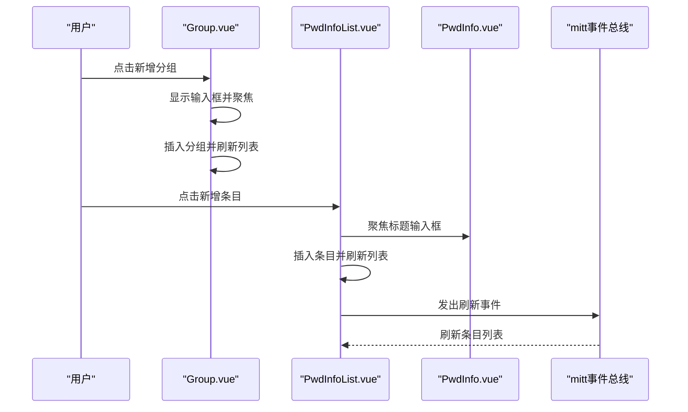
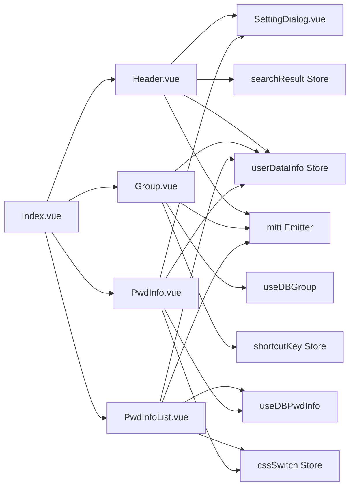

# 前端组件系统

<cite>
**本文引用的文件**
- [src/App.vue](file://src/App.vue)
- [src/main.ts](file://src/main.ts)
- [src/components/Index.vue](file://src/components/Index.vue)
- [src/components/Login.vue](file://src/components/Login.vue)
- [src/components/type.ts](file://src/components/type.ts)
- [src/components/indexview/Top.vue](file://src/components/indexview/Top.vue)
- [src/components/indexview/Header.vue](file://src/components/indexview/Header.vue)
- [src/components/indexview/Group.vue](file://src/components/indexview/Group.vue)
- [src/components/indexview/PwdInfo.vue](file://src/components/indexview/PwdInfo.vue)
- [src/components/indexview/PwdInfoList.vue](file://src/components/indexview/PwdInfoList.vue)
- [src/components/SettingDialog.vue](file://src/components/SettingDialog.vue)
- [src/store/userDataInfo.ts](file://src/store/userDataInfo.ts)
- [src/hooks/useLoginView.ts](file://src/hooks/useLoginView.ts)
- [src/utils/emitter.ts](file://src/utils/emitter.ts)
- [src/styles/dark/dark.ts](file://src/styles/dark/dark.ts)
</cite>

## 目录
1. [简介](#简介)
2. [项目结构](#项目结构)
3. [核心组件](#核心组件)
4. [架构总览](#架构总览)
5. [组件详细分析](#组件详细分析)
6. [依赖关系分析](#依赖关系分析)
7. [性能与兼容性](#性能与兼容性)
8. [故障排查指南](#故障排查指南)
9. [结论](#结论)
10. [附录](#附录)

## 简介
本文件面向密码管理器前端组件系统，围绕 Vue 3 + Element Plus + Pinia 的技术栈，系统梳理组件设计、层次结构与通信机制，重点覆盖：
- 响应式数据绑定与状态管理（Pinia）
- Props/事件/slots 的使用模式
- 组件状态管理、动画与过渡处理
- 样式定制与主题支持
- 跨浏览器兼容性与性能优化
- 组件组合模式与与 UI 元素的集成方式
- 每个核心组件的使用示例与最佳实践

## 项目结构
应用采用“按功能域组织”的组件布局，主要目录如下：
- src/components/indexview：主界面视图组件（顶部栏、头部搜索、分组、密码列表、密码详情等）
- src/components/setview：设置相关组件（通用设置、快捷键、修改密码、数据同步）
- src/components/svg：图标组件
- src/store：全局状态（用户信息、搜索结果、快捷键、CSS 切换等）
- src/hooks：业务逻辑钩子（登录、加密、数据库访问、快捷键等）
- src/utils：工具模块（事件总线 mitt）

图表来源
- [src/App.vue:1-19](file://src/App.vue#L1-L19)
- [src/components/Index.vue:1-81](file://src/components/Index.vue#L1-L81)
- [src/components/Login.vue:1-129](file://src/components/Login.vue#L1-L129)
- [src/components/indexview/Top.vue:1-108](file://src/components/indexview/Top.vue#L1-L108)
- [src/components/indexview/Header.vue:1-257](file://src/components/indexview/Header.vue#L1-L257)
- [src/components/indexview/Group.vue:1-333](file://src/components/indexview/Group.vue#L1-L333)
- [src/components/indexview/PwdInfoList.vue:1-260](file://src/components/indexview/PwdInfoList.vue#L1-L260)
- [src/components/indexview/PwdInfo.vue:1-257](file://src/components/indexview/PwdInfo.vue#L1-L257)
- [src/components/SettingDialog.vue:1-60](file://src/components/SettingDialog.vue#L1-L60)
- [src/main.ts:1-20](file://src/main.ts#L1-L20)

章节来源
- [src/App.vue:1-19](file://src/App.vue#L1-L19)
- [src/main.ts:1-20](file://src/main.ts#L1-L20)

## 核心组件
- 应用根组件与路由选择：App.vue 通过动态组件根据当前路径渲染不同视图；Index.vue 作为主界面容器，承载搜索、分组、列表与详情区域。
- 登录组件：Login.vue 提供密码输入、首登引导、Caps Lock 提示与快捷键处理。
- 主界面组件：Top.vue（窗口控制）、Header.vue（搜索、主题切换、设置入口）、Group.vue（分组 CRUD、拖拽）、PwdInfoList.vue（条目 CRUD、拖拽）、PwdInfo.vue（详情表单、复制、打开浏览器）。
- 设置对话框：SettingDialog.vue 以标签页形式组织通用设置、快捷键、修改密码、数据同步。

章节来源
- [src/components/Index.vue:1-81](file://src/components/Index.vue#L1-L81)
- [src/components/Login.vue:1-129](file://src/components/Login.vue#L1-L129)
- [src/components/indexview/Top.vue:1-108](file://src/components/indexview/Top.vue#L1-L108)
- [src/components/indexview/Header.vue:1-257](file://src/components/indexview/Header.vue#L1-L257)
- [src/components/indexview/Group.vue:1-333](file://src/components/indexview/Group.vue#L1-L333)
- [src/components/indexview/PwdInfoList.vue:1-260](file://src/components/indexview/PwdInfoList.vue#L1-L260)
- [src/components/indexview/PwdInfo.vue:1-257](file://src/components/indexview/PwdInfo.vue#L1-L257)
- [src/components/SettingDialog.vue:1-60](file://src/components/SettingDialog.vue#L1-L60)

## 架构总览
整体采用“容器组件 + 展示组件 + 钩子 + 状态库”的分层：
- 容器组件：App.vue、Index.vue 负责布局与视图切换
- 展示组件：各 indexview 下的小组件负责具体交互
- 钩子：useLoginView、useDBPwdInfo、useDBGroup 等封装业务逻辑
- 状态库：Pinia Store（userDataInfo、searchResult、cssSwitch、shortcutKey 等）

图表来源
- [src/main.ts:1-20](file://src/main.ts#L1-L20)
- [src/App.vue:1-19](file://src/App.vue#L1-L19)
- [src/components/Index.vue:1-81](file://src/components/Index.vue#L1-L81)
- [src/components/Login.vue:1-129](file://src/components/Login.vue#L1-L129)
- [src/components/indexview/Top.vue:1-108](file://src/components/indexview/Top.vue#L1-L108)
- [src/components/indexview/Header.vue:1-257](file://src/components/indexview/Header.vue#L1-L257)
- [src/components/indexview/Group.vue:1-333](file://src/components/indexview/Group.vue#L1-L333)
- [src/components/indexview/PwdInfoList.vue:1-260](file://src/components/indexview/PwdInfoList.vue#L1-L260)
- [src/components/indexview/PwdInfo.vue:1-257](file://src/components/indexview/PwdInfo.vue#L1-L257)
- [src/components/SettingDialog.vue:1-60](file://src/components/SettingDialog.vue#L1-L60)

## 组件详细分析

### 组件层次与职责
- App.vue：应用根节点，调用 useApp 初始化，基于 useCurrentPath 决定渲染的视图（Top + 动态组件）
- Index.vue：主界面容器，引入快捷键与缓存 Store，协调 Header、Group、PwdInfoList、PwdInfo、SearchResult 的可见性与焦点流转
- Login.vue：登录页，集成首登引导、密码校验、Caps Lock 监控、ESC 快捷键
- Top.vue：窗口控制按钮（最小化、最大化/还原、关闭），结合 Electron IPC 控制窗口行为
- Header.vue：搜索输入、主题切换（深色/浅色）、设置弹窗、快捷键提示、事件总线监听锁屏事件
- Group.vue：分组列表、新增/编辑/删除、拖拽到分组、快捷键触发
- PwdInfoList.vue：条目列表、新增/删除、拖拽、选中状态、标题变更事件同步
- PwdInfo.vue：密码详情表单（标题/用户名/密码/链接/说明），复制、打开浏览器、随机密码生成
- SettingDialog.vue：设置抽屉，包含通用设置、快捷键、修改密码、数据同步四个标签页

章节来源
- [src/App.vue:1-19](file://src/App.vue#L1-L19)
- [src/components/Index.vue:1-81](file://src/components/Index.vue#L1-L81)
- [src/components/Login.vue:1-129](file://src/components/Login.vue#L1-L129)
- [src/components/indexview/Top.vue:1-108](file://src/components/indexview/Top.vue#L1-L108)
- [src/components/indexview/Header.vue:1-257](file://src/components/indexview/Header.vue#L1-L257)
- [src/components/indexview/Group.vue:1-333](file://src/components/indexview/Group.vue#L1-L333)
- [src/components/indexview/PwdInfoList.vue:1-260](file://src/components/indexview/PwdInfoList.vue#L1-L260)
- [src/components/indexview/PwdInfo.vue:1-257](file://src/components/indexview/PwdInfo.vue#L1-L257)
- [src/components/SettingDialog.vue:1-60](file://src/components/SettingDialog.vue#L1-L60)

### 响应式数据绑定与状态管理
- Pinia Store
  - userDataInfo：保存登录态、主题开关、当前分组/条目、快捷键组合、导入标志等
  - searchResult：搜索视图显隐与结果数据
  - cssSwitch：分组与条目选中索引切换
  - shortcutKey：快捷键组合配置
  - pwdListCache：本地缓存列表（拼音匹配加速）
- 组件内通过 storeToRefs 获取响应式引用，直接修改 state 触发视图更新
- 数据持久化：通过 useDBConfig、useDBGroup、useDBPwdInfo 等钩子与后端/数据库交互

图表来源
- [src/store/userDataInfo.ts:1-76](file://src/store/userDataInfo.ts#L1-L76)

章节来源
- [src/store/userDataInfo.ts:1-76](file://src/store/userDataInfo.ts#L1-L76)

### Props/事件/slots 使用模式
- Props
  - Header.vue 接收 focusSearchResultTable 回调，用于键盘导航时将焦点转移到搜索结果表格
  - PwdInfoList.vue 接收 transferInputFocus 回调，用于新增条目后将焦点转移到标题输入框
- 事件
  - 组件间通过 mitt 事件总线通信：如插入分组、刷新分组数据、条目标题更新、拖拽到分组等
- Expose/Expose 暴露
  - SettingDialog 暴露 openSettingDialog 方法供父组件调用
  - PwdInfo 暴露 pwdInfoTitleInput 与 keydown 处理，便于父组件聚焦或键盘事件处理

章节来源
- [src/components/indexview/Header.vue:41](file://src/components/indexview/Header.vue#L41)
- [src/components/indexview/PwdInfoList.vue:24](file://src/components/indexview/PwdInfoList.vue#L24)
- [src/components/SettingDialog.vue:14-17](file://src/components/SettingDialog.vue#L14-L17)
- [src/components/indexview/PwdInfo.vue:27](file://src/components/indexview/PwdInfo.vue#L27)

### 组件通信机制
- 事件总线：emitter.ts 封装 mitt，组件通过 on/off 订阅/解绑事件，实现低耦合通信
- 父子通信：通过 Props 传入回调，子组件触发事件后由父组件统一处理
- 状态共享：Pinia Store 作为单一事实来源，所有组件读取/写入状态

图表来源
- [src/components/Index.vue:34-41](file://src/components/Index.vue#L34-L41)
- [src/components/indexview/Header.vue:170-173](file://src/components/indexview/Header.vue#L170-L173)
- [src/components/indexview/Group.vue:41-58](file://src/components/indexview/Group.vue#L41-L58)
- [src/components/indexview/PwdInfoList.vue:61-84](file://src/components/indexview/PwdInfoList.vue#L61-L84)
- [src/utils/emitter.ts:1-16](file://src/utils/emitter.ts#L1-L16)

### 动画效果与过渡处理
- 登录页背景过渡：.pwd-outer 使用 transition 实现背景色平滑切换
- 按钮悬停效果：Top.vue、Header.vue、Group.vue、PwdInfoList.vue 对 hover 状态进行样式过渡
- 主题切换：Header.vue 通过 toggleDark 切换深色/浅色模式，配合 CSS 变量生效

章节来源
- [src/components/Login.vue:90-128](file://src/components/Login.vue#L90-L128)
- [src/components/indexview/Top.vue:69-108](file://src/components/indexview/Top.vue#L69-L108)
- [src/components/indexview/Header.vue:232-257](file://src/components/indexview/Header.vue#L232-L257)
- [src/components/indexview/Group.vue:279-333](file://src/components/indexview/Group.vue#L279-L333)
- [src/components/indexview/PwdInfoList.vue:197-260](file://src/components/indexview/PwdInfoList.vue#L197-L260)
- [src/styles/dark/dark.ts:1-5](file://src/styles/dark/dark.ts#L1-L5)

### 样式定制与主题支持
- 主题变量：引入 Element Plus 深色变量与自定义深色样式变量
- 主题切换：Header.vue 读取配置值与用户状态，调用 toggleDark 切换
- 组件级样式：各组件通过 scoped 样式隔离，同时使用 CSS 变量与类名切换实现暗/亮主题适配

章节来源
- [src/main.ts:6-7](file://src/main.ts#L6-L7)
- [src/components/indexview/Header.vue:84-89](file://src/components/indexview/Header.vue#L84-L89)
- [src/styles/dark/dark.ts:1-5](file://src/styles/dark/dark.ts#L1-L5)

### 搜索与键盘导航流程

图表来源
- [src/components/indexview/Header.vue:98-157](file://src/components/indexview/Header.vue#L98-L157)

### 组件交互序列示例

#### 登录流程

图表来源
- [src/components/Login.vue:56-88](file://src/components/Login.vue#L56-L88)
- [src/hooks/useLoginView.ts:45-50](file://src/hooks/useLoginView.ts#L45-L50)
- [src/store/userDataInfo.ts:41-46](file://src/store/userDataInfo.ts#L41-L46)

#### 新增分组与条目

图表来源
- [src/components/indexview/Group.vue:99-124](file://src/components/indexview/Group.vue#L99-L124)
- [src/components/indexview/PwdInfoList.vue:87-103](file://src/components/indexview/PwdInfoList.vue#L87-L103)
- [src/utils/emitter.ts:1-16](file://src/utils/emitter.ts#L1-L16)

## 依赖关系分析
- 组件依赖
  - Index.vue 依赖 Header、Group、PwdInfoList、PwdInfo、SearchResult
  - Header.vue 依赖 SettingDialog、userDataInfo、searchResult、shortcutKey、pwdListCache
  - Group.vue 依赖 userDataInfo、shortcutKey、dataSync、dbGroup、dbPwdInfo
  - PwdInfoList.vue 依赖 userDataInfo、shortcutKey、cssSwitch、dbPwdInfo
  - PwdInfo.vue 依赖 userDataInfo、browser、shortcutKey、dataSync、searchResult
- 外部依赖
  - Element Plus UI 组件库
  - VueUse 的深色模式切换
  - mitt 事件总线
  - Pinia 状态管理

图表来源
- [src/components/Index.vue:11-28](file://src/components/Index.vue#L11-L28)
- [src/components/indexview/Header.vue:1-25](file://src/components/indexview/Header.vue#L1-L25)
- [src/components/indexview/Group.vue:1-33](file://src/components/indexview/Group.vue#L1-L33)
- [src/components/indexview/PwdInfoList.vue:1-22](file://src/components/indexview/PwdInfoList.vue#L1-L22)
- [src/components/indexview/PwdInfo.vue:1-31](file://src/components/indexview/PwdInfo.vue#L1-L31)
- [src/utils/emitter.ts:1-16](file://src/utils/emitter.ts#L1-L16)

章节来源
- [src/components/Index.vue:11-28](file://src/components/Index.vue#L11-L28)
- [src/components/indexview/Header.vue:1-25](file://src/components/indexview/Header.vue#L1-L25)
- [src/components/indexview/Group.vue:1-33](file://src/components/indexview/Group.vue#L1-L33)
- [src/components/indexview/PwdInfoList.vue:1-22](file://src/components/indexview/PwdInfoList.vue#L1-L22)
- [src/components/indexview/PwdInfo.vue:1-31](file://src/components/indexview/PwdInfo.vue#L1-L31)
- [src/utils/emitter.ts:1-16](file://src/utils/emitter.ts#L1-L16)

## 性能与兼容性
- 性能优化
  - 搜索防抖：Header.vue 对输入进行 100ms 防抖，避免频繁查询
  - 请求去重：使用计数器标记最新请求，丢弃过期请求，减少无效渲染
  - 本地缓存：pwdListCache 与拼音匹配提升搜索体验
  - 懒加载与滚动：使用 ElScrollbar 减少全量渲染
- 兼容性
  - Electron 环境下的窗口控制与 IPC 调用
  - CSS 变量与 Element Plus 深色主题适配
  - Clipboard API 复制能力检测与降级提示（建议在异常时给出用户提示）

章节来源
- [src/components/indexview/Header.vue:98-157](file://src/components/indexview/Header.vue#L98-L157)
- [src/components/indexview/Group.vue:1-33](file://src/components/indexview/Group.vue#L1-L33)
- [src/main.ts:6-7](file://src/main.ts#L6-L7)

## 故障排查指南
- 登录失败
  - 检查密码哈希比对逻辑与配置项读取
  - 确认 useLoginView 的 handleEnter 流程与错误提示
- 搜索无结果
  - 确认本地缓存是否存在匹配项
  - 检查 performSearch 是否被过期请求提前终止
- 分组/条目未刷新
  - 检查事件总线订阅与解绑是否正确
  - 确认 mitt 事件名称一致性与参数格式
- 主题切换无效
  - 检查 toggleDark 是否被调用
  - 确认 CSS 变量是否正确注入

章节来源
- [src/hooks/useLoginView.ts:45-50](file://src/hooks/useLoginView.ts#L45-L50)
- [src/components/indexview/Header.vue:118-157](file://src/components/indexview/Header.vue#L118-L157)
- [src/utils/emitter.ts:1-16](file://src/utils/emitter.ts#L1-L16)
- [src/styles/dark/dark.ts:1-5](file://src/styles/dark/dark.ts#L1-L5)

## 结论
本组件系统以 Vue 3 + Element Plus + Pinia 为基础，采用容器/展示分离、事件总线与 Pinia 状态共享相结合的方式，实现了清晰的层次结构与良好的扩展性。通过防抖、缓存与 IPC 集成，兼顾了性能与用户体验。建议后续进一步完善错误提示与可访问性，增强跨浏览器稳定性。

## 附录

### 类型定义参考
- PwdInfo、PwdGroup、ShortCutKeyComb、OssForm、UpdateVersion 等接口定义，用于组件间数据契约与类型安全

章节来源
- [src/components/type.ts:1-88](file://src/components/type.ts#L1-L88)