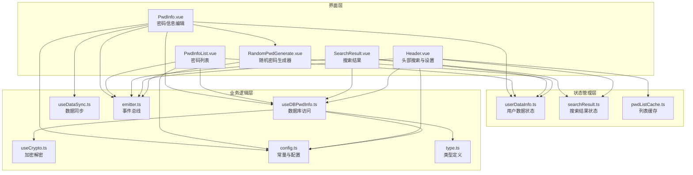
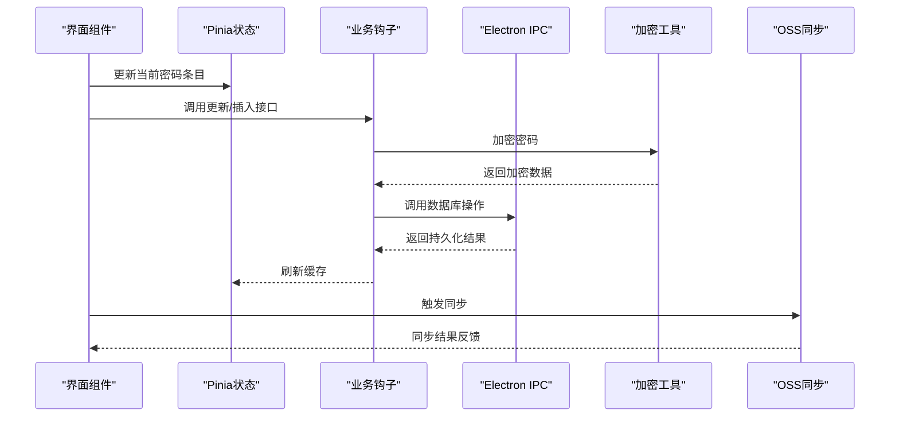
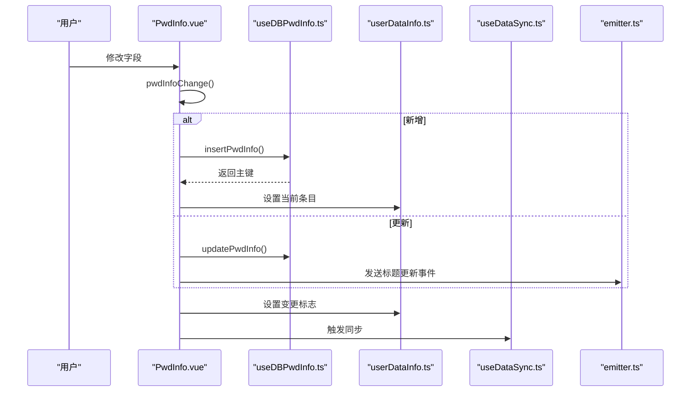
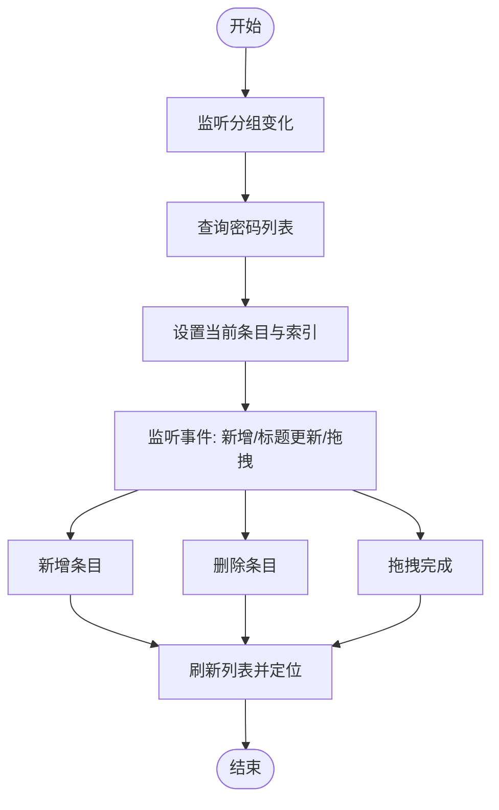
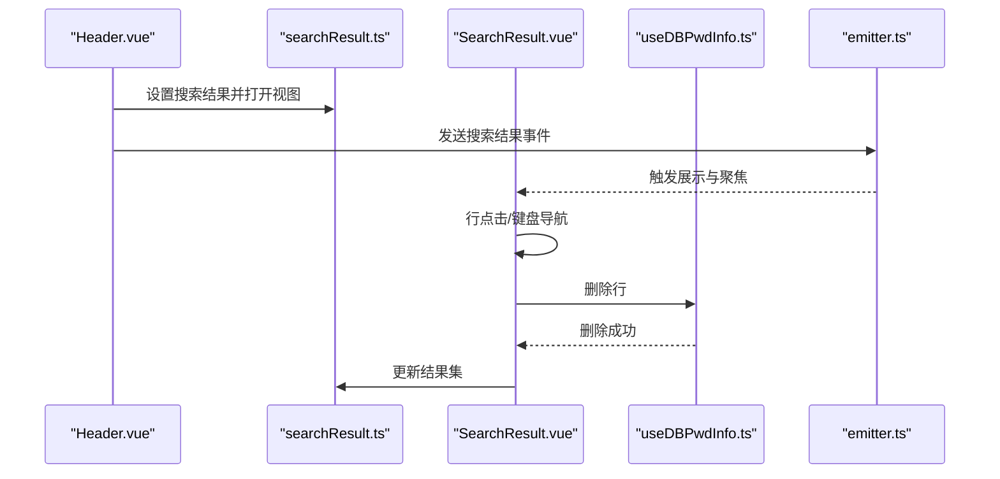
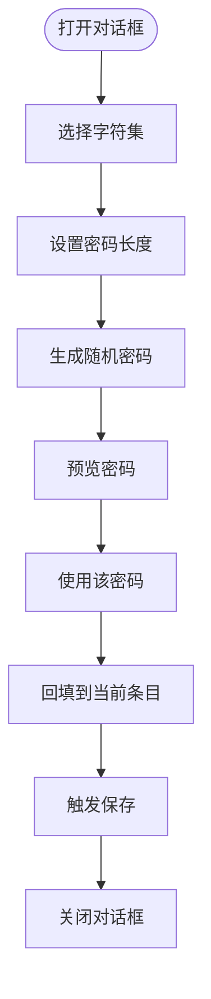
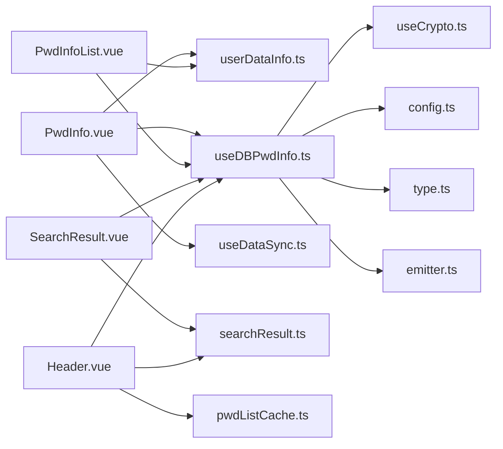

# 密码管理组件

<cite>
**本文档引用的文件**
- [PwdInfo.vue](file://src/components/indexview/PwdInfo.vue)
- [PwdInfoList.vue](file://src/components/indexview/PwdInfoList.vue)
- [SearchResult.vue](file://src/components/indexview/SearchResult.vue)
- [RandomPwdGenerate.vue](file://src/components/indexview/RandomPwdGenerate.vue)
- [userDataInfo.ts](file://src/store/userDataInfo.ts)
- [useDBPwdInfo.ts](file://src/hooks/useDBPwdInfo.ts)
- [searchResult.ts](file://src/store/searchResult.ts)
- [config.ts](file://src/config/config.ts)
- [type.ts](file://src/components/type.ts)
- [emitter.ts](file://src/utils/emitter.ts)
- [useCrypto.ts](file://src/hooks/useCrypto.ts)
- [pwdListCache.ts](file://src/store/pwdListCache.ts)
- [useDataSync.ts](file://src/hooks/useDataSync.ts)
- [Header.vue](file://src/components/indexview/Header.vue)
</cite>

## 目录
1. [简介](#简介)
2. [项目结构](#项目结构)
3. [核心组件](#核心组件)
4. [架构总览](#架构总览)
5. [详细组件分析](#详细组件分析)
6. [依赖关系分析](#依赖关系分析)
7. [性能考虑](#性能考虑)
8. [故障排除指南](#故障排除指南)
9. [结论](#结论)

## 简介
本文件为密码管理应用中的四个核心组件提供详细技术文档，涵盖：
- PwdInfo.vue：密码信息编辑组件的数据绑定、表单验证与实时保存机制
- PwdInfoList.vue：密码列表组件的虚拟滚动、分页加载与批量操作
- SearchResult.vue：搜索结果组件的搜索算法、高亮显示与结果导航
- RandomPwdGenerate.vue：随机密码生成器的安全算法、字符集配置与密码强度评估

同时，文档阐述组件间协作模式、事件传递与错误处理机制，并讨论状态管理、数据持久化与用户体验优化策略。

## 项目结构
本项目采用基于功能模块的组织方式，核心组件位于 `src/components/indexview/` 目录下，配合 Pinia 状态管理、Electron IPC 数据访问、加密工具与事件总线实现完整的密码管理流程。

图表来源
- [PwdInfo.vue:1-257](file://src/components/indexview/PwdInfo.vue#L1-L257)
- [PwdInfoList.vue:1-260](file://src/components/indexview/PwdInfoList.vue#L1-L260)
- [SearchResult.vue:1-186](file://src/components/indexview/SearchResult.vue#L1-L186)
- [RandomPwdGenerate.vue:1-144](file://src/components/indexview/RandomPwdGenerate.vue#L1-L144)
- [userDataInfo.ts:1-76](file://src/store/userDataInfo.ts#L1-L76)
- [useDBPwdInfo.ts:1-103](file://src/hooks/useDBPwdInfo.ts#L1-L103)
- [searchResult.ts:1-49](file://src/store/searchResult.ts#L1-L49)
- [pwdListCache.ts:1-37](file://src/store/pwdListCache.ts#L1-L37)
- [useCrypto.ts:1-77](file://src/hooks/useCrypto.ts#L1-L77)
- [useDataSync.ts:1-324](file://src/hooks/useDataSync.ts#L1-L324)
- [emitter.ts:1-16](file://src/utils/emitter.ts#L1-L16)
- [config.ts:1-143](file://src/config/config.ts#L1-L143)
- [type.ts:1-88](file://src/components/type.ts#L1-L88)

章节来源
- [PwdInfo.vue:1-257](file://src/components/indexview/PwdInfo.vue#L1-L257)
- [PwdInfoList.vue:1-260](file://src/components/indexview/PwdInfoList.vue#L1-L260)
- [SearchResult.vue:1-186](file://src/components/indexview/SearchResult.vue#L1-L186)
- [RandomPwdGenerate.vue:1-144](file://src/components/indexview/RandomPwdGenerate.vue#L1-L144)

## 核心组件
本节概述四个组件的核心职责与交互关系：
- PwdInfo.vue：负责密码条目字段的双向数据绑定、变更时的实时保存、快捷键复制、打开浏览器与调用随机密码生成器
- PwdInfoList.vue：负责密码列表渲染、点击选择、新增/删除、拖拽移动与事件监听
- SearchResult.vue：负责搜索结果展示、行点击导航、键盘上下导航与删除操作
- RandomPwdGenerate.vue：负责随机密码生成、字符集配置、长度控制与回填到当前条目

章节来源
- [PwdInfo.vue:1-257](file://src/components/indexview/PwdInfo.vue#L1-L257)
- [PwdInfoList.vue:1-260](file://src/components/indexview/PwdInfoList.vue#L1-L260)
- [SearchResult.vue:1-186](file://src/components/indexview/SearchResult.vue#L1-L186)
- [RandomPwdGenerate.vue:1-144](file://src/components/indexview/RandomPwdGenerate.vue#L1-L144)

## 架构总览
组件间通过 Pinia 状态管理与事件总线协同工作，数据库访问通过 Electron IPC 与加密工具完成，数据同步通过 OSS 实现。

图表来源
- [useDBPwdInfo.ts:1-103](file://src/hooks/useDBPwdInfo.ts#L1-L103)
- [useCrypto.ts:1-77](file://src/hooks/useCrypto.ts#L1-L77)
- [useDataSync.ts:1-324](file://src/hooks/useDataSync.ts#L1-L324)
- [userDataInfo.ts:1-76](file://src/store/userDataInfo.ts#L1-L76)

## 详细组件分析

### PwdInfo.vue：密码信息编辑组件
- 数据绑定与表单验证
  - 使用 Element Plus 输入框实现标题、用户名、密码、链接、说明字段的双向绑定
  - 字段变更触发保存流程，确保每次修改即时落库
  - 密码字段支持明文/密文切换与一键复制
  - 链接字段支持在浏览器中打开
- 实时保存机制
  - 变更回调触发更新或插入逻辑，插入后回填主键与分组信息
  - 成功后设置变更标志并触发云端同步
- 事件与快捷键
  - 支持 Ctrl+U 复制用户名、Ctrl+P 复制密码
  - 通过事件总线与搜索结果状态联动，保持标题变更的一致性
- 随机密码集成
  - 通过插槽与子组件 RandomPwdGenerate.vue 协作，支持弹窗生成与回填

图表来源
- [PwdInfo.vue:32-53](file://src/components/indexview/PwdInfo.vue#L32-L53)
- [useDBPwdInfo.ts:21-63](file://src/hooks/useDBPwdInfo.ts#L21-L63)
- [userDataInfo.ts:29-40](file://src/store/userDataInfo.ts#L29-L40)
- [useDataSync.ts:133-153](file://src/hooks/useDataSync.ts#L133-L153)
- [emitter.ts:1-16](file://src/utils/emitter.ts#L1-L16)
- [config.ts:9-12](file://src/config/config.ts#L9-L12)

章节来源
- [PwdInfo.vue:1-257](file://src/components/indexview/PwdInfo.vue#L1-L257)
- [useDBPwdInfo.ts:1-103](file://src/hooks/useDBPwdInfo.ts#L1-L103)
- [userDataInfo.ts:1-76](file://src/store/userDataInfo.ts#L1-L76)
- [useDataSync.ts:1-324](file://src/hooks/useDataSync.ts#L1-L324)
- [emitter.ts:1-16](file://src/utils/emitter.ts#L1-L16)
- [config.ts:1-143](file://src/config/config.ts#L1-L143)

### PwdInfoList.vue：密码列表组件
- 列表渲染与选择
  - 基于分组 ID 查询密码列表，点击行设置当前条目并记录索引
  - 支持悬停效果与深色/浅色主题下的选中态
- 新增与删除
  - 新增按钮触发插入并刷新列表，定位到最后一条
  - 删除通过消息框确认，删除成功后刷新索引
- 拖拽与事件
  - 支持拖拽事件，传递条目完整信息；拖拽完成后刷新列表
  - 监听新增、标题更新、拖拽至分组等事件，动态维护列表一致性
- 生命周期与响应式
  - 组件挂载与分组切换时查询列表并初始化当前条目
  - 监听变更标志，触发本地刷新

图表来源
- [PwdInfoList.vue:27-85](file://src/components/indexview/PwdInfoList.vue#L27-L85)
- [useDBPwdInfo.ts:65-70](file://src/hooks/useDBPwdInfo.ts#L65-L70)
- [userDataInfo.ts:29-40](file://src/store/userDataInfo.ts#L29-L40)
- [config.ts:9-12](file://src/config/config.ts#L9-L12)

章节来源
- [PwdInfoList.vue:1-260](file://src/components/indexview/PwdInfoList.vue#L1-L260)
- [useDBPwdInfo.ts:1-103](file://src/hooks/useDBPwdInfo.ts#L1-L103)
- [userDataInfo.ts:1-76](file://src/store/userDataInfo.ts#L1-L76)
- [config.ts:1-143](file://src/config/config.ts#L1-L143)

### SearchResult.vue：搜索结果组件
- 搜索结果展示
  - 使用 Element Plus 表格展示分组、标题、用户名与操作列
  - 支持行点击与键盘上下导航，维护当前索引并在主题切换时应用对应样式
- 删除操作
  - 通过 PopConfirm 确认删除，删除后从结果集中移除并调用数据库删除
- 事件与导航
  - 接收来自 Header.vue 的搜索结果事件，聚焦表格并设置初始焦点
  - 暴露导航方法供外部调用，实现键盘方向键导航

图表来源
- [Header.vue:98-157](file://src/components/indexview/Header.vue#L98-L157)
- [searchResult.ts:23-45](file://src/store/searchResult.ts#L23-L45)
- [SearchResult.vue:21-138](file://src/components/indexview/SearchResult.vue#L21-L138)
- [useDBPwdInfo.ts:35-40](file://src/hooks/useDBPwdInfo.ts#L35-L40)
- [emitter.ts:1-16](file://src/utils/emitter.ts#L1-L16)

章节来源
- [SearchResult.vue:1-186](file://src/components/indexview/SearchResult.vue#L1-L186)
- [Header.vue:1-257](file://src/components/indexview/Header.vue#L1-L257)
- [searchResult.ts:1-49](file://src/store/searchResult.ts#L1-L49)
- [useDBPwdInfo.ts:1-103](file://src/hooks/useDBPwdInfo.ts#L1-L103)
- [emitter.ts:1-16](file://src/utils/emitter.ts#L1-L16)

### RandomPwdGenerate.vue：随机密码生成器
- 安全算法与字符集
  - 支持大写字母、小写字母、数字与特殊字符集合
  - 特殊字符集可通过复选框启用并自定义输入
  - 生成过程基于随机池拼接，按指定长度循环抽取字符
- 配置与回填
  - 通过滑块控制长度范围，支持刷新生成新密码
  - 点击“使用该密码”将生成的密码写入当前条目并触发保存
- 交互设计
  - 作为对话框组件，通过父组件暴露的可见性控制与回调进行协作

图表来源
- [RandomPwdGenerate.vue:25-46](file://src/components/indexview/RandomPwdGenerate.vue#L25-L46)
- [PwdInfo.vue:208-209](file://src/components/indexview/PwdInfo.vue#L208-L209)

章节来源
- [RandomPwdGenerate.vue:1-144](file://src/components/indexview/RandomPwdGenerate.vue#L1-L144)
- [PwdInfo.vue:1-257](file://src/components/indexview/PwdInfo.vue#L1-L257)

## 依赖关系分析
- 状态管理
  - userDataInfo.ts：统一管理当前分组、当前条目、主题开关、变更标志等全局状态
  - searchResult.ts：维护搜索结果列表与视图开关，支持标题更新联动
  - pwdListCache.ts：维护轻量级列表缓存，加速本地搜索
- 数据访问与加密
  - useDBPwdInfo.ts：封装数据库 CRUD 操作，统一加密/解密处理
  - useCrypto.ts：提供 AES 加密、MD5/SHA512 哈希等工具
- 事件与配置
  - emitter.ts：全局事件总线，用于组件间解耦通信
  - config.ts：集中管理常量、默认快捷键与主题配置
- 同步机制
  - useDataSync.ts：实现本地与 OSS 的双向同步，版本控制与错误提示

图表来源
- [userDataInfo.ts:1-76](file://src/store/userDataInfo.ts#L1-L76)
- [searchResult.ts:1-49](file://src/store/searchResult.ts#L1-L49)
- [pwdListCache.ts:1-37](file://src/store/pwdListCache.ts#L1-L37)
- [useDBPwdInfo.ts:1-103](file://src/hooks/useDBPwdInfo.ts#L1-L103)
- [useCrypto.ts:1-77](file://src/hooks/useCrypto.ts#L1-L77)
- [config.ts:1-143](file://src/config/config.ts#L1-L143)
- [type.ts:1-88](file://src/components/type.ts#L1-L88)
- [emitter.ts:1-16](file://src/utils/emitter.ts#L1-L16)

章节来源
- [userDataInfo.ts:1-76](file://src/store/userDataInfo.ts#L1-L76)
- [searchResult.ts:1-49](file://src/store/searchResult.ts#L1-L49)
- [pwdListCache.ts:1-37](file://src/store/pwdListCache.ts#L1-L37)
- [useDBPwdInfo.ts:1-103](file://src/hooks/useDBPwdInfo.ts#L1-L103)
- [useCrypto.ts:1-77](file://src/hooks/useCrypto.ts#L1-L77)
- [config.ts:1-143](file://src/config/config.ts#L1-L143)
- [type.ts:1-88](file://src/components/type.ts#L1-L88)
- [emitter.ts:1-16](file://src/utils/emitter.ts#L1-L16)

## 性能考虑
- 本地搜索优化
  - 使用拼音匹配与本地缓存（pwdListCache.ts）减少数据库查询次数
  - 搜索防抖与请求序号控制，避免竞态与无效渲染
- 列表渲染
  - 使用滚动容器与固定行高，提升长列表渲染性能
  - 仅在需要时刷新当前条目，降低不必要的响应式开销
- 数据同步
  - 版本号控制与自动/手动同步策略，避免频繁 IO 操作
  - 失败时提供明确错误提示，减少重复尝试

## 故障排除指南
- 无法保存或同步
  - 检查 OSS 配置是否完整，登录状态是否有效
  - 确认本地版本号与远程版本号关系，避免版本倒挂导致同步失败
- 搜索无结果
  - 确认本地缓存是否初始化完成，拼音匹配是否正常
  - 检查搜索输入是否为空或过短
- 列表不刷新
  - 确认事件总线监听是否正确，新增/删除/拖拽事件是否触发
  - 检查变更标志是否正确设置与清除

章节来源
- [useDataSync.ts:66-97](file://src/hooks/useDataSync.ts#L66-L97)
- [Header.vue:98-157](file://src/components/indexview/Header.vue#L98-L157)
- [PwdInfoList.vue:61-85](file://src/components/indexview/PwdInfoList.vue#L61-L85)

## 结论
本密码管理组件体系通过清晰的状态管理、事件驱动与加密持久化，实现了从编辑、列表、搜索到生成与同步的完整闭环。组件间协作以 Pinia 与事件总线为核心，既保证了低耦合，又确保了用户体验的流畅性。建议在后续迭代中进一步引入表单校验、批量操作与更细粒度的错误处理，以提升系统的健壮性与可维护性。