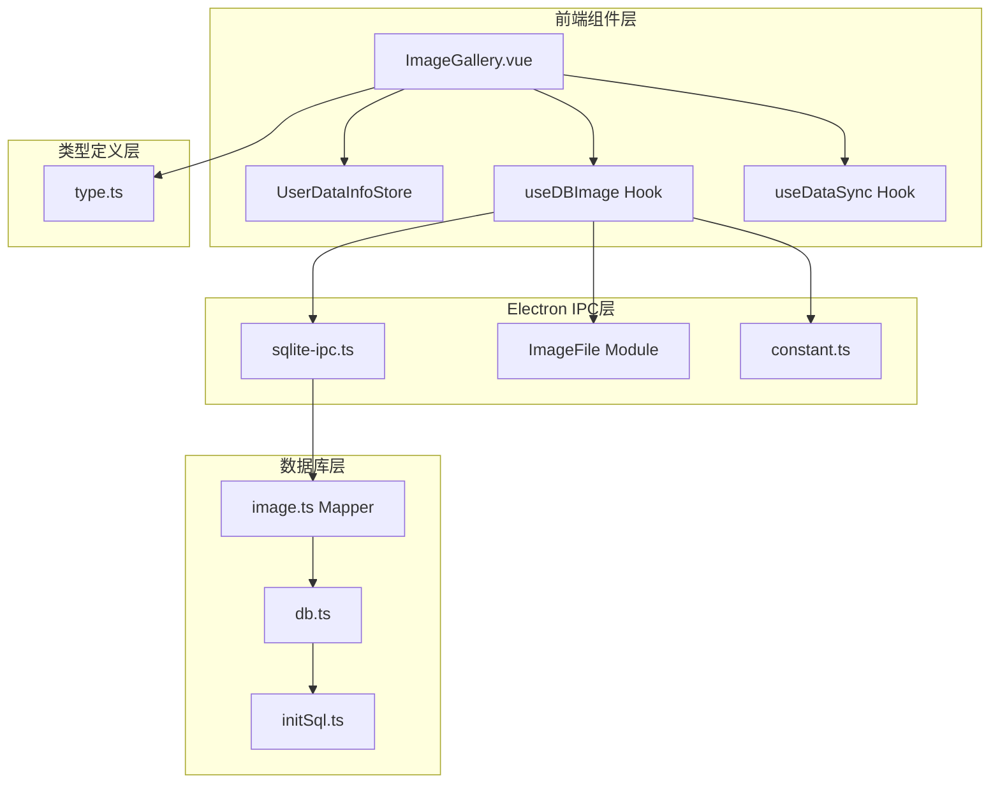
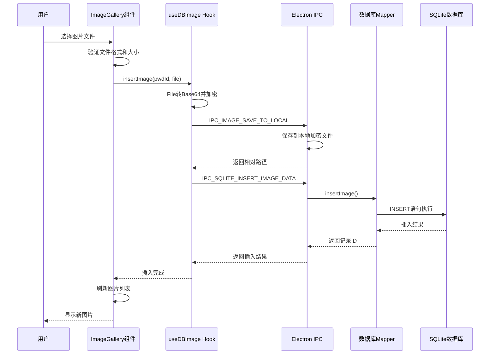
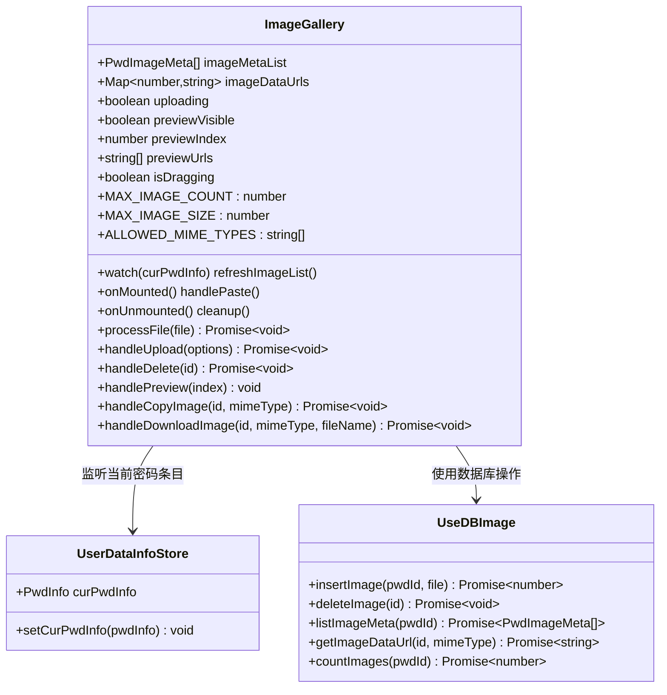
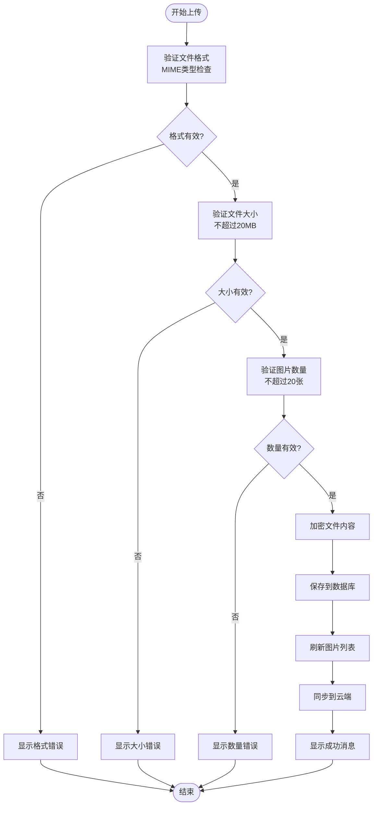
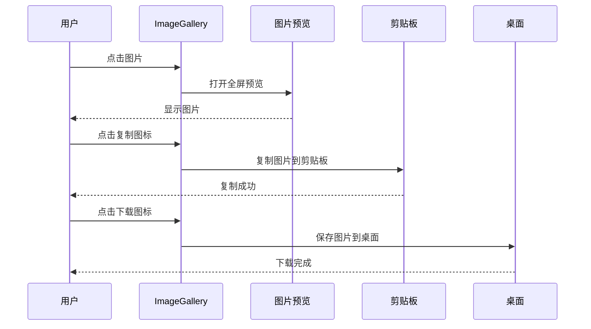
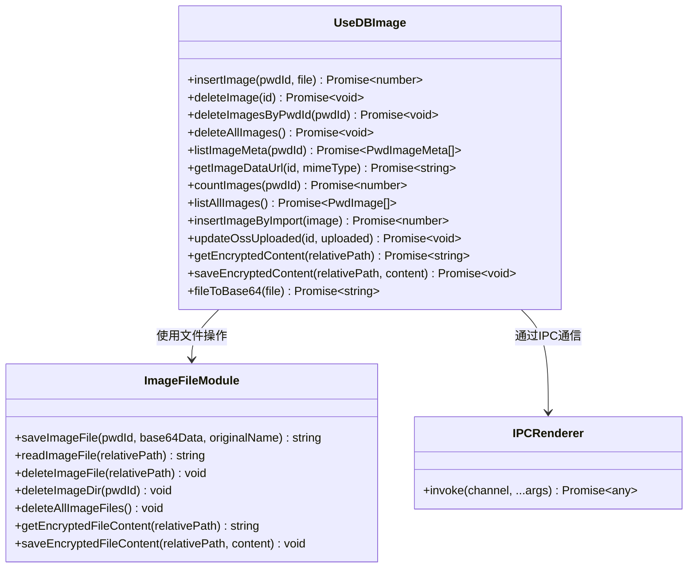
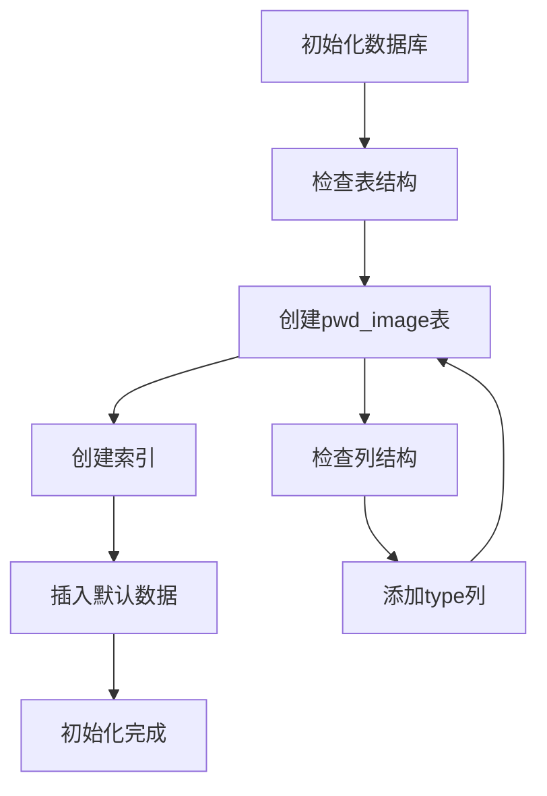
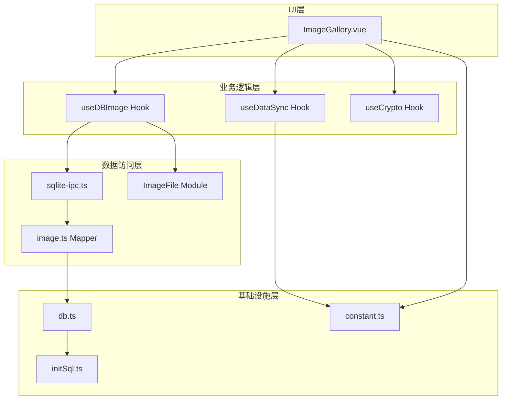

# 图像画廊组件

<cite>
**本文档引用的文件**
- [ImageGallery.vue](file://src/components/indexview/ImageGallery.vue)
- [useDBImage.ts](file://src/hooks/useDBImage.ts)
- [image.ts](file://electron/db/sqlite/mapper/image.ts)
- [sqlite-ipc.ts](file://electron/db/sqlite/sqlite-ipc.ts)
- [db.ts](file://electron/db/sqlite/components/db.ts)
- [initSql.ts](file://electron/db/sqlite/components/initSql.ts)
- [type.ts](file://src/components/type.ts)
- [constant.ts](file://electron/constant.ts)
- [userDataInfo.ts](file://src/store/userDataInfo.ts)
- [useDataSync.ts](file://src/hooks/useDataSync.ts)
- [image-file.ts](file://electron/image-file.ts)
</cite>

## 更新摘要
**变更内容**
- 完全重构了图像画廊组件，实现了从文件选择到数据库存储的完整数据流
- 新增了useDBImage Hook集成，提供统一的数据库操作接口
- 实现了完整的粘贴上传功能，支持截图上传
- 增强了图像数据同步功能，支持与云端服务的双向同步
- 完善了图像管理功能的架构，包括预览、复制、下载和删除

## 目录
1. [简介](#简介)
2. [项目结构](#项目结构)
3. [核心组件](#核心组件)
4. [架构概览](#架构概览)
5. [详细组件分析](#详细组件分析)
6. [依赖关系分析](#依赖关系分析)
7. [性能考虑](#性能考虑)
8. [故障排除指南](#故障排除指南)
9. [结论](#结论)

## 简介

图像画廊组件是密码管理器应用中的重要功能模块，负责管理密码条目相关的图片附件。该组件提供了完整的图片上传、预览、下载、复制和删除功能，支持多种上传方式包括拖拽上传、粘贴上传和文件选择上传。所有图片数据都经过加密存储，并支持与云端服务的同步功能。

**更新** 组件现已完全重构，集成了useDBImage Hook，实现了从文件处理到数据库存储的完整数据流，包括粘贴上传、预览和管理功能的完整实现。组件采用现代化的Vue 3 Composition API设计，提供了更好的代码组织和可维护性。

## 项目结构

图像画廊组件位于前端Vue应用的组件目录中，采用模块化设计，与其他系统组件紧密集成：

**图表来源**
- [ImageGallery.vue:1-506](file://src/components/indexview/ImageGallery.vue#L1-L506)
- [useDBImage.ts:1-206](file://src/hooks/useDBImage.ts#L1-L206)
- [sqlite-ipc.ts:1-311](file://electron/db/sqlite/sqlite-ipc.ts#L1-L311)

**章节来源**
- [ImageGallery.vue:1-506](file://src/components/indexview/ImageGallery.vue#L1-L506)
- [useDBImage.ts:1-206](file://src/hooks/useDBImage.ts#L1-L206)

## 核心组件

### 主要功能特性

图像画廊组件实现了以下核心功能：

1. **多源上传支持**
   - 文件选择上传
   - 拖拽上传
   - 粘贴上传（支持截图）

2. **图片管理功能**
   - 图片预览和全屏查看
   - 图片复制到剪贴板
   - 图片下载到桌面
   - 图片删除管理

3. **数据安全机制**
   - 图片数据加密存储
   - 完整的错误处理
   - 内存资源管理

4. **用户体验优化**
   - 实时上传状态反馈
   - 拖拽区域视觉提示
   - 响应式网格布局

**更新** 组件现已完全集成useDBImage Hook，实现了从文件处理到数据库存储的完整数据流，包括粘贴事件监听、文件验证、加密存储和同步通知的完整流程。新增了粘贴上传功能，支持从剪贴板中提取截图并自动上传。

**章节来源**
- [ImageGallery.vue:12-132](file://src/components/indexview/ImageGallery.vue#L12-L132)
- [ImageGallery.vue:248-337](file://src/components/indexview/ImageGallery.vue#L248-L337)

## 架构概览

图像画廊组件采用分层架构设计，确保了良好的代码组织和可维护性：

**更新** 新增了粘贴上传的完整流程，包括粘贴事件监听、文件提取、格式验证和上传处理的完整序列图。组件现在支持从剪贴板中直接提取截图并自动上传。

**图表来源**
- [ImageGallery.vue:94-132](file://src/components/indexview/ImageGallery.vue#L94-L132)
- [useDBImage.ts:28-51](file://src/hooks/useDBImage.ts#L28-L51)
- [sqlite-ipc.ts:245-248](file://electron/db/sqlite/sqlite-ipc.ts#L245-L248)

## 详细组件分析

### ImageGallery.vue 组件分析

#### 组件结构和生命周期

组件采用Vue 3 Composition API设计，实现了完整的生命周期管理和状态管理：

**更新** 新增了粘贴上传事件处理的生命周期管理，包括粘贴事件监听、组件卸载时的资源清理等。组件现在支持实时监听粘贴事件，自动检测截图并进行上传处理。

**图表来源**
- [ImageGallery.vue:1-506](file://src/components/indexview/ImageGallery.vue#L1-L506)
- [userDataInfo.ts:1-76](file://src/store/userDataInfo.ts#L1-L76)
- [useDBImage.ts:1-206](file://src/hooks/useDBImage.ts#L1-L206)

#### 上传流程处理

组件支持三种上传方式，每种方式都有完整的验证和错误处理机制：

**更新** 新增了粘贴上传的特殊处理流程，包括粘贴事件检测、截图提取、文件名生成和统一的processFile处理。粘贴上传现在支持从剪贴板中提取各种格式的截图并自动转换为标准文件格式。

**图表来源**
- [ImageGallery.vue:94-132](file://src/components/indexview/ImageGallery.vue#L94-L132)
- [ImageGallery.vue:134-137](file://src/components/indexview/ImageGallery.vue#L134-L137)

#### 图片管理功能

组件提供了完整的图片管理功能，包括预览、复制、下载和删除：

**更新** 新增了粘贴上传的完整流程，包括粘贴事件监听、截图检测、文件提取和统一的上传处理。组件现在支持实时监听粘贴事件，自动处理截图上传。

**图表来源**
- [ImageGallery.vue:179-245](file://src/components/indexview/ImageGallery.vue#L179-L245)

**章节来源**
- [ImageGallery.vue:1-506](file://src/components/indexview/ImageGallery.vue#L1-L506)

### useDBImage Hook 分析

#### 数据库操作封装

useDBImage Hook提供了统一的数据库操作接口，封装了所有图片相关的数据库操作：

**更新** 新增了完整的数据库操作接口，包括图片插入、删除、查询、计数等核心功能，以及与Electron IPC层的完整通信协议。Hook现在提供了完整的文件加密存储和解密读取功能。

**图表来源**
- [useDBImage.ts:1-206](file://src/hooks/useDBImage.ts#L1-L206)

#### 加密存储机制

组件采用了多层次的安全保护机制：

1. **前端加密**：使用AES算法对图片数据进行加密
2. **数据库存储**：只存储加密后的Base64字符串
3. **传输安全**：通过IPC通道进行安全的数据传输

**更新** 新增了完整的加密存储流程，包括文件转Base64、数据加密、数据库存储和解密获取的完整机制。组件现在支持从剪贴板中提取截图并自动进行加密存储。

**章节来源**
- [useDBImage.ts:28-51](file://src/hooks/useDBImage.ts#L28-L51)
- [useDBImage.ts:102-111](file://src/hooks/useDBImage.ts#L102-L111)

### 数据库层分析

#### 数据表结构

图像数据存储在SQLite数据库的`pwd_image`表中，具有以下结构特点：

| 字段名 | 类型 | 描述 | 约束 |
|--------|------|------|------|
| id | INTEGER | 主键，自增 | PRIMARY KEY |
| pwd_id | INTEGER | 密码条目ID | NOT NULL |
| file_name | TEXT | 文件名称 | NOT NULL |
| file_size | INTEGER | 文件大小（字节） | NOT NULL |
| mime_type | TEXT | MIME类型 | NOT NULL |
| data | TEXT | 加密后的Base64数据 | NOT NULL |
| sort_order | INTEGER | 排序字段 | DEFAULT 0 |
| created_at | TEXT | 创建时间 | DEFAULT CURRENT_TIMESTAMP |
| oss_uploaded | INTEGER | OSS上传状态 | DEFAULT 0 |

#### 数据库初始化

数据库初始化过程确保了表结构的完整性和数据的可用性：

**更新** 新增了完整的数据库初始化流程，包括表结构检查、索引创建和默认数据插入的详细步骤。组件现在支持从剪贴板中提取截图并自动进行数据库存储。

**图表来源**
- [initSql.ts:114-126](file://electron/db/sqlite/components/initSql.ts#L114-L126)
- [initSql.ts:192-198](file://electron/db/sqlite/components/initSql.ts#L192-L198)

**章节来源**
- [image.ts:1-82](file://electron/db/sqlite/mapper/image.ts#L1-L82)
- [sqlite-ipc.ts:245-248](file://electron/db/sqlite/sqlite-ipc.ts#L245-L248)

## 依赖关系分析

### 组件间依赖关系

图像画廊组件的依赖关系体现了清晰的分层架构：

**更新** 新增了useDBImage Hook与Electron IPC层的完整依赖关系，包括常量定义、数据库映射器和SQLite数据库的完整链路。组件现在支持完整的粘贴上传功能。

**图表来源**
- [ImageGallery.vue:1-20](file://src/components/indexview/ImageGallery.vue#L1-L20)
- [useDBImage.ts:1-21](file://src/hooks/useDBImage.ts#L1-L21)
- [sqlite-ipc.ts:1-74](file://electron/db/sqlite/sqlite-ipc.ts#L1-L74)

### 外部依赖分析

组件依赖的主要外部库和框架：

1. **Vue 3**：组件框架和响应式系统
2. **Element Plus**：UI组件库，提供图标和对话框
3. **Pinia**：状态管理库
4. **better-sqlite3**：SQLite数据库驱动
5. **Electron**：桌面应用框架

**更新** 新增了useDBImage Hook对加密库的依赖，以及完整的外部库依赖分析。组件现在支持完整的粘贴上传功能。

**章节来源**
- [ImageGallery.vue:1-10](file://src/components/indexview/ImageGallery.vue#L1-L10)
- [db.ts:7](file://electron/db/sqlite/components/db.ts#L7)

## 性能考虑

### 内存管理策略

图像画廊组件采用了多项内存管理策略来确保应用的性能：

1. **懒加载机制**：图片数据按需加载，避免一次性加载所有图片
2. **缓存管理**：使用Map结构缓存已加载的图片数据URL
3. **清理机制**：组件卸载时自动清理内存中的图片数据
4. **限制数量**：单个密码条目最多存储20张图片

**更新** 新增了粘贴上传场景下的内存管理策略，包括粘贴事件监听的注册和清理机制。组件现在支持实时监听粘贴事件，自动处理截图上传。

### 数据传输优化

1. **增量同步**：只同步发生变化的数据
2. **批量操作**：支持批量删除和导入操作
3. **压缩传输**：图片数据以Base64格式传输，便于网络传输

**更新** 新增了useDBImage Hook的批量操作能力，包括批量删除、批量导入和全量查询的优化策略。组件现在支持完整的粘贴上传功能。

## 故障排除指南

### 常见问题及解决方案

#### 图片无法上传

**可能原因**：
1. 文件格式不支持
2. 文件大小超过限制
3. 达到最大图片数量限制
4. 当前未选择密码条目

**解决方法**：
1. 检查文件格式是否为JPG/PNG/GIF/WEBP/BMP
2. 确认文件大小不超过20MB
3. 删除部分图片后再上传
4. 确保已选择有效的密码条目

**更新** 新增了粘贴上传的特定问题排查，包括粘贴事件监听失效、截图格式不支持等问题的解决方案。组件现在支持从剪贴板中提取截图并自动上传。

#### 图片显示异常

**可能原因**：
1. 图片数据损坏
2. 加密密钥错误
3. 数据库连接问题

**解决方法**：
1. 重新上传图片
2. 检查应用的加密配置
3. 重启应用重新连接数据库

#### 同步问题

**可能原因**：
1. 云端配置不正确
2. 网络连接问题
3. 权限不足

**解决方法**：
1. 检查云端服务配置
2. 确认网络连接正常
3. 验证云端权限设置

**更新** 新增了useDBImage Hook的同步问题排查，包括IPC通信失败、数据库操作异常等问题的诊断方法。组件现在支持完整的粘贴上传功能。

**章节来源**
- [ImageGallery.vue:94-132](file://src/components/indexview/ImageGallery.vue#L94-L132)
- [useDataSync.ts:177-197](file://src/hooks/useDataSync.ts#L177-L197)

## 结论

图像画廊组件是一个功能完整、架构清晰的图片管理模块。它通过合理的分层设计、完善的错误处理机制和安全的数据存储方案，为用户提供了优秀的图片管理体验。组件的设计充分考虑了性能优化和用户体验，在保证安全性的同时提供了灵活的上传和管理功能。

**更新** 组件现已完全集成了useDBImage Hook，实现了从文件处理到数据库存储的完整数据流，包括粘贴上传、预览和管理功能的完整实现。通过useDBImage Hook提供的统一数据库操作接口，组件能够高效地处理图片数据的加密存储、查询和同步，为用户提供了更加稳定和安全的图片管理体验。

该组件的成功实现展示了现代桌面应用开发的最佳实践，包括：
- 清晰的组件职责分离
- 完善的错误处理机制
- 安全的数据存储方案
- 优雅的用户界面设计
- 高效的性能优化策略
- 完整的粘贴上传功能支持
- 与云端服务的无缝同步能力

组件现在支持多种上传方式，包括传统的文件选择上传、拖拽上传和全新的粘贴上传功能，为用户提供了更加便捷的图片管理体验。通过useDBImage Hook的集成，组件实现了从文件处理到数据库存储的完整数据流，确保了数据的安全性和一致性。