# 文件画廊组件

<cite>
**本文档引用的文件**
- [FileGallery.vue](file://src/components/indexview/FileGallery.vue)
- [useDBFile.ts](file://src/hooks/useDBFile.ts)
- [image-file.ts](file://electron/image-file.ts)
- [image.ts](file://electron/db/sqlite/mapper/image.ts)
- [type.ts](file://src/components/type.ts)
- [configConstants.ts](file://electron/db/sqlite/components/configConstants.ts)
- [constant.ts](file://electron/constant.ts)
- [useDataSync.ts](file://src/hooks/useDataSync.ts)
- [initSql.ts](file://electron/db/sqlite/components/initSql.ts)
- [config.ts](file://src/config/config.ts)
</cite>

## 目录
1. [简介](#简介)
2. [项目结构](#项目结构)
3. [核心组件](#核心组件)
4. [架构概览](#架构概览)
5. [详细组件分析](#详细组件分析)
6. [依赖关系分析](#依赖关系分析)
7. [性能考虑](#性能考虑)
8. [故障排除指南](#故障排除指南)
9. [结论](#结论)

## 简介

文件画廊组件是密码管理器应用中的核心文件管理功能模块，负责密码条目的文件附件展示、上传、下载、删除和预览等功能。该组件采用现代化的Vue 3 Composition API开发，结合Electron的IPC机制实现了安全的文件存储和同步功能。

该组件支持多种文件类型的管理，包括图片（JPG、PNG、GIF、WEBP、BMP）、文档（PDF、TXT、MD）和Office文件（DOCX、XLSX、DOC、XLS），并提供了拖拽上传、粘贴上传、全屏预览等用户体验友好的功能。

## 项目结构

文件画廊组件位于项目的组件层次结构中，与密码信息管理、数据库操作、文件系统交互等多个模块协同工作：

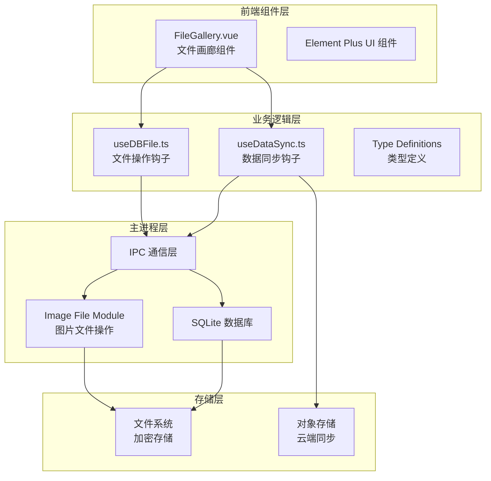

**图表来源**
- [FileGallery.vue:1-611](file://src/components/indexview/FileGallery.vue#L1-L611)
- [useDBFile.ts:1-206](file://src/hooks/useDBFile.ts#L1-L206)
- [image-file.ts:1-222](file://electron/image-file.ts#L1-L222)

**章节来源**
- [FileGallery.vue:1-611](file://src/components/indexview/FileGallery.vue#L1-L611)
- [useDBFile.ts:1-206](file://src/hooks/useDBFile.ts#L1-L206)

## 核心组件

文件画廊组件由多个核心部分组成，每个部分都有明确的职责和功能：

### 主要功能特性

1. **文件上传管理**
   - 支持拖拽上传、点击上传、粘贴上传三种方式
   - 文件类型验证和大小限制
   - 实时上传进度显示

2. **文件展示与预览**
   - 图片缩略图网格布局
   - 全屏图片预览器
   - 文件类型图标显示

3. **文件操作功能**
   - 在线下载和离线保存
   - 剪贴板图片复制
   - 安全删除确认

4. **数据同步支持**
   - 自动同步到云端存储
   - 版本控制和冲突解决
   - 批量文件管理

**章节来源**
- [FileGallery.vue:21-53](file://src/components/indexview/FileGallery.vue#L21-L53)
- [FileGallery.vue:134-170](file://src/components/indexview/FileGallery.vue#L134-L170)

## 架构概览

文件画廊组件采用了分层架构设计，确保了良好的代码组织和可维护性：

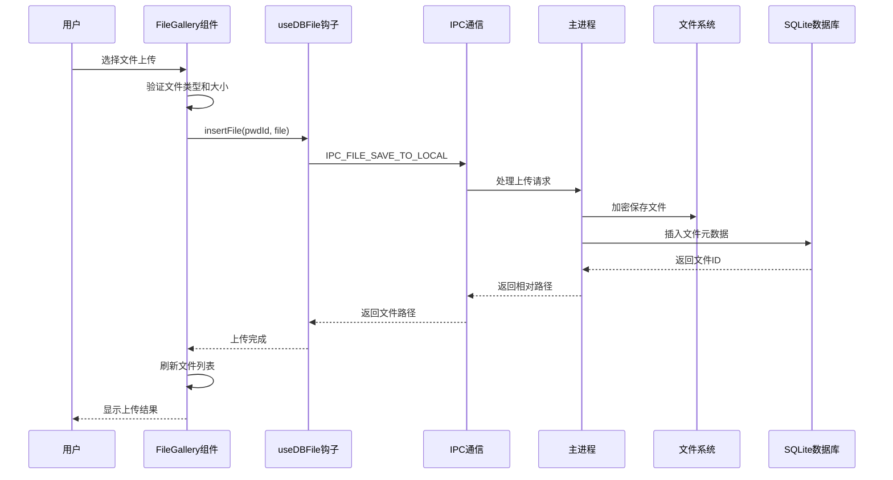

**图表来源**
- [useDBFile.ts:28-51](file://src/hooks/useDBFile.ts#L28-L51)
- [constant.ts:55-56](file://electron/constant.ts#L55-L56)

### 数据流架构

组件内部的数据流遵循单向数据流原则，确保了状态的一致性和可预测性：

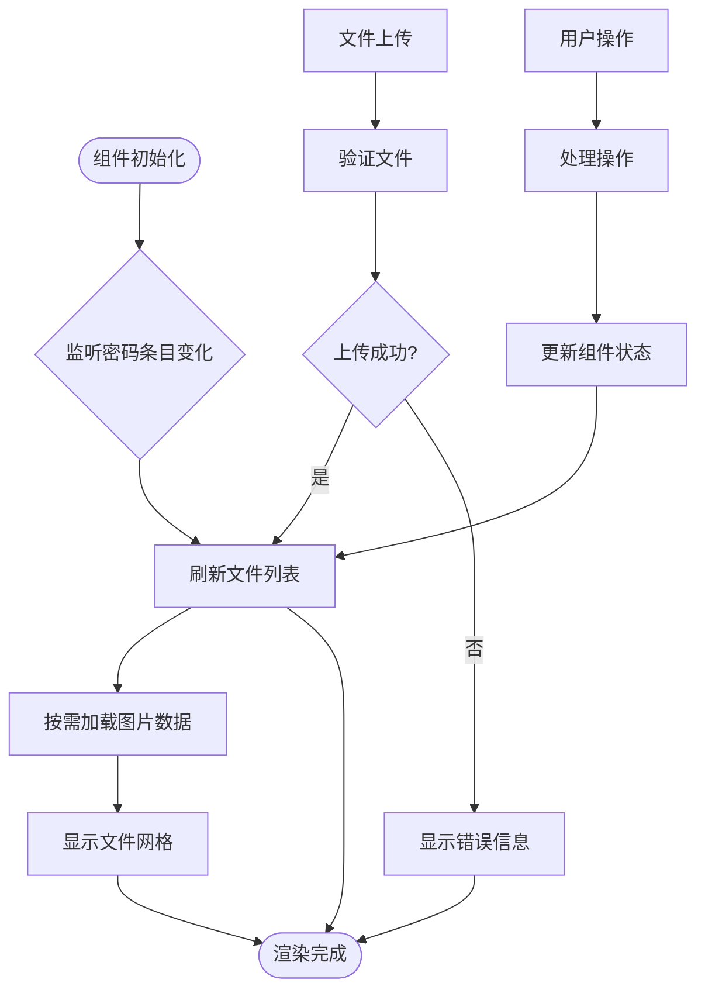

**图表来源**
- [FileGallery.vue:69-119](file://src/components/indexview/FileGallery.vue#L69-L119)
- [FileGallery.vue:167-170](file://src/components/indexview/FileGallery.vue#L167-L170)

## 详细组件分析

### FileGallery.vue 组件分析

FileGallery.vue 是整个文件画廊功能的核心组件，实现了完整的文件管理界面和业务逻辑。

#### 组件状态管理

组件使用Vue 3的响应式系统管理状态：

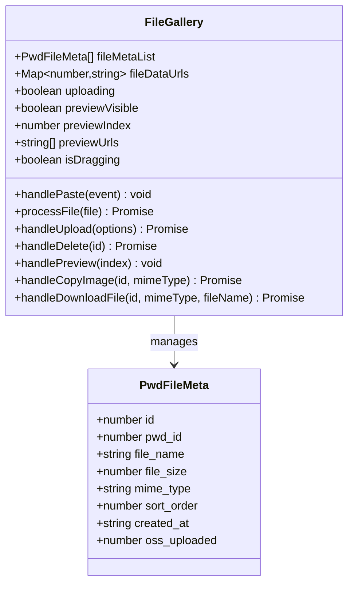

**图表来源**
- [FileGallery.vue:61-67](file://src/components/indexview/FileGallery.vue#L61-L67)
- [type.ts:108-117](file://src/components/type.ts#L108-L117)

#### 文件上传处理流程

组件支持多种文件上传方式，每种方式都经过统一的处理流程：

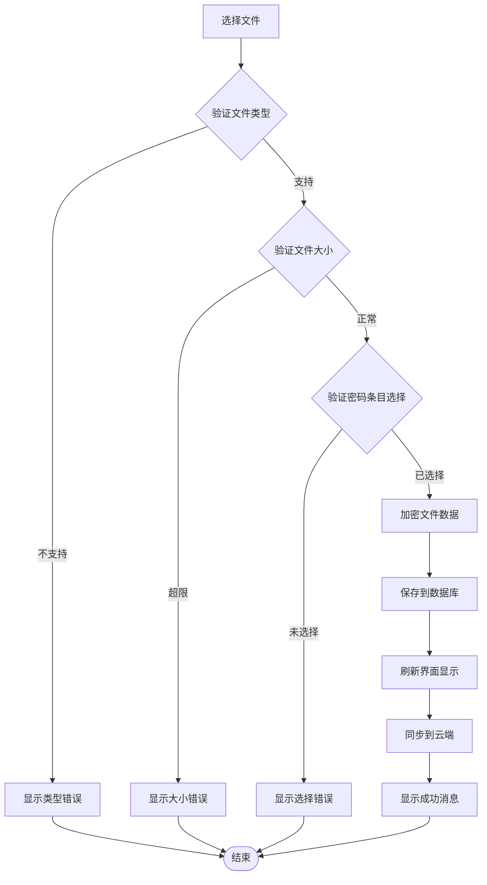

**图表来源**
- [FileGallery.vue:134-165](file://src/components/indexview/FileGallery.vue#L134-L165)
- [useDBFile.ts:28-51](file://src/hooks/useDBFile.ts#L28-L51)

#### 文件预览功能

图片文件支持全屏预览功能，提供了流畅的用户体验：

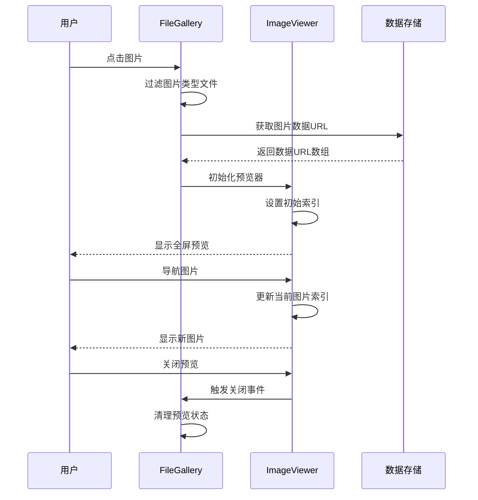

**图表来源**
- [FileGallery.vue:212-227](file://src/components/indexview/FileGallery.vue#L212-L227)
- [FileGallery.vue:411-417](file://src/components/indexview/FileGallery.vue#L411-L417)

**章节来源**
- [FileGallery.vue:1-611](file://src/components/indexview/FileGallery.vue#L1-L611)

### useDBFile.ts 钩子函数分析

useDBFile.ts 提供了文件操作的统一接口，封装了复杂的IPC通信逻辑：

#### 文件操作接口

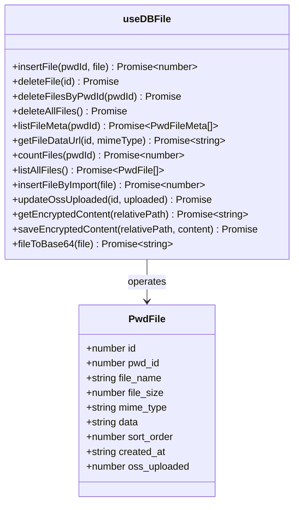

**图表来源**
- [useDBFile.ts:23-205](file://src/hooks/useDBFile.ts#L23-L205)
- [type.ts:95-105](file://src/components/type.ts#L95-L105)

#### IPC通信流程

文件操作通过IPC机制与主进程通信，确保了安全性：

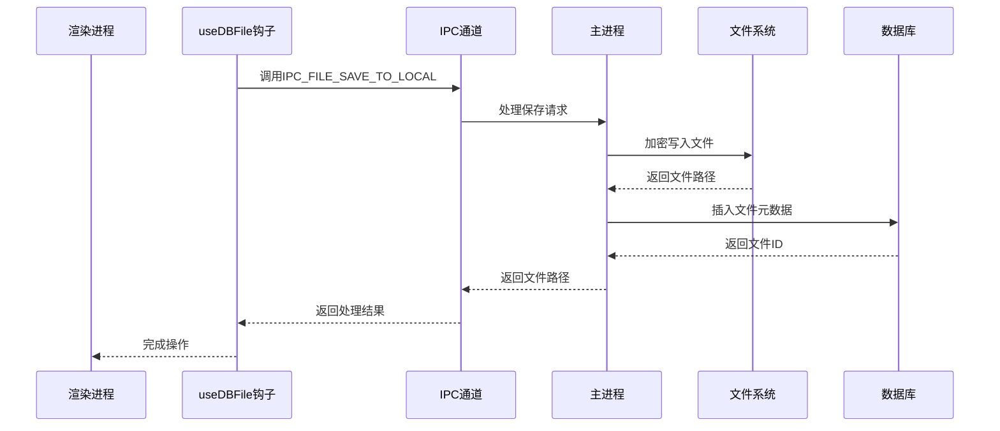

**图表来源**
- [useDBFile.ts:33-50](file://src/hooks/useDBFile.ts#L33-L50)
- [constant.ts:55-56](file://electron/constant.ts#L55-L56)

**章节来源**
- [useDBFile.ts:1-206](file://src/hooks/useDBFile.ts#L1-L206)

### 主进程文件处理模块

electron/image-file.ts 提供了主进程级别的文件处理能力，确保了文件存储的安全性：

#### 加密存储机制

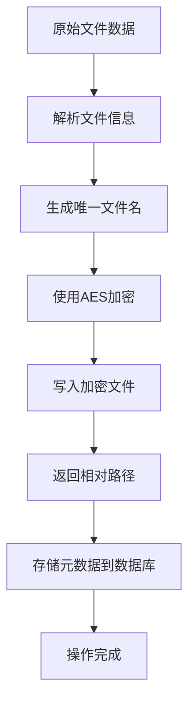

**图表来源**
- [image-file.ts:83-97](file://electron/image-file.ts#L83-L97)
- [image-file.ts:50-74](file://electron/image-file.ts#L50-L74)

#### 数据迁移功能

为了兼容旧版本数据，系统提供了自动迁移功能：

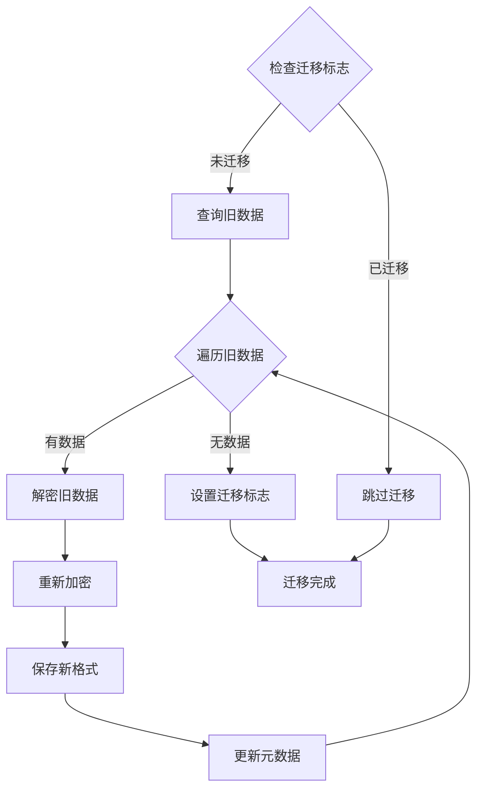

**图表来源**
- [initSql.ts:218-261](file://electron/db/sqlite/components/initSql.ts#L218-L261)
- [image-file.ts:211-221](file://electron/image-file.ts#L211-L221)

**章节来源**
- [image-file.ts:1-222](file://electron/image-file.ts#L1-L222)
- [initSql.ts:218-261](file://electron/db/sqlite/components/initSql.ts#L218-L261)

## 依赖关系分析

文件画廊组件的依赖关系体现了清晰的分层架构：

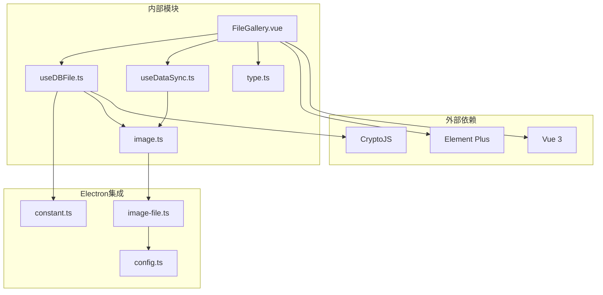

**图表来源**
- [FileGallery.vue:1-15](file://src/components/indexview/FileGallery.vue#L1-L15)
- [useDBFile.ts:1-21](file://src/hooks/useDBFile.ts#L1-L21)
- [constant.ts:1-96](file://electron/constant.ts#L1-L96)

### 数据库模型关系

文件画廊功能涉及的数据库表结构如下：

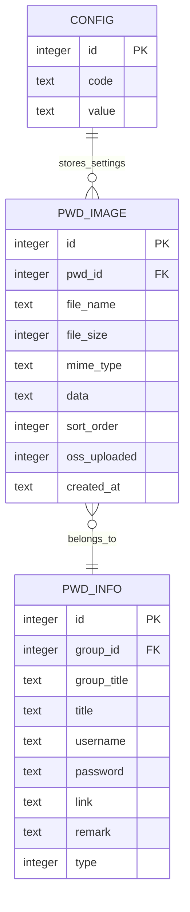

**图表来源**
- [initSql.ts:118-130](file://electron/db/sqlite/components/initSql.ts#L118-L130)
- [image.ts:6-81](file://electron/db/sqlite/mapper/image.ts#L6-L81)

**章节来源**
- [type.ts:95-129](file://src/components/type.ts#L95-L129)
- [initSql.ts:118-130](file://electron/db/sqlite/components/initSql.ts#L118-L130)

## 性能考虑

文件画廊组件在设计时充分考虑了性能优化：

### 内存管理策略

1. **按需加载图片数据**
   - 仅在需要时加载图片的Data URL
   - 使用Map缓存已加载的图片数据
   - 组件卸载时清理内存占用

2. **文件大小限制**
   - 默认20MB文件大小限制
   - 防止大文件影响性能

3. **虚拟滚动优化**
   - 采用网格布局而非列表布局
   - 减少DOM节点数量

### 网络传输优化

1. **增量同步**
   - 仅同步未上传的文件
   - 使用版本控制避免重复传输

2. **批量操作**
   - 支持批量删除和下载
   - 减少IPC通信次数

3. **缓存机制**
   - 本地文件系统缓存
   - 避免重复的网络请求

## 故障排除指南

### 常见问题及解决方案

#### 文件上传失败

**问题症状**：文件上传后显示失败消息

**可能原因**：
1. 文件类型不受支持
2. 文件大小超出限制
3. 密码条目未选择
4. 磁盘空间不足

**解决步骤**：
1. 检查文件类型是否在支持列表中
2. 确认文件大小不超过20MB限制
3. 确保选择了有效的密码条目
4. 检查磁盘空间是否充足

#### 图片预览空白

**问题症状**：点击图片后无法显示预览

**可能原因**：
1. 图片数据加载失败
2. 缓存数据损坏
3. 浏览器兼容性问题

**解决步骤**：
1. 刷新页面重新加载数据
2. 清除浏览器缓存
3. 尝试使用其他浏览器

#### 同步功能异常

**问题症状**：文件同步到云端失败

**可能原因**：
1. 网络连接不稳定
2. 云端存储配置错误
3. 权限不足

**解决步骤**：
1. 检查网络连接状态
2. 验证云端存储配置信息
3. 确认具有相应的访问权限

**章节来源**
- [FileGallery.vue:134-165](file://src/components/indexview/FileGallery.vue#L134-L165)
- [useDataSync.ts:82-176](file://src/hooks/useDataSync.ts#L82-L176)

## 结论

文件画廊组件是密码管理器应用中功能完整、架构清晰的文件管理模块。它通过现代化的技术栈实现了安全、高效的文件管理功能，为用户提供了优秀的使用体验。

### 主要优势

1. **安全性**：采用AES加密存储，确保文件数据安全
2. **易用性**：提供多种上传方式和直观的操作界面
3. **可靠性**：完善的错误处理和数据恢复机制
4. **扩展性**：模块化设计便于功能扩展和维护

### 技术亮点

1. **响应式设计**：基于Vue 3 Composition API，提供良好的开发体验
2. **分层架构**：清晰的职责分离，便于测试和维护
3. **异步处理**：充分利用Promise和async/await，提升用户体验
4. **数据同步**：支持云端同步，确保数据一致性

该组件为密码管理器提供了坚实的文件管理基础，是整个应用生态系统中不可或缺的重要组成部分。