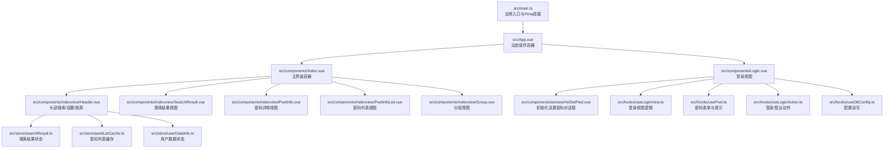
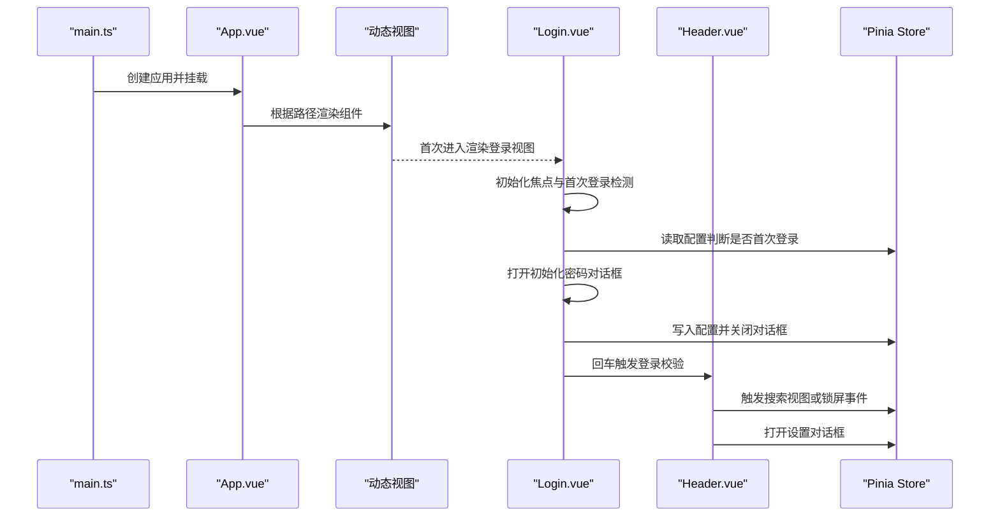
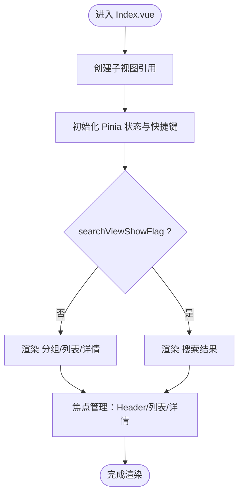
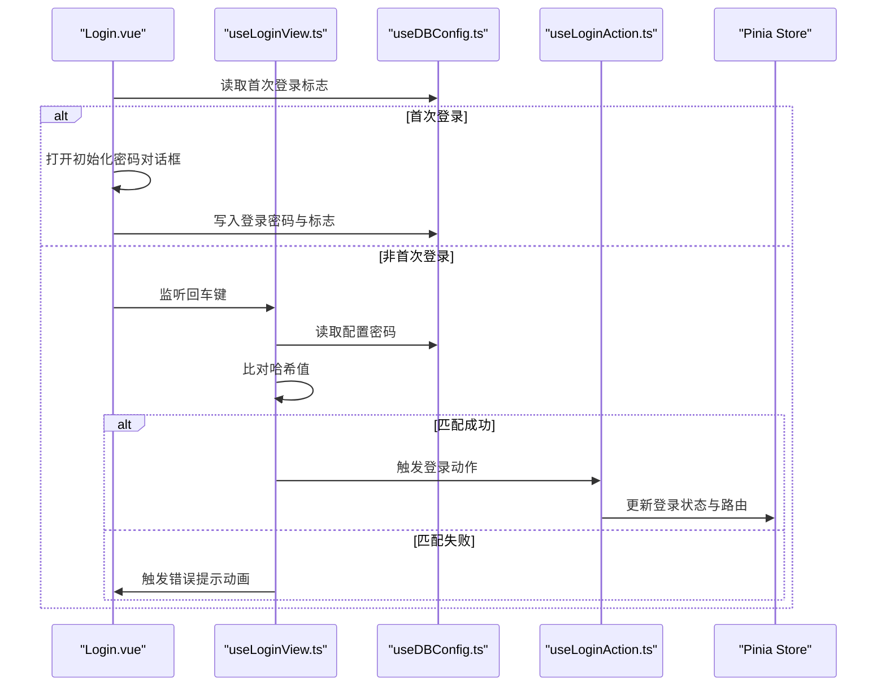
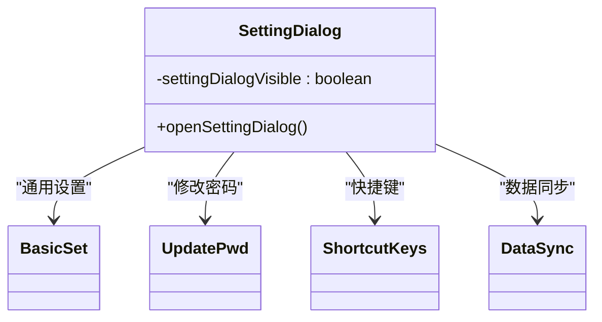
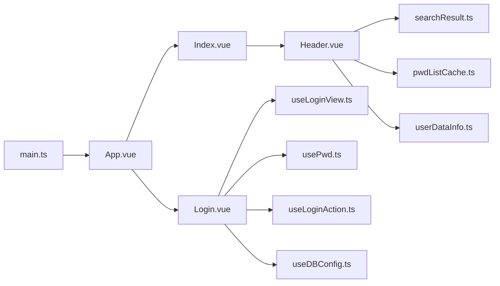

# 核心组件设计

<cite>
**本文引用的文件**
- [src/App.vue](file://src/App.vue)
- [src/main.ts](file://src/main.ts)
- [src/components/Index.vue](file://src/components/Index.vue)
- [src/components/Login.vue](file://src/components/Login.vue)
- [src/components/SettingDialog.vue](file://src/components/SettingDialog.vue)
- [src/components/indexview/Header.vue](file://src/components/indexview/Header.vue)
- [src/hooks/useLoginView.ts](file://src/hooks/useLoginView.ts)
- [src/hooks/usePwd.ts](file://src/hooks/usePwd.ts)
- [src/hooks/useLoginAction.ts](file://src/hooks/useLoginAction.ts)
- [src/hooks/useDBConfig.ts](file://src/hooks/useDBConfig.ts)
- [src/store/searchResult.ts](file://src/store/searchResult.ts)
- [src/store/pwdListCache.ts](file://src/store/pwdListCache.ts)
- [src/store/userDataInfo.ts](file://src/store/userDataInfo.ts)
- [src/components/setview/InitSetPwd.vue](file://src/components/setview/InitSetPwd.vue)
- [src/config/config.ts](file://src/config/config.ts)
</cite>

## 目录
1. [引言](#引言)
2. [项目结构](#项目结构)
3. [核心组件](#核心组件)
4. [架构总览](#架构总览)
5. [详细组件分析](#详细组件分析)
6. [依赖关系分析](#依赖关系分析)
7. [性能考虑](#性能考虑)
8. [故障排查指南](#故障排查指南)
9. [结论](#结论)
10. [附录](#附录)

## 引言
本文件聚焦于密码管理器的核心组件设计，围绕以下目标展开：
- 深入解析 Index.vue 主界面的架构设计、组件层次与布局管理
- 详述 Login.vue 登录组件的身份验证流程、密码输入校验与会话管理
- 阐明 SettingDialog.vue 设置对话框的设计模式、状态管理与用户交互
- 总结组件间通信机制、Props 传递与事件处理模式
- 提供组件复用策略、生命周期管理与性能优化建议
- 记录样式定制、主题适配与响应式设计实现

## 项目结构
应用采用基于功能域的组织方式，核心入口由 App.vue 控制动态组件渲染，Index.vue 作为主界面承载多个子视图；登录流程由 Login.vue 与一系列 Hooks/Store 协同完成；设置对话框通过 SettingDialog.vue 封装多标签页设置项。

图表来源
- [src/main.ts:1-20](file://src/main.ts#L1-L20)
- [src/App.vue:1-19](file://src/App.vue#L1-L19)
- [src/components/Index.vue:1-81](file://src/components/Index.vue#L1-L81)
- [src/components/Login.vue:1-129](file://src/components/Login.vue#L1-L129)
- [src/components/indexview/Header.vue:1-257](file://src/components/indexview/Header.vue#L1-L257)
- [src/store/searchResult.ts:1-49](file://src/store/searchResult.ts#L1-L49)
- [src/store/pwdListCache.ts:1-37](file://src/store/pwdListCache.ts#L1-L37)
- [src/store/userDataInfo.ts:1-76](file://src/store/userDataInfo.ts#L1-L76)
- [src/components/setview/InitSetPwd.vue:1-46](file://src/components/setview/InitSetPwd.vue#L1-L46)
- [src/hooks/useLoginView.ts:1-54](file://src/hooks/useLoginView.ts#L1-L54)
- [src/hooks/usePwd.ts:1-166](file://src/hooks/usePwd.ts#L1-L166)
- [src/hooks/useLoginAction.ts:1-19](file://src/hooks/useLoginAction.ts#L1-L19)
- [src/hooks/useDBConfig.ts:1-21](file://src/hooks/useDBConfig.ts#L1-L21)

章节来源
- [src/main.ts:1-20](file://src/main.ts#L1-L20)
- [src/App.vue:1-19](file://src/App.vue#L1-L19)

## 核心组件
本节概述三个关键组件的职责与协作：
- Index.vue：主界面容器，负责布局与子视图切换，协调焦点与快捷键
- Login.vue：登录入口，处理首次登录引导、密码输入与回车触发
- SettingDialog.vue：设置对话框封装，暴露方法供父组件调用，内部多标签页承载具体设置项

章节来源
- [src/components/Index.vue:1-81](file://src/components/Index.vue#L1-L81)
- [src/components/Login.vue:1-129](file://src/components/Login.vue#L1-L129)
- [src/components/SettingDialog.vue:1-60](file://src/components/SettingDialog.vue#L1-L60)

## 架构总览
下图展示从应用启动到登录、再到主界面与设置交互的整体流程：

图表来源
- [src/main.ts:1-20](file://src/main.ts#L1-L20)
- [src/App.vue:1-19](file://src/App.vue#L1-L19)
- [src/components/Login.vue:1-129](file://src/components/Login.vue#L1-L129)
- [src/components/indexview/Header.vue:1-257](file://src/components/indexview/Header.vue#L1-L257)
- [src/store/searchResult.ts:1-49](file://src/store/searchResult.ts#L1-L49)
- [src/store/userDataInfo.ts:1-76](file://src/store/userDataInfo.ts#L1-L76)

## 详细组件分析

### Index.vue 主界面组件
- 组件定位：主界面容器，统一管理头部、分组、列表、搜索结果与详情视图的显示与隐藏
- 布局管理：外层容器占满视口，内容区域按高度计算，采用 Flex 布局承载子视图
- 焦点控制：通过引用与回调在不同视图间切换焦点，提升键盘导航体验
- 状态联动：依赖 Pinia 搜索结果状态决定子视图渲染分支

图表来源
- [src/components/Index.vue:1-81](file://src/components/Index.vue#L1-L81)
- [src/store/searchResult.ts:1-49](file://src/store/searchResult.ts#L1-L49)

章节来源
- [src/components/Index.vue:1-81](file://src/components/Index.vue#L1-L81)

### Login.vue 登录组件
- 身份验证流程：
  - 首次登录检测：读取配置标志，若未设置则弹出初始化密码对话框
  - 密码输入与校验：监听回车键，使用哈希算法比对配置值，成功则触发登录动作
  - 会话管理：登录成功后切换路由至主界面，并同步本地数据
- 密码输入验证：
  - Caps Lock 提示：全局键盘事件监听，实时反馈大写锁定状态
  - 表单规则：密码长度与二次确认一致性校验
- 会话管理：
  - 登录成功后更新用户状态，触发本地数据同步
  - 登出时重置状态并返回登录界面

图表来源
- [src/components/Login.vue:1-129](file://src/components/Login.vue#L1-L129)
- [src/hooks/useLoginView.ts:1-54](file://src/hooks/useLoginView.ts#L1-L54)
- [src/hooks/usePwd.ts:1-166](file://src/hooks/usePwd.ts#L1-L166)
- [src/hooks/useLoginAction.ts:1-19](file://src/hooks/useLoginAction.ts#L1-L19)
- [src/hooks/useDBConfig.ts:1-21](file://src/hooks/useDBConfig.ts#L1-L21)
- [src/store/userDataInfo.ts:1-76](file://src/store/userDataInfo.ts#L1-L76)

章节来源
- [src/components/Login.vue:1-129](file://src/components/Login.vue#L1-L129)
- [src/hooks/useLoginView.ts:1-54](file://src/hooks/useLoginView.ts#L1-L54)
- [src/hooks/usePwd.ts:1-166](file://src/hooks/usePwd.ts#L1-L166)
- [src/hooks/useLoginAction.ts:1-19](file://src/hooks/useLoginAction.ts#L1-L19)
- [src/hooks/useDBConfig.ts:1-21](file://src/hooks/useDBConfig.ts#L1-L21)

### SettingDialog.vue 设置对话框
- 设计模式：基于 Element Plus 对话框与标签页，内部聚合多个设置子组件
- 状态管理：通过局部 ref 控制可见性，对外暴露 open 方法供父组件调用
- 用户交互：点击设置图标触发打开，内部标签页承载通用设置、快捷键、修改密码与数据同步等功能

图表来源
- [src/components/SettingDialog.vue:1-60](file://src/components/SettingDialog.vue#L1-L60)
- [src/components/setview/BasicSet.vue](file://src/components/setview/BasicSet.vue)
- [src/components/setview/UpdatePwd.vue](file://src/components/setview/UpdatePwd.vue)
- [src/components/setview/ShortcutKeys.vue](file://src/components/setview/ShortcutKeys.vue)
- [src/components/setview/DataSync.vue](file://src/components/setview/DataSync.vue)

章节来源
- [src/components/SettingDialog.vue:1-60](file://src/components/SettingDialog.vue#L1-L60)

### 组件间通信与 Props/事件
- Header.vue 与 Index.vue：Header 通过 Prop 接收焦点转移回调，实现跨组件焦点控制
- Header.vue 与 SettingDialog.vue：Header 持有 SettingDialog 引用，直接调用其暴露的 open 方法
- 全局事件：Header 监听锁屏事件，根据当前视图决定返回首页或退出登录
- Pinia 状态：搜索结果、用户数据、快捷键组合等通过 Store 在组件间共享

章节来源
- [src/components/indexview/Header.vue:1-257](file://src/components/indexview/Header.vue#L1-L257)
- [src/components/Index.vue:1-81](file://src/components/Index.vue#L1-L81)
- [src/store/searchResult.ts:1-49](file://src/store/searchResult.ts#L1-L49)
- [src/store/userDataInfo.ts:1-76](file://src/store/userDataInfo.ts#L1-L76)

## 依赖关系分析
- 应用层：main.ts 创建应用并注册 Pinia；App.vue 作为根组件，依据路由动态渲染组件
- 视图层：Index.vue 作为主界面容器，依赖 Header、SearchResult、PwdInfo、PwdInfoList、Group 等子视图
- 业务层：Login.vue 与 useLoginView.ts、usePwd.ts、useLoginAction.ts、useDBConfig.ts 协作完成登录与配置管理
- 状态层：searchResult.ts、pwdListCache.ts、userDataInfo.ts 提供搜索、缓存与用户数据的状态管理

图表来源
- [src/main.ts:1-20](file://src/main.ts#L1-L20)
- [src/App.vue:1-19](file://src/App.vue#L1-L19)
- [src/components/Index.vue:1-81](file://src/components/Index.vue#L1-L81)
- [src/components/Login.vue:1-129](file://src/components/Login.vue#L1-L129)
- [src/components/indexview/Header.vue:1-257](file://src/components/indexview/Header.vue#L1-L257)
- [src/store/searchResult.ts:1-49](file://src/store/searchResult.ts#L1-L49)
- [src/store/pwdListCache.ts:1-37](file://src/store/pwdListCache.ts#L1-L37)
- [src/store/userDataInfo.ts:1-76](file://src/store/userDataInfo.ts#L1-L76)
- [src/hooks/useLoginView.ts:1-54](file://src/hooks/useLoginView.ts#L1-L54)
- [src/hooks/usePwd.ts:1-166](file://src/hooks/usePwd.ts#L1-L166)
- [src/hooks/useLoginAction.ts:1-19](file://src/hooks/useLoginAction.ts#L1-L19)
- [src/hooks/useDBConfig.ts:1-21](file://src/hooks/useDBConfig.ts#L1-L21)

章节来源
- [src/main.ts:1-20](file://src/main.ts#L1-L20)
- [src/App.vue:1-19](file://src/App.vue#L1-L19)

## 性能考虑
- 搜索防抖与请求去重：Header.vue 对输入进行防抖处理，并通过计数器确保仅显示最新搜索结果，避免竞态与无效渲染
- 列表缓存：pwdListCache.ts 在应用挂载时预加载常用字段，减少后续查询成本
- 状态集中：Pinia Store 将跨组件共享状态集中管理，降低重复计算与跨组件传递成本
- 主题切换：Header.vue 读取配置并在切换时更新全局主题开关，避免不必要的重绘

章节来源
- [src/components/indexview/Header.vue:98-157](file://src/components/indexview/Header.vue#L98-L157)
- [src/store/pwdListCache.ts:15-33](file://src/store/pwdListCache.ts#L15-L33)
- [src/store/searchResult.ts:13-48](file://src/store/searchResult.ts#L13-L48)

## 故障排查指南
- 登录失败提示：usePwd.ts 提供错误背景动画与消息提示，便于快速定位输入错误
- 首次登录异常：InitSetPwd.vue 在首次登录时弹窗设置密码，若中途取消需正确更新配置标志
- 锁屏事件：Header.vue 监听锁屏事件，若当前处于搜索页则返回首页，否则退出登录
- 配置读写：useDBConfig.ts 通过 IPC 与后端交互，若读写失败需检查 IPC 常量与后端实现

章节来源
- [src/hooks/usePwd.ts:101-116](file://src/hooks/usePwd.ts#L101-L116)
- [src/components/setview/InitSetPwd.vue:12-41](file://src/components/setview/InitSetPwd.vue#L12-L41)
- [src/components/indexview/Header.vue:62-82](file://src/components/indexview/Header.vue#L62-L82)
- [src/hooks/useDBConfig.ts:6-18](file://src/hooks/useDBConfig.ts#L6-L18)

## 结论
本设计通过清晰的组件边界与 Pinia 状态管理，实现了登录、主界面与设置模块的解耦与高内聚。Index.vue 作为容器组件承担布局与焦点控制，Login.vue 与 Hooks/Store 协作完成身份验证与会话管理，SettingDialog.vue 以对话框形式聚合设置项并提供可复用的交互模式。配合搜索防抖、列表缓存与主题切换等优化，整体具备良好的可用性与扩展性。

## 附录
- 样式定制与主题适配：Header.vue 支持主题切换并通过全局变量控制样式；SettingDialog.vue 使用 Element Plus 标签页实现多面板设置
- 响应式设计：各组件采用固定宽高与 Flex 布局，结合媒体查询与元素尺寸单位实现基本响应式表现

章节来源
- [src/components/indexview/Header.vue:187-194](file://src/components/indexview/Header.vue#L187-L194)
- [src/components/SettingDialog.vue:21-45](file://src/components/SettingDialog.vue#L21-L45)
- [src/config/config.ts:84-142](file://src/config/config.ts#L84-L142)