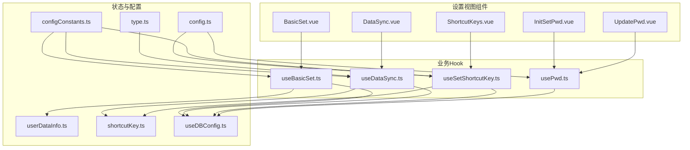
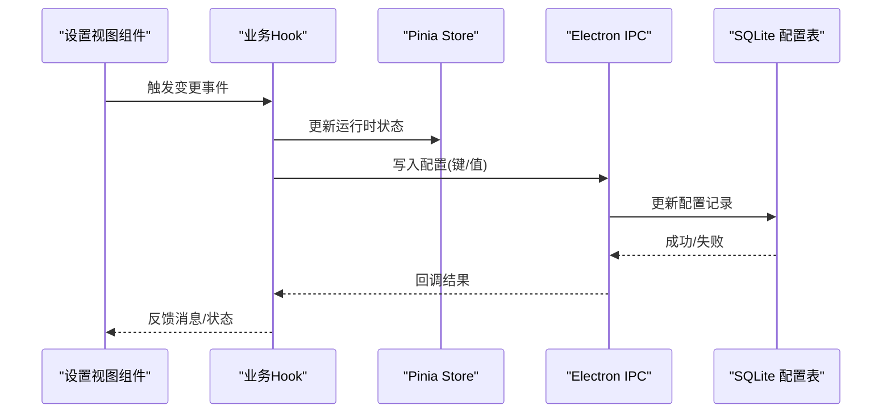
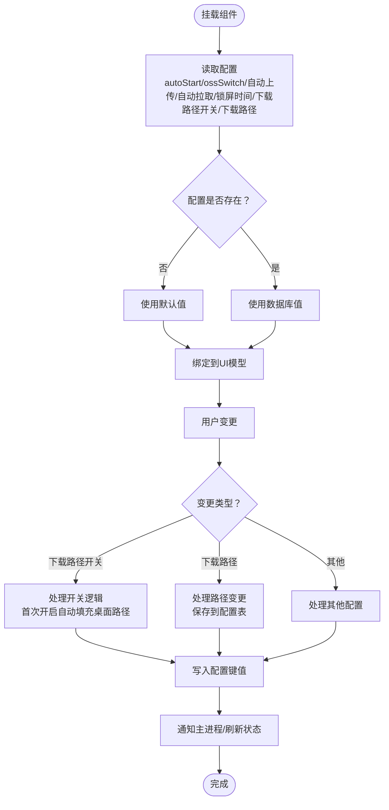
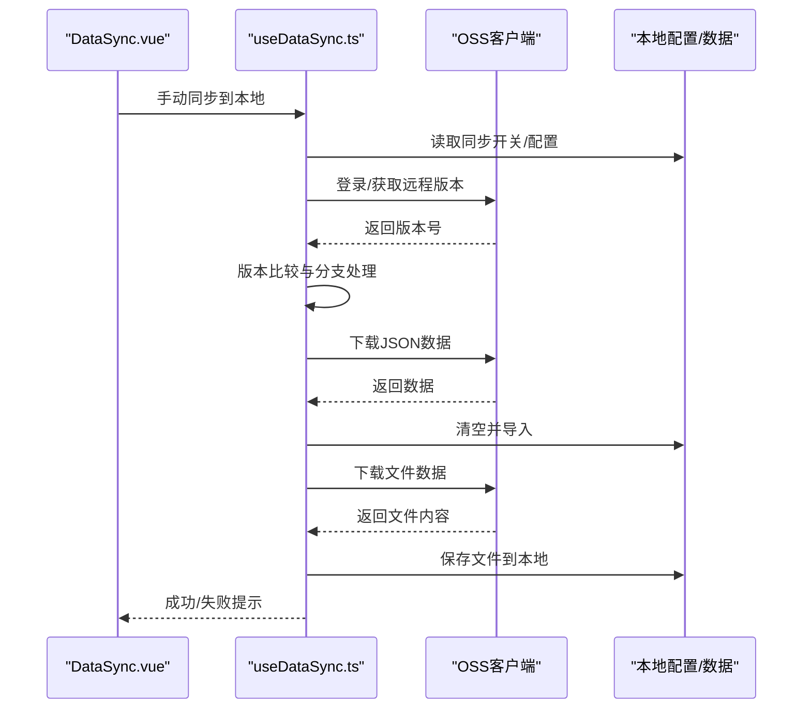
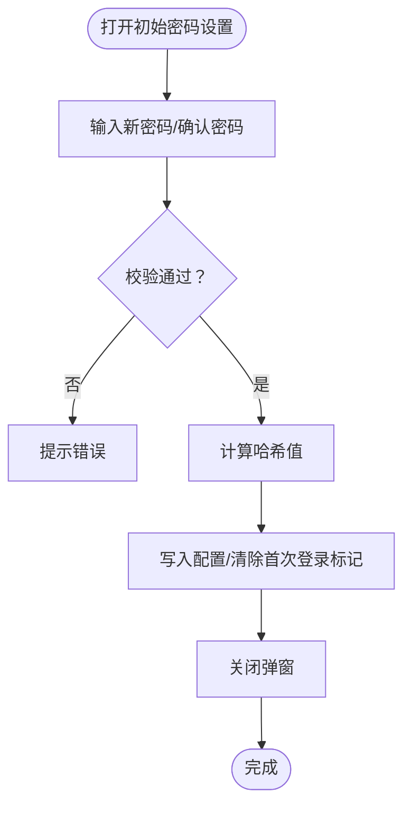
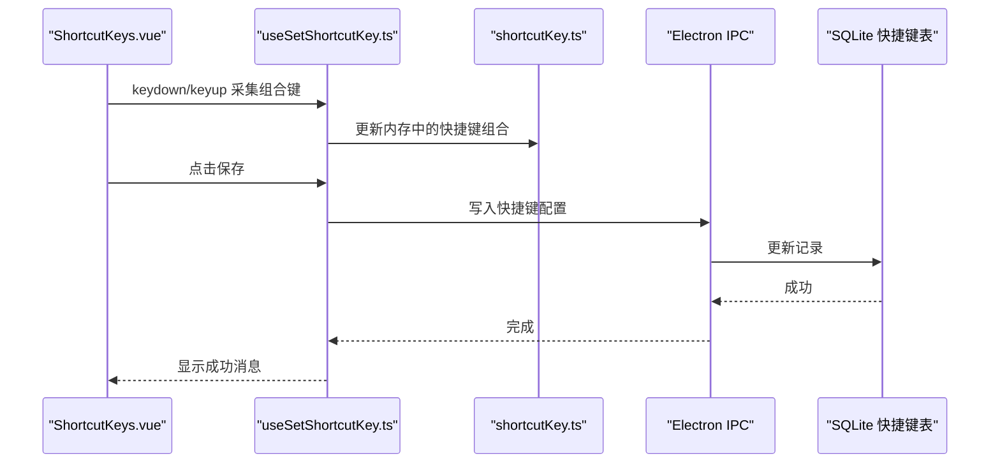
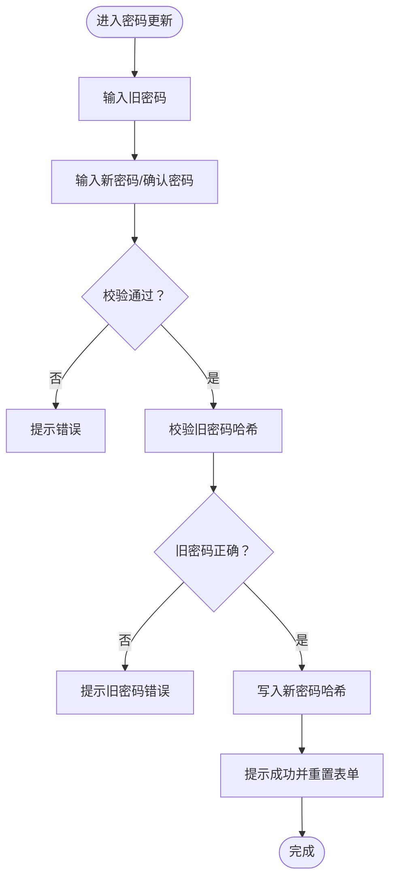
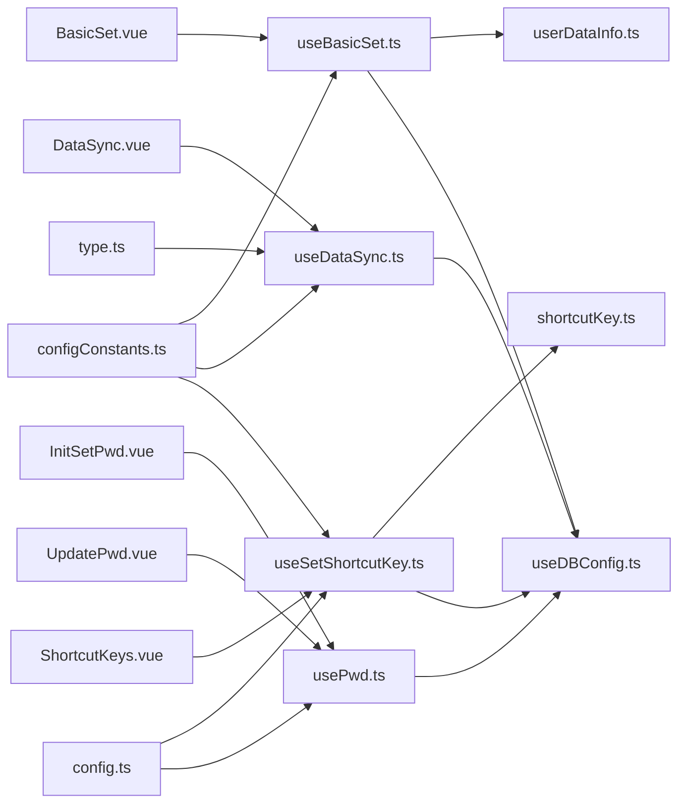

# 设置管理组件

<cite>
**本文引用的文件**
- [BasicSet.vue](file://src/components/setview/BasicSet.vue)
- [DataSync.vue](file://src/components/setview/DataSync.vue)
- [InitSetPwd.vue](file://src/components/setview/InitSetPwd.vue)
- [ShortcutKeys.vue](file://src/components/setview/ShortcutKeys.vue)
- [UpdatePwd.vue](file://src/components/setview/UpdatePwd.vue)
- [useBasicSet.ts](file://src/hooks/useBasicSet.ts)
- [useDataSync.ts](file://src/hooks/useDataSync.ts)
- [usePwd.ts](file://src/hooks/usePwd.ts)
- [useSetShortcutKey.ts](file://src/hooks/useSetShortcutKey.ts)
- [config.ts](file://src/config/config.ts)
- [userDataInfo.ts](file://src/store/userDataInfo.ts)
- [shortcutKey.ts](file://src/store/shortcutKey.ts)
- [configConstants.ts](file://electron/db/sqlite/components/configConstants.ts)
- [type.ts](file://src/components/type.ts)
- [useDBConfig.ts](file://src/hooks/useDBConfig.ts)
</cite>

## 更新摘要
**变更内容**
- 新增下载路径配置功能，支持启用/禁用默认下载路径开关
- 新增默认下载路径选择与持久化存储功能
- 增强基础设置组件的配置项管理能力
- 完善文件存储设置的相关逻辑

## 目录
1. [简介](#简介)
2. [项目结构](#项目结构)
3. [核心组件](#核心组件)
4. [架构总览](#架构总览)
5. [详细组件分析](#详细组件分析)
6. [依赖关系分析](#依赖关系分析)
7. [性能考虑](#性能考虑)
8. [故障排查指南](#故障排查指南)
9. [结论](#结论)
10. [附录](#附录)

## 简介
本文件系统性梳理设置管理相关组件，覆盖基础设置、数据同步、初始密码设置、快捷键配置与密码更新五大模块。重点阐述配置项管理、参数验证、实时生效机制、同步策略与冲突处理、进度反馈、安全流程与密码强度验证、按键监听与冲突检测、自定义映射、持久化存储与默认值管理、配置迁移等主题，帮助开发者与使用者全面掌握设置体系。

**更新** 新增下载路径配置功能，支持用户自定义文件下载位置，提升文件管理的便利性。

## 项目结构
设置管理组件位于前端 src/components/setview 目录下，配套 Hook 位于 src/hooks，全局配置与常量位于 src/config，状态管理位于 src/store，数据库配置常量位于 electron/db/sqlite/components。

**图表来源**
- [BasicSet.vue:1-189](file://src/components/setview/BasicSet.vue#L1-L189)
- [DataSync.vue:1-69](file://src/components/setview/DataSync.vue#L1-L69)
- [InitSetPwd.vue:1-46](file://src/components/setview/InitSetPwd.vue#L1-L46)
- [ShortcutKeys.vue:1-225](file://src/components/setview/ShortcutKeys.vue#L1-L225)
- [UpdatePwd.vue:1-66](file://src/components/setview/UpdatePwd.vue#L1-L66)
- [useBasicSet.ts:1-144](file://src/hooks/useBasicSet.ts#L1-L144)
- [useDataSync.ts:1-420](file://src/hooks/useDataSync.ts#L1-L420)
- [usePwd.ts:1-166](file://src/hooks/usePwd.ts#L1-L166)
- [useSetShortcutKey.ts:1-481](file://src/hooks/useSetShortcutKey.ts#L1-L481)
- [userDataInfo.ts:1-76](file://src/store/userDataInfo.ts#L1-L76)
- [shortcutKey.ts:1-99](file://src/store/shortcutKey.ts#L1-L99)
- [config.ts:1-143](file://src/config/config.ts#L1-L143)
- [configConstants.ts:1-33](file://electron/db/sqlite/components/configConstants.ts#L1-L33)
- [type.ts:1-88](file://src/components/type.ts#L1-L88)
- [useDBConfig.ts:1-21](file://src/hooks/useDBConfig.ts#L1-L21)

**章节来源**
- [BasicSet.vue:1-189](file://src/components/setview/BasicSet.vue#L1-L189)
- [DataSync.vue:1-69](file://src/components/setview/DataSync.vue#L1-L69)
- [InitSetPwd.vue:1-46](file://src/components/setview/InitSetPwd.vue#L1-L46)
- [ShortcutKeys.vue:1-225](file://src/components/setview/ShortcutKeys.vue#L1-L225)
- [UpdatePwd.vue:1-66](file://src/components/setview/UpdatePwd.vue#L1-L66)

## 核心组件
- 基础设置 BasicSet.vue：管理开机自启、自动锁屏时间与单位、阿里云 OSS 同步开关及自动上传/下载开关，**新增**默认下载路径配置与选择功能。
- 数据同步 DataSync.vue：配置 OSS 参数、测试连接、手动/自动同步、版本对比与冲突处理、进度反馈。
- 初始密码设置 InitSetPwd.vue：首次登录密码设置对话框、表单验证与确认机制。
- 快捷键配置 ShortcutKeys.vue：按键监听、冲突检测、自定义映射与批量保存。
- 密码更新 UpdatePwd.vue：旧密码验证、新密码设置、二次确认与安全提示。

**更新** 基础设置组件新增下载路径配置功能，支持用户自定义文件下载位置。

**章节来源**
- [BasicSet.vue:17-170](file://src/components/setview/BasicSet.vue#L17-L170)
- [DataSync.vue:12-42](file://src/components/setview/DataSync.vue#L12-L42)
- [InitSetPwd.vue:12-42](file://src/components/setview/InitSetPwd.vue#L12-L42)
- [ShortcutKeys.vue:55-204](file://src/components/setview/ShortcutKeys.vue#L55-L204)
- [UpdatePwd.vue:1-66](file://src/components/setview/UpdatePwd.vue#L1-L66)

## 架构总览
设置管理采用"视图组件 + 业务 Hook + 状态与配置"的分层设计：
- 视图组件负责 UI 交互与事件绑定；
- Hook 封装业务逻辑（配置读写、同步策略、验证规则、快捷键处理），**新增下载路径处理逻辑**；
- Pinia Store 管理运行时状态（锁屏时间、快捷键组合等）；
- Electron IPC 与 SQLite 实现配置持久化；
- 全局配置常量统一默认值与行为约定。

**图表来源**
- [useBasicSet.ts:15-144](file://src/hooks/useBasicSet.ts#L15-L144)
- [useDataSync.ts:19-420](file://src/hooks/useDataSync.ts#L19-L420)
- [usePwd.ts:9-166](file://src/hooks/usePwd.ts#L9-L166)
- [useSetShortcutKey.ts:28-481](file://src/hooks/useSetShortcutKey.ts#L28-L481)
- [userDataInfo.ts:6-76](file://src/store/userDataInfo.ts#L6-L76)
- [shortcutKey.ts:16-99](file://src/store/shortcutKey.ts#L16-L99)
- [useDBConfig.ts:4-21](file://src/hooks/useDBConfig.ts#L4-L21)

## 详细组件分析

### 基础设置组件 BasicSet.vue
- 配置项管理
  - 开机自启：通过 Hook 调用主进程接口切换系统自启动，并持久化配置键。
  - 自动退出登录时间：支持秒/分钟/小时单位换算，实时写入配置并更新 Pinia store。
  - 阿里云 OSS 同步：总开关、自动上传、自动拉取三档配置，分别持久化。
  - **新增**默认下载路径：支持启用/禁用默认下载路径开关，自动填充桌面路径，支持手动选择目录。
- 参数验证与实时生效
  - 输入数值范围限制与单位选择联动，变更即触发保存。
  - 锁定时间计算：内部以毫秒为基准，对外展示为用户可读单位。
  - **新增**下载路径验证：路径选择后立即保存到配置表。
- 持久化与默认值
  - 使用数据库配置常量键名，未命中返回空字符串，由 Hook 层赋予默认值。
  - 默认值来源于常量定义，确保首次安装或缺失配置时行为一致。
  - **新增**下载路径默认值：首次开启时自动获取桌面路径作为默认值。

**图表来源**
- [useBasicSet.ts:24-39](file://src/hooks/useBasicSet.ts#L24-L39)
- [useBasicSet.ts:96-120](file://src/hooks/useBasicSet.ts#L96-L120)
- [useBasicSet.ts:109-120](file://src/hooks/useBasicSet.ts#L109-L120)
- [configConstants.ts:21-22](file://electron/db/sqlite/components/configConstants.ts#L21-L22)
- [userDataInfo.ts:13-17](file://src/store/userDataInfo.ts#L13-L17)

**章节来源**
- [BasicSet.vue:5-170](file://src/components/setview/BasicSet.vue#L5-L170)
- [useBasicSet.ts:15-144](file://src/hooks/useBasicSet.ts#L15-L144)
- [configConstants.ts:1-33](file://electron/db/sqlite/components/configConstants.ts#L1-L33)
- [userDataInfo.ts:6-76](file://src/store/userDataInfo.ts#L6-L76)

### 数据同步组件 DataSync.vue
- 同步策略
  - 自动同步：根据开关与版本号判断，满足条件自动执行上传/下载。
  - 手动同步：提供按钮触发，包含前置校验与进度提示。
- 冲突处理
  - 版本号对比：本地版本必须大于等于远程版本才允许上传；否则提示先拉取远程数据。
  - 参数校验：必填字段缺失或登录失败给出明确错误提示。
- 进度反馈
  - 成功/失败消息提示，远程为空或版本一致时给出友好提示。
- 安全与可靠性
  - 登录态检查：若未登录则尝试按配置登录，失败则阻断后续操作。
  - 数据一致性：下载时先清空再导入，避免残留数据影响。
  - **新增**文件同步：支持密码文件的独立下载与上传，包含孤儿文件清理机制。

**图表来源**
- [DataSync.vue:6-7](file://src/components/setview/DataSync.vue#L6-L7)
- [useDataSync.ts:51-64](file://src/hooks/useDataSync.ts#L51-L64)
- [useDataSync.ts:79-131](file://src/hooks/useDataSync.ts#L79-L131)
- [useDataSync.ts:133-171](file://src/hooks/useDataSync.ts#L133-L171)
- [useDataSync.ts:173-201](file://src/hooks/useDataSync.ts#L173-L201)
- [useDataSync.ts:203-210](file://src/hooks/useDataSync.ts#L203-L210)
- [useDataSync.ts:212-231](file://src/hooks/useDataSync.ts#L212-L231)
- [useDataSync.ts:233-251](file://src/hooks/useDataSync.ts#L233-L251)

**章节来源**
- [DataSync.vue:12-42](file://src/components/setview/DataSync.vue#L12-L42)
- [useDataSync.ts:19-420](file://src/hooks/useDataSync.ts#L19-L420)
- [type.ts:4-17](file://src/components/type.ts#L4-L17)

### 初始密码设置 InitSetPwd.vue
- 安全流程
  - 首次登录弹窗，输入新密码与确认密码，提交后写入加密后的哈希值并关闭弹窗。
  - 关闭前提供二次确认对话框，允许用户放弃并查看初始密码提示。
- 密码强度验证
  - 新密码最小长度校验；确认密码需与新密码一致。
- 确认机制
  - 提交按钮触发表单校验，通过后写入配置并清除首次登录标记。

**图表来源**
- [InitSetPwd.vue:12-42](file://src/components/setview/InitSetPwd.vue#L12-L42)
- [usePwd.ts:22-35](file://src/hooks/usePwd.ts#L22-L35)
- [usePwd.ts:67-71](file://src/hooks/usePwd.ts#L67-L71)
- [usePwd.ts:118-141](file://src/hooks/usePwd.ts#L118-L141)

**章节来源**
- [InitSetPwd.vue:1-46](file://src/components/setview/InitSetPwd.vue#L1-L46)
- [usePwd.ts:9-166](file://src/hooks/usePwd.ts#L9-L166)
- [config.ts:84-142](file://src/config/config.ts#L84-L142)

### 快捷键配置 ShortcutKeys.vue
- 按键监听
  - 逐个监听 keydown/keyup，去重合并为组合键字符串，支持 Ctrl/Alt/Shift 等修饰键。
- 冲突检测
  - 组合键数组去重，防止重复按键；保存前统一转为大写并拼接。
- 自定义映射
  - 支持打开主面板、退出登录、复制账号/密码/链接、新增分组/密码、本地同步至远程、远程同步至本地等九类动作。
- 实时生效与持久化
  - 保存时调用主进程接口写入配置，并更新 Pinia store 中的快捷键组合列表。

**图表来源**
- [ShortcutKeys.vue:55-204](file://src/components/setview/ShortcutKeys.vue#L55-L204)
- [useSetShortcutKey.ts:76-109](file://src/hooks/useSetShortcutKey.ts#L76-L109)
- [useSetShortcutKey.ts:112-145](file://src/hooks/useSetShortcutKey.ts#L112-L145)
- [useSetShortcutKey.ts:148-180](file://src/hooks/useSetShortcutKey.ts#L148-L180)
- [useSetShortcutKey.ts:182-214](file://src/hooks/useSetShortcutKey.ts#L182-L214)
- [useSetShortcutKey.ts:216-248](file://src/hooks/useSetShortcutKey.ts#L216-L248)
- [useSetShortcutKey.ts:251-284](file://src/hooks/useSetShortcutKey.ts#L251-L284)
- [useSetShortcutKey.ts:286-318](file://src/hooks/useSetShortcutKey.ts#L286-L318)
- [useSetShortcutKey.ts:320-352](file://src/hooks/useSetShortcutKey.ts#L320-L352)
- [useSetShortcutKey.ts:354-386](file://src/hooks/useSetShortcutKey.ts#L354-L386)
- [useSetShortcutKey.ts:400-417](file://src/hooks/useSetShortcutKey.ts#L400-L417)
- [shortcutKey.ts:16-99](file://src/store/shortcutKey.ts#L16-L99)
- [config.ts:24-34](file://src/config/config.ts#L24-L34)

**章节来源**
- [ShortcutKeys.vue:1-225](file://src/components/setview/ShortcutKeys.vue#L1-L225)
- [useSetShortcutKey.ts:28-481](file://src/hooks/useSetShortcutKey.ts#L28-L481)
- [shortcutKey.ts:16-99](file://src/store/shortcutKey.ts#L16-L99)
- [config.ts:24-34](file://src/config/config.ts#L24-L34)

### 密码更新组件 UpdatePwd.vue
- 旧密码验证
  - 提交时读取旧密码哈希并与配置值比对，不一致则提示错误。
- 新密码设置
  - 新密码最小长度校验；确认密码需与新密码一致。
- 安全提示
  - 成功后提示并清空表单，避免误操作。

**图表来源**
- [UpdatePwd.vue:1-66](file://src/components/setview/UpdatePwd.vue#L1-L66)
- [usePwd.ts:73-92](file://src/hooks/usePwd.ts#L73-L92)
- [usePwd.ts:118-141](file://src/hooks/usePwd.ts#L118-L141)

**章节来源**
- [UpdatePwd.vue:1-66](file://src/components/setview/UpdatePwd.vue#L1-L66)
- [usePwd.ts:9-166](file://src/hooks/usePwd.ts#L9-L166)

## 依赖关系分析
- 组件与 Hook
  - BasicSet.vue 依赖 useBasicSet.ts；DataSync.vue 依赖 useDataSync.ts；InitSetPwd.vue 与 UpdatePwd.vue 依赖 usePwd.ts；ShortcutKeys.vue 依赖 useSetShortcutKey.ts。
- Hook 与状态
  - useBasicSet.ts 依赖 userDataInfo.ts；useSetShortcutKey.ts 依赖 shortcutKey.ts。
- Hook 与持久化
  - useBasicSet.ts、useDataSync.ts、usePwd.ts、useSetShortcutKey.ts 通过 useDBConfig.ts 与 Electron IPC 交互，实现配置读写。
- 常量与默认值
  - config.ts 提供默认快捷键、提示文案与 OSS 链接；configConstants.ts 提供配置键名与默认值。

**图表来源**
- [BasicSet.vue:1-18](file://src/components/setview/BasicSet.vue#L1-L18)
- [DataSync.vue:1-10](file://src/components/setview/DataSync.vue#L1-L10)
- [InitSetPwd.vue:1-9](file://src/components/setview/InitSetPwd.vue#L1-L9)
- [ShortcutKeys.vue:1-53](file://src/components/setview/ShortcutKeys.vue#L1-L53)
- [UpdatePwd.vue:51-55](file://src/components/setview/UpdatePwd.vue#L51-L55)
- [useBasicSet.ts:1-16](file://src/hooks/useBasicSet.ts#L1-L16)
- [useDataSync.ts:1-18](file://src/hooks/useDataSync.ts#L1-L18)
- [usePwd.ts:1-8](file://src/hooks/usePwd.ts#L1-L8)
- [useSetShortcutKey.ts:1-27](file://src/hooks/useSetShortcutKey.ts#L1-L27)
- [userDataInfo.ts:1-7](file://src/store/userDataInfo.ts#L1-L7)
- [shortcutKey.ts:1-15](file://src/store/shortcutKey.ts#L1-L15)
- [useDBConfig.ts:1-3](file://src/hooks/useDBConfig.ts#L1-L3)
- [config.ts:1-36](file://src/config/config.ts#L1-L36)
- [configConstants.ts:1-33](file://electron/db/sqlite/components/configConstants.ts#L1-L33)
- [type.ts:1-17](file://src/components/type.ts#L1-L17)

**章节来源**
- [useDBConfig.ts:4-21](file://src/hooks/useDBConfig.ts#L4-L21)
- [configConstants.ts:1-33](file://electron/db/sqlite/components/configConstants.ts#L1-L33)

## 性能考虑
- 配置读写
  - 使用 IPC 异步调用，避免阻塞 UI；批量保存时可合并多次变更减少 IO。
  - **新增**下载路径配置优化：首次开启时自动填充桌面路径，减少用户操作步骤。
- 同步策略
  - 自动同步仅在满足开关与版本条件时触发，降低无效请求；手动同步提供即时反馈。
  - **新增**文件同步优化：支持孤儿文件清理，避免存储空间浪费。
- 快捷键处理
  - 组合键采集与去重在前端完成，保存时一次性写入，减少数据库往返。
- 状态管理
  - Pinia store 仅存放轻量运行时状态，避免冗余序列化开销。

## 故障排查指南
- 基础设置
  - 若开机自启未生效：检查主进程 IPC 调用返回与系统权限；确认配置写入成功。
  - 锁定时间不生效：确认单位换算与 store 更新链路正常。
  - **新增**下载路径问题：检查路径选择权限与磁盘空间；确认 IPC 调用成功。
- 数据同步
  - 连接失败：根据错误码提示检查 region/bucket/keyId/keySecret 权限与跨域设置。
  - 同步无响应：确认 OSS 开关开启且版本号对比逻辑未阻断；检查网络与 OSS 服务状态。
  - 数据未更新：确认下载流程先清空再导入，避免并发写入导致的数据不一致。
  - **新增**文件同步异常：检查文件权限与存储空间，确认孤儿文件清理逻辑正常。
- 密码设置/更新
  - 初始密码设置无法关闭：确认 before-close 对话框逻辑与首次登录标记清除。
  - 旧密码错误：确认哈希算法一致与配置读取正确。
- 快捷键
  - 保存失败：检查 IPC 写入与数据库更新；查看控制台错误日志。
  - 组合键冲突：确认按键去重与大小写转换逻辑。

**章节来源**
- [useBasicSet.ts:96-120](file://src/hooks/useBasicSet.ts#L96-L120)
- [useDataSync.ts:284-320](file://src/hooks/useDataSync.ts#L284-L320)
- [usePwd.ts:118-141](file://src/hooks/usePwd.ts#L118-L141)
- [useSetShortcutKey.ts:400-417](file://src/hooks/useSetShortcutKey.ts#L400-L417)

## 结论
设置管理组件通过清晰的分层设计与完善的 Hook 封装，实现了配置项的可视化管理、参数验证、实时生效与持久化存储。数据同步具备版本控制与冲突处理能力，快捷键配置支持灵活映射与冲突检测，密码设置与更新流程兼顾安全性与易用性。**新增的下载路径配置功能进一步提升了文件管理的便利性，支持用户自定义下载位置并提供智能路径填充。**建议在后续迭代中进一步增强配置迁移与审计日志能力，提升系统的可维护性与可观测性。

## 附录
- 持久化存储
  - 通过 useDBConfig.ts 的 IPC 接口读写 SQLite 配置表，键名来自 configConstants.ts。
  - **新增**下载路径配置键：defaultDownloadPathSwitch（开关）、defaultDownloadPath（路径值）。
- 默认值管理
  - config.ts 提供默认快捷键与提示文案；configConstants.ts 提供配置键与默认值。
  - **新增**下载路径默认值：首次开启时自动获取桌面路径。
- 配置迁移
  - 可基于版本号与键名演进策略，在升级时迁移旧配置并兼容新字段。
  - **新增**下载路径配置迁移：向后兼容旧版本配置，自动填充默认路径。

**章节来源**
- [useDBConfig.ts:4-21](file://src/hooks/useDBConfig.ts#L4-L21)
- [configConstants.ts:21-22](file://electron/db/sqlite/components/configConstants.ts#L21-L22)
- [config.ts:24-34](file://src/config/config.ts#L24-L34)