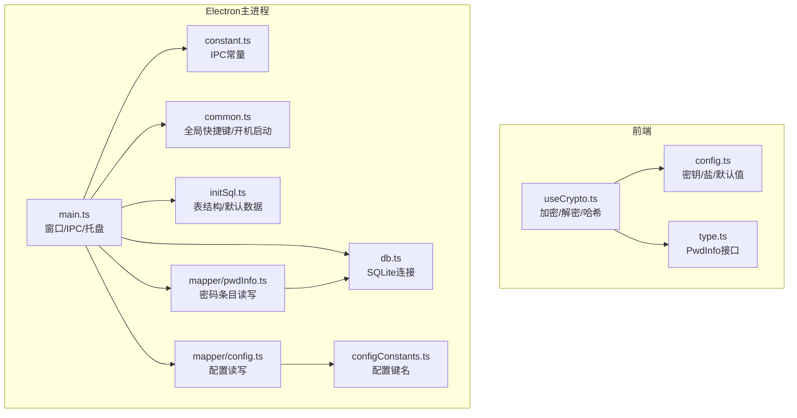
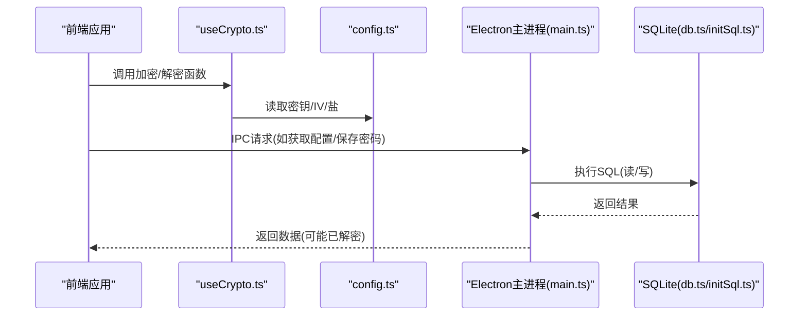
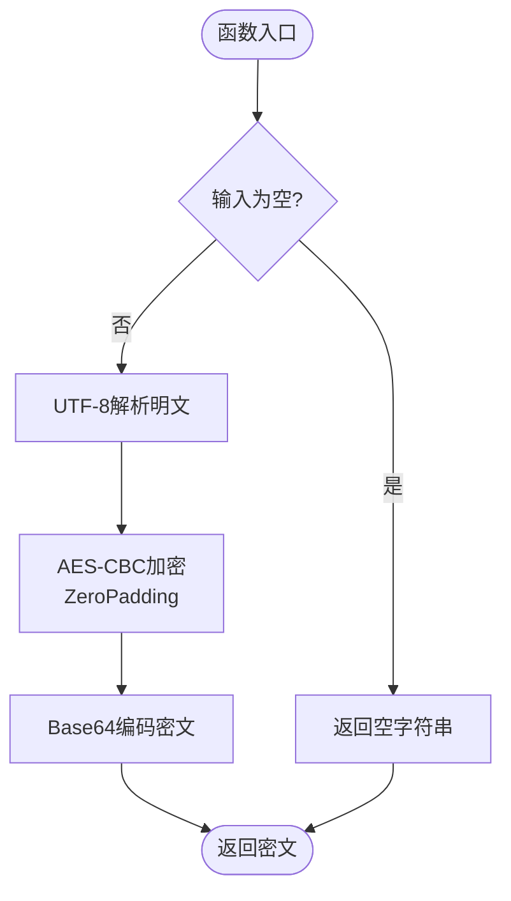
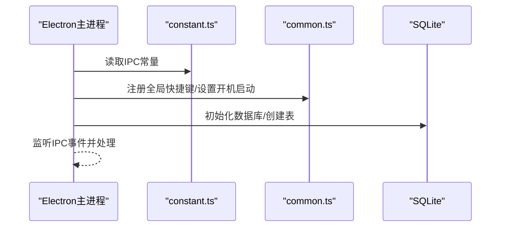
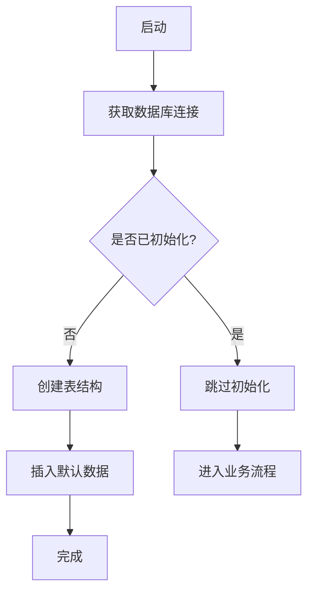
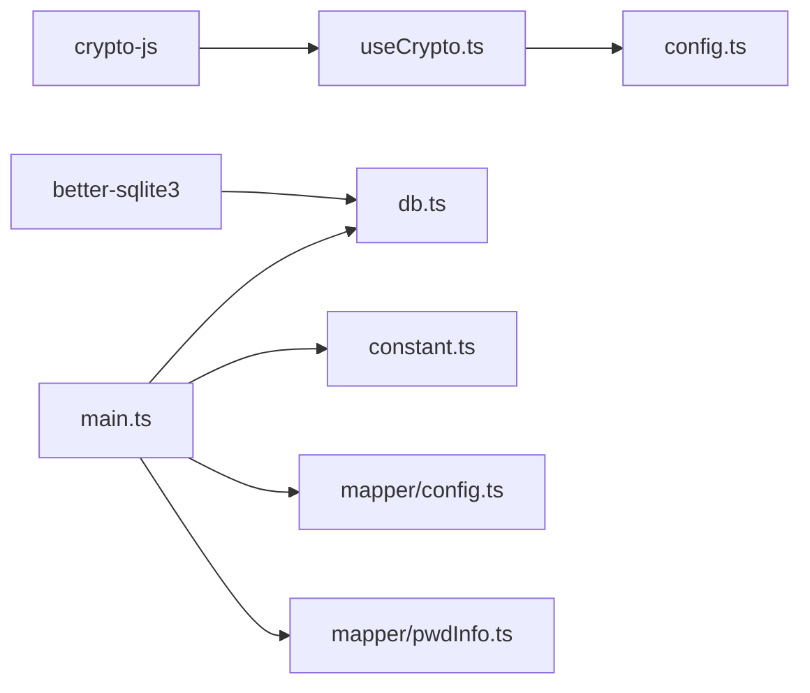

# 安全加密系统

<cite>
**本文引用的文件**
- [useCrypto.ts](file://src/hooks/useCrypto.ts)
- [config.ts](file://src/config/config.ts)
- [type.ts](file://src/components/type.ts)
- [main.ts](file://electron/main.ts)
- [constant.ts](file://electron/constant.ts)
- [common.ts](file://electron/common.ts)
- [db.ts](file://electron/db/sqlite/components/db.ts)
- [initSql.ts](file://electron/db/sqlite/components/initSql.ts)
- [configConstants.ts](file://electron/db/sqlite/components/configConstants.ts)
- [configMapper.ts](file://electron/db/sqlite/mapper/config.ts)
- [pwdInfoMapper.ts](file://electron/db/sqlite/mapper/pwdInfo.ts)
- [package.json](file://package.json)
</cite>

## 目录
1. [简介](#简介)
2. [项目结构](#项目结构)
3. [核心组件](#核心组件)
4. [架构总览](#架构总览)
5. [详细组件分析](#详细组件分析)
6. [依赖关系分析](#依赖关系分析)
7. [性能考量](#性能考量)
8. [故障排查指南](#故障排查指南)
9. [结论](#结论)
10. [附录](#附录)

## 简介
本文件面向密码管理器的“安全加密系统”，聚焦于前端与Electron主进程之间的数据加密与密钥管理机制。内容涵盖：
- AES加密算法实现与配置参数
- 密钥与初始化向量（IV）管理
- 数据加密与解密流程
- 安全存储方案与访问控制
- 安全威胁防护与最佳实践
- 使用模式与常见问题排查

## 项目结构
围绕加密功能的关键文件分布如下：
- 前端加密逻辑与配置：src/hooks/useCrypto.ts、src/config/config.ts、src/components/type.ts
- Electron主进程与IPC：electron/main.ts、electron/constant.ts、electron/common.ts
- SQLite本地存储与初始化：electron/db/sqlite/components/db.ts、electron/db/sqlite/components/initSql.ts、electron/db/sqlite/components/configConstants.ts、electron/db/sqlite/mapper/config.ts、electron/db/sqlite/mapper/pwdInfo.ts
- 依赖声明：package.json

**图示来源**
- [useCrypto.ts:1-77](file://src/hooks/useCrypto.ts#L1-L77)
- [config.ts:1-143](file://src/config/config.ts#L1-L143)
- [type.ts:50-67](file://src/components/type.ts#L50-L67)
- [main.ts:1-240](file://electron/main.ts#L1-L240)
- [constant.ts:1-63](file://electron/constant.ts#L1-L63)
- [common.ts:1-56](file://electron/common.ts#L1-L56)
- [db.ts:1-30](file://electron/db/sqlite/components/db.ts#L1-L30)
- [initSql.ts:1-224](file://electron/db/sqlite/components/initSql.ts#L1-L224)
- [configConstants.ts:1-29](file://electron/db/sqlite/components/configConstants.ts#L1-L29)
- [configMapper.ts:1-27](file://electron/db/sqlite/mapper/config.ts#L1-L27)
- [pwdInfoMapper.ts:1-100](file://electron/db/sqlite/mapper/pwdInfo.ts#L1-L100)

**章节来源**
- [useCrypto.ts:1-77](file://src/hooks/useCrypto.ts#L1-L77)
- [config.ts:1-143](file://src/config/config.ts#L1-L143)
- [type.ts:50-67](file://src/components/type.ts#L50-L67)
- [main.ts:1-240](file://electron/main.ts#L1-L240)
- [constant.ts:1-63](file://electron/constant.ts#L1-L63)
- [common.ts:1-56](file://electron/common.ts#L1-L56)
- [db.ts:1-30](file://electron/db/sqlite/components/db.ts#L1-L30)
- [initSql.ts:1-224](file://electron/db/sqlite/components/initSql.ts#L1-L224)
- [configConstants.ts:1-29](file://electron/db/sqlite/components/configConstants.ts#L1-L29)
- [configMapper.ts:1-27](file://electron/db/sqlite/mapper/config.ts#L1-L27)
- [pwdInfoMapper.ts:1-100](file://electron/db/sqlite/mapper/pwdInfo.ts#L1-L100)

## 核心组件
- 加密钩子：提供MD5、SHA512哈希、AES-CBC加解密、列表解密等能力
- 配置模块：集中定义盐、AES密钥、IV、默认密码等
- 类型定义：统一密码条目结构
- 主进程与IPC：负责窗口生命周期、全局快捷键、开机启动、SQLite初始化与数据访问
- SQLite存储：本地数据库持久化，包含配置、分组、密码条目、快捷键、OSS配置、版本信息等

**章节来源**
- [useCrypto.ts:1-77](file://src/hooks/useCrypto.ts#L1-L77)
- [config.ts:14-22](file://src/config/config.ts#L14-L22)
- [type.ts:50-67](file://src/components/type.ts#L50-L67)
- [main.ts:1-240](file://electron/main.ts#L1-L240)
- [initSql.ts:48-105](file://electron/db/sqlite/components/initSql.ts#L48-L105)

## 架构总览
前端通过useCrypto进行数据加解密，主进程负责SQLite初始化与数据访问；IPC常量在constant.ts中集中管理。

**图示来源**
- [useCrypto.ts:33-66](file://src/hooks/useCrypto.ts#L33-L66)
- [config.ts:14-22](file://src/config/config.ts#L14-L22)
- [main.ts:203-227](file://electron/main.ts#L203-L227)
- [db.ts:16-30](file://electron/db/sqlite/components/db.ts#L16-L30)
- [initSql.ts:26-46](file://electron/db/sqlite/components/initSql.ts#L26-L46)

## 详细组件分析

### 组件一：加密与哈希实现（useCrypto）
- 功能要点
  - MD5十六进制哈希：用于特定场景的快速摘要
  - SHA512十六进制哈希：对带盐明文计算摘要
  - AES-CBC加解密：使用UTF-8解析密钥与IV，ZeroPadding填充
  - 列表解密：对密码条目数组逐项解密
- 参数与配置
  - 密钥与IV来自配置模块
  - 盐值来自配置模块
- 错误处理
  - 对空输入返回空字符串，避免异常传播
- 性能与复杂度
  - 单次加解密时间复杂度近似O(n)，n为明文长度
  - 列表解密为O(n_total)

**图示来源**
- [useCrypto.ts:41-52](file://src/hooks/useCrypto.ts#L41-L52)

**章节来源**
- [useCrypto.ts:1-77](file://src/hooks/useCrypto.ts#L1-L77)
- [config.ts:14-22](file://src/config/config.ts#L14-L22)

### 组件二：配置与安全常量（config）
- 安全常量
  - 盐：用于哈希增强
  - AES密钥与IV：用于AES-CBC加解密
  - 默认密码：用于首次登录或恢复场景
- 默认快捷键：用于UI交互与系统集成
- 帮助与免责声明链接：用于合规说明

**章节来源**
- [config.ts:14-38](file://src/config/config.ts#L14-L38)

### 组件三：类型模型（type）
- PwdInfo：密码条目结构，包含分组、标题、用户名、密码、链接、备注等字段
- 作用：确保前后端一致的数据契约，便于加解密与存储

**章节来源**
- [type.ts:50-67](file://src/components/type.ts#L50-L67)

### 组件四：主进程与IPC（main、constant、common）
- 主进程职责
  - 创建窗口、托盘菜单、全局快捷键注册
  - 初始化SQLite数据库与表结构
  - 处理IPC事件（最小化、最大化、关闭、打开浏览器、开发者工具等）
- IPC常量
  - 统一管理所有IPC通道名称，便于维护与追踪
- 全局快捷键与开机启动
  - 注册/注销全局快捷键
  - 控制开机自启动

**图示来源**
- [main.ts:20-27](file://electron/main.ts#L20-L27)
- [constant.ts:14-63](file://electron/constant.ts#L14-L63)
- [common.ts:16-50](file://electron/common.ts#L16-L50)
- [db.ts:16-30](file://electron/db/sqlite/components/db.ts#L16-L30)

**章节来源**
- [main.ts:1-240](file://electron/main.ts#L1-L240)
- [constant.ts:1-63](file://electron/constant.ts#L1-L63)
- [common.ts:1-56](file://electron/common.ts#L1-L56)

### 组件五：SQLite存储与初始化（db、initSql、configConstants、mapper）
- 连接与路径
  - 使用better-sqlite3连接用户目录下的数据库文件
- 初始化流程
  - 检查初始化标志，若未初始化则创建表结构并插入默认数据
  - 包含group、pwd_info、config、shortcut_key、oss、update_version等表
- 配置与密码条目
  - config表存储应用配置键值
  - pwd_info表存储密码条目，其中password字段为加密后的文本
- 快捷键与OSS
  - shortcut_key表存储快捷键动作与描述
  - oss表存储OSS配置信息

**图示来源**
- [db.ts:16-30](file://electron/db/sqlite/components/db.ts#L16-L30)
- [initSql.ts:26-46](file://electron/db/sqlite/components/initSql.ts#L26-L46)
- [configConstants.ts:1-29](file://electron/db/sqlite/components/configConstants.ts#L1-L29)

**章节来源**
- [db.ts:1-30](file://electron/db/sqlite/components/db.ts#L1-L30)
- [initSql.ts:1-224](file://electron/db/sqlite/components/initSql.ts#L1-L224)
- [configConstants.ts:1-29](file://electron/db/sqlite/components/configConstants.ts#L1-L29)
- [configMapper.ts:1-27](file://electron/db/sqlite/mapper/config.ts#L1-L27)
- [pwdInfoMapper.ts:1-100](file://electron/db/sqlite/mapper/pwdInfo.ts#L1-L100)

## 依赖关系分析
- 前端依赖
  - crypto-js：提供AES、MD5、SHA512等算法
  - better-sqlite3：Electron主进程中用于SQLite访问
- 模块耦合
  - useCrypto依赖config中的密钥与盐
  - 主进程通过IPC与渲染进程通信，并调用SQLite映射器
  - SQLite映射器依赖db.ts提供的连接

**图示来源**
- [package.json:18-29](file://package.json#L18-L29)
- [useCrypto.ts:1-2](file://src/hooks/useCrypto.ts#L1-L2)
- [db.ts:7-7](file://electron/db/sqlite/components/db.ts#L7-L7)
- [main.ts:1-30](file://electron/main.ts#L1-L30)

**章节来源**
- [package.json:18-29](file://package.json#L18-L29)

## 性能考量
- 加密性能
  - AES-CBC加解密为线性复杂度，适合小到中等规模数据
  - 列表解密为批量线性处理，注意避免在主线程阻塞UI
- 存储性能
  - SQLite适用于本地轻量存储，建议合理使用索引与参数化查询
- 建议
  - 对大列表解密采用分批处理或异步队列
  - 将敏感操作放在主进程或隔离上下文执行

## 故障排查指南
- 常见问题
  - 解密失败：确认密钥与IV长度与算法要求一致，检查Base64编码/解码链路
  - 数据库无法初始化：检查用户目录权限与路径拼接
  - IPC无响应：核对constant.ts中的通道名称与主进程监听是否一致
- 排查步骤
  - 核对config.ts中的密钥、IV、盐是否正确
  - 检查useCrypto.ts中加解密参数（mode、padding）是否匹配
  - 确认主进程已执行initTable并创建所需表
  - 查看Electron主进程日志与IPC事件处理

**章节来源**
- [useCrypto.ts:33-66](file://src/hooks/useCrypto.ts#L33-L66)
- [config.ts:14-22](file://src/config/config.ts#L14-L22)
- [main.ts:203-227](file://electron/main.ts#L203-L227)
- [initSql.ts:26-46](file://electron/db/sqlite/components/initSql.ts#L26-L46)

## 结论
本加密系统以AES-CBC为核心，结合MD5/SHA512哈希与盐值增强，配合Electron主进程的SQLite本地存储与IPC通信，形成从前端到本地存储的完整安全闭环。建议在生产环境中进一步强化密钥管理与传输安全，并完善审计与监控机制。

## 附录

### 加密策略与规则
- 策略
  - 对敏感字段（如密码）采用对称加密存储
  - 使用固定长度密钥与IV，确保跨平台一致性
  - 哈希用于身份验证与完整性校验
- 规则
  - 明文不得长期驻留内存
  - 解密仅在必要时进行，且尽快释放
  - 避免硬编码密钥，建议通过安全渠道动态注入

### 安全最佳实践
- 密钥管理
  - 使用强随机源生成密钥与IV
  - 定期轮换密钥，提供迁移与回滚机制
- 数据完整性
  - 引入消息认证码（MAC）或HMAC，防止篡改
- 访问控制
  - 限制对加密模块的调用范围
  - 对关键操作增加二次确认与审计日志
- 威胁防护
  - 防止侧信道攻击：避免基于时间的分支差异
  - 防止内存泄漏：及时清理敏感数据引用

### 使用模式与示例路径
- 加密调用示例路径
  - [加密函数:41-52](file://src/hooks/useCrypto.ts#L41-L52)
  - [解密函数:54-66](file://src/hooks/useCrypto.ts#L54-L66)
- 列表解密示例路径
  - [列表解密:68-74](file://src/hooks/useCrypto.ts#L68-L74)
- 配置读取示例路径
  - [配置读取:15-20](file://electron/db/sqlite/mapper/config.ts#L15-L20)
- 数据库初始化示例路径
  - [初始化流程:26-46](file://electron/db/sqlite/components/initSql.ts#L26-L46)