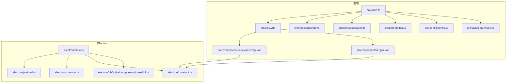
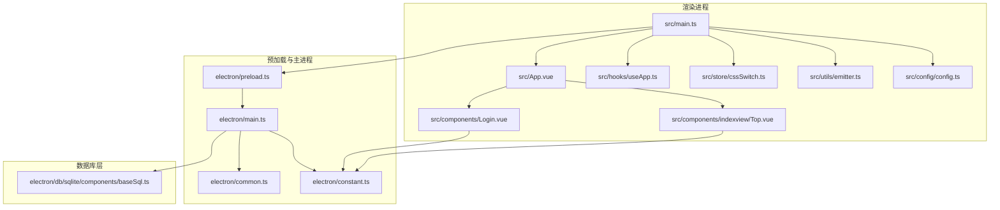
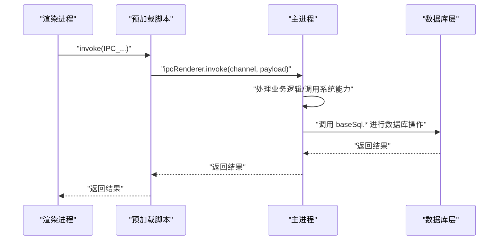
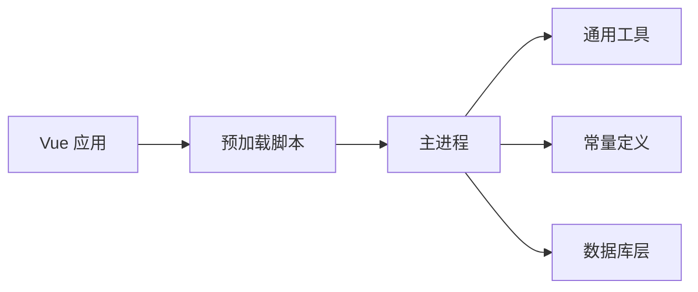

# 代码规范

<cite>
**本文引用的文件**
- [package.json](file://package.json)
- [tsconfig.json](file://tsconfig.json)
- [vite.config.ts](file://vite.config.ts)
- [electron/main.ts](file://electron/main.ts)
- [electron/preload.ts](file://electron/preload.ts)
- [electron/common.ts](file://electron/common.ts)
- [electron/constant.ts](file://electron/constant.ts)
- [electron/db/sqlite/components/baseSql.ts](file://electron/db/sqlite/components/baseSql.ts)
- [src/main.ts](file://src/main.ts)
- [src/App.vue](file://src/App.vue)
- [src/components/indexview/Top.vue](file://src/components/indexview/Top.vue)
- [src/components/Login.vue](file://src/components/Login.vue)
- [src/components/type.ts](file://src/components/type.ts)
- [src/hooks/useApp.ts](file://src/hooks/useApp.ts)
- [src/store/cssSwitch.ts](file://src/store/cssSwitch.ts)
- [src/utils/emitter.ts](file://src/utils/emitter.ts)
- [src/styles/dark/dark.ts](file://src/styles/dark/dark.ts)
- [src/config/config.ts](file://src/config/config.ts)
</cite>

## 目录
1. [引言](#引言)
2. [项目结构](#项目结构)
3. [核心组件](#核心-components)
4. [架构总览](#架构总览)
5. [详细组件分析](#详细组件分析)
6. [依赖分析](#依赖分析)
7. [性能考虑](#性能考虑)
8. [故障排查指南](#故障排查指南)
9. [结论](#结论)
10. [附录](#附录)

## 引言
本文件面向密码管理器项目的贡献者与维护者，系统性地制定并阐述 TypeScript 编码标准、命名约定与最佳实践；明确 Vue 3 组件开发规范、文件命名与目录结构；统一 Electron 主进程与渲染进程的代码组织原则；规范 CSS 样式编写、常量定义与注释风格；并给出代码格式化配置、ESLint 规则与 Prettier 设置建议，以及变量、函数与组件的命名规则。目标是提升代码一致性、可读性与可维护性，降低协作成本。

## 项目结构
项目采用“前端 + Electron 主进程 + 数据库层”的分层组织方式：
- 前端层：基于 Vue 3 + Vite，入口为 src/main.ts，根组件为 src/App.vue。
- Electron 层：主进程入口 electron/main.ts，预加载脚本 electron/preload.ts，通用工具 electron/common.ts，常量定义 electron/constant.ts。
- 数据库层：基于 better-sqlite3 的 SQLite 访问封装，位于 electron/db/sqlite/components/baseSql.ts。
- 工具与配置：src/config/config.ts 提供加密盐值、默认快捷键、链接等常量；src/utils/emitter.ts 提供事件总线；src/hooks/useApp.ts 提供应用级生命周期钩子；src/store/cssSwitch.ts 为 Pinia 状态示例；src/styles/dark/dark.ts 提供暗色主题切换。

图表来源
- [src/main.ts:1-20](file://src/main.ts#L1-L20)
- [src/App.vue:1-19](file://src/App.vue#L1-L19)
- [src/components/indexview/Top.vue:1-108](file://src/components/indexview/Top.vue#L1-L108)
- [src/components/Login.vue:1-129](file://src/components/Login.vue#L1-L129)
- [src/hooks/useApp.ts:1-71](file://src/hooks/useApp.ts#L1-L71)
- [src/store/cssSwitch.ts:1-17](file://src/store/cssSwitch.ts#L1-L17)
- [src/utils/emitter.ts:1-16](file://src/utils/emitter.ts#L1-L16)
- [src/config/config.ts:1-143](file://src/config/config.ts#L1-L143)
- [src/styles/dark/dark.ts:1-5](file://src/styles/dark/dark.ts#L1-L5)
- [electron/main.ts:1-240](file://electron/main.ts#L1-L240)
- [electron/preload.ts:1-39](file://electron/preload.ts#L1-L39)
- [electron/common.ts:1-56](file://electron/common.ts#L1-L56)
- [electron/constant.ts:1-63](file://electron/constant.ts#L1-L63)
- [electron/db/sqlite/components/baseSql.ts:1-87](file://electron/db/sqlite/components/baseSql.ts#L1-L87)

章节来源
- [package.json:1-51](file://package.json#L1-L51)
- [vite.config.ts:1-38](file://vite.config.ts#L1-L38)
- [tsconfig.json:1-37](file://tsconfig.json#L1-L37)

## 核心组件
- 应用入口与挂载：前端入口在 src/main.ts 中创建 Vue 应用并挂载；根组件 src/App.vue 通过动态组件切换视图。
- 主进程与 IPC：electron/main.ts 负责窗口创建、托盘菜单、全局快捷键、更新检查与 IPC 事件处理；electron/preload.ts 通过 contextBridge 暴露受控的 ipcRenderer API；electron/common.ts 提供通用能力（显示窗口、注册快捷键、开机启动、打开调试工具）。
- 数据访问：electron/db/sqlite/components/baseSql.ts 提供通用的增删改查封装与事务示例。
- 应用级逻辑：src/hooks/useApp.ts 在 mounted 生命周期内执行主题切换、自动登出计时与本地同步。
- 状态管理：src/store/cssSwitch.ts 为 Pinia Store 示例，演示状态读写与方法导出。
- 事件总线：src/utils/emitter.ts 使用 mitt 提供跨组件解耦通信。
- 常量与配置：src/config/config.ts 定义加密相关常量、默认快捷键、帮助链接与提示文案；electron/constant.ts 定义 IPC 通道名与窗口参数。

章节来源
- [src/main.ts:1-20](file://src/main.ts#L1-L20)
- [src/App.vue:1-19](file://src/App.vue#L1-L19)
- [electron/main.ts:1-240](file://electron/main.ts#L1-L240)
- [electron/preload.ts:1-39](file://electron/preload.ts#L1-L39)
- [electron/common.ts:1-56](file://electron/common.ts#L1-L56)
- [electron/db/sqlite/components/baseSql.ts:1-87](file://electron/db/sqlite/components/baseSql.ts#L1-L87)
- [src/hooks/useApp.ts:1-71](file://src/hooks/useApp.ts#L1-L71)
- [src/store/cssSwitch.ts:1-17](file://src/store/cssSwitch.ts#L1-L17)
- [src/utils/emitter.ts:1-16](file://src/utils/emitter.ts#L1-L16)
- [src/config/config.ts:1-143](file://src/config/config.ts#L1-L143)
- [electron/constant.ts:1-63](file://electron/constant.ts#L1-L63)

## 架构总览
下图展示了前端、Electron 主进程与数据库层之间的交互关系与职责边界。

图表来源
- [src/main.ts:1-20](file://src/main.ts#L1-L20)
- [src/App.vue:1-19](file://src/App.vue#L1-L19)
- [src/components/indexview/Top.vue:1-108](file://src/components/indexview/Top.vue#L1-L108)
- [src/components/Login.vue:1-129](file://src/components/Login.vue#L1-L129)
- [src/hooks/useApp.ts:1-71](file://src/hooks/useApp.ts#L1-L71)
- [src/store/cssSwitch.ts:1-17](file://src/store/cssSwitch.ts#L1-L17)
- [src/utils/emitter.ts:1-16](file://src/utils/emitter.ts#L1-L16)
- [src/config/config.ts:1-143](file://src/config/config.ts#L1-L143)
- [electron/preload.ts:1-39](file://electron/preload.ts#L1-L39)
- [electron/main.ts:1-240](file://electron/main.ts#L1-L240)
- [electron/common.ts:1-56](file://electron/common.ts#L1-L56)
- [electron/constant.ts:1-63](file://electron/constant.ts#L1-L63)
- [electron/db/sqlite/components/baseSql.ts:1-87](file://electron/db/sqlite/components/baseSql.ts#L1-L87)

## 详细组件分析

### TypeScript 编码标准与命名约定
- 类型与接口
  - 接口命名使用名词短语，首字母大写，如 PwdInfo、OssSyncObj；属性命名采用驼峰，字段类型明确且尽量不可变。
  - 示例参考：src/components/type.ts 中的接口定义。
- 函数与方法
  - 命名采用动词短语，首字母小写，如 setAutoStart、registerGlobalShortcut、baseListSql。
  - 返回值明确，错误处理统一返回 null 或 0 并记录日志，便于调用方判断。
  - 示例参考：electron/common.ts、electron/db/sqlite/components/baseSql.ts。
- 变量与常量
  - 常量使用全大写下划线命名，如 WINDOW_INDEX_WIDTH、IPC_SQLITE_UPDATE_OSS_DATA。
  - 变量使用驼峰命名，避免无意义缩写。
  - 示例参考：electron/constant.ts、src/config/config.ts。
- 文件命名
  - 工具函数文件使用动词或描述性名词，如 emitter.ts、common.ts、baseSql.ts。
  - 组件文件使用帕斯卡命名，如 Top.vue、Login.vue。
  - 类型定义文件使用 type.ts 结尾，如 src/components/type.ts。
- 注释与文档
  - 对外公开的函数与接口需提供简要说明，解释用途、参数与返回值。
  - 复杂逻辑处补充注释，说明关键步骤与边界条件。
  - 示例参考：electron/db/sqlite/components/baseSql.ts 的函数注释与事务示例。

章节来源
- [src/components/type.ts:1-88](file://src/components/type.ts#L1-L88)
- [electron/common.ts:1-56](file://electron/common.ts#L1-L56)
- [electron/db/sqlite/components/baseSql.ts:1-87](file://electron/db/sqlite/components/baseSql.ts#L1-L87)
- [electron/constant.ts:1-63](file://electron/constant.ts#L1-L63)
- [src/config/config.ts:1-143](file://src/config/config.ts#L1-L143)

### Vue 3 组件开发规范
- 组件结构
  - 使用 <script setup> 语法，减少样板代码；模板中仅包含结构与样式，逻辑集中在 script 区域。
  - 示例参考：src/App.vue、src/components/indexview/Top.vue、src/components/Login.vue。
- 组件命名与目录
  - 组件文件使用帕斯卡命名，目录按功能分层，如 src/components/indexview/、src/components/setview/。
  - 组件导出默认函数或无状态组件，必要时通过 defineExpose 暴露内部方法。
- Props 与事件
  - 明确 props 类型与默认值；事件命名使用 kebab-case，回调参数语义清晰。
- 状态与副作用
  - 在 onMounted 中初始化副作用；对全局事件监听进行清理，避免内存泄漏。
  - 示例参考：src/hooks/useApp.ts 中的自动登出计时与事件监听。
- 样式与作用域
  - 组件样式使用 scoped，避免污染全局；公共样式抽取至 src/styles。
  - 示例参考：src/components/indexview/Top.vue、src/components/Login.vue 的 style scoped。
- 事件总线
  - 使用 src/utils/emitter.ts 进行跨组件解耦通信，避免深层传参。
  - 示例参考：src/utils/emitter.ts。

章节来源
- [src/App.vue:1-19](file://src/App.vue#L1-L19)
- [src/components/indexview/Top.vue:1-108](file://src/components/indexview/Top.vue#L1-L108)
- [src/components/Login.vue:1-129](file://src/components/Login.vue#L1-L129)
- [src/hooks/useApp.ts:1-71](file://src/hooks/useApp.ts#L1-L71)
- [src/utils/emitter.ts:1-16](file://src/utils/emitter.ts#L1-L16)

### Electron 主进程与渲染进程组织原则
- 预加载脚本
  - 通过 contextBridge 暴露受控 API，仅导出必要的 ipcRenderer 方法，避免直接暴露 Node.js 能力。
  - 示例参考：electron/preload.ts。
- 主进程职责
  - 窗口创建与生命周期管理、托盘菜单、全局快捷键、更新检查与安装；集中处理 IPC 事件。
  - 示例参考：electron/main.ts。
- 通用工具
  - 将可复用逻辑抽象为模块，如 showWindows、registerGlobalShortcut、setAutoStart、openDevTools。
  - 示例参考：electron/common.ts。
- 常量与 IPC
  - 将 IPC 通道名与窗口参数集中定义，便于维护与统一。
  - 示例参考：electron/constant.ts。
- 数据访问
  - 数据库访问封装在 baseSql.ts，提供统一的增删改查与事务示例，调用方无需关心底层连接细节。
  - 示例参考：electron/db/sqlite/components/baseSql.ts。

图表来源
- [electron/preload.ts:1-39](file://electron/preload.ts#L1-L39)
- [electron/main.ts:1-240](file://electron/main.ts#L1-L240)
- [electron/db/sqlite/components/baseSql.ts:1-87](file://electron/db/sqlite/components/baseSql.ts#L1-L87)

章节来源
- [electron/preload.ts:1-39](file://electron/preload.ts#L1-L39)
- [electron/main.ts:1-240](file://electron/main.ts#L1-L240)
- [electron/common.ts:1-56](file://electron/common.ts#L1-L56)
- [electron/constant.ts:1-63](file://electron/constant.ts#L1-L63)
- [electron/db/sqlite/components/baseSql.ts:1-87](file://electron/db/sqlite/components/baseSql.ts#L1-L87)

### CSS 样式编写规范
- 作用域与层级
  - 组件样式使用 scoped，避免全局污染；公共样式放入 src/styles。
- 选择器与命名
  - 使用语义化类名，避免过度依赖层级选择器；必要时使用 BEM 风格增强可读性。
- 动态样式
  - 通过内联样式或 CSS 变量实现动态效果，如主题切换。
  - 示例参考：src/styles/dark/dark.ts 与 src/main.ts 中的主题引入。
- 可拖拽区域
  - 标题栏等区域使用 -webkit-app-region: drag 实现可拖拽，注意子元素需设置 no-drag。
  - 示例参考：src/components/indexview/Top.vue。

章节来源
- [src/components/indexview/Top.vue:1-108](file://src/components/indexview/Top.vue#L1-L108)
- [src/styles/dark/dark.ts:1-5](file://src/styles/dark/dark.ts#L1-L5)
- [src/main.ts:1-20](file://src/main.ts#L1-L20)

### 常量定义规范
- 分类与命名
  - 按功能分类：窗口参数、IPC 通道、默认快捷键、链接与提示文本、加密常量。
  - 命名为全大写下划线，语义明确，避免魔法数。
- 示例参考：
  - electron/constant.ts：窗口与 IPC 常量。
  - src/config/config.ts：加密盐值、AES 参数、默认快捷键、帮助链接与提示 HTML。

章节来源
- [electron/constant.ts:1-63](file://electron/constant.ts#L1-L63)
- [src/config/config.ts:1-143](file://src/config/config.ts#L1-L143)

### 注释标准
- 文件头注释：简述文件用途与关键职责。
- 函数注释：说明用途、参数、返回值与异常情况。
- 行内注释：对复杂分支、边界条件与关键步骤进行说明。
- 示例参考：electron/db/sqlite/components/baseSql.ts 的函数注释与事务示例。

章节来源
- [electron/db/sqlite/components/baseSql.ts:1-87](file://electron/db/sqlite/components/baseSql.ts#L1-L87)

### 代码格式化与质量工具
- TypeScript 配置
  - 严格模式开启，禁止未使用变量与参数，强制 switch 穷举，确保类型安全。
  - 参考 tsconfig.json 的 compilerOptions 与 include。
- Vite 插件
  - 自动导入 Element Plus 组件与图标，减少重复引入。
  - 参考 vite.config.ts 的插件配置。
- 依赖与构建
  - package.json 中定义 dev/build/preview 脚本，集成 electron-builder。
  - 参考 package.json 的 scripts 与 main 字段。

章节来源
- [tsconfig.json:1-37](file://tsconfig.json#L1-L37)
- [vite.config.ts:1-38](file://vite.config.ts#L1-L38)
- [package.json:1-51](file://package.json#L1-L51)

## 依赖分析
- 前端依赖
  - Vue 3、Pinia、Element Plus、mitt、crypto-js、better-sqlite3、electron-updater 等。
- 构建与打包
  - Vite、electron-builder、vite-plugin-electron、vite-plugin-electron-renderer。
- 项目内依赖关系
  - 渲染进程通过 preload 暴露的 API 与主进程通信；主进程负责窗口、托盘、快捷键与更新；数据库层提供统一访问接口。

图表来源
- [src/main.ts:1-20](file://src/main.ts#L1-L20)
- [electron/preload.ts:1-39](file://electron/preload.ts#L1-L39)
- [electron/main.ts:1-240](file://electron/main.ts#L1-L240)
- [electron/common.ts:1-56](file://electron/common.ts#L1-L56)
- [electron/constant.ts:1-63](file://electron/constant.ts#L1-L63)
- [electron/db/sqlite/components/baseSql.ts:1-87](file://electron/db/sqlite/components/baseSql.ts#L1-L87)

章节来源
- [package.json:1-51](file://package.json#L1-L51)

## 性能考虑
- 渲染进程与主进程分离，避免阻塞 UI。
- 数据库操作使用 better-sqlite3，批量操作使用事务减少 IO。
- 事件总线避免深层组件传参导致的重渲染。
- 图标与资源按需加载，减少首屏体积。

## 故障排查指南
- 快捷键无效
  - 检查 electron/common.ts 中 registerGlobalShortcut 的参数替换与平台差异（CommandOrControl）。
- 窗口显示/隐藏异常
  - 检查 electron/main.ts 中的 showWindows 逻辑与托盘菜单触发。
- 数据库访问失败
  - 查看 electron/db/sqlite/components/baseSql.ts 的错误日志与返回值，确认 SQL 与参数。
- 更新流程异常
  - 检查 electron/main.ts 中 setupIPC 的 handle 事件与 updateManager 的回调。

章节来源
- [electron/common.ts:1-56](file://electron/common.ts#L1-L56)
- [electron/main.ts:1-240](file://electron/main.ts#L1-L240)
- [electron/db/sqlite/components/baseSql.ts:1-87](file://electron/db/sqlite/components/baseSql.ts#L1-L87)

## 结论
本规范从编码风格、组件设计、进程组织、样式与常量、注释与工具配置等方面给出了统一标准，旨在提升项目的一致性与可维护性。建议在提交 PR 前对照本规范进行自检，并在评审中重点关注命名一致性、错误处理与性能影响。

## 附录

### 命名规则速查
- TypeScript
  - 接口与类型：帕斯卡命名（如 PwdInfo）
  - 函数与方法：驼峰命名（如 setAutoStart）
  - 常量：全大写下划线（如 WINDOW_INDEX_WIDTH）
- Vue 组件
  - 文件：帕斯卡命名（如 Top.vue）
  - 目录：按功能分层（如 indexview、setview）
- 文件
  - 工具：动词或描述性名词（如 emitter.ts、common.ts）
  - 类型：type.ts（如 src/components/type.ts）

### 代码质量检查清单
- 是否遵循命名约定与注释标准
- 是否使用 <script setup> 与 scoped 样式
- 是否通过 preload 暴露受控 API
- 是否使用 baseSql 统一访问数据库
- 是否在 onMounted 中初始化副作用并在卸载时清理
- 是否避免魔法数与硬编码字符串