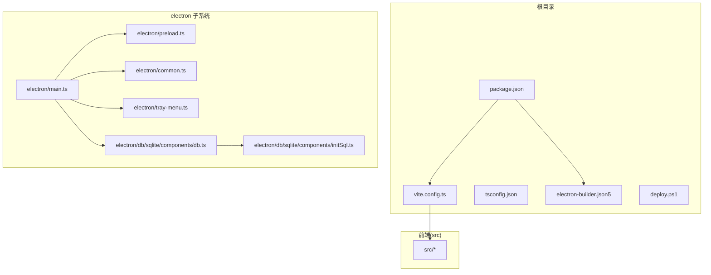
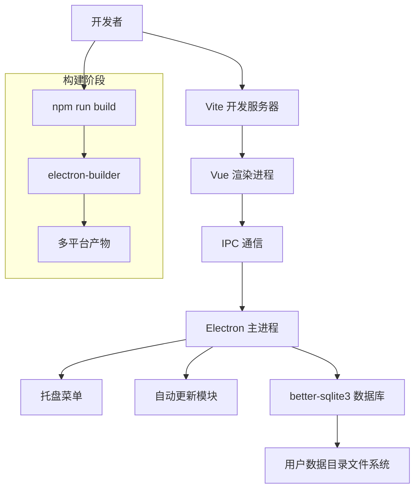
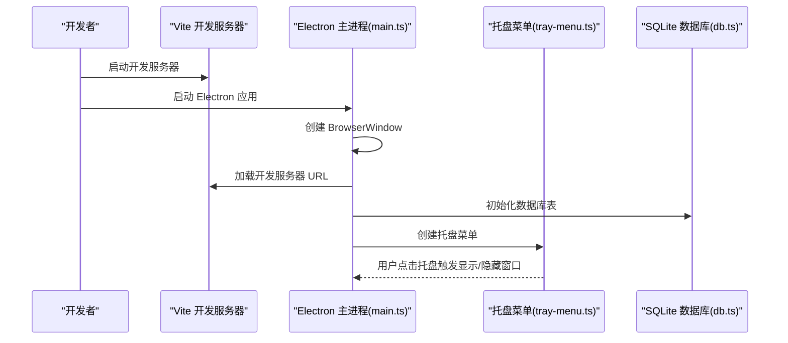
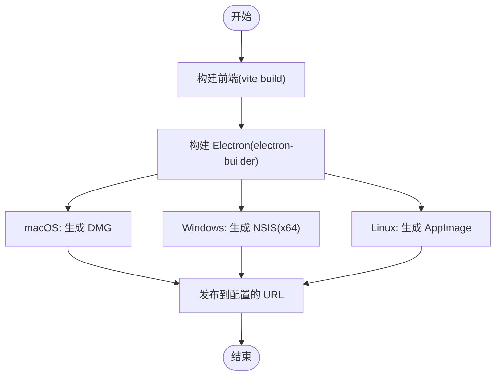
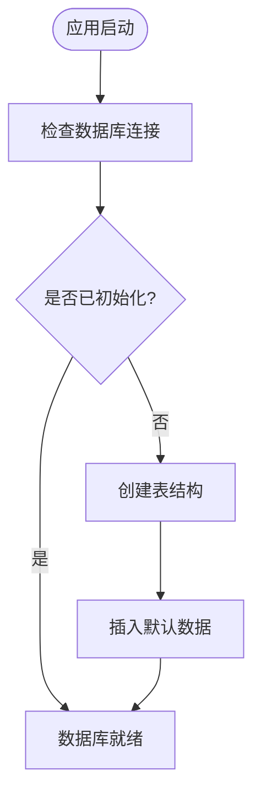
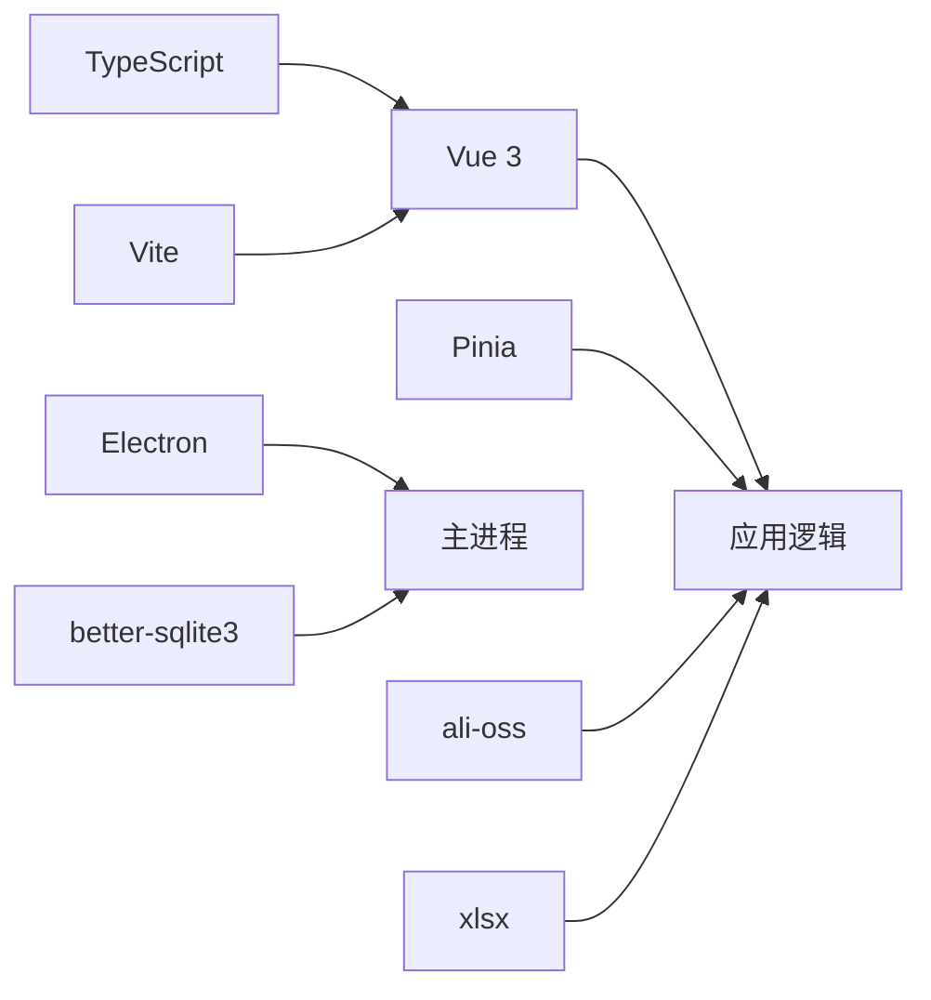

# 开发环境配置

<cite>
**本文引用的文件**
- [package.json](file://package.json)
- [vite.config.ts](file://vite.config.ts)
- [tsconfig.json](file://tsconfig.json)
- [electron-builder.json5](file://electron-builder.json5)
- [electron/main.ts](file://electron/main.ts)
- [electron/common.ts](file://electron/common.ts)
- [electron/tray-menu.ts](file://electron/tray-menu.ts)
- [electron/db/sqlite/components/db.ts](file://electron/db/sqlite/components/db.ts)
- [electron/db/sqlite/components/initSql.ts](file://electron/db/sqlite/components/initSql.ts)
- [.github/workflows/release.yml](file://.github/workflows/release.yml)
- [deploy.ps1](file://deploy.ps1)
- [password-manager.code-workspace](file://password-manager.code-workspace)
</cite>

## 目录
1. [简介](#简介)
2. [项目结构](#项目结构)
3. [核心组件](#核心组件)
4. [架构总览](#架构总览)
5. [详细组件分析](#详细组件分析)
6. [依赖分析](#依赖分析)
7. [性能考虑](#性能考虑)
8. [故障排查指南](#故障排查指南)
9. [结论](#结论)
10. [附录](#附录)

## 简介
本指南面向新加入的开发者，提供从零开始搭建密码管理器项目的完整开发环境配置说明。内容涵盖系统与工具要求、Node.js 与依赖安装、IDE 推荐配置（含 VS Code 插件与调试）、前端开发服务器与热重载、Electron 应用开发调试与打包签名、数据库初始化与测试数据准备、Git 工作流与分支策略、以及初始配置步骤。

## 项目结构
该项目采用 Vue 3 + TypeScript + Vite 构建前端，配合 Electron 作为桌面应用壳，使用 better-sqlite3 作为本地数据库。核心目录与职责如下：
- electron：Electron 主进程、预加载脚本、托盘菜单、数据库封装与初始化、自动更新等
- src：Vue 前端源码，包含组件、Hooks、Store、样式与工具
- public：公共资源与 Excel 模板
- 根目录配置：package.json、vite.config.ts、tsconfig.json、electron-builder.json5、部署脚本等

**图表来源**
- [package.json:1-51](file://package.json#L1-L51)
- [vite.config.ts:1-38](file://vite.config.ts#L1-L38)
- [tsconfig.json:1-37](file://tsconfig.json#L1-L37)
- [electron-builder.json5:1-52](file://electron-builder.json5#L1-L52)
- [electron/main.ts:1-240](file://electron/main.ts#L1-L240)
- [electron/db/sqlite/components/db.ts:1-30](file://electron/db/sqlite/components/db.ts#L1-L30)
- [electron/db/sqlite/components/initSql.ts:1-224](file://electron/db/sqlite/components/initSql.ts#L1-L224)

**章节来源**
- [package.json:1-51](file://package.json#L1-L51)
- [vite.config.ts:1-38](file://vite.config.ts#L1-L38)
- [tsconfig.json:1-37](file://tsconfig.json#L1-L37)
- [electron-builder.json5:1-52](file://electron-builder.json5#L1-L52)

## 核心组件
- 包管理与脚本：通过 npm scripts 启动开发、构建与预览；postinstall 自动安装 Electron 应用依赖
- Vite 配置：集成 Vue 插件、自动导入与组件解析、Electron 插件以支持主进程与渲染进程分离
- TypeScript：严格模式、Bundler 模式、ESNext 模块解析
- Electron 构建：electron-builder 配置多平台产物、安装包与发布地址
- 数据库：better-sqlite3，用户数据存储于应用数据目录下的 SQLite 文件
- 自动更新：基于 electron-updater 的更新检查与安装流程

**章节来源**
- [package.json:12-17](file://package.json#L12-L17)
- [vite.config.ts:9-37](file://vite.config.ts#L9-L37)
- [tsconfig.json:2-24](file://tsconfig.json#L2-L24)
- [electron-builder.json5:1-52](file://electron-builder.json5#L1-L52)
- [electron/db/sqlite/components/db.ts:10-23](file://electron/db/sqlite/components/db.ts#L10-L23)

## 架构总览
下图展示了开发与构建阶段的关键交互：Vite 作为前端开发服务器，Electron 作为宿主；主进程负责窗口、托盘、IPC、自动更新；数据库位于用户数据目录；构建阶段由 electron-builder 生成各平台安装包。

**图表来源**
- [vite.config.ts:18-35](file://vite.config.ts#L18-L35)
- [electron/main.ts:49-59](file://electron/main.ts#L49-L59)
- [electron/tray-menu.ts:7-47](file://electron/tray-menu.ts#L7-L47)
- [electron/db/sqlite/components/db.ts:10-23](file://electron/db/sqlite/components/db.ts#L10-L23)
- [electron-builder.json5:10-13](file://electron-builder.json5#L10-L13)

## 详细组件分析

### 系统要求与工具安装
- 操作系统
  - Windows/macOS/Linux 均可进行开发与构建
- Node.js
  - 使用 ES 模块与 Vite 5，建议使用长期支持版本（如 20.x）
  - CI 中使用 Node.js 20.15.0，可作为参考版本
- 包管理器
  - 推荐使用 npm（与脚本一致），确保使用 npm ci 进行确定性安装
- 其他工具
  - Git、VS Code（推荐插件见后文）
  - PowerShell（用于部署脚本）

**章节来源**
- [.github/workflows/release.yml:20](file://.github/workflows/release.yml#L20)
- [package.json:12-17](file://package.json#L12-L17)

### IDE 配置（VS Code）
- 推荐插件
  - ESLint、Prettier、TypeScript Importer、Vue Language Features (Volar)、Auto Rename Tag、Bracket Pair Colorizer
- 工作区设置
  - 使用仓库提供的工作区文件，便于统一团队编辑器设置
- 调试配置
  - 建议在 VS Code 中为 Electron 主进程与渲染进程分别配置调试任务（launch.json），以便断点调试
- 代码片段与格式化
  - 保持 TypeScript 严格模式与 ESLint 规则一致，避免类型错误与风格不统一

**章节来源**
- [password-manager.code-workspace:1-9](file://password-manager.code-workspace#L1-L9)

### 依赖安装与开发服务器
- 安装依赖
  - 使用 npm ci 进行安装，确保与 lockfile 一致
- 启动开发服务器
  - 执行 npm run dev，Vite 将启动开发服务器并与 Electron 主进程联调
- 热重载
  - Vite 默认支持前端热重载；Electron 主进程修改需重启应用

**章节来源**
- [package.json:12-17](file://package.json#L12-L17)
- [vite.config.ts:9-37](file://vite.config.ts#L9-L37)

### Electron 应用开发与调试
- 主进程入口
  - Electron 主进程入口为 electron/main.ts，负责窗口创建、托盘、IPC、自动更新与数据库初始化
- 预加载与渲染进程
  - 预加载脚本通过 vite-plugin-electron 配置，允许在渲染进程中安全访问 Node/Electron API
- 调试技巧
  - 可通过 IPC 打开 DevTools（见 electron/common.ts 中的打开调试窗口方法）
  - 在开发模式下，主进程会加载 Vite 开发服务器 URL；生产模式加载 dist/index.html
- 全局快捷键
  - 支持注册全局快捷键以显示/隐藏主窗口

**图表来源**
- [electron/main.ts:49-116](file://electron/main.ts#L49-L116)
- [electron/tray-menu.ts:7-47](file://electron/tray-menu.ts#L7-L47)
- [electron/db/sqlite/components/db.ts:16-23](file://electron/db/sqlite/components/db.ts#L16-L23)

**章节来源**
- [electron/main.ts:1-240](file://electron/main.ts#L1-L240)
- [electron/common.ts:52-56](file://electron/common.ts#L52-L56)
- [vite.config.ts:18-35](file://vite.config.ts#L18-L35)

### 打包构建与签名
- 构建命令
  - npm run build 将先构建前端，再调用 electron-builder 打包
- 多平台产物
  - macOS：DMG
  - Windows：NSIS（x64）
  - Linux：AppImage
- 发布配置
  - 产物输出目录与发布地址在 electron-builder.json5 中定义
- 签名与公证（建议）
  - macOS：为 DMG 与应用签名，启用 Gatekeeper 兼容
  - Windows：为 NSIS 安装包签名，启用代码签名
  - Linux：通常无需签名，但可对 AppImage 进行签名（视分发渠道而定）

**图表来源**
- [package.json:14](file://package.json#L14)
- [electron-builder.json5:14-46](file://electron-builder.json5#L14-L46)

**章节来源**
- [package.json:14](file://package.json#L14)
- [electron-builder.json5:1-52](file://electron-builder.json5#L1-L52)

### 数据库开发环境配置
- 数据库引擎
  - 使用 better-sqlite3，无需额外数据库服务，直接在应用数据目录创建 SQLite 文件
- 数据库位置
  - 用户数据目录下的 myDatabase.db 文件
- 初始化流程
  - 首次运行时创建表结构与默认数据（配置、快捷键、分组、默认密码条目、OSS 类型、版本表）
- 测试数据
  - 初始化脚本包含默认分组与示例密码条目，便于快速验证功能

**图表来源**
- [electron/db/sqlite/components/db.ts:16-23](file://electron/db/sqlite/components/db.ts#L16-L23)
- [electron/db/sqlite/components/initSql.ts:26-46](file://electron/db/sqlite/components/initSql.ts#L26-L46)

**章节来源**
- [electron/db/sqlite/components/db.ts:1-30](file://electron/db/sqlite/components/db.ts#L1-L30)
- [electron/db/sqlite/components/initSql.ts:1-224](file://electron/db/sqlite/components/initSql.ts#L1-L224)

### Git 工作流与分支管理
- 分支策略
  - 建议采用 Git Flow：master/main 用于稳定发布，develop 用于日常合并，feature/* 用于功能开发，hotfix/* 用于紧急修复
- 提交规范
  - 使用语义化提交（如 feat、fix、docs、refactor），配合变更日志
- 代码审查
  - PR 必须通过 CI 检查与至少一名维护者批准
- CI/CD
  - GitHub Actions 示例工作流（release.yml）展示了基于标签的发布流程，可作为模板扩展至 PR 与分支流水线

**章节来源**
- [.github/workflows/release.yml:1-51](file://.github/workflows/release.yml#L1-L51)

### 初始配置步骤（新开发者）
- 环境准备
  - 安装 Node.js（建议 20.x）、Git、VS Code
- 克隆与安装
  - git clone 项目；在项目根目录执行 npm ci
- 启动开发
  - npm run dev 启动前端与 Electron；若首次运行，数据库将自动初始化
- 调试
  - 在 VS Code 中为 Electron 主进程与渲染进程配置 launch.json 并断点调试
- 构建与发布
  - npm run build 生成多平台安装包；按需配置签名；使用 deploy.ps1 上传产物至指定服务器

**章节来源**
- [package.json:12-17](file://package.json#L12-L17)
- [electron/main.ts:49-59](file://electron/main.ts#L49-L59)
- [deploy.ps1:1-21](file://deploy.ps1#L1-L21)

## 依赖分析
- 前端与构建
  - Vue 3、TypeScript、Vite、@vitejs/plugin-vue、unplugin-auto-import、unplugin-vue-components
- Electron 生态
  - electron、electron-builder、vite-plugin-electron、vite-plugin-electron-renderer
- 功能依赖
  - element-plus（UI）、mitt（事件总线）、pinia（状态管理）、crypto-js（加密）、xlsx、ali-oss
- 数据库
  - better-sqlite3（本地 SQLite）

**图表来源**
- [package.json:18-44](file://package.json#L18-L44)
- [vite.config.ts:10-17](file://vite.config.ts#L10-L17)

**章节来源**
- [package.json:18-44](file://package.json#L18-L44)
- [vite.config.ts:1-38](file://vite.config.ts#L1-L38)

## 性能考虑
- 构建优化
  - 使用 electron-builder 的 asar 打包，减小体积并提升加载速度
  - 按需引入 UI 组件与自动导入，避免冗余代码
- 数据库
  - better-sqlite3 为本地嵌入式数据库，I/O 在用户本地磁盘；避免大事务与频繁全表扫描
- 开发体验
  - Vite 热重载仅影响前端；主进程修改需重启 Electron

## 故障排查指南
- 无法启动开发服务器
  - 检查 Node.js 版本与网络代理；尝试清理缓存后重新安装依赖
- Electron 无法加载页面
  - 确认 VITE_DEV_SERVER_URL 环境变量与开发服务器状态；检查主进程 loadURL 逻辑
- 数据库异常
  - 检查用户数据目录权限；确认 myDatabase.db 是否被占用；必要时删除后让初始化脚本重建
- 打包失败
  - 检查 electron-builder 配置与签名证书；确保各平台构建环境可用

**章节来源**
- [electron/main.ts:92-96](file://electron/main.ts#L92-L96)
- [electron/db/sqlite/components/db.ts:10-23](file://electron/db/sqlite/components/db.ts#L10-L23)
- [electron-builder.json5:1-52](file://electron-builder.json5#L1-L52)

## 结论
本指南提供了从环境准备到开发调试、数据库初始化、打包签名与发布的一体化配置说明。建议新开发者遵循“安装 → 启动 → 调试 → 构建 → 发布”的流程，并结合团队的 Git 工作流与 CI/CD 模板持续迭代。

## 附录
- 部署脚本
  - deploy.ps1 会执行构建并上传 release 目录中的产物（排除 win-unpacked 文件夹）

**章节来源**
- [deploy.ps1:1-21](file://deploy.ps1#L1-L21)