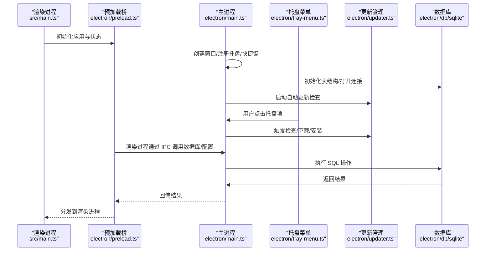
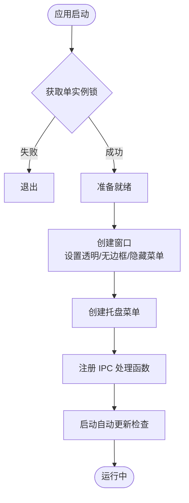
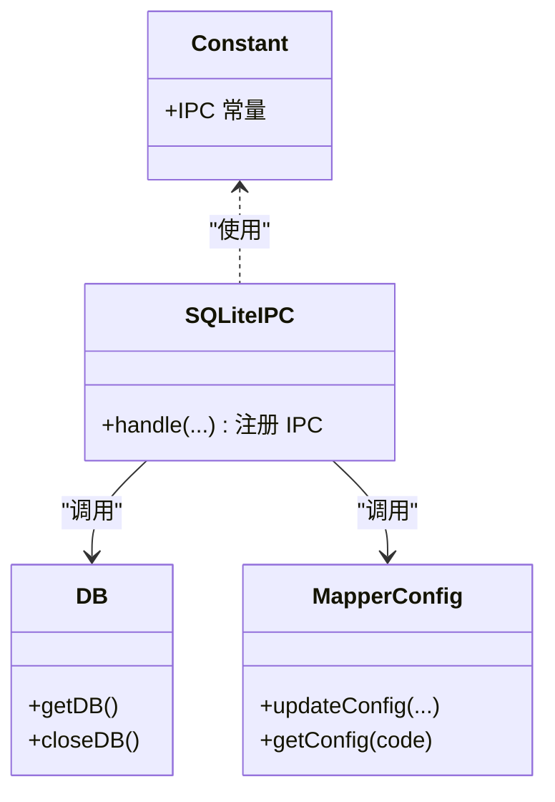
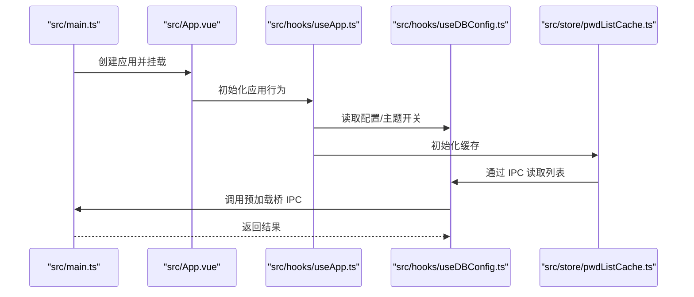
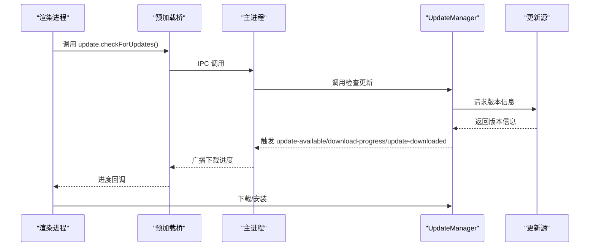
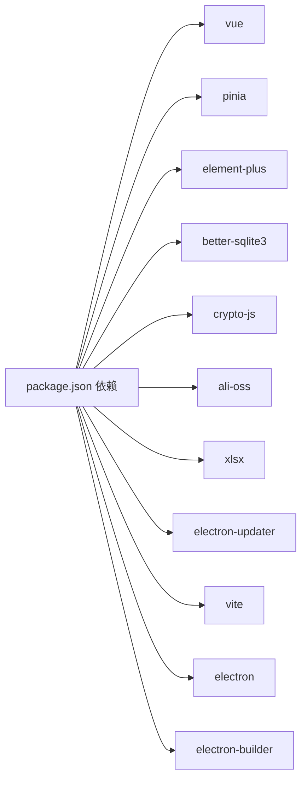

# 开发者指南

<cite>
**本文引用的文件**
- [package.json](file://package.json)
- [vite.config.ts](file://vite.config.ts)
- [tsconfig.json](file://tsconfig.json)
- [electron/main.ts](file://electron/main.ts)
- [electron/common.ts](file://electron/common.ts)
- [electron/constant.ts](file://electron/constant.ts)
- [electron/tray-menu.ts](file://electron/tray-menu.ts)
- [electron/updater.ts](file://electron/updater.ts)
- [electron/preload.ts](file://electron/preload.ts)
- [electron/db/sqlite/components/db.ts](file://electron/db/sqlite/components/db.ts)
- [electron/db/sqlite/components/initSql.ts](file://electron/db/sqlite/components/initSql.ts)
- [electron/db/sqlite/sqlite-ipc.ts](file://electron/db/sqlite/sqlite-ipc.ts)
- [electron/db/sqlite/mapper/config.ts](file://electron/db/sqlite/mapper/config.ts)
- [src/main.ts](file://src/main.ts)
- [src/App.vue](file://src/App.vue)
- [src/hooks/useApp.ts](file://src/hooks/useApp.ts)
- [src/hooks/useDBConfig.ts](file://src/hooks/useDBConfig.ts)
- [src/hooks/useDBGroup.ts](file://src/hooks/useDBGroup.ts)
- [src/store/pwdListCache.ts](file://src/store/pwdListCache.ts)
</cite>

## 目录
1. [简介](#简介)
2. [项目结构](#项目结构)
3. [核心组件](#核心组件)
4. [架构总览](#架构总览)
5. [详细组件分析](#详细组件分析)
6. [依赖分析](#依赖分析)
7. [性能考虑](#性能考虑)
8. [调试与故障排除](#调试与故障排除)
9. [结论](#结论)
10. [附录](#附录)

## 简介
本指南面向密码管理器项目的开发者，提供从代码规范、调试技巧、性能优化到故障排除的全流程指导。内容覆盖编码标准、命名约定、最佳实践；涵盖调试工具使用、性能分析方法与内存泄漏检测；包含常见问题的诊断流程、解决方案与预防措施；并给出开发环境配置、IDE设置与插件推荐，以及代码审查标准、测试策略与质量保证流程，帮助新贡献者快速上手并高质量参与项目。

## 项目结构
项目采用 Electron + Vue 3 + TypeScript 技术栈，结合 Vite 构建与 Pinia 状态管理。主进程负责窗口、托盘、更新与数据库 IPC；渲染进程承载 UI 与业务逻辑；SQLite 作为本地数据存储。

```mermaid
graph TB
subgraph "Electron 主进程"
M["electron/main.ts"]
C["electron/constant.ts"]
U["electron/updater.ts"]
T["electron/tray-menu.ts"]
P["electron/preload.ts"]
D["electron/db/sqlite/components/db.ts"]
S["electron/db/sqlite/sqlite-ipc.ts"]
end
subgraph "渲染进程"
V["src/main.ts"]
APP["src/App.vue"]
H1["src/hooks/useApp.ts"]
H2["src/hooks/useDBConfig.ts"]
H3["src/hooks/useDBGroup.ts"]
ST["src/store/pwdListCache.ts"]
end
M --> T
M --> U
M --> S
M --> D
M --> P
V --> APP
APP --> H1
H1 --> H2
H1 --> H3
H1 --> ST
P <- --> S
```

**图示来源**
- [electron/main.ts:1-240](file://electron/main.ts#L1-L240)
- [electron/constant.ts:1-63](file://electron/constant.ts#L1-L63)
- [electron/updater.ts:1-204](file://electron/updater.ts#L1-L204)
- [electron/tray-menu.ts:1-47](file://electron/tray-menu.ts#L1-L47)
- [electron/preload.ts:1-39](file://electron/preload.ts#L1-L39)
- [electron/db/sqlite/components/db.ts:1-30](file://electron/db/sqlite/components/db.ts#L1-L30)
- [electron/db/sqlite/sqlite-ipc.ts:1-220](file://electron/db/sqlite/sqlite-ipc.ts#L1-L220)
- [src/main.ts:1-20](file://src/main.ts#L1-L20)
- [src/App.vue:1-19](file://src/App.vue#L1-L19)
- [src/hooks/useApp.ts:1-71](file://src/hooks/useApp.ts#L1-L71)
- [src/hooks/useDBConfig.ts:1-21](file://src/hooks/useDBConfig.ts#L1-L21)
- [src/hooks/useDBGroup.ts:1-53](file://src/hooks/useDBGroup.ts#L1-L53)
- [src/store/pwdListCache.ts:1-37](file://src/store/pwdListCache.ts#L1-L37)

**章节来源**
- [package.json:1-51](file://package.json#L1-L51)
- [vite.config.ts:1-38](file://vite.config.ts#L1-L38)
- [tsconfig.json:1-37](file://tsconfig.json#L1-L37)

## 核心组件
- 主进程入口与生命周期：负责窗口创建、托盘、全局快捷键、自动更新、数据库初始化与 IPC 注册。
- 数据层：基于 better-sqlite3 的本地数据库封装与 SQL Mapper，统一通过 IPC 提供给渲染进程调用。
- 渲染进程：Vue 应用入口、App 根组件、Hooks（业务逻辑）、Pinia Store（缓存）。
- 更新机制：基于 electron-updater 的通用更新源，支持手动检查、下载、安装与进度通知。
- 预加载桥：通过 contextBridge 暴露受控的 IPC 接口，确保安全访问。

**章节来源**
- [electron/main.ts:1-240](file://electron/main.ts#L1-L240)
- [electron/db/sqlite/components/db.ts:1-30](file://electron/db/sqlite/components/db.ts#L1-L30)
- [electron/db/sqlite/sqlite-ipc.ts:1-220](file://electron/db/sqlite/sqlite-ipc.ts#L1-L220)
- [src/main.ts:1-20](file://src/main.ts#L1-L20)
- [src/App.vue:1-19](file://src/App.vue#L1-L19)
- [electron/updater.ts:1-204](file://electron/updater.ts#L1-L204)
- [electron/preload.ts:1-39](file://electron/preload.ts#L1-L39)

## 架构总览
下图展示了主进程与渲染进程之间的交互关系，以及数据库与更新模块的集成。



**图示来源**
- [src/main.ts:1-20](file://src/main.ts#L1-L20)
- [electron/preload.ts:1-39](file://electron/preload.ts#L1-L39)
- [electron/main.ts:1-240](file://electron/main.ts#L1-L240)
- [electron/tray-menu.ts:1-47](file://electron/tray-menu.ts#L1-L47)
- [electron/updater.ts:1-204](file://electron/updater.ts#L1-L204)
- [electron/db/sqlite/components/db.ts:1-30](file://electron/db/sqlite/components/db.ts#L1-L30)

## 详细组件分析

### 主进程与窗口管理
- 单实例锁、窗口创建与隐藏至托盘、全局快捷键注册、开机自启设置、开发者工具开关。
- IPC 统一处理：最小化/最大化/关闭、打开外部链接、检查更新等。



**图示来源**
- [electron/main.ts:1-240](file://electron/main.ts#L1-L240)
- [electron/common.ts:1-56](file://electron/common.ts#L1-L56)
- [electron/tray-menu.ts:1-47](file://electron/tray-menu.ts#L1-L47)

**章节来源**
- [electron/main.ts:1-240](file://electron/main.ts#L1-L240)
- [electron/common.ts:1-56](file://electron/common.ts#L1-L56)
- [electron/tray-menu.ts:1-47](file://electron/tray-menu.ts#L1-L47)

### 数据库与 IPC 层
- 数据库连接：用户目录下的本地数据库文件，按需初始化连接。
- IPC 映射：将 SQLite 的增删改查映射为 IPC 通道，渲染进程通过预加载桥调用。
- 常量定义：集中管理所有 IPC 通道名，避免魔法字符串。



**图示来源**
- [electron/constant.ts:1-63](file://electron/constant.ts#L1-L63)
- [electron/db/sqlite/sqlite-ipc.ts:1-220](file://electron/db/sqlite/sqlite-ipc.ts#L1-L220)
- [electron/db/sqlite/components/db.ts:1-30](file://electron/db/sqlite/components/db.ts#L1-L30)
- [electron/db/sqlite/mapper/config.ts:1-27](file://electron/db/sqlite/mapper/config.ts#L1-L27)

**章节来源**
- [electron/db/sqlite/components/db.ts:1-30](file://electron/db/sqlite/components/db.ts#L1-L30)
- [electron/db/sqlite/sqlite-ipc.ts:1-220](file://electron/db/sqlite/sqlite-ipc.ts#L1-L220)
- [electron/constant.ts:1-63](file://electron/constant.ts#L1-L63)
- [electron/db/sqlite/mapper/config.ts:1-27](file://electron/db/sqlite/mapper/config.ts#L1-L27)

### 渲染进程与状态管理
- 应用入口：创建 Vue 实例与 Pinia，挂载根组件。
- 根组件：根据路由选择当前视图组件。
- Hooks：封装登录、主题、配置、分组、数据同步等业务逻辑。
- Store：密码列表缓存，减少频繁读取数据库。



**图示来源**
- [src/main.ts:1-20](file://src/main.ts#L1-L20)
- [src/App.vue:1-19](file://src/App.vue#L1-L19)
- [src/hooks/useApp.ts:1-71](file://src/hooks/useApp.ts#L1-L71)
- [src/hooks/useDBConfig.ts:1-21](file://src/hooks/useDBConfig.ts#L1-L21)
- [src/store/pwdListCache.ts:1-37](file://src/store/pwdListCache.ts#L1-L37)
- [electron/preload.ts:1-39](file://electron/preload.ts#L1-L39)

**章节来源**
- [src/main.ts:1-20](file://src/main.ts#L1-L20)
- [src/App.vue:1-19](file://src/App.vue#L1-L19)
- [src/hooks/useApp.ts:1-71](file://src/hooks/useApp.ts#L1-L71)
- [src/hooks/useDBConfig.ts:1-21](file://src/hooks/useDBConfig.ts#L1-L21)
- [src/store/pwdListCache.ts:1-37](file://src/store/pwdListCache.ts#L1-L37)

### 自动更新机制
- 使用通用更新源，手动控制下载与安装。
- 支持跳过版本、延迟提醒、下载进度广播与安装确认。
- 主进程监听更新事件并向渲染进程推送进度。



**图示来源**
- [electron/updater.ts:1-204](file://electron/updater.ts#L1-L204)
- [electron/preload.ts:25-38](file://electron/preload.ts#L25-L38)
- [electron/main.ts:196-227](file://electron/main.ts#L196-L227)

**章节来源**
- [electron/updater.ts:1-204](file://electron/updater.ts#L1-L204)
- [electron/main.ts:196-227](file://electron/main.ts#L196-L227)
- [electron/preload.ts:1-39](file://electron/preload.ts#L1-L39)

## 依赖分析
- 构建与打包：Vite + electron-plugin-simple，主/预加载/渲染三段式构建。
- 运行时依赖：Vue 3、Pinia、Element Plus、better-sqlite3、crypto-js、ali-oss、xlsx、electron-updater。
- 开发依赖：TypeScript、Vite 插件、electron、electron-builder、electron-rebuild 等。



**图示来源**
- [package.json:18-44](file://package.json#L18-L44)

**章节来源**
- [package.json:1-51](file://package.json#L1-L51)
- [vite.config.ts:1-38](file://vite.config.ts#L1-L38)

## 性能考虑
- 数据库连接复用：通过单例模式获取连接，避免重复打开/关闭带来的 IO 开销。
- 缓存策略：Pinia Store 对密码列表进行轻量缓存，减少频繁查询。
- 事件监听去抖：自动登出定时器在用户交互时重置，避免无效轮询。
- 构建优化：Vite 按需加载与自动导入 Element Plus 组件，减少包体与首屏时间。
- IPC 调用批量化：对高频查询可合并请求或增加本地缓存，降低主进程压力。

[本节为通用性能建议，无需特定文件引用]

## 调试与故障排除

### 调试工具与技巧
- 开发者工具：主进程可通过 IPC 打开 DevTools，便于调试渲染进程。
- 日志输出：主进程与各模块广泛使用 console 输出，便于定位问题。
- 预加载桥：仅暴露必要 API，避免直接注入全局对象，提升安全性与可控性。

**章节来源**
- [electron/common.ts:52-56](file://electron/common.ts#L52-L56)
- [electron/preload.ts:1-39](file://electron/preload.ts#L1-L39)
- [electron/main.ts:167-171](file://electron/main.ts#L167-L171)

### 常见问题与诊断流程
- 无法打开数据库
  - 现象：应用启动报错或功能异常。
  - 诊断：检查用户数据目录权限与 dbPath 是否正确；查看连接初始化日志。
  - 解决：修复权限或迁移数据目录。
- 快捷键无效
  - 现象：全局快捷键不生效。
  - 诊断：确认注册流程与平台差异（如 Ctrl 替换为 CommandOrControl）。
  - 解决：重新注册或调整快捷键组合。
- 更新失败
  - 现象：检查更新无响应或下载中断。
  - 诊断：查看更新源可达性与网络状态；关注错误事件日志。
  - 解决：切换网络或更新源，重试下载。
- 内存泄漏排查
  - 方法：使用 Chrome DevTools Memory 面板快照对比；检查未释放的事件监听与定时器。
  - 关注点：自动登出定时器、IPC 监听器、缓存对象生命周期。

**章节来源**
- [electron/db/sqlite/components/db.ts:1-30](file://electron/db/sqlite/components/db.ts#L1-L30)
- [electron/common.ts:17-39](file://electron/common.ts#L17-L39)
- [electron/updater.ts:38-97](file://electron/updater.ts#L38-L97)
- [src/hooks/useApp.ts:54-68](file://src/hooks/useApp.ts#L54-L68)

### 性能分析与内存检测
- 使用 V8 Profiler 与 Performance 面板分析渲染进程 CPU 占用。
- 使用 DevTools Memory 面板捕获堆快照，识别未释放对象与长生命周期对象。
- 监控 IPC 调用频率与耗时，避免高频短间隔请求。

[本节为通用分析方法，无需特定文件引用]

## 结论
本指南从架构、组件、调试与性能等方面提供了密码管理器项目的开发参考。建议在日常开发中遵循统一的命名与模块划分，严格控制 IPC 调用频次与数据体量，持续监控更新与数据库健康状况，并通过缓存与懒加载优化用户体验。对于新贡献者，建议先熟悉主/渲染双进程模型与 SQLite IPC 流程，再逐步深入具体业务模块。

[本节为总结性内容，无需特定文件引用]

## 附录

### 代码规范与最佳实践
- 命名约定
  - 文件与类：帕斯卡命名（如 useApp.ts、UpdateManager）
  - 变量与函数：驼峰命名（如 getConfigValue、setAutoStart）
  - 常量：全大写下划线（如 WINDOW_INDEX_WIDTH）
- 模块职责
  - 主进程：窗口、托盘、更新、IPC、数据库初始化
  - 渲染进程：UI、业务逻辑、状态管理、IPC 调用
  - 数据层：Mapper 聚合 SQL 操作，常量集中管理 IPC 名称
- 错误处理
  - 主进程与更新模块统一监听 error 事件并记录日志
  - 渲染进程通过 try/catch 包裹异步 IPC 调用
- 安全
  - 仅通过 contextBridge 暴露必要 API
  - 避免在渲染进程直接使用 Node API

**章节来源**
- [electron/constant.ts:1-63](file://electron/constant.ts#L1-L63)
- [electron/updater.ts:38-43](file://electron/updater.ts#L38-L43)
- [electron/preload.ts:1-39](file://electron/preload.ts#L1-L39)

### 开发环境配置与 IDE 设置
- Node 版本：建议使用 LTS（与项目脚本兼容）
- 包管理：npm（与脚本一致）
- IDE 推荐插件
  - TypeScript TSServer（TS 语法与类型检查）
  - ESLint（若启用，配合 tsconfig 严格模式）
  - Prettier（格式化）
  - Vue Language Features（Volar）
  - EditorConfig（统一缩进与换行）
- Vite 配置要点
  - 自动导入 Element Plus 组件与 API
  - Electron 预加载与主进程入口配置
- Electron 开发
  - 使用 Vite Dev Server 与 Electron 主进程联调
  - 通过 IPC 打开 DevTools 辅助调试

**章节来源**
- [package.json:12-16](file://package.json#L12-L16)
- [vite.config.ts:1-38](file://vite.config.ts#L1-L38)
- [tsconfig.json:20-24](file://tsconfig.json#L20-L24)

### 代码审查标准
- 代码风格：统一命名、注释与缩进；避免魔法字符串与硬编码
- 安全性：禁止在渲染进程直接调用 Node/Electron API；严格校验 IPC 参数
- 可维护性：模块职责清晰；错误处理完整；日志输出有助于定位问题
- 性能：避免高频 IPC；合理使用缓存；注意数据库事务与批量操作

[本节为通用审查标准，无需特定文件引用]

### 测试策略与质量保证
- 单元测试：针对 Hooks 与工具函数（如配置读取、分组 CRUD）编写测试
- 集成测试：模拟 IPC 调用链路，验证主/渲染进程协作
- 端到端测试：使用自动化测试框架验证关键业务流程（登录、添加分组、导入导出）
- 质量门禁：CI 中执行 lint、类型检查与基础测试，确保合并质量

[本节为通用测试策略，无需特定文件引用]

### 新贡献者入门流程
- 环境准备：安装 Node、克隆仓库、安装依赖
- 启动项目：运行开发脚本，进入 Electron 应用
- 熟悉结构：阅读主进程入口、数据库 IPC、渲染入口与 Hooks
- 提交流程：分支命名规范 → 编写测试 → 提交 PR → 代码审查 → 合并

**章节来源**
- [package.json:12-16](file://package.json#L12-L16)
- [electron/main.ts:1-240](file://electron/main.ts#L1-L240)
- [electron/db/sqlite/sqlite-ipc.ts:1-220](file://electron/db/sqlite/sqlite-ipc.ts#L1-L220)
- [src/main.ts:1-20](file://src/main.ts#L1-L20)