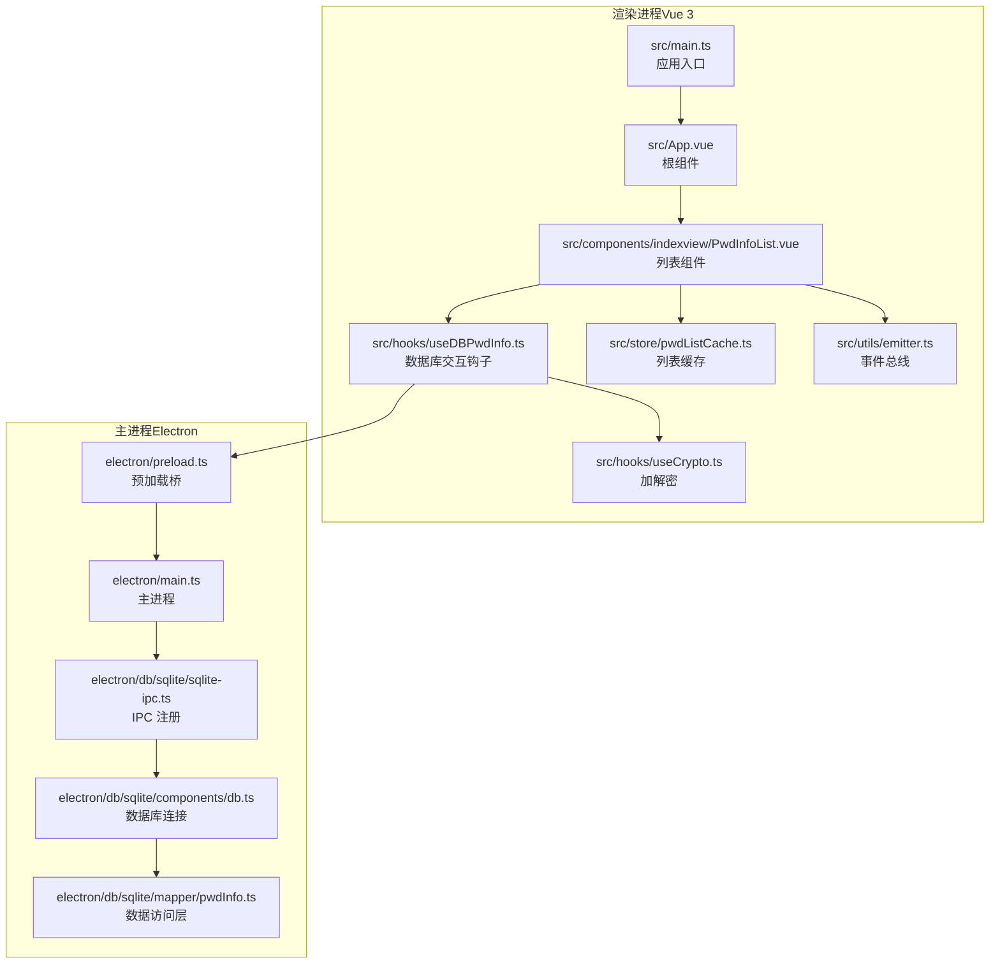
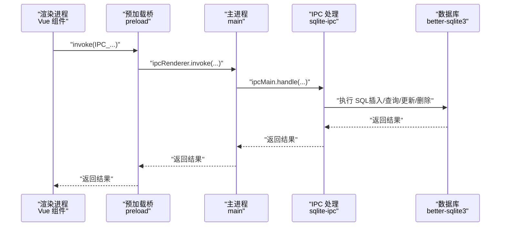
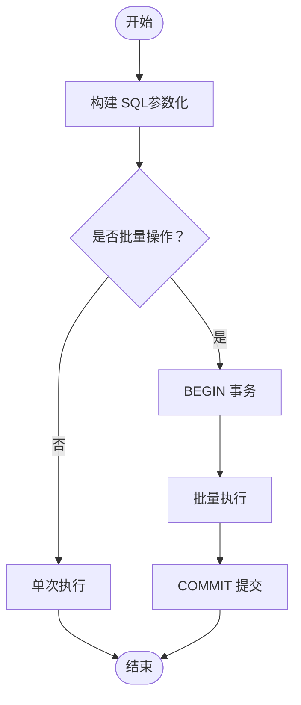
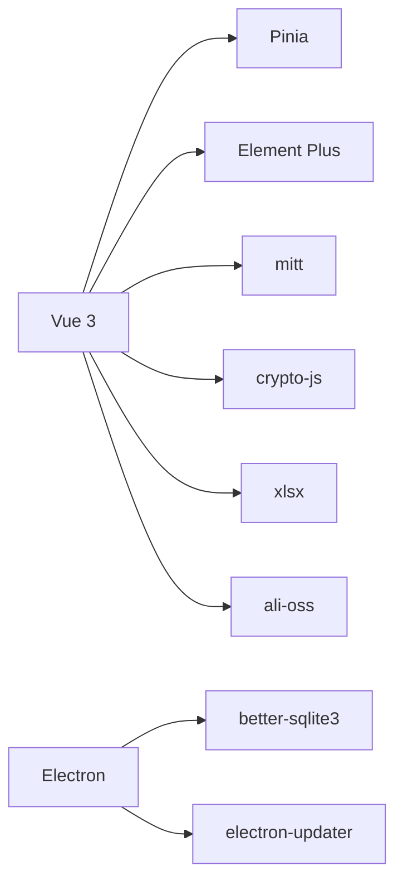
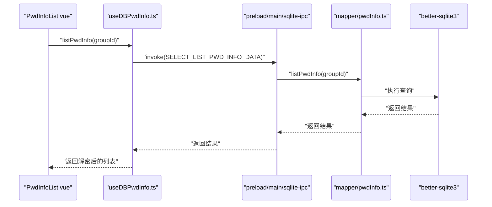

# 性能优化

<cite>
**本文引用的文件**
- [src/main.ts](file://src/main.ts)
- [vite.config.ts](file://vite.config.ts)
- [package.json](file://package.json)
- [electron/main.ts](file://electron/main.ts)
- [electron/preload.ts](file://electron/preload.ts)
- [electron/db/sqlite/components/db.ts](file://electron/db/sqlite/components/db.ts)
- [electron/db/sqlite/sqlite-ipc.ts](file://electron/db/sqlite/sqlite-ipc.ts)
- [electron/db/sqlite/mapper/pwdInfo.ts](file://electron/db/sqlite/mapper/pwdInfo.ts)
- [src/hooks/useDBPwdInfo.ts](file://src/hooks/useDBPwdInfo.ts)
- [src/hooks/useCrypto.ts](file://src/hooks/useCrypto.ts)
- [src/store/pwdListCache.ts](file://src/store/pwdListCache.ts)
- [src/components/indexview/PwdInfoList.vue](file://src/components/indexview/PwdInfoList.vue)
- [src/App.vue](file://src/App.vue)
- [src/utils/emitter.ts](file://src/utils/emitter.ts)
</cite>

## 目录
1. [简介](#简介)
2. [项目结构](#项目结构)
3. [核心组件](#核心组件)
4. [架构总览](#架构总览)
5. [详细组件分析](#详细组件分析)
6. [依赖分析](#依赖分析)
7. [性能考量](#性能考量)
8. [故障排查指南](#故障排查指南)
9. [结论](#结论)
10. [附录](#附录)

## 简介
本指南面向该密码管理器项目的性能优化，覆盖以下方面：
- Vue 3 应用：组件懒加载、计算属性与响应式数据优化、状态管理与缓存策略
- 数据库层：查询优化（索引、批量、缓存）、IPC 通信优化
- Electron：内存管理、进程间通信（IPC）优化、渲染性能提升
- 大数据量处理：虚拟滚动、分页与增量更新
- 加密与异步：算法与异步操作优化、资源压缩
- 监控与诊断：指标、基准测试与问题定位流程

## 项目结构
该项目采用 Vite + Vue 3 + Electron 的桌面应用架构，前端使用 Pinia 管理状态，后端通过 IPC 访问 SQLite 数据库。

图示来源
- [src/main.ts:1-20](file://src/main.ts#L1-L20)
- [src/App.vue:1-19](file://src/App.vue#L1-L19)
- [src/components/indexview/PwdInfoList.vue:1-260](file://src/components/indexview/PwdInfoList.vue#L1-L260)
- [src/hooks/useDBPwdInfo.ts:1-103](file://src/hooks/useDBPwdInfo.ts#L1-L103)
- [src/hooks/useCrypto.ts:1-77](file://src/hooks/useCrypto.ts#L1-L77)
- [src/store/pwdListCache.ts:1-37](file://src/store/pwdListCache.ts#L1-L37)
- [src/utils/emitter.ts:1-16](file://src/utils/emitter.ts#L1-L16)
- [electron/main.ts:1-240](file://electron/main.ts#L1-L240)
- [electron/preload.ts:1-39](file://electron/preload.ts#L1-L39)
- [electron/db/sqlite/sqlite-ipc.ts:1-220](file://electron/db/sqlite/sqlite-ipc.ts#L1-L220)
- [electron/db/sqlite/components/db.ts:1-30](file://electron/db/sqlite/components/db.ts#L1-L30)
- [electron/db/sqlite/mapper/pwdInfo.ts:1-100](file://electron/db/sqlite/mapper/pwdInfo.ts#L1-L100)

章节来源
- [src/main.ts:1-20](file://src/main.ts#L1-L20)
- [vite.config.ts:1-38](file://vite.config.ts#L1-L38)
- [package.json:1-51](file://package.json#L1-L51)
- [electron/main.ts:1-240](file://electron/main.ts#L1-L240)
- [electron/preload.ts:1-39](file://electron/preload.ts#L1-L39)

## 核心组件
- 渲染进程入口与插件配置：应用初始化、Pinia 注入、开发工具与构建配置
- 主进程与 IPC：窗口生命周期、全局快捷键、更新机制、数据库 IPC
- 数据访问层：基于 better-sqlite3 的 CRUD 封装，按组查询、搜索、计数
- 响应式与状态：Pinia 缓存列表、事件总线驱动局部更新
- 加密模块：AES/CBC + IV、MD5/SHA512 辅助、批量解密

章节来源
- [src/main.ts:1-20](file://src/main.ts#L1-L20)
- [vite.config.ts:1-38](file://vite.config.ts#L1-L38)
- [electron/main.ts:1-240](file://electron/main.ts#L1-L240)
- [electron/db/sqlite/sqlite-ipc.ts:1-220](file://electron/db/sqlite/sqlite-ipc.ts#L1-L220)
- [electron/db/sqlite/mapper/pwdInfo.ts:1-100](file://electron/db/sqlite/mapper/pwdInfo.ts#L1-L100)
- [src/store/pwdListCache.ts:1-37](file://src/store/pwdListCache.ts#L1-L37)
- [src/utils/emitter.ts:1-16](file://src/utils/emitter.ts#L1-L16)
- [src/hooks/useCrypto.ts:1-77](file://src/hooks/useCrypto.ts#L1-L77)

## 架构总览
渲染进程通过 preload 暴露的 ipcRenderer 与主进程通信；主进程注册数据库相关 IPC 并转发到 SQLite 访问层；数据库连接由 better-sqlite3 提供，使用本地用户目录持久化。

图示来源
- [electron/preload.ts:1-39](file://electron/preload.ts#L1-L39)
- [electron/main.ts:1-240](file://electron/main.ts#L1-L240)
- [electron/db/sqlite/sqlite-ipc.ts:1-220](file://electron/db/sqlite/sqlite-ipc.ts#L1-L220)
- [electron/db/sqlite/components/db.ts:1-30](file://electron/db/sqlite/components/db.ts#L1-L30)

## 详细组件分析

### 组件懒加载与渲染性能
- 当前渲染进程入口已启用 Vue 插件与自动导入，建议对大型页面或非首屏组件进行动态导入以降低首屏体积与首次绘制时间。
- 列表组件使用滚动容器承载大量项，建议引入虚拟滚动以限制 DOM 节点数量，提升滚动流畅度。

章节来源
- [vite.config.ts:1-38](file://vite.config.ts#L1-L38)
- [src/components/indexview/PwdInfoList.vue:157-195](file://src/components/indexview/PwdInfoList.vue#L157-L195)

### 计算属性与响应式数据优化
- 列表缓存 Store 仅保留必要字段，避免在视图中重复解密全量敏感字段，减少不必要的渲染与计算。
- 事件总线用于跨组件通知，但需注意在组件卸载时解绑监听，防止内存泄漏与无效更新。

章节来源
- [src/store/pwdListCache.ts:1-37](file://src/store/pwdListCache.ts#L1-L37)
- [src/utils/emitter.ts:1-16](file://src/utils/emitter.ts#L1-L16)
- [src/components/indexview/PwdInfoList.vue:80-85](file://src/components/indexview/PwdInfoList.vue#L80-L85)

### 数据库查询优化
- 查询路径：组件调用 Hook -> IPC -> 主进程处理 -> 访问层 -> better-sqlite3 执行 SQL
- 建议：
  - 对 group_id、id 建立索引以加速 WHERE 查询
  - 批量插入使用事务包裹，减少提交开销
  - 使用参数化查询（已实现）防止注入并复用执行计划
  - 对高频搜索建立 LIKE 索引或考虑全文检索替代方案

图示来源
- [electron/db/sqlite/mapper/pwdInfo.ts:1-100](file://electron/db/sqlite/mapper/pwdInfo.ts#L1-L100)
- [electron/db/sqlite/components/db.ts:1-30](file://electron/db/sqlite/components/db.ts#L1-L30)

### IPC 通信优化
- 预加载桥封装了 on/off/send/invoke，建议：
  - 合理拆分 IPC 通道，避免单通道承载过多业务类型
  - 对高频调用（如列表刷新）合并为一次性请求或使用批量接口
  - 控制消息体大小，避免大对象频繁传输

章节来源
- [electron/preload.ts:1-39](file://electron/preload.ts#L1-L39)
- [electron/main.ts:149-227](file://electron/main.ts#L149-L227)
- [electron/db/sqlite/sqlite-ipc.ts:1-220](file://electron/db/sqlite/sqlite-ipc.ts#L1-L220)

### 加密与异步优化
- 加密模块使用 AES/CBC + IV，建议：
  - 将密钥与 IV 作为 Uint8Array 预解析，避免重复解析
  - 对批量解密使用批处理，减少循环内对象分配
  - 在 UI 层延迟解密，仅在需要展示时解密，减少主线程压力

章节来源
- [src/hooks/useCrypto.ts:1-77](file://src/hooks/useCrypto.ts#L1-L77)
- [src/hooks/useDBPwdInfo.ts:68-76](file://src/hooks/useDBPwdInfo.ts#L68-L76)

### 大数据量处理最佳实践
- 虚拟滚动：对长列表使用虚拟化方案，仅渲染可视区域节点
- 分页加载：对搜索与统计场景采用分页，避免一次性拉取全部数据
- 增量更新：结合事件总线与局部状态更新，避免全量重绘

章节来源
- [src/components/indexview/PwdInfoList.vue:1-260](file://src/components/indexview/PwdInfoList.vue#L1-L260)
- [src/utils/emitter.ts:1-16](file://src/utils/emitter.ts#L1-L16)

## 依赖分析
- 前端依赖：Vue 3、Pinia、Element Plus、mitt、crypto-js、xlsx、ali-oss
- Electron 依赖：better-sqlite3、electron-updater
- 构建工具：Vite、electron-builder、unplugin-auto-import、unplugin-vue-components

图示来源
- [package.json:18-29](file://package.json#L18-L29)
- [package.json:30-44](file://package.json#L30-L44)

章节来源
- [package.json:1-51](file://package.json#L1-L51)

## 性能考量

### Vue 3 应用优化
- 组件懒加载：对非关键路由或重型组件使用动态 import，减少首屏 JS 体积
- 响应式与缓存：Pinia Store 中缓存轻量数据，避免在模板中做昂贵计算
- 事件与更新：使用事件总线时确保在 onUnmounted 中解绑，避免无效更新链路

章节来源
- [src/App.vue:1-19](file://src/App.vue#L1-L19)
- [src/store/pwdListCache.ts:1-37](file://src/store/pwdListCache.ts#L1-L37)
- [src/utils/emitter.ts:1-16](file://src/utils/emitter.ts#L1-L16)

### 数据库与 IPC 优化
- 索引：对 group_id、id 建立索引；搜索字段可考虑全文索引或前缀索引
- 批量：批量插入/更新使用事务，减少磁盘写入次数
- 缓存：Pinia 缓存列表只保留必要字段，避免在视图中重复解密

章节来源
- [electron/db/sqlite/mapper/pwdInfo.ts:1-100](file://electron/db/sqlite/mapper/pwdInfo.ts#L1-L100)
- [src/store/pwdListCache.ts:1-37](file://src/store/pwdListCache.ts#L1-L37)

### Electron 内存与渲染优化
- 内存：及时释放未使用的对象引用，避免闭包持有大对象；IPC 传输避免大数组/对象
- 渲染：禁用拼写检查、合理使用滚动容器；对长列表使用虚拟滚动
- 进程：将耗时任务（如加密/解密）放在主进程或 WebWorker 中，避免阻塞 UI

章节来源
- [electron/main.ts:77-80](file://electron/main.ts#L77-L80)
- [src/components/indexview/PwdInfoList.vue:160-180](file://src/components/indexview/PwdInfoList.vue#L160-L180)

### 加密与异步优化
- 算法：预解析密钥/IV，批量解密时减少循环内对象创建
- 异步：将 IO 密集型操作（数据库、网络）异步化，避免同步阻塞

章节来源
- [src/hooks/useCrypto.ts:1-77](file://src/hooks/useCrypto.ts#L1-L77)
- [src/hooks/useDBPwdInfo.ts:1-103](file://src/hooks/useDBPwdInfo.ts#L1-L103)

### 资源与打包优化
- 资源压缩：启用构建压缩与 Tree Shaking；对图片/字体进行压缩与懒加载
- 打包：按需引入 Element Plus 组件，避免全量引入

章节来源
- [vite.config.ts:10-36](file://vite.config.ts#L10-L36)
- [package.json:18-29](file://package.json#L18-L29)

### 性能监控与基准测试
- 指标：首屏时间、交互延迟、内存占用、IPC 调用耗时、数据库查询耗时
- 工具：Chrome DevTools Performance/Heap/Network；Electron 主进程日志
- 方法：录制典型操作（打开窗口、切换分组、搜索、导入导出），对比优化前后差异

[本节为通用指导，不直接分析具体文件]

### 诊断流程
- 页面卡顿：检查是否存在长任务阻塞 UI；确认是否使用虚拟滚动与事件解绑
- IPC 卡顿：检查通道数量与消息体大小；合并高频调用
- 数据库慢：确认索引、事务与批量操作；避免在渲染线程执行 heavy IO

[本节为通用指导，不直接分析具体文件]

## 故障排查指南
- 列表不刷新或闪烁：确认事件总线解绑与 Pinia 缓存刷新逻辑
- IPC 报错：检查通道名称一致性与参数类型；确保预加载桥正确暴露 API
- 加密异常：核对密钥/IV 长度与编码；确认 Base64/Utf8 转换一致

章节来源
- [src/utils/emitter.ts:1-16](file://src/utils/emitter.ts#L1-L16)
- [electron/preload.ts:1-39](file://electron/preload.ts#L1-L39)
- [src/hooks/useCrypto.ts:1-77](file://src/hooks/useCrypto.ts#L1-L77)

## 结论
通过组件懒加载、Pinia 缓存与事件总线的合理使用，结合 better-sqlite3 的索引与事务优化，以及 Electron 的 IPC 与渲染性能改进，可在保证安全性的同时显著提升应用性能。建议优先实施虚拟滚动、批量操作与缓存策略，并建立完善的性能监控与回归测试流程。

[本节为总结性内容，不直接分析具体文件]

## 附录

### 关键流程时序图：列表查询与更新

图示来源
- [src/components/indexview/PwdInfoList.vue:56-58](file://src/components/indexview/PwdInfoList.vue#L56-L58)
- [src/hooks/useDBPwdInfo.ts:65-70](file://src/hooks/useDBPwdInfo.ts#L65-L70)
- [electron/db/sqlite/sqlite-ipc.ts:177-181](file://electron/db/sqlite/sqlite-ipc.ts#L177-L181)
- [electron/db/sqlite/mapper/pwdInfo.ts:50-60](file://electron/db/sqlite/mapper/pwdInfo.ts#L50-L60)
- [electron/db/sqlite/components/db.ts:16-23](file://electron/db/sqlite/components/db.ts#L16-L23)