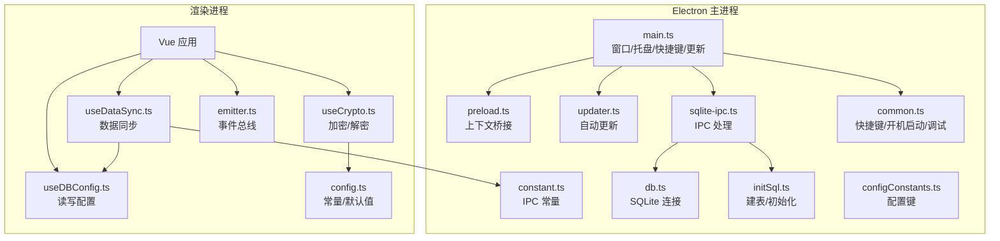
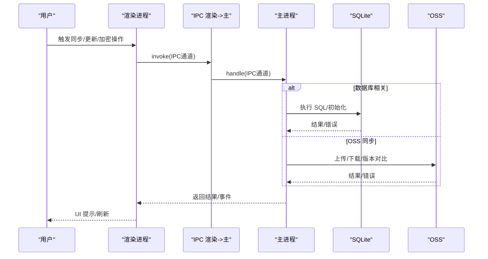
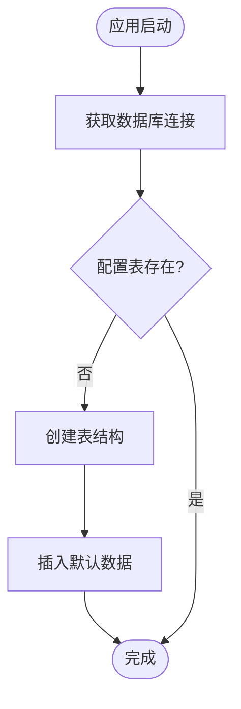
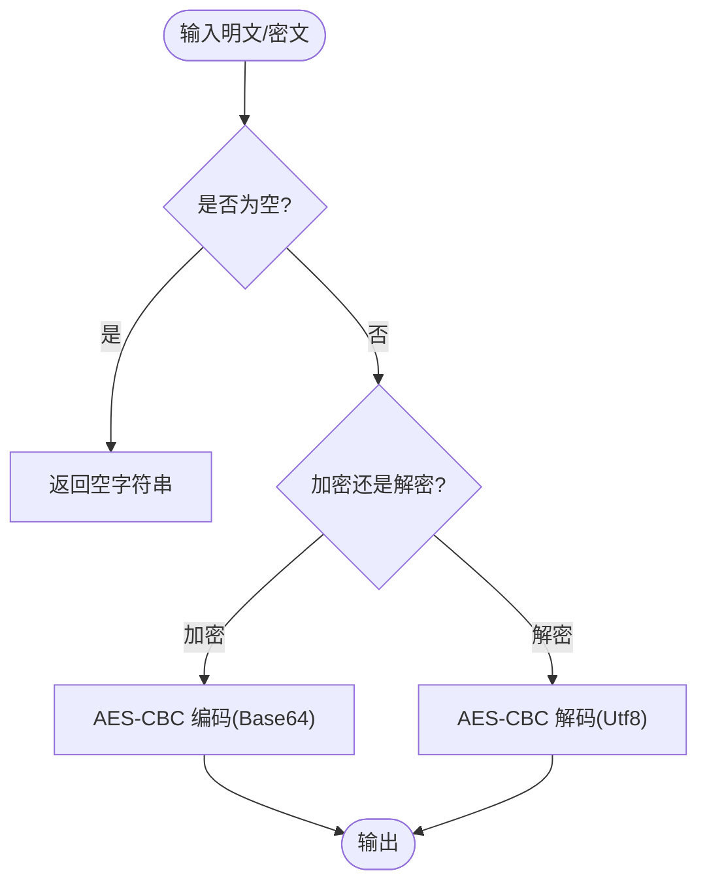
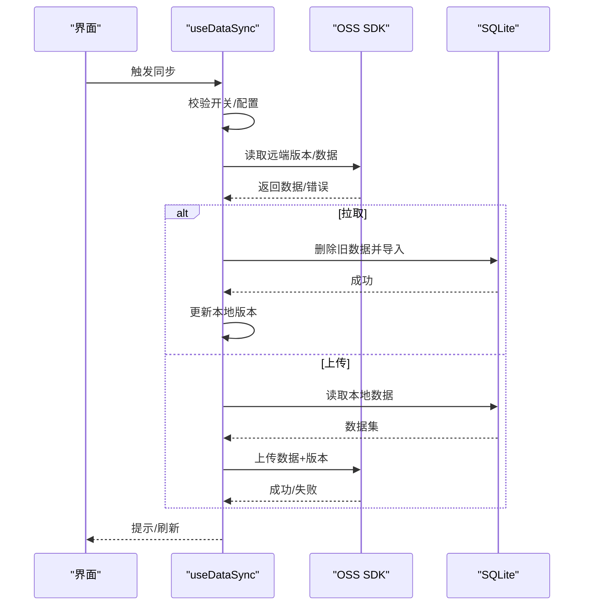
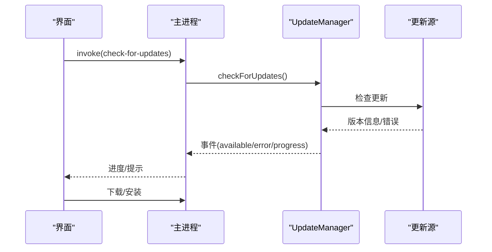
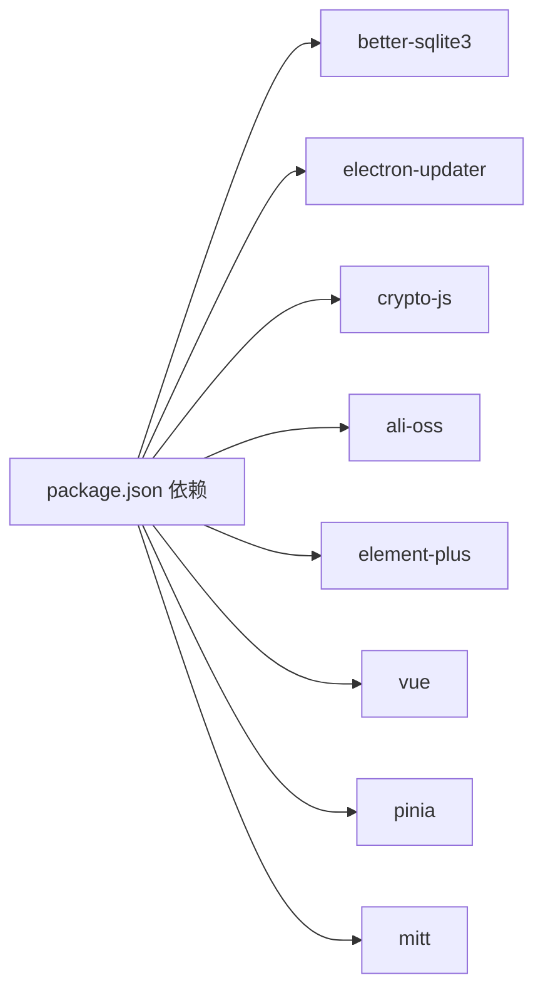

# 故障排除

<cite>
**本文引用的文件**
- [electron/main.ts](file://electron/main.ts)
- [electron/preload.ts](file://electron/preload.ts)
- [electron/common.ts](file://electron/common.ts)
- [electron/constant.ts](file://electron/constant.ts)
- [electron/db/sqlite/components/db.ts](file://electron/db/sqlite/components/db.ts)
- [electron/db/sqlite/components/initSql.ts](file://electron/db/sqlite/components/initSql.ts)
- [electron/db/sqlite/sqlite-ipc.ts](file://electron/db/sqlite/sqlite-ipc.ts)
- [electron/db/sqlite/components/configConstants.ts](file://electron/db/sqlite/components/configConstants.ts)
- [electron/updater.ts](file://electron/updater.ts)
- [src/hooks/useCrypto.ts](file://src/hooks/useCrypto.ts)
- [src/hooks/useDataSync.ts](file://src/hooks/useDataSync.ts)
- [src/hooks/useDBConfig.ts](file://src/hooks/useDBConfig.ts)
- [src/utils/emitter.ts](file://src/utils/emitter.ts)
- [src/config/config.ts](file://src/config/config.ts)
- [package.json](file://package.json)
</cite>

## 目录
1. [简介](#简介)
2. [项目结构](#项目结构)
3. [核心组件](#核心组件)
4. [架构总览](#架构总览)
5. [详细组件分析](#详细组件分析)
6. [依赖关系分析](#依赖关系分析)
7. [性能注意事项](#性能注意事项)
8. [故障排除指南](#故障排除指南)
9. [结论](#结论)
10. [附录](#附录)

## 简介
本手册面向密码管理器的使用者与维护者，提供系统化的故障排除流程与解决方案，覆盖应用启动失败、数据库连接异常、加密解密错误、UI 渲染与交互问题、数据同步异常（网络、权限、冲突）、系统兼容性问题、日志分析与错误代码解读，以及紧急恢复与系统重置步骤。内容基于仓库中的 Electron 主进程、渲染进程、SQLite 数据层、加密模块与数据同步模块的实际实现。

## 项目结构
应用采用 Electron + Vue3 架构，主进程负责窗口、托盘、全局快捷键、自动更新与 SQLite IPC；渲染进程负责 UI、业务逻辑与数据同步；SQLite 存储配置、分组、密码条目、快捷键与 OSS 配置；加密模块使用 CryptoJS 实现 AES/CBC 与哈希；数据同步通过 OSS（ali-oss）实现本地与云端双向同步。

图示来源
- [electron/main.ts:1-240](file://electron/main.ts#L1-L240)
- [electron/constant.ts:1-63](file://electron/constant.ts#L1-L63)
- [electron/preload.ts:1-39](file://electron/preload.ts#L1-L39)
- [electron/updater.ts:1-204](file://electron/updater.ts#L1-L204)
- [electron/db/sqlite/components/db.ts:1-30](file://electron/db/sqlite/components/db.ts#L1-L30)
- [electron/db/sqlite/components/initSql.ts:1-224](file://electron/db/sqlite/components/initSql.ts#L1-L224)
- [electron/db/sqlite/sqlite-ipc.ts:1-220](file://electron/db/sqlite/sqlite-ipc.ts#L1-L220)
- [electron/db/sqlite/components/configConstants.ts:1-29](file://electron/db/sqlite/components/configConstants.ts#L1-L29)
- [electron/common.ts:1-56](file://electron/common.ts#L1-L56)
- [src/hooks/useDataSync.ts:1-324](file://src/hooks/useDataSync.ts#L1-L324)
- [src/hooks/useCrypto.ts:1-77](file://src/hooks/useCrypto.ts#L1-L77)
- [src/hooks/useDBConfig.ts:1-21](file://src/hooks/useDBConfig.ts#L1-L21)
- [src/utils/emitter.ts:1-16](file://src/utils/emitter.ts#L1-L16)
- [src/config/config.ts:1-143](file://src/config/config.ts#L1-L143)

章节来源
- [electron/main.ts:1-240](file://electron/main.ts#L1-L240)
- [electron/constant.ts:1-63](file://electron/constant.ts#L1-L63)
- [electron/db/sqlite/components/db.ts:1-30](file://electron/db/sqlite/components/db.ts#L1-L30)
- [electron/db/sqlite/components/initSql.ts:1-224](file://electron/db/sqlite/components/initSql.ts#L1-L224)
- [electron/db/sqlite/sqlite-ipc.ts:1-220](file://electron/db/sqlite/sqlite-ipc.ts#L1-L220)
- [electron/common.ts:1-56](file://electron/common.ts#L1-L56)
- [src/hooks/useDataSync.ts:1-324](file://src/hooks/useDataSync.ts#L1-L324)
- [src/hooks/useCrypto.ts:1-77](file://src/hooks/useCrypto.ts#L1-L77)
- [src/hooks/useDBConfig.ts:1-21](file://src/hooks/useDBConfig.ts#L1-L21)
- [src/utils/emitter.ts:1-16](file://src/utils/emitter.ts#L1-L16)
- [src/config/config.ts:1-143](file://src/config/config.ts#L1-L143)

## 核心组件
- 主进程与窗口生命周期：负责创建窗口、托盘菜单、全局快捷键、自动更新、IPC 注册与事件监听。
- SQLite 数据层：封装数据库连接、建表初始化、配置项与业务表（分组、密码、快捷键、OSS）的增删改查。
- 数据同步：基于 OSS 的双向同步，包含版本号对比、自动/手动同步、错误分类提示。
- 加密模块：基于 CryptoJS 的 AES-CBC 与哈希算法，统一加解密入口。
- 更新机制：基于 electron-updater，支持检查、下载、安装与进度事件。

章节来源
- [electron/main.ts:1-240](file://electron/main.ts#L1-L240)
- [electron/db/sqlite/components/db.ts:1-30](file://electron/db/sqlite/components/db.ts#L1-L30)
- [electron/db/sqlite/components/initSql.ts:1-224](file://electron/db/sqlite/components/initSql.ts#L1-L224)
- [electron/db/sqlite/sqlite-ipc.ts:1-220](file://electron/db/sqlite/sqlite-ipc.ts#L1-L220)
- [src/hooks/useDataSync.ts:1-324](file://src/hooks/useDataSync.ts#L1-L324)
- [src/hooks/useCrypto.ts:1-77](file://src/hooks/useCrypto.ts#L1-L77)
- [electron/updater.ts:1-204](file://electron/updater.ts#L1-L204)

## 架构总览
下图展示从用户操作到数据库与 OSS 的调用链路，以及主进程与渲染进程之间的 IPC 交互。

图示来源
- [electron/main.ts:202-227](file://electron/main.ts#L202-L227)
- [electron/db/sqlite/sqlite-ipc.ts:58-219](file://electron/db/sqlite/sqlite-ipc.ts#L58-L219)
- [electron/db/sqlite/components/initSql.ts:26-46](file://electron/db/sqlite/components/initSql.ts#L26-L46)
- [src/hooks/useDataSync.ts:40-131](file://src/hooks/useDataSync.ts#L40-L131)

## 详细组件分析

### 数据库连接与初始化
- 连接策略：主进程启动时创建数据库连接，使用 better-sqlite3 并输出 SQL 日志便于排错。
- 初始化流程：首次运行检测配置表存在性，不存在则建表并插入默认数据（含配置、快捷键、分组、默认密码、OSS 类型）。
- IPC 接口：集中注册 SQLite 相关 IPC，覆盖配置、分组、密码、快捷键、OSS 与版本表。

图示来源
- [electron/db/sqlite/components/db.ts:16-30](file://electron/db/sqlite/components/db.ts#L16-L30)
- [electron/db/sqlite/components/initSql.ts:26-46](file://electron/db/sqlite/components/initSql.ts#L26-L46)
- [electron/db/sqlite/sqlite-ipc.ts:58-219](file://electron/db/sqlite/sqlite-ipc.ts#L58-L219)

章节来源
- [electron/db/sqlite/components/db.ts:1-30](file://electron/db/sqlite/components/db.ts#L1-L30)
- [electron/db/sqlite/components/initSql.ts:1-224](file://electron/db/sqlite/components/initSql.ts#L1-L224)
- [electron/db/sqlite/sqlite-ipc.ts:1-220](file://electron/db/sqlite/sqlite-ipc.ts#L1-L220)

### 加密与解密
- 算法：AES-CBC + ZeroPadding，密钥与 IV 来源于配置常量；提供 MD5/SHA512 哈希辅助。
- 使用场景：渲染侧对密码字段进行解密展示；存储前需确保输入非空；解密列表批量处理。

图示来源
- [src/hooks/useCrypto.ts:41-66](file://src/hooks/useCrypto.ts#L41-L66)
- [src/config/config.ts:14-22](file://src/config/config.ts#L14-L22)

章节来源
- [src/hooks/useCrypto.ts:1-77](file://src/hooks/useCrypto.ts#L1-L77)
- [src/config/config.ts:1-143](file://src/config/config.ts#L1-L143)

### 数据同步（OSS）
- 版本控制：本地与远端均维护版本号，仅在本地版本小于远端时允许拉取；上传前递增本地版本并校验远端版本。
- 自动/手动：根据配置决定是否自动拉取/上传；手动模式提供明确提示与错误分类。
- 错误分类：针对 OSS SDK 的常见错误码（如鉴权、权限、跨域）给出用户可理解的提示。

图示来源
- [src/hooks/useDataSync.ts:40-131](file://src/hooks/useDataSync.ts#L40-L131)
- [src/hooks/useDataSync.ts:133-201](file://src/hooks/useDataSync.ts#L133-L201)
- [src/hooks/useDataSync.ts:203-231](file://src/hooks/useDataSync.ts#L203-L231)

章节来源
- [src/hooks/useDataSync.ts:1-324](file://src/hooks/useDataSync.ts#L1-L324)

### 自动更新
- 更新源：配置为通用 URL；支持手动检查、下载与安装。
- 事件流：检查中、可用、下载进度、下载完成、错误等事件；主进程向渲染进程广播下载进度。
- 跳过版本：可通过配置记录跳过的版本号。

图示来源
- [electron/updater.ts:159-175](file://electron/updater.ts#L159-L175)
- [electron/updater.ts:74-96](file://electron/updater.ts#L74-L96)
- [electron/main.ts:205-226](file://electron/main.ts#L205-L226)

章节来源
- [electron/updater.ts:1-204](file://electron/updater.ts#L1-L204)
- [electron/main.ts:196-227](file://electron/main.ts#L196-L227)

## 依赖关系分析
- 主进程依赖：better-sqlite3、electron-updater、mitt（事件总线）、ali-oss（数据同步）。
- 渲染进程依赖：Vue3、Element Plus、Pinia、mitt、crypto-js。
- IPC 通道：主进程集中注册 SQLite 与更新相关 IPC；preload 暴露安全的 ipcRenderer 接口。

图示来源
- [package.json:18-29](file://package.json#L18-L29)

章节来源
- [package.json:1-51](file://package.json#L1-L51)

## 性能注意事项
- SQLite 日志：初始化时启用了 verbose 日志，便于定位慢查询与异常，但可能带来额外开销，建议在生产环境按需关闭。
- 同步批量操作：拉取时先清空再批量插入，避免重复与冲突；上传时合并为一次 JSON 传输，减少请求次数。
- 加密解密：列表解密为批量处理，注意大列表时的内存占用与渲染压力。

## 故障排除指南

### 一、应用启动失败
常见症状
- 启动后无窗口、托盘不出现、全局快捷键无效。

排查步骤
1. 单实例锁
   - 若已有实例运行，当前实例会直接退出。检查任务管理器或系统托盘是否已有进程。
   - 参考：[electron/main.ts:44-48](file://electron/main.ts#L44-L48)
2. 窗口创建与事件
   - 检查窗口尺寸、透明与框架设置；确认 did-finish-load 与 dom-ready 事件是否触发。
   - 参考：[electron/main.ts:62-116](file://electron/main.ts#L62-L116)
3. 托盘与快捷键
   - 确认托盘菜单创建与全局快捷键注册是否成功；若注册失败会自动注销。
   - 参考：[electron/main.ts:51-54](file://electron/main.ts#L51-L54)、[electron/common.ts:17-39](file://electron/common.ts#L17-L39)
4. 开机自启动
   - 检查 setLoginItemSettings 是否生效；不同平台行为略有差异。
   - 参考：[electron/common.ts:42-50](file://electron/common.ts#L42-L50)
5. 开发工具
   - 可通过 IPC 打开 DevTools 辅助调试。
   - 参考：[electron/main.ts:167-171](file://electron/main.ts#L167-L171)、[electron/preload.ts:25-37](file://electron/preload.ts#L25-L37)

解决方案
- 退出所有实例后重试启动。
- 确认系统托盘可用且主窗口未被系统最小化至任务栏。
- 重新设置开机自启动与全局快捷键。
- 使用 DevTools 定位渲染进程报错。

章节来源
- [electron/main.ts:44-116](file://electron/main.ts#L44-L116)
- [electron/common.ts:17-50](file://electron/common.ts#L17-L50)
- [electron/preload.ts:25-37](file://electron/preload.ts#L25-L37)

### 二、数据库连接异常
常见症状
- 启动时报错无法连接数据库、表缺失、初始化失败。

排查步骤
1. 数据库路径
   - 数据库位于用户数据目录下的 myDatabase.db；确认路径存在且可写。
   - 参考：[electron/db/sqlite/components/db.ts:10-11](file://electron/db/sqlite/components/db.ts#L10-L11)
2. 初始化流程
   - 检查 initTable 是否执行；确认配置表、版本表、业务表是否创建。
   - 参考：[electron/db/sqlite/components/initSql.ts:26-46](file://electron/db/sqlite/components/initSql.ts#L26-L46)
3. IPC 调用
   - 确认渲染进程通过 IPC 调用主进程接口是否成功；查看主进程日志。
   - 参考：[electron/db/sqlite/sqlite-ipc.ts:58-219](file://electron/db/sqlite/sqlite-ipc.ts#L58-L219)
4. 连接复用
   - 确认连接单例未被意外关闭；必要时重启应用。
   - 参考：[electron/db/sqlite/components/db.ts:16-30](file://electron/db/sqlite/components/db.ts#L16-L30)

解决方案
- 更换用户数据目录或以管理员权限运行。
- 删除或备份旧数据库后重启应用，触发重建。
- 检查磁盘空间与杀软拦截。

章节来源
- [electron/db/sqlite/components/db.ts:1-30](file://electron/db/sqlite/components/db.ts#L1-L30)
- [electron/db/sqlite/components/initSql.ts:1-224](file://electron/db/sqlite/components/initSql.ts#L1-L224)
- [electron/db/sqlite/sqlite-ipc.ts:1-220](file://electron/db/sqlite/sqlite-ipc.ts#L1-L220)

### 三、加密解密错误
常见症状
- 密码无法显示、解密后乱码、导入导出异常。

排查步骤
1. 输入校验
   - 加密/解密前检查输入是否为空；空输入将返回空字符串。
   - 参考：[src/hooks/useCrypto.ts:42-51](file://src/hooks/useCrypto.ts#L42-L51)
2. 密钥与 IV
   - 确认 aesKey/aesIv/salt 与配置一致；变更密钥将导致历史数据不可读。
   - 参考：[src/config/config.ts:14-22](file://src/config/config.ts#L14-L22)
3. 列表解密
   - 解密列表会原地修改字段，确认 UI 展示逻辑是否正确。
   - 参考：[src/hooks/useCrypto.ts:68-74](file://src/hooks/useCrypto.ts#L68-L74)
4. 哈希一致性
   - 登录密码使用 SHA512+盐；确保盐值未被修改。
   - 参考：[src/hooks/useCrypto.ts:24-29](file://src/hooks/useCrypto.ts#L24-L29)

解决方案
- 保持密钥/IV/盐不变；如必须迁移，先备份数据库与密钥材料。
- 检查渲染侧是否在解密后及时刷新视图。

章节来源
- [src/hooks/useCrypto.ts:1-77](file://src/hooks/useCrypto.ts#L1-L77)
- [src/config/config.ts:14-22](file://src/config/config.ts#L14-L22)

### 四、用户界面问题（渲染异常/样式/交互）
常见症状
- 组件不渲染、样式错乱、按钮点击无响应。

排查步骤
1. 渲染进程日志
   - 打开 DevTools，查看 Console 与 Network；确认资源加载正常。
   - 参考：[electron/preload.ts:25-37](file://electron/preload.ts#L25-L37)
2. 事件总线
   - 检查 mitt 事件是否正确发布/订阅；避免重复监听。
   - 参考：[src/utils/emitter.ts:1-16](file://src/utils/emitter.ts#L1-L16)
3. 全局快捷键
   - 确认快捷键注册成功；不同平台键位替换逻辑。
   - 参考：[electron/common.ts:17-39](file://electron/common.ts#L17-L39)
4. 主窗口状态
   - 确认窗口未被最小化至任务栏或 Dock；必要时通过快捷键唤起。
   - 参考：[electron/common.ts:4-14](file://electron/common.ts#L4-L14)

解决方案
- 使用 DevTools 定位脚本报错与资源加载失败。
- 重置快捷键或切换平台键位组合。
- 清理缓存后重启应用。

章节来源
- [electron/preload.ts:1-39](file://electron/preload.ts#L1-L39)
- [src/utils/emitter.ts:1-16](file://src/utils/emitter.ts#L1-L16)
- [electron/common.ts:1-56](file://electron/common.ts#L1-L56)

### 五、数据同步问题（网络/权限/冲突）
常见症状
- 无法拉取/上传、版本不一致、权限错误。

排查步骤
1. 同步开关与自动策略
   - 检查 oss_sync_switch、oss_sync_auto_upload_switch、oss_sync_auto_download_switch。
   - 参考：[electron/db/sqlite/components/configConstants.ts:16-18](file://electron/db/sqlite/components/configConstants.ts#L16-L18)、[src/hooks/useDBConfig.ts:6-18](file://src/hooks/useDBConfig.ts#L6-L18)
2. OSS 配置
   - 校验 region/keyId/key_secret/bucket/endpoint；测试连接。
   - 参考：[src/hooks/useDataSync.ts:66-73](file://src/hooks/useDataSync.ts#L66-L73)、[src/hooks/useDataSync.ts:284-298](file://src/hooks/useDataSync.ts#L284-L298)
3. 版本控制
   - 本地版本必须小于远端才允许拉取；远端版本不得大于本地版本才允许上传。
   - 参考：[src/hooks/useDataSync.ts:82-97](file://src/hooks/useDataSync.ts#L82-L97)、[src/hooks/useDataSync.ts:145-151](file://src/hooks/useDataSync.ts#L145-L151)
4. 错误分类
   - 针对 InvalidAccessKeyId、SignatureDoesNotMatch、AccessDenied、RequestError 等错误码给出明确提示。
   - 参考：[src/hooks/useDataSync.ts:300-320](file://src/hooks/useDataSync.ts#L300-L320)

解决方案
- 修正 OSS 参数后重试；必要时先拉取再上传。
- 如本地版本过高，按提示进行“本地版本重置”后再拉取。
- 检查网络、防火墙与跨域设置。

章节来源
- [src/hooks/useDataSync.ts:1-324](file://src/hooks/useDataSync.ts#L1-L324)
- [electron/db/sqlite/components/configConstants.ts:1-29](file://electron/db/sqlite/components/configConstants.ts#L1-L29)
- [src/hooks/useDBConfig.ts:1-21](file://src/hooks/useDBConfig.ts#L1-L21)

### 六、系统兼容性问题
常见症状
- Windows/macOS/Linux 行为差异、开机自启动失败、快捷键冲突。

排查步骤
1. 平台差异
   - macOS Dock 显示/隐藏；Windows 图标与任务栏行为不同。
   - 参考：[electron/common.ts:10-13](file://electron/common.ts#L10-L13)
2. 开机自启动
   - setLoginItemSettings 在不同平台表现不同，建议在设置页确认状态。
   - 参考：[electron/common.ts:42-50](file://electron/common.ts#L42-L50)
3. 快捷键
   - 将 Ctrl 替换为 CommandOrControl；某些组合可能被系统占用。
   - 参考：[electron/common.ts:25-39](file://electron/common.ts#L25-L39)
4. 杀软/安全软件
   - 拦截数据库文件或网络请求，临时关闭后重试。

章节来源
- [electron/common.ts:1-56](file://electron/common.ts#L1-L56)

### 七、日志分析与错误代码解读
- 主进程日志
  - 更新事件、下载进度、初始化建表、IPC 调用均输出日志；结合 Electron DevTools 控制台定位。
  - 参考：[electron/updater.ts:38-96](file://electron/updater.ts#L38-L96)、[electron/db/sqlite/components/initSql.ts:131-142](file://electron/db/sqlite/components/initSql.ts#L131-L142)
- 渲染进程日志
  - 使用 DevTools Console 查看业务错误与网络异常。
  - 参考：[electron/preload.ts:25-37](file://electron/preload.ts#L25-L37)
- 常见错误码
  - InvalidAccessKeyId、SignatureDoesNotMatch、AccessDenied、RequestError；对应错误提示已在同步模块中分类处理。
  - 参考：[src/hooks/useDataSync.ts:300-320](file://src/hooks/useDataSync.ts#L300-L320)

章节来源
- [electron/updater.ts:1-204](file://electron/updater.ts#L1-L204)
- [electron/db/sqlite/components/initSql.ts:131-142](file://electron/db/sqlite/components/initSql.ts#L131-L142)
- [src/hooks/useDataSync.ts:300-320](file://src/hooks/useDataSync.ts#L300-L320)

### 八、紧急恢复与系统重置
- 本地版本重置
  - 当本地版本高于远端时，需先重置本地版本再拉取；可在隐藏功能中执行。
  - 参考：[src/hooks/useDataSync.ts:94-96](file://src/hooks/useDataSync.ts#L94-L96)
- 数据库重建
  - 备份并删除 myDatabase.db 后重启应用，触发初始化流程。
  - 参考：[electron/db/sqlite/components/db.ts:10-11](file://electron/db/sqlite/components/db.ts#L10-L11)、[electron/db/sqlite/components/initSql.ts:26-46](file://electron/db/sqlite/components/initSql.ts#L26-L46)
- 密钥材料
  - 若密钥/IV/盐被修改，历史数据将无法解密；建议保留原始配置。
  - 参考：[src/config/config.ts:14-22](file://src/config/config.ts#L14-L22)
- 系统重置建议
  - 卸载后清理用户数据目录（含数据库与配置），重新安装并重新初始化。

章节来源
- [src/hooks/useDataSync.ts:94-96](file://src/hooks/useDataSync.ts#L94-L96)
- [electron/db/sqlite/components/db.ts:10-11](file://electron/db/sqlite/components/db.ts#L10-L11)
- [electron/db/sqlite/components/initSql.ts:26-46](file://electron/db/sqlite/components/initSql.ts#L26-L46)
- [src/config/config.ts:14-22](file://src/config/config.ts#L14-L22)

## 结论
本故障排除手册基于实际代码实现，提供了从启动、数据库、加密、同步到更新与兼容性的完整排查路径。建议在日常维护中：
- 保留数据库与密钥材料备份；
- 使用 DevTools 与主进程日志定位问题；
- 严格遵循版本控制与参数校验；
- 在变更配置或密钥前做好回滚准备。

## 附录
- IPC 常量与通道：用于定位渲染侧调用与主进程处理点。
  - 参考：[electron/constant.ts:12-63](file://electron/constant.ts#L12-L63)
- 配置键：用于读取/写入配置项（如开关、版本、默认密码）。
  - 参考：[electron/db/sqlite/components/configConstants.ts:1-29](file://electron/db/sqlite/components/configConstants.ts#L1-L29)、[src/hooks/useDBConfig.ts:6-18](file://src/hooks/useDBConfig.ts#L6-L18)