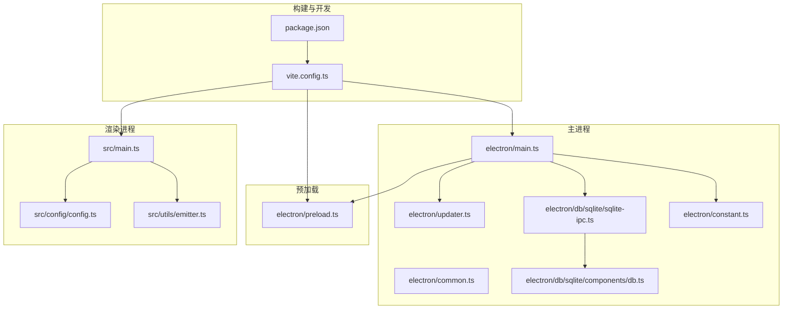
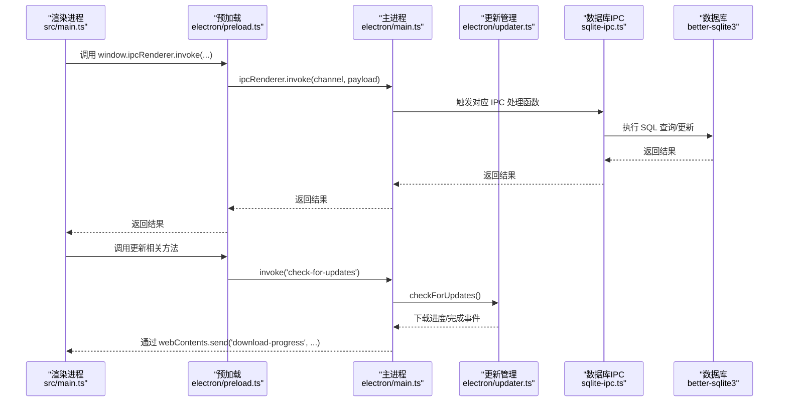
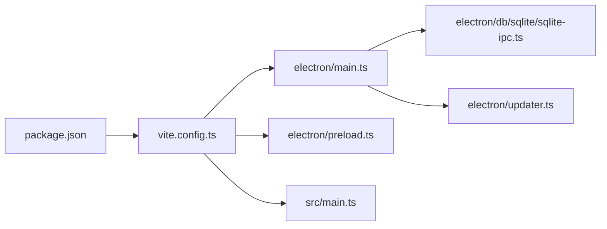

# 调试技巧

<cite>
**本文引用的文件**
- [electron/main.ts](file://electron/main.ts)
- [electron/preload.ts](file://electron/preload.ts)
- [vite.config.ts](file://vite.config.ts)
- [package.json](file://package.json)
- [electron/common.ts](file://electron/common.ts)
- [electron/db/sqlite/sqlite-ipc.ts](file://electron/db/sqlite/sqlite-ipc.ts)
- [electron/updater.ts](file://electron/updater.ts)
- [electron/constant.ts](file://electron/constant.ts)
- [src/main.ts](file://src/main.ts)
- [src/utils/emitter.ts](file://src/utils/emitter.ts)
- [src/config/config.ts](file://src/config/config.ts)
- [electron/db/sqlite/components/db.ts](file://electron/db/sqlite/components/db.ts)
</cite>

## 目录
1. [简介](#简介)
2. [项目结构](#项目结构)
3. [核心组件](#核心组件)
4. [架构总览](#架构总览)
5. [详细组件分析](#详细组件分析)
6. [依赖关系分析](#依赖关系分析)
7. [性能考量](#性能考量)
8. [故障排查指南](#故障排查指南)
9. [结论](#结论)
10. [附录](#附录)

## 简介
本指南聚焦于密码管理器项目的调试实践，覆盖 Electron 双进程调试（主进程与渲染进程）、Vite 开发服务器热重载调试、断点与变量监控、IPC 通信调试、数据库查询调试、加密算法调试、常见问题定位（内存泄漏、性能瓶颈、崩溃日志）、Chrome DevTools 与 Vue DevTools 的使用技巧，以及生产环境问题排查与日志收集方法。内容基于仓库现有实现进行提炼，确保可操作性与可追溯性。

## 项目结构
该项目采用 Electron + Vue 3 + Vite 的典型架构，主进程负责窗口、托盘、更新与数据库 IPC；渲染进程承载 UI 逻辑与状态管理；Vite 提供开发服务器与打包能力；better-sqlite3 作为本地数据库驱动。

图示来源
- [electron/main.ts:1-240](file://electron/main.ts#L1-L240)
- [electron/preload.ts:1-39](file://electron/preload.ts#L1-L39)
- [vite.config.ts:1-38](file://vite.config.ts#L1-L38)
- [package.json:1-51](file://package.json#L1-L51)
- [electron/common.ts:1-56](file://electron/common.ts#L1-L56)
- [electron/updater.ts:1-204](file://electron/updater.ts#L1-L204)
- [electron/db/sqlite/sqlite-ipc.ts:1-220](file://electron/db/sqlite/sqlite-ipc.ts#L1-L220)
- [electron/db/sqlite/components/db.ts:1-30](file://electron/db/sqlite/components/db.ts#L1-L30)
- [electron/constant.ts:1-63](file://electron/constant.ts#L1-L63)
- [src/main.ts:1-20](file://src/main.ts#L1-L20)
- [src/config/config.ts:1-143](file://src/config/config.ts#L1-L143)
- [src/utils/emitter.ts:1-16](file://src/utils/emitter.ts#L1-L16)

章节来源
- [vite.config.ts:1-38](file://vite.config.ts#L1-L38)
- [package.json:12-16](file://package.json#L12-L16)

## 核心组件
- 主进程入口与窗口生命周期：负责创建 BrowserWindow、加载开发或生产资源、托盘菜单、全局快捷键、更新管理与数据库初始化。
- 预加载脚本：通过 contextBridge 暴露受控 API 至渲染进程，统一封装 ipcRenderer 并提供更新相关便捷方法。
- 数据库 IPC：集中注册 SQLite 相关 IPC 处理函数，覆盖配置、分组、密码信息、快捷键与 OSS 等模块。
- 更新管理：基于 electron-updater 的自动更新流程，包含检查、下载、安装与进度事件广播。
- 加密与盐值：渲染侧使用 CryptoJS 实现 AES、MD5、SHA512 等算法，密钥与偏移量来自配置。
- 开发与构建：Vite 插件组合支持 Electron 主/预加载/渲染三段式开发与热重载。

章节来源
- [electron/main.ts:49-127](file://electron/main.ts#L49-L127)
- [electron/preload.ts:4-38](file://electron/preload.ts#L4-L38)
- [electron/db/sqlite/sqlite-ipc.ts:58-219](file://electron/db/sqlite/sqlite-ipc.ts#L58-L219)
- [electron/updater.ts:7-201](file://electron/updater.ts#L7-L201)
- [src/config/config.ts:14-25](file://src/config/config.ts#L14-L25)
- [vite.config.ts:18-35](file://vite.config.ts#L18-L35)

## 架构总览
下图展示主进程、预加载与渲染进程之间的交互，以及关键调试点（断点、日志、事件）：

图示来源
- [src/main.ts:14-19](file://src/main.ts#L14-L19)
- [electron/preload.ts:26-37](file://electron/preload.ts#L26-L37)
- [electron/main.ts:149-227](file://electron/main.ts#L149-L227)
- [electron/db/sqlite/sqlite-ipc.ts:58-219](file://electron/db/sqlite/sqlite-ipc.ts#L58-L219)
- [electron/updater.ts:38-97](file://electron/updater.ts#L38-L97)

## 详细组件分析

### 主进程调试要点
- 启动与窗口创建
  - 断点位置：应用就绪后创建窗口、托盘、SQLite 初始化与全局快捷键注册处。
  - 关键日志：窗口关闭、隐藏、激活与退出事件日志，便于验证生命周期行为。
- IPC 注册与处理
  - 断点位置：各 handle 回调入口，便于观察参数与返回值。
  - 日志策略：在每个 handle 内输出入参与处理结果，便于追踪数据流。
- 更新管理
  - 断点位置：检查更新、下载进度、更新完成回调，结合渲染侧事件监听验证 UI 更新。
- 开发工具
  - 可通过 IPC 触发打开 DevTools，便于在运行时调试渲染进程。

章节来源
- [electron/main.ts:49-127](file://electron/main.ts#L49-L127)
- [electron/main.ts:149-227](file://electron/main.ts#L149-L227)
- [electron/common.ts:52-56](file://electron/common.ts#L52-L56)
- [electron/updater.ts:38-97](file://electron/updater.ts#L38-L97)

### 预加载与渲染进程调试要点
- 预加载桥接
  - 断点位置：contextBridge 暴露的 on/off/send/invoke 包装函数，验证通道名与回调绑定。
  - 更新方法：检查 update.checkForUpdates/download/install/getCurrentVersion 的调用链。
- 渲染入口
  - 断点位置：应用挂载后的 nextTick 中监听主进程消息，验证 IPC 通路。
- Vue DevTools
  - 在开发模式下启用，结合组件树与状态面板定位状态变更与副作用。

章节来源
- [electron/preload.ts:4-38](file://electron/preload.ts#L4-L38)
- [src/main.ts:14-19](file://src/main.ts#L14-L19)

### Vite 开发服务器与热重载调试
- 开发脚本
  - 使用 dev 脚本启动 Vite 开发服务器，渲染进程通过主进程注入的开发服务器地址加载。
- 热重载
  - 修改 Vue 组件或 JS/CSS 文件后，Vite 将触发 HMR，渲染进程局部刷新。
- 断点与变量监控
  - 在渲染进程断点处查看作用域变量与调用栈；在主进程断点处查看上下文与 IPC 参数。
- 构建与入口
  - 主进程入口由 vite-plugin-electron 指定；预加载输入由插件配置；渲染端通过插件桥接。

章节来源
- [package.json:12-16](file://package.json#L12-L16)
- [vite.config.ts:18-35](file://vite.config.ts#L18-L35)
- [electron/main.ts:92-96](file://electron/main.ts#L92-L96)

### IPC 通信调试方法
- 通道命名与常量
  - 使用集中常量定义 IPC 通道名，避免拼写错误；在主进程 handle 与渲染进程 invoke/on 调用处交叉验证。
- 调试步骤
  - 在主进程 handle 入口打点，打印 channel 与参数；在渲染侧 on 监听处打印响应；必要时在预加载层加包装日志。
- 常见通道
  - 窗口控制、全局快捷键、自动启动、打开外部浏览器、数据库 CRUD、更新检查/下载/安装。

章节来源
- [electron/constant.ts:47-60](file://electron/constant.ts#L47-L60)
- [electron/main.ts:149-227](file://electron/main.ts#L149-L227)
- [electron/db/sqlite/sqlite-ipc.ts:58-219](file://electron/db/sqlite/sqlite-ipc.ts#L58-L219)

### 数据库查询调试
- 数据库连接
  - 使用 better-sqlite3，连接路径位于用户数据目录；构造函数支持 verbose 日志输出，便于观察 SQL 执行。
- 调试策略
  - 在 sqlite-ipc 处理函数入口打印 SQL 参数与返回值；在主进程 handle 层打印结果；必要时临时开启数据库 verbose。
- 常见问题
  - 跨线程事务一致性、异常回滚、大查询性能与索引缺失导致的慢查询。

章节来源
- [electron/db/sqlite/components/db.ts:16-23](file://electron/db/sqlite/components/db.ts#L16-L23)
- [electron/db/sqlite/sqlite-ipc.ts:58-219](file://electron/db/sqlite/sqlite-ipc.ts#L58-L219)

### 加密算法调试
- 算法与密钥
  - 使用 CryptoJS 实现 AES、MD5、SHA512；密钥与偏移量来自配置文件；默认盐值用于哈希增强。
- 调试要点
  - 在渲染侧断点处验证输入输出长度与格式；对称加解密需确保 Base64 编解码一致；哈希函数输入需包含盐值。
- 安全注意事项
  - 生产环境避免在日志中打印密钥与明文；仅在受限环境下开启详细日志。

章节来源
- [src/config/config.ts:14-25](file://src/config/config.ts#L14-L25)
- [src/hooks/useCrypto.ts:1-77](file://src/hooks/useCrypto.ts#L1-L77)

## 依赖关系分析
- 主进程依赖
  - Electron 核心 API、better-sqlite3、electron-updater、托盘菜单与全局快捷键。
- 渲染进程依赖
  - Vue 3、Pinia、Element Plus、mitt 事件总线。
- 构建依赖
  - Vite、vite-plugin-electron、vite-plugin-electron-renderer、@vitejs/plugin-vue。

图示来源
- [package.json:18-44](file://package.json#L18-L44)
- [vite.config.ts:10-35](file://vite.config.ts#L10-L35)
- [electron/main.ts:1-28](file://electron/main.ts#L1-L28)

章节来源
- [package.json:18-44](file://package.json#L18-L44)
- [vite.config.ts:10-35](file://vite.config.ts#L10-L35)

## 性能考量
- 渲染进程性能
  - 使用 Vue DevTools 分析组件渲染次数与响应时间；减少不必要的响应式数据与深层嵌套。
- 主进程性能
  - 避免在主进程做重型计算；将耗时任务迁移至预加载或子进程；合理使用 IPC，避免频繁同步调用。
- 数据库性能
  - 对高频查询建立索引；批量插入使用事务；避免在渲染进程直接发起长事务。
- 更新与网络
  - 控制更新检查频率；下载进度分片上报；失败重试与退避策略。

## 故障排查指南
- 内存泄漏检测
  - 使用 Chrome DevTools Memory 面板快照对比；关注未释放的 DOM、事件监听器与闭包；检查渲染进程组件卸载与事件清理。
- 性能瓶颈分析
  - 使用 Performance 面板录制渲染与主进程事件；定位长任务与主线程阻塞；结合 IPC 调用链分析跨进程开销。
- 崩溃日志分析
  - 主进程异常可通过 electron-updater 的 error 事件与日志捕获；渲染进程异常可在 DevTools Console 与 Application 面板查看堆栈。
- IPC 通信问题
  - 核对通道名一致性；在 handle 与 on 两端均打印参数；检查预加载桥接是否正确转发。
- 数据库问题
  - 开启 better-sqlite3 verbose 日志；在 sqlite-ipc 入口打印 SQL 与参数；检查连接生命周期与并发访问。
- 加密问题
  - 对比加解密输入输出长度与编码；核对密钥/偏移量一致性；避免在日志中泄露敏感信息。

章节来源
- [electron/updater.ts:38-43](file://electron/updater.ts#L38-L43)
- [electron/db/sqlite/components/db.ts:20-21](file://electron/db/sqlite/components/db.ts#L20-L21)
- [electron/db/sqlite/sqlite-ipc.ts:58-219](file://electron/db/sqlite/sqlite-ipc.ts#L58-L219)

## 结论
通过在主进程、预加载与渲染进程的关键节点设置断点与日志，结合 Vite 的热重载与 Electron 的 IPC 机制，能够高效定位与修复密码管理器中的各类问题。配合数据库 verbose 日志与加密算法的输入输出校验，可进一步提升调试精度。生产环境应重视日志脱敏与错误上报，确保问题可追踪且不影响用户体验。

## 附录
- 常用调试命令
  - 开发：npm run dev
  - 预览：npm run preview
  - 构建：npm run build
- 关键调试入口
  - 主进程入口：electron/main.ts
  - 预加载桥接：electron/preload.ts
  - 渲染入口：src/main.ts
  - 数据库 IPC：electron/db/sqlite/sqlite-ipc.ts
  - 更新管理：electron/updater.ts
  - 加密配置：src/config/config.ts
  - 数据库连接：electron/db/sqlite/components/db.ts
  - IPC 常量：electron/constant.ts
  - 构建配置：vite.config.ts
  - 依赖清单：package.json