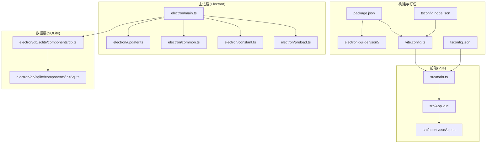
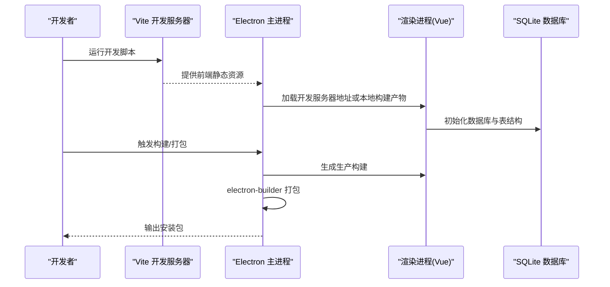
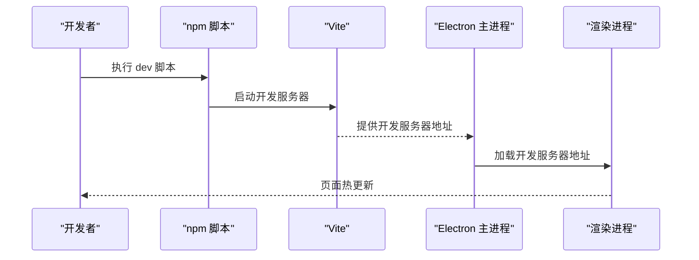
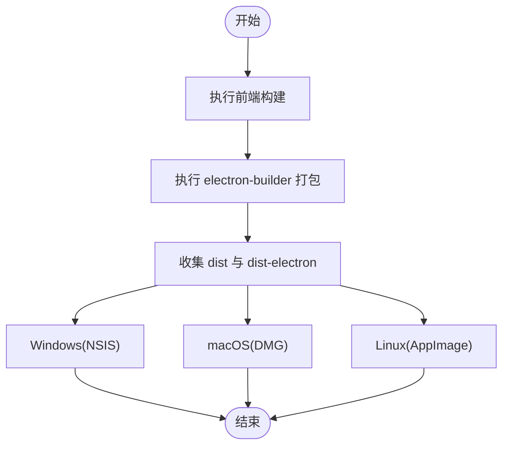
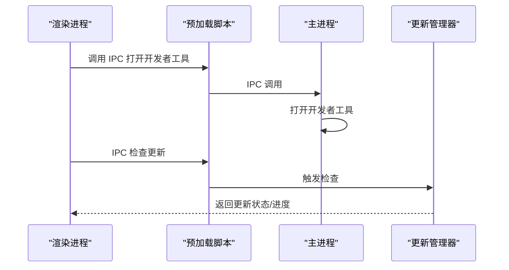
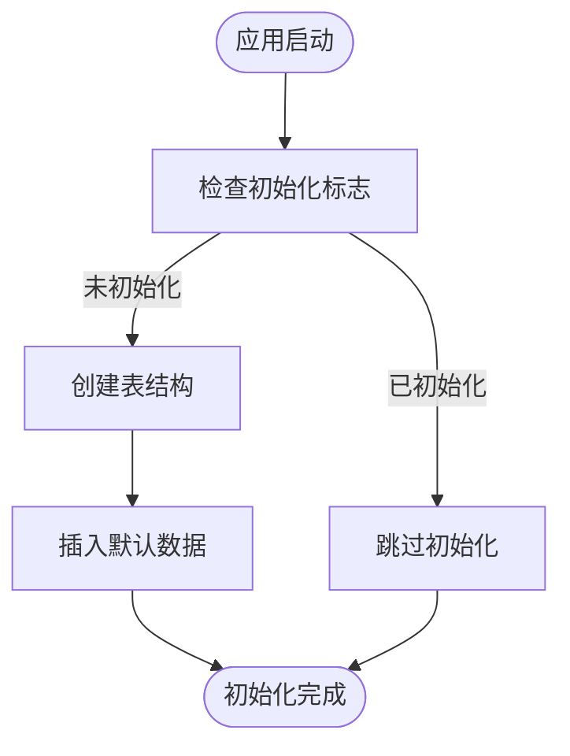
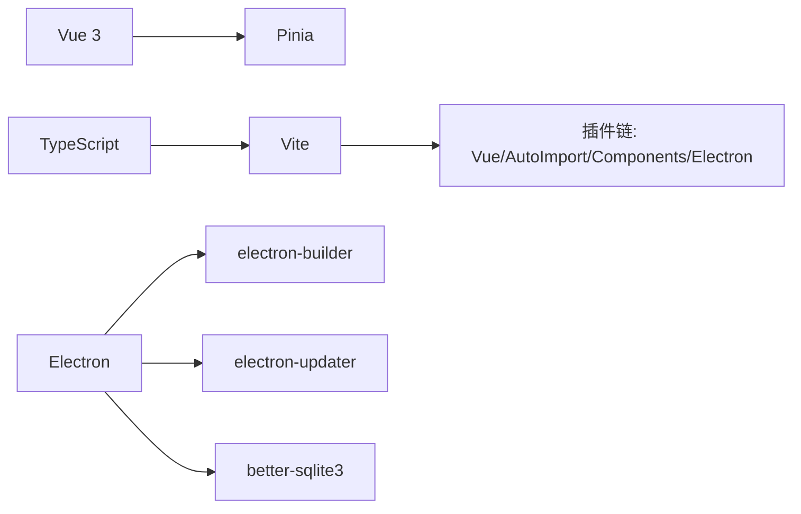

# 快速开始

<cite>
**本文引用的文件**
- [package.json](file://package.json)
- [vite.config.ts](file://vite.config.ts)
- [tsconfig.json](file://tsconfig.json)
- [tsconfig.node.json](file://tsconfig.node.json)
- [electron-builder.json5](file://electron-builder.json5)
- [electron/main.ts](file://electron/main.ts)
- [electron/preload.ts](file://electron/preload.ts)
- [electron/common.ts](file://electron/common.ts)
- [electron/constant.ts](file://electron/constant.ts)
- [electron/updater.ts](file://electron/updater.ts)
- [electron/db/sqlite/components/db.ts](file://electron/db/sqlite/components/db.ts)
- [electron/db/sqlite/components/initSql.ts](file://electron/db/sqlite/components/initSql.ts)
- [src/main.ts](file://src/main.ts)
- [src/App.vue](file://src/App.vue)
- [src/hooks/useApp.ts](file://src/hooks/useApp.ts)
</cite>

## 目录
1. [简介](#简介)
2. [项目结构](#项目结构)
3. [核心组件](#核心组件)
4. [架构总览](#架构总览)
5. [详细组件分析](#详细组件分析)
6. [依赖分析](#依赖分析)
7. [性能考虑](#性能考虑)
8. [故障排除指南](#故障排除指南)
9. [结论](#结论)
10. [附录](#附录)

## 简介
本指南面向新加入的开发者，帮助你在最短时间内完成环境准备、依赖安装、开发服务器启动、构建生产版本以及基础调试流程。项目采用 Vue 3 + TypeScript + Vite + Electron 的技术栈，并通过 electron-builder 进行打包发布。你将学会：
- 环境与工具要求（Node.js、包管理器、操作系统）
- 依赖安装与初始化
- 开发环境运行与热更新
- 生产构建与安装包生成
- 基础调试与常见问题排查

## 项目结构
项目采用“前端（Vue）+ 主进程（Electron）+ 数据层（SQLite）”的分层组织方式：
- 前端：Vue 应用位于 src 目录，入口为 src/main.ts，根组件为 src/App.vue
- 主进程：Electron 主进程入口为 electron/main.ts，预加载脚本为 electron/preload.ts
- 构建与打包：Vite 配置在 vite.config.ts；打包配置在 electron-builder.json5
- 数据存储：基于 better-sqlite3，数据库文件位于用户数据目录，初始化逻辑在 electron/db/sqlite/components/initSql.ts 中

图表来源
- [src/main.ts:1-20](file://src/main.ts#L1-L20)
- [src/App.vue:1-19](file://src/App.vue#L1-L19)
- [src/hooks/useApp.ts:1-71](file://src/hooks/useApp.ts#L1-L71)
- [electron/main.ts:1-240](file://electron/main.ts#L1-L240)
- [electron/preload.ts:1-39](file://electron/preload.ts#L1-L39)
- [electron/common.ts:1-56](file://electron/common.ts#L1-L56)
- [electron/constant.ts:1-63](file://electron/constant.ts#L1-L63)
- [electron/updater.ts:1-204](file://electron/updater.ts#L1-L204)
- [electron/db/sqlite/components/db.ts:1-30](file://electron/db/sqlite/components/db.ts#L1-L30)
- [electron/db/sqlite/components/initSql.ts:1-224](file://electron/db/sqlite/components/initSql.ts#L1-L224)
- [vite.config.ts:1-38](file://vite.config.ts#L1-L38)
- [package.json:1-51](file://package.json#L1-L51)
- [electron-builder.json5:1-52](file://electron-builder.json5#L1-L52)
- [tsconfig.json:1-37](file://tsconfig.json#L1-L37)
- [tsconfig.node.json:1-14](file://tsconfig.node.json#L1-L14)

章节来源
- [package.json:12-16](file://package.json#L12-L16)
- [vite.config.ts:1-38](file://vite.config.ts#L1-L38)
- [electron/main.ts:49-116](file://electron/main.ts#L49-L116)
- [electron/db/sqlite/components/db.ts:10-23](file://electron/db/sqlite/components/db.ts#L10-L23)

## 核心组件
- 包管理与脚本
  - 使用 npm 作为包管理器（由 package.json 中的 scripts 字段定义），支持 dev、build、preview、postinstall 等脚本
- 构建与打包
  - Vite 作为前端构建工具，配合 vite-plugin-electron 插件实现主进程与渲染进程一体化开发
  - electron-builder 负责多平台打包（Windows、macOS、Linux），并配置安装包目标与产物命名
- 数据存储
  - better-sqlite3 提供本地数据库能力，数据库文件位于用户数据目录，首次运行自动初始化表结构与默认数据
- 更新机制
  - electron-updater 集成通用更新源，支持手动检查、下载与安装更新，并可配置自动检查与跳版本策略

章节来源
- [package.json:12-16](file://package.json#L12-L16)
- [vite.config.ts:18-35](file://vite.config.ts#L18-L35)
- [electron-builder.json5:1-52](file://electron-builder.json5#L1-L52)
- [electron/db/sqlite/components/db.ts:10-23](file://electron/db/sqlite/components/db.ts#L10-L23)
- [electron/updater.ts:19-36](file://electron/updater.ts#L19-L36)

## 架构总览
下图展示了从开发到生产的整体流程：Vite 启动前端开发服务器，Electron 主进程加载前端资源或本地构建产物；数据库在首次运行时初始化；打包阶段由 electron-builder 收集 dist 与 dist-electron 并生成安装包。

图表来源
- [package.json:12-16](file://package.json#L12-L16)
- [vite.config.ts:31-35](file://vite.config.ts#L31-L35)
- [electron/main.ts:92-96](file://electron/main.ts#L92-L96)
- [electron/db/sqlite/components/initSql.ts:26-46](file://electron/db/sqlite/components/initSql.ts#L26-L46)
- [electron-builder.json5:7-13](file://electron-builder.json5#L7-L13)

## 详细组件分析

### 环境与工具要求
- Node.js 版本
  - 推荐使用长期支持版本（LTS），确保与项目依赖兼容
- 包管理器
  - 使用 npm（package-lock.json 已存在），避免与 yarn/pnpm 混用导致锁文件冲突
- 开发工具
  - VS Code（推荐），TypeScript 与 Vue 插件增强开发体验
  - Git（版本控制）

章节来源
- [package.json:18-44](file://package.json#L18-L44)
- [tsconfig.json:2-24](file://tsconfig.json#L2-L24)

### 依赖安装与初始化
- 安装依赖
  - 在仓库根目录执行安装命令，自动触发 postinstall 钩子以安装 Electron 应用依赖
- 初始化数据库
  - 首次运行时，主进程会调用初始化逻辑创建表结构并插入默认数据

章节来源
- [package.json:16](file://package.json#L16)
- [electron/main.ts:53-54](file://electron/main.ts#L53-L54)
- [electron/db/sqlite/components/initSql.ts:26-46](file://electron/db/sqlite/components/initSql.ts#L26-L46)

### 开发服务器启动
- 启动开发环境
  - 执行开发脚本后，Vite 启动开发服务器，Electron 主进程加载该地址
  - 若未指定开发服务器地址，主进程将加载本地构建产物
- 热更新与预加载
  - vite-plugin-electron 提供对主进程与预加载脚本的热更新支持

图表来源
- [package.json:12-13](file://package.json#L12-L13)
- [vite.config.ts:31-35](file://vite.config.ts#L31-L35)
- [electron/main.ts:92-96](file://electron/main.ts#L92-L96)

章节来源
- [package.json:12-13](file://package.json#L12-L13)
- [vite.config.ts:18-35](file://vite.config.ts#L18-L35)
- [electron/main.ts:92-96](file://electron/main.ts#L92-L96)

### 构建生产版本与打包
- 构建流程
  - 先执行前端构建，再调用 electron-builder 进行打包
- 打包配置
  - 输出目录与文件包含 dist 与 dist-electron
  - Windows 使用 NSIS 安装包，macOS 使用 DMG，Linux 使用 AppImage
  - 可配置图标路径与产物命名规则

图表来源
- [package.json:14](file://package.json#L14)
- [electron-builder.json5:7-13](file://electron-builder.json5#L7-L13)
- [electron-builder.json5:21-46](file://electron-builder.json5#L21-L46)

章节来源
- [package.json:14](file://package.json#L14)
- [electron-builder.json5:1-52](file://electron-builder.json5#L1-L52)

### 基础调试操作
- 打开开发者工具
  - 通过 IPC 调用打开主进程窗口的开发者工具，便于调试渲染进程与主进程交互
- 日志与状态
  - 主进程与数据库初始化过程均输出日志，可通过控制台查看
- 自动更新调试
  - 可通过 IPC 触发检查更新流程，观察更新事件与进度回调

图表来源
- [electron/preload.ts:25-37](file://electron/preload.ts#L25-L37)
- [electron/common.ts:52-56](file://electron/common.ts#L52-L56)
- [electron/main.ts:167-171](file://electron/main.ts#L167-L171)
- [electron/updater.ts:159-175](file://electron/updater.ts#L159-L175)

章节来源
- [electron/preload.ts:1-39](file://electron/preload.ts#L1-L39)
- [electron/common.ts:52-56](file://electron/common.ts#L52-L56)
- [electron/main.ts:167-171](file://electron/main.ts#L167-L171)
- [electron/updater.ts:159-175](file://electron/updater.ts#L159-L175)

### 数据库初始化与使用
- 数据库位置
  - 数据库存储于用户数据目录下的本地文件
- 初始化流程
  - 首次运行创建必要表与默认配置、快捷键、分组、默认密码条目与 OSS 配置
- 访问方式
  - 通过主进程封装的 SQLiteIPC 与数据库访问接口进行增删改查

图表来源
- [electron/db/sqlite/components/initSql.ts:26-46](file://electron/db/sqlite/components/initSql.ts#L26-L46)
- [electron/db/sqlite/components/initSql.ts:131-143](file://electron/db/sqlite/components/initSql.ts#L131-L143)
- [electron/db/sqlite/components/db.ts:10-23](file://electron/db/sqlite/components/db.ts#L10-L23)

章节来源
- [electron/db/sqlite/components/db.ts:10-23](file://electron/db/sqlite/components/db.ts#L10-L23)
- [electron/db/sqlite/components/initSql.ts:26-46](file://electron/db/sqlite/components/initSql.ts#L26-L46)

## 依赖分析
- 前端与构建
  - Vue 3、TypeScript、Vite、Element Plus、Pinia 等构成前端生态
  - Vite 插件链路包含 Vue、AutoImport、Components 与 Electron 插件
- 主进程与打包
  - Electron 作为宿主，electron-builder 负责跨平台打包
- 数据与更新
  - better-sqlite3 提供本地数据库，electron-updater 提供更新能力

图表来源
- [package.json:18-29](file://package.json#L18-L29)
- [package.json:30-44](file://package.json#L30-L44)
- [vite.config.ts:10-35](file://vite.config.ts#L10-L35)

章节来源
- [package.json:18-44](file://package.json#L18-L44)
- [vite.config.ts:10-35](file://vite.config.ts#L10-L35)

## 性能考虑
- 构建优化
  - 使用 asar 打包提升加载效率
  - 合理拆分依赖，避免一次性加载过多模块
- 数据访问
  - SQLite 查询尽量使用索引字段，避免全表扫描
- 更新策略
  - 控制自动检查频率，减少网络与磁盘 IO

## 故障排除指南
- 安装依赖失败
  - 清理缓存并重装：删除 node_modules 与 package-lock.json 后重新安装
  - 确认网络与镜像源稳定
- 开发服务器无法加载
  - 检查 Vite 是否正确启动，确认开发服务器地址是否可达
  - 若使用代理，请确保代理不影响本地回环地址
- 打包失败
  - 确认 dist 与 dist-electron 是否存在
  - 检查 electron-builder 配置中的图标路径与目标平台
- 数据库初始化异常
  - 删除用户数据目录下的数据库文件后重启应用，触发重新初始化
- 自动更新问题
  - 检查更新源地址与网络连通性
  - 如需跳过某版本，可在设置中配置跳过版本

章节来源
- [electron-builder.json5:7-13](file://electron-builder.json5#L7-L13)
- [electron/db/sqlite/components/db.ts:25-30](file://electron/db/sqlite/components/db.ts#L25-L30)
- [electron/updater.ts:27-30](file://electron/updater.ts#L27-L30)

## 结论
通过本指南，你可以快速完成环境准备、安装依赖、启动开发服务器、构建生产版本并进行基础调试。建议在开发过程中关注数据库初始化与更新机制，合理配置打包选项以适配不同平台。遇到问题时，优先检查日志输出与网络连通性，按需清理缓存与数据库文件后重试。

## 附录
- 常用命令
  - 安装依赖：npm install
  - 启动开发：npm run dev
  - 预览构建：npm run preview
  - 构建打包：npm run build
- 关键配置文件
  - 构建：vite.config.ts、tsconfig.json、tsconfig.node.json
  - 打包：electron-builder.json5
  - 主进程：electron/main.ts、electron/preload.ts、electron/common.ts、electron/constant.ts、electron/updater.ts
  - 数据库：electron/db/sqlite/components/db.ts、electron/db/sqlite/components/initSql.ts
  - 前端入口：src/main.ts、src/App.vue、src/hooks/useApp.ts