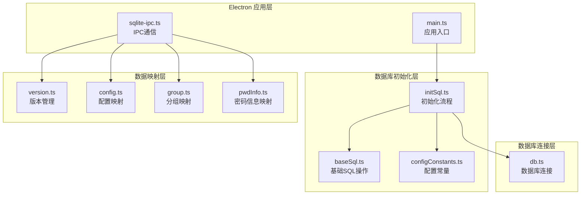
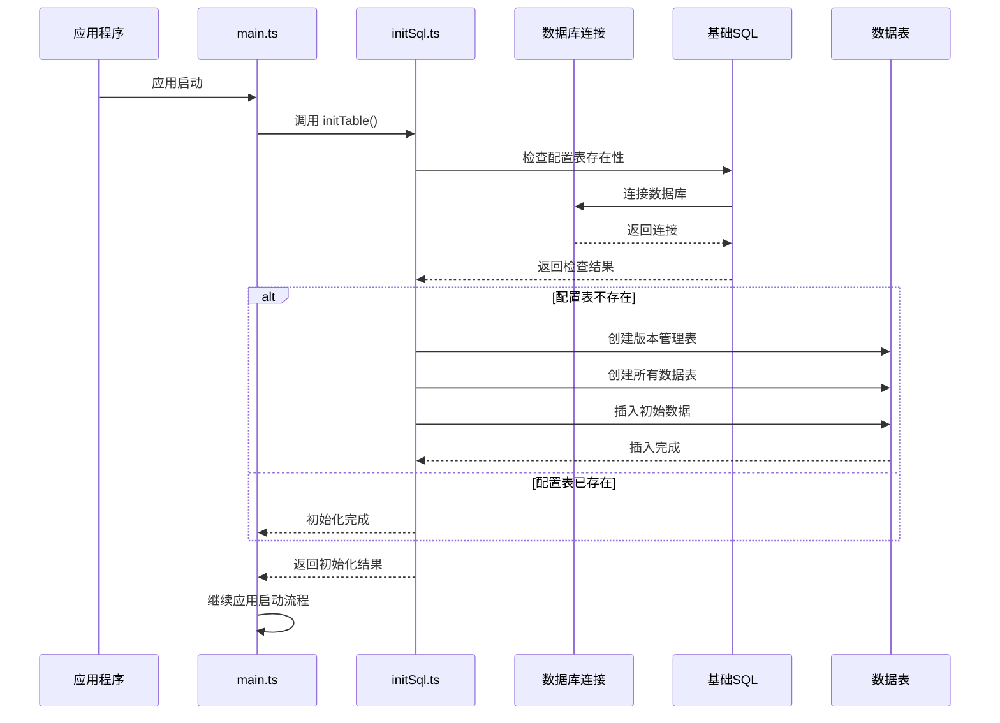
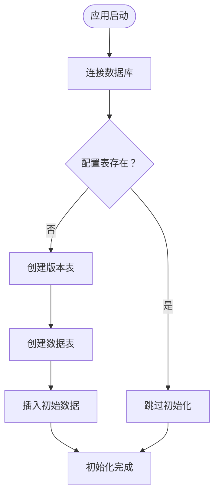
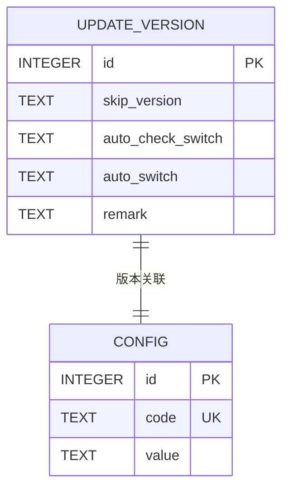
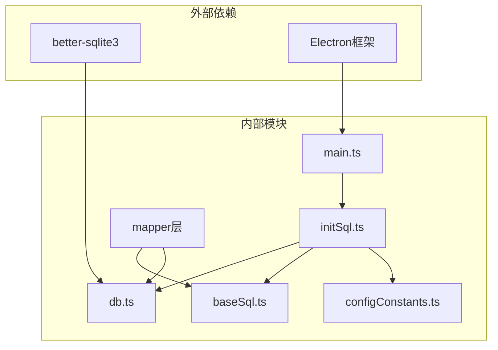

# 数据库初始化

<cite>
**本文档引用的文件**
- [initSql.ts](file://electron/db/sqlite/components/initSql.ts)
- [db.ts](file://electron/db/sqlite/components/db.ts)
- [baseSql.ts](file://electron/db/sqlite/components/baseSql.ts)
- [configConstants.ts](file://electron/db/sqlite/components/configConstants.ts)
- [main.ts](file://electron/main.ts)
- [version.ts](file://electron/db/sqlite/mapper/version.ts)
- [config.ts](file://electron/db/sqlite/mapper/config.ts)
- [group.ts](file://electron/db/sqlite/mapper/group.ts)
- [pwdInfo.ts](file://electron/db/sqlite/mapper/pwdInfo.ts)
- [sqlite-ipc.ts](file://electron/db/sqlite/sqlite-ipc.ts)
- [common.ts](file://electron/common.ts)
</cite>

## 目录
1. [简介](#简介)
2. [项目结构](#项目结构)
3. [核心组件](#核心组件)
4. [架构概览](#架构概览)
5. [详细组件分析](#详细组件分析)
6. [依赖关系分析](#依赖关系分析)
7. [性能考虑](#性能考虑)
8. [故障排除指南](#故障排除指南)
9. [结论](#结论)

## 简介

本文档详细描述了密码管理器应用的数据库初始化流程。该系统使用Electron框架和SQLite数据库，实现了完整的数据库启动时初始化过程，包括表结构创建、初始数据插入和配置验证。文档重点解释了initSql中的SQL语句执行顺序和依赖关系，记录了数据库版本管理机制和迁移策略，以及初始化失败的处理方式和恢复机制。

## 项目结构

密码管理器的数据库初始化系统采用模块化设计，主要包含以下关键组件：

**图表来源**
- [main.ts:49-58](file://electron/main.ts#L49-L58)
- [initSql.ts:26-46](file://electron/db/sqlite/components/initSql.ts#L26-L46)
- [db.ts:16-23](file://electron/db/sqlite/components/db.ts#L16-L23)

**章节来源**
- [main.ts:1-240](file://electron/main.ts#L1-L240)
- [initSql.ts:1-224](file://electron/db/sqlite/components/initSql.ts#L1-L224)

## 核心组件

### 数据库连接管理

数据库连接通过`db.ts`文件实现，使用better-sqlite3库创建持久化的SQLite连接：

- **数据库路径**: 用户数据目录下的`myDatabase.db`文件
- **连接复用**: 单例模式确保数据库连接的高效复用
- **日志输出**: 启用verbose模式输出所有SQL操作的日志

### 初始化流程控制

`initSql.ts`文件定义了完整的初始化流程，包括：

- **表结构验证**: 检查配置表是否存在决定初始化状态
- **版本表管理**: 确保版本管理表的存在
- **表创建**: 一次性创建所有必需的数据表
- **数据插入**: 批量插入初始配置数据

### 基础SQL操作

`baseSql.ts`提供了统一的数据库操作接口：

- **查询操作**: 支持列表查询和单条记录查询
- **插入操作**: 返回最后插入的行ID
- **更新操作**: 返回操作结果状态
- **错误处理**: 统一的异常捕获和日志记录

**章节来源**
- [db.ts:1-30](file://electron/db/sqlite/components/db.ts#L1-L30)
- [initSql.ts:26-46](file://electron/db/sqlite/components/initSql.ts#L26-L46)
- [baseSql.ts:9-81](file://electron/db/sqlite/components/baseSql.ts#L9-L81)

## 架构概览

数据库初始化系统遵循分层架构设计，确保职责分离和代码可维护性：

**图表来源**
- [main.ts:49-58](file://electron/main.ts#L49-L58)
- [initSql.ts:26-46](file://electron/db/sqlite/components/initSql.ts#L26-L46)
- [baseSql.ts:83-87](file://electron/db/sqlite/components/baseSql.ts#L83-L87)

## 详细组件分析

### 初始化流程详解

#### 执行顺序和依赖关系

数据库初始化严格按照以下顺序执行：

1. **数据库连接建立** (`getDB()`)
2. **配置表存在性检查** (`initFlag()`)
3. **版本表创建** (`createVersionTable()`)
4. **表结构创建** (`createTable()`)
5. **初始数据插入** (`insertData()`)

**图表来源**
- [initSql.ts:26-46](file://electron/db/sqlite/components/initSql.ts#L26-L46)
- [baseSql.ts:83-87](file://electron/db/sqlite/components/baseSql.ts#L83-L87)

#### 表结构设计

系统创建以下核心数据表：

| 表名 | 主要字段 | 约束 | 用途 |
|------|----------|------|------|
| `group` | id, title, father_id | 主键自增 | 存储密码分组信息 |
| `pwd_info` | id, group_id, title, username, password, link, remark | 主键自增 | 存储密码信息 |
| `config` | id, code, value | 唯一约束(code) | 存储应用配置项 |
| `shortcut_key` | id, action_name, desc | 主键自增 | 存储快捷键配置 |
| `oss` | id, type, region, keyId, key_secret, bucket | 主键自增 | 存储云存储配置 |
| `update_version` | id, skip_version, auto_check_switch, auto_switch, remark | 主键自增 | 存储版本管理信息 |

#### 初始数据插入策略

系统按以下顺序插入初始数据：

1. **配置数据** (`insertConfigData()`)
   - 自动启动设置
   - 默认密码设置
   - 首次登录标记
   - 主题切换设置
   - 自动锁定时间设置

2. **快捷键数据** (`insertShortcutKeyData()`)
   - 主窗口打开快捷键
   - 登出快捷键
   - 复制用户名快捷键
   - 复制密码快捷键
   - 其他功能快捷键

3. **分组数据** (`insertGroupData()`)
   - 默认分组记录

4. **密码信息数据** (`insertPwdInfoData()`)
   - 示例密码记录

5. **云存储数据** (`insertOssData()`)
   - OSS和COS服务配置

6. **版本管理数据** (`insertUpdateVersion()`)
   - 版本跳过设置
   - 自动检查开关

**章节来源**
- [initSql.ts:48-105](file://electron/db/sqlite/components/initSql.ts#L48-L105)
- [initSql.ts:131-143](file://electron/db/sqlite/components/initSql.ts#L131-L143)
- [initSql.ts:164-183](file://electron/db/sqlite/components/initSql.ts#L164-L183)

### 版本管理机制

#### 版本表结构

版本管理系统通过`update_version`表实现：

**图表来源**
- [initSql.ts:117-126](file://electron/db/sqlite/components/initSql.ts#L117-L126)
- [version.ts:9-19](file://electron/db/sqlite/mapper/version.ts#L9-L19)

#### 迁移策略

版本管理支持以下迁移操作：

1. **版本跳过**: 允许用户跳过特定版本的更新
2. **自动检查**: 控制是否自动检查新版本
3. **自动更新**: 控制是否自动下载和安装更新

**章节来源**
- [version.ts:1-38](file://electron/db/sqlite/mapper/version.ts#L1-L38)
- [initSql.ts:144-150](file://electron/db/sqlite/components/initSql.ts#L144-L150)

### 错误处理和恢复机制

#### 异常处理策略

系统采用多层次的错误处理机制：

1. **连接级异常**: 数据库连接失败时返回null
2. **操作级异常**: SQL执行失败时记录错误日志
3. **初始化级异常**: 整个初始化过程失败时终止应用启动

#### 恢复机制

- **数据库重连**: 连接断开后自动重新连接
- **事务回滚**: 支持事务的原子性操作
- **状态检查**: 初始化前检查数据库状态避免重复初始化

**章节来源**
- [baseSql.ts:12-19](file://electron/db/sqlite/components/baseSql.ts#L12-L19)
- [baseSql.ts:44-47](file://electron/db/sqlite/components/baseSql.ts#L44-L47)
- [initSql.ts:140-142](file://electron/db/sqlite/components/initSql.ts#L140-L142)

## 依赖关系分析

### 组件间依赖关系

**图表来源**
- [main.ts:23-25](file://electron/main.ts#L23-L25)
- [initSql.ts:2-21](file://electron/db/sqlite/components/initSql.ts#L2-L21)
- [db.ts:7](file://electron/db/sqlite/components/db.ts#L7)

### 数据流分析

初始化过程的数据流向：

1. **启动阶段**: main.ts触发初始化流程
2. **检查阶段**: baseSql.ts执行存在性检查
3. **创建阶段**: initSql.ts执行DDL语句
4. **填充阶段**: initSql.ts执行DML语句
5. **验证阶段**: 基础SQL操作验证数据完整性

**章节来源**
- [main.ts:49-58](file://electron/main.ts#L49-L58)
- [baseSql.ts:83-87](file://electron/db/sqlite/components/baseSql.ts#L83-L87)
- [initSql.ts:26-46](file://electron/db/sqlite/components/initSql.ts#L26-L46)

## 性能考虑

### 初始化性能优化

1. **批量操作**: 使用单个INSERT语句插入多个配置项
2. **连接复用**: 单例模式避免重复创建数据库连接
3. **异步处理**: 所有数据库操作采用异步模式
4. **索引策略**: 核心查询字段建立适当索引

### 内存管理

- **连接生命周期**: 应用关闭时释放数据库连接
- **事务管理**: 长事务自动提交避免内存泄漏
- **错误清理**: 异常发生时自动清理资源

## 故障排除指南

### 常见问题及解决方案

#### 数据库连接失败

**症状**: 应用启动时报数据库连接错误

**可能原因**:
- 数据库文件权限不足
- 用户数据目录不可访问
- better-sqlite3库缺失

**解决步骤**:
1. 检查用户数据目录权限
2. 验证数据库文件存在性
3. 重新安装better-sqlite3依赖

#### 初始化重复执行

**症状**: 应用启动时重复创建表结构

**可能原因**:
- 配置表检查逻辑失效
- 数据库连接状态异常

**解决步骤**:
1. 检查initFlag函数执行结果
2. 验证数据库连接状态
3. 清理临时文件后重启应用

#### 数据插入失败

**症状**: 部分或全部初始数据未插入

**可能原因**:
- SQL语法错误
- 字段类型不匹配
- 唯一约束冲突

**解决步骤**:
1. 查看控制台错误日志
2. 验证SQL语句正确性
3. 检查字段数据类型

### 调试工具和方法

#### 日志分析

系统提供详细的日志输出：
- 数据库连接信息
- SQL执行状态
- 错误发生位置

#### 数据验证

通过以下方式验证数据库状态：
1. 查询表结构完整性
2. 检查关键记录存在性
3. 验证数据一致性

**章节来源**
- [baseSql.ts:16-19](file://electron/db/sqlite/components/baseSql.ts#L16-L19)
- [initSql.ts:140-142](file://electron/db/sqlite/components/initSql.ts#L140-L142)

## 结论

密码管理器的数据库初始化系统通过模块化设计实现了可靠的数据库启动流程。系统具备以下特点：

1. **完整性**: 覆盖所有必要的初始化步骤
2. **可靠性**: 完善的错误处理和恢复机制
3. **可维护性**: 清晰的代码结构和职责分离
4. **可扩展性**: 支持未来的版本管理和迁移需求

该系统为密码管理器提供了稳定的数据存储基础，确保用户数据的安全性和应用的可靠性。通过合理的架构设计和完善的错误处理机制，系统能够在各种异常情况下保持稳定运行。