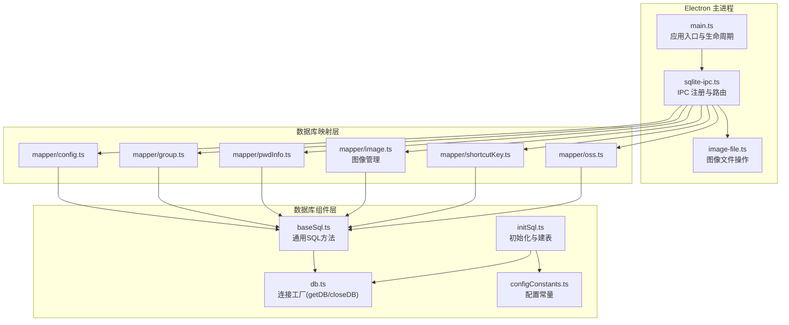
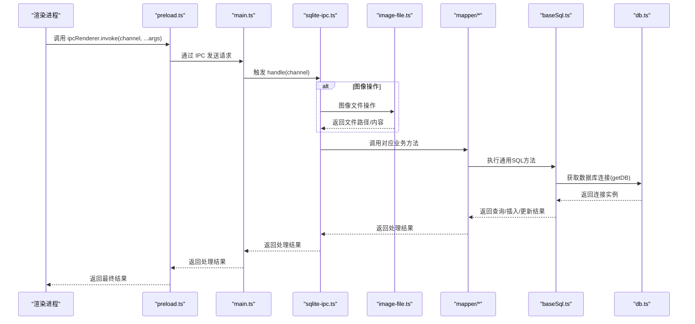
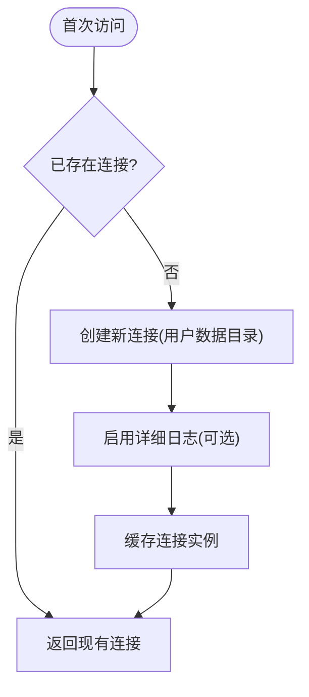
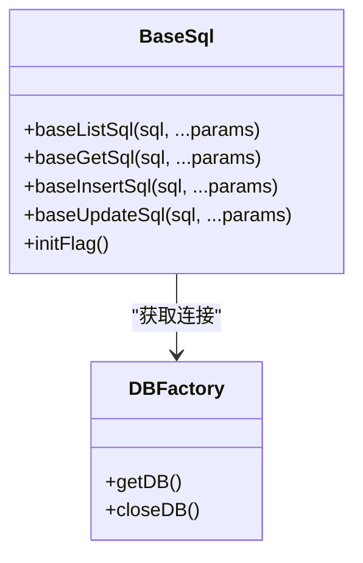
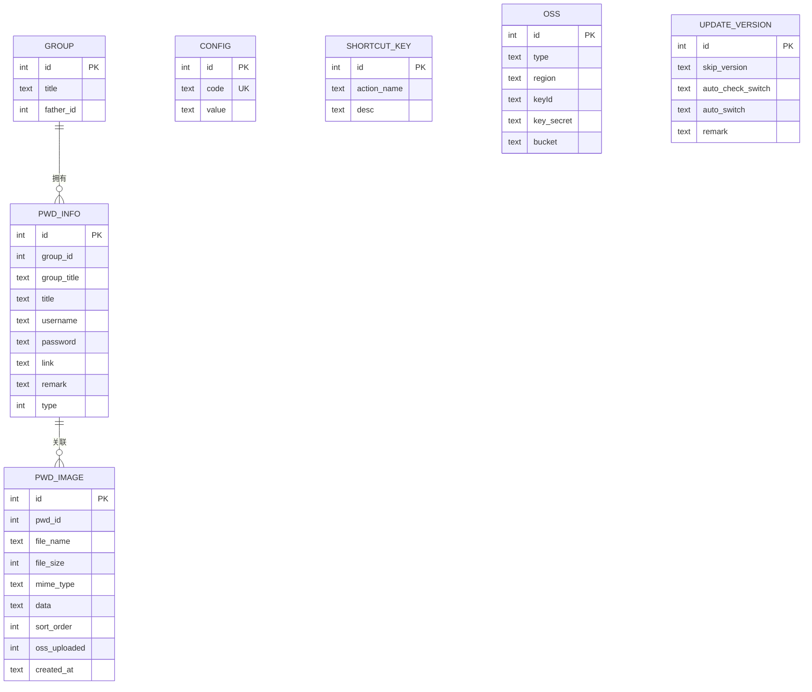
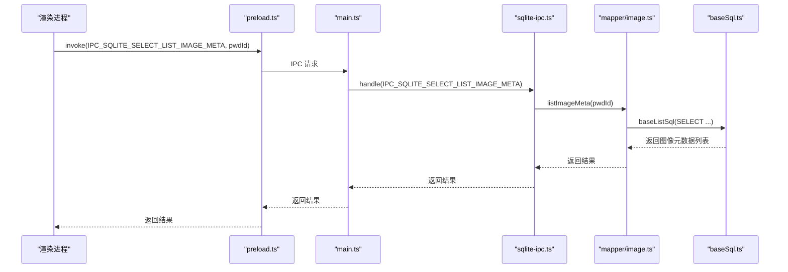
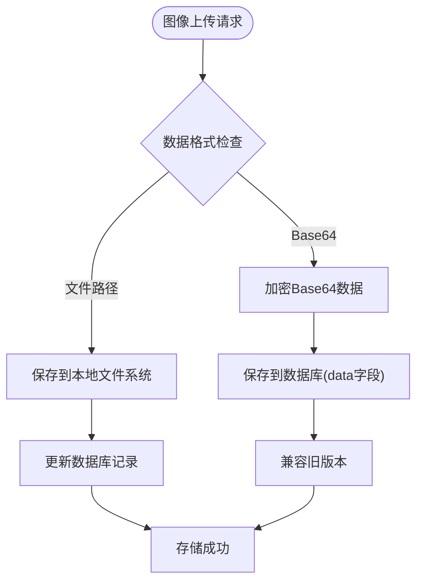
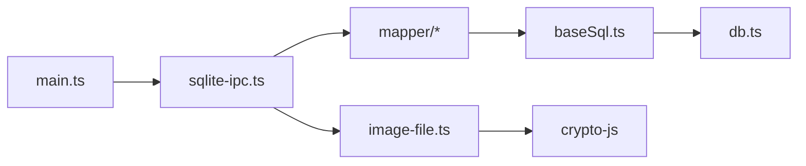
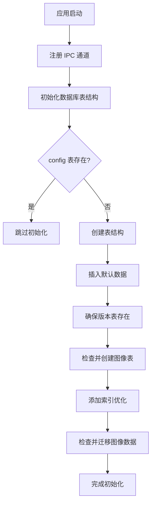

# 数据库架构设计

<cite>
**本文引用的文件**
- [electron/db/sqlite/components/baseSql.ts](file://electron/db/sqlite/components/baseSql.ts)
- [electron/db/sqlite/components/db.ts](file://electron/db/sqlite/components/db.ts)
- [electron/db/sqlite/components/initSql.ts](file://electron/db/sqlite/components/initSql.ts)
- [electron/db/sqlite/components/configConstants.ts](file://electron/db/sqlite/components/configConstants.ts)
- [electron/db/sqlite/sqlite-ipc.ts](file://electron/db/sqlite/sqlite-ipc.ts)
- [electron/db/sqlite/mapper/config.ts](file://electron/db/sqlite/mapper/config.ts)
- [electron/db/sqlite/mapper/group.ts](file://electron/db/sqlite/mapper/group.ts)
- [electron/db/sqlite/mapper/pwdInfo.ts](file://electron/db/sqlite/mapper/pwdInfo.ts)
- [electron/db/sqlite/mapper/shortcutKey.ts](file://electron/db/sqlite/mapper/shortcutKey.ts)
- [electron/db/sqlite/mapper/oss.ts](file://electron/db/sqlite/mapper/oss.ts)
- [electron/db/sqlite/mapper/image.ts](file://electron/db/sqlite/mapper/image.ts)
- [electron/constant.ts](file://electron/constant.ts)
- [electron/main.ts](file://electron/main.ts)
- [electron/preload.ts](file://electron/preload.ts)
- [electron/image-file.ts](file://electron/image-file.ts)
- [src/hooks/useDBImage.ts](file://src/hooks/useDBImage.ts)
</cite>

## 更新摘要
**变更内容**
- 新增图像表结构（pwd_image）及其完整的CRUD操作支持
- 添加图像文件存储与加密机制，支持本地文件系统存储
- 扩展IPC通道以支持图像数据的完整生命周期管理
- 增强数据库初始化流程，包含图像表的创建与迁移逻辑
- 新增图像数据的OSS同步支持与状态管理

## 目录
1. [简介](#简介)
2. [项目结构](#项目结构)
3. [核心组件](#核心组件)
4. [架构总览](#架构总览)
5. [详细组件分析](#详细组件分析)
6. [图像数据管理架构](#图像数据管理架构)
7. [依赖分析](#依赖分析)
8. [性能考虑](#性能考虑)
9. [故障排查指南](#故障排查指南)
10. [结论](#结论)
11. [附录](#附录)

## 简介
本文件系统性阐述基于 Electron 的桌面应用中 SQLite 数据库的整体架构与实现细节，重点覆盖以下方面：
- 数据库连接管理与生命周期
- 事务处理策略与错误处理机制
- BaseSql 基类设计理念与通用 SQL 操作方法（baseListSql、baseGetSql、baseInsertSql、baseUpdateSql）
- better-sqlite3 库的集成方式与最佳实践
- 数据库初始化流程、表结构与默认数据
- 组件交互关系与 IPC 接口映射
- **新增**：图像数据的完整存储与管理系统，包括本地文件存储、加密机制和OSS同步支持

## 项目结构
数据库相关代码主要位于 electron/db/sqlite 目录下，采用"组件层 + 映射层 + IPC 层"的分层组织方式：
- 组件层：封装底层连接、基础 SQL 方法与初始化逻辑
- 映射层：面向业务的 CRUD 封装，调用组件层基础方法
- IPC 层：将数据库操作暴露为 IPC 通道，供渲染进程调用

**图表来源**
- [electron/main.ts:1-240](file://electron/main.ts#L1-L240)
- [electron/db/sqlite/sqlite-ipc.ts:1-311](file://electron/db/sqlite/sqlite-ipc.ts#L1-L311)
- [electron/db/sqlite/components/db.ts:1-30](file://electron/db/sqlite/components/db.ts#L1-L30)
- [electron/db/sqlite/components/baseSql.ts:1-87](file://electron/db/sqlite/components/baseSql.ts#L1-L87)
- [electron/db/sqlite/components/initSql.ts:1-346](file://electron/db/sqlite/components/initSql.ts#L1-L346)
- [electron/db/sqlite/components/configConstants.ts:1-29](file://electron/db/sqlite/components/configConstants.ts#L1-L29)
- [electron/db/sqlite/mapper/config.ts:1-27](file://electron/db/sqlite/mapper/config.ts#L1-L27)
- [electron/db/sqlite/mapper/group.ts:1-49](file://electron/db/sqlite/mapper/group.ts#L1-L49)
- [electron/db/sqlite/mapper/pwdInfo.ts:1-101](file://electron/db/sqlite/mapper/pwdInfo.ts#L1-L101)
- [electron/db/sqlite/mapper/image.ts:1-82](file://electron/db/sqlite/mapper/image.ts#L1-L82)
- [electron/db/sqlite/mapper/shortcutKey.ts:1-32](file://electron/db/sqlite/mapper/shortcutKey.ts#L1-L32)
- [electron/db/sqlite/mapper/oss.ts:1-30](file://electron/db/sqlite/mapper/oss.ts#L1-L30)
- [electron/image-file.ts:1-222](file://electron/image-file.ts#L1-L222)

**章节来源**
- [electron/main.ts:1-240](file://electron/main.ts#L1-L240)
- [electron/db/sqlite/sqlite-ipc.ts:1-311](file://electron/db/sqlite/sqlite-ipc.ts#L1-L311)

## 核心组件
- 连接工厂与生命周期
  - 连接工厂负责在首次使用时创建数据库连接，并以单例形式复用；提供关闭接口以便应用退出时释放资源。
  - 连接路径位于用户数据目录，便于跨平台与权限隔离。
- 基础 SQL 方法
  - 提供通用的列表查询、单条查询、插入与更新方法，统一异常捕获与返回值约定，屏蔽底层差异。
- 初始化流程
  - 启动时检测表是否存在，若不存在则创建表结构并插入默认数据；同时确保版本表存在。
- **新增**：图像数据管理
  - 支持图像文件的本地加密存储与检索
  - 提供完整的图像CRUD操作接口
  - 集成OSS同步与状态管理

**章节来源**
- [electron/db/sqlite/components/db.ts:1-30](file://electron/db/sqlite/components/db.ts#L1-L30)
- [electron/db/sqlite/components/baseSql.ts:1-87](file://electron/db/sqlite/components/baseSql.ts#L1-L87)
- [electron/db/sqlite/components/initSql.ts:1-346](file://electron/db/sqlite/components/initSql.ts#L1-L346)

## 架构总览
下图展示了从主进程到数据库组件的完整调用链路，以及 IPC 如何将渲染进程请求转发至具体 Mapper：

**图表来源**
- [electron/preload.ts:1-39](file://electron/preload.ts#L1-L39)
- [electron/main.ts:1-240](file://electron/main.ts#L1-L240)
- [electron/db/sqlite/sqlite-ipc.ts:1-311](file://electron/db/sqlite/sqlite-ipc.ts#L1-L311)
- [electron/db/sqlite/mapper/config.ts:1-27](file://electron/db/sqlite/mapper/config.ts#L1-L27)
- [electron/db/sqlite/mapper/group.ts:1-49](file://electron/db/sqlite/mapper/group.ts#L1-L49)
- [electron/db/sqlite/mapper/pwdInfo.ts:1-101](file://electron/db/sqlite/mapper/pwdInfo.ts#L1-L101)
- [electron/db/sqlite/mapper/image.ts:1-82](file://electron/db/sqlite/mapper/image.ts#L1-L82)
- [electron/db/sqlite/mapper/shortcutKey.ts:1-32](file://electron/db/sqlite/mapper/shortcutKey.ts#L1-L32)
- [electron/db/sqlite/mapper/oss.ts:1-30](file://electron/db/sqlite/mapper/oss.ts#L1-L30)
- [electron/db/sqlite/components/baseSql.ts:1-87](file://electron/db/sqlite/components/baseSql.ts#L1-L87)
- [electron/db/sqlite/components/db.ts:1-30](file://electron/db/sqlite/components/db.ts#L1-L30)
- [electron/image-file.ts:1-222](file://electron/image-file.ts#L1-L222)

## 详细组件分析

### 连接管理与生命周期
- 单例连接：首次调用时创建连接，后续复用，避免重复打开/关闭带来的开销。
- 路径策略：数据库文件位于用户数据目录，保证权限与可移植性。
- 关闭策略：应用退出或显式调用关闭接口时释放连接，防止句柄泄漏。

**图表来源**
- [electron/db/sqlite/components/db.ts:1-30](file://electron/db/sqlite/components/db.ts#L1-L30)

**章节来源**
- [electron/db/sqlite/components/db.ts:1-30](file://electron/db/sqlite/components/db.ts#L1-L30)

### BaseSql 基类与通用 SQL 方法
- 设计理念
  - 统一异常处理：所有方法均包裹 try/catch，失败时记录错误并返回安全默认值。
  - 参数化执行：通过 prepare + run/all/get 的组合，降低注入风险并提升性能。
  - 结果约定：查询类方法返回数组或对象；插入类方法返回自增主键；更新类方法返回布尔/计数。
- 方法族
  - baseListSql：执行 SELECT 并返回多行结果
  - baseGetSql：执行 SELECT 并返回单行结果
  - baseInsertSql：执行 INSERT，返回 lastInsertRowid
  - baseUpdateSql：执行 UPDATE/DELETE，返回影响行数或状态
- 事务建议
  - 对于批量插入/更新，推荐使用 better-sqlite3 的事务封装，减少提交次数，提高吞吐。

**图表来源**
- [electron/db/sqlite/components/baseSql.ts:1-87](file://electron/db/sqlite/components/baseSql.ts#L1-L87)
- [electron/db/sqlite/components/db.ts:1-30](file://electron/db/sqlite/components/db.ts#L1-L30)

**章节来源**
- [electron/db/sqlite/components/baseSql.ts:1-87](file://electron/db/sqlite/components/baseSql.ts#L1-L87)

### 初始化流程与表结构
- 初始化步骤
  - 检测表是否存在，若不存在则创建表结构并插入默认数据。
  - 确保版本表存在，用于后续升级策略。
  - **新增**：检查并创建图像表，添加索引优化查询性能。
- 表结构概览
  - group：分组信息
  - pwd_info：密码条目
  - config：应用配置项（唯一约束 code）
  - shortcut_key：快捷键映射
  - oss：云存储配置
  - update_version：本地版本与自动更新开关
  - **新增**：pwd_image：图像附件表，支持密码条目的图像关联

**图表来源**
- [electron/db/sqlite/components/initSql.ts:113-126](file://electron/db/sqlite/components/initSql.ts#L113-L126)

**章节来源**
- [electron/db/sqlite/components/initSql.ts:1-346](file://electron/db/sqlite/components/initSql.ts#L1-L346)
- [electron/db/sqlite/components/configConstants.ts:1-29](file://electron/db/sqlite/components/configConstants.ts#L1-L29)

### IPC 与业务映射
- IPC 注册
  - 主进程在启动时注册所有数据库相关 IPC 通道，将渲染进程请求路由到对应 Mapper。
  - **新增**：图像相关的IPC通道，包括插入、删除、查询等完整操作。
- 通道命名规范
  - 使用常量集中定义 IPC 通道名称，便于维护与一致性。
- Mapper 封装
  - 每个业务模块提供 insert/select/update/delete 等方法，内部调用 BaseSql 的通用方法。

**图表来源**
- [electron/constant.ts:43-65](file://electron/constant.ts#L43-L65)
- [electron/db/sqlite/sqlite-ipc.ts:243-296](file://electron/db/sqlite/sqlite-ipc.ts#L243-L296)
- [electron/db/sqlite/mapper/image.ts:38-45](file://electron/db/sqlite/mapper/image.ts#L38-L45)
- [electron/db/sqlite/components/baseSql.ts:1-87](file://electron/db/sqlite/components/baseSql.ts#L1-L87)

**章节来源**
- [electron/db/sqlite/sqlite-ipc.ts:1-311](file://electron/db/sqlite/sqlite-ipc.ts#L1-L311)
- [electron/constant.ts:1-90](file://electron/constant.ts#L1-L90)
- [electron/db/sqlite/mapper/config.ts:1-27](file://electron/db/sqlite/mapper/config.ts#L1-L27)
- [electron/db/sqlite/mapper/group.ts:1-49](file://electron/db/sqlite/mapper/group.ts#L1-L49)
- [electron/db/sqlite/mapper/pwdInfo.ts:1-101](file://electron/db/sqlite/mapper/pwdInfo.ts#L1-L101)
- [electron/db/sqlite/mapper/shortcutKey.ts:1-32](file://electron/db/sqlite/mapper/shortcutKey.ts#L1-L32)
- [electron/db/sqlite/mapper/oss.ts:1-30](file://electron/db/sqlite/mapper/oss.ts#L1-L30)
- [electron/db/sqlite/mapper/image.ts:1-82](file://electron/db/sqlite/mapper/image.ts#L1-L82)

### better-sqlite3 集成与最佳实践
- 集成方式
  - 通过 require 动态加载 better-sqlite3，创建连接并设置可选日志输出。
- 最佳实践
  - 使用 prepare + run/all/get 组合，避免字符串拼接，提升安全性与性能。
  - 对批量操作使用事务封装，减少提交次数。
  - 统一异常处理，避免未捕获异常导致进程崩溃。
  - 使用参数化查询，避免 SQL 注入风险。

**章节来源**
- [electron/db/sqlite/components/db.ts:1-30](file://electron/db/sqlite/components/db.ts#L1-L30)
- [electron/db/sqlite/components/baseSql.ts:1-87](file://electron/db/sqlite/components/baseSql.ts#L1-L87)

## 图像数据管理架构

### 图像表结构设计
新增的 pwd_image 表专门用于存储密码条目的图像附件，采用以下字段设计：

- **id**: 自增主键，唯一标识每张图像
- **pwd_id**: 外键关联密码条目，支持一对多关系
- **file_name**: 原始文件名，便于用户识别
- **file_size**: 文件大小（字节），用于显示和统计
- **mime_type**: MIME类型，如 image/jpeg、image/png
- **data**: 存储策略字段，支持两种模式：
  - **文件路径模式**：存储相对路径 "pwdId/filename.enc"
  - **Base64模式**：存储加密后的Base64数据（兼容旧版本）
- **sort_order**: 排序字段，支持自定义显示顺序
- **oss_uploaded**: OSS同步状态标志（0未上传，1已上传）
- **created_at**: 创建时间，默认使用数据库时间函数

### 图像存储策略
系统采用混合存储策略，平衡性能与兼容性：

**图表来源**
- [electron/db/sqlite/mapper/image.ts:8-16](file://electron/db/sqlite/mapper/image.ts#L8-L16)
- [electron/db/sqlite/components/initSql.ts:200-243](file://electron/db/sqlite/components/initSql.ts#L200-L243)

### 文件系统架构
图像文件采用加密存储，确保数据安全：

- **存储位置**：应用用户数据目录下的 `images/` 文件夹
- **目录结构**：`images/{pwdId}/{timestamp}_{random}.{ext}.enc`
- **加密算法**：使用与渲染进程一致的AES-CBC加密
- **文件命名**：包含时间戳和随机数，确保唯一性
- **清理策略**：删除文件时自动清理空目录

### OSS同步支持
图像数据支持与云端存储的双向同步：

- **上传状态管理**：通过 `oss_uploaded` 字段跟踪同步状态
- **增量同步**：只同步未上传的图像数据
- **断点续传**：支持部分失败后的重试机制
- **数据完整性**：使用加密文件内容进行传输，保证数据安全

**章节来源**
- [electron/db/sqlite/mapper/image.ts:1-82](file://electron/db/sqlite/mapper/image.ts#L1-L82)
- [electron/db/sqlite/components/initSql.ts:113-126](file://electron/db/sqlite/components/initSql.ts#L113-L126)
- [electron/db/sqlite/components/initSql.ts:200-243](file://electron/db/sqlite/components/initSql.ts#L200-L243)
- [electron/image-file.ts:1-222](file://electron/image-file.ts#L1-L222)
- [src/hooks/useDBImage.ts:1-206](file://src/hooks/useDBImage.ts#L1-L206)

## 依赖分析
- 组件耦合
  - Mapper 依赖 BaseSql，BaseSql 依赖 DB 工厂，形成清晰的依赖链。
  - IPC 仅作为路由层，不直接操作数据库，职责单一。
  - **新增**：图像模块独立于其他业务模块，通过IPC接口进行交互。
- 外部依赖
  - better-sqlite3：提供高性能 SQLite 访问能力。
  - Electron IPC：提供主进程与渲染进程间通信通道。
  - **新增**：CryptoJS：提供AES加密算法支持图像数据安全。
- 循环依赖
  - 当前结构无循环依赖，职责边界清晰。

**图表来源**
- [electron/db/sqlite/sqlite-ipc.ts:1-311](file://electron/db/sqlite/sqlite-ipc.ts#L1-L311)
- [electron/db/sqlite/mapper/config.ts:1-27](file://electron/db/sqlite/mapper/config.ts#L1-L27)
- [electron/db/sqlite/mapper/group.ts:1-49](file://electron/db/sqlite/mapper/group.ts#L1-L49)
- [electron/db/sqlite/mapper/pwdInfo.ts:1-101](file://electron/db/sqlite/mapper/pwdInfo.ts#L1-L101)
- [electron/db/sqlite/mapper/shortcutKey.ts:1-32](file://electron/db/sqlite/mapper/shortcutKey.ts#L1-L32)
- [electron/db/sqlite/mapper/oss.ts:1-30](file://electron/db/sqlite/mapper/oss.ts#L1-L30)
- [electron/db/sqlite/mapper/image.ts:1-82](file://electron/db/sqlite/mapper/image.ts#L1-L82)
- [electron/db/sqlite/components/baseSql.ts:1-87](file://electron/db/sqlite/components/baseSql.ts#L1-L87)
- [electron/db/sqlite/components/db.ts:1-30](file://electron/db/sqlite/components/db.ts#L1-L30)
- [electron/main.ts:1-240](file://electron/main.ts#L1-L240)
- [electron/image-file.ts:1-222](file://electron/image-file.ts#L1-L222)

**章节来源**
- [electron/db/sqlite/sqlite-ipc.ts:1-311](file://electron/db/sqlite/sqlite-ipc.ts#L1-L311)
- [electron/db/sqlite/components/baseSql.ts:1-87](file://electron/db/sqlite/components/baseSql.ts#L1-L87)
- [electron/db/sqlite/components/db.ts:1-30](file://electron/db/sqlite/components/db.ts#L1-L30)

## 性能考虑
- 连接复用：单例连接避免频繁打开/关闭，降低 IO 开销。
- 参数化执行：prepare + run/all/get 减少解析与编译成本，提升批量执行效率。
- 事务批处理：对多条插入/更新使用事务，显著减少提交次数。
- 查询优化：合理使用索引与条件过滤，避免全表扫描；对 LIKE 查询注意通配符位置。
- **新增**：图像数据优化
  - 使用索引加速按密码条目的图像查询
  - 采用文件系统存储大文件，减少数据库膨胀
  - 支持懒加载，按需读取图像数据
- 日志控制：生产环境建议关闭 verbose 输出，减少控制台开销。

## 故障排查指南
- 常见问题
  - 连接未创建：确认应用启动流程中已调用初始化与 IPC 注册。
  - 权限不足：检查用户数据目录写入权限。
  - SQL 错误：核对参数数量与类型，确保参数化查询正确传参。
  - 未捕获异常：查看控制台日志，定位具体方法与 SQL。
  - **新增**：图像相关问题
    - 文件路径错误：检查图像文件是否存在于预期目录
    - 加密解密失败：确认AES密钥和初始化向量配置正确
    - OSS同步异常：检查网络连接和云存储配置
- 排查步骤
  - 在 BaseSql 中增加更详细的日志与错误堆栈输出。
  - 对批量操作使用事务，缩小问题范围。
  - 检查 IPC 通道名称与参数传递是否一致。
  - **新增**：验证图像文件的加密状态和完整性

**章节来源**
- [electron/db/sqlite/components/baseSql.ts:1-87](file://electron/db/sqlite/components/baseSql.ts#L1-L87)
- [electron/db/sqlite/components/db.ts:1-30](file://electron/db/sqlite/components/db.ts#L1-L30)
- [electron/db/sqlite/components/initSql.ts:200-243](file://electron/db/sqlite/components/initSql.ts#L200-L243)

## 结论
该数据库架构以"组件层 + 映射层 + IPC 层"清晰分层，结合 better-sqlite3 的高性能特性与参数化执行，实现了稳定、可维护且易扩展的数据访问方案。通过统一的连接管理、异常处理与初始化流程，确保了应用在不同平台与场景下的可靠性。

**新增的图像管理功能**进一步增强了应用的数据管理能力，采用混合存储策略平衡了性能与安全性，支持完整的图像生命周期管理，包括本地存储、加密保护、OSS同步等功能。整体架构保持了良好的扩展性，为未来更多媒体数据的支持奠定了坚实基础。

## 附录
- 初始化流程图

**图表来源**
- [electron/db/sqlite/components/initSql.ts:28-56](file://electron/db/sqlite/components/initSql.ts#L28-L56)
- [electron/db/sqlite/components/initSql.ts:158-182](file://electron/db/sqlite/components/initSql.ts#L158-L182)
- [electron/db/sqlite/components/initSql.ts:200-243](file://electron/db/sqlite/components/initSql.ts#L200-L243)
- [electron/db/sqlite/sqlite-ipc.ts:82-311](file://electron/db/sqlite/sqlite-ipc.ts#L82-L311)
- [electron/main.ts:49-58](file://electron/main.ts#L49-L58)