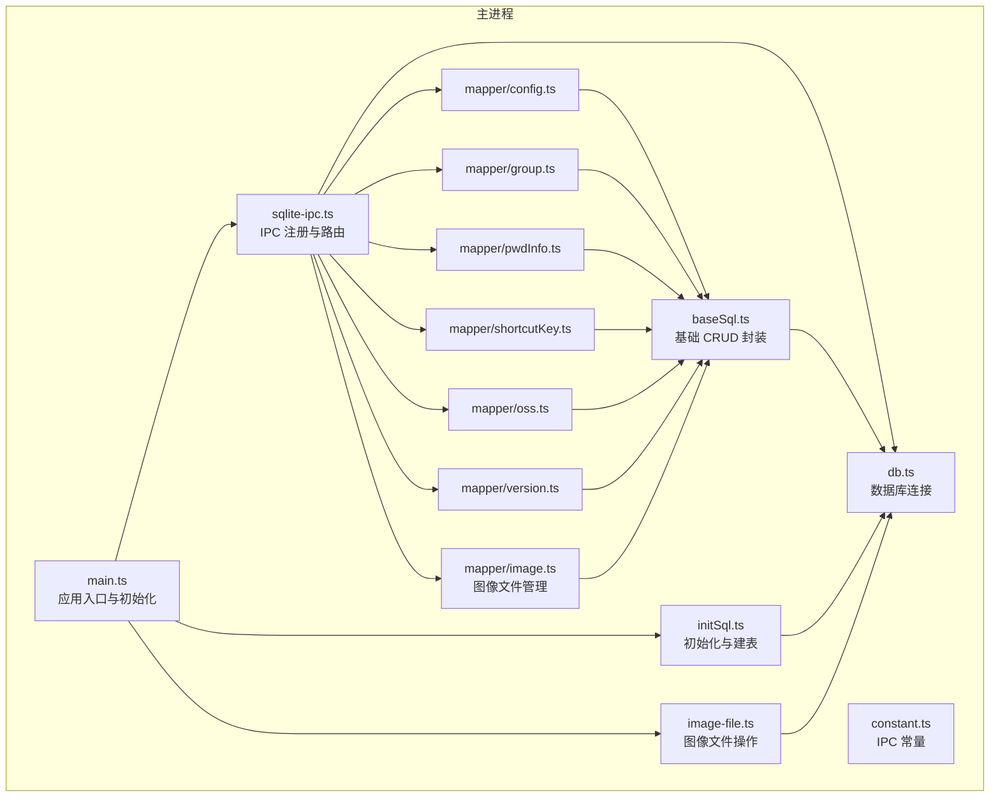
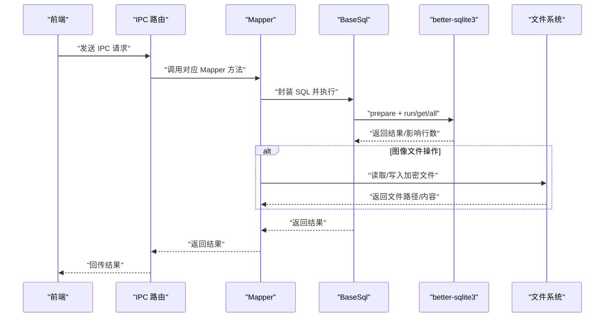
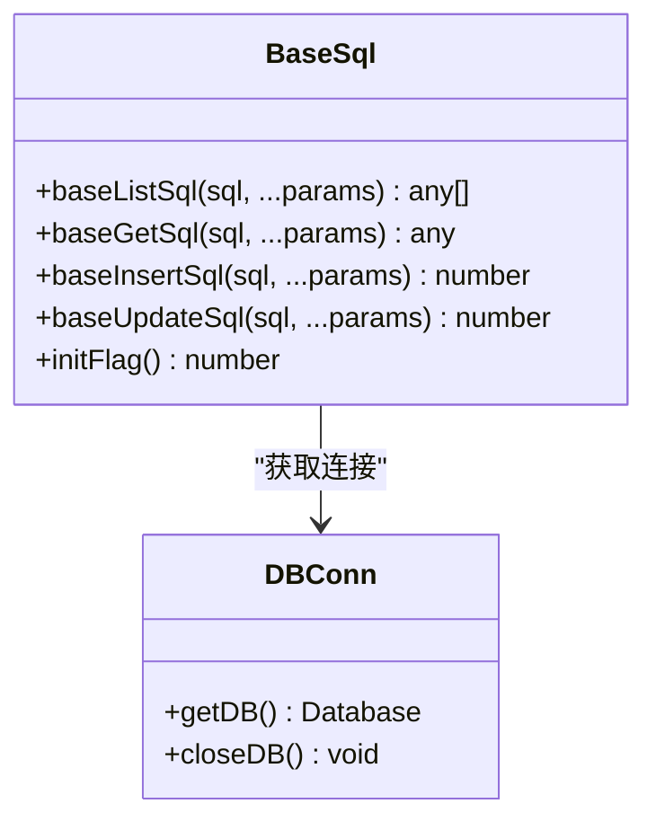
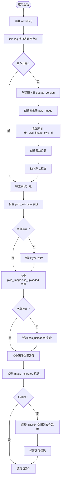
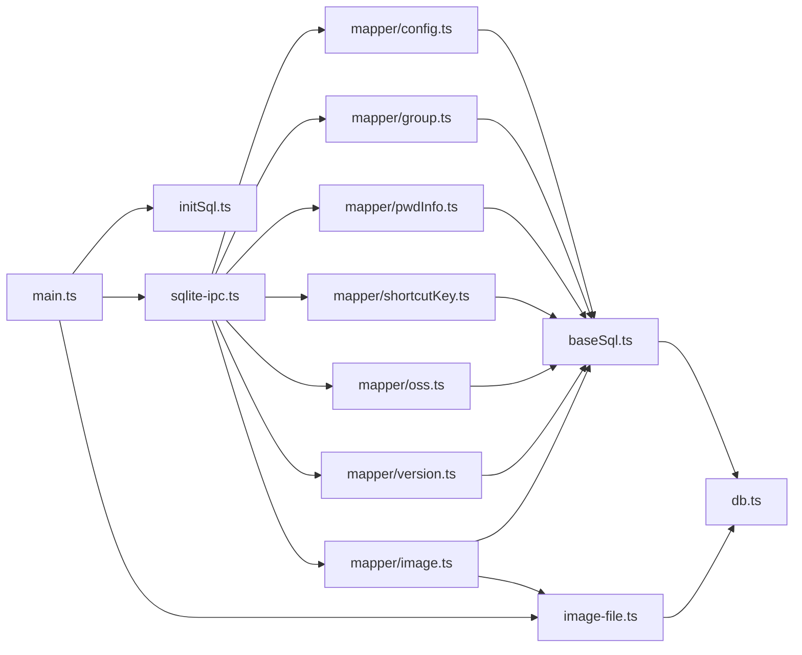
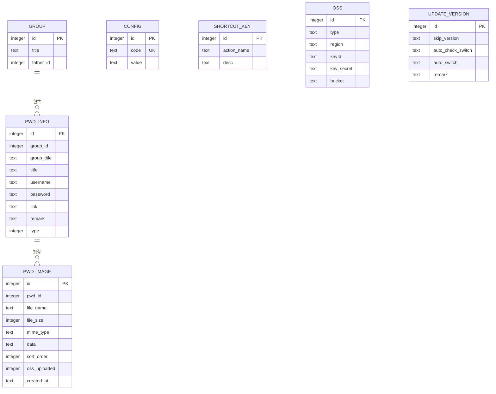

# 数据库系统

<cite>
**本文引用的文件列表**
- [electron/db/sqlite/components/baseSql.ts](file://electron/db/sqlite/components/baseSql.ts)
- [electron/db/sqlite/components/db.ts](file://electron/db/sqlite/components/db.ts)
- [electron/db/sqlite/components/initSql.ts](file://electron/db/sqlite/components/initSql.ts)
- [electron/db/sqlite/components/configConstants.ts](file://electron/db/sqlite/components/configConstants.ts)
- [electron/db/sqlite/mapper/pwdInfo.ts](file://electron/db/sqlite/mapper/pwdInfo.ts)
- [electron/db/sqlite/mapper/group.ts](file://electron/db/sqlite/mapper/group.ts)
- [electron/db/sqlite/mapper/config.ts](file://electron/db/sqlite/mapper/config.ts)
- [electron/db/sqlite/mapper/shortcutKey.ts](file://electron/db/sqlite/mapper/shortcutKey.ts)
- [electron/db/sqlite/mapper/oss.ts](file://electron/db/sqlite/mapper/oss.ts)
- [electron/db/sqlite/mapper/version.ts](file://electron/db/sqlite/mapper/version.ts)
- [electron/db/sqlite/mapper/image.ts](file://electron/db/sqlite/mapper/image.ts)
- [electron/db/sqlite/sqlite-ipc.ts](file://electron/db/sqlite/sqlite-ipc.ts)
- [electron/image-file.ts](file://electron/image-file.ts)
- [electron/constant.ts](file://electron/constant.ts)
- [electron/main.ts](file://electron/main.ts)
- [src/components/type.ts](file://src/components/type.ts)
</cite>

## 目录
1. [简介](#简介)
2. [项目结构](#项目结构)
3. [核心组件](#核心组件)
4. [架构总览](#架构总览)
5. [详细组件分析](#详细组件分析)
6. [依赖关系分析](#依赖关系分析)
7. [性能与缓存策略](#性能与缓存策略)
8. [故障排查指南](#故障排查指南)
9. [结论](#结论)
10. [附录：Schema 图与示例数据](#附录schema-图与示例数据)

## 简介
本文件面向密码管理器的桌面端（Electron）数据库子系统，聚焦于基于 SQLite 的本地数据库架构与实现。内容涵盖：
- 数据库初始化流程与表结构设计
- BaseSql 基类的设计理念与通用 SQL 操作模式
- 各 Mapper 的职责与实现要点
- 数据模型关系、字段定义、索引与约束
- 数据访问模式、缓存策略与性能考量
- 数据生命周期、保留策略与归档建议
- **新增**：图像文件存储系统与文件元数据管理

## 项目结构
数据库相关代码集中在 Electron 主进程中，采用"组件层 + Mapper 层 + IPC 层"的分层组织方式：
- 组件层：负责连接、事务与基础 CRUD 封装（baseSql、db、initSql）
- Mapper 层：面向业务实体的 DAO 实现（config、group、pwdInfo、shortcutKey、oss、version、**image**）
- IPC 层：将前端请求映射到后端数据库操作（sqlite-ipc）
- 文件层：图像文件的加密存储与管理（image-file）

**图表来源**
- [electron/main.ts:49-60](file://electron/main.ts#L49-L60)
- [electron/db/sqlite/sqlite-ipc.ts:58-219](file://electron/db/sqlite/sqlite-ipc.ts#L58-L219)
- [electron/db/sqlite/components/db.ts:16-30](file://electron/db/sqlite/components/db.ts#L16-L30)
- [electron/db/sqlite/components/baseSql.ts:9-87](file://electron/db/sqlite/components/baseSql.ts#L9-L87)
- [electron/db/sqlite/components/initSql.ts:26-46](file://electron/db/sqlite/components/initSql.ts#L26-L46)
- [electron/image-file.ts:1-222](file://electron/image-file.ts#L1-L222)

**章节来源**
- [electron/main.ts:49-60](file://electron/main.ts#L49-L60)
- [electron/db/sqlite/sqlite-ipc.ts:58-219](file://electron/db/sqlite/sqlite-ipc.ts#L58-L219)
- [electron/db/sqlite/components/db.ts:16-30](file://electron/db/sqlite/components/db.ts#L16-L30)
- [electron/db/sqlite/components/baseSql.ts:9-87](file://electron/db/sqlite/components/baseSql.ts#L9-L87)
- [electron/db/sqlite/components/initSql.ts:26-46](file://electron/db/sqlite/components/initSql.ts#L26-L46)
- [electron/image-file.ts:1-222](file://electron/image-file.ts#L1-L222)

## 核心组件
- 数据库连接与生命周期
  - 单例连接：通过模块级变量持有数据库实例，首次使用时创建，关闭时重置为 null
  - 路径：用户数据目录下的本地数据库文件
- 基础 SQL 封装（BaseSql）
  - 提供通用的查询、获取单条、插入、更新、初始化检测等方法
  - 统一异常处理与日志输出
- 初始化流程（initSql）
  - 检测是否已存在表；若无则创建表并插入默认数据
  - 版本表独立初始化，避免重复创建
  - **新增**：图像表 pwd_image 的创建与索引建立
  - **新增**：字段升级支持（pwd_info.type、pwd_image.oss_uploaded）
  - **新增**：数据迁移功能（从Base64到文件系统）
- Mapper 层
  - 面向实体的 CRUD 方法，统一调用 BaseSql
  - 提供搜索、计数、批量 ID 查询等常用能力
  - **新增**：图像文件管理（insertImage、deleteImage、listImageMeta等）
- IPC 层
  - 将前端 IPC 请求映射到具体 Mapper 方法，返回结果或触发副作用
  - **新增**：图像文件相关的 IPC 通道
- 文件层（image-file）
  - **新增**：图像文件的加密存储、解密读取、文件删除和数据迁移
  - **新增**：文件命名规范与目录结构管理

**章节来源**
- [electron/db/sqlite/components/db.ts:16-30](file://electron/db/sqlite/components/db.ts#L16-L30)
- [electron/db/sqlite/components/baseSql.ts:9-87](file://electron/db/sqlite/components/baseSql.ts#L9-L87)
- [electron/db/sqlite/components/initSql.ts:26-46](file://electron/db/sqlite/components/initSql.ts#L26-L46)
- [electron/db/sqlite/sqlite-ipc.ts:58-219](file://electron/db/sqlite/sqlite-ipc.ts#L58-L219)
- [electron/image-file.ts:1-222](file://electron/image-file.ts#L1-L222)

## 架构总览
数据库系统采用"主进程内嵌 SQLite + IPC 通信 + 文件系统存储"的架构，前端通过 IPC 发起请求，主进程在 SQLite 中执行相应操作，并返回结果。图像文件采用加密存储在本地文件系统中，数据库仅存储文件元数据。

**图表来源**
- [electron/db/sqlite/sqlite-ipc.ts:58-219](file://electron/db/sqlite/sqlite-ipc.ts#L58-L219)
- [electron/db/sqlite/components/baseSql.ts:9-87](file://electron/db/sqlite/components/baseSql.ts#L9-L87)
- [electron/db/sqlite/components/db.ts:16-30](file://electron/db/sqlite/components/db.ts#L16-L30)
- [electron/image-file.ts:1-222](file://electron/image-file.ts#L1-L222)

## 详细组件分析

### BaseSql 基类与通用 SQL 模式
- 设计理念
  - 统一封装 prepare + run/get/all，减少重复样板代码
  - 明确职责边界：仅负责 SQL 执行与异常捕获，不包含业务逻辑
  - 支持初始化检测（如判断 config 表是否存在）
- 通用方法
  - 查询列表：baseListSql
  - 获取单条：baseGetSql
  - 插入：baseInsertSql（返回 lastInsertRowid）
  - 更新/删除：baseUpdateSql（返回 1/0 表示成功与否）
  - 初始化检测：initFlag
- 异常处理
  - 统一 try/catch，记录错误日志，返回安全默认值（null/0）

**图表来源**
- [electron/db/sqlite/components/baseSql.ts:9-87](file://electron/db/sqlite/components/baseSql.ts#L9-L87)
- [electron/db/sqlite/components/db.ts:16-30](file://electron/db/sqlite/components/db.ts#L16-L30)

**章节来源**
- [electron/db/sqlite/components/baseSql.ts:9-87](file://electron/db/sqlite/components/baseSql.ts#L9-L87)
- [electron/db/sqlite/components/db.ts:16-30](file://electron/db/sqlite/components/db.ts#L16-L30)

### 数据库初始化流程
- 流程概览
  - 应用启动时调用 initTable
  - 先检测是否已有表（通过 initFlag），若无则创建所有表并插入默认数据
  - 版本表 update_version 独立初始化，避免重复创建
  - **新增**：图像表 pwd_image 的创建与索引建立
  - **新增**：字段升级支持（pwd_info.type、pwd_image.oss_uploaded）
  - **新增**：数据迁移功能（从Base64到文件系统）
- 默认数据
  - config：包含自动启动、默认密码、首次登录标记、深色主题开关、自动锁屏时间等键值
  - shortcut_key：内置快捷键动作与描述
  - group：默认分组
  - oss：阿里云、腾讯云两条空记录
  - update_version：初始版本控制记录
  - **新增**：image_migrated 配置项，标记图像数据迁移状态

**图表来源**
- [electron/db/sqlite/components/initSql.ts:26-46](file://electron/db/sqlite/components/initSql.ts#L26-L46)
- [electron/db/sqlite/components/initSql.ts:107-129](file://electron/db/sqlite/components/initSql.ts#L107-L129)
- [electron/db/sqlite/components/baseSql.ts:83-87](file://electron/db/sqlite/components/baseSql.ts#L83-L87)

**章节来源**
- [electron/db/sqlite/components/initSql.ts:26-46](file://electron/db/sqlite/components/initSql.ts#L26-L46)
- [electron/db/sqlite/components/initSql.ts:107-129](file://electron/db/sqlite/components/initSql.ts#L107-L129)
- [electron/db/sqlite/components/baseSql.ts:83-87](file://electron/db/sqlite/components/baseSql.ts#L83-L87)

### Mapper：配置（config）
- 职责
  - 更新配置项 value
  - 查询配置项 value
- 关键点
  - 使用 code 字段唯一标识配置项
  - 通过 configConstants.ts 统一管理键名

**章节来源**
- [electron/db/sqlite/mapper/config.ts:8-20](file://electron/db/sqlite/mapper/config.ts#L8-L20)
- [electron/db/sqlite/components/configConstants.ts:3-18](file://electron/db/sqlite/components/configConstants.ts#L3-L18)

### Mapper：分组（group）
- 职责
  - 新增、删除、更新分组
  - 查询全部分组
  - 根据标题获取 id（用于导入场景）
- 关键点
  - 支持 OSS 导入时指定 id
  - 提供批量删除（按分组删除密码）

**章节来源**
- [electron/db/sqlite/mapper/group.ts:7-48](file://electron/db/sqlite/mapper/group.ts#L7-L48)

### Mapper：密码信息（pwdInfo）
- 职责
  - 新增、删除、更新密码信息
  - 列表查询（支持按分组过滤）
  - 搜索（按标题/用户名模糊匹配）
  - 按 id 列表查询
  - 计数（按分组）
  - 获取单条
- 关键点
  - 支持导入场景的全字段插入
  - 搜索使用 SQLite LIKE 语法
  - 按 id 列表查询使用 IN 子句并进行参数校验
  - **新增**：支持 type 字段（用于区分不同类型的数据）

**章节来源**
- [electron/db/sqlite/mapper/pwdInfo.ts:6-99](file://electron/db/sqlite/mapper/pwdInfo.ts#L6-L99)

### Mapper：快捷键（shortcutKey）
- 职责
  - 更新快捷键描述
  - 查询单个快捷键
  - 查询全部快捷键
- 关键点
  - action_name 唯一标识快捷键动作

**章节来源**
- [electron/db/sqlite/mapper/shortcutKey.ts:8-25](file://electron/db/sqlite/mapper/shortcutKey.ts#L8-L25)

### Mapper：对象存储（oss）
- 职责
  - 更新 OSS 配置（区域、密钥、桶等）
  - 查询指定类型的 OSS 配置
- 关键点
  - type 字段区分不同云厂商

**章节来源**
- [electron/db/sqlite/mapper/oss.ts:8-23](file://electron/db/sqlite/mapper/oss.ts#L8-L23)

### Mapper：版本（version）
- 职责
  - 查询跳过版本
  - 更新跳过版本
  - 查询自动检查开关
  - 更新自动检查开关
- 关键点
  - update_version 表用于版本控制与更新策略

**章节来源**
- [electron/db/sqlite/mapper/version.ts:9-31](file://electron/db/sqlite/mapper/version.ts#L9-L31)

### Mapper：图像文件（image）
- 职责
  - **新增**：插入图像文件（支持普通插入和导入插入）
  - **新增**：删除单个图像、按密码条目删除、删除所有图像
  - **新增**：查询图像元数据列表、获取图像数据、获取图像文件路径
  - **新增**：查询所有图像、按密码条目计数、更新 OSS 上传状态
- 关键点
  - 支持导入场景的全字段插入（包含 id、created_at 等）
  - 使用 pwd_id 关联到密码条目
  - 支持排序字段 sort_order 和 OSS 上传状态标记

**章节来源**
- [electron/db/sqlite/mapper/image.ts:1-82](file://electron/db/sqlite/mapper/image.ts#L1-L82)

### IPC 层：SQLiteIPC
- 职责
  - 注册所有数据库相关的 IPC 处理函数
  - 将前端请求映射到具体 Mapper 方法
  - **新增**：注册图像文件相关的 IPC 处理函数
- 关键点
  - 使用 constant.ts 中的常量作为 IPC 通道名
  - 返回值统一通过 handle 回传给前端
  - **新增**：支持图像文件的插入、删除、查询、计数等操作

**章节来源**
- [electron/db/sqlite/sqlite-ipc.ts:58-219](file://electron/db/sqlite/sqlite-ipc.ts#L58-L219)
- [electron/constant.ts:12-59](file://electron/constant.ts#L12-L59)

### 文件层：图像文件操作（image-file）
- 职责
  - **新增**：图像文件的加密存储、解密读取、文件删除和数据迁移
  - **新增**：确保目录存在、生成唯一文件名、获取图片存储根目录
  - **新增**：支持直接写入加密内容到文件（用于 OSS 下载）
- 关键点
  - 使用与渲染进程相同的 AES 密钥和偏移量进行加密
  - 文件命名规范：{timestamp}_{6位随机hex}.{ext}.enc
  - 目录结构：{userData}/images/{pwdId}/{fileName}.enc
  - 支持数据迁移：将旧的加密 Base64 数据转换为文件存储

**章节来源**
- [electron/image-file.ts:1-222](file://electron/image-file.ts#L1-L222)

## 依赖关系分析
- 组件耦合
  - Mapper 依赖 BaseSql，BaseSql 依赖 db.ts 的连接
  - SQLiteIPC 依赖各 Mapper 与 constant.ts
  - main.ts 依赖 initTable、SQLiteIPC 与 image-file
  - **新增**：image.ts 依赖 image-file.ts 进行文件操作
- 可能的循环依赖
  - 当前结构清晰，未发现循环依赖
- 外部依赖
  - better-sqlite3：高性能本地 SQLite 驱动
  - crypto-js：AES 加密解密库

**图表来源**
- [electron/main.ts:49-60](file://electron/main.ts#L49-L60)
- [electron/db/sqlite/sqlite-ipc.ts:58-219](file://electron/db/sqlite/sqlite-ipc.ts#L58-L219)
- [electron/db/sqlite/components/baseSql.ts:9-87](file://electron/db/sqlite/components/baseSql.ts#L9-L87)
- [electron/db/sqlite/components/db.ts:16-30](file://electron/db/sqlite/components/db.ts#L16-L30)
- [electron/image-file.ts:1-222](file://electron/image-file.ts#L1-L222)

**章节来源**
- [electron/main.ts:49-60](file://electron/main.ts#L49-L60)
- [electron/db/sqlite/sqlite-ipc.ts:58-219](file://electron/db/sqlite/sqlite-ipc.ts#L58-L219)
- [electron/db/sqlite/components/baseSql.ts:9-87](file://electron/db/sqlite/components/baseSql.ts#L9-L87)
- [electron/db/sqlite/components/db.ts:16-30](file://electron/db/sqlite/components/db.ts#L16-L30)
- [electron/image-file.ts:1-222](file://electron/image-file.ts#L1-L222)

## 性能与缓存策略
- 连接与事务
  - 单例连接减少资源开销；对批量插入可结合 better-sqlite3 的事务 API（已在 BaseSql 中预留注释）以提升吞吐
- 查询优化
  - pwdInfo 搜索使用 LIKE，建议在高频字段上建立索引（如 title、username）
  - 按 id 列表查询已使用 IN 子句，注意参数数量限制
  - **新增**：pwd_image 表已建立 pwd_id 索引，提高关联查询性能
- 缓存策略
  - 前端可对常用列表（如分组、快捷键）进行内存缓存，减少 IPC 调用频率
  - 对只读配置（如快捷键、默认 OSS 类型）可在应用启动后缓存
  - **新增**：图像文件内容可进行内存缓存，减少重复解密操作
- 日志与调试
  - BaseSql 输出 SQL 日志，便于定位问题；生产环境可关闭 verbose
  - **新增**：图像文件操作包含详细的日志记录，便于调试迁移和存储问题

**章节来源**
- [electron/db/sqlite/components/baseSql.ts:52-65](file://electron/db/sqlite/components/baseSql.ts#L52-L65)
- [electron/db/sqlite/components/db.ts:20-22](file://electron/db/sqlite/components/db.ts#L20-L22)
- [electron/db/sqlite/components/initSql.ts:131](file://electron/db/sqlite/components/initSql.ts#L131)

## 故障排查指南
- 初始化失败
  - 检查 initFlag 是否正确识别表存在性
  - 确认 initTable 调用顺序（先创建版本表，再创建业务表）
  - **新增**：检查字段升级是否成功（pwd_info.type、pwd_image.oss_uploaded）
- 查询异常
  - 检查 SQL 参数绑定是否正确
  - 确认字段名大小写与表定义一致
  - **新增**：检查图像文件路径是否正确，文件是否存在
- IPC 无响应
  - 确认 constant.ts 中的通道名与前端一致
  - 检查 sqlite-ipc.ts 的 handle 注册是否完整
  - **新增**：确认图像文件相关的 IPC 通道是否正确注册
- 权限与路径
  - 确保用户数据目录可写
  - 避免多进程同时写入导致锁冲突
  - **新增**：检查图像文件存储目录权限，确保可读写
- 数据迁移问题
  - **新增**：检查 image_migrated 配置项是否正确设置
  - **新增**：验证旧的 Base64 数据是否能正确解密和重新加密
  - **新增**：确认文件系统存储路径结构是否正确

**章节来源**
- [electron/db/sqlite/components/baseSql.ts:12-31](file://electron/db/sqlite/components/baseSql.ts#L12-L31)
- [electron/db/sqlite/components/initSql.ts:32-42](file://electron/db/sqlite/components/initSql.ts#L32-L42)
- [electron/db/sqlite/sqlite-ipc.ts:58-219](file://electron/db/sqlite/sqlite-ipc.ts#L58-L219)
- [electron/db/sqlite/components/db.ts:10-12](file://electron/db/sqlite/components/db.ts#L10-L12)

## 结论
该数据库系统以简洁的分层设计实现了密码管理器的核心数据能力：初始化建表、基础 CRUD、搜索与统计、以及通过 IPC 与前端交互。BaseSql 提供了统一的执行模式与异常处理，Mapper 将业务语义与 SQL 解耦，整体具备良好的可维护性与扩展性。

**新增的图像文件存储系统**进一步增强了系统的功能完整性：
- 采用加密存储确保数据安全
- 支持 Base64 到文件系统的平滑迁移
- 提供完整的文件元数据管理
- 优化了存储空间和访问性能

后续可在索引、事务与缓存方面进一步优化以提升性能与用户体验。

## 附录：Schema 图与示例数据

### 表结构与约束
- group（分组）
  - 字段：id（自增主键）、title（非空）、father_id
  - 约束：无显式外键约束
- pwd_info（密码信息）
  - 字段：id（自增主键）、group_id（非空）、group_title、title、username、password、link、remark、**type**
  - 约束：无显式外键约束
  - **新增**：type 字段用于区分不同类型的数据
- config（配置）
  - 字段：id（自增主键）、code（非空，唯一）、value
  - 约束：uni_code（code 唯一）
- shortcut_key（快捷键）
  - 字段：id（自增主键）、action_name、desc
  - 约束：无唯一约束
- oss（对象存储）
  - 字段：id（自增主键）、type（非空）、region、keyId、key_secret、bucket
  - 约束：无唯一约束
- update_version（版本控制）
  - 字段：id（自增主键）、skip_version、auto_check_switch、auto_switch、remark
  - 约束：无唯一约束
- **新增**：pwd_image（图像文件）
  - 字段：id（自增主键）、pwd_id（非空）、file_name（非空）、file_size（非空）、mime_type（非空）、data（非空）、sort_order、**oss_uploaded**、created_at
  - 约束：无显式外键约束
  - **新增**：oss_uploaded 字段标记文件是否已上传到 OSS
  - **新增**：created_at 字段记录创建时间，默认使用本地时间

**图表来源**
- [electron/db/sqlite/components/initSql.ts:52-100](file://electron/db/sqlite/components/initSql.ts#L52-L100)
- [electron/db/sqlite/components/initSql.ts:117-130](file://electron/db/sqlite/components/initSql.ts#L117-L130)

### 示例数据
- config（部分）
  - auto_start、pwd、first_login_flag、dark_switch、auto_lock_time、auto_lock_time_unit、local_version、oss_sync_switch、oss_sync_auto_upload_switch、oss_sync_auto_download_switch、**image_migrated**
- shortcut_key
  - openMainWindows、logout、copyUsername、copyPwd、copyLink、insertGroup、insertPwdInfo、syncLocalToOss、syncOssToLocal
- group
  - id=1, title="默认分组", father_id=0
- oss
  - type='oss'、'cos'
- update_version
  - skip_version、auto_check_switch、auto_switch 初始为空或 0
- **新增**：pwd_image
  - 包含文件元数据：file_name、file_size、mime_type、sort_order、oss_uploaded、created_at
  - data 字段可能存储文件路径或加密内容（取决于迁移状态）

**章节来源**
- [electron/db/sqlite/components/initSql.ts:164-183](file://electron/db/sqlite/components/initSql.ts#L164-L183)
- [electron/db/sqlite/components/initSql.ts:185-207](file://electron/db/sqlite/components/initSql.ts#L185-L207)
- [electron/db/sqlite/components/initSql.ts:209-214](file://electron/db/sqlite/components/initSql.ts#L209-L214)
- [electron/db/sqlite/components/initSql.ts:152-160](file://electron/db/sqlite/components/initSql.ts#L152-L160)
- [electron/db/sqlite/components/initSql.ts:144-150](file://electron/db/sqlite/components/initSql.ts#L144-L150)