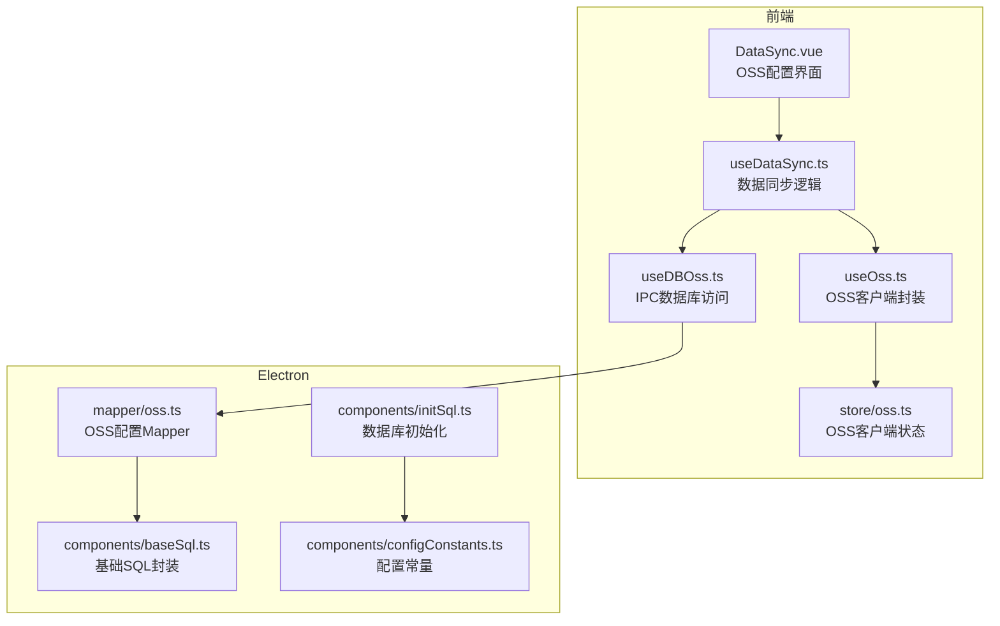
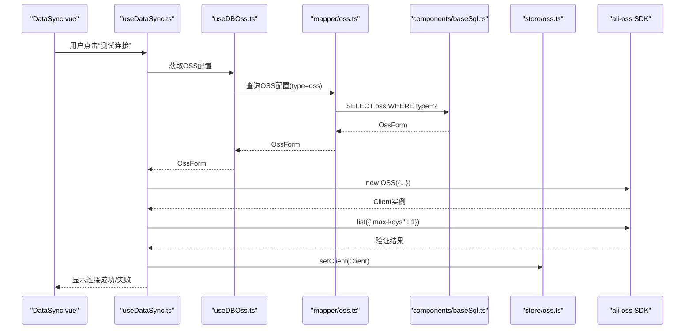
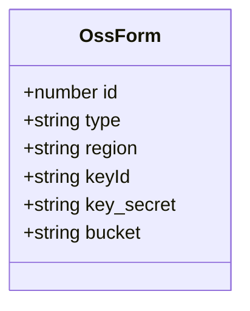
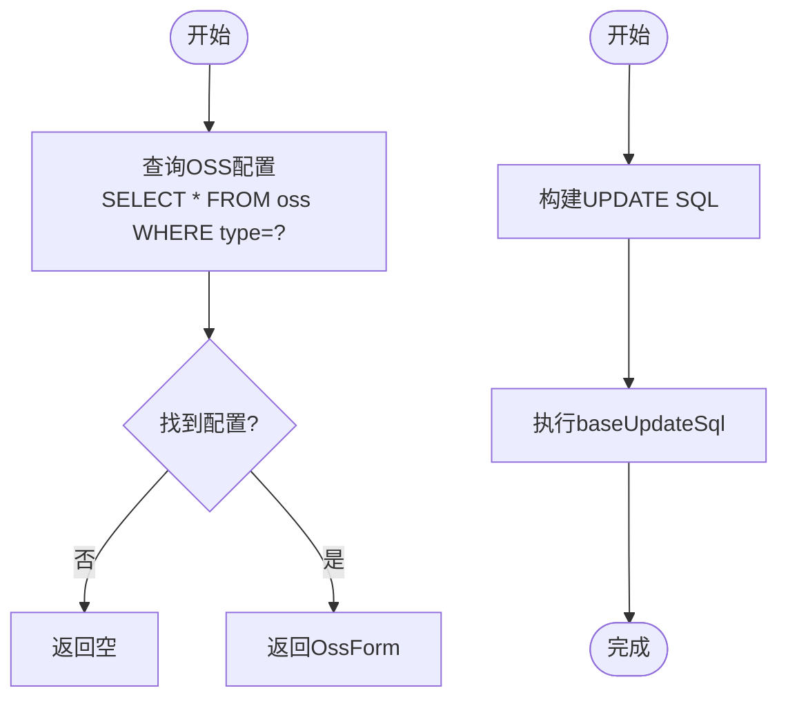
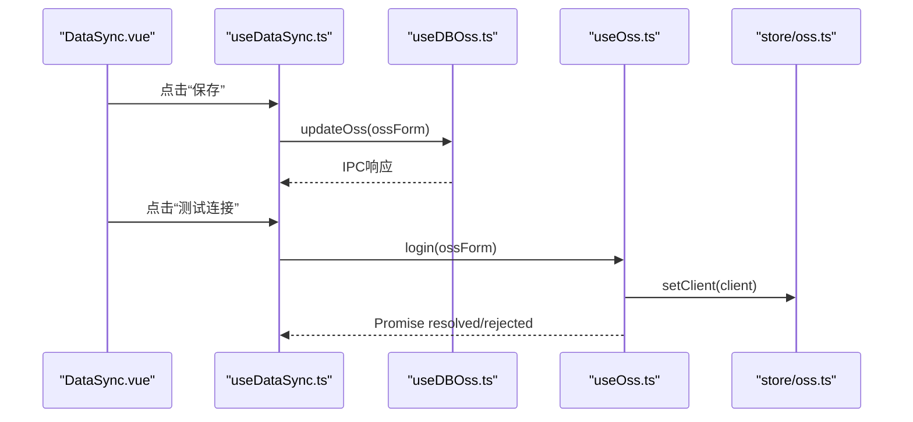
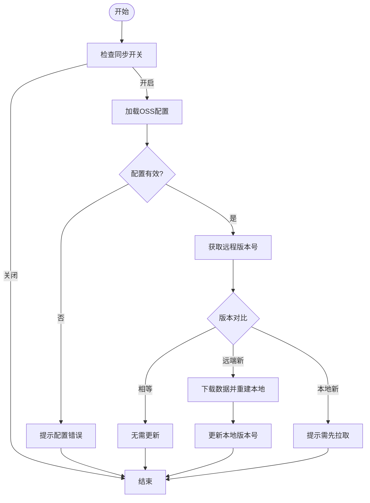
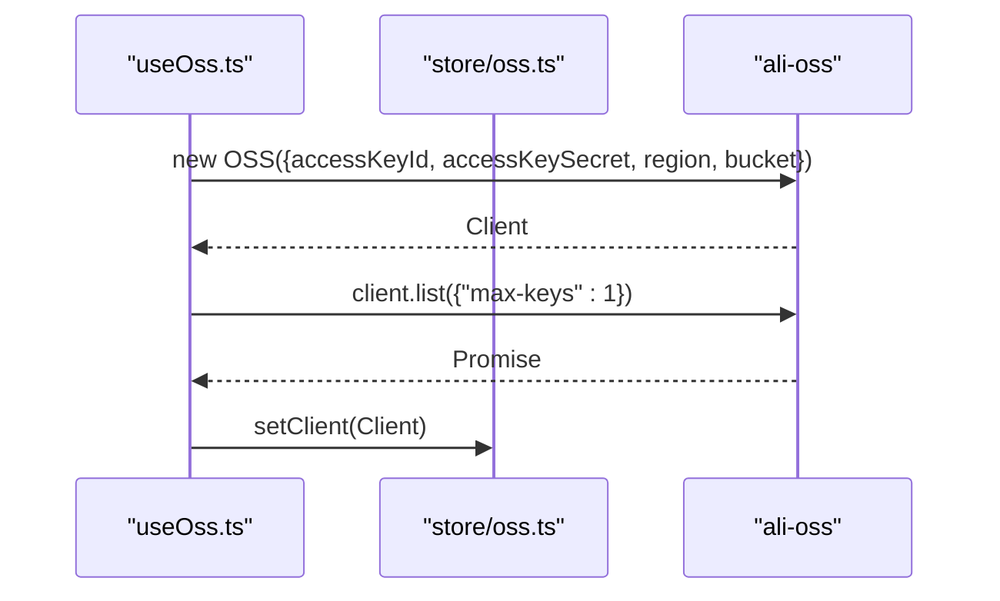
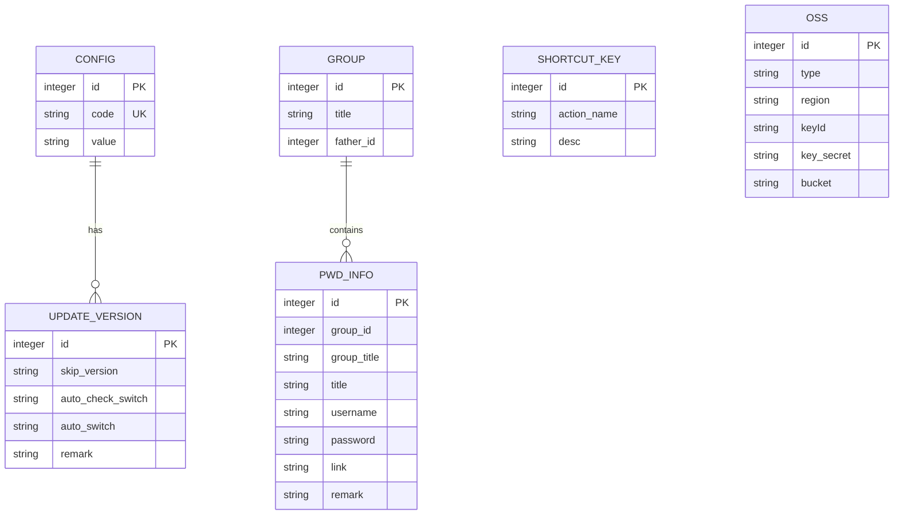
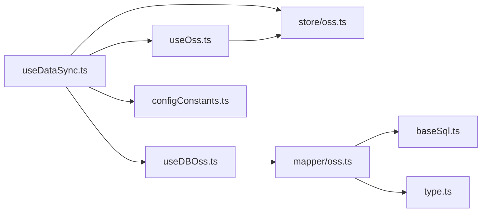

# OSS配置Mapper

<cite>
**本文档引用的文件**
- [oss.ts](file://electron/db/sqlite/mapper/oss.ts)
- [baseSql.ts](file://electron/db/sqlite/components/baseSql.ts)
- [initSql.ts](file://electron/db/sqlite/components/initSql.ts)
- [configConstants.ts](file://electron/db/sqlite/components/configConstants.ts)
- [useDBOss.ts](file://src/hooks/useDBOss.ts)
- [useOss.ts](file://src/hooks/useOss.ts)
- [oss.ts](file://src/store/oss.ts)
- [useDataSync.ts](file://src/hooks/useDataSync.ts)
- [type.ts](file://src/components/type.ts)
- [DataSync.vue](file://src/components/setview/DataSync.vue)
- [config.ts](file://src/config/config.ts)
</cite>

## 目录
1. [简介](#简介)
2. [项目结构](#项目结构)
3. [核心组件](#核心组件)
4. [架构总览](#架构总览)
5. [详细组件分析](#详细组件分析)
6. [依赖关系分析](#依赖关系分析)
7. [性能考虑](#性能考虑)
8. [故障排除指南](#故障排除指南)
9. [结论](#结论)

## 简介
本文件系统性阐述OSS配置Mapper的设计与实现，重点覆盖以下方面：
- OssConfig数据模型与云存储配置的核心功能
- OSS连接参数的存储与管理机制（SQLite持久化）
- 阿里云OSS SDK的集成方式、认证配置与客户端生命周期管理
- OSS配置的增删改查操作路径与代码示例定位
- 数据同步过程中OSS操作流程、版本控制与错误处理

## 项目结构
围绕OSS配置与同步的关键文件分布如下：
- Electron侧数据库映射与基础SQL封装：mapper/oss.ts、components/baseSql.ts
- 数据库初始化与默认配置：components/initSql.ts、components/configConstants.ts
- 前端Hook与状态管理：hooks/useDBOss.ts、hooks/useOss.ts、store/oss.ts、hooks/useDataSync.ts
- 类型定义与视图组件：components/type.ts、components/setview/DataSync.vue
- 配置常量：config/config.ts

**图表来源**
- [useDataSync.ts:1-324](file://src/hooks/useDataSync.ts#L1-L324)
- [useOss.ts:1-107](file://src/hooks/useOss.ts#L1-L107)
- [useDBOss.ts:1-17](file://src/hooks/useDBOss.ts#L1-L17)
- [oss.ts:1-59](file://src/store/oss.ts#L1-L59)
- [DataSync.vue:1-69](file://src/components/setview/DataSync.vue#L1-L69)
- [oss.ts:1-30](file://electron/db/sqlite/mapper/oss.ts#L1-L30)
- [baseSql.ts:1-87](file://electron/db/sqlite/components/baseSql.ts#L1-L87)
- [initSql.ts:1-224](file://electron/db/sqlite/components/initSql.ts#L1-L224)
- [configConstants.ts:1-29](file://electron/db/sqlite/components/configConstants.ts#L1-L29)

**章节来源**
- [oss.ts:1-30](file://electron/db/sqlite/mapper/oss.ts#L1-L30)
- [baseSql.ts:1-87](file://electron/db/sqlite/components/baseSql.ts#L1-L87)
- [initSql.ts:1-224](file://electron/db/sqlite/components/initSql.ts#L1-L224)
- [configConstants.ts:1-29](file://electron/db/sqlite/components/configConstants.ts#L1-L29)
- [useDBOss.ts:1-17](file://src/hooks/useDBOss.ts#L1-L17)
- [useOss.ts:1-107](file://src/hooks/useOss.ts#L1-L107)
- [oss.ts:1-59](file://src/store/oss.ts#L1-L59)
- [useDataSync.ts:1-324](file://src/hooks/useDataSync.ts#L1-L324)
- [type.ts:1-88](file://src/components/type.ts#L1-L88)
- [DataSync.vue:1-69](file://src/components/setview/DataSync.vue#L1-L69)
- [config.ts:1-143](file://src/config/config.ts#L1-L143)

## 核心组件
- OssConfig数据模型：定义OSS配置字段（类型、区域、AccessKey ID、AccessKey Secret、Bucket），用于前后端统一的数据契约。
- OSS配置Mapper：提供OSS配置的查询与更新能力，基于SQLite执行SQL。
- 基础SQL封装：提供通用的查询、更新、事务等能力，确保数据库操作的一致性与可维护性。
- 数据库初始化：创建必要的表结构与默认配置，包含oss表与config表的初始化。
- 前端Hook与状态管理：封装IPC调用、OSS SDK客户端实例管理、同步策略与错误处理。
- 视图组件：提供OSS配置输入界面与“测试连接”、“保存”等交互。

**章节来源**
- [type.ts:9-17](file://src/components/type.ts#L9-L17)
- [oss.ts:1-30](file://electron/db/sqlite/mapper/oss.ts#L1-L30)
- [baseSql.ts:1-87](file://electron/db/sqlite/components/baseSql.ts#L1-L87)
- [initSql.ts:90-100](file://electron/db/sqlite/components/initSql.ts#L90-L100)
- [useDBOss.ts:1-17](file://src/hooks/useDBOss.ts#L1-L17)
- [useOss.ts:1-107](file://src/hooks/useOss.ts#L1-L107)
- [oss.ts:1-59](file://src/store/oss.ts#L1-L59)
- [DataSync.vue:12-42](file://src/components/setview/DataSync.vue#L12-L42)

## 架构总览
OSS配置与数据同步的整体架构如下：

**图表来源**
- [useDataSync.ts:284-320](file://src/hooks/useDataSync.ts#L284-L320)
- [useDBOss.ts:5-14](file://src/hooks/useDBOss.ts#L5-L14)
- [oss.ts:18-23](file://electron/db/sqlite/mapper/oss.ts#L18-L23)
- [baseSql.ts:21-32](file://electron/db/sqlite/components/baseSql.ts#L21-L32)
- [oss.ts:49-55](file://src/store/oss.ts#L49-L55)
- [useOss.ts:10-27](file://src/hooks/useOss.ts#L10-L27)

## 详细组件分析

### OssConfig数据模型
- 字段说明
  - id：主键
  - type：云厂商标识（如阿里云OSS）
  - region：区域
  - keyId：AccessKey ID
  - key_secret：AccessKey Secret
  - bucket：存储空间
- 设计要点
  - 统一的OssForm接口，便于前后端交互
  - 与数据库表结构一一对应，便于ORM式映射

**图表来源**
- [type.ts:9-17](file://src/components/type.ts#L9-L17)

**章节来源**
- [type.ts:9-17](file://src/components/type.ts#L9-L17)

### OSS配置Mapper与数据库持久化
- 查询OSS配置
  - SQL：SELECT * FROM "oss" WHERE type = ?
  - 参数：type
  - 返回：OssForm对象
- 更新OSS配置
  - SQL：UPDATE "oss" SET region=?, keyId=?, key_secret=?, bucket=? WHERE type=?
  - 参数：region, keyId, key_secret, bucket, type
- 基础SQL封装
  - 提供baseGetSql、baseUpdateSql等通用方法，统一异常处理与日志输出
- 数据库初始化
  - 创建oss表与config表，并插入默认OSS配置记录（type=oss/type=cos）

**图表来源**
- [oss.ts:18-23](file://electron/db/sqlite/mapper/oss.ts#L18-L23)
- [oss.ts:8-16](file://electron/db/sqlite/mapper/oss.ts#L8-L16)
- [baseSql.ts:21-32](file://electron/db/sqlite/components/baseSql.ts#L21-L32)
- [baseSql.ts:67-81](file://electron/db/sqlite/components/baseSql.ts#L67-L81)
- [initSql.ts:90-100](file://electron/db/sqlite/components/initSql.ts#L90-L100)
- [initSql.ts:152-160](file://electron/db/sqlite/components/initSql.ts#L152-L160)

**章节来源**
- [oss.ts:1-30](file://electron/db/sqlite/mapper/oss.ts#L1-L30)
- [baseSql.ts:1-87](file://electron/db/sqlite/components/baseSql.ts#L1-L87)
- [initSql.ts:90-100](file://electron/db/sqlite/components/initSql.ts#L90-L100)
- [initSql.ts:152-160](file://electron/db/sqlite/components/initSql.ts#L152-L160)

### 前端Hook与IPC通信
- useDBOss.ts
  - getOss(type)：通过IPC调用Electron侧查询OSS配置
  - updateOss(oss)：通过IPC调用Electron侧更新OSS配置
- useOss.ts
  - login(form)：构造OSS客户端并调用list接口验证权限
  - putFile(key, json)：上传JSON数据到OSS
  - getFile(key)：从OSS下载数据并解析
  - getClient()/setClient()：从Pinia store中获取/设置OSS客户端实例
- store/oss.ts
  - 维护OSS客户端实例与时间戳，支持版本控制策略

**图表来源**
- [DataSync.vue:36-37](file://src/components/setview/DataSync.vue#L36-L37)
- [useDataSync.ts:273-281](file://src/hooks/useDataSync.ts#L273-L281)
- [useDataSync.ts:284-320](file://src/hooks/useDataSync.ts#L284-L320)
- [useDBOss.ts:5-14](file://src/hooks/useDBOss.ts#L5-L14)
- [useOss.ts:10-27](file://src/hooks/useOss.ts#L10-L27)
- [oss.ts:49-55](file://src/store/oss.ts#L49-L55)

**章节来源**
- [useDBOss.ts:1-17](file://src/hooks/useDBOss.ts#L1-L17)
- [useOss.ts:1-107](file://src/hooks/useOss.ts#L1-L107)
- [oss.ts:1-59](file://src/store/oss.ts#L1-L59)

### 数据同步流程与版本控制
- 同步策略
  - 本地版本号：local_version，每次上传后递增
  - 远程版本号：ossVersion文件，用于对比本地与远端一致性
- 下载流程（拉取）
  - 判断开关与配置有效性
  - 获取远程版本号与本地版本号对比
  - 若不一致则下载数据并清空后重建本地数据
- 上传流程（推送）
  - 读取本地分组与密码数据，打包为OssSyncObj
  - 上传数据文件与版本号文件
- 错误处理
  - 根据SDK错误码分类提示（如AccessKeyId、SignatureDoesNotMatch、AccessDenied等）

**图表来源**
- [useDataSync.ts:40-131](file://src/hooks/useDataSync.ts#L40-L131)
- [useDataSync.ts:133-201](file://src/hooks/useDataSync.ts#L133-L201)
- [useDataSync.ts:238-251](file://src/hooks/useDataSync.ts#L238-L251)

**章节来源**
- [useDataSync.ts:1-324](file://src/hooks/useDataSync.ts#L1-L324)

### 阿里云OSS SDK集成与认证配置
- SDK集成
  - 引入ali-oss包，构造OSS客户端实例
  - 使用AccessKey ID/Secret、Region、Bucket进行初始化
- 认证配置
  - 通过login函数调用list接口进行连通性验证
  - 将客户端实例存入Pinia store，供后续上传/下载使用
- 连接池管理
  - 当前实现为单实例管理；如需扩展可在此处引入连接池或会话复用策略

**图表来源**
- [useOss.ts:10-27](file://src/hooks/useOss.ts#L10-L27)
- [oss.ts:49-55](file://src/store/oss.ts#L49-L55)

**章节来源**
- [useOss.ts:1-107](file://src/hooks/useOss.ts#L1-L107)
- [oss.ts:1-59](file://src/store/oss.ts#L1-L59)

### OSS配置的增删改查操作（代码示例定位）
- 查询配置
  - 路径：[oss.ts:18-23](file://electron/db/sqlite/mapper/oss.ts#L18-L23)
  - 调用方：[useDBOss.ts:5-8](file://src/hooks/useDBOss.ts#L5-L8)
- 更新配置
  - 路径：[oss.ts:8-16](file://electron/db/sqlite/mapper/oss.ts#L8-L16)
  - 调用方：[useDBOss.ts:10-14](file://src/hooks/useDBOss.ts#L10-L14)
- 删除配置（概念性说明）
  - 当前未提供删除接口；如需删除可在Mapper中增加DELETE语句并在前端补充入口
- 新增配置（概念性说明）
  - 可通过INSERT语句向oss表插入新记录，结合初始化脚本参考

**章节来源**
- [oss.ts:1-30](file://electron/db/sqlite/mapper/oss.ts#L1-L30)
- [useDBOss.ts:1-17](file://src/hooks/useDBOss.ts#L1-L17)

### 数据模型与表结构

**图表来源**
- [initSql.ts:50-100](file://electron/db/sqlite/components/initSql.ts#L50-L100)
- [initSql.ts:107-129](file://electron/db/sqlite/components/initSql.ts#L107-L129)

**章节来源**
- [initSql.ts:1-224](file://electron/db/sqlite/components/initSql.ts#L1-L224)

## 依赖关系分析
- 组件耦合
  - useDataSync.ts依赖useDBOss.ts、useOss.ts、store/oss.ts与configConstants.ts
  - useDBOss.ts依赖Electron IPC常量与mapper/oss.ts
  - mapper/oss.ts依赖baseSql.ts与type.ts
- 外部依赖
  - ali-oss SDK用于OSS操作
  - better-sqlite3用于本地SQLite访问
- 循环依赖
  - 未发现循环依赖；各模块职责清晰

**图表来源**
- [useDataSync.ts:1-324](file://src/hooks/useDataSync.ts#L1-L324)
- [useDBOss.ts:1-17](file://src/hooks/useDBOss.ts#L1-L17)
- [oss.ts:1-30](file://electron/db/sqlite/mapper/oss.ts#L1-L30)
- [baseSql.ts:1-87](file://electron/db/sqlite/components/baseSql.ts#L1-L87)
- [type.ts:1-88](file://src/components/type.ts#L1-L88)
- [oss.ts:1-59](file://src/store/oss.ts#L1-L59)
- [configConstants.ts:1-29](file://electron/db/sqlite/components/configConstants.ts#L1-L29)

**章节来源**
- [useDataSync.ts:1-324](file://src/hooks/useDataSync.ts#L1-L324)
- [useDBOss.ts:1-17](file://src/hooks/useDBOss.ts#L1-L17)
- [oss.ts:1-30](file://electron/db/sqlite/mapper/oss.ts#L1-L30)
- [baseSql.ts:1-87](file://electron/db/sqlite/components/baseSql.ts#L1-L87)
- [type.ts:1-88](file://src/components/type.ts#L1-L88)
- [oss.ts:1-59](file://src/store/oss.ts#L1-L59)
- [configConstants.ts:1-29](file://electron/db/sqlite/components/configConstants.ts#L1-L29)

## 性能考虑
- 客户端实例复用：通过Pinia store缓存OSS客户端，避免重复初始化
- 批量操作：下载后采用“清空后重建”的方式，减少并发写入冲突
- 版本控制：通过版本号避免不必要的同步，降低带宽与IO开销
- 建议
  - 如需高并发场景，可在useOss.ts中引入连接池或会话复用策略
  - 对大文件上传可考虑分片上传与断点续传（需根据SDK能力扩展）

## 故障排除指南
- 常见错误与提示
  - RequestError：检查Bucket名称、跨域设置、Region配置
  - InvalidAccessKeyId：确认AccessKey ID正确
  - SignatureDoesNotMatch：确认AccessKey Secret正确
  - AccessDenied：确认RAM用户具备访问存储桶权限
- 排查步骤
  - 使用“测试连接”按钮快速验证配置
  - 检查config表中的oss_sync开关与自动同步开关
  - 确认oss表中type=oss的记录已正确填充

**章节来源**
- [useDataSync.ts:300-320](file://src/hooks/useDataSync.ts#L300-L320)
- [configConstants.ts:16-18](file://electron/db/sqlite/components/configConstants.ts#L16-L18)
- [initSql.ts:164-183](file://electron/db/sqlite/components/initSql.ts#L164-L183)

## 结论
OSS配置Mapper通过清晰的数据模型、稳定的数据库持久化与完善的前端Hook封装，实现了OSS配置的可靠管理与数据同步。结合阿里云OSS SDK的认证与文件操作能力，系统提供了完整的云端备份与恢复能力。未来可在连接池、版本控制策略与错误重试等方面进一步增强，以满足更高性能与可靠性需求。