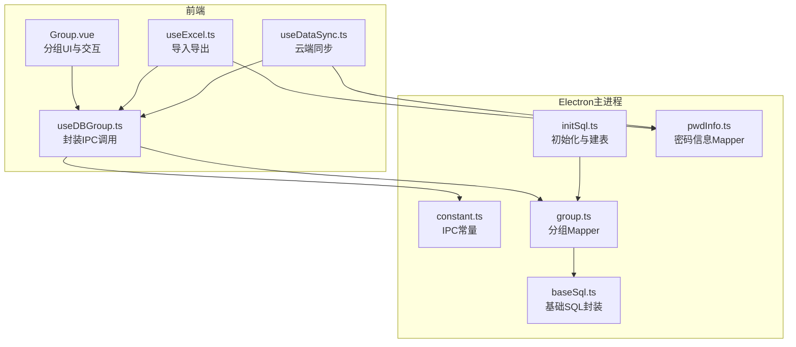
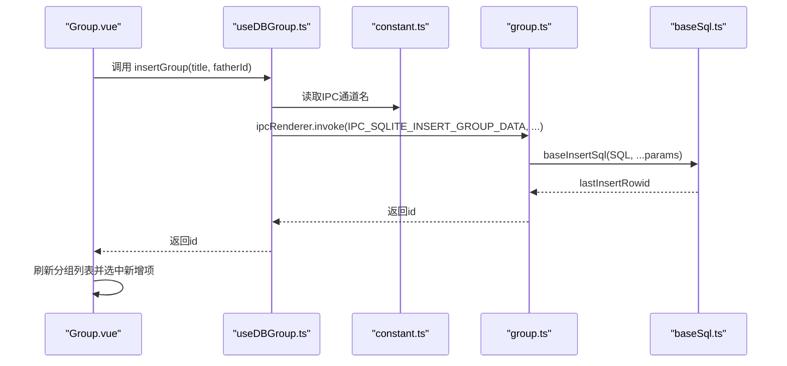
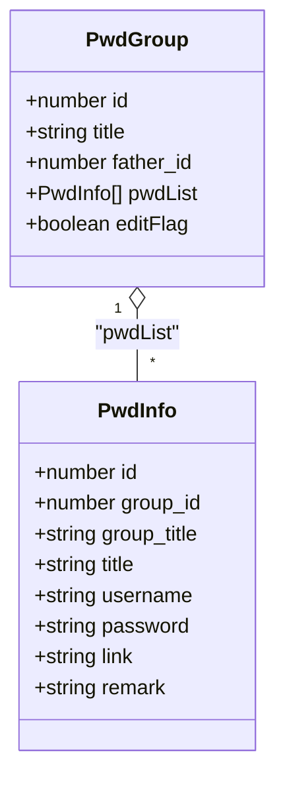
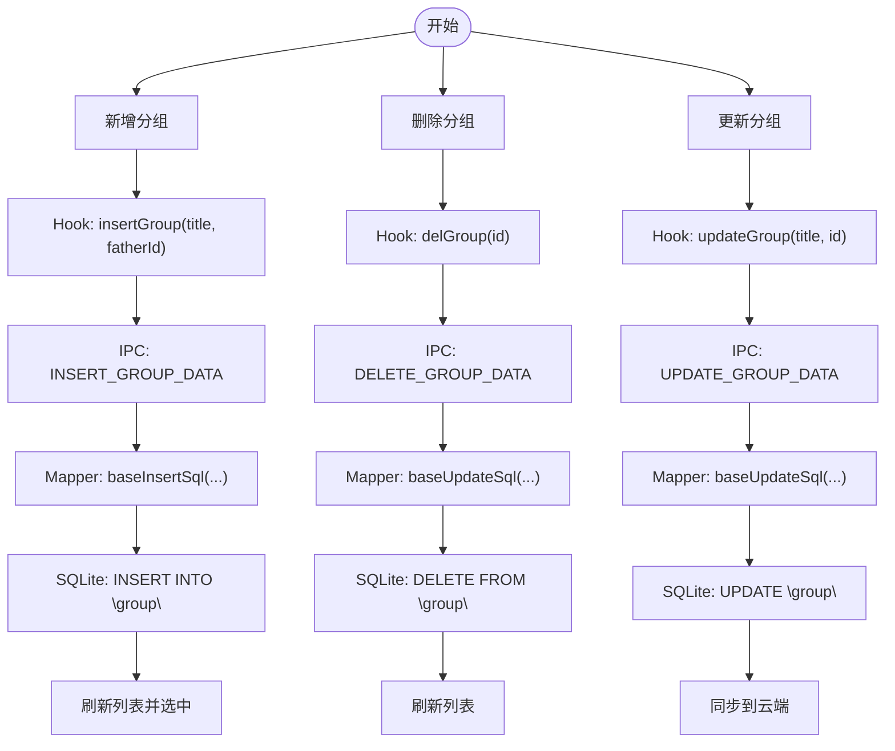
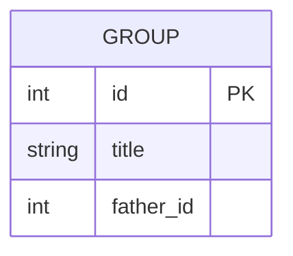
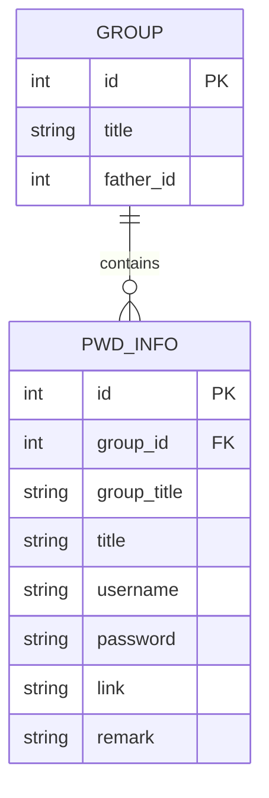
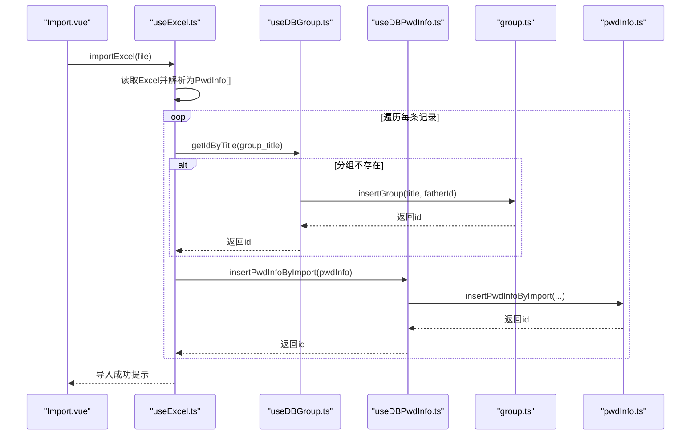
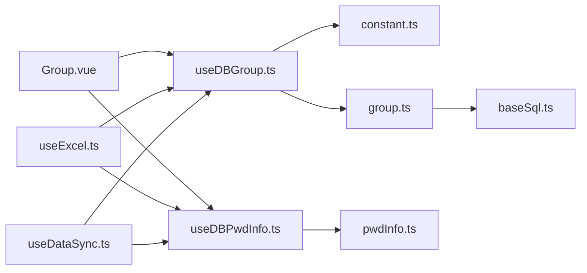

# 分组信息Mapper

<cite>
**本文档引用的文件**
- [group.ts](file://electron/db/sqlite/mapper/group.ts)
- [baseSql.ts](file://electron/db/sqlite/components/baseSql.ts)
- [initSql.ts](file://electron/db/sqlite/components/initSql.ts)
- [constant.ts](file://electron/constant.ts)
- [useDBGroup.ts](file://src/hooks/useDBGroup.ts)
- [Group.vue](file://src/components/indexview/Group.vue)
- [type.ts](file://src/components/type.ts)
- [useDataSync.ts](file://src/hooks/useDataSync.ts)
- [pwdInfo.ts](file://electron/db/sqlite/mapper/pwdInfo.ts)
- [useDBPwdInfo.ts](file://src/hooks/useDBPwdInfo.ts)
- [useExcel.ts](file://src/hooks/useExcel.ts)
- [Import.vue](file://src/components/topMenu/Import.vue)
</cite>

## 目录
1. [简介](#简介)
2. [项目结构](#项目结构)
3. [核心组件](#核心组件)
4. [架构总览](#架构总览)
5. [详细组件分析](#详细组件分析)
6. [依赖分析](#依赖分析)
7. [性能考虑](#性能考虑)
8. [故障排查指南](#故障排查指南)
9. [结论](#结论)
10. [附录](#附录)

## 简介
本文件围绕“分组信息Mapper”展开，系统性阐述PwdGroup数据模型、分组管理的CRUD实现原理、分组树形结构的存储与层级查询、分组与密码信息的关联关系、权限控制机制（基于现有代码的可观察行为）、以及分组导入导出功能的实现细节。文档以Electron主进程侧的SQLite Mapper为核心，结合前端Hook与视图层交互，形成完整的数据流与控制流说明。

## 项目结构
分组相关代码主要分布在以下位置：
- Electron主进程侧SQL映射层：用于封装数据库操作（增删改查）
- 前端Hook层：封装IPC调用，暴露统一的业务方法
- 视图层组件：负责用户交互与事件驱动
- 工具与同步模块：负责导入导出与云端同步

图表来源
- [useDBGroup.ts:1-53](file://src/hooks/useDBGroup.ts#L1-L53)
- [Group.vue:1-333](file://src/components/indexview/Group.vue#L1-L333)
- [useExcel.ts:1-109](file://src/hooks/useExcel.ts#L1-L109)
- [useDataSync.ts:1-324](file://src/hooks/useDataSync.ts#L1-L324)
- [constant.ts:1-63](file://electron/constant.ts#L1-L63)
- [group.ts:1-49](file://electron/db/sqlite/mapper/group.ts#L1-L49)
- [baseSql.ts:1-87](file://electron/db/sqlite/components/baseSql.ts#L1-L87)
- [initSql.ts:1-224](file://electron/db/sqlite/components/initSql.ts#L1-L224)
- [pwdInfo.ts:1-100](file://electron/db/sqlite/mapper/pwdInfo.ts#L1-L100)

章节来源
- [useDBGroup.ts:1-53](file://src/hooks/useDBGroup.ts#L1-L53)
- [group.ts:1-49](file://electron/db/sqlite/mapper/group.ts#L1-L49)
- [baseSql.ts:1-87](file://electron/db/sqlite/components/baseSql.ts#L1-L87)
- [initSql.ts:1-224](file://electron/db/sqlite/components/initSql.ts#L1-L224)
- [constant.ts:1-63](file://electron/constant.ts#L1-L63)
- [Group.vue:1-333](file://src/components/indexview/Group.vue#L1-L333)
- [useExcel.ts:1-109](file://src/hooks/useExcel.ts#L1-L109)
- [useDataSync.ts:1-324](file://src/hooks/useDataSync.ts#L1-L324)
- [pwdInfo.ts:1-100](file://electron/db/sqlite/mapper/pwdInfo.ts#L1-L100)

## 核心组件
- PwdGroup数据模型：包含id、title、father_id、pwdList、editFlag等字段，用于承载分组的标识、层级关系与界面编辑状态。
- 分组Mapper：封装对“group”表的增删改查，提供insertGroup、delGroup、updateGroup、listGroup、getIdByTitle等方法。
- 基础SQL封装：提供baseListSql、baseGetSql、baseInsertSql、baseUpdateSql等通用方法，统一异常处理与返回值约定。
- 初始化脚本：负责创建“group”、“pwd_info”等表，并插入默认分组与演示数据。
- 前端Hook：通过IPC常量与主进程通信，暴露insertGroup、delGroup、updateGroup、listGroup、getIdByTitle等方法。
- 视图层：Group.vue负责分组的新增、重命名、删除、拖拽移动等交互，并与Hook层协作完成数据持久化与同步。

章节来源
- [type.ts:76-88](file://src/components/type.ts#L76-L88)
- [group.ts:1-49](file://electron/db/sqlite/mapper/group.ts#L1-L49)
- [baseSql.ts:9-81](file://electron/db/sqlite/components/baseSql.ts#L9-L81)
- [initSql.ts:48-105](file://electron/db/sqlite/components/initSql.ts#L48-L105)
- [useDBGroup.ts:13-52](file://src/hooks/useDBGroup.ts#L13-L52)
- [Group.vue:29-158](file://src/components/indexview/Group.vue#L29-L158)

## 架构总览
分组管理采用“前端Hook + IPC + 主进程Mapper”的三层架构：
- 前端通过useDBGroup.ts发起IPC请求，携带参数与回调约定
- 主进程constant.ts定义IPC通道名，确保前后端一致
- 主进程group.ts作为Mapper，调用baseSql.ts执行SQL，返回结果或lastInsertRowid
- 视图层Group.vue监听事件、绑定交互，触发Hook层方法
- 同步模块useDataSync.ts在云端同步时，使用Mapper进行全量覆盖式导入/导出

图表来源
- [Group.vue:99-124](file://src/components/indexview/Group.vue#L99-L124)
- [useDBGroup.ts:15-18](file://src/hooks/useDBGroup.ts#L15-L18)
- [constant.ts:22-28](file://electron/constant.ts#L22-L28)
- [group.ts:7-11](file://electron/db/sqlite/mapper/group.ts#L7-L11)
- [baseSql.ts:35-49](file://electron/db/sqlite/components/baseSql.ts#L35-L49)

## 详细组件分析

### PwdGroup数据模型
- 字段说明
  - id：分组唯一标识，自增主键
  - title：分组名称
  - father_id：父分组ID，0表示顶级分组
  - pwdList：该分组下的密码条目集合（仅在前端模型中出现）
  - editFlag：编辑状态标记（仅在前端模型中出现）

图表来源
- [type.ts:76-88](file://src/components/type.ts#L76-L88)
- [type.ts:51-67](file://src/components/type.ts#L51-L67)

章节来源
- [type.ts:76-88](file://src/components/type.ts#L76-L88)
- [type.ts:51-67](file://src/components/type.ts#L51-L67)

### 分组CRUD实现原理
- 新增分组
  - 前端：Group.vue触发insertGroup，传入title与fatherId（通常为0）
  - Hook：通过IPC调用constant.ts中定义的通道名
  - Mapper：调用baseInsertSql执行INSERT语句，返回lastInsertRowid
  - 后续：刷新列表并选中新分组，触发云端同步
- 删除分组
  - 前端：Group.vue在确认无密码条目或二次确认后调用delGroup
  - Hook：IPC调用DEL语句
  - Mapper：执行DELETE FROM "group" WHERE id=?
  - 后续：刷新列表并清空当前分组
- 更新分组
  - 前端：Group.vue进入编辑模式，调用updateGroup(title, id)
  - Hook：IPC调用UPDATE语句
  - Mapper：执行UPDATE "group" SET title=? WHERE id=?
  - 后续：同步到云端
- 查询分组
  - 前端：listGroup获取全部分组
  - Mapper：执行SELECT * FROM "group"
  - 另有getIdByTitle按title查询id

图表来源
- [Group.vue:99-158](file://src/components/indexview/Group.vue#L99-L158)
- [useDBGroup.ts:15-38](file://src/hooks/useDBGroup.ts#L15-L38)
- [constant.ts:22-28](file://electron/constant.ts#L22-L28)
- [group.ts:7-48](file://electron/db/sqlite/mapper/group.ts#L7-L48)
- [baseSql.ts:35-81](file://electron/db/sqlite/components/baseSql.ts#L35-L81)

章节来源
- [Group.vue:99-158](file://src/components/indexview/Group.vue#L99-L158)
- [useDBGroup.ts:15-38](file://src/hooks/useDBGroup.ts#L15-L38)
- [group.ts:7-48](file://electron/db/sqlite/mapper/group.ts#L7-L48)
- [baseSql.ts:35-81](file://electron/db/sqlite/components/baseSql.ts#L35-L81)

### 分组树形结构存储与层级查询
- 存储方式
  - 使用“group”表，包含id、title、father_id三列
  - 通过father_id建立父子关系；0代表顶级分组
- 层级查询
  - 当前Mapper未提供专门的层级查询方法，前端通过listGroup获取所有分组后自行构建树形结构
  - 若需深度查询，可在主进程扩展Mapper，增加递归查询或CTE查询（当前仓库未实现）
- 默认分组
  - 初始化脚本插入一条默认分组，id=1，title='默认分组'，father_id=0

图表来源
- [initSql.ts:52-57](file://electron/db/sqlite/components/initSql.ts#L52-L57)
- [group.ts:37-48](file://electron/db/sqlite/mapper/group.ts#L37-L48)

章节来源
- [initSql.ts:52-57](file://electron/db/sqlite/components/initSql.ts#L52-L57)
- [initSql.ts:209-215](file://electron/db/sqlite/components/initSql.ts#L209-L215)
- [group.ts:37-48](file://electron/db/sqlite/mapper/group.ts#L37-L48)

### 分组与密码信息的关联关系
- 关联字段
  - “pwd_info”表包含group_id与group_title两列，分别指向分组ID与分组标题
- 关联行为
  - 新增密码条目时，需要传入group_id与group_title
  - 拖拽移动密码条目到新分组时，更新其group_id与group_title并持久化
- 删除分组策略
  - 删除前统计该分组下密码条目数量，若大于0则提示二次确认并删除对应密码条目后再删除分组

图表来源
- [initSql.ts:59-71](file://electron/db/sqlite/components/initSql.ts#L59-L71)
- [Group.vue:139-158](file://src/components/indexview/Group.vue#L139-L158)
- [pwdInfo.ts:12-29](file://electron/db/sqlite/mapper/pwdInfo.ts#L12-L29)

章节来源
- [initSql.ts:59-71](file://electron/db/sqlite/components/initSql.ts#L59-L71)
- [Group.vue:139-158](file://src/components/indexview/Group.vue#L139-L158)
- [pwdInfo.ts:12-29](file://electron/db/sqlite/mapper/pwdInfo.ts#L12-L29)

### 权限控制机制
- 当前代码未体现针对分组的显式权限控制逻辑
- 可观察行为
  - 删除分组前会检查该分组下是否存在密码条目，存在则要求二次确认
  - 拖拽移动密码条目时，若目标分组与当前分组相同则忽略操作
- 建议
  - 若未来引入用户权限体系，可在Mapper层增加基于用户上下文的过滤条件，或在Hook层加入鉴权前置检查

章节来源
- [Group.vue:139-158](file://src/components/indexview/Group.vue#L139-L158)
- [Group.vue:178-212](file://src/components/indexview/Group.vue#L178-L212)

### 分组导入导出功能实现细节
- 导出
  - useExcel.ts导出所有密码条目，包含分组标题、标题、用户名、密码、链接、说明
  - 使用XLSX库生成工作簿并下载
- 导入
  - Import.vue提供文件选择与模板下载
  - useExcel.ts读取Excel，逐行解析为PwdInfo对象
  - 根据group_title查询分组id，不存在则新建分组并回填group_id
  - 调用密码信息Mapper的导入接口插入数据
- 同步
  - useDataSync.ts支持云端全量同步
  - 下载时先删除本地所有分组，再批量插入远端分组列表
  - 上传时遍历本地分组，收集所有密码条目，打包为OssSyncObj后上传

图表来源
- [Import.vue:1-73](file://src/components/topMenu/Import.vue#L1-L73)
- [useExcel.ts:44-84](file://src/hooks/useExcel.ts#L44-L84)
- [useDBGroup.ts:45-49](file://src/hooks/useDBGroup.ts#L45-L49)
- [group.ts:7-16](file://electron/db/sqlite/mapper/group.ts#L7-L16)
- [pwdInfo.ts:12-16](file://electron/db/sqlite/mapper/pwdInfo.ts#L12-L16)

章节来源
- [Import.vue:1-73](file://src/components/topMenu/Import.vue#L1-L73)
- [useExcel.ts:22-84](file://src/hooks/useExcel.ts#L22-L84)
- [useDBGroup.ts:45-49](file://src/hooks/useDBGroup.ts#L45-L49)
- [group.ts:7-16](file://electron/db/sqlite/mapper/group.ts#L7-L16)
- [pwdInfo.ts:12-16](file://electron/db/sqlite/mapper/pwdInfo.ts#L12-L16)
- [useDataSync.ts:110-128](file://src/hooks/useDataSync.ts#L110-L128)

## 依赖分析
- 组件耦合
  - Group.vue强依赖useDBGroup.ts与useDBPwdInfo.ts
  - useDBGroup.ts依赖constant.ts中的IPC通道名与group.ts
  - group.ts依赖baseSql.ts进行SQL执行
  - useExcel.ts依赖useDBGroup.ts与useDBPwdInfo.ts
  - useDataSync.ts依赖useDBGroup.ts与useDBPwdInfo.ts，用于全量同步
- 外部依赖
  - better-sqlite3：用于SQLite数据库访问
  - xlsx：用于Excel导入导出

图表来源
- [Group.vue:10-32](file://src/components/indexview/Group.vue#L10-L32)
- [useDBGroup.ts:1-11](file://src/hooks/useDBGroup.ts#L1-L11)
- [constant.ts:22-28](file://electron/constant.ts#L22-L28)
- [group.ts:1](file://electron/db/sqlite/mapper/group.ts#L1)
- [baseSql.ts:1](file://electron/db/sqlite/components/baseSql.ts#L1)
- [useExcel.ts:1-7](file://src/hooks/useExcel.ts#L1-L7)
- [useDataSync.ts:1-17](file://src/hooks/useDataSync.ts#L1-L17)
- [pwdInfo.ts:1](file://electron/db/sqlite/mapper/pwdInfo.ts#L1)

章节来源
- [Group.vue:10-32](file://src/components/indexview/Group.vue#L10-L32)
- [useDBGroup.ts:1-11](file://src/hooks/useDBGroup.ts#L1-L11)
- [constant.ts:22-28](file://electron/constant.ts#L22-L28)
- [group.ts:1](file://electron/db/sqlite/mapper/group.ts#L1)
- [baseSql.ts:1](file://electron/db/sqlite/components/baseSql.ts#L1)
- [useExcel.ts:1-7](file://src/hooks/useExcel.ts#L1-L7)
- [useDataSync.ts:1-17](file://src/hooks/useDataSync.ts#L1-L17)
- [pwdInfo.ts:1](file://electron/db/sqlite/mapper/pwdInfo.ts#L1)

## 性能考虑
- SQL执行
  - 基础封装统一使用prepare+run，避免重复编译SQL
  - 批量导入时建议使用事务（当前baseSql.ts提供事务注释，但group.ts未启用）
- 查询优化
  - 当前未对“group”表建立索引；如father_id查询频繁，可考虑添加索引
- 前端渲染
  - 分组列表较大时，建议虚拟滚动与懒加载
- 同步策略
  - useDataSync.ts采用全量覆盖式同步，适合数据量较小场景；大规模数据建议增量同步

## 故障排查指南
- 新增分组无返回
  - 检查IPC通道名是否与constant.ts一致
  - 检查group.ts的INSERT SQL语法与参数顺序
- 删除分组失败
  - 确认传入id有效
  - 检查是否存在外键约束导致删除失败（当前DDL未声明外键约束）
- 导入Excel失败
  - 确认Excel列名与useExcel.ts中的字符串匹配
  - 检查分组标题是否为空，空标题将回退为默认分组
- 云端同步异常
  - 检查useDataSync.ts中的OSS配置与网络连通性
  - 确认本地版本号与远端版本号比较逻辑

章节来源
- [constant.ts:22-28](file://electron/constant.ts#L22-L28)
- [group.ts:7-16](file://electron/db/sqlite/mapper/group.ts#L7-L16)
- [useExcel.ts:44-84](file://src/hooks/useExcel.ts#L44-L84)
- [useDataSync.ts:79-131](file://src/hooks/useDataSync.ts#L79-L131)

## 结论
本文件梳理了分组信息Mapper的完整实现路径：从PwdGroup数据模型、CRUD操作到树形结构存储与层级查询、分组与密码信息的关联关系、权限控制现状与建议，以及导入导出与云端同步的实现细节。当前实现简洁清晰，满足基础需求；在性能与扩展性方面可通过事务、索引与增量同步进一步优化。

## 附录
- 关键方法与文件映射
  - 新增分组：Group.vue -> useDBGroup.ts -> constant.ts -> group.ts -> baseSql.ts
  - 删除分组：Group.vue -> useDBGroup.ts -> constant.ts -> group.ts -> baseSql.ts
  - 更新分组：Group.vue -> useDBGroup.ts -> constant.ts -> group.ts -> baseSql.ts
  - 查询分组：Group.vue -> useDBGroup.ts -> constant.ts -> group.ts -> baseSql.ts
  - 导入Excel：Import.vue -> useExcel.ts -> useDBGroup.ts -> group.ts -> useDBPwdInfo.ts -> pwdInfo.ts
  - 云端同步：useDataSync.ts -> useDBGroup.ts -> group.ts -> useDBPwdInfo.ts -> pwdInfo.ts